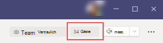

GastfunktionalitätWhat the guest experience is like
=================================

Wenn ein Gast zur Teilnahme an einem Team eingeladen wird, erhält er eine Willkommens-e-Mail-Nachricht.When a guest is invited to join a team, they receive a welcome email message. Diese Nachricht enthält einige Informationen über das Team und was Sie jetzt erwarten können, wenn Sie Mitglied sind.This message includes some information about the team and what to expect now that they're a member. Der Gast muss die Einladung akzeptieren, indem er in der e-Mail-Nachricht **Microsoft Teams öffnen** auswählt, bevor er auf das Team und seine Kanäle zugreifen kann.The guest must accept the invitation by selecting **Open Microsoft Teams** in the email message before they can access the team and its channels.
    

    
Alle Teammitglieder sehen eine Nachricht in einem Kanal-Thread. Darin werden die Mitglieder darüber informiert, dass der Teambesitzer einen Gast hinzugefügt hat, und der Name des Gasts wird angezeigt.All team members see a message in the channel thread announcing that the team owner has added a guest and providing the guest's name. Jeder im Team kann also sofort sehen, bei welchem Mitglied es sich um einen Gast handelt.Everyone on the team can identify easily who is a guest. Wie im folgenden Screenshot eines Beispiel Teams zu sehen ist, wird in einem Banner "dieses Team hat Gäste" angezeigt, und neben dem Namen jedes Gasts wird eine **(Gast-)** Beschriftung angezeigt.As shown in the following screenshot of a sample team, a banner indicates "This team has guests" and a **(Guest)** label appears next to each guest's name.
    

## Vergleich von Teammitgliedern und Gast FunktionenComparison of team member and guest capabilities

In der folgenden Tabelle werden die für die Teammitglieder und ihre Gäste des Unternehmens verfügbaren Funktionen für Teams verglichen.The following table compares the Teams functionality available for an organization's team members and its guests.

|**Funktionen in Teams****Capability in Teams**|**Teams-Benutzer in der Organisation****Teams user in the organization**|**Gastbenutzer****Guest user**|
|:-----|:-----|:-----|
|Kanal erstellenCreate a channel     *Teambesitzer steuern diese Einstellung.**Team owners control this setting.*    |||
|An einem privaten Chat teilnehmenParticipate in a private chat    |||
|An einer Kanalunterhaltung teilnehmenParticipate in a channel conversation    |||
|Nachrichten posten, löschen und bearbeitenPost, delete, and edit messages    |||
|Kanaldatei freigebenShare a channel file    |||
|Chatdatei freigebenShare a chat file    |||
|Apps hinzufügen (Registerkarten, Bots oder Connectors)Add apps (tabs, bots, or connectors)    |||
|Erstellen von Besprechungen oder ZugriffsplänenCreate meetings or access schedules    |||
|Access OneDrive for Business-SpeicherAccess OneDrive for Business storage    |||
|Mandantenweite Gastzugriffsrichtlinien für Teams/Kanäle erstellenCreate tenant-wide and teams/channels guest access policies    |||
|Benutzer außerhalb der Office 365-Mandantendomäne einladenInvite a user outside the Office 365 tenant's domain    *Teambesitzer steuern diese Einstellung.**Team owners control this setting.*      |||
|Team erstellenCreate a team    |||
|Öffentliches Team finden und daran teilnehmenDiscover and join a public team    |||
|Organisationschat anzeigenView organization chart    |||
|Verwenden der Inline ÜbersetzungUse inline translation    |||
|Teambesitzer werdenBecome team owner    |||
   
In der folgenden Tabelle sind die für Gäste verfügbaren Anruf-und besprechungsfeatures im Vergleich zu anderen Benutzertypen aufgeführt.The following table shows the calling and meeting features available to guests, compared to other types of users.

| AnruffunktionCalling feature | GästeGuest | E1-und E3-BenutzerE1 and E3 user | E5 und Enterprise-VoIP-BenutzerE5 and Enterprise Voice user |
| --------------- | ----- | -------------- | -------------- |
| VoIP-AnrufeVOIP calling | JaYes | Ja Yes | Ja Yes |
| GruppenanrufeGroup calling | JaYes | Ja Yes | Ja Yes |
| Unterstützte zentrale Anrufsteuerungen (halten, stumm schalten, Video ein/aus, Bildschirmübertragung)Core call controls supported (hold, mute, video on/off, screen sharing) | JaYes | Ja Yes | Ja Yes |
| ÜbergabezielTransfer target | JaYes | Ja Yes | Ja Yes |
| Kann einen Anruf übertragenCan transfer a call | JaYes | Ja Yes | Ja Yes |
| Kann beratend übertragenCan consultative transfer | JaYes | Ja Yes | Ja Yes |
| Kann andere Benutzer zu einem Anruf über VoIP hinzufügenCan add other users to a call via VOIP | JaYes | Ja Yes | Ja Yes |
| Kann Nutzer per Telefonnummer zu einem Anruf hinzufügenCan add users by phone number to a call | NeinNo | NeinNo | JaYes |
| Ziel weiterleitenForward target | NeinNo | JaYes | Ja Yes |
| Anrufgruppen ZielCall group target | NeinNo | JaYes | Ja Yes |
| Unbeantwortetes ZielUnanswered target | NeinNo | JaYes | Ja Yes |
| Kann das Ziel eines Föderations Anrufs seinCan be the target of a federated call | NeinNo | JaYes | Ja Yes |
| Kann einen Verbund Anruf führenCan make a federated call | NeinNo | JaYes | Ja Yes |
| Kann Ihre Anrufe sofort weiterleitenCan immediately forward their calls | NeinNo | NeinNo | JaYes |
| Können gleichzeitig anrufenCan simultaneously ring their calls | NeinNo | NeinNo | JaYes |
| Kann Ihre unbeantworteten Anrufe weiterleitenCan route their unanswered calls | NeinNo | NeinNo | JaYes |
| Verpasste Anrufe können an Voicemail weitergeleitet werdenMissed calls can go to voicemail | NeinNo | Nr.1No1 |JaYes |
| Haben Sie eine Telefonnummer, mit der Sie Anrufe empfangen könnenHave a phone number that can receive calls | NeinNo | NeinNo | JaYes |
| Kann Telefonnummern anrufenCan dial phone numbers | NeinNo | NeinNo | JaYes |
| Kann auf Anrufeinstellungen zugreifenCan access call settings | NeinNo | NeinNo | JaYes |
| Kann Voicemail-Ansage ändernCan change voicemail greeting | NeinNo | Nr.1No1 | JaYes |
| Kann Klingeltöne ändernCan change ringtones | NeinNo | NeinNo  | JaYes |
| Unterstützt TTYSupports TTY | NeinNo | NeinNo | JaYes |
| Kann Stellvertretungen habenCan have delegates | NeinNo | NeinNo | JaYes |
|  Kann eine Stellvertretung seinCan be a delegate | NeinNo | NeinNo | JaYes |

1 dieses Feature wird in Kürze zur Verfügung stehen.1 This feature will be available soon.

> [!NOTE]
> Office 365-Administratoren steuern die für Gäste verfügbaren Funktionen.Office 365 admins control the features available to guests. 

## Häufig gestellte FragenFrequently asked questions

### Wie verlasse ich eine Organisation, zu der ich eingeladen wurde?How do I leave an organization that I've been invited to?
Wenn Sie zu einer Organisation eingeladen wurden, in der Sie nicht Gast sein möchten, können Sie die Organisation belassen.If you've been invited to an organization that you don't want to be a guest of, you can choose to leave the organization. Weitere Informationen finden Sie unter [verlassen einer Organisation als Gastbenutzer](https://docs.microsoft.com/azure/active-directory/b2b/leave-the-organization).For more information, go to [Leave an organization as a guest user](https://docs.microsoft.com/azure/active-directory/b2b/leave-the-organization). Alternativ können Sie den Administrator der Organisation bitten, Sie von Ihrem Mandanten zu entfernen.Alternatively, you can ask the admin of the organization to remove you from their tenant. Beachten Sie, dass Sie in beiden Fällen erneut zu dem Mandanten eingeladen werden müssen, wenn Sie zukünftig auf die Organisation zugreifen möchten.Note that in either case you'll need to be re-invited to the tenant if you want to access the organization in the future.

### Haben Gäste die gleichen Fähigkeiten wie Teammitglieder?Do guests have the same capabilities as team members?
NummerNo. Weitere Informationen dazu, was ein Gast tun kann und was nicht, finden Sie unter [Vergleich von Teammitgliedern und Gast Funktionen](#comparison-of-team-member-and-guest-capabilities) in diesem Artikel.For more information about what a guest can and cannot do, go to [Comparison of team member and guest capabilities](#comparison-of-team-member-and-guest-capabilities) in this article.

### Haben Gästezugriff auf OneDrive for Business?Do guests have access to OneDrive for Business?
NummerNo.

### Haben Gästezugriff auf SharePoint-Dateien?Do guests have access to SharePoint files?
Ja.Yes.

### Können Gäste in Dateien suchen?Can guests search within files?
NummerNo.

### Können Gäste Dateien anfügen?Can guests attach files?
Ja, ein Gast kann Dateien auf diese zwei Arten anfügen:Yes, a guest can attach files in these two ways:

   - Wählen Sie im linken Bereich **Dateien** aus, und navigieren Sie dann zum Dateispeicherort.Select **Files** in the left pane, and then browse to the file location.
   - Laden Sie Dateien von Ihrem Computer hoch.Upload files from their computer.

### Kann ein Gast eine Datei in einem privaten Chat herunterladen?Can a guest download a file in a private chat?
Ja, Sie können eine Datei von einem Mitglied in einem privaten Chat empfangen und dann auf Ihren Desktop herunterladen.Yes, they can receive a file from a member in a private chat, and then download it to their desktop.
