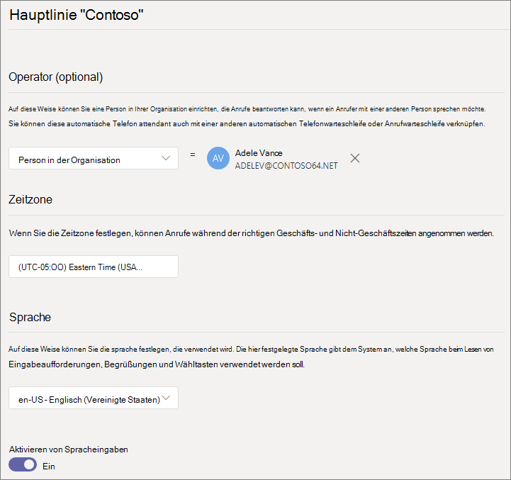
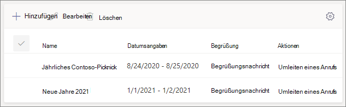

## Videodemonstration

Dieses Video zeigt ein einfaches Beispiel für das Erstellen einer automatischen Telefonzentrale in Microsoft Teams.

> [!VIDEO https://www.microsoft.com/videoplayer/embed/RWEnCG?autoplay=false]

### Führen Sie die folgenden Schritte aus, um Ihre automatische Telefonzentrale einzurichten.

# [Schritt 1 – Allgemeine Informationen](#tab/general-info)

## Allgemeine Informationen

1. Geben Sie im Feld oben einen Namen für die automatische Telefonzentrale ein.

2. Geben Sie zum Festlegen eines Operators das Ziel für Aufrufe an den Operator an. Diese Bezeichnung ist optional (wird jedoch empfohlen). Legen **Sie die** Operatoroption fest, damit Anrufer aus den Menüs ausbrechen und mit einer bestimmten Person sprechen können.

3. Geben Sie die Zeitzone für diese automatische Telefonzentrale an. Die Zeitzone wird für die Berechnung der Geschäftszeiten verwendet, wenn Sie [einen separaten Anruffluss für Nachstunden erstellen](?tabs=after-hours).

4. Geben Sie eine [unterstützte Sprache](../create-a-phone-system-auto-attendant-languages.md) für diese automatische Telefonzentrale an. Dies ist die Sprache, die für vom System generierte Sprachansagen verwendet wird.

5. Wählen Sie aus, ob Sie Spracheingaben aktivieren möchten. Wenn diese Option aktiviert ist, wird der Name jeder Menüoption zu einem Schlüsselwort für die Spracherkennung. Anrufer können z. B. "Eins" sagen, um die Menüoption auszuwählen, die Schlüssel 1 zugeordnet ist, oder sie können "Vertrieb" sagen, um die Menüoption mit dem Namen "Vertrieb" auszuwählen.

   > [!NOTE]
   > Wenn Sie in Schritt 4 eine Sprache auswählen, die keine Spracheingaben unterstützt, wird diese Option deaktiviert.

6. Wählen Sie **"Weiter**" aus.

# [Schritt 2 – Anruffluss](#tab/call-flow)

## Anruffluss

Wählen Sie aus, ob Sie eine Begrüßung wiedergeben möchten, wenn die automatische Telefonzentrale einen Anruf annimmt.

Wenn Sie **"Audiodatei wiedergeben**" auswählen, können Sie die Schaltfläche **Hochladen Datei** verwenden, um eine aufgezeichnete Begrüßungsnachricht hochzuladen, die als Audiodatei gespeichert ist. WAV, .MP3 oder . WMA-Format. Die Aufzeichnung darf nicht größer als 5 MB sein.

Wenn Sie " **Begrüßungsnachricht eingeben** " auswählen, liest das System den eingegebenen Text (bis zu 1000 Zeichen), wenn die automatische Telefonzentrale einen Anruf annimmt.

Wählen Sie aus, wie Sie den Anruf weiterleiten möchten.

Wenn Sie **"Trennen**" auswählen, legt die automatische Telefonzentrale den Anruf auf.

Wenn Sie **"Anruf umleiten**" auswählen, können Sie eines der Ziele für die Anrufweiterleitung auswählen.

Wenn Sie **die Menüoptionen "Wiedergeben**" auswählen, können Sie eine **Audiodatei wiedergeben** oder **eine Begrüßungsnachricht eingeben** und dann zwischen Menüoptionen und Verzeichnissuche wählen.

### Menüoptionen

Weisen Sie für Wähloptionen die 0-9-Tasten auf der Wähltastatur des Telefons einem der Anrufweiterleitungsziele zu. (Die Schlüssel \* (Sternchen) und \# (Pfund) werden vom System reserviert und können nicht neu zugewiesen werden. Wenn Sie eine dieser Tasten drücken, wird das aktuelle Menü wiederholt.)

> [!NOTE]
> Die Taste "#" sichert nur die letzte automatische Telefonzentrale. Sobald die Grenze zu einer neuen automatischen Telefonzentrale überschritten wurde, können Sie mit der #-Taste nicht mehr zur vorherigen Telefonzentrale gelangen.

Schlüsselzuordnungen müssen nicht fortlaufend sein. Es ist möglich, ein Menü mit den Tasten 0, 1 und 3 zu den Optionen zu erstellen, während die Taste 2 nicht verwendet wird.

Es wird empfohlen, den Nullschlüssel dem Operator zuzuordnen, wenn Sie einen konfiguriert haben. Wenn der Operator nicht auf eine Taste festgelegt ist, ist auch der Sprachbefehl "Operator" deaktiviert.

Geben Sie für jede Menüoption die folgenden Einstellungen an:

- **Wähltaste** – die Taste auf der Telefontastatur, um auf diese Option zuzugreifen. Wenn Spracheingaben verfügbar sind, können Anrufer auch diese Nummer sagen, um auf die Option zuzugreifen.

- **Sprachbefehl** – Definiert den Sprachbefehl, den ein Anrufer für den Zugriff auf diese Option erteilen kann, wenn Spracheingaben aktiviert sind. Sie kann mehrere Wörter wie "Kundendienst" oder "Vorgänge und Gründe" enthalten. Beispielsweise kann der Aufrufer 2 drücken, "zwei" sagen oder "Vertrieb" sagen, um die Option auszuwählen, die den beiden Tasten zugeordnet ist. Dieser Text wird auch durch Text-zu-Sprache für die Bestätigungsaufforderung des Diensts gerendert. Dies kann etwa "Durchstellung Ihres Anrufs an den Vertrieb" lauten.

- **Umleiten an** – das Anrufweiterleitungsziel, das verwendet wird, wenn Anrufer diese Option auswählen. Wenn Sie zu einer automatischen Telefonzentrale oder Anrufwarteschleife umleiten, wählen Sie das zugehörige Ressourcenkonto aus.

### Verzeichnissuche

Wenn Sie Zielorten Wählschlüssel zuweisen, empfiehlt es sich, für die **Verzeichnissuche** **"Keine**" auszuwählen. Wenn ein Anrufer versucht, einen Namen oder eine Erweiterung mithilfe von Schlüsseln zu wählen, die bestimmten Zielen zugewiesen sind, wird er möglicherweise unerwartet an ein Ziel weitergeleitet, bevor er die Eingabe des Namens oder der Erweiterung abgeschlossen hat. Es wird empfohlen, dass Sie eine separate automatische Telefonzentrale für die Verzeichnissuche erstellen und ihre automatische Haupttelefonzentrale mit einer Wähltaste verknüpfen.

Wenn Sie keine Wählschlüssel zugewiesen haben, wählen Sie eine Option für die **Verzeichnissuche** aus.

**Namensanwahl** – Wenn Sie diese Option aktivieren, können Anrufer den Namen des Benutzers sagen oder auf der Wähltastatur des Telefons eingeben. Jeder Onlinebenutzer oder jeder Benutzer, der lokal mit Skype for Business Server gehostet wird, ist ein berechtigter Benutzer und kann mit "Dial by name" gefunden werden. (Sie können festlegen, wer im Verzeichnis auf der Seite " [Wählbereich](?tabs=#dial-scope) " enthalten ist und wer nicht.)

**Dial by extension** – Wenn Sie diese Option aktivieren, können Anrufer eine Verbindung mit Benutzern in Ihrer Organisation herstellen, indem sie ihre Telefonerweiterung wählen. Jeder Onlinebenutzer oder jeder Benutzer, der lokal mithilfe von Skype for Business Server gehostet wird, ist ein berechtigter Benutzer und kann **mit der Erweiterung "Dial"** gefunden werden. (Sie können festlegen, wer im Verzeichnis auf der Seite " [Wählbereich](?tabs=dial-scope) " enthalten ist und wer nicht.)

Benutzer, die Sie für die Durchwahl zur Verfügung stellen möchten, benötigen eine Erweiterung, die als Teil eines der folgenden Telefonattribute in Active Directory definiert (und über Azure AD Verbinden synchronisiert) oder Azure Active Directory. Weitere Informationen finden Sie unter ["Benutzer einzeln oder massenhin hinzufügen](/microsoft-365/admin/add-users/add-users)".

- OfficePhone/TelephoneNumber (AD und Azure AD)
- HomePhone (AD)
- Mobiles/MobilePhone (AD und Azure AD)
- OtherTelephone (AD)

Das erforderliche Format zum Eingeben der Erweiterung in das Feld "Benutzertelefonnummer" kann eines der folgenden Formate sein:

- *+\<phone number>;ext=\<extension>*
- *+\<phone number>X\<extension>*
- *X\<extension>*

- Beispiel 1: Set-MsolUser -UserPrincipalName usern@domain.com -Phonenumber "+15555555678;ext=5678"
- Beispiel 2: Set-MsolUser -UserPrincipalName usern@domain.com -Phonenumber "+15555555678x5678"
- Beispiel 3: Set-MsolUser -UserPrincipalName usern@domain.com -Phonenumber "x5678"

Sie können die Erweiterung im [Microsoft 365 Admin Center](https://admin.microsoft.com/) oder [im Azure Active Directory Admin Center](https://aad.portal.azure.com) festlegen. Es kann bis zu 12 Stunden dauern, bis Änderungen für automatische Telefonzentralen und Anrufwarteschleifen verfügbar sind.

> [!NOTE]
> Wenn Sie sowohl die Funktionen **"Dial by name** " als auch **"Dial by extension** " verwenden möchten, können Sie ihrer automatischen Hauptzentrale eine Wähltaste zuweisen, um eine automatische Telefonzentrale zu erreichen, die für **"Dial by name**" aktiviert ist. Innerhalb dieser automatischen Telefonzentrale können Sie die 1 Taste (der keine Buchstaben zugeordnet sind) zuweisen, um die automatische Telefonzentrale " **Dial by extension** " zu erreichen.

Weitere Informationen finden Sie unter ["Wähl- und Sprachreferenz"](../dial-voice-reference.md).

Nachdem Sie eine **Verzeichnissuchoption** ausgewählt haben, wählen Sie **"Weiter**" aus.

# [Schritt 3 – Nach Feierabend](#tab/after-hours)

## Anruffluss nach Feierabend

Geschäftszeiten können für jede automatische Telefonzentrale festgelegt werden. Wenn geschäftszeiten nicht festgelegt sind, werden alle Tage und alle Stunden am Tag als Geschäftszeiten betrachtet, da standardmäßig ein 24/7-Zeitplan festgelegt ist. Geschäftszeiten können mit Zeitumbrüchen während des Tages festgelegt werden, und alle Stunden, die nicht als Geschäftszeiten festgelegt sind, werden als Nachstunden betrachtet. Sie können unterschiedliche Optionen für die Behandlung eingehender Anrufe und Begrüßungen für Nachstunden festlegen.

Je nachdem, wie Sie Ihre automatischen Telefonzentralen und Anrufwarteschleifen konfiguriert haben, müssen Sie möglicherweise nur die Anrufweiterleitung nach Feierabend für automatische Telefonzentralen mit direkten Telefonnummern angeben.

Wenn Sie ein separates Anrufrouting für Anrufer nach Feierabend wünschen, geben Sie Ihre Geschäftszeiten für jeden Tag an. Wählen Sie **"Neue Uhrzeit hinzufügen"** aus, um mehrere Stundensätze für einen bestimmten Tag anzugeben, z. B. eine Mittagspause.

Nachdem Sie Ihre Geschäftszeiten angegeben haben, wählen Sie Ihre Anrufweiterleitungsoptionen für nach Feierabend aus. Es stehen die gleichen Optionen zur Verfügung wie für das oben angegebene Anrufrouting zu den Geschäftszeiten.

Wählen Sie **"Weiter** " aus, wenn Sie fertig sind.

# [Schritt 4 – Feiertage](#tab/holidays)

## Anrufflüsse während der Feiertage

Ihre automatische Telefonzentrale kann für jeden [von Ihnen eingerichteten Feiertag](../set-up-holidays-in-teams.md) einen Anruffluss haben. Sie können jeder automatische Telefonzentrale bis zu 20 geplante Feiertage hinzufügen.

1. Wählen Sie auf der Seite "Anrufeinstellungen für Feiertage" die Option **"Hinzufügen"** aus.

2. Geben Sie einen Namen für diese Feiertagseinstellung ein.

3. Wählen Sie in der Dropdownliste " **Feiertag** " den Feiertag aus, den Sie verwenden möchten.

4. Wählen Sie die Art der Begrüßung aus, die Sie verwenden möchten.

    

5. Wählen Sie aus, ob Sie den Anruf **trennen** oder **umleiten** möchten.

6. Wenn Sie sich für die Umleitung entschieden haben, wählen Sie das Anrufweiterleitungsziel für den Anruf aus.

7. Klicken Sie auf **Speichern**.

Wiederholen Sie den Vorgang nach Bedarf für jeden zusätzlichen Feiertag.

Wenn Sie alle Ihre Feiertage hinzugefügt haben, wählen Sie **"Weiter**" aus.

# [Schritt 5 – Wählbereich](#tab/dial-scope)

## Wählbereich

Der *Wählbereich* definiert, welche Benutzer im Verzeichnis verfügbar sind, wenn ein Anrufer eine Namens- oder Durchwahlnummer verwendet. Der Standardwert von **"Alle Onlinebenutzer**" umfasst alle Benutzer in Ihrer Organisation, die Onlinebenutzer sind oder lokal mithilfe von Skype for Business Server gehostet werden.

Sie können bestimmte Benutzer ein- oder ausschließen, indem Sie unter **"Ein-** oder **Ausschließen**" die **Option "Benutzerdefinierte Benutzergruppe**" auswählen und eine oder mehrere Microsoft 365 Gruppen, Verteilerlisten oder Sicherheitsgruppen auswählen. Beispielsweise können Sie Führungskräfte in Ihrer Organisation aus dem Wählverzeichnis ausschließen. (Wenn sich ein Benutzer in beiden Listen befindet, wird er aus dem Verzeichnis ausgeschlossen.)

> [!NOTE]
> Es kann bis zu 36 Stunden dauern, bis ein neuer Benutzer den Namen im Verzeichnis aufgeführt hat.

Wenn Sie mit dem Festlegen des Wählbereichs fertig sind, wählen Sie **"Weiter**" aus.

# [Schritt 6 : Ressourcenkonten](#tab/resource-accounts)

## Ressourcenkonten

Allen automatischen Telefonzentralen muss ein Ressourcenkonto zugeordnet sein.  Automatische Telefonzentralen der ersten Ebene benötigen mindestens ein Ressourcenkonto mit einer zugeordneten Dienstnummer. Wenn Sie möchten, können Sie einer automatischen Telefonzentrale mehrere Ressourcenkonten zuweisen, die jeweils eine separate Dienstnummer haben.

Um ein Ressourcenkonto hinzuzufügen, wählen Sie **"Konto hinzufügen"** aus, und suchen Sie nach dem Konto, das Sie hinzufügen möchten. Wählen Sie **"Hinzufügen"** und dann " **Hinzufügen"** aus.

Wenn Sie mit dem Hinzufügen von Ressourcenkonten fertig sind, wählen Sie **"Absenden** " aus, um die automatische Telefonzentralenkonfiguration abzuschließen.

Weitere Informationen finden [Sie unter Verwalten Teams Ressourcenkonten](../manage-resource-accounts.md).

---
