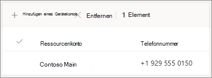

#### Videodemo

Dieses Video zeigt ein einfaches Beispiel für das Erstellen einer automatischen Attendant in Teams.

> [!VIDEO https://www.microsoft.com/videoplayer/embed/RWEnCG?autoplay=false]

#### Bevor Sie beginnen

Holen Sie sich die Servicenummern (Servicenummern sind ein spezieller Typ von Telefonnummern, die von automatischen Telefonanbietern verwendet werden), die Sie für die automatischen Telefonieren benötigen, auf die Sie durch direktes Wählen von außerhalb Ihrer Organisation zugriffen möchten. Dies kann das [Übertragen von Nummern von einem anderen Anbieter oder](../phone-number-calling-plans/transfer-phone-numbers-to-teams.md) das Anfordern neuer [Leistungsnummern umfassen.](../getting-service-phone-numbers.md)

Jeder automatischen Attendant muss eine Lizenz für "Telefonsystem Virtual User" zugewiesen werden. Beim Kauf von Business Voice haben Sie auch eine Reihe von Telefonsystem - Virtual User-Lizenzen erhalten, sodass Sie wahrscheinlich nicht mehr anfordern müssen. Wenn Sie in Zukunft jedoch mehr benötigen, können Sie diese erhalten, indem Sie den Anweisungen unter [Telefonsystem - Virtual User license folgen.](../teams-add-on-licensing/virtual-user.md)

Wenn Sie möchten, dass Ihre automatische Telefonbuchstelle an [Feiertagen](../set-up-holidays-in-teams.md) anders anruft, erstellen Sie die Feiertage, die Sie verwenden möchten, bevor Sie die automatische Telefon attendant erstellen.

#### Führen Sie die folgenden Schritte aus, um Ihre automatische Attendant zu einrichten.

# [Schritt 1   Telefon Nummer](#tab/phone-number)

> [!NOTE]
> Wenn Sie die Schritte zum ersten Einrichten von Business Voice ausführen und Schritt **6: Einrichten** einer automatischen Telefon attendant für die Haupttelefonnummer Ihres Unternehmens ausführen, haben Sie die Schritte auf dieser Registerkarte bereits abgeschlossen. Wechseln zur nächsten Registerkarte: [Allgemeine Informationen zur automatischen Attendant.](?tabs=general-info#steps)

Jede von Ihnen erstellen automatische Attendant erfordert ein Ressourcenkonto. Dies ähnelt einem Benutzerkonto, mit dem Ausnahme, dass das Konto einer automatischen Telefonhalterung oder Anrufwarteschleife und nicht einer Person zugeordnet ist. In diesem Schritt erstellen wir das Konto, weisen ihm eine *Microsoft 365 Telefonsystem - Virtual User-Lizenz* zu und weisen dann eine Dienstnummer zu.

### Erstellen eines Ressourcenkontos

Sie können ein Ressourcenkonto im Teams Admin Center erstellen.

1. Erweitern Sie Teams Admin Center **Organisationsweite** Einstellungen , und klicken Sie dann **auf Ressourcenkonten**.

2. Klicken Sie auf **Hinzufügen**.

3. Geben Sie **im Bereich Ressourcenkonto hinzufügen** die Informationen **Anzeigename**, **Benutzername** und die Option **Automatische Attendant** für den Ressourcenkontotyp **ein.**

    

4. Klicken Sie auf **Speichern**.

    Das neue Konto wird in der Liste der Konten angezeigt.

    

### Lizenz zuweisen

Sie müssen dem *Ressourcenkonto Microsoft 365 Telefonsystem - Virtueller Benutzer* zuweisen.

1. Klicken Sie Microsoft 365 Admin Center auf das Ressourcenkonto, dem Sie eine Lizenz zuweisen möchten.

2. Wählen Sie **auf der Registerkarte Lizenzen** und Apps unter **Lizenzen** die Option Microsoft 365 Telefonsystem **- Virtueller Benutzer aus.**

3. Klicken **Sie auf Änderungen speichern**.

    

### Zuweisen einer Leistungsnummer

Wenn sie über eine Telefonnummer erreichbar sein soll, weisen Sie diese Nummer dem Ressourcenkonto zu.

1. Wählen Sie im Teams Admin Center  auf der Seite Ressourcenkonten das Ressourcenkonto aus, dem Sie eine Dienstnummer zuweisen möchten, und klicken Sie dann auf **Zuordnen/Zuweisung wieder auf .**

2. Wählen Sie **Telefon Dropdownliste Zahlentyp** den Typ der Zahl aus, die Sie verwenden möchten.

3. Suchen Sie **im Feld Zugewiesene** Telefonnummer nach der zu verwendende Nummer, und klicken Sie auf **Hinzufügen**.

    

4. Klicken Sie auf **Speichern**.

> [!div class="nextstepaction"]
> [Schritt 2 – Allgemeine Informationen zur automatischen >](?tabs=general-info#steps)

# [Allgemeine Informationen zur Attendant in Schritt 2  ](#tab/general-info)

So richten Sie eine automatische Attendant ein

1. Erweitern Sie Teams Admin Center Sprachanrufe **,** klicken Sie auf **Automatische Telefonzentralen**, und klicken Sie dann auf **Hinzufügen**.

2. Geben Sie oben im Feld einen Namen für die automatische Attendant ein.

3. Wenn Sie einen Operator bestimmen möchten, geben Sie das Ziel für Aufrufe an den Operator an. Dies ist optional (aber empfohlen). Sie können die Option **"Operator"** festlegen, damit Anrufer aus den Menüs ausbrechen und mit einer bestimmten Person sprechen können.

4. Geben Sie die Zeitzone für diese automatische Attendant an. Die Zeitzone wird zum Berechnen der Geschäftszeiten verwendet, wenn Sie einen separaten Anruffluss für die Nachstunden erstellen.

5. Geben Sie eine Sprache für diese automatische Attendant an. Dies ist die Sprache, die für systemgenerierte Sprachanrufe verwendet wird.

6. Wählen Sie aus, ob Sie Spracheingaben aktivieren möchten. Wenn die Option aktiviert ist, wird der Name jeder Menüoption zu einem Schlüsselwort für die Spracherkennung. So können Anrufer beispielsweise "Eins" sagen, um die Menüoption auszuwählen, die der Taste "1" zugeordnet ist, oder "Vertrieb", um die Menüoption "Vertrieb" auszuwählen.

    

7. Klicken Sie auf **Weiter**.

> [!div class="nextstepaction"]
> [Schritt 3 – Anruffluss >](?tabs=call-flow#steps)

# [Schritt 3   Anruffluss](#tab/call-flow)

Wählen Sie Ihre Anrufflussoptionen aus.

1. Wählen Sie aus, ob eine Begrüßung abspielen soll, wenn die automatische Telefonhalterin einen Anruf beantwortet.

    Wenn Sie Audiodatei **wiedergabe auswählen,** können Sie die Schaltfläche **Hochladen-Datei** verwenden, um eine aufgezeichnete Begrüßungsnachricht hochzuladen, die als Audio in gespeichert wurde. WAV, .MP3 oder . WMA-Format. Die Aufzeichnung darf nicht größer als 5 MB sein.

    Wenn Sie Grußnachricht **eingeben** auswählen, liest das System den Text vor, den Sie eingeben (bis zu 1.000 Zeichen), wenn die automatische Telefonanlage einen Anruf entgegen nimmt.

    

2. Wählen Sie aus, wie Sie den Anruf routen möchten.

    Wenn Sie Trennen **auswählen,** hängt die automatische Telefon attendant den Anruf auf.

    Wenn Sie Anruf **umleiten auswählen,** können Sie eines der Anrufroutingziele auswählen.

    Wenn Sie Menüoptionen **für "Wiedergabe"** auswählen, können Sie auf Audiodateien oder  **Grußnachricht** eingeben klicken und dann zwischen Menüoptionen und Verzeichnissuche wählen.

    

3. Wenn Sie möchten, dass Anrufer mithilfe von Wähltasten navigieren, wählen Sie unter Menüoptionen festlegen aus, was geschehen soll, wenn Anrufer eine Wähltasten drücken. (Wenn Sie diese automatische Telefon attendant als Unternehmensverzeichnis erstellen, lassen Sie die Wähltastenoptionen leer.)

    Sie können jede der Wähltasten auf die folgenden Ziele festlegen:

    - **Person in der Organisation–** eine Person in Ihrer Organisation, die Sprachanrufe empfangen kann.
    - **Sprach-App** – eine andere automatische Telefon attendant oder eine Anrufwarteschleife.
    - **Externe Telefonnummer –** beliebige Telefonnummer. Verwenden Sie dieses Format: +[Landescode][Ortswahl][Telefonnummer]
    - **Voicemail:** Das Sprachpostfach, das einer bestimmten Microsoft 365-Gruppe zugeordnet ist.
    - **Operator** : Der für die automatische Attendant definierte Operator. Das Definieren eines Operators ist optional. Der Operator kann als jedes der anderen Ziele in dieser Liste definiert werden.

    Es wird empfohlen, die Taste "0" für den Operator zu setzen.

    Geben Sie für jede Menüoption Folgendes an:

    - **DFÜ-TASTE** – die Taste auf der Wähltastatur des Telefons, um auf diese Option zu zugreifen.

    - **Sprachbefehl:** Definiert den Sprachbefehl, den ein Anrufer für den Zugriff auf diese Option ausführen kann, wenn Spracheingaben aktiviert sind. Sie kann mehrere Wörter wie "Kundendienst" oder "Betrieb und Anlage" enthalten. 

    - **Umleiten an:** Wohin soll der Anruf gehen, wenn Anrufer diese Option auswählen. Wenn Sie an eine automatische Telefonleitung oder Anrufwarteschleife umleiten, wählen Sie das zugeordnete Ressourcenkonto aus.

    

4. Wenn Sie diese automatische Telefon attendant als Unternehmensverzeichnis verwenden möchten, wählen Sie unter Verzeichnissuche **die** Option Nach Name **wählen aus.** Wenn Sie diese Option aktivieren, können Anrufer den Namen des Benutzers sagen oder ihn auf der Tastatur des Telefons eingeben. Jeder Onlinebenutzer mit einer Telefonsystem-Lizenz ist berechtigter Benutzer und kann mit namenswählen gefunden werden. 

    (Sie können **Durchwahl auswählen,** die Erweiterung muss jedoch in der Datei Azure Active Directory.)

5. Nachdem Sie eine Option für die **Verzeichnissuche ausgewählt haben,** klicken Sie auf **Weiter.**

> [!div class="nextstepaction"]
> [Schritt 4 – Ablauf des Anrufflusses nach >](?tabs=after-hours#steps)

# [Schritt 4   Nach Stunden](#tab/after-hours)

Geschäftszeiten können für jede automatische Attendant festgelegt werden. Wenn keine Geschäftszeiten festgelegt sind, werden alle Tage und alle Stunden des Tages als Geschäftszeiten betrachtet, da standardmäßig ein Rund-um-die-Uhr-Zeitplan festgelegt ist. Geschäftszeiten können mit Tagesumbrüchen festgelegt werden, und alle Stunden, die nicht als Geschäftszeiten festgelegt sind, werden als Nachstunden betrachtet. Sie können verschiedene Optionen für die Anrufbehandlung und Begrüßungen für die Nachstunden festlegen.

Je nachdem, wie Sie Ihre automatischen Telefonkonferenzen und Anrufwarteschleifen konfiguriert haben, müssen Sie möglicherweise nur das Routing von Anrufen nach Stunden für automatische Telefonkonferenzen mit Direkttelefonnummern angeben.

Wenn Sie eine separate Anrufrouting für Anrufer nach Geschäftszeiten wünschen, geben Sie Ihre Geschäftszeiten für jeden Tag an. Klicken **Sie auf Neue Zeit hinzufügen,** um mehrere Stundensätze für einen bestimmten Tag anzugeben, z. B. eine Mittagspause.

Nachdem Sie Ihre Geschäftszeiten angegeben haben, wählen Sie die Optionen für die Anrufrouting nach Geschäftszeiten aus. Die gleichen Optionen sind verfügbar wie für die Anrufrouting während der Geschäftszeiten, die Sie in **Schritt 3 – Anruffluss angegeben haben.**

Wenn **Sie fertig** sind, klicken Sie auf Weiter.

> [!div class="nextstepaction"]
> [Schritt 5 – Feiertags-Anruffluss >](?tabs=holidays#steps)

# [Schritt 5   Feiertage](#tab/holidays)

Sie können Anrufe an Ihre automatische Telefon attendant an Feiertagen anders als an anderen Tagen routen lassen. (Wenn Sie keinen anderen Anruffluss für Feiertage wünschen, können Sie diesen Schritt überspringen.)

Ihre automatische Telefon attendant kann einen Anruffluss für jeden Feiertag haben, den Sie eingerichtet haben. Sie können jeder automatische Telefonzentrale bis zu 20 geplante Feiertage hinzufügen.

1. Klicken Sie auf der Seite "Einstellungen für Anrufe in den Ferien" auf **Hinzufügen**.

2. Geben Sie einen Namen für diese Feiertagseinstellung ein.

3. Wählen Sie **in** der Dropdownliste Feiertage den Feiertag aus, den Sie verwenden möchten.

4. Wählen Sie den Typ der Begrüßung aus, die Sie verwenden möchten.

    

5. Wählen Sie aus, ob Sie **den Anruf trennen** oder **umleiten** möchten.

6. Wenn Sie die Umleitung ausgewählt haben, wählen Sie das Anrufroutingziel für den Anruf aus.

    

7. Klicken Sie auf **Speichern**.

    Wiederholen Sie den Vorgang bei Bedarf für jeden weiteren Feiertag.

    

    Wenn Sie alle Feiertage hinzugefügt haben, klicken Sie auf **Weiter.**

> [!div class="nextstepaction"]
> [Schritt 6 – Auswählen, wer sich in der Verzeichnisstruktur >](?tabs=dial-scope#steps)

# [Schritt   6: Verzeichnismitglieder](#tab/dial-scope)

Der *Wählbereich* definiert, welche Benutzer im Verzeichnis verfügbar sind, wenn ein Anrufer eine Namensanwahl oder eine Durchwahl verwendet. Die Standardeinstellung von **Alle Onlinebenutzer umfasst** alle Benutzer in Ihrer Organisation, bei der es sich um Onlinebenutzer mit einer Telefonsystem handelt.

Sie können bestimmte Benutzer ein- oder  ausschließen,  indem Sie unter Ein- oder Ausschließen die Option Benutzerdefinierte Benutzergruppe auswählen und dann eine oder mehrere Microsoft 365-, Verteiler- oder Sicherheitsgruppen auswählen.  Beispielsweise können Sie Manager in Ihrer Organisation aus dem Wählverzeichnis ausschließen. (Wenn sich ein Benutzer in beiden Listen befindet, wird er aus dem Verzeichnis ausgeschlossen.)

> [!NOTE]
> Es kann bis zu 36 Stunden dauern, bis ein neuer Benutzer seinen Namen im Verzeichnis aufgeführt hat.

Wenn Sie mit dem Festlegen des Wählbereichs fertig sind, klicken Sie auf **Weiter.**

> [!div class="nextstepaction"]
> [Schritt 7 – Zuweisen eines Ressourcenkontos >](?tabs=resource-accounts#steps)

# [Schritt 7   Ressourcenkonten](#tab/resource-accounts)

Allen automatischen Attendants muss ein Ressourcenkonto zugeordnet sein.  Automatische Telefonnummern der ersten Ebene benötigen mindestens ein Ressourcenkonto mit einer zugeordneten Dienstnummer. Wenn Sie möchten, können Sie einer automatischen Attendant mehrere Ressourcenkonten zuordnen, die jeweils eine separate Dienstnummer haben.

So fügen Sie ein Ressourcenkonto hinzu

1. Klicken **Sie auf** Hinzufügen, und suchen Sie nach dem Konto, das Sie hinzufügen möchten. Klicken **Sie auf** Hinzufügen und dann auf **Hinzufügen**.

    

2. Wenn Sie mit dem Hinzufügen von Dienstkonten fertig sind, klicken Sie auf **Absenden.**

    

    Damit wird die Konfiguration der automatischen Attendant abgeschlossen.

---
