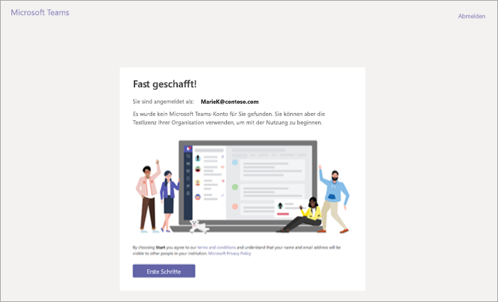
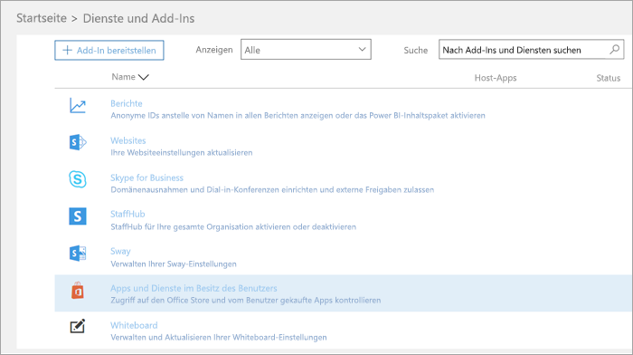
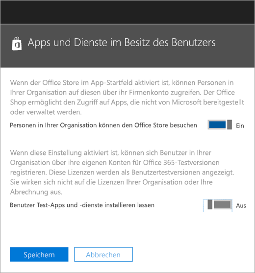
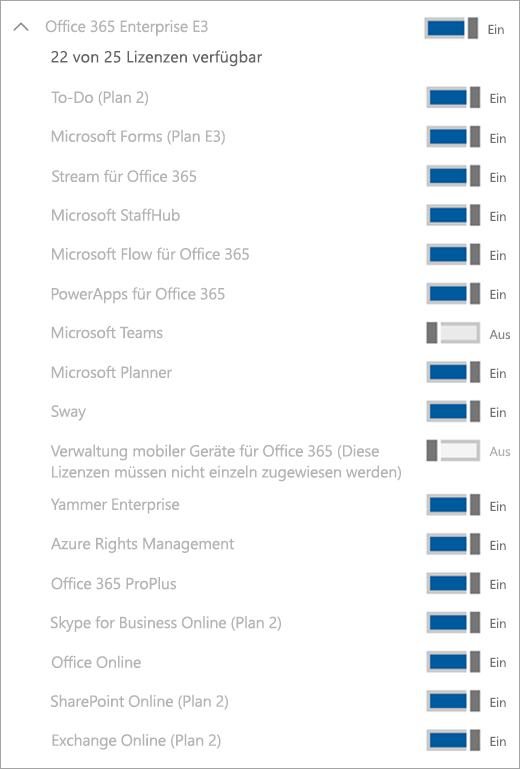

Verwalten der Information Worker Testangebot für Microsoft-TeamsManage the IW trial offer for Microsoft Teams
=============================================

Microsoft-Teams, ist ein hervorragendes collaborative Tool für Ihre Organisation.Microsoft Teams is a great collaborative tool for your organization. Sie können Personen und Teams zu besprechen und Veränderungen Ideen mithilfe der Vorteile von Office 365.It empowers people and teams to discuss, innovate, and share ideas using the power of Office 365. Der Information Worker Testangebot für Microsoft-Teams bietet vorhandenen Office 365-Benutzer in Ihrer Organisation, die für Microsoft-Teams zum Initiieren einer 1 Jahr Testversion des Produkts nicht lizenziert sind.The IW trial offer for Microsoft Teams offers existing Office 365 users in your organization who are not licensed for Microsoft Teams to initiate a 1-year trial of the product. Administratoren haben die Möglichkeit zum ein-oder Ausschalten dieses Feature für Benutzer innerhalb ihrer Mandanten.Admins have the ability to switch on or off this feature for users within their tenant.

## Was ist in dem AngebotWhat's in the offer

Die Servicepläne in dieses Angebot enthalten sind:The service plans included in this offer are:

- Exchange-FoundationExchange Foundation
- Datenfluss für Office 365-Plan 1Flow for Office 365 Plan 1
- Microsoft-PlannerMicrosoft Planner
- Microsoft-Teams (Teams1, Teams Information Worker)Microsoft Teams (Teams1, Teams IW)
- Office OnlineOffice Online
- PowerApps für Office 365-Plan 1PowerApps for Office 365 Plan 1
- SharePoint Online-Plan 1SharePoint Online Plan 1
- SchlingernSway
- Yammer EnterpriseYammer Enterprise

## Wer berechtigt istWho is eligible

Benutzer, die nicht mit eine Office 365-Lizenz verfügen, die Teams können der Information Worker Testangebot initiieren.Users who do not have an Office 365 license that includes Teams can initiate the IW trial offer. Wenn ein Benutzer über Office 365 Business Premium (einschließlich Teams) verfügt, und die Teams Dienstplan deaktiviert ist, werden sie beispielsweise nicht für die Testversion berechtigt.For example, if a user has Office 365 Business Premium (which includes Teams), and the Teams service plan is disabled, they are not eligible for the trial.

Auf der Ebene des Mandanten Teams als Dienst muss (in der Verwaltungskonsole des Teams) aktiviert werden soll.At the tenant level, Teams as a service needs to be enabled (in the Teams admin center). (Weitere Informationen finden Sie unter [Microsoft-Teams, Verwalten von Features in Office 365-Organisation](enable-features-office-365.md).(For more information, see [Manage Microsoft Teams features in your Office 365 organization](enable-features-office-365.md). Darüber hinaus müssen Benutzer für apps und Testversionen (im Office 365 Administrationscenter) anmelden aktiviert werden.Also, users must be enabled to sign up for apps and trials (in the Office 365 admin center). Weitere Informationen finden Sie unter [Verwalten der Information Worker Studien](#manage-the-iw-trial) weiter unten in diesem Artikel.For more information, see [Manage the IW trial](#manage-the-iw-trial) later in this article.

GOV und EDU Mandanten sind nicht berechtigt, für die Testversion Information Worker.GOV and EDU tenants are not eligible for the IW trial.

## Wie Benutzer für die Testversion anmeldenHow users sign up for the trial

Berechtigte Benutzern können durch Anmeldung bei Teams ([teams.microsoft.com](https://teams.microsoft.com)) für die Information Worker Testversion registrieren.Eligible users can sign up for the IW trial by logging into Teams ([teams.microsoft.com](https://teams.microsoft.com)). Wenn verfügbar sind, sehen sie in der folgenden Bildschirmrand aus, um die Testversion zu starten.If eligible, they will see the following screen to start the trial. 

Die Information Worker Testversion gewährt eine Testversion 1 Jahr im gesamten Unternehmen.The IW trial grants a 1-year trial to your entire organization. Zusätzliche berechtigte Benutzern in Ihrer Organisation können für Information Worker-Testversion von demselben Prozess durchgehen registrieren.Additional eligible users within your organization can sign up for the IW trial by going through the same process.
 
Alle Versuche innerhalb Ihrer Organisation freigeben, die gleiche Start- und Enddaten, welches das Datum ist der erste Benutzer für die Testversion angemeldet.All trials within your organization share the same start and end dates, which is the date that first user signed for the trial. Angenommen, wenn Benutzer A die erste Testversion auf 25 April 2018 und Benutzer B eine Testversion auf 3 Juni 2018 beginnt, läuft beide Benutzer Testversion auf 25 April 2019 ab.For example, if user A starts the first trial on April 25, 2018 and user B starts a trial on June 3, 2018, both users' trial will expire on April 25, 2019.

## Verwalten der Information Worker-TestversionManage the IW trial

Administratoren können die Möglichkeit für Endbenutzer in trial apps und Dienste innerhalb ihrer Mandanten Anspruch zu deaktivieren.Admins can disable the ability for end users to claim trial apps and services within their tenant. Derzeit die Information Worker Teams Testversion nur Studien in dieser Kategorie ist, aber dies möglicherweise gelten für andere Programme ähnlich wie in der Zukunft.Currently, the Teams IW trial is the only trial in this category, but this might apply to other similar programs in the future. 

1\.1\. Wechseln zu **Services & -add-ins**im [Office 365 Administrationscenter](https://portal.office.com/adminportal/home) > **Benutzer Apps und Diensten gehören**.From the [Office 365 admin center](https://portal.office.com/adminportal/home), go to **Services & add-ins** > **User owned Apps and Services**.

2\.2\. Deaktivieren Sie **dazu, Benutzern das Installieren Studien apps und Dienste aus**.Turn off **Let users install trial apps and services**.

3\.3\. Sie können Teams für den Mandanten deaktivieren durch das Aufrufen der Verwaltungsportals von Teams.You can turn off Teams for the tenant by going to the Teams admin portal. Wenn diese Option deaktiviert ist, können nicht Benutzer die Testversion Teams Information Worker beansprucht werden.When this is disabled, users cannot claim the Teams IW trial.

4\.4\. Wenn Sie die Teams Dienstplan für einen einzelnen Benutzer, die eine Anspruch Lizenz besitzt deaktiviert haben, kann der Benutzer nicht berechtigt, eine Testlizenz beanspruchen.If you have disabled the Teams service plan for an individual user who has an eligible license, that user is not eligible to claim a trial license.

5\.5\. Wenn ein Benutzer eine Testlizenz Teams angefordert hat, können Sie ihn durch Entfernen des Lizenz oder Dienst Plans entfernen.If a user has claimed a Teams trial license, you can remove it by removing the license or service plan. 

### Aktualisieren Sie die Benutzer aus der TestlizenzUpgrade users from the trial license

Um Benutzer aus der Testlizenz aktualisiert haben, führen Sie folgende Schritte aus:To upgrade users from the trial license, do the following:

1. Erwerben einer SKUs, die Teams enthält.Purchase a SKU that includes Teams.
2. Entfernen der Teams Studien SKUs vom Benutzer.Remove the Teams trial SKU from the user.
3. Klicken Sie dann neu erworbene Lizenz zuweisen.Then assign the newly purchased license.

Weitere Informationen finden Sie unter [Office 365-Lizenzierung für Microsoft Teams](Office-365-licensing.md).For more information, see [Office 365 licensing for Microsoft Teams](Office-365-licensing.md).