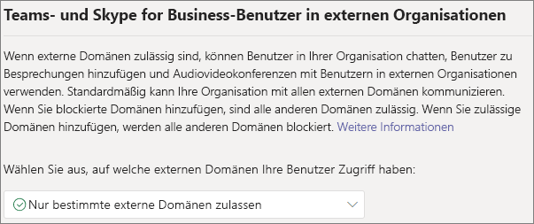
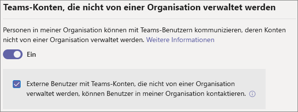
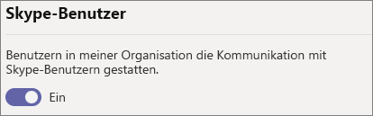

# <a name="manage-external-meetings-and-chat-in-microsoft-teams"></a>Verwalten externer Besprechungen und Chats in Microsoft Teams

Sie können externe Besprechungen und Chats in Teams mithilfe der Funktion für den *externen Zugriff* konfigurieren. Der externe Zugriff ermöglicht es Microsoft Teams-Benutzern von außerhalb Ihrer Organisation, in Microsoft Teams nach Ihnen zu suchen, mit Ihnen zu telefonieren und zu chatten sowie Besprechungen einzurichten. Über externen Zugriff können Sie auch mit Personen aus anderen Organisationen kommunizieren, die noch Skype for Business (online oder lokal) bzw. Skype verwenden.

Wenn Sie externen Benutzern hingegen den Zugriff auf Ihre Teams und Kanäle gewähren möchten, verwenden Sie stattdessen den Gastzugriff. Weitere Informationen zu den Unterschieden zwischen externem Zugriff und Gastzugriff finden Sie unter [Vergleich von externem Zugriff und Gastzugriff](communicate-with-users-from-other-organizations.md#compare-external-and-guest-access). 

Verwenden Sie den externen Zugriff in folgenden Situationen:
  
- Verschiedene Benutzer in externen Domänen müssen chatten können. Beispiel: Rob@contoso.com und Ann@northwindtraders.com arbeiten mit einigen anderen Personen in den Domänen „contoso.com“ und „northwindtraders.com“ an einem Projekt zusammen.

- Sie möchten den Personen in Ihrer Organisation die Möglichkeit geben, Microsoft Teams zu verwenden, um Personen in bestimmten Unternehmen außerhalb Ihrer Organisation zu kontaktieren.

- Sie möchten, dass alle anderen Microsoft Teams-Benutzer aus aller Welt Sie anhand Ihrer E-Mail-Adresse finden und Kontakt zu Ihnen aufnehmen können. 

## <a name="plan-for-external-meetings-and-chat"></a>Planen externer Besprechungen und Chats

Richtlinien für externen Zugriff umfassen Steuerelemente für jeden Verbundtyp sowohl auf Organisationsebene als auch auf Benutzerebene. Durch das Deaktivieren einer Richtlinie auf Organisationsebene wird sie für alle Benutzer deaktiviert, unabhängig von der Einstellung auf Benutzerebene. Alle Einstellungen für externen Zugriff sind standardmäßig aktiviert.

Das Teams Admin Center steuert den externen Zugriff auf Organisationsebene. Die meisten Optionen (mit Ausnahme von Domäneneinschränkungen) stehen mithilfe von PowerShell auf Benutzerebene zur Verfügung. Weitere Informationen finden Sie weiter unten unter [Verwenden von PowerShell](#using-powershell).

> [!NOTE]
> Wenn Sie den externen Zugriff in Ihrer Organisation deaktivieren, können Personen außerhalb Ihrer Organisation an Besprechungen dennoch über die anonyme Teilnahme teilnehmen. Weitere Informationen finden Sie unter [Verwalten von Besprechungseinstellungen in Teams](meeting-settings-in-teams.md).

> [!NOTE]
> Benutzer von Microsoft Teams können Apps hinzufügen, wenn sie Besprechungen oder Chats mit Personen aus anderen Organisationen hosten. Sie können auch Apps verwenden, die von Personen in anderen Organisationen freigegeben werden, wenn sie an Besprechungen oder Chats teilnehmen, die von diesen Organisationen gehostet werden. Es werden die Datenrichtlinien der Organisation des Hostingbenutzers sowie die Datenfreigabemethoden von Drittanbieter-Apps, die von der Organisation dieses Benutzers freigegen werden, angewendet.

## <a name="allow-or-block-domains"></a>Zulassen oder Blockieren von Domänen

Wenn Sie blockierte Domänen hinzufügen, sind alle anderen Domänen zulässig, und wenn Sie zulässige Domänen hinzufügen, werden alle anderen Domänen blockiert. Die Ausnahme von dieser Regel ist, wenn anonyme Teilnehmer in Besprechungen zugelassen werden. Es gibt vier Szenarien für das Einrichten des externen Zugriffs im Microsoft Teams Admin Center (**Benutzer** > **Externer Zugriff**):

- **Alle externen Domänen zulassen**: Dies ist die Standardeinstellung in Microsoft Teams, die es Personen in Ihrer Organisation erlaubt, nach Personen in einer beliebigen Domäne außerhalb Ihrer Organisation zu suchen, mit ihnen zu telefonieren oder zu chatten und Besprechungen einzurichten.

    In diesem Szenario können Ihre Benutzer mit allen externen Domänen kommunizieren, die Microsoft Teams oder Skype for Business ausführen, sofern der andere Mandant die externe Kommunikation ebenfalls erlaubt.
    
- **Nur bestimmte externe Domänen zulassen**: Durch das Hinzufügen von Domänen zu einer **Zulassungsliste** beschränken Sie den externen Zugriff auf diese erlaubten Domänen. Sobald Sie eine Liste der erlaubten Domänen eingerichtet haben, werden alle anderen Domänen gesperrt. 

- **Bestimmte Domänen blockieren**: Indem Sie Domänen zu einer **Sperrliste** hinzufügen, können Sie mit allen externen Domänen *außer* den blockierten Domänen kommunizieren.  Sobald Sie eine Liste blockierter Domänen erstellt haben, werden alle anderen Domänen zugelassen.

- **Alle externen Domänen blockieren**: Verhindert, dass Personen in Ihrer Organisation nach Personen in einer Domäne außerhalb Ihrer Organisation suchen, mit ihnen telefonieren, chatten und Besprechungen einrichten.

> [!NOTE]
> Die zugelassenen oder blockierten Domänen werden auf Besprechungen nur dann angewendet, wenn der anonyme Zugriff auf Besprechungen deaktiviert ist.



**Verwenden des Microsoft Teams Admin Centers**

Vorgehensweise, um bestimmte Domänen zuzulassen

1. Wechseln Sie im Microsoft Teams Admin Center zu **Benutzer** > **Externer Zugriff**.

2. Wählen Sie unter **Wählen Sie aus, auf welche Domänen Ihre Benutzer Zugriff haben** die Option **Nur bestimmte externe Domänen zulassen** aus.

3. Wählen Sie **Domänen zulassen** aus.

4. Geben Sie im Feld **Domäne** die Domäne ein, die Sie zulassen möchten, und klicken Sie dann auf **Fertig**.

5. Wenn Sie eine weitere Domäne zulassen möchten, klicken Sie auf **Domäne hinzufügen**.

6. Klicken Sie auf **Speichern**.

Vorgehensweise, um bestimmte Domänen zu blockieren

1. Wechseln Sie im Microsoft Teams Admin Center zu **Benutzer** > **Externer Zugriff**.

2. Wählen Sie unter **Wählen Sie aus, auf welche Domänen Ihre Benutzer Zugriff haben** die Option **Nur bestimmte externe Domänen blockieren** aus.

3. Wählen Sie **Domänen blockieren** aus.

4. Geben Sie im Feld **Domäne** die Domäne ein, die Sie zulassen möchten, und klicken Sie dann auf **Fertig**.

5. Wenn Sie eine weitere Domäne blockieren möchten, klicken Sie auf **Domäne hinzufügen**.

6. Klicken Sie auf **Speichern**.

Um mit einem anderen Mandanten zu kommunizieren, muss dieser entweder **Alle externen Domänen zulassen** aktivieren oder Ihren Mandanten zu seiner Liste der zulässigen Domänen hinzufügen, indem er die oben beschriebenen Schritte ausführt.  

## <a name="manage-contact-with-external-teams-users-not-managed-by-an-organization"></a>Verwalten von Kontakten mit externen Teams-Benutzern, die nicht von einer Organisation verwaltet werden

> [!NOTE]
> Die Teams- und Skype-Interoperabilitätsfunktionen, die in diesem Artikel diskutiert werden, sind nicht auf GCC-, GCC High- oder DOD-Bereitstellungen oder in privaten Cloud-Umgebungen verfügbar.

Administratoren können die Kommunikation mit externen Teams-Benutzern, die nicht von einer Organisation verwaltet werden („nicht verwaltet“) aktivieren oder deaktivieren. Wenn diese Funktion aktiviert ist, können sie auch noch steuern, ob Personen mit nicht verwalteten Teams-Konten Kontakte initiieren können (siehe folgende Abbildung). Wenn die Option **Externe Benutzer mit Teams-Konten, die nicht von einer Organisation verwaltet werden, können Benutzer in meiner Organisation kontaktieren** deaktiviert ist, können nicht verwaltete Teams-Benutzer nicht die vollständige E-Mail-Adresse durchsuchen, um Kontakte in der Organisation zu finden, und die gesamte Kommunikation mit nicht verwalteten Teams-Benutzern muss von Benutzern der Organisation initiiert werden.

Wechseln Sie im Microsoft Teams Admin Center zu **Benutzer** > **Externer Zugriff**.



So hindern Sie Teams-Benutzer in Ihrer Organisation an der Kommunikation mit externen Teams-Benutzern, deren Konten nicht von einer Organisation verwaltet werden:

1. Deaktivieren Sie die Einstellung **Personen in meiner Organisation können mit Teams-Benutzern kommunizieren, deren Konten nicht von einer Organisation verwaltet werden**.
2. Deaktivieren Sie das Kontrollkästchen **Externe Benutzer mit Teams-Konten, die nicht von einer Organisation verwaltet werden, können Benutzer in meiner Organisation kontaktieren**.

So erlauben Sie Teams-Benutzern in Ihrer Organisation die Kommunikation mit externen Teams-Benutzern, deren Konten nicht von einer Organisation verwaltet werden, sofern Ihre Teams-Benutzer den Kontakt initiiert haben:

1. Aktivieren Sie die Einstellung **Personen in meiner Organisation können mit Teams-Benutzern kommunizieren, deren Konten nicht von einer Organisation verwaltet werden**.
2. Deaktivieren Sie das Kontrollkästchen **Externe Benutzer mit Teams-Konten, die nicht von einer Organisation verwaltet werden, können Benutzer in meiner Organisation kontaktieren**.

So erlauben Sie Teams-Benutzern in Ihrer Organisation die Kommunikation mit externen Teams-Benutzern, deren Konten nicht von einer Organisation verwaltet werden, sowie den Empfang von Kommunikationsanforderungen von diesen externen Teams-Benutzern:

1. Aktivieren Sie die Einstellung **Personen in meiner Organisation können mit Teams-Benutzern kommunizieren, deren Konten nicht von einer Organisation verwaltet werden**.
2. Aktivieren Sie das Kontrollkästchen **Externe Benutzer mit Teams-Konten, die nicht von einer Organisation verwaltet werden, können Benutzer in meiner Organisation kontaktieren**.

## <a name="communicate-with-skype-users"></a>Kommunizieren mit Skype-Benutzern

Führen Sie die folgenden Schritte aus, damit Teams-Benutzer in Ihrer Organisation mit Skype-Benutzern chatten und diese anrufen können. Teams-Benutzer können dann nach schriftlichen Einzelunterhaltungen oder Audio/Video-Anrufen mit Skype-Benutzern suchen und diese starten.



### <a name="using-the-microsoft-teams-admin-center"></a>Verwenden des Microsoft Teams Admin Centers

1. Navigieren Sie im linken Navigationsbereich zu **Benutzer** > **Externer Zugriff**.

2. Aktivieren Sie die Einstellung **Benutzern in meiner Organisation erlauben, mit Skype-Benutzern zu kommunizieren**.

Weitere Informationen über die Möglichkeiten der Kommunikation zwischen Teams- und Skype-Benutzern, einschließlich der Einschränkungen, finden Sie unter [Interoperabilität von Teams und Skype](teams-skype-interop.md).

### <a name="using-powershell"></a>Verwendung von PowerShell

Einstellungen auf Organisationsebene können mit [Set-CSTenantFederationConfiguration](/powershell/module/skype/set-cstenantfederationconfiguration) konfiguriert werden, und Einstellungen auf Benutzerebene können mit [Set-CsExternalAccessPolicy](/powershell/module/skype/set-csexternalaccesspolicy) konfiguriert werden.

Die folgende Tabelle zeigt die Cmdletparameter, die zum Konfigurieren des Partnerverbunds verwendet werden.

|Konfiguration|Organisationsebene (Set-CSTenantFederationConfiguration)|Benutzerebene (Set-CsExternalAccessPolicy)|
|:-------|:--------|:------------------|
|Aktivieren/Deaktivieren des Partnerverbunds mit anderen Teams-Organisationen und Skype for Business|`-AllowFederatedUsers`|`-EnableFederationAccess`|
|Aktivieren des Partnerverbunds mit bestimmten Domänen|`-AllowedDomains`|Nicht verfügbar|
|Deaktivieren des Partnerverbunds mit bestimmten Domänen|`-BlockedDomains`|Nicht verfügbar|
|Aktivieren/Deaktivieren des Partnerverbunds mit Teams-Benutzern, die nicht von einer Organisation verwaltet werden|`-AllowTeamsConsumer`|`-EnableTeamsConsumerAccess`|
|Aktivieren/Deaktivieren der Möglichkeit für Teams-Benutzer, die nicht von einer Organisation verwaltet werden, Unterhaltungen zu initiieren|`-AllowTeamsConsumerInbound`|`-EnableTeamsConsumerInbound`|
|Aktivieren/Deaktivieren des Partnerverbunds mit Skype|`-AllowPublicUsers`|`-EnablePublicCloudAccess`|

Es ist wichtig zu beachten, dass beim Deaktivieren einer Richtlinie ein „Rolldown“ von Mandant auf Benutzer erfolgt. Beispiel:

```PowerShell
Set-CsTenantFederationConfiguration -AllowFederatedUsers $false
Set-CsExternalAccessPolicy -EnableFederationAccess $true
```

In diesem Beispiel können Benutzer nicht mit verwalteten Teams-Benutzern oder Skype for Business-Benutzern kommunizieren, obwohl die Richtlinie auf Benutzerebene aktiviert ist, da dieser Verbundtyp auf Organisationsebene deaktiviert wurde. Wenn Sie diese Steuerelemente für eine Teilmenge von Benutzern aktivieren möchten, müssen Sie daher das Steuerelement auf Organisationsebene aktivieren und zwei Gruppenrichtlinien erstellen – eine, die für die Benutzer gilt, für die das Steuerelement deaktiviert werden soll, und eine, die für die Benutzer gilt, für die das Steuerelement aktiviert sein soll.

## <a name="limit-external-access-to-specific-people"></a>Einschränken des externen Zugriffs auf bestimmte Personen

Wenn Sie Steuerelemente für externen Zugriff auf Organisationsebene aktiviert haben, können Sie den externen Zugriff mithilfe von PowerShell auf bestimmte Benutzer beschränken.

Sie können das folgende Beispielskript verwenden: Ersetzen Sie dabei *Control* durch das Steuerelement, das Sie ändern möchten, *PolicyName* durch den Namen, den Sie der Richtlinie geben möchten, und *UserName* durch die einzelnen Benutzer, für die Sie den externen Zugriff aktivieren/deaktivieren möchten.

Stellen Sie sicher, dass Sie das [Microsoft Teams PowerShell-Modul](/microsoftteams/teams-powershell-install) installiert haben, bevor Sie das Skript ausführen.

```PowerShell
Connect-MicrosoftTeams

# Disable external access globally
Set-CsExternalAccessPolicy -<Control> $false

# Create a new external access policy
New-CsExternalAccessPolicy -Identity <PolicyName> -<Control> $true

# Assign users to the policy
$users_ids = @("<UserName1>", "<UserName2>")
New-CsBatchPolicyAssignmentOperation -PolicyType ExternalAccessPolicy -PolicyName "<PolicyName>" -Identity $users_ids

```

So ermöglichen Sie z. B. die Kommunikation mit externen Teams-Benutzern, die nicht von einer Organisation verwaltet werden:

```PowerShell
Connect-MicrosoftTeams

Set-CsExternalAccessPolicy -EnableTeamsConsumerAccess $false

New-CsExternalAccessPolicy -Identity ContosoExternalAccess -EnableTeamsConsumerAccess $true

$users_ids = @("MeganB@contoso.com", "AlexW@contoso.com")
New-CsBatchPolicyAssignmentOperation -PolicyType ExternalAccessPolicy -PolicyName "ContosoExternalAccess" -Identity $users_ids

```

Weitere Beispiele zum Kompilieren einer Benutzerliste finden Sie unter [New-CsBatchPolicyAssignmentOperation](/powershell/module/teams/new-csbatchpolicyassignmentoperation).

Sie können die neue Richtlinie anzeigen, indem Sie `Get-CsExternalAccessPolicy` ausführen.

Siehe auch [New-CsExternalAccessPolicy](/powershell/module/skype/new-csexternalaccesspolicy) und [Set-CsExternalAccessPolicy](/powershell/module/skype/set-csexternalaccesspolicy).

## <a name="common-external-access-scenarios"></a>Häufige Szenarien für den externen Zugriff

In den folgenden Abschnitten wird beschrieben, wie Sie den Partnerverbund für gängige externe Zugriffsszenarien aktivieren und wie die TeamsUpgradePolicy die Zustellung eingehender Chats und Anrufe bestimmt.

### <a name="enable-federation-between-users-in-your-organization-and-other-organizations"></a>Aktivieren des Partnerverbunds zwischen Benutzern in Ihrer Organisation und anderen Organisationen

Damit Benutzer in Ihrer Organisation mit Benutzern in einer anderen Organisation kommunizieren können, müssen beide Organisationen den Partnerverbund aktivieren. Die Schritte zur Aktivierung des Partnerverbunds für eine bestimmte Organisation hängen davon ab, ob es sich um eine reine Online-, eine Hybrid- oder eine reine lokale Organisation handelt.

| Wenn Ihre Organisation | Aktivieren Sie den Partnerverbund wie folgt |
|:---------|:-----------------------|
|Online ohne lokales Skype for Business. Dazu gehören Organisationen mit TeamsOnly-Benutzern und/oder Skype for Business Online-Benutzern.| Wird Teams Admin Center verwendet: <br>– Stellen Sie sicher, dass die Domänen, mit denen Sie kommunizieren möchten, für den externen Zugriff zulässig sind.<br><br>Wird PowerShell verwendet:<br>– Stellen Sie sicher, dass der Mandant für den Verbund aktiviert ist: `Get-CsTenantFederationConfiguration` muss `AllowFederatedUsers=true` anzeigen. <br>– Stellen Sie sicher, dass der effektive Wert von `CsExternalAccessPolicy` auf `EnableFederationAccess=true` festgelegt ist.<br>– Wenn Sie keinen offenen Verbund verwenden, stellen Sie sicher, dass die Zieldomäne in `AllowedDomains` von `CsTenantFederationConfiguration` enthalten ist. |
|Nur lokal| In lokalen Tools: <br>– Stellen Sie sicher, dass der Partnerverbund in `CsAccessEdgeConfiguration` aktiviert ist.<br>– Stellen Sie sicher, dass der Partnerverbund für den Benutzer über `ExternalAccessPolicy` aktiviert ist (entweder über die globale Richtlinie, die Standortrichtlinie oder die dem Benutzer zugewiesene Richtlinie). <br> – Wenn Sie keinen offenen Verbund verwenden, stellen Sie sicher, dass die Zieldomäne in `AllowedDomains` enthalten ist.|
|Hybridorganisation mit einigen Onlinebenutzern (entweder in Skype for Business oder Teams) und einigen lokalen Benutzern. | Führen Sie die oben stehenden Schritte sowohl für die Online- als auch die lokale Organisation aus. |

### <a name="delivery-of-incoming-chats-and-calls"></a>Zustellung von eingehenden Chats und Anrufen 

Eingehende Chats und Anrufe von einer Verbundorganisation landen im Teams- oder Skype for Business-Client des Benutzers, je nach dem Modus des empfangenden Benutzers in „TeamsUpgradePolicy“.

| Sie möchten | Gehen Sie so vor: |
|:---------|:-----------------------|
|Sicherstellen, dass eingehende Verbundchats und -anrufe im Teams-Client des Benutzers ankommen|Konfigurieren Sie für Ihre Benutzer den „TeamsOnly“-Modus.
|Sicherstellen, dass eingehende Verbundchats und -anrufe im Skype for Business-Client des Benutzers ankommen|Konfigurieren Sie für Ihre Benutzer einen beliebigen Modus außer „TeamsOnly“.|

### <a name="enable-federation-between-users-in-your-organization-and-unmanaged-teams-users"></a>Aktivieren des Partnerverbunds zwischen Benutzern in Ihrer Organisation und nicht verwalteten Teams-Benutzern

So aktivieren Sie den Partnerverbund zwischen Benutzern in Ihrer Organisation und nicht verwalteten Teams-Benutzern:

| Wenn Ihre Organisation | Aktivieren Sie den Partnerverbund wie folgt |
|:---------|:-----------------------|
|Online ohne lokales Skype for Business. Dazu gehören Organisationen mit „Nur Teams“-Benutzern und/oder Skype for Business Online-Benutzern.| Wird Teams Admin Center verwendet:<br>– Stellen Sie sicher, dass **Personen in meiner Organisation können mit Teams-Benutzern kommunizieren, deren Konten nicht von einer Organisation verwaltet werden** in **Externer Zugriff** aktiviert ist.<br>– Wenn Sie möchten, dass nicht verwaltete Teams-Konten Chats initiieren können, aktivieren Sie das Kontrollkästchen für **Externe Benutzer mit Teams-Konten, die nicht von einer Organisation verwaltet werden, können Benutzer in meiner Organisation kontaktieren**.<br><br>Wird PowerShell verwendet:<br>– Stellen Sie sicher, dass der Mandant für den Verbund aktiviert ist: `Get-CsTenantFederationConfiguration` muss `AllowTeamsConsumer=true` anzeigen.<br>– Stellen Sie sicher, dass der effektive Wert von `CsExternalAccessPolicy` auf `EnableTeamsConsumerAccess=true` festgelegt ist.<br>– Stellen Sie sicher, dass der Mandant aktiviert ist, damit nicht verwaltete Benutzer Chats initiieren können: `Get-CsTenantFederationConfiguration` muss auf `AllowTeamsConsumerInbound=true` festgelegt sein.<br>– Stellen Sie sicher, dass der effektive Wert von `CsExternalAccessPolicy` auf `EnableTeamsConsumerInbound=true` festgelegt ist.|
|Nur lokal| Das Chatten mit nicht verwalteten Teams-Benutzern wird für lokale Organisationen nicht unterstützt.|
|Hybridorganisation mit einigen Onlinebenutzern (entweder in Skype for Business oder Teams) und einigen lokalen Benutzern. | Führen Sie die zuvor beschriebenen Schritte für Onlineorganisationen aus. Beachten Sie, dass das Chatten mit nicht verwalteten Teams-Benutzern für lokale Benutzer nicht unterstützt wird.|

> [!IMPORTANT]
> Sie müssen keine **Teams-Domänen** als zulässige Domänen hinzufügen, um es Teams-Benutzern zu ermöglichen, mit nicht verwalteten Teams-Benutzern von außerhalb Ihrer Organisation zu kommunizieren. Es sind alle **nicht verwalteten Teams-Domänen** zulässig.

### <a name="enable-federation-between-users-in-your-organization-and-consumer-users-of-skype"></a>Aktivieren des Partnerverbunds zwischen Benutzern in Ihrer Organisation und Endbenutzern von Skype

So aktivieren Sie den Partnerverbund zwischen Benutzern in Ihrer Organisation und Verbrauchern mit Skype:

| Wenn Ihre Organisation | Aktivieren Sie den Verbraucherverbund wie folgt |
|:---------|:-----------------------|
|Online nur ohne lokales Skype for Business. Dazu gehören Organisationen mit TeamsOnly-Benutzern und/oder Skype for Business Online-Benutzern. | Wird Teams Admin Center verwendet: <br>– Stellen Sie sicher, dass **Benutzern in meiner Organisation erlauben, mit Skype-Benutzern zu kommunizieren** in "Externer Zugriff" aktiviert ist.<br><br>Wird PowerShell verwendet: <br>– Stellen Sie sicher, dass der Mandant für den Verbund aktiviert ist: `Get-CsTenantFederationConfiguration` muss `AllowPublicUsers=true` anzeigen. <br> – Stellen Sie sicher, dass der effektive Wert von `CsExternalAccessPolicy` auf `EnablePublicCloudAccess=true` festgelegt ist. |
|Nur lokal| In lokalen Tools: <br> – Stellen Sie sicher, dass Skype als Verbundpartner aktiviert ist. <br> – Stellen Sie sicher, dass der `EnablePublicCloudAccess=true` für den Benutzer über `ExternalAccessPolicy` aktiviert ist (entweder über die globale Richtlinie, die Standortrichtlinie oder die dem Benutzer zugewiesene Richtlinie).|
| Hybridorganisation mit einigen Onlinebenutzern (entweder in Skype for Business oder Teams) und einigen lokalen Benutzern.| Führen Sie die oben stehenden Schritte sowohl für die Online- als auch die lokale Organisation aus.

> [!IMPORTANT]
> Sie müssen keine **Skype-Domänen** als zulässige Domänen hinzufügen, um es Microsoft Teams- oder Skype for Business Online-Benutzern zu ermöglichen, mit Skype-Benutzern innerhalb oder außerhalb Ihrer Organisation zu kommunizieren. Es sind alle **Skype-Domänen** zulässig.

## <a name="federation-diagnostic-tool"></a>Partnerverbund-Diagnosetool

Wenn Sie ein Administrator sind, können Sie mit dem folgenden Diagnosetool überprüfen, ob ein Teams mit einem verbundenen Benutzer Teams kommunizieren kann:

1. Wählen Sie unten **Tests ausführen** aus, um das Diagnosetool im Microsoft 365 Admin füllen. 

   > [!div class="nextstepaction"]
   > [Ausführen von Tests: Teams Partnerverbund](https://aka.ms/TeamsFederationDiag)

2. Geben Sie im Bereich „Diagnose ausführen“ die **SIP-Adresse (Session Initiation Protocol)** und den **Domänennamen des Partnermandanten** ein, und wählen Sie dann **Tests ausführen** aus.

3. Die Tests geben die besten nächsten Schritte zurück, um alle Mandanten- oder Richtlinienkonfigurationen zu adressieren, die die Kommunikation mit dem Partnerbenutzer verhindern.

## <a name="user-level-controls"></a>Steuerelemente auf Benutzerebene

Wenn Benutzer 1:1-Chats von einer Person außerhalb der Organisation erhalten, erhalten sie eine Vollbildumgebung, in der sie auswählen können, ob sie eine **Vorschau** der Nachricht anzeigen, den Chat **annehmen** oder die Person **blockieren** können, die den Chat sendet.

Das Blockieren externer Personen ist an mehreren Stellen in Teams verfügbar, einschließlich des Menüs "Mehr" (**...**) in der Chatliste und des Menüs "Mehr (**...**)" auf der Personenkarte. Benutzer können die Blockierung externer Personen auch über das Menü "Mehr" (**...**) in der Chatliste, das Menü "Mehr"(**...**) auf der Personenkarte oder über **"Einstellungen** > **blockierte Kontakte** > **Bearbeiten blockierter Kontakte"** aufheben. Das Blockieren ist vor oder nach dem Senden von Nachrichten verfügbar.

Das Blockieren externer Personen verhindert das Senden von Nachrichten in 1:1-Chats, das Hinzufügen des Benutzers zu neuen Gruppenchats und das Anzeigen seiner Anwesenheit. Während Gruppenchat-Einladungen blockiert werden, können sich blockierte Benutzer in den gleichen Chats mit Benutzern befinden, die sie blockiert haben, entweder weil der Chat vor dem Block initiiert wurde oder die Gruppenchat-Einladung von einem anderen Mitglied gesendet wurde.

## <a name="related-topics"></a>Verwandte Themen

[Native Chaterfahrung für externe Benutzer (im Verbund)](native-chat-for-external-users.md)
