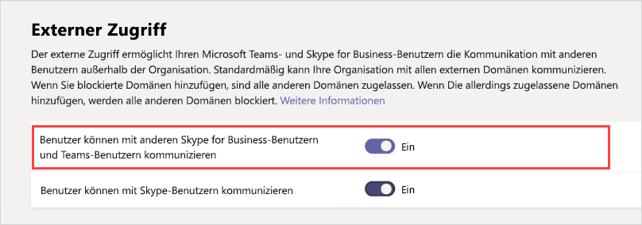
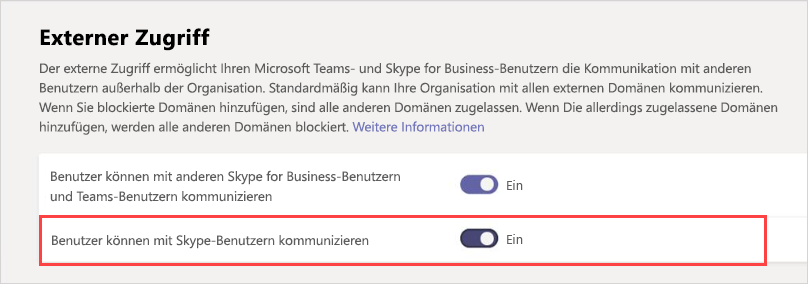

Verwaltung des externen Zugriffs in Microsoft Teams
======================================================

Externer Zugriff ist eine Möglichkeit für Teams-Benutzer aus einer ganzen externen Domäne Sie zu finden, anrufen, mit Ihnen zu chatten und Besprechungen mit Ihnen in Teams einzurichten. Über einen externen Zugang können Sie auch mit externen Benutzern kommunizieren, die noch Skype for Business (online oder lokal) bzw. Skype (in der Vorschau) verwenden.

Wenn Sie externen Benutzern hingegen den Zugriff auf Teams und Kanäle gewähren möchten, ist der Gastzugriff möglicherweise besser geeignet. Weitere Informationen zu den Unterschieden zwischen externem Zugriff und Gastzugriff finden Sie unter [Vergleich von externem Zugriff und Gastzugriff](communicate-with-users-from-other-organizations.md#compare-external-and-guest-access). 

Verwenden Sie den externen Zugriff in folgenden Situationen:
  
- Sie verfügen über Benutzer in unterschiedlichen Domänen, die zusammenarbeiten müssen. Beispielsweise arbeiten Rob@contoso.com und Ann@northwindtraders.com gemeinsam mit einigen anderen in den Domänen contoso.com und northwindtraders.com an einem Projekt.

- Sie möchten den Personen in Ihrer Organisation die Möglichkeit geben, Microsoft Teams zu verwenden, um Personen in bestimmten Unternehmen außerhalb Ihrer Organisation zu kontaktieren.

- Sie möchten, dass alle anderen Microsoft Teams-Benutzer aus aller Welt Sie anhand Ihrer E-Mail-Adresse finden und Kontakt zu Ihnen aufnehmen können. 

> [!IMPORTANT]
> Wenn Sie den Team-Client für die Kommunikation mit einem externen Benutzer verwenden möchten (unabhängig davon, ob dieser Benutzer Teams oder Skype for Business verwendet), muss der Team Benutzer in Skype for Business Online verwaltet werden.

## Plan für externen Zugriff

Der externe Zugriff ist in Teams standardmäßig aktiviert. Das bedeutet, dass Ihre Organisation mit allen externen Domänen kommunizieren kann. Wenn Sie blockierte Domänen hinzufügen, sind alle anderen Domänen zulässig, und wenn Sie zulässige Domänen hinzufügen, werden alle anderen Domänen blockiert. Es gibt drei Szenarien für das Einrichten des externen Zugriffs im Microsoft Teams Admin Center (**Organisationsweite Einstellungen** > **Externer Zugriff**):

- **Offener Verbund**: Dies ist die Standardeinstellung in Teams, mit der Personen in Ihrer Organisation Sie finden, anrufen, mit Ihnen chatten und Besprechungen mit Personen in einer beliebigen Domäne außerhalb Ihrer Organisation einrichten können.

    In diesem Szenario können Ihre Benutzer mit allen externen Domänen kommunizieren, die Microsoft Teams oder Skype for Business ausführen UND den öffentlichen Verbund verwenden ODER Ihre Domäne zur Zulassungsliste hinzugefügt haben.

- **Bestimmte Domänen zulassen**: Indem Sie Domänen zu einer **Zulassungsliste** hinzufügen, beschränken Sie den externen Zugriff auf die erlaubten Domänen. Sobald Sie eine Liste der erlaubten Domänen eingerichtet haben, werden alle anderen Domänen gesperrt. Um bestimmte Domänen zuzulassen, klicken Sie auf **Domäne hinzufügen**, fügen Sie den Domänennamen hinzu, klicken Sie auf **Erforderliche Aktion für diese Domäne**, und wählen Sie dann **Zulässig** aus.

- **Bestimmte Domänen blockieren**: Indem Sie Domänen zu einer **Sperrliste** hinzufügen, können Sie mit allen externen Domänen* außer* den blockierten Domänen kommunizieren. Um bestimmte Domänen zu blockieren, klicken Sie auf **Domäne hinzufügen**, fügen Sie den Domänennamen hinzu, klicken Sie auf **Erforderliche Aktion für diese Domäne**, und wählen Sie dann **Blockiert** aus. Sobald Sie eine Liste blockierter Domänen erstellt haben, werden alle anderen Domänen zugelassen.

## Zulassen oder Blockieren von Domänen

### Schritt 1 – Aktivieren Ihrer Organisation für die Kommunikation mit anderen Teams oder Skype for Business-Organisationen

 **Unter Verwendung des Microsoft Teams Admin Centers**

1. Wechseln Sie im linken Navigationsbereich zu **Organisationsweite Einstellungen** > **Externer Zugriff**.

2. Aktivieren Sie die Option **Benutzer können mit anderen Skype for Business- und Teams-Benutzern kommunizieren**.

     .

3. Wenn Sie allen Microsoft Teams-Organisationen die Kommunikation mit den Benutzern in Ihrer Organisation erlauben möchten, fahren Sie mit Schritt 5 fort.

4. Wenn Sie die Organisationen, die mit Benutzern in Ihrer Organisation kommunizieren können, einschränken möchten, können Sie entweder alle außer einigen bestimmten Domänen oder nur bestimmte Domänen zulassen. 

    - Wenn Sie alle außer einigen Domänen zulassen möchten, wählen Sie die zu blockierenden Domänen aus, indem Sie auf **Domäne hinzufügen** klicken. Geben Sie im Bereich **Domäne hinzufügen** den Domänennamen ein, klicken Sie auf **Blockiert** und dann auf **Fertig**. 
    - Wenn Sie die Kommunikation auf bestimmte Organisationen einschränken möchten, fügen Sie diese Domänen zur Liste mit dem Status **Zulässig** hinzu. Sobald Sie eine Domäne zur der Zulassungsliste hinzugefügt haben, wird die Kommunikationen mit anderen Organisationen auf die Organisationen beschränkt, die sich in der Zulassungsliste befinden. 

5. Klicken Sie auf **Speichern**.

6. Stellen Sie sicher, dass der Administrator in der andere Microsoft Teams-Organisation die gleichen Schritte ausführt. Ist in der anderen Organisation beispielsweise die Kommunikation mit Benutzern anderer Organisationen eingeschränkt, muss der Administrator der anderen Organisation die Domäne Ihres Unternehmens zur Liste der **zulässigen Domänen** hinzufügen.

### Schritt 2: Testen

Um Ihr Setup zu testen, benötigen Sie einen Microsoft Teams-Benutzer, der sich nicht hinter der Firewall befindet.
  
1. Nachdem Sie und der Administrator der Organisation die Einstellungen für den **externen Zugriff** geändert haben, sollte es funktionieren.

2. Suchen Sie in der Teams-App anhand der E-Mail-Adresse nach der Person, und senden Sie eine Chatanfrage.

3. Bitten Sie Ihren Microsoft Teams-Kontakt, Ihnen eine Chatanfrage zu senden. Wenn Sie die Anfrage nicht erhalten, liegt das Problem bei den Einstellungen Ihrer Firewall (vorausgesetzt, Ihr Gegenüber hat die eigenen Firewalleinstellungen bereits überprüft).

4. Eine weitere Möglichkeit, um zu prüfen, ob das Problem bei Ihrer Firewall liegt, besteht darin, zu einem WLAN-Standort zu wechseln, der sich nicht hinter Ihrer Firewall befindet, z. B. zu einem Internet-Café, und Teams zu verwenden, um eine Chatanfrage an Ihren Kontakt zu senden. Wenn die Nachricht aus dem Internet-Café gesendet wird, an Ihrem Arbeitsplatz aber nicht, wissen Sie, dass die Firewall das Problem darstellt.

> [!NOTE]
> Wenn Sie und ein anderer Benutzer sowohl den externen Zugriff aktivieren als auch die Domänen des anderen zulassen, funktioniert das. Wenn es nicht funktioniert, sollte der andere Benutzer sich vergewissern, dass seine Konfiguration Ihre Domäne nicht blockiert.

## Kommunizieren mit Skype-Benutzern (in der Vorschau)

Führen Sie die folgenden Schritte aus, damit Teams-Benutzer in Ihrer Organisation mit Skype-Benutzern chatten und diese anrufen können. Teams-Benutzer können dann nach schriftlichen Einzelunterhaltungen oder Audio/Video-Anrufen mit Skype-Benutzern suchen und diese starten.

 **Unter Verwendung des Microsoft Teams Admin Centers**

1. Wechseln Sie im linken Navigationsbereich zu **Organisationsweite Einstellungen** > **Externer Zugriff**.

2. Aktivieren Sie die Einstellung **Benutzer können mit Skype-Benutzern kommunizieren**.

    .

Weitere Informationen über die Möglichkeiten der Kommunikation zwischen Teams- und Skype-Benutzern, einschließlich der Einschränkungen, finden Sie unter [Interoperabilität von Teams und Skype](teams-skype-interop.md).

## Häufige Szenarien für den externen Zugriff

In den folgenden Abschnitten wird beschrieben, wie Sie den Verbund für allgemeine Szenarien für den externen Zugriff aktivieren und wie der TeamsUpgradePolicy die Zustellung von eingehenden Chats und anrufen bestimmt.

### Föderation aktivieren

Damit Benutzer in Ihrer Organisation mit Benutzern in einer anderen Organisation kommunizieren können, müssen beide Organisationen die Föderation aktivieren. Die Schritte zum Aktivieren der Föderation für eine bestimmte Organisation hängen davon ab, ob es sich um eine reine Online-, Hybrid-oder rein lokale Organisation handelt.

|**Wenn Ihre Organisation** |**Aktivieren der Föderation wie folgt**  |
|:---------|:-----------------------|
|Online ohne Skype for Business lokal. Dies umfasst Organisationen, die TeamsOnly-Benutzer und/oder Skype for Business Online-Benutzer sind.| Bei Verwendung von Teams Admin Center:  – Stellen Sie sicher, dass die **Benutzer mit anderen Skype for Business-und Teams-Einstellungen kommunizieren können,** wenn die Benutzer im externen Zugriff aktiviert sind. -Wenn Sie nicht die offene Föderation verwenden (die Föderation mit einer anderen Domäne zulässt), fügen Sie die externe Domäne zur Liste der zulässigen Werte hinzu.  Bei Verwendung von PowerShell: – Stellen Sie sicher, dass der Mandant für Federation aktiviert ist: `Get-CsTenantFederationConfiguration` muss angezeigt werden `AllowFederatedUsers=true` .  -Stellen Sie sicher, dass der effektive Wert von "hat" des Benutzers `CsExternalAccessPolicy` `EnableFederationAccess=true` . -Wenn Sie nicht Open Federation verwenden, stellen Sie sicher, dass die Zieldomäne in aufgeführt ist `AllowedDomains` `CsTenantFederationConfiguration` . |
|Reines lokales | In lokalen Tools:  – Stellen Sie sicher, dass die Föderation aktiviert ist `CsAccessEdgeConfiguration` . – Stellen Sie sicher, dass die Föderation für den Benutzer durch `ExternalAccessPolicy` (entweder über die globale Richtlinie, die Website Richtlinie oder die Benutzer zugewiesene Richtlinie) aktiviert ist.   -Wenn Sie nicht Open Federation verwenden, stellen Sie sicher, dass die Zieldomäne in aufgeführt ist `AllowedDomains` . |
|Hybrid mit einigen Benutzern Online (entweder in Skype for Business oder in Teams) und einigen lokalen Benutzern. | Führen Sie die obigen Schritte für Online-und lokale Organisationen aus. |

### Zustellung von eingehenden Chats und anrufen 

Eingehende Chats und Anrufe von einer Föderations Organisation landen in den Teams des Benutzers oder dem Skype for Business-Client, abhängig vom Modus des Empfängers in TeamsUpgradePolicy.

|**Wenn Sie möchten** |**Gehen Sie wie folgt vor:**  |
|:---------|:-----------------------|
| Stellen Sie sicher, dass eingehende Federated-Chats und-Anrufe im Team-Client des Benutzers ankommen: | Konfigurieren Sie Ihre Benutzer als TeamsOnly.
| Sicherstellen, dass eingehende Federated-Chats und-Anrufe im Skype for Business-Client des Benutzers eintreffen | Konfigurieren Sie Ihre Benutzer so, dass Sie in einem anderen Modus als TeamsOnly sind. |

### Aktivieren der Föderation zwischen Benutzern in Ihrer Organisation und Verbraucher Nutzern von Skype

So aktivieren Sie die Föderation zwischen Benutzern in Ihrer Organisation und Verbraucher Nutzern von Skype:

|**Wenn Ihre Organisation** |**Aktivieren der Verbraucher Föderation wie folgt**  |
|:---------|:-----------------------|
| Pure Online ohne Skype for Business lokal.  Dies umfasst Organisationen, die TeamsOnly-Benutzer und/oder Skype for Business Online-Benutzer sind. | Bei Verwendung von Teams Admin Center:  -Stellen Sie sicher, dass **Benutzer mit Skype-Nutzern kommunizieren können, wenn** Sie im externen Zugriff aktiviert sind.  Bei Verwendung von PowerShell:  – Stellen Sie sicher, dass der Mandant für Federation aktiviert ist: `Get-CsTenantFederationConfiguration` muss angezeigt werden `AllowPublicUsers=true` .   -Stellen Sie sicher, dass der effektive Wert von "hat" des Benutzers `CsExternalAccessPolicy` `EnablePublicCloudAccess=true` . |
| Reines lokales | In lokalen Tools:   – Stellen Sie sicher, dass Skype als Verbundpartner aktiviert ist.   – Stellen Sie sicher, `EnablePublicCloudAccess=true` dass der Benutzer über eine `ExternalAccessPolicy` globale Richtlinie, eine Website Richtlinie oder eine Benutzer zugewiesene Richtlinie verfügt.|
| Hybrid mit einigen Benutzern Online (entweder in Skype for Business oder in Teams) und einigen lokalen Benutzern.| Führen Sie die obigen Schritte für Online-und lokale Organisationen aus.

> [!IMPORTANT]
> Sie müssen keine **Skype-Domänen** als zulässige Domänen hinzufügen, um es Microsoft Teams- oder Skype for Business Online-Benutzern zu ermöglichen, mit Skype-Benutzern innerhalb oder außerhalb Ihrer Organisation zu kommunizieren. Alle **Skype-Domänen** sind in der Whitelist enthalten, das heißt, alle diese Domänen werden als zulässig angesehen.

## Inwiefern unterscheidet sich der externe Zugriff vom Gastzugriff?

Wenn Sie mehr über den Unterschied zwischen externem Zugriff und Gastzugriff wissen möchten, lesen Sie [Kommunikation mit Benutzern aus anderen Organisationen](communicate-with-users-from-other-organizations.md).

## Verwandte Themen

- [Native Chaterfahrung für externe Benutzer (im Verbund)](native-chat-for-external-users.md)
