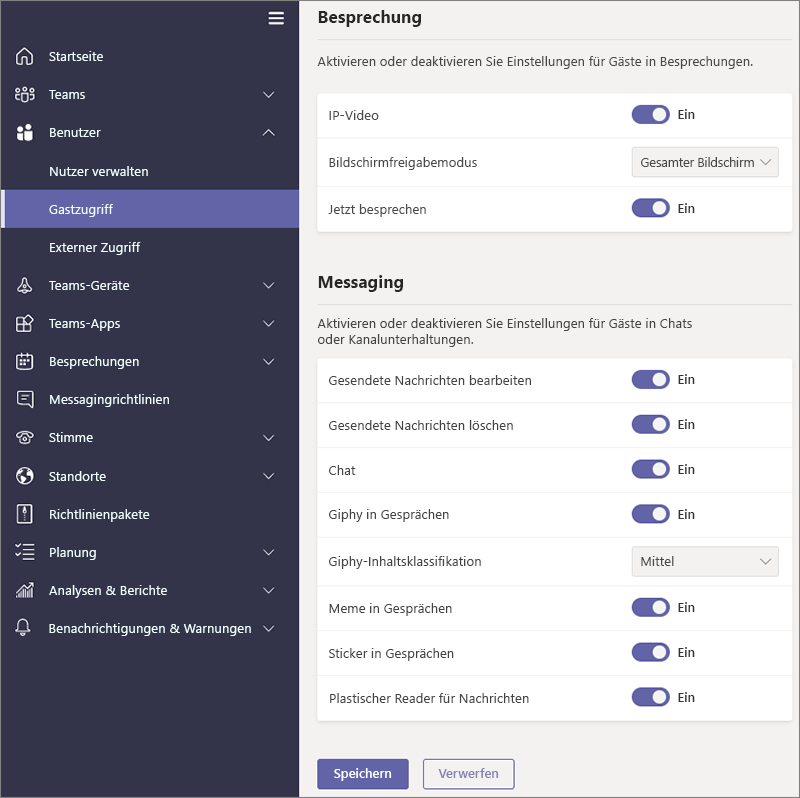

Verwalten des Gastzugriffs in Microsoft Teams
======================================

**Guest** ist ein Benutzer/Lizenztyp in Microsoft Teams, der in allen Office 365 Business Premium-, Office 365 Enterprise-und Office 365 Education-Abonnements enthalten ist. Eine zusätzliche Office 365-Lizenz ist nicht erforderlich. Der Gastzugriff auf Microsoft Teams ist eine Einstellung auf Mandantenebene, die standardmäßig deaktiviert ist. Details zum Aktivieren des Gastzugriffs finden Sie unter Aktivieren [oder Deaktivieren des Gastzugriffs auf Microsoft Teams](set-up-guests.md).

Nachdem der **Gast** Benutzer/Lizenztyp aktiviert ist, können Sie die Einstellungen für Gäste über die Steuerelemente konfigurieren, die unter [Verwalten von Microsoft Teams-Einstellungen für Ihre Organisation](enable-features-office-365.md) und [Verwalten von Teams während des Übergangs zu den neuen Microsoft Teams beschrieben sind. Admin Center](manage-teams-skypeforbusiness-admin-center.md).     
    
IT-Administratoren können Gäste auf Mandantenebene hinzufügen, Benutzerrichtlinien und-Berechtigungen für Gäste einrichten und verwalten sowie Berichte über Gastbenutzer Aktivitäten abrufen. Diese Steuerelemente stehen über das Microsoft Teams Admin Center zur Verfügung. Inhalte und Aktivitäten von Gastbenutzern unterliegen dem gleichen Compliance- und Überwachungsschutz wie der Rest von Office 365.

Team Besitzer können neue Gäste einladen und ihren Teams vorhandene Verzeichnis Gastbenutzer hinzufügen. Team Besitzer können Gastbenutzer mithilfe von **Teams** > , die**Teams verwalten**, identifizieren und die Kanal bezogenen Funktionen für Gäste über **organisationsweite Einstellungen** > für**Gastzugriff**festlegen, einschließlich der Möglichkeit, dass Gäste das Erstellen, aktualisieren und Löschen Sie Kanäle, wie in der nachstehenden Abbildung zu sehen ist.

  
Sie können das Azure Active Directory (Azure AD)-Portal verwenden, um Gäste und deren Zugriff auf Office 365-und Teamressourcen zu verwalten. Teams Guest Access nutzt Azure AD Business-to-Business (B2B)-Zusammenarbeitsfunktionen als zugrunde liegende Infrastruktur, um Informationen zu Sicherheitsgrundsätzen wie Identitätseigenschaften, Mitgliedschaften und mehrstufige Authentifizierungseinstellungen zu speichern. Weitere Informationen zu Azure AD B2B finden Sie unter [Was ist Azure AD B2B Collaboration?](https://go.microsoft.com/fwlink/p/?linkid=853011) und [Azure Active Directory B2B Collaboration FAQs](https://go.microsoft.com/fwlink/p/?linkid=853020).

> [!NOTE]
> Microsoft Teams ehrt die externen Azure AD-Einstellungen immer, um Gastbenutzer Ergänzungen für den Mandanten zuzulassen oder zu verhindern. Weitere Informationen finden Sie unter [Autorisieren des Gastzugriffs in Microsoft Teams](Teams-dependencies.md).
  
## Gastzugriff und externer Zugriff (Partnerverbund) im Vergleich

[!INCLUDE [guest-vs-external-access](includes/guest-vs-external-access.md)]

## Regelmäßiges Überprüfen des Gastzugriffs

In Teams können Sie für jeden lizenzierten Benutzer fünf Gäste hinzufügen. Aufgrund dieser Einschränkung oder weil Sie Ihren Mandanten auf dem neuesten Stand halten möchten, sollten Sie den Gastzugriff in regelmäßigen Abständen überprüfen, um Benutzer zu identifizieren, die Zugriff haben, die Sie nicht mehr benötigen. Sie können Azure AD verwenden, um eine Zugriffsüberprüfung für Gruppenmitglieder oder Benutzer zu erstellen, die einer Anwendung zugewiesen sind. Durch das Erstellen von wiederkehrenden Zugriffs Bewertungen können Sie Zeit sparen. Wenn Sie Benutzer, die Zugriff auf eine Anwendung haben oder Mitglieder einer Gruppe sind, regelmäßig überprüfen müssen, können Sie die Häufigkeit dieser Bewertungen definieren. 

Sie können eine Bewertung des Gastzugriffs selbst durchführen, die Gäste bitten, ihre eigene Mitgliedschaft zu überprüfen, oder einen Anwendungsbesitzer oder Entscheidungsträger des Unternehmens bitten, die Zugriffsüberprüfung durchzuführen. Sie verwenden das Azure-Portal, um Bewertungen von Gastzugriffen durchzuführen. Weitere Informationen finden Sie unter [Verwalten des Gastzugriffs mit Azure AD Access-Rezensionen](https://docs.microsoft.com/en-us/azure/active-directory/governance/manage-guest-access-with-access-reviews).

###  Voraussetzungen

Zugriffsüberprüfungen sind mit der Premium P2-Edition von Azure AD verfügbar, die in Microsoft Enterprise Mobility + Security, E5 enthalten ist. Weitere Informationen finden Sie unter [Azure Active Directory](https://docs.microsoft.com/en-us/azure/active-directory/fundamentals/active-directory-whatis)-Editionen. Jeder Benutzer, der mit diesem Feature interagiert, indem er eine Rezension erstellt, eine Rezension ausfüllt oder seinen Zugriff bestätigt, muss über eine Lizenz verfügen.

Teams schränkt nicht die Anzahl der Gäste ein, die Sie hinzufügen können. Die Gesamtzahl der Gäste, die Ihrem Mandanten hinzugefügt werden können, basiert jedoch auf dem, was Ihre Aad-Lizenzierung zulässt. Weitere Informationen finden Sie unter [Azure AD B2B-Zusammenarbeit Lizenzierung](https://docs.microsoft.com/en-us/azure/active-directory/b2b/licensing-guidance).

## Gastzugriffs Latenzen

Die Gast Einstellungen werden in Azure AD eingestellt. Es dauert ca. 2 bis 24 Stunden, bis die Änderungen in der gesamten Office 365-Organisation wirksam werden. Wenn Benutzer versuchen, einen Gast zu ihrem Team hinzuzufügen, und dabei die Meldung „Wenden Sie sich an Ihren Administrator“ sehen, ist wahrscheinlich die Gastfunktion nicht aktiviert, oder die Einstellungen sind noch nicht wirksam.

## Weitere Informationen

Informationen zum Verwenden von PowerShell zum Verwalten des Gastzugriffs finden Sie unter [Verwenden von PowerShell zum Steuern des Gastzugriffs auf ein Team](guest-access-powershell.md).

