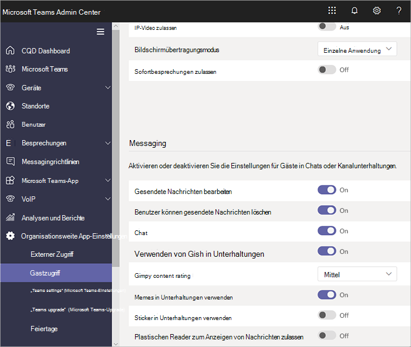

Verwalten des Benutzerzugriffs in Microsoft Teams
======================================

**Gast** ist ein Benutzer-Lizenz in Microsoft-Teams, die alle Abonnements für Office 365 Business Premium, Office 365 Enterprise und Office 365 Education enthalten ist. Eine zusätzliche Office 365-Lizenz ist nicht erforderlich. Der Gastzugriff auf Microsoft Teams ist eine Einstellung auf Mandantenebene, die standardmäßig deaktiviert ist. Ausführliche Informationen zum Gastzugriff zu ermöglichen finden Sie unter [Aktivieren oder Deaktivieren der Gastzugriff auf Microsoft-Teams](set-up-guests.md).

Nachdem der **Gast** User-Lizenz Typ aktiviert ist, können Sie Einstellungen konfigurieren, für Gäste über die Steuerelemente in [Microsoft-Teams, Verwalten von features in Office 365-Organisation](enable-features-office-365.md) und [Teams verwalten während des Übergangs auf die neue Microsoft beschrieben Teams und Skype für Business Admin Center](manage-teams-skypeforbusiness-admin-center.md).     
    
IT-Administratoren können Gäste auf der Ebene der Mandant hinzufügen, festlegen und Verwalten von Gast-Richtlinien für Benutzer und Berechtigungen und Pull Berichte über Benutzeraktivität Gast. Diese Steuerelemente sind über die Microsoft-Teams & Skype für Business Admin Center verfügbar. Inhalte und Aktivitäten von Gastbenutzern unterliegen dem gleichen Compliance- und Überwachungsschutz wie der Rest von Office 365.

Team Besitzer können neue Gäste einladen und ihre Teams vorhandenen Directory Gastbenutzer hinzuzufügen. Team Besitzer können Gastbenutzern über **Teams**identifizieren > **Verwalten Teams**und Set-Kanal-bezogenen Funktionen für Gäste über **Org geltende Einstellungen** > **Gast Access**, einschließlich Gästen zu erstellen, aktualisieren, sodass und Löschen Sie Kanäle, wie im folgenden Screenshot dargestellt.

  
Azure Active Directory-Portal können Sie Gäste und deren Zugriff auf Office 365 und Teams Ressourcen verwalten. Die Teams-Einstellung für Gastzugriff nutzt die Azure Active Directory-B2B-Funktionen (Business-to-Business) zur Zusammenarbeit als zugrunde liegende Infrastruktur zum Speichern der Informationen über Sicherheitsprinzipien, wie zum Beispiel Einstellungen für Identitätseigenschaften, Mitgliedschaften und für die mehrstufige Authentifizierung. Weitere Informationen zu Azure Active Directory B2B finden Sie unter [Was ist die Azure AD B2B-Zusammenarbeit?](https://go.microsoft.com/fwlink/p/?linkid=853011) und [Häufig gestellte Fragen zur Azure Active Directory B2B-Zusammenarbeit](https://go.microsoft.com/fwlink/p/?linkid=853020).

> [!NOTE]
> Microsoft-Teams berücksichtigt immer externe Azure Active Directory-Einstellungen zum Zulassen oder Sperren von Gast Benutzer Ergänzungen, die dem Mandanten. Weitere Informationen finden Sie unter [Autorisieren Gast Access in Microsoft-Teams](Teams-dependencies.md).
  
## Gastzugriff im Vergleich zum externen Zugriff (Verbund)

[!INCLUDE [guest-vs-external-access](includes/guest-vs-external-access.md)]

## Überprüfen Sie regelmäßig Gastzugriff

Teams können Sie 5 Gäste für jeden lizenzierten Benutzer hinzufügen. Aufgrund dieser Einschränkung oder, da Sie Ihrem Mandanten auf dem aktuellen Stand beibehalten möchten, sollten Sie überprüfen, Gast Access in regelmäßigen Abständen zum Identifizieren von Benutzern, die Zugriff haben, die sie nicht mehr benötigt werden. Azure Active Directory (AD Azure) können Sie eine Access-Überprüfung für Mitglieder der Gruppe oder Benutzer zugewiesen sind, an eine Anwendung zu erstellen. Erstellen von sich wiederholenden Access Bewertungen können Sie Zeit sparen. Wenn Sie müssen Benutzer haben Zugriff auf eine Anwendung oder sind Mitglieder einer Gruppe Benutzer regelmäßig zu überprüfen, können Sie die Häufigkeit der diese Bewertungen definieren. 

Sie können Überprüfung Gast Access selbst, bitten Sie Gäste eigenen Mitgliedschaft überprüfen oder bitten Sie einen Besitzer der Anwendung oder Entscheidungsträger im Unternehmen die Access-Überprüfung ausführen. Sie verwenden das Azure-Portal, um Gast Access überprüft werden. Weitere Informationen finden Sie unter [Manage Gast Access Azure AD-Zugriff überprüft](https://docs.microsoft.com/en-us/azure/active-directory/governance/manage-guest-access-with-access-reviews).

###  Voraussetzungen

Access Bewertungen stehen zur Verfügung, mit der P2 Premium Edition von Azure Active Directory, die in Microsoft Enterprise Mobilität + Sicherheit, E5 enthalten ist. Weitere Informationen finden Sie unter "eine Edition in [Azure Active Directory-Editionen](https://docs.microsoft.com/en-us/azure/active-directory/fundamentals/active-directory-whatis)wählen". Jeder Benutzer, die mit diesem Feature durch Erstellen einer Überprüfung, eine Überprüfung ausfüllen oder bestätigt wird deren Zugriff interagiert muss eine Lizenz verfügen. 

Teams verhindert nicht die Anzahl von Gästen, die Sie hinzufügen können. Die Gesamtzahl der Gäste, die Ihre Mandanten hinzugefügt werden können, jedoch basiert auf welche Ihrer AAD lizenziert sind. Weitere Informationen finden Sie unter [Azure AD B2B Zusammenarbeit Lizenzierung](https://docs.microsoft.com/en-us/azure/active-directory/b2b/licensing-guidance).

## Gast Access Wartezeiten

Die Gasteinstellungen werden in Azure Active Directory festgelegt. Es dauert ca. 2 bis 24 Stunden, bis die Änderungen in der gesamten Office 365-Organisation wirksam werden. Wenn ein Benutzer die Meldung erhält "Wenden Sie sich an Ihren Administrator", wenn sie versuchen, ihr Team Gastsystem hinzuzufügen, ist es wahrscheinlich, dass das Feature Gast noch nicht aktiviert wurde, oder die Einstellungen für eine effektive sind noch nicht.

## Weitere Informationen

Informationen zum Verwenden von PowerShell zum Verwalten von Access Gast finden Sie unter [Verwenden von PowerShell zur Steuerung des Zugriffs auf ein Team Gast](guest-access-powershell.md).

