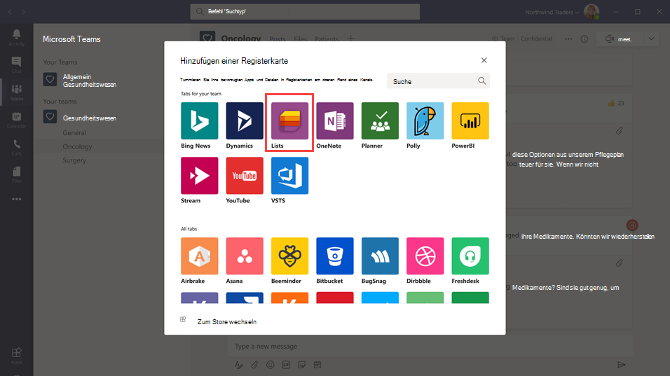
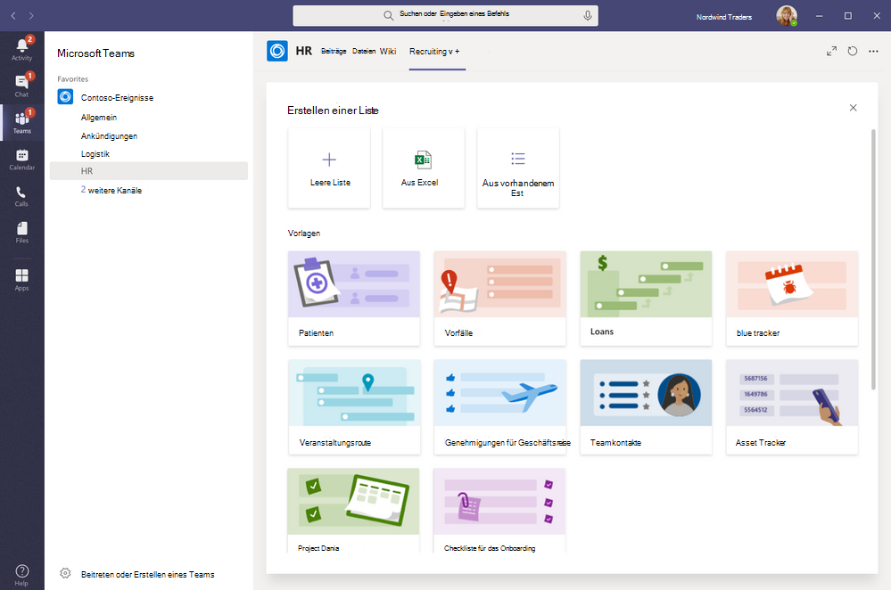

# Verwalten der Listen-App für Ihre Organisation in Microsoft TeamsManage the Lists app for your organization in Microsoft Teams

## Übersicht überlistenOverview of Lists

Mithilfe der Listen-app in Microsoft Teams können Benutzer in Ihrer Organisation Informationen nachvollziehen, Arbeit organisieren und Workflows verwalten.The Lists app in Microsoft Teams helps users in your organization track information, organize work, and manage workflows. Mit Listen können Benutzerdaten wie Probleme, Ressourcen, Routinen, Kontakte, Inventar, Vorfälle, Kredite, Patienten und mehr mithilfe von anpassbaren Ansichten, Regeln und Benachrichtigungen nachverfolgen, um alle Personen im Team synchron zu halten.With Lists, users can track data such as issues, assets, routines, contacts, inventory, incidents, loans, patients, and more using customizable views, rules, and alerts to keep everyone on the team in sync.

In Teams greifen Benutzer auf Listen als Registerkarte in einem Kanal zu.In Teams, users access Lists as a tab in a channel. Klicken Sie **+** , um den Registerkarten Katalog zu öffnen, und fügen Sie einen neuen Listen-App-Registerkarten-Instanz zu einem Kanal hinzu, um loszulegen.Click **+** to open the tab gallery and add a new Lists app tab instance to a channel to get started. 

Benutzer können neue Listen erstellen oder vorhandene Listen innerhalb des gleichen Teams oder auf einer anderen SharePoint-Website anheften, auf die Sie Zugriff haben.Users can create new lists or pin existing lists from within the same team or from a different SharePoint site that they have access to. Neue Listen können von Grund auf neu erstellt werden, von integrierten Vorlagen, basierend auf der Struktur einer vorhandenen Liste oder durch Importieren von Daten aus einer Excel-Arbeitsmappe.New lists can be created from scratch, from built-in templates, based on the structure of an existing list, or by importing data from an Excel workbook. Die Listen-APP ist in den Desktop-, Web-und mobilen Clients von Teams verfügbar.The Lists app is available in Teams desktop, web, and mobile clients.

## VorlagenTemplates

Vorlagen in Listen sind auf häufige Informations Überwachungsszenarien für Benutzer zugeschnitten.Templates in Lists are tailored to common information tracking scenarios for users. Jede Vorlage enthält eine vordefinierte Listenstruktur, Formularlayouts und Formatierungsoptionen sowohl in einer Listenansicht als auch in einer Detail Ansichtsebene, damit Benutzer schnell loslegen können.Each template comes with a predefined list structure, form layouts, and formatting options at both a list view and a details view level to help users get started quickly. Nachdem Sie eine Vorlage ausgewählt haben, erhalten die Benutzer eine Vorschau, wie die Liste aussehen wird, sowie einige Beispieldaten.After selecting a template, users get a preview of what the list will look like, along with some sample data. Nachfolgend finden Sie einige Beispiele dafür, wie Teams in Ihrer Organisation die vordefinierten Vorlagen in Listen verwenden können:Here's some examples of how teams in your organization can use the predefined templates in Lists:

- Verfolgen Sie Probleme, und bringen Sie Sie mithilfe der Issue Tracker-Vorlage zum Abschluss.Track issues and bring them to closure using the Issue tracker template.
- Organisieren Sie alle Ihre Veranstaltungsdetails mit der Vorlage für das Event-Reiseplan.Organize all your event details with the Event itinerary template.
- Verwenden Sie die Vorlage "Patienten", um die Anforderungen und den Status von Patienten für Gesundheitsteams in Ihrer Gesundheitsorganisation für die Überwachung und Koordinierung der Behandlung festzuhalten.Use the Patients template to record the needs and status of patients for health teams in your healthcare organization to monitor and coordinate care.
- Nachvollziehen des Status von Darlehensanträgen mit der Vorlage "Kredite"Track the status of loan applications with the Loans template.

## BeispielszenarioExample scenario

Eine lokale Poststelle ist für das Sortieren und die Zustellung von e-Mails in ihrem Distrikt verantwortlich.A local post office is responsible for sorting and delivering mail in their district. Jeden Morgen hat die Post ein Team zusammengedrängt, um die täglichen Ziele zu überprüfen, Ankündigungen auszutauschen und bekannte Vorfälle zu besprechen.Each morning, the post office has a team huddle to review daily goals, share announcements, and discuss known incidents.

Nach dem drängen nehmen e-Mail-Anbieter Ihre e-Mail-Adresse auf und starten deren Übermittlungsroute.After the huddle, mail carriers pick up their mail and start their delivery route. Zwischenfälle können entlang einer Route auftreten, beispielsweise ein Fahrzeug Unfall, ein Hund-bezogenes Problem oder ein gesellschaftlicher Unruhe Protest.Incidents can occur along a route, for example, a vehicle accident, dog-related issue, or social unrest protest. Wenn e-Mail-Anbieter auf einen Vorfall stoßen, verwenden Sie Teams auf Ihren mobilen Geräten, um die Vorfalldetails aufzuzeichnen, die in einer Liste im Teamkanal nachverfolgt werden.When mail carriers encounter an incident, they use Teams on their mobile devices to record the incident details, which are tracked in a list in the team channel. Jeder im Team, einschließlich der e-Mail-Anbieter im Feld, kann diese Informationen sehen und auf dem Laufenden bleiben.Everyone on the team, including mail carriers in the field, can see this information and stay informed.

Bevor Sie zu Teams wechseln, mussten e-Mail-Anbieter zum Post Office zurückkehren, um ein Hardcopy-Formular abzuschließen, um einen Vorfall zu melden, der in eine Excel-Tabelle eingegeben wurde.Before moving to Teams, mail carriers had to go back to the post office to complete a hard-copy form to report an incident which was entered in an Excel spreadsheet. Teams gibt e-Mail-Netzbetreibern zunächst ein Mobiltelefon, erleben Sie, wo Sie Listen verwenden können, um Vorfälle in dem Feld zu melden, während Sie auftreten, geben Sie Vorfalldetails mit Teammitgliedern frei, führen Sie Unterhaltungen über Sie auf dem Kanal aus, und fahren Sie Zwischenfälle aufTeams gives mail carriers a mobile first, experience where they can use Lists to report incidents in the field as they happen, share incident details with team members, have conversations about them on the channel, and drive incidents to resolution.

## Was Sie überlisten wissen müssenWhat you need to know about Lists

### Listen sind in allen Teams und Kanälen verfügbarLists is available in every team and channel

Listen ist für alle Teams-Benutzer vorinstalliert und steht direkt im Reiter Katalog jedes Teams und Kanals zur Verfügung.Lists is pre-installed for all Teams users and is available directly in the tab gallery of every team and channel. Das bedeutet, dass Benutzer nicht zum App Store von Teams wechseln müssen, um Sie zu installieren.This means that users don't have to go to the Teams app store to install it.

### Listen und SharePointLists and SharePoint

Listendaten werden auf der SharePoint Online-Teamwebsite gespeichert.Lists data is stored in the SharePoint Online team site. Weitere Informationen dazu, wie SharePoint Online mit Teams interagiert, finden Sie unter [Interaktion zwischen SharePoint Online und OneDrive for Business mit Teams](SharePoint-OneDrive-interact.md).To learn more about how SharePoint Online interacts with Teams, see [How SharePoint Online and OneDrive for Business interact with Teams](SharePoint-OneDrive-interact.md).

Die in SharePoint gesetzten Berechtigungen gelten für Listen, die in der App "Listen" erstellt wurden.Permissions set in SharePoint apply to lists created in the Lists app. Standardmäßig erben Listenberechtigungen von der Website, zu der Sie gehören.By default, lists inherit permissions from the site to which they belong. Diese Berechtigungen Regeln die Arten von Aktionen, die Benutzer ausführen können, beispielsweise, ob Sie Listen erstellen oder bearbeiten können.These permissions govern the types of actions that users can do, such as whether they can create or edit lists. Weitere Informationen finden Sie unter [Berechtigungsstufen in SharePoint](https://docs.microsoft.com/sharepoint/understanding-permission-levels) und [Benutzerberechtigungen und Berechtigungsstufen in SharePoint Server](https://docs.microsoft.com/sharepoint/sites/user-permissions-and-permission-levels).To learn more, see [Permission levels in SharePoint](https://docs.microsoft.com/sharepoint/understanding-permission-levels) and [User permissions and permission levels in SharePoint Server](https://docs.microsoft.com/sharepoint/sites/user-permissions-and-permission-levels).

In bestimmten Szenarien möchten Sie möglicherweise einschränken, welche Aktionen Benutzer in Listen ausführen können.In certain scenarios, you may want restrict what actions users can do in lists. Beispielsweise bearbeitet eine Person in einem Team eine Listenansicht, die Sie für alle Teammitglieder ändert, und Sie möchten nur dem Teambesitzer oder bestimmten Teammitgliedern gestatten, Listenansichten zu bearbeiten.For example, a person on a team edits a list view, which changes it for all team members, and you want to allow only the team owner or certain team members to edit list views. Weitere Informationen finden Sie unter [Anpassen von Berechtigungen für eine SharePoint-Liste oder-Bibliothek](https://support.microsoft.com/office/customize-permissions-for-a-sharepoint-list-or-library-02d770f3-59eb-4910-a608-5f84cc297782#ID0EAACAAA=Online,_2019,_2016,_2013).To learn more, see [Customize permissions for a SharePoint list or library](https://support.microsoft.com/office/customize-permissions-for-a-sharepoint-list-or-library-02d770f3-59eb-4910-a608-5f84cc297782#ID0EAACAAA=Online,_2019,_2016,_2013).

> [!NOTE]
> An diesem Punkt sind Besitzer-und Mitgliedsberechtigungen in einem Team in keiner Weise mit Berechtigungen auf der Teamwebsite verknüpft, die das Verhalten von Listen oder der App "Listen" Regeln.At this point, owner and member permissions in a team aren't linked in any way to permissions in the team site that govern the behavior of lists or the Lists App. Basierend auf Kundenfeedback und-Nutzung wird dies jedoch für eine zukünftige Iteration des Produkts berücksichtigt.However, based on customer feedback and usage, this will be considered for a future iteration of the product.  

### EinschränkungenLimitations

Mit Listen erhalten Benutzer eine Desktop-, Web-und mobil Funkfunktionalität.With Lists, users get a desktop, web, and mobile experience. Es ist wichtig zu wissen, dass Benutzer keine neuen Listen erstellen oder vorhandene Listen mithilfe von Listen auf dem mobilen Teams-Client anheften können.It's important to know that users can't create new lists or pin existing lists using Lists on the Teams mobile client. Wenn Sie eine Liste auf dem Mobile Teams-Client anzeigen oder bearbeiten möchten, muss zuerst eine Liste erstellt oder mithilfe von Listen auf dem Desktop-oder Webclient von Teams hinzugefügt werden.To view or edit a list on the Teams mobile client, a list must first be created or added using Lists on the Teams desktop or web client.

Gäste können keine Liste erstellen oder löschen.Guests can't create or delete a list. Sie können Listenelemente zu vorhandenen Listen hinzufügen, neue Konversationen zu Listenelementen beginnen und auf vorhandene Konversationen zu Listenelementen Antworten.They can add list items to existing lists, start new conversations about list items, and reply to existing conversations about list items.

### Listen und die SharePoint-AppLists and the SharePoint app

Wenn Benutzer in Ihrer Organisation Listen mithilfe der SharePoint-App erstellt haben, werden diese Listen automatisch in Listen verschoben, ohne dass eine Aktion des Benutzers erforderlich ist.If users in your organization created lists using the SharePoint app, those lists will be automatically moved to Lists without any action needed from the user. Verwenden Sie die Listen-APP, um die beste und reichste Liste der Integrationsfunktionen in Microsoft Teams zu erhalten, und fixieren Sie Ihre vorhandenen Listen.To get the best and richest lists integration experience in Teams, use the Lists app and pin your existing lists.

## Einrichten von ListenSet up Lists

### Aktivieren oder Deaktivieren von Listen in Ihrer OrganisationEnable or disable Lists in your organization

Listen ist standardmäßig für alle Teams-Benutzer in Ihrer Organisation aktiviert.Lists is enabled by default for all Teams users in your organization. Sie können die App auf Organisationsebene im Microsoft Teams Admin Center auf der Seite [Apps verwalten](manage-apps.md) deaktivieren oder aktivieren.You can turn off or turn on the app at the org level on the [Manage apps](manage-apps.md) page in the Microsoft Teams admin center.

1. Wechseln Sie in der linken Navigationsleiste des Microsoft Teams Admin Centers zu **Teams-Apps** > **Apps verwalten** .In the left navigation of the Microsoft Teams admin center, go to **Teams apps** > **Manage apps** .
2. Führen Sie einen der folgenden Schritte aus:Do one of the following:

    - Wenn Sie Listen für Ihre Organisation deaktivieren möchten, suchen Sie nach der App "Listen", wählen Sie Sie aus, und klicken Sie dann auf **blockieren** .To turn off Lists for your organization, search for the Lists app, select it, and then click **Block** .
    - Um Listen für Ihre Organisation zu aktivieren, suchen Sie nach der App "Listen", wählen Sie Sie aus, und klicken Sie dann auf **zulassen** .To turn on Lists for your organization, search for the Lists app, select it, and then click **Allow** .

### Aktivieren oder Deaktivieren von Listen für bestimmte Benutzer in Ihrer OrganisationEnable or disable Lists for specific users in your organization

Wenn Sie bestimmten Benutzern in Ihrer Organisation die Verwendung von Listen erlauben oder blockieren möchten, stellen Sie sicher, dass Listen für Ihre Organisation auf der Seite " [apps verwalten](manage-apps.md) " aktiviert ist, und erstellen Sie dann eine benutzerdefinierte App-Berechtigungsrichtlinie, und weisen Sie diese Benutzern zu.To allow or block specific users in your organization from using Lists, make sure Lists is turned on for your organization on the [Manage apps](manage-apps.md) page, and then create a custom app permission policy and assign it to those users. Weitere Informationen finden Sie unter [Verwalten von Richtlinien für App-Berechtigungen in Microsoft Teams](teams-app-permission-policies.md).To learn more, see [Manage app permission policies in Teams](teams-app-permission-policies.md).

## Durchsuchen des Überwachungsprotokolls nach Listen EreignissenSearch the audit log for list events

Listen werden für die Überwachung auf Unternehmensebene aktiviert, sodass Sie im Überwachungsprotokoll im Security & Compliance Center nach Listen und Listenelement Ereignissen suchen können.Lists are enabled with enterprise-level auditing so you can search for lists and list item events in the audit log in the Security & Compliance Center. Weitere Informationen finden Sie unter [Durchsuchen des Überwachungsprotokolls im Security & Compliance Center](https://docs.microsoft.com/microsoft-365/compliance/search-the-audit-log-in-security-and-compliance).To learn more, see [Search the audit log in the Security & Compliance Center](https://docs.microsoft.com/microsoft-365/compliance/search-the-audit-log-in-security-and-compliance).

Eine Liste der Überwachungsereignisse, die für die Listen-app in Teams relevant sind, finden Sie unter [SharePoint-Listen Aktivitäten](https://docs.microsoft.com/microsoft-365/compliance/search-the-audit-log-in-security-and-compliance#sharepoint-list-activities).For a list of audit events that are relevant to the Lists app in Teams, see [SharePoint list activities](https://docs.microsoft.com/microsoft-365/compliance/search-the-audit-log-in-security-and-compliance#sharepoint-list-activities).

Bevor Sie das Überwachungsprotokoll durchsuchen können, müssen Sie zuerst die Überwachung im [Security & Compliance Center](https://protection.office.com)aktivieren.Before you can search the audit log, you have to first turn on auditing in the [Security & Compliance Center](https://protection.office.com). Beachten Sie, dass Überwachungsdaten nur ab dem Zeitpunkt verfügbar sind, an dem Sie die Überwachung aktiviert haben.Keep in mind that audit data is only available from the point at which you turned on auditing.

## Power Automation, Power apps und Graph-APIPower Automate, Power Apps, and Graph API

Listen unterstützt [Power Automation](https://preview.flow.microsoft.comconnectors/shared_sharepointonline/?slug=sharepoint) für Workflows und [Power apps](https://docs.microsoft.com/powerapps/maker/canvas-apps/customize-list-form) für Listenformulare.Lists supports [Power Automate](https://preview.flow.microsoft.comconnectors/shared_sharepointonline/?slug=sharepoint) for workflows and [Power Apps](https://docs.microsoft.com/powerapps/maker/canvas-apps/customize-list-form) for list forms. Entwickler können die [Listen-API](https://docs.microsoft.com/sharepoint/dev/sp-add-ins/working-with-lists-and-list-items-with-rest) verwenden, um Listendaten als Quelle über Microsoft Graph zu verbinden.Developers can use the [Lists API](https://docs.microsoft.com/sharepoint/dev/sp-add-ins/working-with-lists-and-list-items-with-rest) to connect list data as a source through Microsoft Graph.

## Abgeben von Feedback oder melden eines ProblemsGive feedback or report an issue
  
Wenn Sie uns Feedback senden oder ein Problem melden möchten, klicken Sie unten auf der linken Navigationsleiste in Teams auf **Hilfe** , und wählen Sie dann **Problem melden** aus.To send us feedback or report an issue, click **Help** near the bottom of the left navigation in Teams, and then select **Report a problem** . Wählen Sie **Listen** aus, und geben Sie dann Ihr Feedback oder Details zu dem Problem ein, das Sie gerade erleben.Select **Lists** , and then enter your feedback or details about the issue you're experiencing.

## Verwandte ThemenRelated topics

- [Listet die Hilfedokumentation aufLists help documentation](https://support.microsoft.com/office/apps-and-services-cc1fba57-9900-4634-8306-2360a40c665b#PickTab=Lists)
