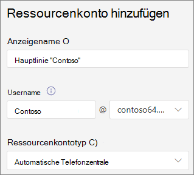
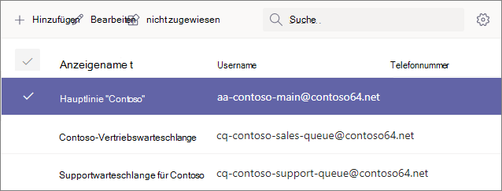

# <a name="manage-resource-accounts-in-microsoft-teams"></a>Verwalten von Ressourcenkonten in Microsoft Teams

Ein Ressourcenkonto ist ein deaktiviertes Benutzerobjekt in Azure AD und kann zur allgemeinen Darstellung von Ressourcen verwendet werden. Beispielsweise kann ein Ressourcenkonto in einem Exchange verwendet werden, um Konferenzräume zu repräsentieren und ihnen eine Telefonnummer und einen Kalender zu ermöglichen. Ein Ressourcenkonto kann in Microsoft 365 oder lokal unter Verwendung von Skype for Business Server 2019 verwaltet werden.

In Microsoft Teams für jede automatische Telefonhalterung oder Anrufwarteschleife ein Ressourcenkonto erforderlich. Ressourcenkonten können auch Servicetelefonnummern zugewiesen werden. Auf diese Weise weisen Sie automatischen Telefonkonferenzen und Anrufwarteschleifen Telefonnummern zu, damit Anrufer von außerhalb Teams die automatische Telefon attendant oder die Anrufwarteschleife erreichen können.

In diesem Artikel wird beschrieben, wie Sie Ressourcenkonten erstellen und für die Verwendung mit automatischen Telefonkonferenzen und Anrufwarteschleifen bereit machen.

Bevor Sie mit den Verfahren in diesem Artikel beginnen, stellen Sie sicher, dass Sie Die folgenden Schritte durchgeführt haben:

- [Abrufen virtueller Benutzerlizenzen](#obtain-virtual-user-licenses)
- [Beziehen von Leistungsnummern](#obtain-service-numbers)

### <a name="obtain-virtual-user-licenses"></a>Abrufen virtueller Benutzerlizenzen

Für jedes Ressourcenkonto ist eine Lizenz erforderlich, um mit automatischen Telefonkonferenzen und Anrufwarteschleifen arbeiten zu können. Sie können eine kostenlose Microsoft 365 Telefonsystem *- Virtual User-Lizenz* verwenden. Informationen zum Erwerben dieser Lizenzen finden Sie unter [Lizenz für virtuelle Benutzer.](teams-add-on-licensing/virtual-user.md)

Weiter später in diesem Artikel wird beschrieben, wie Die Lizenz einem Ressourcenkonto zugewiesen wird.

Um die Lizenz für virtuelle Benutzer zu erhalten, wechseln Sie im Microsoft 365 Admin Center zu  >    >  **Add-On-Abonnements** für Abrechnungskaufdienste, und scrollen Sie bis zum Ende – es wird *"Telefonsystem - Virtual User license"* angezeigt. Wählen Sie **Jetzt kaufen** aus. Es entstehen keine Kosten, Sie müssen jedoch dennoch die diese Schritte befolgen, um die Lizenz zu erwerben.

### <a name="obtain-service-numbers"></a>Beziehen von Leistungsnummern

Servicenummern sind für automatische Telefonisten und Anrufwarteschleifen optional, Sie benötigen jedoch mindestens eine Servicenummer, damit Anrufer Ihre automatische Telefon attendant und die Konfiguration der Anrufwarteschleife erreichen können. Für jede automatische Telefonant oder Anrufwarteschleife, die Sie direkt über eine Servicenummer erreichen möchten, müssen Sie über ein Ressourcenkonto mit einer zugeordneten Dienstnummer verfügen.

Für Ressourcenkonten können gebührenpflichtige oder gebührenfreie Leistungsnummern verwendet werden. Sie können neue Nummern anfordern oder vorhandene Nummern von einem anderen Netzbetreiber portieren.

Informationen zum Abrufen neuer Servicenummern finden Sie unter [Abrufen von Servicetelefonnummern.](getting-service-phone-numbers.md)

Informationen zum Portieren einer Nummer von einem anderen Netzbetreiber finden Sie unter [Übertragen von Telefonnummern zu Teams](phone-number-calling-plans/transfer-phone-numbers-to-teams.md).

## <a name="create-a-resource-account"></a>Erstellen eines Ressourcenkontos

Sie können ein Ressourcenkonto im Teams Admin Center erstellen.



1. Erweitern Sie Teams Admin Center **Organisationsweite** Einstellungen , und klicken Sie dann **auf Ressourcenkonten**.

2. Klicken Sie auf **Hinzufügen**.

3. Geben Sie **im Bereich Ressourcenkonto hinzufügen** die Informationen **Anzeigename,** **Benutzername** und **Ressourcenkontotyp ein.** Der Ressourcenkontotyp kann entweder **"Automatische Telefonant"** oder "Anrufwarteschleife" **sein,** je nachdem, wie Sie dieses Ressourcenkonto verwenden möchten.

4. Klicken Sie auf **Speichern**.



## <a name="assign-a-license"></a>Lizenz zuweisen

Für jedes Ressourcenkonto müssen Sie eine Lizenz *"Microsoft 365 Telefonsystem – Virtueller Benutzer"* oder *Telefonsystem* zuweisen.


1. Klicken Sie Microsoft 365 Admin Center Ressourcenkonto, dem Sie eine Lizenz zuweisen möchten.

2. Wählen Sie **auf der Registerkarte Lizenzen** und Apps unter **Lizenzen** die Option Microsoft 365 Telefonsystem **- Virtueller Benutzer aus.**

3. Klicken Sie auf **Änderungen speichern**.

## <a name="assign-a-service-number"></a>Zuweisen einer Leistungsnummer

Wenn Sie das Ressourcenkonto mit einer automatischen Telefonant oder Anrufwarteschleife verwenden möchten, für die eine Servicenummer erforderlich ist, weisen Sie dem Ressourcenkonto eine Nummer zu.


1. Wählen Sie Teams Admin Center  auf der Seite Ressourcenkonten das Ressourcenkonto aus, dem Sie eine Dienstnummer zuordnen möchten, und klicken Sie dann auf **Zuordnen/Zuweisung wieder auf .**

2. Wählen Sie **Telefon Dropdownliste Zahlentyp** den Typ der Zahl aus, die Sie verwenden möchten.

3. Suchen Sie **im Feld Zugewiesene** Telefonnummer nach der zu verwendende Nummer, und klicken Sie auf **Hinzufügen**.

4. Klicken Sie auf **Speichern**.


Zum Zuweisen eines direkten Routings oder einer Hybridnummer zu einem Ressourcenkonto müssen Sie PowerShell verwenden:

`Set-CsOnlineApplicationInstance -Identity aa-contoso_main@contoso64.net -OnpremPhoneNumber +19295550150`

## <a name="next-steps"></a>Nächste Schritte

Nachdem Sie die Einrichtung des Ressourcenkontos abgeschlossen und bei Bedarf eine Servicenummer zugewiesen haben, können Sie das Ressourcenkonto mit einer automatischen Telefonbuchhalterung oder Anrufwarteschleife verwenden.

Weitere Informationen finden Sie in den folgenden Verweisen:

 - [Automatische Cloud-Telefonzentrale](create-a-phone-system-auto-attendant.md)

 - [Cloud-Anrufwarteschleife](create-a-phone-system-call-queue.md)

Sie können den  Anzeigenamen und den Typ des **Ressourcenkontos** mithilfe der Option **Bearbeiten** bearbeiten. Klicken Sie abschließend auf **Speichern**.

## <a name="change-an-existing-resource-account-to-use-a-virtual-user-license"></a>Ändern eines vorhandenen Ressourcenkontos, um eine virtuelle Benutzerlizenz zu verwenden

Wenn Sie die Lizenzen für Ihr vorhandenes Ressourcenkonto von einer **Telefonsystem-Lizenz** auf eine Virtual User-Lizenz umschalten möchten, müssen Sie die kostenlose Lizenz für virtuelle Benutzer erwerben und dann die Schritte im Microsoft 365 Admin Center zum Verschieben von Benutzern in ein anderes Abonnement [ausführen.](/microsoft-365/admin/manage/assign-licenses-to-users#move-users-to-a-different-subscription)

> [!WARNING]
> Entfernen Sie immer die vollständige Telefonsystemlizenz und weisen Sie die virtuelle Benutzerlizenz der gleichen Lizenzaktivität zu. Wenn Sie die alte Lizenz entfernen, die Kontoänderungen speichern, die neue Lizenz hinzufügen und dann die Kontoeinstellungen erneut speichern, funktioniert das Ressourcenkonto möglicherweise nicht mehr wie erwartet. In diesem Fall empfiehlt es sich, ein neues Ressourcenkonto für die virtuelle Benutzerlizenz zu erstellen und das beschädigte Ressourcenkonto zu entfernen.

## <a name="skype-for-business-server-2019"></a>Skype For Business Server 2019

Informationen zu Ressourcenkonten, die auf Skype For Business Server 2019 gespeichert werden und für [](/SkypeforBusiness/hybrid/plan-call-queue) Cloudanrufwarteschleifen und automatische Telefonkonferenzen in der Cloud verwendet werden können, finden Sie unter Planen von Cloudanrufwarteschlangen oder Planen automatischer Telefonkonferenzen in der [Cloud.](/SkypeForBusiness/hybrid/plan-cloud-auto-attendant) Hybridimplementierung (Nummern, die unter Direct-Routing gespeichert werden) werden mit dem [New-CsHybridApplicationEndpoint-Cmdlet](/powershell/module/skype/new-cshybridapplicationendpoint) auf einem lokalen Skype for Business Server 2019-Server konfiguriert.

Die Anwendungs-IDs, die Sie beim Erstellen der Anwendungsinstanzen verwenden müssen, sind:

- **Automatische Telefonzentrale:** ce933385-9390-45d1-9512-c8d228074e07
- **Anrufwarteschleife:** 11cd3e2e-fccb-42ad-ad00-878b93575e07

> [!NOTE]
> Wenn Sie möchten, dass die Anrufwarteschleife oder automatische Telefonzentrale von Benutzern von Skype For Business Server 2019 durchsucht werden kann, sollten Sie Ihre Ressourcenkonten in Skype For Business Server 2019 erstellen, da Online-Ressourcenkonten nicht mit Active Directory synchronisiert werden. Wenn DNS SRV-Einträge für sipfederationtls auf Skype for Business Server 2019  aufgelöst werden, müssen Ressourcenkonten auf Skype For Business Server 2019 mithilfe der SfB-Verwaltungsshell erstellt und mit Azure AD synchronisiert werden.

Bei hybride Implementierungen mit Skype for Business Server:

   [Planen automatischer Cloudtelefonzentralen](/SkypeForBusiness/hybrid/plan-cloud-auto-attendant)
  
   [Planen von Cloud-Anrufwarteschleifen](/SkypeforBusiness/hybrid/plan-call-queue)
   
   [Konfigurieren lokalen von Ressourcenkonten](/SkypeForBusiness/hybrid/configure-onprem-ra)


## <a name="delete-a-resource-account"></a>Löschen eines Ressourcenkontos

Stellen Sie sicher, dass Sie die Telefonnummer vom Ressourcenkonto trennen, bevor Sie sie löschen, um zu verhindern, dass Ihre Dienstnummer im Modus „Ausstehend“ verbleibt.

Anschließend können Sie das Ressourcenkonto in der Microsoft 365 Admin Center auf der Registerkarte Benutzer löschen.

Verwenden Sie den folgenden Cmdlet, um eine direkte Routing-Telefonnummer vom Ressourcenkonto zu trennen:

```powershell
Set-CsOnlineApplicationInstance -Identity  <Resource Account oid> -OnpremPhoneNumber ""
```