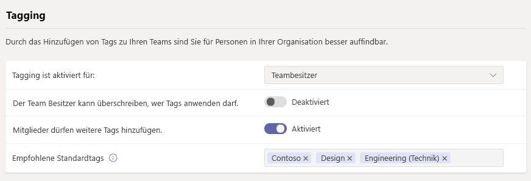
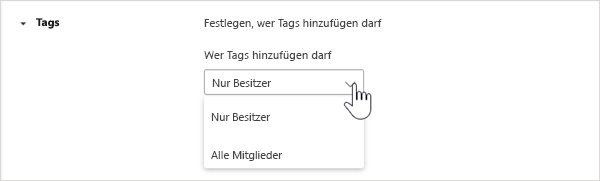
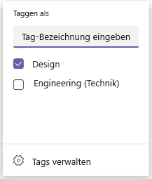

# Verwalten von Tags in Microsoft TeamsManage tags in Microsoft Teams

> [!NOTE]
> Eines der in diesem Artikel behandelten Features, **Tagging per Schicht**, wurde noch nicht veröffentlicht.One of the features discussed in this article, **tagging by shift**, hasn't yet been released. Es wurde angekündigt, und es wird bald kommen.It's been announced, and it's coming soon.Wenn Sie ein Administrator sind, können Sie herausfinden, wann dieses Feature im Nachrichtencenter veröffentlicht wird (im [Microsoft 365 Admin Center](https://portal.office.com/adminportal/home)). If you're an admin, you can find out when this feature will be released in the Message Center (in the [Microsoft 365 admin center](https://portal.office.com/adminportal/home)). Weitere Informationen zu bevorstehenden Features von Teams finden Sie in der [Microsoft 365-Roadmap](https://www.microsoft.com/microsoft-365/roadmap?filters=&searchterms=microsoft%2Cteams).To stay on top of upcoming Teams features, check out the [Microsoft 365 Roadmap](https://www.microsoft.com/microsoft-365/roadmap?filters=&searchterms=microsoft%2Cteams).

## ÜbersichtOverview

Mithilfe von Tags in Microsoft Teams können Benutzer schnell und einfach mit einer Teilmenge von Personen in einem Team verbunden werden.Tags in Microsoft Teams let users quickly and easily connect with a subset of people on a team. Sie können benutzerdefinierte Kategorien erstellen und zuweisen, um Personen anhand von Attributen wie Rolle, Projekt, Qualifikation oder Standort zu kategorisieren.You can create and assign custom tags to categorize people based on attributes, such as role, project, skill, or location. Oder, Kategorien können basierend auf Ihren Plan-und Schicht Informationen in der [App Schichten](https://support.microsoft.com/office/apps-and-services-cc1fba57-9900-4634-8306-2360a40c665b?#PickTab=Shifts) automatisch Personen zugewiesen werden (in Kürze verfügbar).Or, tags can be automatically assigned to people based on their schedule and shift information in the [Shifts app](https://support.microsoft.com/office/apps-and-services-cc1fba57-9900-4634-8306-2360a40c665b?#PickTab=Shifts) (coming soon). Nachdem ein Tag einem oder mehreren Teammitgliedern hinzugefügt wurde, kann es in @Mentions von jeder Person im Team in einem Kanal Beitrag verwendet werden oder eine Unterhaltung mit nur den Personen beginnen, denen diese Kategorie zugewiesen ist.After a tag is added to one or multiple team members, it can be used in @mentions by anyone on the team in a channel post or to start a conversation with only those people who are assigned that tag.

Wie bereits erwähnt, gibt es zwei Arten von Tags in Teams.As mentioned earlier, there are two kinds of tags in Teams.

- **Benutzerdefinierte Tags**: Teambesitzer und Teammitglieder (wenn das Feature für Sie aktiviert ist) können Personen manuell Kategorien erstellen und zuweisen.**Custom tags**: Team owners and team members (if the feature is enabled for them) can manually create and assign tags to people. Beispielsweise erreicht eine Kategorie "Designer" oder "Radiologen" diese Gruppen von Personen in einem Team, ohne ihre Namen eingeben zu müssen.For example, a "Designer" or "Radiologist" tag will reach those sets of people on a team without having to type their names.
- **Tagging nach Schicht** (in Kürze verfügbar): mit dieser Funktion werden Personen automatisch Kategorien zugewiesen, die ihren Plan-und Schicht Gruppennamen in der [App Schichten](https://support.microsoft.com/office/get-started-in-shifts-5f3e30d8-1821-4904-be26-c3cd25a497d6#bkmk_openshiftsappdesktop) in Teams abgleichen.**Tagging by shift** (coming soon): With this feature, people are automatically assigned tags that match their schedule and shift group name in the [Shifts app](https://support.microsoft.com/office/get-started-in-shifts-5f3e30d8-1821-4904-be26-c3cd25a497d6#bkmk_openshiftsappdesktop) in Teams. Beispielsweise erreicht das Tag "EngineerOnCall" alle Ingenieure, die in Schichten zum Zeitpunkt der Verwendung des Tags in einem Chat oder Kanal Beitrag geplant sind.For example, the "EngineerOnCall" tag reaches all engineers who are scheduled in Shifts to work at the time the tag is used in a chat or channel post. Mit der Kennzeichnung nach Schicht nimmt Teams die Vermutungen auf, dass Sie den Namen von Mitarbeitern in einem Schicht wissen, wenn Benutzerinformationen schnell weiterleiten müssen.With tagging by shift, Teams takes the guesswork out of knowing the name of on-shift staff when users need to quickly relay information. Das Tagging nach Schicht kann auch von wichtigen Workforce-Management-Systemen wie JDA, Kronos und AMiON unter Berücksichtigung durch die Integration in Schichten in Teams gesichert werden.Tagging by shift can also be backed by major workforce management systems like JDA, Kronos, and AMiON by integrating them with Shifts in Teams. Weitere Informationen zum Einrichten dieses Features finden Sie unter [Einrichten von Tagging nach Schicht](#set-up-tagging-by-shift-coming-soon).To learn more about how to set up this feature, see [Set up tagging by shift](#set-up-tagging-by-shift-coming-soon).

> [!NOTE]
> Tags werden in privaten Kanälen noch nicht unterstützt.Tags are not yet supported in private channels. Tags sind in der US Government Community Cloud (gcc), gcc-höchst-oder Department of Defense (DoD)-Organisationen noch nicht verfügbar.Tags are not yet available in US Government Community Cloud (GCC), GCC High, or Department of Defense (DoD) organizations.

## Funktionsweise von TagsHow tags work

Eine Kategorie kann einer Person in einem bestimmten Team manuell hinzugefügt oder automatisch zugewiesen werden.A tag can be manually added or automatically assigned to a person on a specific team. Sie kann dann in @Mentions in der Zeile " **an** " in einem Chat oder in einem Beitrag in einem beliebigen Standardkanal des Teams verwendet werden.It can then be used in @mentions on the **To** line in a chat or in a post on any standard channel of the team. Nachfolgend finden Sie einige Beispiele für die Verwendung von Tags in Teams:Here's some examples of how tags can be used in Teams:

- Ein Store Manager sendet eine Ankündigung an einen Kanal, um alle Kassierer zu benachrichtigen.A store manager posts an announcement to a channel to notify all cashiers.
- Ein Krankenhaus Administrator sendet eine Nachricht an alle Radiologen in einem Kanal.A hospital administrator sends a message to all radiologists in a channel.
- Ein Marketing Manager startet einen Gruppen-Chat mit allen Designern.A marketing manager starts a group chat with all designers.
- Eine Krankenschwester sendet eine Nachricht an alle Anruf Kardiologen.A nurse sends a message to all on-call cardiologists. (in Kürze verfügbar)(coming soon)
- Ein Systemingenieur Bucht eine Ankündigung an einen Kanal, um alle Ingenieure in einem Schicht Feld zu benachrichtigen.A system engineer posts an announcement to a channel to notify all on-shift field engineers. (in Kürze verfügbar)(coming soon)

Wenn ein Tag in einer Kanal Unterhaltung @mentioned wird, werden Teammitglieder, die dem Tag zugeordnet sind, ebenso wie alle anderen @mention benachrichtigt.When a tag is @mentioned in a channel conversation, team members associated with the tag will get notified, just like any other @mention.

## Verwalten von benutzerdefinierten Tags für Ihre OrganisationManage custom tags for your organization

Als Administrator können Sie steuern, wie Transponder in Ihrer Organisation im Microsoft Teams Admin Center verwendet werden.As an admin, you can control how tags are used across your organization in the Microsoft Teams admin center.

Ein Team kann bis zu 100-Tags haben, bis zu 100 Teammitglieder können einem Tag zugewiesen werden, und einem einzelnen Benutzer können bis zu 25 Tags zugewiesen werden.A team can have up to 100 tags, up to 100 team members can be assigned to a tag, and up to 25 tags can be assigned to a single user. 

### Bestimmen, wer benutzerdefinierte Kategorien hinzufügen kannSet who can add custom tags

Standardmäßig können Teambesitzer benutzerdefinierte Kategorien hinzufügen.By default, team owners can add custom tags. Sie können diese Einstellung ändern, um Teambesitzern und Teammitgliedern das Erstellen, bearbeiten, löschen und Verwalten von Tags zu ermöglichen, oder Sie können Kategorien für Ihre Organisation deaktivieren.You can change this setting to allow team owners and team members to create, edit, delete, and manage tags or you can turn off tags for your organization.

1. Wechseln Sie in der linken Navigation des Microsoft Teams Admin Centers zu **Organisationsweite Einstellungen** > **Teams-Einstellungen**.In the left navigation of the Microsoft Teams admin center, click **Org-wide settings** > **Teams settings**.
2. Wählen Sie unter **Tagging**neben **Kategorien werden verwaltet von**eine der folgenden Optionen aus:Under **Tagging**, next to **Tags are managed by**, select one of the following options:

    - **Teambesitzer und Mitglieder**: zulassen, dass Teambesitzer und Mitgliederkategorien verwalten können.**Team owners and members**: Allow team owners and members to manage tags.
    - **Teambesitzer**: zulassen, dass Teambesitzer Kategorien verwalten können.**Team owners**: Allow team owners to manage tags.
    - **Deaktiviert**: Deaktivieren von Tags.**Disabled**: Turn off tags.

### Konfigurieren von benutzerdefinierten Tags-EinstellungenConfigure custom tags settings

Sie können die folgenden Tags-Einstellungen konfigurieren, um zu steuern, wie benutzerdefinierte Tags in Ihrer Organisation verwendet werden.You can configure the following tags settings to control how custom tags are used across your organization.

1. Wechseln Sie in der linken Navigation des Microsoft Teams Admin Centers zu **Organisationsweite Einstellungen** > **Teams-Einstellungen**.In the left navigation of the Microsoft Teams admin center, click **Org-wide settings** > **Teams settings**.
2. Legen Sie unter **Tagging** je nach den Anforderungen Ihrer Organisation Folgendes fest.Under **Tagging**, set the following, depending on the needs of your organization.

    - **Zulassen, dass Teambesitzer überschreiben, wer Tags verwalten kann**: Wenn Sie diese Einstellung aktivieren, können Teambesitzer festlegen, ob Teammitglieder Tags innerhalb eines Teams erstellen und verwalten können, und der Wert der **Tags wird verwaltet, indem** die Einstellung der Standardwert für die einzelnen Teams ist.**Let team owners override who can manage tags**: When you turn on this setting, team owners can set whether team members can create and manage tags within a team and the value of the **Tags are managed by** setting is the default value for each team. Wenn Sie diese Einstellung deaktivieren, werden die **Tags verwaltet, indem** die Einstellung nicht pro Team geändert werden kann.If you turn off this setting, the **Tags are managed by** setting can't be changed per team.
    - **Vorgeschlagene Standardtags**: Hiermit können Sie eine Reihe von Standardtags hinzufügen.**Suggested default tags**: Use this to add a set of default tags. Sie können bis zu 25 Tags hinzufügen, und jedes Tag kann maximal 25 Zeichen enthalten.You can add up to 25 tags, and each tag can contain a maximum of 25 characters. Teambesitzer und -mitglieder können diese Vorschläge verwenden, weitere hinzufügen oder einen neuen Satz von Tags erstellen (wenn das Feature für sie aktiviert ist).Team owners and members (if the feature is enabled for them) can use these suggestions, add to them, or create a new set of tags.
    - **Erstellen benutzerdefinierter Tags**: Aktivieren Sie diese Einstellung, damit Personen andere Tags als die von Ihnen festgelegten vorgeschlagenen Standardkategorien hinzufügen können.**Let custom tags be created**: Turn on this setting to let people add tags other than the suggested default tags that you set. Wenn diese Option deaktiviert ist, können die Benutzer nur die vorgeschlagenen Standardkategorien verwenden.If this is turned off, people can only use the suggested default tags. Wenn Sie diese Option deaktivieren, stellen Sie sicher, dass Sie eine oder mehrere Standardkategorien hinzufügen.If you turn this off, make sure that you add one or more default tags.

## Verwalten von benutzerdefinierten Kategorien Einstellungen für ein TeamManage custom tags settings for a team

Wenn Sie die Einstellung zulassen, dass **Teambesitzer überschreiben können, wer Tags** im Microsoft Teams Admin Center verwalten kann, können Teambesitzer festlegen, ob Mitgliederkategorien auf Team Ebene hinzufügen können.If you turned on the **Let team owners override who can manage tags** setting in the Microsoft Teams admin center, team owners can set whether members can add tags at the team level. Wechseln Sie dazu auf der Registerkarte **Einstellungen** für ein Team zu **Tags**, und wählen Sie dann aus, wer Tags hinzufügen kann.To do this, on the **Settings** tab for a team, go to **Tags**, and then choose who can add tags.

## Verwenden von KategorienUse tags

Hier erfahren Sie, wie Sie benutzerdefinierte Kategorien hinzufügen und wie Sie das Tagging per Schicht einrichten (wenn Sie die app "Schichten" in Microsoft Teams verwenden).Here's how to add custom tags and how to set up tagging by shift (if you're using the Shifts app in Teams). Wenn Sie mehr erfahren möchten, lesen Sie [Verwenden von Tags in Teams](https://support.office.com/article/using-tags-in-teams-667bd56f-32b8-4118-9a0b-56807c96d91e).To learn more, check out [Using tags in Teams](https://support.office.com/article/using-tags-in-teams-667bd56f-32b8-4118-9a0b-56807c96d91e).

### Erstellen und Zuweisen von benutzerdefinierten TagsCreate and assign custom tags

Wenn Sie benutzerdefinierte Tags erstellen und zuweisen möchten, wählen Sie auf der linken Seite der APP **Teams** aus, und suchen Sie dann Ihr Team in der Liste.To create and assign custom tags, select **Teams** on the left side of the app, and then find your team in the list. Wählen Sie **̇ ̇ ̇ Weitere Optionen**aus, und wählen Sie dann **Kategorien verwalten**aus.Select **˙˙˙ More options**, and then choose **Manage tags**. Hier können Sie Kategorien erstellen und Sie Personen in Ihrem Team zuweisen.Here, you can create tags and assign them to people on your team.

Um eine Kategorie zu löschen, wählen Sie **̇ ̇ ̇ Weitere Optionen** neben der Kategorie aus, und wählen Sie dann **Tag löschen**aus.To delete a tag, select **˙˙˙ More options** next to the tag, and then select **Delete tag**.

### Einrichten von Tagging nach Schicht (in Kürze verfügbar)Set up tagging by shift (coming soon)

1. Wechseln Sie in Microsoft Teams zur [App Schichten](https://support.microsoft.com/office/get-started-in-shifts-5f3e30d8-1821-4904-be26-c3cd25a497d6#bkmk_openshiftsappdesktop).In Teams, go to the [Shifts app](https://support.microsoft.com/office/get-started-in-shifts-5f3e30d8-1821-4904-be26-c3cd25a497d6#bkmk_openshiftsappdesktop).
2. Erstellen Sie [Schicht Gruppen](https://support.microsoft.com/office/fill-out-a-schedule-in-shifts-2d58df9b-1c6c-4c84-b0c3-835de7ad13ea#bkmk_organizeshiftsbygroup) , und benennen Sie Sie nach einem Attribut wie einer Rolle.Create [shift groups](https://support.microsoft.com/office/fill-out-a-schedule-in-shifts-2d58df9b-1c6c-4c84-b0c3-835de7ad13ea#bkmk_organizeshiftsbygroup) and name them after an attribute such as a role. Beispiel: EngineerOnCall.For example, EngineerOnCall. Der Name der Schichtgruppe ist der Name der Kategorie.The shift group name will be the name of the tag.
3. [Füllen Sie einen Zeitplan aus](https://support.microsoft.com/office/fill-out-a-schedule-in-shifts-2d58df9b-1c6c-4c84-b0c3-835de7ad13ea) , indem Sie den Mitgliedern ihrer Teams Schichten zuweisen.[Fill out a schedule](https://support.microsoft.com/office/fill-out-a-schedule-in-shifts-2d58df9b-1c6c-4c84-b0c3-835de7ad13ea) by assigning shifts to members of you teams. Wenn Sie fertig sind, wählen Sie in der oberen rechten Ecke der APP Schichten die Option **für Team freigeben**aus.When you're finished, in the upper-right corner of the Shifts app, select **Share with team**.
4. Warten Sie 15 Minuten, bis die geplanten Schichten den taggingdienst gefüllt haben.Wait 15 minutes for the scheduled shifts to populate the tagging service.
5. Verwenden Sie das Tag, an dem Sie Tags in Teams verwenden.Use the tag anywhere you use tags in Teams.

Durch Tagging nach Schicht können Ihre Benutzer die Personen, die sich in Echtzeit bewegen, in Echtzeit erreichen.Tagging by shift allows your users to reach the people on-shift in real time. Benachrichtigungen werden nur an Personen gesendet, die zu dem Zeitpunkt, zu dem ein Tag zum Starten eines Chats oder in einem Kanal Beitrag verwendet wird, auf Schicht sind.Notifications are sent only to those people who are on shift at the time a tag is used to start a chat or in a channel post.

## Verwandte ThemenRelated topics

[Verwenden von Tags in TeamsUsing tags in Teams](https://support.office.com/article/using-tags-in-teams-667bd56f-32b8-4118-9a0b-56807c96d91e)

[Verwalten der Schichten-App für Ihre Organisation in TeamsManage the Shifts app for your organization in Teams](expand-teams-across-your-org/shifts/manage-the-shifts-app-for-your-organization-in-teams.md)

[Hilfedokumentation zu SchichtenShifts Help documentation](https://support.microsoft.com/office/apps-and-services-cc1fba57-9900-4634-8306-2360a40c665b)
