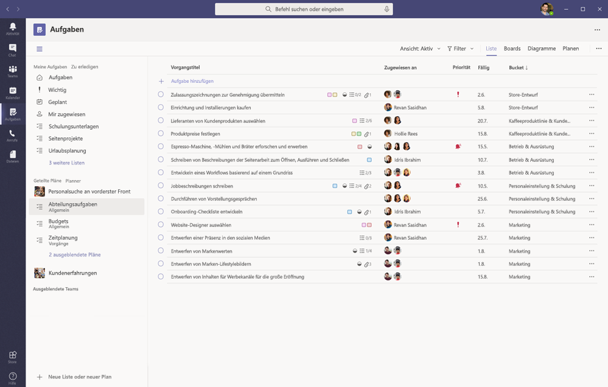
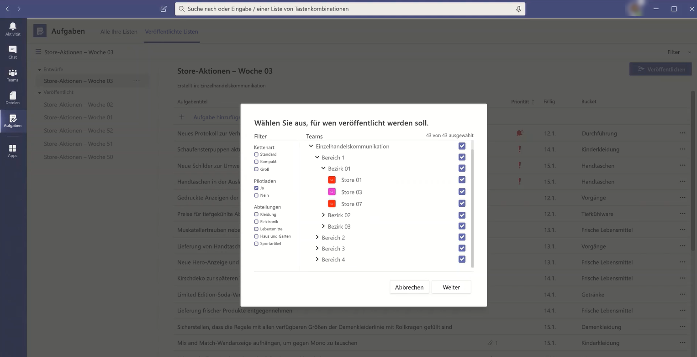
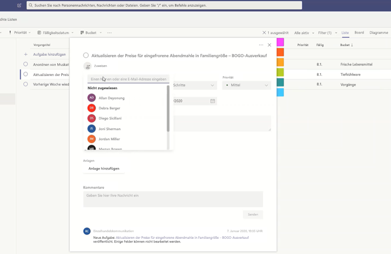
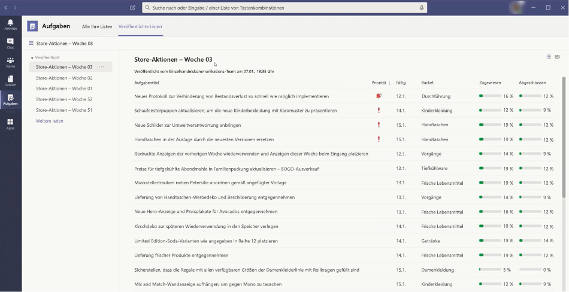

# Verwalten der Aufgaben-app für Ihre Organisation in Microsoft Teams

## Übersicht über Aufgaben

Die Aufgaben-app bietet Microsoft Teams eine zusammenhängende Aufgabenverwaltung, in der einzelne von [Microsoft](https://todo.microsoft.com/tasks/) bereitgestellten Aufgaben und Team Aufgaben integriert werden, die von Planner an einem zentralen Ort unterstützt werden. Benutzer können auf Aufgaben als APP auf der linken Seite von Teams und als Registerkarte in einem Kanal innerhalb einzelner Teams zugreifen. **Meine Aufgaben** und **freigegebene Pläne** in Aufgaben ermöglichen es Benutzern, alle Ihre individuellen und Team Aufgaben anzuzeigen und zu verwalten und deren Arbeit zu priorisieren. Aufgaben steht in den Desktop-, Web-und mobilen Clients von Teams zur Verfügung. 

> [!NOTE]
> Wenn wir die Aufgaben in den Microsoft Teams-Desktop Clients ausführen, wird der App-Name zunächst als **Planner** für die Benutzer angezeigt. Der Name wechselt dann temporär in **Aufgaben nach Planner und zu erledigen**, und später wird er in **Aufgaben** umbenannt. Auf mobilen Teams werden die Benutzer immer den Namen der App als **Aufgaben** sehen. Es kann eine kurze Verzögerung bei der Verfügbarkeit der mobilen Benutzeroberfläche geben, nachdem die Desktopumgebung verfügbar ist.

   

Für Unternehmen, die die Aufgabenverwaltung für First-work-worker rationalisieren möchten, beinhalten Aufgaben auch Funktionen, mit denen Sie Aufgaben in ihrer gesamten Belegschaft in erster Linie anvisieren, veröffentlichen und nachvollziehen können. So können beispielsweise Unternehmens-und regional Verantwortliche Aufgabenlisten erstellen und veröffentlichen, die an relevante Standorte wie bestimmte Einzelhandelsgeschäfte ausgerichtet sind, und den Fortschritt über Echtzeitberichte nachverfolgen. Manager können Ihren Mitarbeitern und direkten Aktivitäten innerhalb ihrer Standorte Aufgaben zuweisen, und die Mitarbeiter von First-Workers haben eine priorisierte Liste Ihrer zugewiesenen Aufgaben auf dem Mobiltelefon oder Desktop-Computer. Um die [Aufgaben Veröffentlichung](#task-publishing)zu aktivieren, müssen Sie zunächst eine Team Zielhierarchie für Ihre Organisation einrichten, die definiert, wie alle Teams in der Hierarchie miteinander in Beziehung stehen.

## Was Sie über Aufgaben wissen müssen

Aufgaben steht als APP und als Registerkarte in einem Kanal zur Verfügung. Beachten Sie, dass die APP sowohl einzelne Aufgaben von Aufgaben als auch Team Aufgaben aus Planner umfasst, während auf der Registerkarte nur Team Aufgaben angezeigt werden.

Mit Aufgaben erhalten Benutzer eine Desktop-, Web-und mobil Funkfunktionalität. Wenn Aufgaben auf dem Desktop Client von Teams installiert sind, werden Sie auch von den Benutzern in ihren Teams für Web-und Mobile Clients angezeigt. Die Ausnahme sind Gastbenutzer. Es ist wichtig zu wissen, dass Gäste über den mobilen Team-Client nur auf Aufgaben als App zugreifen können. Den Gästen werden die Registerkarten Aufgaben auf den Desktop-und Webclients von Teams angezeigt.

**Meine Aufgaben** zeigt die einzelnen Aufgaben eines Benutzers an. **Freigegebene Pläne** zeigen Aufgaben an, an denen das gesamte Team arbeitet, und umfasst alle Aufgabenlisten, die einem Kanal als Registerkarte Aufgaben hinzugefügt werden. Beachten Sie Folgendes:

- Aufgabenlisten, die ein Benutzer in der Aufgaben-App erstellt, werden auch angezeigt, um Clients für diesen Benutzer zu erledigen. In ähnlicher Weise werden Aufgabenlisten, die ein Benutzer erstellt, in Aufgaben für diesen Benutzer in **meinen Aufgaben** angezeigt. Das gleiche gilt für einzelne Aufgaben.

- Die Registerkarte Aufgaben, die einem Kanal hinzugefügt wird, wird auch in Planner-Clients angezeigt. Wenn ein Benutzer einen Plan in Planner erstellt, wird er in der App "Aufgaben" oder "Planner" nicht angezeigt, es sei denn, er wird einem Kanal als Registerkarte hinzugefügt. Wenn ein Benutzer eine neue Registerkarte "Aufgaben" hinzufügt, kann er eine neue Liste oder einen neuen Plan erstellen oder eine vorhandene auswählen.

## Einrichten von Aufgaben

> [!IMPORTANT]
> Einstellungen und Richtlinien, die Sie für Planner konfiguriert haben, gelten auch für Aufgaben.

### Aktivieren oder Deaktivieren von Aufgaben in Ihrer Organisation

Aufgaben ist standardmäßig für alle Teams-Benutzer in Ihrer Organisation aktiviert. Sie können die App auf Organisationsebene im Microsoft Teams Admin Center auf der Seite [Apps verwalten](manage-apps.md) deaktivieren oder aktivieren.

1. Wechseln Sie in der linken Navigationsleiste des Microsoft Teams Admin Centers zu **Teams-Apps** > **Apps verwalten**.
2. Führen Sie in der Liste der Apps einen der folgenden Schritte aus:

    - Wenn Sie Aufgaben für Ihre Organisation deaktivieren möchten, suchen Sie nach der APP Aufgaben, wählen Sie Sie aus, und klicken Sie dann auf **blockieren**.
    - Um Aufgaben für Ihre Organisation zu aktivieren, suchen Sie nach der APP Aufgaben, wählen Sie Sie aus, und klicken Sie dann auf **zulassen**.

> [!NOTE]
> Wenn Sie die Aufgaben-app nicht finden können, suchen Sie in der ersten Notiz dieses Artikels nach den Namen. Die APP kann immer noch umbenannt werden.

### Aktivieren oder Deaktivieren von Aufgaben für bestimmte Benutzer in Ihrer Organisation

Wenn Sie bestimmte Benutzer in Ihrer Organisation für die Verwendung von Aufgaben zulassen oder blockieren möchten, stellen Sie sicher, dass die Aufgaben für Ihre Organisation auf der Seite " [apps verwalten](manage-apps.md) " aktiviert sind, und erstellen Sie dann eine benutzerdefinierte App-Berechtigungsrichtlinie, und weisen Sie diese Benutzern zu. Weitere Informationen finden Sie unter [Verwalten von Richtlinien für App-Berechtigungen in Microsoft Teams](teams-app-permission-policies.md).

### Verwenden einer APP-Setup Richtlinie zum Anheften von Aufgaben an Teams

Mithilfe von App-Setup Richtlinien können Sie Microsoft Teams so anpassen, dass die Apps, die für die Benutzer in Ihrer Organisation am wichtigsten sind, hervorgehoben werden. Die apps, die Sie in einer Richtlinie festlegen, werden an die APP-Leiste angeheftet, &mdash; die sich auf der Seite des Teams-Desktop Clients und am unteren Rand der mobilen Teams-Clients befindet, auf &mdash; denen Benutzer schnell und einfach darauf zugreifen können.

Wenn Sie die Aufgaben-app für Ihre Benutzer anheften möchten, können Sie die globale (org-Wide Standard)-Richtlinie bearbeiten oder eine benutzerdefinierte App-Setup Richtlinie erstellen und zuweisen. Weitere Informationen finden Sie unter [Verwalten von App-Setup Richtlinien in Teams](teams-app-setup-policies.md).

### Die Aufgaben eines Benutzers sind sichtbar, wenn der Benutzer für Exchange Online lizenziert ist

Wenn Sie nicht möchten, dass ein Benutzer **Meine Aufgaben** sehen kann, können Sie ihn ausblenden. Entfernen Sie dazu [die Exchange Online-Lizenz des Benutzers](https://docs.microsoft.com/microsoft-365/admin/manage/remove-licenses-from-users). Es ist wichtig zu wissen, dass der Benutzer nach dem Entfernen einer Exchange Online-Lizenz nicht mehr auf sein Postfach zugreifen kann.  Postfachdaten werden 30 Tage lang aufbewahrt, nach denen die Daten entfernt werden und nicht wiederhergestellt werden können, es sei denn, das Postfach wird [in einem in-situ-Speicher oder in einem Streit](https://docs.microsoft.com/exchange/security-and-compliance/in-place-and-litigation-holds)beizulegenden Haltebereich platziert.

Wir empfehlen dies nicht für Information Worker, aber es gibt möglicherweise einige Szenarien, in denen dies zutreffen könnte, beispielsweise für Mitarbeiter von First-work, die nicht von e-Mails abhängig sind.

## Aufgaben Veröffentlichung

Mit der Aufgaben Veröffentlichung kann Ihre Organisation Aufgabenlisten veröffentlichen, die an bestimmte Standorte (Teams) in Ihrer Organisation ausgerichtet sind, um einen Arbeitsplan zu definieren und freizugeben, der an diesen Standorten ausgeführt werden soll.

- Personen im Verlagsteam, beispielsweise Unternehmens-oder regional Führung, können Aufgabenlisten erstellen und in bestimmten Teams veröffentlichen. 
    
- Manager in den Empfänger Teams können die veröffentlichten Aufgabenlisten überprüfen und Teammitgliedern einzelne Aufgaben zuweisen. 
    
- First-work-Mitarbeiter haben eine einfache mobile Benutzeroberfläche, um den Ihnen zugewiesenen Aufgaben anzuzeigen. Sie können Fotos anfügen, um Ihre Arbeit gegebenenfalls anzuzeigen und ihre Aufgaben als erledigt zu kennzeichnen.
- Publisher und Manager können Berichte anzeigen, um den Aufgaben-und Fertigstellungsstatus von Vorgängen auf jeder Ebene anzuzeigen, einschließlich nach Standort (Team), Aufgabenliste und einzelner Aufgabe. 
    

Benutzer erstellen, verwalten und veröffentlichen Aufgabenlisten auf der Registerkarte **veröffentlichte Listen** in der Aufgaben-app. Diese Registerkarte zeigt nur für einen Benutzer an, wenn Ihre Organisation [eine Zielgruppen Adressierungs Hierarchie eingerichtet](#set-up-your-team-targeting-hierarchy) hat und sich der Benutzer in einem Team befindet, das in der Hierarchie enthalten ist. Die Hierarchie legt fest, ob der Benutzeraufgabenlisten veröffentlichen oder empfangen und Berichte für empfangene Listen anzeigen kann.

### Beispielszenario

Im folgenden finden Sie ein Beispiel für die Funktionsweise der Aufgaben Veröffentlichung.

Contoso führt eine neue Food-und Delivery-Werbeaktion durch. Um eine konsistente Markenerfahrung zu gewährleisten, müssen Sie die konsistente Durchführung des Rollouts über mehr als 300 Speicherstandorte koordinieren.

Das Marketing Team teilt die Werbe Details und die entsprechende Aufgabenliste mit dem Retail Communications Manager. Der Retail Communications Manager, der als Gatekeeper für Stores fungiert, überprüft die Informationen, erstellt eine Aufgabenliste für die Heraufstufung und erstellt dann eine Aufgabe für jede Arbeitseinheit, die von jedem der betroffenen Speicher durchgeführt werden muss. Wenn die Aufgabenliste abgeschlossen ist, muss Sie die Geschäfte auswählen, die die Arbeit abschließen müssen. In diesem Fall bezieht sich die Werbeaktion nur auf Geschäfte in den USA, die über ein in-Store-Restaurant verfügen. In Aufgaben filtert Sie die Store-Liste auf der Grundlage des in-Store-Restaurant-Attributs, wählt die übereinstimmenden US-Standorte in der Hierarchie aus und veröffentlicht dann die Aufgabenliste in diesen speichern.

Store-Manager an jedem Standort erhalten eine Kopie der veröffentlichten Aufgaben und weisen diese Aufgaben Ihren Teammitgliedern zu. Manager können die Aufgaben Erfahrung verwenden, um die gesamte Arbeit zu verstehen, die im gesamten Store erforderlich ist. Sie können auch die verfügbaren Filter verwenden, um sich auf einen bestimmten Satz von Arbeit zu konzentrieren, beispielsweise auf Arbeit, die heute fällig ist, oder um in einem bestimmten Bereich zu arbeiten.

First-work-Mitarbeiter an jedem Filialstandort haben jetzt eine priorisierte Liste ihrer Arbeit in Aufgaben auf Ihrem mobilen Gerät. Wenn Sie eine Aufgabe abgeschlossen haben, kennzeichnen Sie Sie als abgeschlossen. Einige können sogar auswählen, dass Sie ein Foto hochladen und an die Aufgabe anfügen möchten, um Ihre Arbeit anzuzeigen.

Contoso Headquarters und Intermediate Manager können Berichte anzeigen, um den Aufgaben-und Fertigstellungsstatus von Vorgängen in den einzelnen Stores und Zwischenspeichern anzuzeigen. Sie können auch einen Drilldown zu einer bestimmten Aufgabe ausführen, um den Status in verschiedenen speichern anzuzeigen. Wenn das Startdatum näher rückt, können Sie bei Bedarf alle Anomalien erkennen und mit ihren Teams einchecken. Diese Sichtbarkeit ermöglicht es contoso, die Effizienz des Rollouts zu verbessern und eine konsistentere Benutzeroberfläche für Ihre Geschäfte bereitzustellen.

### Einrichten Ihrer Zielgruppen Adressierungs Hierarchie

Um die Veröffentlichung von Aufgaben in Ihrer Organisation zu aktivieren, müssen Sie zuerst das Schema für die Zielgruppenadressierung in a einrichten. CSV-Datei. Das Schema definiert, wie alle Teams in der Hierarchie miteinander verbunden sind und welche Attribute zum Filtern und Auswählen von Teams verwendet werden. Nachdem Sie das Schema erstellt haben, laden Sie es in Teams hoch, um es auf Ihre Organisation anzuwenden. Mitglieder des Veröffentlichungsteams, beispielsweise der Retail Communications Manager im Beispielszenario, können dann Teams nach Hierarchie, Attributen oder einer Kombination aus beiden Filtern, um die relevanten Teams auszuwählen, die die Aufgabenlisten erhalten sollen, und dann die Aufgabenlisten in diesen Teams veröffentlichen.

Eine schrittweise Anleitung zum Einrichten Ihrer Team Targeting-Hierarchie finden Sie unter [Einrichten Ihrer Team Zielhierarchie](set-up-your-team-hierarchy.md).

## Power Automation und Diagramm-API

Aufgaben unterstützt Power Automation für to-do-und Graph-APIs für Planner. Weitere Informationen finden Sie unter:

- [Übersicht über die Planner-Aufgaben und-Pläne](https://docs.microsoft.com/graph/planner-concept-overview)
- [Verwenden von Microsoft für Power Automation](https://support.office.com/article/using-microsoft-to-do-with-power-automate-526e8f75-217b-46e0-9e06-44780b72c295)
