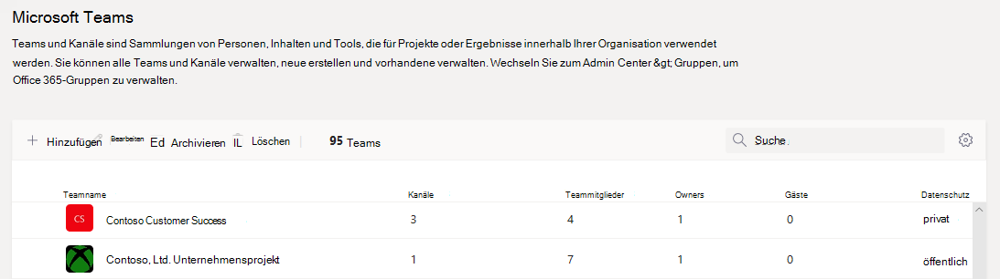
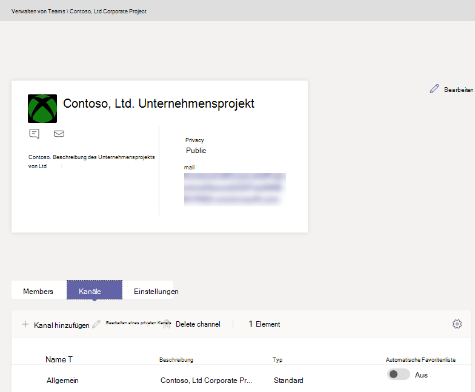

Verwalten von Teams im Microsoft Teams Admin Center
==========================================

## Übersicht

In diesem Artikel finden Sie eine Übersicht über die Verwaltungstools für Teams im Microsoft Teams Admin Center.

Als Administrator müssen Sie möglicherweise die Teams anzeigen oder aktualisieren, die Ihre Organisation für die Zusammenarbeit eingerichtet hat, oder Wartungsaktionen ausführen, z. b. Teams, die keinen Besitzer haben, einen zuweisen. Sie können die in Ihrer Organisation bestehenden Teams sowohl über das PowerShell-Modul von Microsoft Teams als auch über das Microsoft Teams Admin Center verwalten. Unter <a href="https://go.microsoft.com/fwlink/p/?linkid=2024339" target="_blank">https://admin.microsoft.com</a> können Sie auf das Admin Center zugreifen. Um die vollständigen Verwaltungsfunktionen, die diese beiden Toolsets bieten, nutzen zu können, sollten Sie sicherstellen, dass Sie eine der folgenden Rollen besitzen:

- Globaler Administrator
- Teams-Dienstadministrator

Weitere Informationen zu Administratorrollen in Teams finden Sie unter [Verwenden von Microsoft Teams-Administratorrollen zum Verwalten von Teams](using-admin-roles.md). Um mehr über die Nutzung von PowerShell-Cmdlets für die Verwaltung von Teams zu erfahren, lesen Sie die [Microsoft Teams-Cmdlet-Referenz](/powershell/teams/?view=teams-ps).

## Teams-Übersichtraster

Verwaltungstools für Teams befinden sich im Microsoft Teams Admin Center unter dem Knoten **Teams**. (Wählen Sie **Teams** > **Teams verwalten** im Admin Center aus.) Jedes Team wird von einer Microsoft 365-Gruppe unterstützt. Dieser Knoten bietet eine Übersicht über Gruppen, die in Ihrer Organisation für Microsoft Teams aktiviert wurden.

  

Das Raster zeigt die folgenden Eigenschaften an:

- **Teamname**
- **Kanäle**: die Anzahl aller Kanäle im Team, einschließlich des Standardkanals „Allgemein“.
- **Teammitglieder**: die Anzahl aller Benutzer, einschließlich Besitzern, Gästen und Mitgliedern Ihres Mandanten.
- **Besitzer**: die Anzahl der Besitzer dieses Teams.
- **Gäste**: die Anzahl von Azure Active Directory B2B-Gastbenutzern, die Mitglieder dieses Teams sind.
- **Datenschutz**: der Visibility/AccessType der zugrunde liegenden Microsoft 365-Gruppe.
- **Status**: der archivierte oder aktive Status dieses Teams. Weitere Informationen zum Archivieren von Teams finden Sie unter [Archivieren oder Wiederherstellen eines Teams](https://support.office.com/article/archive-or-restore-a-team-dc161cfd-b328-440f-974b-5da5bd98b5a7).
- **Beschreibung**: die Beschreibung der zugrunde liegenden Microsoft 365-Gruppe.
- **Klassifizierung**: die Klassifizierung (sofern in Ihrer Organisation verwendet), die der zugrunde liegenden Microsoft 365-Gruppe zugewiesen ist. Erfahren Sie mehr über Klassifizierungen unter [Erstellen von Klassifizierungen für Office-Gruppen in Ihrer Organisation](/office365/enterprise/powershell/manage-office-365-groups-with-powershell#create-classifications-for-office-groups-in-your-organization).
- **GroupID**: die eindeutige GroupID der zugrunde liegenden Microsoft 365-Gruppe.

> [!NOTE]
> Wenn nicht alle diese Eigenschaften im Raster angezeigt werden, klicken Sie auf das Symbol **Spalten bearbeiten**. Im Bereich **Spalten bearbeiten** können Sie die Umschaltflächen zum Aktivieren oder Deaktivieren von Spalten im Raster verwenden. Klicken Sie nach Abschluss des Vorgangs auf **Anwenden**.

### Hinzufügen

Klicken Sie auf **Hinzufügen**, um ein neues Team hinzuzufügen. Geben Sie im Bereich **Neues Team hinzufügen** einen Namen und eine Beschreibung ein, legen Sie fest, ob es sich um ein privates oder öffentliches Team handelt und legen Sie die Klassifizierung fest.

> [!NOTE]
> Neu erstellte Teams können sofort im Teams Admin Center verwaltet werden, anders als in anderen Clients wie z. B. Outlook.

### Bearbeiten

Wenn Sie gruppen- und teamspezifische Einstellungen bearbeiten möchten, wählen Sie das Team aus, indem Sie auf die linke Seite des Teamnamens klicken und dann **Bearbeiten** wählen.

### Archivieren

Sie können ein Team archivieren. Durch die Archivierung wird das Team in Microsoft Teams in den schreibgeschützten Modus versetzt. Als Administrator können Sie Teams im Namen Ihrer Organisation im Admin Center archivieren oder die Archivierung wieder aufheben. 

### Löschen

Beim Löschen eines Teams handelt es sich um ein vorläufiges Löschen des Teams und der entsprechenden Microsoft 365-Gruppe. Zum Wiederherstellen eines versehentlich gelöschten Teams folgen Sie den Anweisungen unter [Wiederherstellen einer gelöschten Gruppe](/microsoft-365/admin/create-groups/restore-deleted-group).

### Suche

Die Suche unterstützt derzeit die Zeichenfolge „beginnt mit“ und durchsucht das Feld **Teamname**.

## Teamprofil

Sie können von der Hauptübersicht aus auf die Profilseite jedes Teams navigieren, indem Sie auf den Teamnamen klicken. Auf der Teamprofilseite werden die Mitglieder, Besitzer und Gäste angezeigt, die zu dem Team (und der Gruppe der zugrunde liegenden Microsoft 365-Gruppe) gehören sowie die Kanäle und Einstellungen des Teams. Auf der Teamprofilseite können Sie folgende Aktionen ausführen:

- Hinzufügen oder Entfernen von Mitgliedern und Besitzern.
- Hinzufügen oder Entfernen von Kanälen. (beachten Sie, dass Sie den Kanal „Allgemein“ nicht entfernen können.)
- Ändern von Team- und Gruppeneinstellungen.
 

## Vornehmen von Änderungen an Teams

Auf der Profilseite des Teams können Sie die folgenden Elemente eines Teams ändern:

- **Mitglieder**: Mitglieder hinzufügen oder entfernen sowie Besitzer herauf- oder herunterstufen.
- **Kanäle**: neue Kanäle hinzufügen und vorhandene Kanäle bearbeiten oder entfernen. Denken Sie daran, dass der Standardkanal „Allgemein“ nicht gelöscht werden kann.
- **Teamname**
- **Beschreibung**
- **Datenschutz**: Legen Sie fest, ob das Team öffentlich oder privat sein soll.
- **Klassifizierung**: Dies wird durch Ihre Microsoft 365-Gruppenklassifizierungen gesichert. Wählen Sie zwischen **Vertraulich**, **Streng vertraulich** oder **Allgemein**.
- **Unterhaltungseinstellungen**: Hier legen Sie fest, ob Mitglieder gesendete Nachrichten bearbeiten und löschen können.
- **Kanaleinstellungen**: Hier legen Sie fest, ob Mitglieder neue Kanäle erstellen und bestehende bearbeiten können. Außerdem, ob sie Registerkarten, Connectors und Apps hinzufügen, bearbeiten und entfernen können.

Die Änderungen, die Sie an einem Team vornehmen, werden protokolliert. Wenn Sie Gruppeneinstellungen ändern (ändern des Namens, der Beschreibung, des Fotos, des Datenschutzes, der Klassifizierung oder der Teammitglieder), werden die Änderungen durch die Audit-Pipeline Ihnen zugeordnet. Wenn Sie Aktionen gegen teamspezifische Einstellungen ausführen, werden Ihre Änderungen nachverfolgt und Ihnen im Kanal „Allgemein“ des Teams zugeordnet.

## Problembehandlung

**Problem: Teams fehlen im Team-Übersichtsraster**

Einige ihrer Teams fehlen in der Liste der Teams im Team-Übersichtraster.

**Ursache**: Dieses Problem tritt auf, wenn das Teamprofil vom System falsch (oder noch nicht) erstellt worden ist, was zu einer fehlenden Eigenschaft und infolgedessen dazu führen kann, dass es nicht erkannt wird.

**Lösung: Legen Sie den richtigen Wert der Eigenschaft MS Graph fest**

Ersetzen Sie **{groupid}** in der Abfrage durch die tatsächliche zutreffende GroupId, die Sie über Exchange Online PowerShell mit dem Cmdlet **„[Get-Unifiedgroup](/powershell/module/exchange/users-and-groups/get-unifiedgroup?view=exchange-ps)“** als „**ExternalDirectoryObjectId**“-Attribut abrufen können.

1. Auf [Graph-Tester](https://developer.microsoft.com/graph/graph-explorer) zugreifen.

2. Melden Sie sich bei Graph Explorer im linken Menü an.

3. Ändern Sie die Abfragezeile in: PATCH > v1.0 >https://graph.microsoft.com/v1.0/groups/{groupid}.

4. Fügen Sie dem Anforderungstext den folgenden Wert hinzu: {"resourceProvisioningOptions": ["Team"]}.

5. Führen Sie die Abfrage oben rechts aus.

6. Vergewissern Sie sich, dass das Team ordnungsgemäß in der Teamübersicht des Microsoft Teams Admin Centers angezeigt wird.

## Weitere Informationen

- [Teams-Cmdlet-Referenz](/powershell/teams/?view=teams-ps)  
- [Verwenden von Teams-Administratorrollen zum Verwalten von Teams](using-admin-roles.md)
- [Planen der Lebenszyklusverwaltung in Teams](plan-teams-lifecycle.md)