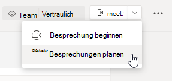

# Besprechungsrichtlinien – Allgemeine Einstellungen

In diesem Artikel werden die folgenden allgemeinen Richtlinieneinstellungen für Teams-Besprechungen beschrieben:

- [Sofortbesprechungen in Kanälen zulassen](#allow-meet-now-in-channels)
- [Outlook-Add-In zulassen](#allow-the-outlook-add-in)
- [Planung von Kanalbesprechungen zulassen](#allow-channel-meeting-scheduling)
- [Planung privater Besprechungen zulassen](#allow-scheduling-private-meetings)
- [Sofortbesprechungen in privaten Besprechungen zulassen](#allow-meet-now-in-private-meetings)
- [Festgelegter Rollenmodus für Presenter](#designated-presenter-role-mode)
- [Besprechungsbesuchsbericht](#meeting-attendance-report)
- [Besprechungsanbieter für den Inselmodus](#meeting-provider-for-islands-mode)

## Sofortbesprechungen in Kanälen zulassen

Hierbei handelt es sich um eine benutzerspezifische Richtlinie, die angewendet wird, bevor eine Besprechung beginnt. Diese Einstellung steuert, ob ein Benutzer eine Ad-hoc-Besprechung in einem Teams-Kanal starten kann. Wenn Sie dies aktivieren,  können Benutzer auf die Schaltfläche Besprechung klicken, um eine Ad-hoc-Besprechung zu starten oder eine Besprechung im Kanal zu planen. Der Standardwert lautet "True".

## Outlook-Add-In zulassen

Hierbei handelt es sich um eine benutzerspezifisch Richtlinie, die angewendet wird, bevor eine Besprechung beginnt. Über diese Einstellung wird gesteuert, ob Microsoft Teams-Besprechungen in Outlook (Windows, Mac, Web und Mobile) geplant werden können.

Wenn Sie dies deaktivieren, können Benutzer keine Teams-Besprechungen planen, wenn sie eine neue Besprechung in Outlook erstellen. In Outlook unter Windows wird beispielsweise die Option **Neue Teams-Besprechung** nicht im Menüband angezeigt.

## Planung von Kanalbesprechungen zulassen

Verwenden Sie die vorhandene "AllowChannelMeetingScheduling"-Richtlinie, um zu steuern, welche Arten von Ereignissen in den Kalendern des Team-Kanals erstellt werden können. Hierbei handelt es sich um eine benutzerspezifische Richtlinie, die angewendet wird, bevor eine Besprechung beginnt. Über diese Einstellung wird gesteuert, ob Benutzer eine Besprechung in einem Microsoft Teams-Kanal planen können. Diese Einstellung ist standardmäßig aktiviert. 

Wenn diese Richtlinie deaktiviert ist, können Benutzer keine neuen Kanalbesprechungen erstellen. Bereits vorhandene Kanalbesprechungen können jedoch vom Organisator der Veranstaltung bearbeitet werden.

Die Option zum Planen von Besprechungen ist dann deaktiviert.

Die Option zum Auswählen eines Kanals ist deaktiviert.

Auf der Seite "Kanalbeiträge" wird Folgendes deaktiviert:

- Die Schaltfläche **Besprechung planen** im Feld zum Verfassen von Kanalantworten
  
  
- Die Schaltfläche **Besprechung planen** im Kanal-Header
  

Im Kanal-Kalender:

- Die Schaltfläche **Neues Ereignis hinzufügen** im Header des Kanalkalenders ist deaktiviert.
  

- Benutzer können einen Zeitblock im Kanalkalender nicht ziehen und auswählen, um eine Kanal besprechung zu erstellen.

- Benutzer können keine Tastenkombinationen verwenden, um eine Besprechung im Kanalkalender zu erstellen.

Im Admin Center:

Die Kanalkalender-App wird auf der Seite der App-Berechtigungsrichtlinien im Abschnitt **Microsoft-Apps** angezeigt.

## Planung privater Besprechungen zulassen

Hierbei handelt es sich um eine benutzerspezifisch Richtlinie, die angewendet wird, bevor eine Besprechung beginnt. Mit dieser Einstellung wird gesteuert, ob ein Benutzer private Besprechungen in einem Teams-Kanal planen kann. Eine Besprechung ist privat, wenn sie nicht in einem Kanal in einem Team veröffentlicht wird.

Beachten Sie, dass durch das Deaktivieren von **Planung privater Besprechungen zulassen** und **Planung von Kanalbesprechungen zulassen** die Optionen **Erforderliche Teilnehmer hinzufügen** und **Kanal hinzufügen** für Benutzer in Microsoft Teams deaktiviert werden. Diese Einstellung ist standardmäßig aktiviert.

## Sofortbesprechungen in privaten Besprechungen zulassen

Hierbei handelt es sich um eine benutzerspezifische Richtlinie, die angewendet wird, bevor eine Besprechung beginnt. Diese Einstellung steuert, ob ein Benutzer eine private Ad-hoc-Besprechung starten kann.  Diese Einstellung ist standardmäßig aktiviert.

## Festgelegter Rollenmodus für Presenter

Hierbei handelt es sich um eine benutzerspezifische Richtlinie. Diese Einstellung ermöglicht es Ihnen, den Standardwert für **Wer kann präsentieren?** in den **Besprechungsoptionen** im Microsoft Teams-Client zu ändern. Diese Richtlinieneinstellung wirkt sich auf alle Besprechungen aus, einschließlich Sofortbesprechungen.

Über die Einstellung **Wer kann präsentieren?** können Besprechungsorganisatoren die Referenten innerhalb einer Besprechung festlegen. Weitere Informationen finden Sie unter [Ändern der Teilnehmereinstellungen für eine Microsoft Teams-Besprechung](https://support.microsoft.com/article/change-participant-settings-for-a-teams-meeting-53261366-dbd5-45f9-aae9-a70e6354f88e) und [Rollen in einer Microsoft Teams-Besprechung](https://support.microsoft.com/article/roles-in-a-teams-meeting-c16fa7d0-1666-4dde-8686-0a0bfe16e019).

Derzeit können Sie diese Richtlinieneinstellung nur mithilfe von PowerShell konfigurieren. Sie können eine vorhandene Microsoft Teams-Besprechungsrichtlinie mithilfe des Cmdlets [Set-CsTeamsMeetingPolicy](https://docs.microsoft.com/powershell/module/skype/set-csteamsmeetingpolicy) bearbeiten. Sie können aber auch eine neue Besprechungsrichtlinie für Microsoft Teams mithilfe des Cmdlets [New-CsTeamsMeetingPolicy](https://docs.microsoft.com/powershell/module/skype/new-csteamsmeetingpolicy) erstellen und sie Benutzern zuweisen.

Um den Standardwert für die Einstellung **Wer kann präsentieren?** in Microsoft Teams anzugeben, legen Sie den Parameter **DesignatedPresenterRoleMode** auf einen der folgenden Werte fest:

- **EveryoneUserOverride**: alle Besprechungsteilnehmer können Referenten sein. Dies ist der Standardwert. Dieser Parameter entspricht der Einstellung **Jeder** in Microsoft Teams.
- **EveryoneInCompanyUserOverride**: authentifizierte Benutzer in der Organisation, einschließlich Gastbenutzer, können Referenten sein. Dieser Parameter entspricht der Einstellung **Personen in meiner Organisation** in Microsoft Teams.
- **OrganizerOnlyUserOverride**: Nur der Besprechungsorganisator kann präsentieren, alle anderen Besprechungsteilnehmer sind lediglich als Teilnehmer angegeben. Dieser Parameter entspricht der Einstellung **Nur ich** in Microsoft Teams.

Bedenken Sie, dass, nachdem Sie den Standardwert festgelegt haben, Besprechungsorganisatoren diese Einstellung in Microsoft Teams weiterhin ändern und auswählen können, wer in den von ihnen geplanten Besprechungen präsentieren kann.

## Besprechungsbesuchsbericht

Hierbei handelt es sich um eine benutzerspezifische Richtlinie. Über diese Einstellung wird gesteuert, ob Besprechungsorganisatoren den [Teilnahmebericht zu einer Besprechung](teams-analytics-and-reports/meeting-attendance-report.md) herunterladen können.

Derzeit können Sie diese Richtlinieneinstellung nur mithilfe von PowerShell konfigurieren. Sie können eine vorhandene Microsoft Teams-Besprechungsrichtlinie mithilfe des Cmdlets [Set-CsTeamsMeetingPolicy](https://docs.microsoft.com/powershell/module/skype/set-csteamsmeetingpolicy) bearbeiten. Sie können aber auch eine neue Besprechungsrichtlinie für Microsoft Teams mithilfe des Cmdlets [New-CsTeamsMeetingPolicy](https://docs.microsoft.com/powershell/module/skype/new-csteamsmeetingpolicy) erstellen und sie Benutzern zuweisen.

Wenn Sie einem Besprechungsorganisator das Herunterladen des Teilnahmeberichts zu einer Besprechung ermöglichen möchten, legen Sie den Parameter **AllowEngagementReport** auf **Aktiviert** (enabled) fest. Wenn diese Option aktiviert ist, wird die Option zum Herunterladen des Berichts im Bereich **Teilnehmer** angezeigt.

Um zu verhindern, dass der Bericht vom Besprechungsorganisator heruntergeladen wird, legen Sie den Parameter auf **Deaktiviert** (disabled) fest. Diese Einstellung ist standardmäßig deaktiviert, und die Option zum Herunterladen des Berichts ist nicht verfügbar.

## Besprechungsanbieter für den Inselmodus

Hierbei handelt es sich um eine benutzerspezifische Richtlinie. Über diese Einstellung wird gesteuert, welches Add-In für Outlook-Besprechungen für *Benutzer im Inselmodus* verwendet wird. Sie können festlegen, ob Benutzer nur das Add-In für Microsoft Teams-Besprechungen oder sowohl das Add-In für Microsoft Teams-Besprechungen als auch jenes für Skype for Business-Besprechungen verwenden können, um Besprechungen in Outlook zu planen.

Sie können diese Richtlinie nur für Benutzer im Inselmodus anwenden und für die der Parameter **AllowOutlookAddIn** in ihrer Microsoft Teams-Richtlinie auf **True** festgelegt ist.

Derzeit können Sie diese Richtlinie nur mithilfe von PowerShell festlegen. Sie können eine vorhandene Microsoft Teams-Besprechungsrichtlinie mithilfe des Cmdlets [Set-CsTeamsMeetingPolicy](https://docs.microsoft.com/powershell/module/skype/set-csteamsmeetingpolicy) bearbeiten. Sie können aber auch eine neue Besprechungsrichtlinie für Microsoft Teams mithilfe des Cmdlets [New-CsTeamsMeetingPolicy](https://docs.microsoft.com/powershell/module/skype/new-csteamsmeetingpolicy) erstellen und sie Benutzern zuweisen.

Wenn Sie angeben möchten, welches Besprechungs-Add-In für Benutzer zur Verfügung stehen soll, legen Sie den Parameter **PreferredMeetingProviderForIslandsMode** wie folgt fest:

- Legen Sie den Parameter auf **TeamsAndSfB** fest, um sowohl das Add-In für Microsoft Teams-Besprechungen als auch das Skype for Business-Add-In in Outlook zu aktivieren. Dies ist der Standardwert.
- Legen Sie den Parameter auf **Teams** fest, um nur das Add-in für Microsoft Teams-Besprechungen in Outlook zu aktivieren. Diese Richtlinieneinstellung stellt sicher, dass in allen zukünftigen Besprechungen ein Link zur Teilnahme an Microsoft Teams-Besprechungen verfügbar ist. Es werden keine bestehenden Skype for Business-Besprechungslinks nach Microsoft Teams übertragen. Diese Richtlinieneinstellung wirkt sich nicht auf Anwesenheit, Chat, PSTN-Anrufe oder andere Funktionen in Skype for Business aus, was bedeutet, dass die Benutzer Skype for Business weiterhin für diese Funktionen verwenden können.

  Wenn Sie den Parameter auf **Teams** festlegen und dann zurück zu **TeamsAndSfB** ändern, werden beide Besprechungs-Add-Ins aktiviert. Beachten Sie jedoch, dass bestehende Links für die Teilnahme an Microsoft Teams-Besprechungen nicht nach Skype for Business übertragen werden. Nur in Skype for Business-Besprechungen, die nach der Änderung geplant wurden, wird es einen Link zur Teilnahme an Skype for Business-Besprechungen geben.

## Besprechungsreaktionen

Die Einstellung AllowMeetingReactions kann nur mit PowerShell angewendet werden. Es gibt keine Option zum Aktivieren oder Deaktivieren von AllowMeetingReactions aus dem Teams Admin Center.

Besprechungsreaktionen sind standardmäßig deaktiviert. Das Deaktivieren von Reaktionen für einen Benutzer bedeutet nicht, dass ein Benutzer keine Reaktionen in Besprechungen verwenden kann, die er plant. Der Besprechungsorganisator kann ungeachtet der Standardeinstellung weiterhin Reaktionen auf der Seite "Besprechungsoption" aktivieren.

## Verwandte Themen

- [Übersicht über PowerShell für Microsoft Teams](teams-powershell-overview.md)
- [Benutzern in Microsoft Teams Richtlinien zuweisen](assign-policies.md)
- [Entfernen der Microsoft Teams-Besprechungsrichtlinie "RestrictedAnonymousAccess" von Benutzern](meeting-policies-restricted-anonymous-access.md)
