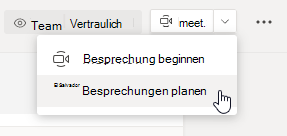
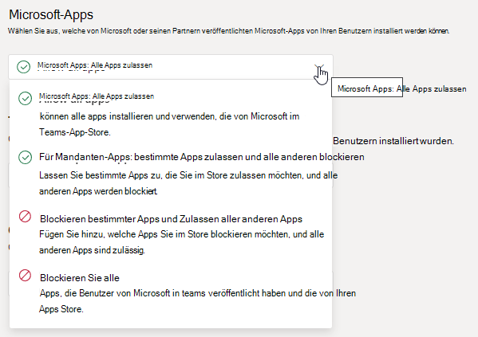

# Verwalten von Besprechungsrichtlinien in Microsoft Teams

::: zone target="docs"
Besprechungsrichtlinien werden verwendet, um die Features zu steuern, die Besprechungsteilnehmern für Besprechungen, die von Benutzern in Ihrer Organisation geplant werden, zur Verfügung stehen. Sie können die globale (standardmäßig organisationsweit geltende) Richtlinie verwenden, oder benutzerdefinierte Richtlinien erstellen und diese gezielt zuweisen. Besprechungsrichtlinien werden im Microsoft Teams Admin Center oder mithilfe von [PowerShell](teams-powershell-overview.md) verwaltet.

> [!NOTE]
> Informationen zur Verwendung von Rollen zum Verwalten der Berechtigungen von Besprechungsmoderatoren und -teilnehmern finden Sie unter [Rollen in einer Microsoft Teams-Besprechung](https://support.microsoft.com/office/roles-in-a-teams-meeting-c16fa7d0-1666-4dde-8686-0a0bfe16e019?ui=en-us&rs=en-us&ad=us).

Sie können Richtlinien, die sich auf die Benutzererfahrung vor, während oder nach einer Besprechung auswirken, auf folgende Weise implementieren.

|Implementierungstyp  |Beschreibung  |
|---------|---------|
|Organisatorspezifische Richtlinie    |Wenn Sie eine organisatorspezifische Richtlinie implementieren, erben alle Besprechungsteilnehmer die Richtlinie des Organisators. So ist beispielsweise **Personen automatisch zulassen** eine organisatorspezifische Richtlinie, die bei Besprechungen, die vom Nutzer, der die Richtlinie zugewiesen hat, geplant worden sind, steuert, ob Benutzer an der Besprechung direkt teilnehmen oder in der bis zum Beginn Wartebereich bleiben.          |
|Benutzerspezifische Richtlinie    |Wenn Sie eine benutzerspezifische Richtlinie implementieren, gilt nur diese Richtlinie, um bestimmte Features für den Organisator und/oder die Besprechungsteilnehmer einzuschränken. So ist beispielsweise **Sofortbesprechung in Kanälen zulassen** eine benutzerspezifische Richtlinie.     |
|Organisator- und benutzerspezifisch     |Wenn Sie eine Kombination aus einer organisatorspezifischen und einer benutzerspezifischen Richtlinie implementieren, sind bestimmte Features für Besprechungsteilnehmer basierend auf Ihrer Richtlinie und der Richtlinie des Organisators eingeschränkt. So ist beispielsweise **Cloud-Aufnahme zulassen** eine organisatorspezifische und benutzerspezifische Richtlinie. Aktivieren Sie diese Einstellung, damit Benutzer eine Aufzeichnung starten und beenden können.

Sie können die Einstellungen in der globalen Richtlinie bearbeiten oder eine oder mehrere benutzerdefinierte Richtlinien erstellen und zuweisen. Für Benutzern in Ihrer Organisation gilt die globale Richtlinie, es sei denn, Sie erstellen eine benutzerdefinierte Richtlinie und weisen ihnen diese zu.

> [!NOTE]
> Die Schaltfläche "Besprechungsdetails" ist verfügbar, wenn für einen Benutzer die Audiokonferenz-Lizenzen aktiviert sind oder er zu Audiokonferenzen zugelassen ist. Andernfalls sind die Besprechungsdetails nicht verfügbar.

## Erstellen einer benutzerdefinierten Besprechungsrichtlinie

1. Wechseln Sie in der linken Navigationsleiste des Microsoft Teams Admin Centers zu **Besprechungen** > **Besprechungsrichtlinien**.
2. Klicken Sie auf **Hinzufügen**.
3. Geben Sie einen Namen und eine Beschreibung für die Richtlinie ein. Der Name darf keine Sonderzeichen enthalten und maximal 64 Zeichen lang sein.
4. Wählen Sie die gewünschten Einstellungen aus.
5. Klicken Sie auf **Speichern**.

Nehmen wir beispielsweise an, Sie haben eine Gruppe von Nutzern, und Sie möchten die Bandbreite begrenzen, die für Ihre Besprechung erforderlich ist. Sie erstellen dann eine neue benutzerdefinierte Richtlinie namens „begrenzte Bandbreite“ und deaktivieren die folgenden Einstellungen:

Unter **Audio & Video**:

- Deaktivieren Sie Cloud-Aufzeichnung zulassen.
- Deaktivieren Sie IP-Video zulassen.

Unter **Inhaltsfreigabe**:

- Deaktivieren Sie den Bildschirmfreigabemodus.
- Deaktivieren Sie Whiteboard zulassen.
- Deaktivieren Sie Freigegebene Notizen zulassen.

Weisen Sie dann die Richtlinie den Nutzern zu.

## Bearbeiten einer Besprechungsrichtlinie

Sie können die globale Standardrichtlinie oder eine von Ihnen erstellte benutzerdefinierte Richtlinie jederzeit bearbeiten.

1. Wechseln Sie in der linken Navigationsleiste des Microsoft Teams Admin Centers zu **Besprechungen** > **Besprechungsrichtlinien**.
2. Wählen Sie die Richtlinie aus, indem Sie links neben die Richtlinienbezeichnung klicken, und wählen Sie dann **Bearbeiten** aus.
3. Nehmen Sie nun die gewünschten Änderungen vor.
4. Klicken Sie auf **Speichern**.

> [!NOTE]
> Einem Benutzer kann jeweils nur eine Besprechungsrichtlinie zugewiesen werden.

## Benutzern eine Besprechungsrichtlinie zuweisen

[!INCLUDE [assign-policy](includes/assign-policy.md)]

> [!NOTE]
> Sie können eine Richtlinie nicht löschen, solange Sie Benutzern zugewiesen ist. Sie müssen allen betroffenen Benutzern erst eine andere Richtlinie zuweisen, bevor Sie die ursprüngliche Richtlinie löschen können.

## Einstellungen für Besprechungsrichtlinien

Wenn Sie auf der Seite **Besprechungsrichtlinien** eine vorhandene Richtlinie oder **Hinzufügen** auswählen, um eine neue Richtlinie hinzuzufügen, können Sie die folgenden Einstellungen konfigurieren.

- [Allgemein](#meeting-policy-settings---general)
- [Audio & Video](#meeting-policy-settings---audio--video)
- [Inhaltsfreigabe](#meeting-policy-settings---content-sharing)
- [Teilnehmer & Gäste](#meeting-policy-settings---participants--guests)

::: zone-end

## Besprechungsrichtlinien – Allgemeine Einstellungen

- [Sofortbesprechungen in Kanälen zulassen](#allow-meet-now-in-channels)
- [Outlook-Add-In zulassen](#allow-the-outlook-add-in)
- [Planung von Kanalbesprechungen zulassen](#allow-channel-meeting-scheduling)
- [Planung privater Besprechungen zulassen](#allow-scheduling-private-meetings)
- [Sofortbesprechungen in privaten Besprechungen zulassen](#allow-meet-now-in-private-meetings)

### Sofortbesprechungen in Kanälen zulassen

Bei **Sofortbesprechungen zulassen** handelt es sich um eine benutzerspezifische Richtlinie, die angewendet wird, bevor eine Besprechung beginnt. Über diese Einstellung wird gesteuert, ob ein Benutzer eine spontane Besprechung in einem Microsoft Teams-Kanal starten kann. Wenn Sie diese Einstellung aktivieren,  können Benutzer die Schaltfläche "Besprechung" auswählen, um eine ungeplante Besprechung zu starten oder eine Besprechung im Kanal zu planen. Der Standardwert lautet "True".

### Outlook-Add-In zulassen

Hierbei handelt es sich um eine benutzerspezifisch Richtlinie, die angewendet wird, bevor eine Besprechung beginnt. Über diese Einstellung wird gesteuert, ob Microsoft Teams-Besprechungen in Outlook (Windows, Mac, Web und Mobile) geplant werden können.

Wenn Sie diese Option deaktivieren, können die Benutzer keine Microsoft Teams-Besprechungen planen, wenn sie eine neue Besprechung in Outlook erstellen. In Outlook unter Windows wird beispielsweise die Option **Neue Teams-Besprechung** nicht im Menüband angezeigt.

### Planung von Kanalbesprechungen zulassen

Verwenden Sie die vorhandene "AllowChannelMeetingScheduling"-Richtlinie, um zu steuern, welche Arten von Ereignissen in den Kalendern des Team-Kanals erstellt werden können. Hierbei handelt es sich um eine benutzerspezifische Richtlinie, die angewendet wird, bevor eine Besprechung beginnt. Über diese Einstellung wird gesteuert, ob Benutzer eine Besprechung in einem Microsoft Teams-Kanal planen können. Diese Einstellung ist standardmäßig aktiviert.

Wenn diese Richtlinie deaktiviert ist, können Benutzer keine neuen Kanalbesprechungen erstellen. Bereits vorhandene Kanalbesprechungen können jedoch vom Organisator der Veranstaltung bearbeitet werden.

Die Option zum Planen von Besprechungen ist dann deaktiviert.

 

Die Option zum Auswählen eines Kanals ist deaktiviert.

Auf der Seite der Kanalbeiträge sind dann die folgenden Features deaktiviert:

- Die Schaltfläche **Besprechung planen** im Feld zum Verfassen von Kanalantworten
  
  
- Die Schaltfläche **Besprechung planen** im Kanal-Header
  

Im Kanal-Kalender:

- Die Schaltfläche **Neues Ereignis hinzufügen** im Header des Kanalkalenders ist deaktiviert.
  

- Die Benutzer können im Kanalkalender keine Zeitblöcke auswählen und ziehen, um eine Kanalbesprechung zu erstellen.

- Die Benutzer können keine Tastenkombinationen zum Erstellen einer Besprechung im Kanalkalender verwenden.

Im Admin Center:

Die Kanalkalender-App wird auf der Seite der App-Berechtigungsrichtlinien im Abschnitt **Microsoft-Apps** angezeigt.

 

### Planung privater Besprechungen zulassen

Hierbei handelt es sich um eine benutzerspezifisch Richtlinie, die angewendet wird, bevor eine Besprechung beginnt. Mit dieser Einstellung wird gesteuert, ob ein Benutzer private Besprechungen in einem Teams-Kanal planen kann. Eine Besprechung ist privat, wenn sie nicht in einem Kanal in einem Team veröffentlicht wird.

Beachten Sie, dass durch das Deaktivieren von **Planung privater Besprechungen zulassen** und **Planung von Kanalbesprechungen zulassen** die Optionen **Erforderliche Teilnehmer hinzufügen** und **Kanal hinzufügen** für Benutzer in Microsoft Teams deaktiviert werden. Diese Einstellung ist standardmäßig aktiviert.

### Sofortbesprechungen in privaten Besprechungen zulassen

Hierbei handelt es sich um eine benutzerspezifische Richtlinie, die angewendet wird, bevor eine Besprechung beginnt. Über diese Einstellung wird gesteuert, ob ein Benutzer eine nicht geplante private Besprechung starten kann.  Diese Einstellung ist standardmäßig aktiviert.

## Einstellungen für Besprechungsrichtlinien – Audio & Video

- [Transkription zulassen](#allow-transcription)
- [Cloud-Aufnahme zulassen](#allow-cloud-recording)
- [Modus für IP-Audio](#mode-for-ip-audio)
- [Modus für IP-Video](#mode-for-ip-video)
- [IP-Video zulassen](#allow-ip-video)
- [Media-Bitrate (KBs)](#media-bit-rate-kbs)

### Transkription zulassen

Hierbei handelt es sich um eine Kombination aus einer benutzerspezifischen und einer organisatorspezifischen Richtlinie. Mit dieser Einstellung wird gesteuert, ob Untertitel- und Transkriptionsfeatures während der Wiedergabe von Besprechungsaufzeichnungen verfügbar sind. Wenn Sie diese Option deaktivieren, stehen die Optionen **Suche** und **CC** während der Wiedergabe einer Besprechungsaufzeichnung nicht zur Verfügung. Die Person, die die Aufzeichnung gestartet hat, muss diese Einstellung aktivieren, damit die Aufzeichnung auch eine Transkription enthält.

Beachten Sie, dass die Transkription aufgezeichneter Besprechungen derzeit nur für Benutzer unterstützt wird, die die Sprache in Microsoft Teams auf Englisch festgelegt haben, und dass sie nur funktioniert, wenn in der Besprechung Englisch gesprochen wird.

### Cloud-Aufnahme zulassen

Dies wird mit einer Benutzerrichtlinie gesteuert. Diese Einstellung steuert, ob ein Benutzer Aufzeichnungen erstellen kann. Die Aufzeichnung kann vom Besprechungsorganisator oder von einem anderen Besprechungsteilnehmer gestartet werden, wenn seine bestimmte Richtlinieneinstellung aktiviert ist und er ein authentifizierter Benutzer aus derselben Organisation wie der Organisator ist.

Personen außerhalb Ihrer Organisation, z. b. Partner- oder anonyme Benutzer, können die Aufzeichnung nicht starten. Gastbenutzer können die Aufzeichnung nicht starten oder beenden.

Sehen Sie sich das folgende Beispiel an.

|Benutzer |Besprechungsrichtlinie  |Cloud-Aufnahme zulassen |
|---------|---------|---------|
|Daniela | Global   | Aus |
|Amalia | Location1MeetingPolicy | Ein|
|Johann (externer Benutzer) | Nicht zutreffend | Nicht zutreffend|

Daniela, auch wenn sie der Organisator war, kann sie nicht aufzeichnen, weil ihre Richtlinie deaktiviert ist. Amanda, die die Richtlinieneinstellung aktiviert hat, kann Besprechungen auch von Daniela aufzeichnen. Wenn Amanda eine Besprechung organisieren würde, kann sie diese Besprechung aufzeichnen, doch Daniela, die die Richtlinieneinstellung deaktiviert hat, und John, der ein externer Benutzer ist, können diese Besprechung nicht aufzeichnen.

Näheres zur Aufzeichnung von Cloud-Besprechungen erfahren Sie unter [Aufzeichnen von Microsoft Teams-Cloudbesprechungen](cloud-recording.md).

### Modus für IP-Audio

Hierbei handelt es sich um eine benutzerspezifische Richtlinie. Über diese Einstellung wird gesteuert, ob Audio in Besprechungen und Gruppenanrufen aktiviert werden kann. Nachfolgend sind die Werte für diese Einstellung aufgeführt.

|Einstellungswert |Verhalten  |
|---------|---------|
|**Ausgehendes und eingehendes Audio aktiviert**    |Ausgehendes und eingehendes Audio ist in der Besprechung zulässig. Dies ist die Standardeinstellung. |
|**Deaktiviert**     |Ausgehendes und eingehendes Audio ist in der Besprechung deaktiviert.     |

Wenn für einen Benutzer **Deaktiviert** festgelegt ist, kann er weiterhin Besprechungen planen und organisieren, jedoch kein Audio verwenden. Wenn er an einer Besprechung teilnehmen möchte, muss er sich über das öffentliche Festnetz einwählen, oder sich aus der Besprechung anrufen lassen und per Telefon daran teilnehmen. Für Besprechungsteilnehmer, denen keine Richtlinien zugewiesen sind (z. B. anonyme Teilnehmer), ist diese Einstellung standardmäßig auf **Ausgehendes und eingehendes Audio aktiviert** festgelegt. Wenn diese Einstellung auf mobilen Microsoft Teams-Clients deaktiviert ist, muss sich der Benutzer über das öffentliche Telefonnetz einwählen, um an einer Besprechung teilzunehmen.

Diese Einstellung gilt nicht für Einzelanrufe. Wenn Sie Einzelanrufe einschränken möchten, konfigurieren Sie eine Microsoft Teams-[Anrufrichtlinie](teams-calling-policy.md), und deaktivieren Sie die Einstellung für das Tätigen **privater Anrufe**. Diese Einstellung gilt auch nicht für Konferenzraumgeräte wie Surface Hub und Geräte für Microsoft Teams-Räume.

Diese Einstellung ist noch nicht für die Microsoft 365 Government Community Cloud (GCC), GCC High- und DoD-Umgebungen (Department of Defense) verfügbar.

Weitere Informationen hierzu finden Sie unter [Audio/Video für Besprechungsteilnehmer verwalten](#manage-audiovideo-for-meeting-participants).

### Modus für IP-Video

Hierbei handelt es sich um eine benutzerspezifische Richtlinie. Über diese Einstellung wird gesteuert, ob Video in Besprechungen und Gruppenanrufen aktiviert werden kann. Nachfolgend sind die Werte für diese Einstellung aufgeführt.

|Einstellungswert |Verhalten  |
|---------|---------|
|**Ausgehendes und eingehendes Video aktiviert**    | Ausgehendes und eingehendes Video ist in der Besprechung zulässig. Dies ist die Standardeinstellung. |
|**Deaktiviert**     | Ausgehendes und eingehendes Video ist in der Besprechung deaktiviert. Auf mobilen Microsoft Teams-Clients können Benutzer keine Videos oder Fotos in der Besprechung freigeben.   Beachten Sie: Wenn der **Modus für IP-Audio** deaktiviert ist, bleibt auch der **Modus für IP-Video** deaktiviert.  |

Wenn diese Einstellung für einen Benutzer **deaktiviert** ist, kann dieser die Videofunktion nicht aktivieren und auch keine Videos anzeigen, die von anderen Besprechungsteilnehmern geteilt werden. Für Besprechungsteilnehmer, denen keine Richtlinien zugewiesen sind (z. B. anonyme Teilnehmer), ist diese Einstellung standardmäßig auf **Ausgehendes und eingehendes Video aktiviert** festgelegt.

Diese Einstellung gilt nicht für Konferenzraumgeräte wie Surface Hub und Geräte für Microsoft Teams-Räume.

Diese Einstellung ist noch nicht für die Microsoft 365 Government Community Cloud (GCC), GCC High- und DoD-Umgebungen (Department of Defense) verfügbar.

> [!NOTE]
> Beachten Sie, dass über diese Einstellung sowohl ausgehendes als auch eingehendes Video gesteuert wird, während über die Einstellung **IP-Video zulassen** ausgehendes Video gesteuert wird. Weitere Informationen hierzu finden Sie unter [Welche IP-Videorichtlinieneinstellung hat Vorrang?](#which-ip-video-policy-setting-takes-precedence) und [Audio/Video für Besprechungsteilnehmer verwalten](#manage-audiovideo-for-meeting-participants).

Weitere Informationen hierzu finden Sie unter [Audio/Video für Besprechungsteilnehmer verwalten](#manage-audiovideo-for-meeting-participants).

### IP-Video zulassen

Hierbei handelt es sich um eine Kombination aus einer benutzerspezifischen und einer organisatorspezifischen Richtlinie. Die Videofunktion ist ein Schlüsselelement in Besprechungen. In einigen Organisationen möchten Administratoren möglicherweise mehr Kontrolle darüber haben, in welchen Besprechungen der Benutzer Video genutzt werden kann. Über diese Einstellung wird gesteuert, ob Video in von einem Benutzer gehosteten Besprechungen oder in von einem Benutzer gestarteten Einzel- und Gruppenanrufen eingeschaltet werden kann. Auf mobilen Microsoft Teams-Clients wird über diese Einstellung gesteuert, ob Benutzer Fotos und Videos in einer Besprechung teilen können.

In Besprechungen, die von einem Benutzer organisiert wurden, für den diese Richtlinieneinstellung aktiviert ist, ist die Videofreigabe durch die Teilnehmer zulässig, sofern die Richtlinieneinstellung für sie ebenfalls aktiviert ist. Besprechungsteilnehmer, denen keine Richtlinien zugewiesen sind (z. B. anonyme Teilnehmer und Partner), erben die für den Besprechungsorganisator geltende Richtlinie.

> [!NOTE]
> Beachten Sie, dass über diese Einstellung ausgehendes Video gesteuert wird, während über die Einstellung für den **Modus für IP-Video** sowohl eingehendes als auch ausgehendes Video gesteuert wird. Weitere Informationen hierzu finden Sie unter [Welche IP-Videorichtlinieneinstellung hat Vorrang?](#which-ip-video-policy-setting-takes-precedence) und [Audio/Video für Besprechungsteilnehmer verwalten](#manage-audiovideo-for-meeting-participants).

| Microsoft Teams – Desktop und Web-Client |Mobile Microsoft Teams-Clients  |
|:-------:|:-------:|
|    |          |

Sehen Sie sich das folgende Beispiel an.

|Benutzer |Besprechungsrichtlinie  |IP-Video zulassen |
|---------|---------|---------|
|Daniela   | Global   | Ein       |
|Amalia    | Location1MeetingPolicy        | Aus      |

In von Daniela organisierten Besprechungen kann die Videofunktion aktiviert werden. Daniela kann an der Besprechung teilnehmen und die Videofunktion aktivieren. Amanda kann die Videofunktion in Danielas Besprechung nicht aktivieren, da für sie die Richtlinie so festgelegt ist, dass Video nicht zulässig ist. Amanda kann Videos anzeigen, die von anderen Teilnehmern der Besprechung geteilt werden.

In Besprechungen, die von Amanda gehostet werden, kann unabhängig von der ihm zugewiesenen Videorichtlinie niemand die Videofunktion aktivieren. Das bedeutet, dass Daniela in Amandas Besprechungen die Videofunktion nicht aktivieren kann.  

Wenn Daniela Amanda bei aktivierter Videofunktion anruft, kann Amanda den Anruf nur mit Audio annehmen.  Bei laufendem Anruf kann Amanda Danielas Video sehen, selbst die Videofunkton jedoch nicht aktivieren. Wenn Amanda Daniela anruft, kann Daniela den Anruf mit Video und Audio annehmen. Bei laufendem Anruf kann Daniela ihr Video nach Wunsch aktivieren oder deaktivieren.

Weitere Informationen hierzu finden Sie unter [Audio/Video für Besprechungsteilnehmer verwalten](#manage-audiovideo-for-meeting-participants).

#### Welche IP-Videorichtlinieneinstellung hat Vorrang?

Für einen Benutzer hat die restriktivste Richtlinieneinstellung für Videos Vorrang. Hier sind einige Beispiele.

|IP-Video zulassen|Modus für IP-Video|Auswirkung|
|---------|---------|---------|
|Organisator: **Aktiviert**  Teilnehmer: **Aktiviert** |Teilnehmer: **Deaktiviert**        |Die Einstellung für den **Modus für IP-Video** hat Vorrang. Ein Teilnehmer, dem diese Richtlinie zugewiesen ist, kann die von anderen Personen freigegebenen Videos weder aktivieren noch anzeigen.|
|Organisator: **Aktiviert**  Teilnehmer: **Aktiviert** |Teilnehmer: **Ausgehendes und eingehendes Video aktiviert**          |Ein Teilnehmer, dem diese Richtlinie zugewiesen ist, kann von anderen Personen freigegebene Videos aktivieren und anzeigen.         |
|Organisator: **Aktiviert**  Teilnehmer: **Deaktiviert** |Teilnehmer: **Ausgehendes und eingehendes Video aktiviert**         |Die Einstellung für **IP-Video zulassen** hat Vorrang. Die Teilnehmer können nur eingehende Videos anzeigen und keine ausgehenden Videos senden.         |
|Organisator: **Aktiviert**  Teilnehmer: **Deaktiviert** |Teilnehmer: **Deaktiviert**         |Die Einstellung für den **Modus für IP-Video** hat Vorrang. Der Teilnehmer kann weder eingehende noch ausgehende Videos anzeigen.|
|Organisator: **Deaktiviert**    |       |Die Einstellung für **IP-Video zulassen** hat Vorrang, da dies für den Organisator deaktiviert wurde. Niemand kann die Videofunktion in Besprechungen aktivieren, die von dem Benutzer organisiert wurden, dem diese Richtlinie zugewiesen wurde.         |

### Audio/Video für Besprechungsteilnehmer verwalten

|Sie möchten ...  |Legen Sie die folgenden Richtlinieneinstellungen fest  |
|---------|---------|
|Audio und Video für Teilnehmer in Besprechungen deaktivieren  |Modus für IP-Audio: **Deaktiviert**  Modus für IP-Video: **Deaktiviert** IP-Video zulassen: -       |
|Nur eingehendes Video und Audio für Teilnehmer in Besprechungen aktivieren  |Modus für IP-Audio: **Ausgehendes und eingehendes Audio aktiviert**  Modus für IP-Video: **Ausgehendes und eingehendes Video aktiviert** IP-Video zulassen: **Deaktiviert**       |
|Video für Teilnehmer in Besprechungen deaktivieren (für die Teilnehmer ist nur Audio verfügbar)|  Modus für IP-Audio: **Ausgehendes und eingehendes Audio aktivieren**  Modus für IP-Video: **Deaktiviert** IP-Video zulassen: -
|Audio und Video für Teilnehmer in Besprechungen aktivieren    |Modus für IP-Audio: **Ausgehendes und eingehendes Audio aktiviert** (Standard)  Modus für IP-Video: **Ausgehendes und eingehendes Video aktiviert** (Standard) IP-Video zulassen: **Aktiviert** (Standard)    |

Die restriktivste Richtlinie zwischen der Richtlinie des Besprechungsorganisators und jener des Benutzers hat Vorrang. Wenn für den Organisator beispielsweise eine Richtlinie gilt, die Video einschränkt, und die für den Benutzer geltende Richtlinie Video nicht einschränkt, erben Besprechungsteilnehmer die Richtlinie des Besprechungsorganisators und haben in Besprechungen keinen Zugriff auf die Videofunktion. Dies bedeutet, dass sie an der Besprechung nur per Audio teilnehmen können.

> [!NOTE]
> Wenn ein Benutzer einen Gruppenanruf startet, bei dem man über das Telefon teilnimmt, wird der Bildschirm **Telefon für Audio verwenden** nicht angezeigt. Dieses Problem ist bekannt, und wir arbeiten an einer Lösung. Um dieses Problem zu umgehen, wählen Sie **Telefon-Audio** unter **Andere Verbindungsoptionen** aus.  

#### Mobile Microsoft Teams-Clients

Für Benutzer auf mobilen Microsoft Teams-Clients wird die Möglichkeit, Fotos und Videos während einer Besprechung zu teilen, ebenfalls durch die Einstellungen für **IP-Video zulassen** oder **IP-Videomodus** festgelegt. Je nachdem, welche Richtlinieneinstellung Vorrang hat, ist die Option zum Teilen von Videos und Fotos nicht verfügbar. Dies wirkt sich nicht auf die Bildschirmfreigabe aus, die diese über eine eigene Einstellung für den [Bildschirmfreigabemodus](#screen-sharing-mode) konfiguriert wird. Darüber hinaus können Sie eine [Microsoft Teams-Richtlinie für Mobilgeräte](https://docs.microsoft.com/powershell/module/skype/new-csteamsmobilitypolicy) festlegen, um zu verhindern, dass Benutzer von Mobilgeräten die IP-Videofunktion über eine Mobilverbindung verwenden; dies bedeutet, dass sie eine WLAN-Verbindung verwenden müssen.

### Media-Bitrate (KBs)

Hierbei handelt es sich um eine benutzerspezifische Richtlinie. Diese Einstellung bestimmt für den Benutzer die Medienbitrate für Audio-, Video- und videobasierte App-Übertragung bei Anrufen und in Besprechungen. Sie wird sowohl auf die Uplink- als auch auf die Downlink-Medienübertragung für die Benutzer die sich in einem Anruf oder einer Besprechung befinden, angewendet. Mit dieser Einstellung können Sie die Bandbreite in Ihrer Organisation präzise kontrollieren und verwalten. Je nach Szenario, das die Benutzer benötigen, empfiehlt es sich, genügend Bandbreite für eine bereitzustellen, um eine gute, qualitativ hochwertige Erfahrung zu gewährleisten. Der Mindestwert beträgt 30 KBit/s. Der Höchstwert ist von der jeweiligen Besprechungssituation abhängig. Weitere Informationen zur empfohlenen Mindestbandbreite für Besprechungen, Anrufe und Live-Ereignisse in hoher Qualität in Microsoft Teams finden Sie unter [Bandbreitenanforderungen](prepare-network.md#bandwidth-requirements).

Wenn für eine Besprechung nicht genügend Bandbreite verfügbar ist, wird den Teilnehmern eine Nachricht angezeigt, die auf die geringe Übertragungsleistung hinweist.

Wenn Sie Besprechungen mit höchster Videoqualität, z. B. Vorstandssitzungen oder Microsoft Teams-Liveereignisse, organisieren wollen, empfehlen wir, die Bandbreite auf 10 Mbit/s festzulegen. Selbst wenn die Einstellungen für ein möglichst hochwertiges Ergebnis festgelegt wurden, passt sich der Microsoft Teams-Medienstack an die Bedingungen geringer Bandbreite an, wenn abhängig vom Szenario bestimmte Netzwerkbedingungen ermittelt wurden.

## Besprechungsrichtlinieneinstellungen – Inhaltsfreigabe

- [Bildschirmübertragungsmodus](#screen-sharing-mode)
- [Zulassen, dass ein Teilnehmer die Steuerung erteilt oder anfordert](#allow-a-participant-to-give-or-request-control)
- [Zulassen, dass ein externer Teilnehmer die Steuerung erteilt oder anfordert](#allow-an-external-participant-to-give-or-request-control)
- [Teilen von PowerPoint zulassen](#allow-powerpoint-sharing)
- [Whiteboard zulassen](#allow-whiteboard)
- [Geteilte Notizen zulassen](#allow-shared-notes)

### Bildschirmfreigabemodus

> [!NOTE]
> Dieses Feature befindet sich noch in der Entwicklung. Die Bildschirmfreigabe ist eine Richtlinie pro Teilnehmer, kann jedoch von den Bildschirmfreigabeeinstellungen des Organisators beeinflusst werden, wie in diesem Abschnitt beschrieben.

Über diese Einstellung wird gesteuert, ob die Desktop- oder Fensterfreigabe in der Besprechung des Benutzers zulässig ist. Besprechungsteilnehmer, denen keine Richtlinien zugewiesen sind (z. b. anonyme Teilnehmer, Gäste, B2B-Teilnehmer und Partner), erben die Richtlinie des Besprechungsorganisators.

|Einstellungswert |Verhalten  |
|---------|---------|
|**Gesamter Bildschirm**    | Die vollständige Desktop- und Anwendungsfreigabe ist in der Besprechung zulässig. |
|**Einzelne Anwendung**   | Die Anwendungsfreigabe ist in der Besprechung zulässig.        |
|**Deaktiviert**     |Die Bildschirm- und Anwendungsfreigabe ist in der Besprechung deaktiviert.       |

Sehen Sie sich das folgende Beispiel an.

|Benutzer |Besprechungsrichtlinie |Bildschirmübertragungsmodus |
|---------|---------|---------|
|Daniela  | Global   | Gesamter Bildschirm |
|Amala   | Location1MeetingPolicy  | Deaktiviert |

Besprechungen, die von Daniela gehostet werden, ermöglichen Besprechungsteilnehmern, den gesamten Bildschirm oder eine bestimmte Anwendung freizugeben. Wenn Amanda an Danielas Besprechung teilnimmt, kann Amanda ihren Bildschirm oder eine bestimmte Anwendung nicht teilen, da die Richtlinieneinstellung für sie deaktiviert ist. In Besprechungen, die von Amanda gehostet werden, darf niemand seinen Bildschirm oder eine Anwendung teilen – unabhängig von der Richtlinie für den Bildschirmfreigabemodus, die dem jeweiligen Benutzer zugewiesen wurde. Das bedeutet, dass Daniela ihren Bildschirm oder eine einzelne Anwendung in Amandas Besprechungen nicht freigeben kann.  

Derzeit können Benutzer in einer Microsoft Teams-Besprechung keine Videos abspielen oder ihren Bildschirm freigeben, wenn sie Google Chrome verwenden.

### Zulassen, dass ein Teilnehmer die Steuerung erteilt oder anfordert

Hierbei handelt es sich um eine benutzerspezifische Richtlinie. Mit dieser Einstellung wird gesteuert, ob der Benutzer die Steuerung des übertragenen Desktops oder Fensters an andere Besprechungsteilnehmer übergeben kann. Um die Steuerung zu übergeben, zeigen Sie auf den oberen Bereich des Bildschirms.

Wenn diese Einstellung für den Benutzer aktiviert ist, wird die Option **Steuerung übergeben** in der oberen Leiste einer Freigabesitzung angezeigt.

Wenn die Einstellung für den Benutzer deaktiviert ist, **ist** die Option "Steuerung geben" nicht verfügbar.

Sehen Sie sich das folgende Beispiel an.

|Benutzer |Besprechungsrichtlinie  |Zulassen, dass ein Teilnehmer die Steuerung erteilt oder anfordert |
|---------|---------|---------|
|Daniela   | Global   | Ein       |
|Bert    | Location1MeetingPolicy        | Aus   |

Daniela kann die Steuerung des freigegebenen Desktops oder Fensters in einer von Bert organisierten Besprechung an andere Teilnehmer übergeben. Dagegen kann Bert den anderen Teilnehmern die Steuerung nicht übergeben.

Verwenden Sie das Cmdlet "AllowParticipantGiveRequestControl", um mithilfe von PowerShell festzulegen, wer die Steuerung übergeben bzw. entsprechende Anforderungen annehmen kann.

> [!NOTE]
> Um die Steuerung über freigegebene Inhalte während der Freigabe übergeben und übernehmen zu können, müssen beide Parteien den Microsoft Teams-Desktopclient verwenden. Die Steuerung wird nicht unterstützt, wenn eine der beiden Parteien Teams in einem Browser ausführt. Dies ist auf eine technische Einschränkung zurückzuführen, die wir planen zu beheben.

### Zulassen, dass ein externer Teilnehmer die Steuerung übergibt oder anfordert

Hierbei handelt es sich um eine benutzerspezifische Richtlinie. Wenn dies von einer Organisation für einen Benutzer festgelegt wurde, wird dadurch nicht gesteuert, was externe Teilnehmer tun können – unabhängig davon, was der Besprechungsorganisator festgelegt hat. Über diesen Parameter wird gesteuert, ob externen Teilnehmern die Steuerung des von jemand anderen freigegebenen Bildschirms übergeben werden kann bzw. ob sie dies anfordern können, je nachdem, was der freigebende Benutzer in den Besprechungsrichtlinien seiner Organisation festgelegt hat. Externe Teilnehmer an Microsoft Teams-Besprechungen können wie folgt kategorisiert werden:  

- Anonymer Benutzer
- Gastbenutzer  
- B2B-Benutzer
- Verbundbenutzer  

Über diese Einstellung wird gesteuert, ob Verbundbenutzer externen Benutzern die Steuerung übergeben können, während die Steuerung der Freigabe über die Einstellung **Zulassen, dass ein externer Teilnehmer die Steuerung übergibt oder anfordert** in ihrer Organisation erfolgt.

Verwenden Sie das "AllowExternalParticipantGiveRequestControl"-Cmdlet, um mithilfe von PowerShell zu steuern, ob externe Teilnehmer die Steuerung übergeben oder entsprechende Anforderungen annehmen können.

### PowerPoint-Freigabe zulassen

Hierbei handelt es sich um eine benutzerspezifische Richtlinie. Mit dieser Einstellung wird gesteuert, ob der Benutzer PowerPoint-Folien in einer Besprechung übertragen kann. Externe Benutzer, einschließlich anonyme, Gast- und Verbundbenutzer, erben die Richtlinie des Besprechungsorganisators.

Sehen Sie sich das folgende Beispiel an.

|Benutzer |Besprechungsrichtlinie  |Teilen von PowerPoint zulassen |
|---------|---------|---------|
|Daniela   | Global   | Ein       |
|Amalia   | Location1MeetingPolicy        | Aus   |

Amanda kann keine PowerPoint-Folien in Besprechungen teilen, selbst wenn sie die Besprechungsorganisatorin ist. Daniela kann PowerPoint-Folien übertragen, auch wenn die Besprechung von Amanda organisiert wurde. Amanda kann die von anderen Personen in der Besprechung übertragenen PowerPoint-Folien anzeigen, auch wenn Sie selbst keine PowerPoint-Folien übetragen kann.

### Whiteboard zulassen

Hierbei handelt es sich um eine benutzerspezifische Richtlinie. Mit dieser Einstellung wird gesteuert, ob ein Benutzer in einer Besprechung das Whiteboard übertragen kann. Externe Benutzer, einschließlich anonyme, B2B- und Verbundbenutzer, erben die Richtlinie des Besprechungsorganisators.

Sehen Sie sich das folgende Beispiel an.

|Benutzer |Besprechungsrichtlinie  |Whiteboard zulassen|
|---------|---------|---------|
|Daniela   | Global   | Ein       |
|Amalia   | Location1MeetingPolicy        | Aus   |

Amanda kann das Whiteboard in einer Besprechung nicht teilen, selbst wenn sie die Besprechungsorganisatorin ist. Daniela kann das Whiteboard auch dann übertragen, wenn eine Besprechung von Amanda organisiert wird.  

### Geteilte Notizen zulassen

Hierbei handelt es sich um eine benutzerspezifische Richtlinie. Mit dieser Einstellung wird gesteuert, ob ein Benutzer in einer Besprechung Notizen erstellen und übertragen kann. Externe Benutzer, einschließlich anonyme, B2B- und Verbundbenutzer, erben die Richtlinie des Besprechungsorganisators. Die **Registerkarte "Besprechungsnotizen"** wird in Besprechungen mit bis zu 100 Teilnehmern unterstützt.

Sehen Sie sich das folgende Beispiel an.

|Benutzer |Besprechungsrichtlinie  |Geteilte Notizen zulassen |
|---------|---------|---------|
|Daniela   | Global   | Ein       |
|Amalia   | Location1MeetingPolicy | Aus |

Daniela kann sich in Amandas Besprechungen Notizen machen, Amanda kann hingegen in keiner Besprechung Notizen machen.

## Besprechungsrichtlinieneinstellungen – Teilnehmer und Gäste

Über diese Einstellungen können Sie steuern, welche Besprechungsteilnehmer im Wartebereich bleiben müssen, bevor sie zur Besprechung zugelassen werden. Außerdem wird die Berechtigungsstufe während ihrer Teilnahme an Besprechungen festgelegt.

- [Anonymen Personen das Starten einer Besprechung gestatten](#let-anonymous-people-start-a-meeting)
- [Personen automatisch zulassen](#automatically-admit-people)
- [Einwahlbenutzern das Umgehen des Wartebereichs gestatten](#allow-dial-in-users-to-bypass-the-lobby)
- [Liveuntertitel aktivieren](#enable-live-captions)
- [Chat in Besprechungen zulassen](#allow-chat-in-meetings)

> [!NOTE]
>Die Optionen zur Teilnahme an einer Besprechung variieren je nach den Einstellungen für die einzelnen Microsoft Teams-Gruppen und der Verbindungsmethode. Wenn Ihre Gruppe über Audiokonferenzen verfügt und sie für die Verbindung verwendet, sehen Sie sich [Audiokonferenzen](https://docs.microsoft.com/microsoftteams/audio-conferencing-in-office-365) an. Wenn Ihre Microsoft Teams-Gruppe nicht über Audiokonferenzen verfügt, finden Sie weitere Informationen unter [Teilnehmen an einer Besprechung in Microsoft Teams](https://support.office.com/article/join-a-meeting-in-teams-1613bb53-f3fa-431e-85a9-d6a91e3468c9).

### Anonymen Personen das Starten einer Besprechung gestatten

Hierbei handelt es sich um eine organisatorspezifische Richtlinie, die steuerlose Einwähl-Konferenzbesprechungen ermöglicht. Über diese Einstellung wird gesteuert, ob Einwahlbenutzer an einer Besprechung teilnehmen können, ohne dass ein authentifizierter Benutzer aus der Organisation teilnimmt. Diese Einstellung ist standardmäßig deaktiviert, was bedeutet, dass die Einwahlbenutzer im Wartebereich bleiben müssen, bis ein authentifizierter Benutzer aus der Organisation der Besprechung beitritt.

> [!NOTE]
> Wenn diese Einstellung deaktiviert ist und ein Einwahlbenutzer als erster der Besprechung beitritt und in den Wartebereich gesetzt wird, muss ein Benutzer der Organisation der Besprechung mit einem Microsoft Teams-Client beitreten, um den Benutzer aus dem Wartebereich zur Besprechung zuzulassen. Den Einwahlbenutzern stehen keine Steuerelemente für den Wartebereich zur Verfügung.

### Personen automatisch zulassen

Hierbei handelt es sich um eine organisatorspezifische Richtlinie. Über diese Einstellung wird gesteuert, ob Personen direkt an einer Besprechung teilnehmen können oder im Wartebereich bleiben müssen, bis sie von einem authentifizierten Benutzer zugelassen werden. Diese Einstellung gilt nicht für Einwahlbenutzer.

 Besprechungsorganisatoren können **in** der Besprechungseinladung "Besprechungsoptionen" auswählen, um diese Einstellung für jede von ihnen geplanten Besprechung zu ändern.

> [!NOTE]
> In den Besprechungsoptionen lautet die Einstellung "Wer kann den Wartebereich umgehen?". Wenn Sie die Standardeinstellung für einen Benutzer ändern, gilt diese für alle neuen Besprechungen, die von diesem Benutzer organisiert werden, sowie für alle vorherigen Besprechungen, in denen der Benutzer die Besprechungsoptionen nicht geändert hatte.
  
|Einstellungswert  |Verhalten bei Teilnahme |
|---------|---------|
|**Jeder**   |Alle Besprechungsteilnehmer nehmen direkt an der Besprechung teil und müssen nicht im Wartebereich warten. Dazu gehören authentifizierte Benutzer, externe Benutzer aus vertrauenswürdigen Organisationen (Verbundorganisationen), Gäste und anonyme Benutzer.     |
|**Jeder in Ihrer Organisation und in Verbundorganisationen**     |Authentifizierte Benutzer innerhalb der Organisation, einschließlich Gastbenutzer und Benutzer aus vertrauenswürdigen Organisationen, nehmen an der Besprechung direkt teil, ohne im Wartebereich warten zu müssen.  Anonyme Benutzer müssen im Wartebereich warten.   |
|**Jeder in Ihrer Organisation**    |Authentifizierte Benutzer innerhalb der Organisation, einschließlich Gastbenutzer, nehmen an der Besprechung direkt teil, ohne im Wartebereich warten zu müssen.  Benutzer aus vertrauenswürdigen Organisationen und anonyme Benutzer müssen im Wartebereich warten. Dies ist die Standardeinstellung.           |
|**Nur Organisatoren**    |Alle Besprechungsorganisatoren nehmen direkt an der Besprechung teil und müssen nicht im Wartebereich warten. Alle anderen Personen, einschließlich authentifizierte Benutzer innerhalb der Organisation, Gastbenutzer, Benutzer aus vertrauenswürdigen Organisationen und anonyme Benutzer, müssen im Wartebereich warten.           |

### Einwahlbenutzern das Umgehen des Wartebereichs gestatten

Hierbei handelt es sich um eine organisatorspezifische Richtlinie. Über diese Einstellung wird gesteuert, ob Personen, die sich per Telefon in die Besprechung einwählen, direkt an der Besprechung teilnehmen können oder im Wartebereich warten müssen – unabhängig von der Einstellung **Personen automatisch zulassen**. Diese Einstellung ist standardmäßig deaktiviert. Wenn diese Einstellung deaktiviert ist, warten Einwahlbenutzer im Wartebereich, bis ein Benutzer einer Organisation der Besprechung mit einem Teamclient beitritt und sie zugibt. Wenn diese Einstellung aktiviert ist, treten die Einwahlbenutzer automatisch der Besprechung bei, wenn ein Benutzer aus der Organisation beitritt.

> [!NOTE]
> Wenn ein Einwahlbenutzer einer Besprechung beitritt, bevor ein Benutzer aus der Organisation beitritt, wird er in den Wartebereich gesetzt, bis ein Benutzer aus der Organisation der Besprechung mit einem Microsoft Teams-Client beitritt und ihn zulässt. Wenn Sie die Standardeinstellung für einen Benutzer ändern, gilt diese für alle neuen Besprechungen, die von diesem Benutzer organisiert werden, sowie für alle vorherigen Besprechungen, in denen der Benutzer die Besprechungsoptionen nicht geändert hatte.

### Liveuntertitel aktivieren

Hierbei handelt es sich um eine benutzerspezifische Richtlinie, die während einer Besprechung angewendet wird. Über diese Einstellung wird gesteuert, ob die Option zum **Aktivieren von Liveuntertiteln** verfügbar ist, damit die Benutzer die Liveuntertitel während einer Besprechung aktivieren bzw. deaktivieren können.  

|Einstellungswert |Verhalten  |
|---------|---------|
|**Deaktiviert, der Benutzer kann dies jedoch außer Kraft setzen**     | Standardmäßig sind Liveuntertitel während einer Besprechung nicht automatisch für Benutzende aktiviert. Die Benutzer sehen die Option **Liveuntertitel aktivieren** im Menü-Überlauf (**...**), über die sie eingeschaltet werden können. Dies ist die Standardeinstellung. |
|**Deaktiviert**     | Liveuntertitel sind während einer Besprechung für den Benutzer deaktiviert. Der Benutzer kann sie nicht aktivieren.          |

### Chat in Besprechungen zulassen

Hierbei handelt es sich um eine teilnehmerspezifische Einstellung. Über diese Einstellung wird gesteuert, ob in der Besprechung des Benutzers das Chatten zulässig ist.

## Besprechungsrichtlinieneinstellungen – der Rollenmodus des festgelegten Referenten

Hierbei handelt es sich um eine benutzerspezifische Richtlinie. Diese Einstellung ermöglicht es Ihnen, den Standardwert für **Wer kann präsentieren?** in den **Besprechungsoptionen** im Microsoft Teams-Client zu ändern. Diese Richtlinieneinstellung wirkt sich auf alle Besprechungen aus, einschließlich Sofortbesprechungen.

Über die Einstellung **Wer kann präsentieren?** können Besprechungsorganisatoren die Referenten innerhalb einer Besprechung festlegen. Weitere Informationen finden Sie unter [Ändern der Teilnehmereinstellungen für eine Microsoft Teams-Besprechung](https://support.microsoft.com/article/change-participant-settings-for-a-teams-meeting-53261366-dbd5-45f9-aae9-a70e6354f88e) und [Rollen in einer Microsoft Teams-Besprechung](https://support.microsoft.com/article/roles-in-a-teams-meeting-c16fa7d0-1666-4dde-8686-0a0bfe16e019).

Derzeit können Sie diese Richtlinieneinstellung nur mithilfe von PowerShell konfigurieren. Sie können eine vorhandene Microsoft Teams-Besprechungsrichtlinie mithilfe des Cmdlets [Set-CsTeamsMeetingPolicy](https://docs.microsoft.com/powershell/module/skype/set-csteamsmeetingpolicy) bearbeiten. Sie können aber auch eine neue Besprechungsrichtlinie für Microsoft Teams mithilfe des Cmdlets [New-CsTeamsMeetingPolicy](https://docs.microsoft.com/powershell/module/skype/new-csteamsmeetingpolicy) erstellen und sie Benutzern zuweisen.

Um den Standardwert für die Einstellung **Wer kann präsentieren?** in Microsoft Teams anzugeben, legen Sie den Parameter **DesignatedPresenterRoleMode** auf einen der folgenden Werte fest:

- **EveryoneUserOverride**: alle Besprechungsteilnehmer können Referenten sein. Dies ist der Standardwert. Dieser Parameter entspricht der Einstellung **Jeder** in Microsoft Teams.
- **EveryoneInCompanyUserOverride**: authentifizierte Benutzer in der Organisation, einschließlich Gastbenutzer, können Referenten sein. Dieser Parameter entspricht der Einstellung **Personen in meiner Organisation** in Microsoft Teams.
- **OrganizerOnlyUserOverride**: Nur der Besprechungsorganisator kann präsentieren, alle anderen Besprechungsteilnehmer sind lediglich als Teilnehmer angegeben. Dieser Parameter entspricht der Einstellung **Nur ich** in Microsoft Teams.

Bedenken Sie, dass, nachdem Sie den Standardwert festgelegt haben, Besprechungsorganisatoren diese Einstellung in Microsoft Teams weiterhin ändern und auswählen können, wer in den von ihnen geplanten Besprechungen präsentieren kann.

## Besprechungsrichtlinieneinstellungen – Teilnahmebericht zu einer Besprechung

Hierbei handelt es sich um eine benutzerspezifische Richtlinie. Über diese Einstellung wird gesteuert, ob Besprechungsorganisatoren den [Teilnahmebericht zu einer Besprechung](teams-analytics-and-reports/meeting-attendance-report.md) herunterladen können.

Derzeit können Sie diese Richtlinieneinstellung nur mithilfe von PowerShell konfigurieren. Sie können eine vorhandene Microsoft Teams-Besprechungsrichtlinie mithilfe des Cmdlets [Set-CsTeamsMeetingPolicy](https://docs.microsoft.com/powershell/module/skype/set-csteamsmeetingpolicy) bearbeiten. Sie können aber auch eine neue Besprechungsrichtlinie für Microsoft Teams mithilfe des Cmdlets [New-CsTeamsMeetingPolicy](https://docs.microsoft.com/powershell/module/skype/new-csteamsmeetingpolicy) erstellen und sie Benutzern zuweisen.

Wenn Sie einem Besprechungsorganisator das Herunterladen des Teilnahmeberichts zu einer Besprechung ermöglichen möchten, legen Sie den Parameter **AllowEngagementReport** auf **Aktiviert** (enabled) fest. Wenn diese Option aktiviert ist, wird die Option zum Herunterladen des Berichts im Bereich **Teilnehmer** angezeigt.

Um zu verhindern, dass der Bericht vom Besprechungsorganisator heruntergeladen wird, legen Sie den Parameter auf **Deaktiviert** (disabled) fest. Diese Einstellung ist standardmäßig deaktiviert, und die Option zum Herunterladen des Berichts ist nicht verfügbar.

## Besprechungsrichtlinieneinstellungen – Besprechungsanbieter für Inselmodus

Hierbei handelt es sich um eine benutzerspezifische Richtlinie. Über diese Einstellung wird gesteuert, welches Add-In für Outlook-Besprechungen für *Benutzer im Inselmodus* verwendet wird. Sie können festlegen, ob Benutzer nur das Add-In für Microsoft Teams-Besprechungen oder sowohl das Add-In für Microsoft Teams-Besprechungen als auch jenes für Skype for Business-Besprechungen verwenden können, um Besprechungen in Outlook zu planen.

Sie können diese Richtlinie nur für Benutzer im Inselmodus anwenden und für die der Parameter **AllowOutlookAddIn** in ihrer Microsoft Teams-Richtlinie auf **True** festgelegt ist.

Derzeit können Sie diese Richtlinie nur mithilfe von PowerShell festlegen. Sie können eine vorhandene Microsoft Teams-Besprechungsrichtlinie mithilfe des Cmdlets [Set-CsTeamsMeetingPolicy](https://docs.microsoft.com/powershell/module/skype/set-csteamsmeetingpolicy) bearbeiten. Sie können aber auch eine neue Besprechungsrichtlinie für Microsoft Teams mithilfe des Cmdlets [New-CsTeamsMeetingPolicy](https://docs.microsoft.com/powershell/module/skype/new-csteamsmeetingpolicy) erstellen und sie Benutzern zuweisen.

Wenn Sie angeben möchten, welches Besprechungs-Add-In für Benutzer zur Verfügung stehen soll, legen Sie den Parameter **PreferredMeetingProviderForIslandsMode** wie folgt fest:

- Legen Sie den Parameter auf **TeamsAndSfB** fest, um sowohl das Add-In für Microsoft Teams-Besprechungen als auch das Skype for Business-Add-In in Outlook zu aktivieren. Dies ist der Standardwert.
- Legen Sie den Parameter auf **Teams** fest, um nur das Add-in für Microsoft Teams-Besprechungen in Outlook zu aktivieren. Diese Richtlinieneinstellung stellt sicher, dass in allen zukünftigen Besprechungen ein Link zur Teilnahme an Microsoft Teams-Besprechungen verfügbar ist. Es werden keine bestehenden Skype for Business-Besprechungslinks nach Microsoft Teams übertragen. Diese Richtlinieneinstellung wirkt sich nicht auf Anwesenheit, Chat, PSTN-Anrufe oder andere Funktionen in Skype for Business aus, was bedeutet, dass die Benutzer Skype for Business weiterhin für diese Funktionen verwenden können.

  Wenn Sie den Parameter auf **Teams** festlegen und dann zurück zu **TeamsAndSfB** ändern, werden beide Besprechungs-Add-Ins aktiviert. Beachten Sie jedoch, dass bestehende Links für die Teilnahme an Microsoft Teams-Besprechungen nicht nach Skype for Business übertragen werden. Nur in Skype for Business-Besprechungen, die nach der Änderung geplant wurden, wird es einen Link zur Teilnahme an Skype for Business-Besprechungen geben.

## Besprechungsrichtlinieneinstellungen – Modus "Videofilter"

Hierbei handelt es sich um eine benutzerspezifische Richtlinie. Über diese Einstellung wird gesteuert, ob Benutzer ihre Videohintergründe in einer Besprechung anpassen können.

Derzeit können Sie diese Richtlinie nur mithilfe von PowerShell festlegen. Sie können eine vorhandene Microsoft Teams-Besprechungsrichtlinie mithilfe des Cmdlets [Set-CsTeamsMeetingPolicy](https://docs.microsoft.com/powershell/module/skype/set-csteamsmeetingpolicy) bearbeiten. Sie können aber auch eine neue Besprechungsrichtlinie für Microsoft Teams mithilfe des Cmdlets [New-CsTeamsMeetingPolicy](https://docs.microsoft.com/powershell/module/skype/new-csteamsmeetingpolicy) erstellen und sie dann Benutzern zuweisen.

Wenn Sie festlegen möchten, ob Benutzer ihren Videohintergrund in einer Besprechung anpassen können, legen Sie den Parameter **VideoFiltersMode** wie folgt fest:

|Festzulegender Wert in PowerShell |Verhalten  |
|---------|---------|
|**NoFilters**     |Der Benutzer kann seinen Videohintergrund nicht anpassen.|
|**BlurOnly**     |Der Benutzer hat die Möglichkeit, den Hintergrund des Videos weichzuzeichnen. |
|**BlurandDefaultBackgrounds**     |Der Benutzer hat die Möglichkeit, den Hintergrund des Videos weichzuzeichnen oder eines der Standardbilder auszuwählen, die als Hintergrund verwendet werden können. |
|**AllFilters**     |Der Benutzer hat die Möglichkeit, seinen Videohintergrund weichzuwischen, aus dem Standardsatz von Bildern zu wählen oder benutzerdefinierte Bilder hochzuladen, die als Hintergrund verwendet werden. |

> [!IMPORTANT]
> Bilder, die von Benutzern hochgeladen wurden, werden von Microsoft Teams nicht überprüft. Wenn Sie die Einstellung **AllFilters** verwenden, sollten Sie über interne Richtlinien für Ihre Organisation verfügen, um zu verhindern, dass Benutzer anstößige oder unangemessene Bilder hochladen oder solche, für die Ihre Organisation über keine Rechte verfügt, um sie als Hintergründe für Microsoft Teams-Besprechungen zu verwenden.

> [!NOTE]
> Diese Features sind nicht für alle Teams-Clients verfügbar. Weitere Informationen finden Sie unter dem Titel "Video und _Hintergründe"_ in [Besprechungen und Liveereignissen.](https://support.microsoft.com/office/meetings-and-live-events-5c3e0646-dc37-45ad-84a4-1666fac62d4e)

## Verwandte Themen

- [Übersicht über PowerShell für Microsoft Teams](teams-powershell-overview.md)
- [Benutzern in Microsoft Teams Richtlinien zuweisen](assign-policies.md)
- [Entfernen der Microsoft Teams-Besprechungsrichtlinie "RestrictedAnonymousAccess" von Benutzern](meeting-policies-restricted-anonymous-access.md)
