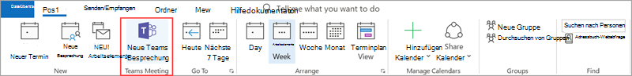
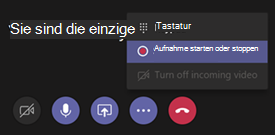

# Verwalten von Besprechungsrichtlinien in TeamsManage meeting policies in Teams

::: zone target="docs"
Besprechungsrichtlinien werden verwendet, um die Steuerung der Features, die an die Teilnehmer bei Besprechungen, die von Benutzern in Ihrer Organisation geplant sind verfügbar sind.Meeting policies are used to control the features that are available to meeting participants for meetings that are scheduled by users in your organization. Nachdem Sie eine Richtlinie erstellen und Ihre Änderungen vornehmen, können Sie die Richtlinie Benutzer zuweisen.After you create a policy and make your changes, you can then assign users to the policy. Sie können in der Microsoft-Teams-Verwaltungskonsole oder mithilfe [von PowerShell](teams-powershell-overview.md)Besprechungsrichtlinien verwalten.You manage meeting policies in the Microsoft Teams admin center or by [using PowerShell](teams-powershell-overview.md).

Implementieren Sie Richtlinien auf folgende Weise, die Einfluss auf die besprechungsumgebung für Benutzer vor einer Besprechung gestartet wird, während einer Besprechung oder nach einer Besprechung.You can implement policies in the following ways, which affect the meeting experience for users before a meeting starts, during a meeting, or after a meeting. 

|ImplementierungstypImplementation type  |BeschreibungDescription  |
|---------|---------|
|Pro organizerPer-organizer    |Wenn Sie eine Richtlinie pro Organisator implementieren, erben alle Teilnehmer die Richtlinie des Dialogfelds Organisieren.When you implement a per-organizer policy, all meeting participants inherit the policy of the organizer. Beispielsweise wird **automatisch zulassen von Personen** eine pro Organisator und-Steuerung für, ob Benutzer an der Besprechung teilnehmen direkt oder warten in der Lobby geplant, die von dem Benutzer, der die Richtlinie zugewiesen wird.For example, **Automatically admit people** is a per-organizer policy and controls whether users join the meeting directly or wait in the lobby for meetings scheduled by the user who is assigned the policy.          |
|Pro BenutzerPer-user    |Wenn Sie eine benutzerbasierte Richtlinie implementieren, gilt nur für die benutzerbasierte Richtlinie, um bestimmte Features für die Inhaltsorganisation und/oder Besprechung Teilnehmer zu beschränken.When you implement a per-user policy, only the per-user policy applies to restrict certain features for the organizer and/or meeting participants. Beispielsweise ist **Jetzt besprechen ermöglichen** eine benutzerbasierte Richtlinie.For example, **Allow Meet now** is a per-user policy.     |
|Pro Organisator und pro BenutzerPer-organizer and per-user     |Wenn Sie eine Kombination aus einer Richtlinie pro Organisator und pro Benutzer implementieren, sind bestimmte Features für die Besprechungsteilnehmer basierend auf ihren und dem Organisator Richtlinie beschränkt.When you implement a combination of a per-organizer and per-user policy, certain features are restricted for meeting participants based on their policy and the organizer's policy. **Aufzeichnen von zulassen Cloud** ist beispielsweise eine Richtlinie pro Organisator und pro Benutzer.For example, **Allow cloud recording** is a per-organizer and per-user policy. Aktivieren Sie diese Einstellung für das Zulassen der Organisator der Besprechung und die Teilnehmer zum Starten und Beenden einer aufzeichnungs.Turn on this setting to allow the meeting organizer and participants to start and stop a recording. 

Standardmäßig wird eine Richtlinie mit dem Namen Global (Org geltende Standard) erstellt.By default, a policy named Global (org-wide default) is created. Alle Benutzer in Ihrer Organisation werden standardmäßig diese besprechungsrichtlinie zugewiesen werden.All users in your organization will be assigned this meeting policy by default. Sie können entweder Änderungen an dieser Richtlinie vornehmen oder einen oder mehrere benutzerdefinierte Richtlinien erstellen und Benutzer zuweisen.You can either make changes to this policy or create one or more custom policies and assign users to them. Wenn Sie eine benutzerdefinierte Richtlinie erstellen, können Sie zulassen oder verhindern, dass bestimmte Features für die Benutzer verfügbar wird, und weisen Sie es an einen oder mehrere Benutzer die Einstellungen angewendet werden.When you create a custom policy, you can allow or prevent certain features from being available to your users, and then assign it to one or more users who will have the settings applied to them. 

## Ändern Sie oder erstellen Sie eine besprechungsrichtlinieChange or create a meeting policy

Zum Ändern oder erstellen eine besprechungsrichtlinie, wechseln Sie auf der Microsoft-Teams, Admin Center > **Besprechungen** > **Besprechungsrichtlinien**.To change or create a meeting policy, go to the Microsoft Teams admin center > **Meetings** > **Meeting policies**. Wählen Sie eine Richtlinie aus der Liste aus, oder wählen Sie **neue Richtlinie**.Select a policy from the list or select **New policy**. Wenn Sie eine neue Richtlinie erstellen, fügen Sie einen Namen und eine Beschreibung ein.If you're creating a new policy, add a name and description. Der Name kann keine Sonderzeichen enthalten oder länger als 64 Zeichen sein.The name can't contain special characters or be longer than 64 characters. Wählen Sie Ihre Einstellungen, und wählen Sie dann auf **Speichern**.Choose your settings, and then select **Save**.

Angenommen Sie, Sie haben eine Reihe von Benutzern und Sie möchten beschränken Bandbreite, die ihrer Besprechung benötigen.For example, say you have a bunch of users and you want to limit the amount of bandwidth that their meeting would require. Sie erstellen eine neue benutzerdefinierte Richtlinie mit dem Namen "Eingeschränkten Bandbreite" und deaktivieren die folgenden Einstellungen:You would create a new custom policy named "Limited bandwidth" and disable the following settings:

Klicken Sie unter **Audio & video**:Under **Audio & video**:
- Deaktivieren der Cloud aufzeichnenTurn off cloud recording
- Zulassen von IP-video deaktivierenTurn off Allow IP video

Klicken Sie unter **gemeinsame Nutzung von Inhalten**:Under **Content sharing**:
- Deaktivieren Sie Bildschirmfreigabe ModusDisable screen sharing mode
- Whiteboard deaktivierenTurn off whiteboard
- Freigegebene Notizen deaktivierenTurn off shared notes

Klicken Sie dann den Benutzern zuweisen der Richtlinie.Then assign the policy to the users.

> [!NOTE] 
> Ein Benutzer kann jeweils nur eine besprechungsrichtlinie zugewiesen werden.A user can be assigned only one meeting policy at a time. 

## Weisen Sie eine besprechungsrichtlinie für BenutzerAssign a meeting policy to users

Wenn Sie die Richtlinie auf einen Benutzer anwenden möchten, wählen Sie im linken Navigationsbereich auf **Benutzer** aus, und klicken Sie dann auf den Namen des Benutzers anzeigen.If you're applying the policy to one user, select **Users** on the left navigation pane, and then click the user's display name. Wählen Sie auf der Benutzer-Seite neben **zugewiesene Richtlinien** **Bearbeiten**.On the user's page, next to **Assigned policies**, select **Edit**. Klicken Sie dann im Bereich **Richtlinien für Benutzer bearbeiten** unter **besprechungsrichtlinie**, wählen Sie die besprechungsrichtlinie aus der Dropdownliste aus, und wählen Sie dann auf **Speichern**.Then, in the **Edit user policies** pane, under **Meeting policy**, select the meeting policy from the drop-down list, and then select **Save**. Sie können auch Richtlinien aus der Liste der Benutzer zuweisen.You can also assign policies from the list of users. Wählen Sie den Benutzer dazu, indem Sie auf der linken Seite des Anzeigenamen des Benutzers auf.To do this, select the user by clicking to the left of the user's display name. Wählen Sie **Einstellungen bearbeiten**.Select **Edit settings**. Klicken Sie dann im Bereich **Einstellungen bearbeiten** unter **besprechungsrichtlinie**, wählen Sie die Richtlinie aus der Dropdown-Liste aus, und wählen Sie dann auf **Speichern**.Then, on the **Edit settings** pane, under **Meeting policy**, select the policy from the drop-down list, and then select **Save**. 
 
Wenn Sie eine Richtlinie auf mehrere Benutzer anwenden möchten, wählen Sie **Benutzer** im linken Navigationsbereich und wählen Sie dann jeden Benutzer durch Klicken auf links neben den Benutzernamen ein, und klicken Sie dann auf **Bearbeiten**.If you're applying a policy to more than one user, select **Users** on the left navigation pane, and then select each user by clicking to the left of the user name, and then click **Edit settings**. Klicken Sie im Bereich **Einstellungen bearbeiten** unter **besprechungsrichtlinie**wählen Sie die Richtlinie aus der Dropdown-Liste aus, und wählen Sie dann auf **Speichern**.On the **Edit Settings** pane, under **Meeting policy**, select the policy from the drop-down list, and then select **Save**.
 
Sie können einen oder mehrere Benutzer auch wie folgt eine besprechungsrichtlinie zuweisen:You can also assign a meeting policy to one or more users as follows:

1. Navigieren Sie zum **Microsoft-Teams, Administrationscenter** > **Besprechungen** > **Besprechungsrichtlinien**.Go to **Microsoft Teams admin center** > **Meetings** > **Meeting policies**.
2. Wählen Sie die Richtlinie, indem Sie auf links neben den Namen der Richtlinie.Select the policy by clicking to the left of the policy name.
3. Wählen Sie **Benutzer verwalten**.Select **Manage users**.
4. Klicken Sie im Bereich **Benutzer verwalten** Suche für den Benutzer nach Anzeigename oder nach Benutzernamen, wählen Sie den Namen, und wählen Sie dann auf **Hinzufügen**.In the **Manage users** pane, search for the user by display name or by user name, select the name, and then select **Add**. Wiederholen Sie diesen Schritt für jeden Benutzer, die Sie hinzufügen möchten.Repeat this step for each user that you want to add.
5. Wenn Sie die Benutzer hinzugefügt haben, wählen Sie **Speichern**aus.When you're finished adding users, select **Save**.
 
> [!NOTE] 
> Eine Richtlinie kann nicht gelöscht werden, wenn Benutzer zugewiesen sind.You can't delete a policy if users are assigned to it. Sie müssen zuerst eine andere Richtlinie für alle betroffenen Benutzer zuweisen, und klicken Sie dann können Sie die ursprüngliche Richtlinie löschen.You must first assign a different policy to all affected users, and then you can delete the original policy.
 
## Richtlinieneinstellungen für die BesprechungMeeting policy settings

Wenn Sie eine vorhandene Richtlinie auf der Seite **Besprechungsrichtlinien** auswählen oder **neue Richtlinie** für eine neue Richtlinie hinzuzufügen, können Sie Einstellungen für Folgendes konfigurieren.When you select an existing policy on the **Meeting policies** page or select **New policy** to add a new policy, you can configure settings for the following.

- [AllgemeinGeneral](#meeting-policy-settings---general)
- [Audio & videoAudio & video](#meeting-policy-settings---audio--video)
- [Gemeinsame Nutzung von InhaltenContent sharing](#meeting-policy-settings---content-sharing)
- [Teilnehmer & GästeParticipants & guests](#meeting-policy-settings---participants--guests)

::: zone-end 

## Richtlinie besprechungseinstellungen - AllgemeinMeeting policy settings - General

- [Sofortbesprechungen in Kanäle zulassenAllow Meet now in channels](#allow-meet-now-in-channels)
- [Zulassen von privaten Sofortbesprechungen (bald verfügbar)Allow private Meet now (coming soon)](#allow-private-meet-now-coming-soon)
- [Zulassen des Outlook-add-InsAllow the Outlook add-in](#allow-the-outlook-add-in)
- [Zulassen der Kanal Besprechung planen.Allow channel meeting scheduling](#allow-channel-meeting-scheduling)
- [Zulassen Sie planen von privaten BesprechungenAllow scheduling private meetings](#allow-scheduling-private-meetings)

### Sofortbesprechungen in Kanäle zulassenAllow Meet now in channels

Dies ist eine benutzerbasierte Richtlinie und wendet vor einer Besprechung beginnt.This is a per-user policy and applies before a meeting starts. Diese Einstellung steuert, ob ein Benutzer in einem Kanal Teams eine Ad-hoc-Besprechung starten kann.This setting controls whether a user can start an ad-hoc meeting in a Teams channel. Wenn Sie aktivieren auf, wenn ein Benutzer eine Nachricht in einem Kanal Teams bereitstellt, kann der Benutzer **Jetzt besprechen** unter dem Feld Verfassen im Kanal eine Ad-hoc-Besprechung starten klicken.If you turn this on, when a user posts a message in a Teams channel, the user can click **Meet now** beneath the compose box to start an ad-hoc meeting in the channel.

### Zulassen von privaten Sofortbesprechungen (bald verfügbar)Allow private Meet now (coming soon)

Dies ist eine benutzerbasierte Richtlinie und wendet vor einer Besprechung beginnt.This is a per-user policy and applies before a meeting starts. Diese Einstellung steuert, ob ein Benutzer eine private ad-hoc-Besprechung starten kann.This setting controls whether a user can start an ad hoc private meeting.  

### Zulassen des Outlook-add-InsAllow the Outlook add-in

Dies ist eine benutzerbasierte Richtlinie und wendet vor einer Besprechung beginnt.This is a per-user policy and applies before a meeting starts. Diese Einstellung steuert, ob Teams Besprechungen in Outlook (Windows, Mac, Web und Mobile) von geplant werden können.This setting controls whether Teams meetings can be scheduled from within Outlook (Windows, Mac, web, and mobile).

Wenn Sie diese Option aktivieren, können Benutzer keine Teams Besprechungen planen, wenn sie eine neue Besprechung in Outlook zu erstellen.If you turn this off, users are unable to schedule Teams meetings when they create a new meeting in Outlook. Beispielsweise werden in Outlook unter Windows die Option **Neue Teams Besprechung** in der Multifunktionsleiste nicht angezeigt.For example, in Outlook on Windows, the **New Teams Meeting** option won't show up in the ribbon.

### Zulassen der Kanal Besprechung planen.Allow channel meeting scheduling

Dies ist eine benutzerbasierte Richtlinie und wendet vor einer Besprechung beginnt.This is a per-user policy and applies before a meeting starts. Diese Einstellung steuert, ob Benutzer eine Besprechung in einem Kanal Teams planen können.This setting controls whether users can schedule a meeting in a Teams channel.  Wenn diese Option deaktiviert die Option **Zeitplan einer Besprechung** nicht verfügbar für den Benutzer, wenn sie eine Besprechung in einem Kanal Teams beginnen und die Option **Wählen Sie einen Kanal erfüllen** ist nicht verfügbar, die dem Benutzer, wenn sie von Besprechungen in Teams eine Besprechung planen.If you turn this off, the **Schedule a meeting** option won't be available to the user when they start a meeting in a Teams channel and the **Select a channel to meet** option won't be available to the user when they schedule a meeting from Meetings in Teams.

### Zulassen Sie planen von privaten BesprechungenAllow scheduling private meetings

Dies ist eine benutzerbasierte Richtlinie und wendet vor einer Besprechung beginnt.This is a per-user policy and applies before a meeting starts. Diese Einstellung steuert, ob Benutzer in Teams private Konferenzen planen können.This setting controls whether users can schedule private meetings in Teams. Eine Besprechung ist privat, wenn sie nicht in einem Kanal ein Team veröffentlicht wird.A meeting is private when it's not published to a channel in a team.

Beachten Sie, dass, wenn Sie **Planen von privaten Besprechungen zulassen** und **Zulassen Channel Besprechung planen**deaktivieren, die **Besprechung planen** Option nicht verfügbar und Benutzer keine Besprechungstermine in Teams können.Note that if you turn off **Allow scheduling private meetings** and **Allow channel meeting scheduling**,  the **Schedule a meeting** option won't be available and users will be unable to schedule meetings in Teams.

## Richtlinieneinstellungen für die Meeting - Audio & videoMeeting policy settings - Audio & video

- [Lautschrift zulassenAllow transcription](#allow-transcription)
- [Zulassen von Cloud aufzeichnenAllow cloud recording](#allow-cloud-recording)
- [IP video zulassenAllow IP video](#allow-ip-video)
- [Media-Bitrate (Kbit/s)Media bit rate (KBs)](#media-bit-rate-kbs)
- [Aktivieren Sie live Beschriftungen (bald verfügbar)Enable live captions (coming soon)](#enable-live-captions-coming-soon)

### Lautschrift zulassenAllow transcription

Dies ist eine Kombination aus einer Richtlinie pro Organisator und pro Benutzer.This is a combination of a per-organizer and per-user policy. Diese Einstellung steuert, ob bei der Wiedergabe des meeting-Aufzeichnungen Beschriftungen und Lautschrift-Features zur Verfügung stehen.This setting controls whether captions and transcription features are available during playback of meeting recordings. Wenn Sie diese Option deaktiviert wird, wird nicht die **Suche** und **CC** -Optionen während der Wiedergabe einer Aufzeichnung der Besprechung zur Verfügung.If you turn this off, the **Search** and **CC** options won't be available during playback of a meeting recording. Die Person, die die Aufzeichnung gestartet benötigt diese Einstellung aktiviert, sodass die Aufzeichnung auch Lautschrift enthält.The person who started the recording needs this setting turned on so that the recording also includes transcription. 

Beachten Sie, dass Lautschrift von aufgezeichneten Besprechungen derzeit unterstützt nur für Benutzer, die die Sprache in Teams auf Englisch festgelegt haben und wenn Englisch in der Besprechung gesprochen wird.Note that transcription for recorded meetings is currently only supported for users who have the language in Teams set to English and when English is spoken in the meeting.

### Zulassen von Cloud aufzeichnenAllow cloud recording

Dies ist eine Kombination aus einer Richtlinie pro Organisator und pro Benutzer.This is a combination of a per-organizer and per-user policy. Diese Einstellung steuert, ob dieses Benutzers Besprechungen aufgezeichnet werden können.This setting controls whether this user's meetings can be recorded. Die Aufzeichnung kann vom Organisator Besprechung oder durch einen anderen Teilnehmer gestartet werden, wenn die Einstellung für den Teilnehmer eingeschaltet ist und sie als authentifizierter Benutzer aus derselben Organisation sind.The recording can be started by the meeting organizer or by another meeting participant if the policy setting is turned on for the participant and if they're an authenticated user from the same organization.

Personen außerhalb Ihrer Organisation, beispielsweise Verbund- und anonyme Benutzer, können nicht die Aufzeichnung gestartet werden.People outside your organization, such as federated and anonymous users, can't start the recording. Gast-Benutzer können nicht starten oder beenden die Aufzeichnung.Guest users can't start or stop the recording. 

Betrachten Sie das folgende Beispiel aus.Let's look at the following example.

|UserUser |BesprechungsrichtlinieMeeting policy  |Zulassen von Cloud aufzeichnenAllow cloud recording |
|---------|---------|---------|
|DanielaDaniela | GlobalGlobal   | FalschFalse |
|AmandaAmanda | Location1MeetingPolicyLocation1MeetingPolicy | TrueTrue|
|John (externe Benutzer)John (external user) | Nicht zutreffendNot applicable | Nicht zutreffendNot applicable|

Von Daniela organisierte Besprechungen können nicht aufgezeichnet werden und Amanda, der die richtlinieneinstellung aktiviert hat, kann nicht von Daniela organisierte Besprechungen aufzeichnen.Meetings organized by Daniela can't be recorded and Amanda, who has the policy setting enabled, can't record meetings organized by Daniela. Von Amanda organisierte Besprechungen erfasst werden können, jedoch Daniela, die richtlinieneinstellung deaktiviert hat und John, ein externer Benutzer ist, nicht aufgezeichnet werden von Amanda organisierte Besprechungen.Meetings organized by Amanda can be recorded, however,  Daniela, who has the policy setting disabled and John who is an external user, can't record meetings organized by Amanda.

Weitere Informationen zu Cloud besprechungsaufzeichnung finden, finden Sie unter [Teams cloud besprechungsaufzeichnung](cloud-recording.md).To learn more about cloud meeting recording, see [Teams cloud meeting recording](cloud-recording.md).

### IP video zulassenAllow IP video

Dies ist eine Kombination aus einer Richtlinie pro Organisator und pro Benutzer.This is a combination of a per-organizer and per-user policy. Video ist eine wichtige Komponente zu Besprechungen.Video is a key component to meetings. In einigen Organisationen möglicherweise Administratoren mehr Kontrolle über welche Benutzer Besprechungen Video haben möchten.In some organizations, admins might want more control over which users’ meetings have video. Diese Einstellung steuert können, ob video in Besprechungen, die von einem Benutzer gehostet und in 1:1-Anrufe und Gruppe Anrufe von einem Benutzer gestartet aktiviert werden.This setting controls whether video can be turned on in meetings hosted by a user and in 1:1 calls and group calls started by a user. Von einem Benutzer, der diese Richtlinie aktiviert ist, hat organisierte Besprechungen zulassen video in der Besprechung durch die Besprechungsteilnehmer freigeben, wenn die Teilnehmer der Besprechung auch die Richtlinie aktiviert ist.Meetings organized by a user who has this policy enabled, allow video sharing in the meeting by the meeting participants, if the meeting participants also have the policy enabled. Besprechungsteilnehmer, die alle Richtlinien zugewiesen (beispielsweise anonyme und Verbundbenutzer Teilnehmer) werden nicht erben die Richtlinie des Besprechungsorganisators.Meeting participants who don't have any policies assigned (for example, anonymous and federated participants) inherit the policy of the meeting organizer.

Betrachten Sie das folgende Beispiel aus.Let's look at the following example.

|UserUser |BesprechungsrichtlinieMeeting policy  |IP-Video zulassenAllow IP Video |
|---------|---------|---------|
|DanielaDaniela   | GlobalGlobal   | TrueTrue        |
|AmandaAmanda    | Location1MeetingPolicyLocation1MeetingPolicy        | FalschFalse      |

Von Daniela gehostet zuzulassen video aktiviert werden.Meetings hosted by Daniela allow video to be turned on. Daniela können Sie an der Besprechung teilnehmen und Video zu aktivieren.Daniela can join the meeting and turn on video. Video in Danielas erfüllen, da einer vergleichbaren Richtlinie gesetzt ist, können keine video kann nicht Amanda aktivieren.Amanda can't turn on video in Daniela's meeting because Amanda’s policy is set to not allow video. Amanda sichtbar Videos von andere Teilnehmer an der Besprechung gemeinsam genutzt werden.Amanda can see videos shared by other participants in the meeting.

In Besprechungen von Amanda gehostet werden können niemand Video, unabhängig von der ihnen zugewiesenen videorichtlinie zu aktivieren.In meetings hosted by Amanda, no one can turn on video, regardless of the video policy assigned to them. Dies bedeutet, dass Daniela auf Video in einer vergleichbaren Besprechungen nicht aktiviert werden kann.This means Daniela can't turn on video in Amanda’s meetings.  

Falls Daniela Amanda mit Video auf Anrufen, kann Amanda den Anruf mit nur Audio beantworten.If Daniela calls Amanda with video on, Amanda can answer the call with audio only.  Die Verbindung hergestellt wurde, Amanda Danielas Video sehen, aber kann nicht auf Video aktivieren.When the call is connected, Amanda can see Daniela’s video, but can't turn on video. Wenn Amanda Daniela aufruft, kann Daniela den Anruf mit Video und Audio beantworten.If Amanda calls Daniela, Daniela can answer the call with video and audio. Wenn die Verbindung hergestellt wurde, kann Daniela aktivieren oder deaktivieren ihr Video, je nach Bedarf.When the call is connected, Daniela can turn on or turn off her video, as needed.

### Media-Bitrate (Kbit/s)Media bit rate (KBs)

Dies ist eine Richtlinie pro organisieren.This is a per-organizer policy. Diese Einstellung bestimmt die Medien Bitrate für audio, video und Video-basierte Anwendungsfreigabe Übertragungen in Anrufe und Besprechungen des Benutzers.This setting determines the media bit rate for audio, video, and video-based app sharing transmissions in calls and meetings for the user. Es wird auf die Uplink und die Downlink Medien für Benutzer in der Anruf oder Besprechung angewendet.It's applied to both the uplink and downlink media traversal for users in the call or meeting. Diese Einstellung gibt Ihnen detaillierte Kontrolle über das Verwalten der Bandbreite in Ihrer Organisation.This setting gives you granular control over managing bandwidth in your organization. Je nach den Besprechungen Szenarien von Benutzern erforderlich sollten genügend Bandbreite direkten guter Qualität-Erfahrung mit.Depending on the meetings scenarios required by users, we recommend having enough bandwidth in place for a good quality experience. Der Mindestwert ist 30 Kbit/s und der maximale Wert hängt von des Besprechung-Szenarios.The minimum value is 30 Kbps and the maximum value depends on the meeting scenario. Weitere Informationen zu mindestens empfohlene Bandbreite für guter Qualität Besprechungen, Anrufe und live Ereignisse in Teams finden Sie unter [erforderliche Bandbreite](prepare-network.md#bandwidth-requirements).To learn more about the minimum recommended bandwidth for good quality meetings, calls, and live events in Teams, see [Bandwidth requirements](prepare-network.md#bandwidth-requirements).

Wenn nicht genügend Bandbreite für eine Besprechung vorhanden ist, wird eine Meldung, die angibt, unzureichende Netzwerkqualität von Teilnehmern angezeigt.If there isn’t enough bandwidth for a meeting, participants see a message that indicates poor network quality.

Für Besprechungen, die das höchste Qualität Videoerlebnis benötigen, wie beispielsweise CEO board Besprechungen und Teams live Ereignisse, sollten Sie die Bandbreite auf 10 Mbit/s festgelegt.For meetings that need the highest quality video experience, such as CEO board meetings and Teams live events, we recommend you set the bandwidth to 10 Mbps. Auch wenn die maximale Erfahrung festgelegt ist, wird der medienstapel Teams an geringer Bandbreite, wenn bestimmte Netzwerkprobleme, je nach Szenario erkannt werden.Even when the maximum experience is set, the Teams media stack adapts to low bandwidth conditions when certain network conditions are detected, depending on the scenario. 

### Aktivieren Sie live Beschriftungen (bald verfügbar)Enable live captions (coming soon)

Dies ist eine benutzerbasierte Richtlinie und während einer Besprechung gilt.This is a per-user policy and applies during a meeting. Wenn diese Einstellung aktiviert ist, erhält der Benutzer eine Option, um die Beschriftungen während einer Besprechung anzeigen.If this setting is on, the user sees an option to display captions during a meeting.

## Richtlinie besprechungseinstellungen - Inhalts-FreigabeMeeting policy settings - Content sharing

- [Bildschirm FreigabemodusScreen sharing mode](#screen-sharing-mode)
- [Ermöglichen eines Teilnehmers zu gewähren oder Anfordern der SteuerungAllow a participant to give or request control](#allow-a-participant-to-give-or-request-control)
- [Ermöglichen Sie einen externen Teilnehmer zu gewähren oder Anfordern der SteuerungAllow an external participant to give or request control](#allow-an-external-participant-to-give-or-request-control)
- [PowerPoint-Freigabe zulassenAllow PowerPoint sharing](#allow-powerpoint-sharing)
- [Whiteboard zulassenAllow whiteboard](#allow-whiteboard)
- [Freigegebene Notizen zulassenAllow shared notes](#allow-shared-notes)
- [Ermöglicht es Chat in Besprechungen (bald verfügbar)Allow chat in meetings (coming soon)](#allow-chat-in-meetings-coming-soon)

### Bildschirm FreigabemodusScreen sharing mode

Dies ist eine Kombination aus einer Richtlinie pro Organisator und pro Benutzer.This is a combination of a per-organizer and per-user policy. Diese Einstellung steuert, ob desktop und/oder Fenster Freigeben des Benutzers Besprechung zulässig ist.This setting controls whether desktop and/or window sharing is allowed in the user's meeting. Besprechungsteilnehmern, die keine Richtlinien zugewiesen haben (z. B., anonyme, Gast B2B, und Verbundpartner Teilnehmer) erben die Richtlinie des Besprechungsorganisators.Meeting participants who don't have any policies assigned (for example, anonymous, guest, B2B, and federated participants) inherit the policy of the meeting organizer.

|Wert der EinstellungSetting value |VerhaltenBehavior  |
|---------|---------|
|**Gesamten Bildschirm****Entire screen**    | Vollständige Desktop- und Anwendungsfreigabe ist zulässig, in der BesprechungFull desktop sharing and application sharing is allowed in the meeting |
|**Einzelne Anwendung****Single application**   | Anwendungsfreigabe ist in der Besprechung zulässig ist.Application sharing is allowed in the meeting        |
|**Deaktiviert****Disabled**     |Bildschirmfreigabe und Anwendungsfreigabe in der Besprechung deaktiviert wird.Screen sharing and application sharing turned off in the meeting.       |

Betrachten Sie das folgende Beispiel aus.Let's look at the following example.

|UserUser |BesprechungsrichtlinieMeeting policy |Bildschirm FreigabemodusScreen sharing mode |
|---------|---------|---------|
|DanielaDaniela  | GlobalGlobal   | Gesamten BildschirmEntire screen |
|AmandaAmanda   | Location1MeetingPolicyLocation1MeetingPolicy  | DeaktiviertDisabled |

Von Daniela gehostet zuzulassen Teilnehmer ihrer ganzen Bildschirm oder eine bestimmte Anwendung freigeben.Meetings hosted by Daniela allow meeting participants to share their entire screen or a specific application. Wenn Amanda Danielas Besprechung beigetreten ist, kann nicht Amanda ihr Bildschirm oder eine bestimmte Anwendung freigeben, wie ihre richtlinieneinstellung deaktiviert ist.If Amanda joins Daniela’s meeting, Amanda can't share her screen or a specific application as her policy setting is disabled. In Besprechungen von Amanda gehostet werden darf niemand ihren Bildschirm oder in einer einzigen Anwendung, unabhängig von der Bildschirmfreigabe Modus Richtlinie zugewiesen freigeben.In meetings hosted by Amanda, no one is allowed to share their screen or a single application, regardless of the screen sharing mode policy assigned to them. Dies bedeutet, dass nicht Daniela ihr Bildschirm oder in einer einzigen Anwendung in einer vergleichbaren Besprechungen freigeben.This means that Daniela can't share her screen or a single application in Amanda’s meetings.  

Benutzer können nicht aktuell, video wiedergeben oder ihren Bildschirm in einer Besprechung Teams freigeben, wenn Sie ihre Google Chrome verwenden.Currently, users can't play video or share their screen in a Teams meeting if they're using Google Chrome.

### Ermöglichen eines Teilnehmers zu gewähren oder Anfordern der SteuerungAllow a participant to give or request control

Dies ist eine benutzerbasierte Richtlinie.This is a per-user policy. Diese Einstellung steuert, ob der Benutzer andere Teilnehmer der Besprechung Kontrolle über den freigegebenen Desktop oder Fenster zuweisen kann.This setting controls whether the user can give control of the shared desktop or window to other meeting participants. Um die Steuerung übergeben möchten, bewegen Sie den Mauszeiger über dem oberen Rand des Bildschirms.To give control, hover over the top of the screen. 

Wenn diese Einstellung für den Benutzer aktiviert ist, wird die Option **Steuerung übergeben** an einer freigabesitzung in der oberen Leiste angezeigt.If this setting is turned on for the user, the **Give Control** option is displayed in the top bar in a sharing session. 

Wenn die Einstellungen ist für den Benutzer deaktiviert, ist die Option **Steuerung** nicht verfügbar.If the settings is turned off for the user, the **Give Control** option isn't available.

Betrachten Sie das folgende Beispiel aus.Let's look at the following example.

|UserUser |BesprechungsrichtlinieMeeting policy  |Zulassen der Teilnehmer zu gewähren oder Anfordern der SteuerungAllow participant to give or request control |
|---------|---------|---------|
|DanielaDaniela   | GlobalGlobal   | TrueTrue       |
|BabekBabek    | Location1MeetingPolicyLocation1MeetingPolicy        | FalschFalse   |

Daniela kann übergeben der Steuerung des freigegebenen Desktops oder des Fensters an andere Teilnehmer an einer Besprechung organisiert Babek während Babek Steuerung an andere Teilnehmer übergeben möchten ist nicht möglich.Daniela can give control of the shared desktop or window to other participants in a meeting organized by Babek whereas Babek can't give control to other participants.

### Ermöglichen Sie einen externen Teilnehmer zu gewähren oder Anfordern der SteuerungAllow an external participant to give or request control

Dies ist eine benutzerbasierte Richtlinie.This is a per-user policy. Diese Einstellung steuert, ob externe Teilnehmer an einer Besprechung Steuerung des freigegebenen Desktops oder Fenster an andere Teilnehmer der Besprechung übertragen können.This setting controls whether external participants in a meeting can give control of their shared desktop or window to other participants in the meeting. Externe Teilnehmer an Besprechungen Teams können sich wie folgt kategorisieren:External participants in Teams meetings can be categorized as follows:  

   - Anonyme BenutzerAnonymous user
   - Gast-BenutzerGuest users  
   - B2B-BenutzerB2B user
   - VerbundbenutzerFederated user  

Gibt an, ob Verbundbenutzer an externe Benutzer während der Freigabe steuern können, werden durch die Einstellung **können Sie einen externen Teilnehmer zu gewähren oder Anfordern der Steuerung** in ihrer Organisation gesteuert.Whether federated users can give control to external users while sharing is controlled by the **Allow an external participant to give or request control** setting in their organization.

### PowerPoint-Freigabe zulassenAllow PowerPoint sharing

Dies ist eine benutzerbasierte Richtlinie.This is a per-user policy. Diese Einstellung steuert, ob Benutzer PowerPoint-Folienstapel in einer Besprechung freigegeben werden kann.This setting controls whether the user can share PowerPoint slide decks in a meeting. Externe Benutzer, einschließlich anonyme, Gast, Benutzer und Partnerbenutzer, erben die Richtlinie des Besprechungsorganisators.External users, including anonymous, guest, and federated users, inherit the policy of the meeting organizer.

Betrachten Sie das folgende Beispiel aus.Let's look at the following example.

|UserUser |BesprechungsrichtlinieMeeting policy  |PowerPoint-Freigabe zulassenAllow PowerPoint sharing |
|---------|---------|---------|
|DanielaDaniela   | GlobalGlobal   | TrueTrue       |
|AmandaAmanda   | Location1MeetingPolicyLocation1MeetingPolicy        | FalschFalse   |

Amanda kann nicht PowerPoint-Folienstapel an Besprechungen freigeben, auch wenn er der Organisator der Besprechung ist.Amanda can't share PowerPoint slide decks in meetings even if she's the meeting organizer. Daniela kann PowerPoint-Folienstapel freigeben, auch wenn die Besprechung nach Amanda organisiert ist.Daniela can share PowerPoint slide decks even if the meeting is organized by Amanda. Amanda kann die PowerPoint-Folienstapel von anderen Personen gemeinsam genutzt werden in der Besprechung anzeigen, obwohl sie PowerPoint-Folienstapel nicht freigeben.Amanda can view the PowerPoint slide decks shared by others in the meeting, even though she can't share PowerPoint slide decks.

### Whiteboard zulassenAllow whiteboard

Dies ist eine benutzerbasierte Richtlinie.This is a per-user policy. Diese Einstellung steuert, ob ein Benutzer das Whiteboard in einer Besprechung freigegeben werden kann.This setting controls whether a user can share the whiteboard in a meeting. Externe Benutzer, einschließlich anonyme, B2B und Verbundbenutzer, erben die Richtlinie des Besprechungsorganisators.External users, including anonymous, B2B, and federated users, inherit the policy of the meeting organizer. 

Betrachten Sie das folgende Beispiel aus.Let's look at the following example.

|UserUser |BesprechungsrichtlinieMeeting policy  |Whiteboard zulassenAllow whiteboard|
|---------|---------|---------|
|DanielaDaniela   | GlobalGlobal   | TrueTrue       |
|AmandaAmanda   | Location1MeetingPolicyLocation1MeetingPolicy        | FalschFalse   |

Amanda kann nicht das Whiteboard in einer Besprechung freigeben, selbst wenn er der Organisator der Besprechung wird.Amanda can't share the whiteboard in a meeting even if she's the meeting organizer. Daniela kann das Whiteboard freigeben, selbst wenn durch Amanda eine Besprechung organisiert werden.Daniela can share the whiteboard even if a meeting is organized by Amanda.  

### Freigegebene Notizen zulassenAllow shared notes

Dies ist eine benutzerbasierte Richtlinie.This is a per-user policy. Diese Einstellung steuert, ob ein Benutzer erstellen und Freigeben von Notizen in einer Besprechung kann.This setting controls whether a user can create and share notes in a meeting. Externe Benutzer, einschließlich anonyme, B2B und Verbundbenutzer, erben die Richtlinie des Besprechungsorganisators.External users, including anonymous, B2B, and federated users, inherit the policy of the meeting organizer. Die Registerkarte **Besprechungsnotizen** ist derzeit nur in unterstützten Besprechungen, die weniger als 20 Teilnehmer haben.The **Meeting Notes** tab is currently only supported in meetings that have less than 20 participants. 

Betrachten Sie das folgende Beispiel aus.Let's look at the following example.

|UserUser |BesprechungsrichtlinieMeeting policy  |Freigegebene Notizen zulassenAllow shared notes |
|---------|---------|---------|
|DanielaDaniela   | GlobalGlobal   | TrueTrue       |
|AmandaAmanda   | Location1MeetingPolicyLocation1MeetingPolicy | FalschFalse |

Daniela kann Aufzeichnen von Notizen in einer vergleichbaren Besprechungen und Amanda kann nicht Aufzeichnen von Notizen in eine beliebige Besprechungen.Daniela can take notes in Amanda's meetings and Amanda can't take notes in any meetings.

### Ermöglicht es Chat in Besprechungen (bald verfügbar)Allow chat in meetings (coming soon)

Dies ist eine Richtlinie pro organisieren.This is a per-organizer policy. Diese Einstellung steuert, ob der Benutzer Besprechung meeting Chat zulässig ist.This setting controls whether meeting chat is allowed in the user's meeting. 

## Richtlinie besprechungseinstellungen - Teilnehmer & GästeMeeting policy settings - Participants & guests

Diese Einstellungen steuern, welche Besprechungsteilnehmer warten im Wartebereich warten, bevor sie an der Besprechung und die Ebene der Teilnahme zugelassen sind, die sie in einer Besprechung zugelassen werden.These settings control which meeting participants wait in the lobby before they are admitted to the meeting and the level of participation they are allowed in a meeting.

- [Automatisch Personen zulassenAutomatically admit people](#automatically-admit-people)
- [Erlauben Sie anonyme Benutzern, starten Sie eine BesprechungAllow anonymous people to start a meeting](#allow-anonymous-people-to-start-a-meeting)
- [Zulassen Sie DFÜ-Benutzer umgehen den WartebereichAllow dial-in users to bypass the lobby](#allow-dial-in-users-to-bypass-the-lobby-coming-soon)
- [Zulassen von Organisatoren, Wartebereich Einstellungen außer Kraft setzenAllow organizers to override lobby settings](#allow-organizers-to-override-lobby-settings-coming-soon)

### Automatisch Personen zulassenAutomatically admit people

Dies ist eine Richtlinie pro organisieren.This is a per-organizer policy. Diese Einstellung steuert, ob Personen, für die Verknüpfung einer Besprechung direkt oder im Wartebereich warten, bis Sie sie durch einen authentifizierten Benutzer zugelassen werden.This setting controls whether people join a meeting directly or wait in the lobby until they are admitted by an authenticated user.

 Besprechungsorganisatoren kann Klicken Sie auf **Besprechungsoptionen** in der Einladung zum Ändern dieser Einstellung für jede Besprechung, die sie planen.Meeting organizers can click **Meeting Options** in the meeting invitation to change this setting for each meeting they schedule. **(bald verfügbar)****(coming soon)**
  
|Wert der EinstellungSetting value  |Teilnehmen an VerhaltenJoin behavior |
|---------|---------|
|**Jeder****Everyone**   |Alle Teilnehmer an die Besprechung direkt und ohne im Wartebereich warten teilnehmen.All meeting participants join the meeting directly without waiting in the lobby. Dazu gehören authentifizierte Benutzer, Verbundbenutzer, Gäste, anonyme Benutzer und Personen, die sich per Telefon einwählen.This includes authenticated users, federated users, guests, anonymous users, and people who dial in by phone.       |
|**Jede Person in Ihrer Organisation und Partnerorganisationen****Everyone in your organization and federated organizations**     |Authentifizierte Benutzer innerhalb der Organisation, einschließlich Gast und die Benutzer aus verbundorganisationen, teilnehmen an der Besprechung direkt und ohne im Wartebereich warten.Authenticated users within the organization, including guest users and the users from federated organizations, join the meeting directly without waiting in the lobby.  Anonyme Benutzer und Benutzer, die sich per Telefon einwählen im Wartebereich warten.Anonymous users and users who dial in by phone wait in the lobby.   |
|**Jede Person in Ihrer Organisation****Everyone in your organization**    |Authentifizierte Benutzer von innerhalb der Organisation, einschließlich Gastbenutzer teilnehmen an der Besprechung direkt und ohne im Wartebereich warten.Authenticated users from within the organization, including guest users, join the meeting directly without waiting in the lobby.  Benutzer, die sich per Telefon einwählen, Verbundbenutzer und anonyme Benutzer im Wartebereich warten.Federated users, anonymous users, and users who dial in by phone wait in the lobby.           |

### Erlauben Sie anonyme Benutzern, starten Sie eine BesprechungAllow anonymous people to start a meeting

Dies ist eine Richtlinie pro organisieren.This is a per-organizer policy. Diese Einstellung steuert, ob anonyme Benutzer, einschließlich B2B und Verbundbenutzer, des Benutzers Besprechung ohne als authentifizierter Benutzer aus der Organisation in Anwesenheit beitreten können.This setting controls whether anonymous people, including B2B, and federated users, can join the user's meeting without an authenticated user from the organization in attendance. 

Hier wird das Verhalten Join von anonymen Benutzern bei der authentifizierte Benutzer in der Besprechung vorhanden sind.Here's the join behavior of anonymous people when authenticated users are present in the meeting.

|Erlauben Sie anonyme Benutzern, starten Sie eine BesprechungAllow anonymous people to start a meeting  |Automatisch Personen zulassenAutomatically admit people |Verhalten von anonymen Benutzern teilnehmenJoin behavior of anonymous people |
|---------|---------|---------|
|TrueTrue    | JederEveryone      | Direkte VerknüpfungJoin directly         |
|   | Jede Person in Ihrer OrganisationEveryone in your organization       | Im Wartebereich wartenWait in lobby        |
|   | Jede Person in Ihrer Organisation und PartnerorganisationenEveryone in your organization and federated organizations       | Im Wartebereich wartenWait in lobby         |
|FalschFalse    | JederEveryone        | Direkte VerknüpfungJoin directly        |
|   | Jede Person in Ihrer OrganisationEveryone in your organization     | Im Wartebereich wartenWait in lobby        |
|   | Jede Person in Ihrer Organisation und PartnerorganisationenEveryone in your organization and federated organizations      | Im Wartebereich wartenWait in lobby         |

Hier ist das Join Verhalten von anonymen Benutzern, wenn keine authentifizierte Benutzer in der Besprechung vorhanden sind.Here's the join behavior of anonymous people when no authenticated users are present in the meeting.

|Erlauben Sie anonyme Benutzern, starten Sie eine BesprechungAllow anonymous people to start a meeting |Automatisch Personen zulassenAutomatically admit people  |Verhalten von anonymen Benutzern teilnehmenJoin behavior of anonymous people |
|---------|---------|---------|
|TrueTrue    | JederEveryone      | Direkte VerknüpfungJoin directly         |
|   | Jede Person in Ihrer OrganisationEveryone in your organization       | Im Wartebereich wartenWait in lobby        |
|   | Jede Person in Ihrer Organisation und PartnerorganisationenEveryone in your organization and federated organizations       | Im Wartebereich wartenWait in lobby         |
|FalschFalse    | JederEveryone        | Im Wartebereich warten.Wait in lobby. Benutzer werden automatisch zugelassen werden, wenn der erste authentifizierte Benutzer die Besprechung Beitritt.Users are automatically admitted when the first authenticated user joins the meeting.        |
|   | Jede Person in Ihrer OrganisationEveryone in your organization     |Im Wartebereich wartenWait in lobby         |
|   | Jede Person in Ihrer Organisation und PartnerorganisationenEveryone in your organization and federated organizations      | Im Wartebereich wartenWait in lobby         |

### Zulassen, dass der Benutzer einwählen, umgehen den Wartebereich für eine (bald verfügbar)Allow dial-in users to bypass the lobby (coming soon)

Dies ist eine Richtlinie pro organisieren.This is a per-organizer policy. Diese Einstellung steuert, ob die Personen, die sich per Telefon einwählen an der Besprechung teilnehmen direkt oder warten im Wartebereich ungeachtet der Einstellung der **Personen automatisch zuzulassen** .This setting controls whether people who dial in by phone join the meeting directly or wait in the lobby regardless of the **Automatically admit people** setting.

Es folgt das Join-Verhalten von Personen, die sich per Telefon einwählen.Here's the join behavior of people who dial in by phone.

|Zulassen Sie DFÜ-Benutzer umgehen den WartebereichAllow dial-in users to bypass the lobby  |Benutzer automatisch zulassenAutomatically admit users  |Teilnehmen Sie das Verhalten der Personen, die sich einwählenJoin behavior of people who dial in |
|---------|---------|---------|
|TrueTrue    | JederEveryone      | Direkte VerknüpfungJoin directly         |
|   | Jede Person in Ihrer OrganisationEveryone in your organization       | Direkte VerknüpfungJoin directly        |
|   | Jede Person in Ihrer Organisation und PartnerorganisationenEveryone in your organization and federated organizations       | Direkte VerknüpfungJoin directly         |
|FalschFalse    | JederEveryone        | Direkte VerknüpfungJoin directly        |
|   | Jede Person in Ihrer OrganisationEveryone in your organization     |Im Wartebereich wartenWait in lobby         |
|   | Jede Person in Ihrer Organisation und PartnerorganisationenEveryone in your organization and federated organizations      | Im Wartebereich wartenWait in lobby         |

### Zulassen von Organisatoren, Wartebereich-Einstellungen (bald verfügbar) außer Kraft setzenAllow organizers to override lobby settings (coming soon)

Dies ist eine Richtlinie pro organisieren.This is a per-organizer policy. Diese Einstellung steuert, ob der Organisator der Besprechung die Lobby Einstellungen außer Kraft, die ein Administrator in **automatisch zulassen von Personen** und **Benutzern einwählen setzen kann, umgehen den Wartebereich für eine** festgelegt, wenn sie eine neue Besprechung planen.This setting controls whether the meeting organizer can override the lobby settings that an admin set in **Automatically admit people** and **Allow dial-in users to bypass the lobby** when they schedule a new meeting. 

Besprechungsorganisatoren kann Klicken Sie auf **Besprechungsoptionen** in der Einladung Wartebereich Einstellungen für jede Besprechung ändern, den sie planen.Meeting organizers can click **Meeting Options** in the meeting invitation to change lobby settings for each meeting they schedule. 

Hier ist, wie Sie diese Einstellung wirkt sich, ob der Organisator der Besprechung die Einstellung **automatisch Personen zulassen** für jede Sitzung der Organisator Zeitpläne ändern kann.Here's how this setting affects whether the meeting organizer can change the **Automatically admit people** setting for each meeting the organizer schedules.

|Zulassen von Organisatoren, Wartebereich Einstellungen außer Kraft setzenAllow organizers to override lobby settings  |Automatisch Personen zulassenAutomatically admit people  |VerhaltenBehavior |
|---------|---------|---------|
|TrueTrue    | JederEveryone      | Organisatoren kann die Einstellung auf einen anderen Wert ändern.Organizer can change the setting to any other value. |
|   | Jede Person in Ihrer OrganisationEveryone in your organization       | Organisatoren kann die Einstellung auf einen anderen Wert ändern.Organizer can change the setting to any other value.|
|   | Jede Person in Ihrer Organisation und PartnerorganisationenEveryone in your organization and federated organizations       | Organisator kann diese auf einen anderen Wert ändern.Organizer can change this to any other value.         |
|FalschFalse    | JederEveryone        | Organisatoren kann die Einstellung auf einen anderen Wert ändern.Organizer can change the setting to any other value.|
|   | Jede Person in Ihrer OrganisationEveryone in your organization     |Organisatoren kann die Einstellung für **alle Benutzer in Ihrer Organisation**ändern.Organizer can change the setting to **Everyone in your organization**. |
|   | Jede Person in Ihrer Organisation und PartnerorganisationenEveryone in your organization and federated organizations      | Organisator kann nicht die Lobby Einstellung außer Kraft setzen.Organizer can't override the lobby setting. |

Hier ist wie diese Einstellung wirkt sich auf, ob der Organisator der Besprechung die **Zugriffsnummer für Einwahl Benutzern erlauben, umgehen den Wartebereich für eine** Einstellung für jede Sitzung der Organisator Zeitpläne ändern kann.Here's how this setting affects whether the meeting organizer can change the **Allow dial-in users to bypass the lobby** setting for each meeting the organizer schedules.
    
|Zulassen von Organisatoren, Wartebereich Einstellungen außer Kraft setzenAllow organizers to override lobby settings  |Zulassen Sie DFÜ-Benutzer umgehen den WartebereichAllow dial-in users to bypass the lobby  |VerhaltenBehavior |
|---------|---------|---------|
|TrueTrue    |  TrueTrue        | Organizer kann die Einstellung auf "false" ändern.Organizer can change the setting to False.       |
|TrueTrue      | FalschFalse         | Organisatoren kann die Einstellung auf "true" ändern.Organizer can change the setting to True.        |
|FalschFalse     | TrueTrue        |Organizer kann die Einstellung auf "false" ändern.Organizer can change the setting to False.         |
|FalschFalse      |FalschFalse          |Organisator kann nicht die Lobby Einstellung außer Kraft setzen und lässt keine DFÜ-Benutzer umgehen den Wartebereich für eine in der Besprechung.Organizer can't override the lobby setting and can't allow dial-in users to bypass the lobby in the meeting.        |

[Vollständigen ArtikelFull article](meeting-policies-in-teams.md)

## Verwandte ThemenRelated topics
[Messagingrichtlinien in TeamsMessaging policies in Teams](messaging-policies-in-teams.md)
