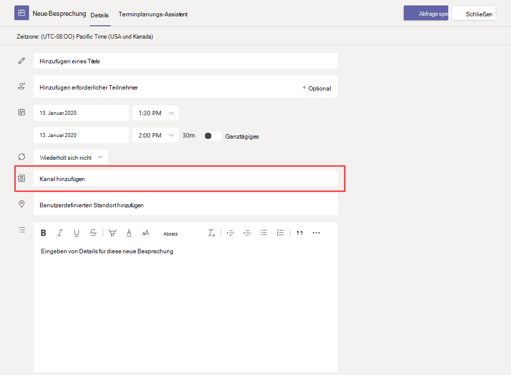

# Verwalten von Besprechungsrichtlinien in TeamsManage meeting policies in Teams

::: zone target="docs"
Besprechungsrichtlinien werden verwendet, um die Features zu steuern, die Besprechungsteilnehmern für Besprechungen zur Verfügung stehen, die von Benutzern in Ihrer Organisation geplant werden.Meeting policies are used to control the features that are available to meeting participants for meetings that are scheduled by users in your organization. Nachdem Sie eine Richtlinie erstellt und die Änderungen vorgenommen haben, können Sie der Richtlinie Benutzer zuweisen.After you create a policy and make your changes, you can then assign users to the policy. Sie können Besprechungsrichtlinien im Microsoft Teams Admin Center oder mithilfe von [PowerShell](teams-powershell-overview.md)verwalten.You manage meeting policies in the Microsoft Teams admin center or by using [PowerShell](teams-powershell-overview.md).

Sie können Richtlinien wie folgt implementieren, die sich auf die Besprechungs Erfahrung für Benutzer auswirken, bevor eine Besprechung beginnt, während einer Besprechung oder nach einer Besprechung.You can implement policies in the following ways, which affect the meeting experience for users before a meeting starts, during a meeting, or after a meeting.

|ImplementierungsImplementation type  |BeschreibungDescription  |
|---------|---------|
|Pro OrganisatorPer-organizer    |Wenn Sie eine Richtlinie pro Organisation implementieren, erben alle Besprechungsteilnehmer die Richtlinie des Organisators.When you implement a per-organizer policy, all meeting participants inherit the policy of the organizer. So ist beispielsweise " **Personen automatisch zulassen** " eine Richtlinie pro Organisator und steuert, ob Benutzer direkt an der Besprechung teilnehmen oder in der Lobby auf Besprechungen warten, die der Benutzer, dem die Richtlinie zugewiesen ist, geplant hat.For example, **Automatically admit people** is a per-organizer policy and controls whether users join the meeting directly or wait in the lobby for meetings scheduled by the user who is assigned the policy.          |
|Pro BenutzerPer-user    |Wenn Sie eine Richtlinie pro Benutzer implementieren, gilt nur die Richtlinie pro Benutzer, um bestimmte Features für den Organisator und/oder die Besprechungsteilnehmer zu beschränken.When you implement a per-user policy, only the per-user policy applies to restrict certain features for the organizer and/or meeting participants. So ist beispielsweise die Option "jetzt besprechen" **in Kanälen** eine Richtlinie pro Benutzer.For example, **Allow Meet now in channels** is a per-user policy.     |
|Pro Organisator und pro BenutzerPer-organizer and per-user     |Wenn Sie eine Kombination aus einer pro-Organizer-und pro-Benutzer-Richtlinie implementieren, sind bestimmte Features für Besprechungsteilnehmer basierend auf Ihrer Richtlinie und der Richtlinie des Organisators eingeschränkt.When you implement a combination of a per-organizer and per-user policy, certain features are restricted for meeting participants based on their policy and the organizer's policy. So können Sie beispielsweise für die **Cloud-Aufzeichnung** eine pro-Organizer-und pro-Benutzer-Richtlinie verwenden.For example, **Allow cloud recording** is a per-organizer and per-user policy. Aktivieren Sie diese Einstellung, damit der Besprechungsorganisator und die Teilnehmer eine Aufzeichnung starten und beenden können.Turn on this setting to allow the meeting organizer and participants to start and stop a recording.

Standardmäßig wird eine Richtlinie mit dem Namen Global (org-Wide Standard) erstellt.By default, a policy named Global (Org-wide default) is created. Allen Benutzern in Ihrer Organisation wird standardmäßig die globale Besprechungsrichtlinie zugewiesen.All users in your organization are assigned the Global meeting policy by default. Sie können entweder Änderungen daran vornehmen oder eine oder mehrere benutzerdefinierte Richtlinien erstellen und Ihnen Benutzer zuweisen.You can either make changes to it or create one or more custom policies and assign users to them. Benutzer erhalten die globale Richtlinie, es sei denn, Sie erstellen eine benutzerdefinierte Richtlinie und weisen diese zu.Users will get the Global policy unless you create and assign a custom policy. Wenn Sie eine benutzerdefinierte Richtlinie erstellen, können Sie zulassen oder verhindern, dass bestimmte Features für Ihre Benutzer verfügbar sind, und Sie dann einem oder mehreren Benutzern zuweisen, auf die die Einstellungen angewendet werden.When you create a custom policy, you can allow or prevent certain features from being available to your users, and then assign it to one or more users who will have the settings applied to them.

## Ändern oder Erstellen einer BesprechungsrichtlinieChange or create a meeting policy

Wenn Sie eine Besprechungsrichtlinie ändern oder erstellen möchten, wechseln Sie zum Microsoft Teams Admin Center #a0**Besprechungsrichtlinien**für **Besprechungen** > .To change or create a meeting policy, go to the Microsoft Teams admin center > **Meetings** > **Meeting policies**. Wählen Sie eine Richtlinie aus der Liste aus, oder wählen Sie **Hinzufügen**aus.Select a policy from the list or select **Add**. Wenn Sie eine neue Richtlinie erstellen, fügen Sie einen Namen und eine Beschreibung hinzu.If you're creating a new policy, add a name and description. Der Name darf keine Sonderzeichen oder mehr als 64 Zeichen enthalten.The name can't contain special characters or be longer than 64 characters. Wählen Sie Ihre Einstellungen aus, und wählen Sie dann **Speichern**aus.Choose your settings, and then select **Save**.

Angenommen, Sie verfügen über eine Reihe von Benutzern, und Sie möchten die Bandbreite begrenzen, die für Ihre Besprechung erforderlich ist.For example, say you have a bunch of users and you want to limit the amount of bandwidth that their meeting would require. Erstellen Sie eine neue benutzerdefinierte Richtlinie mit dem Namen "begrenzte Bandbreite", und deaktivieren Sie die folgenden Einstellungen:You would create a new custom policy named "Limited bandwidth" and disable the following settings:

Unter **Audio #a0 Video**:Under **Audio & video**:
- Deaktivieren Sie die Option "Cloud-Aufzeichnung zulassen".Turn off Allow cloud recording.
- Deaktivieren Sie IP-Video zulassen.Turn off Allow IP video.

Unter **Inhaltsfreigabe**:Under **Content sharing**:
- Deaktivieren Sie den Bildschirmfreigabe Modus.Disable screen sharing mode.
- Deaktivieren Sie Whiteboard zulassen.Turn off Allow whiteboard.
- Deaktivieren Sie freigegebene Notizen zulassen.Turn off Allow shared notes.

Weisen Sie dann die Richtlinie den Benutzern zu.Then assign the policy to the users.

> [!NOTE]
> Einem Benutzer kann immer nur eine Besprechungsrichtlinie zugewiesen werden.A user can be assigned only one meeting policy at a time.

## Zuweisen einer Besprechungsrichtlinie zu BenutzernAssign a meeting policy to users

1. Navigieren Sie in der linken Navigationsleiste des Microsoft Teams Admin Center zu **Benutzer**, und klicken Sie dann auf den Benutzer.In the left navigation of the Microsoft Teams admin center, go to **Users**, and then click the user.
2. Wählen Sie den Benutzer aus, indem Sie links neben dem Benutzernamen klicken, und klicken Sie dann auf **Einstellungen bearbeiten**.Select the user by clicking to the left of the user name, and then click **Edit settings**.
3. Wählen Sie unter **Besprechungsrichtlinie**die Richtlinie aus, die Sie zuweisen möchten, und klicken Sie dann auf über **nehmen**.Under **Meeting policy**, select the policy you want to assign, and then click **Apply**.

Informationen zum Zuweisen einer Richtlinie zu mehreren Benutzern gleichzeitig finden Sie unter [Bearbeiten von Benutzereinstellungen für Teams in Massen](edit-user-settings-in-bulk.md).To assign a policy to multiple users at a time, see [Edit Teams user settings in bulk](edit-user-settings-in-bulk.md).

Sie können auch die folgenden Schritte ausführen:Or, you can also do the following:

1. Wechseln Sie in der linken Navigationsleiste des Microsoft Teams Admin Center zu**Besprechungsrichtlinien**für **Besprechungen** > .In the left navigation of the Microsoft Teams admin center, go to **Meetings** > **Meeting policies**.
2. Wählen Sie die gewünschte Richtlinie aus, indem Sie links neben die Richtlinienbezeichnung klicken.Select the policy by clicking to the left of the policy name.
3. Wählen Sie **Benutzer verwalten** aus.Select **Manage users**.
4. Suchen Sie im Bereich **Benutzer verwalten** anhand des Anzeigenamens oder des Benutzernamens nach dem Benutzer, wählen Sie den Namen aus, und klicken Sie auf **Hinzufügen**.In the **Manage users** pane, search for the user by display name or by user name, select the name, and then select **Add**. Wiederholen Sie diesen Schritt für jeden Benutzer, den Sie hinzufügen möchten.Repeat this step for each user that you want to add.
5. Nachdem Sie das Hinzufügen von Benutzern abgeschlossen haben, wählen Sie **Speichern**aus.After you finish adding users, select **Save**.

> [!NOTE]
> Sie können eine Richtlinie nicht löschen, solange Sie Benutzern zugewiesen ist.You can't delete a policy if users are assigned to it. Sie müssen allen betroffenen Benutzern erst eine andere Richtlinie zuweisen, bevor Sie die ursprüngliche Richtlinie löschen können.You must first assign a different policy to all affected users, and then you can delete the original policy.

## Einstellungen für BesprechungsrichtlinienMeeting policy settings

Wenn Sie auf der Seite **Besprechungsrichtlinien** eine vorhandene Richtlinie auswählen oder auf **Hinzufügen** klicken, um eine neue Richtlinie hinzuzufügen, können Sie die Einstellungen für Folgendes konfigurieren.When you select an existing policy on the **Meeting policies** page or select **Add** to add a new policy, you can configure settings for the following.

- [AllgemeinGeneral](#meeting-policy-settings---general)
- [Audio #a0 VideoAudio & video](#meeting-policy-settings---audio--video)
- [InhaltsfreigabeContent sharing](#meeting-policy-settings---content-sharing)
- [Teilnehmer #a0 GästeParticipants & guests](#meeting-policy-settings---participants--guests)

::: zone-end 

## Einstellungen für Besprechungsrichtlinien – allgemeinMeeting policy settings - General

- [Sofortbesprechung in Kanälen zulassenAllow Meet now in channels](#allow-meet-now-in-channels)
- [Zulassen des Outlook-Add-insAllow the Outlook add-in](#allow-the-outlook-add-in)
- [Planen der Kanal Besprechung zulassenAllow channel meeting scheduling](#allow-channel-meeting-scheduling)
- [Planen privater Besprechungen zulassenAllow scheduling private meetings](#allow-scheduling-private-meetings)

### Sofortbesprechung in Kanälen zulassenAllow Meet now in channels

Hierbei handelt es sich um eine benutzerspezifische Richtlinie, die vor dem Beginn einer Besprechung gilt.This is a per-user policy and applies before a meeting starts. Diese Einstellung steuert, ob ein Benutzer eine Ad-hoc-Besprechung in einem Teams-Kanal starten kann.This setting controls whether a user can start an ad hoc meeting in a Teams channel. Wenn Sie diese Option aktivieren und ein Benutzer eine Nachricht in einem Teams-Kanal sendet, kann der Benutzer unter dem Feld zum Verfassen auf **jetzt** besprechen klicken, um eine Ad-hoc-Besprechung im Kanal zu starten.If you turn this on, when a user posts a message in a Teams channel, the user can click **Meet now** under the compose box to start an ad hoc meeting in the channel.

### Zulassen des Outlook-Add-insAllow the Outlook add-in

Hierbei handelt es sich um eine benutzerspezifische Richtlinie, die vor dem Beginn einer Besprechung gilt.This is a per-user policy and applies before a meeting starts. Mit dieser Einstellung wird gesteuert, ob Teams-Besprechungen in Outlook (Windows, Mac, Web und Mobile) geplant werden können.This setting controls whether Teams meetings can be scheduled from within Outlook (Windows, Mac, web, and mobile).

Wenn Sie diese Option deaktivieren, können die Benutzer keine Teams-Besprechungen planen, wenn Sie in Outlook eine neue Besprechung erstellen.If you turn this off, users are unable to schedule Teams meetings when they create a new meeting in Outlook. In Outlook unter Windows wird beispielsweise die Option **neue Teams-Besprechung** nicht im Menüband angezeigt.For example, in Outlook on Windows, the **New Teams Meeting** option won't show up in the ribbon.

### Planen der Kanal Besprechung zulassenAllow channel meeting scheduling

Hierbei handelt es sich um eine benutzerspezifische Richtlinie, die vor dem Beginn einer Besprechung gilt.This is a per-user policy and applies before a meeting starts. Diese Einstellung steuert, ob Benutzer eine Besprechung in einem Teams-Kanal planen können.This setting controls whether users can schedule a meeting in a Teams channel.  Wenn Sie **diese Option deaktivieren, steht der Benutzer** beim Starten einer Besprechung in einem Teams-Kanal und der Option **Kanal hinzufügen** für Benutzer in Teams deaktiviert zur Verfügung.If you turn this off, the **Schedule a meeting** option won't be available to the user when they start a meeting in a Teams channel and the **Add channel** option is disabled for users in Teams.

### Planen privater Besprechungen zulassenAllow scheduling private meetings

Hierbei handelt es sich um eine benutzerspezifische Richtlinie, die vor dem Beginn einer Besprechung gilt.This is a per-user policy and applies before a meeting starts. Diese Einstellung steuert, ob Benutzer private Besprechungen in Teams planen können.This setting controls whether users can schedule private meetings in Teams. Eine Besprechung ist privat, wenn Sie nicht in einem Kanal in einem Team veröffentlicht wurde.A meeting is private when it's not published to a channel in a team.

Beachten Sie Folgendes: Wenn Sie die Option " **Planen privater Besprechungen zulassen** " deaktivieren und die **Kanal Besprechungsplanung zulassen**, sind die Optionen " **erforderliche Teilnehmer hinzufügen** " und " **Kanal hinzufügen** " für Benutzer in Teams deaktiviert.Note that if you turn off **Allow scheduling private meetings** and **Allow channel meeting scheduling**,  the **Add required attendees** and **Add channel** options are disabled for users in Teams.

## Einstellungen für Besprechungsrichtlinien – Audio #a0 VideoMeeting policy settings - Audio & video

- [Transkription zulassenAllow transcription](#allow-transcription)
- [Cloud-Aufzeichnung zulassenAllow cloud recording](#allow-cloud-recording)
- [IP-Video zulassenAllow IP video](#allow-ip-video)
- [Medien-Bitrate (KBS)Media bit rate (KBs)](#media-bit-rate-kbs)

### Transkription zulassenAllow transcription

Hierbei handelt es sich um eine Kombination aus einer pro-Organizer-und pro-User-Richtlinie.This is a combination of a per-organizer and per-user policy. Mit dieser Einstellung wird gesteuert, ob Beschriftungen und Transkriptions Features bei der Wiedergabe von Besprechungsaufzeichnungen zur Verfügung stehen.This setting controls whether captions and transcription features are available during playback of meeting recordings. Wenn Sie diese Option deaktivieren, stehen die Optionen " **Suchen** " und " **CC** " während der Wiedergabe einer Besprechungsaufzeichnung nicht zur Verfügung.If you turn this off, the **Search** and **CC** options won't be available during playback of a meeting recording. Die Person, die die Aufzeichnung gestartet hat, muss diese Einstellung aktiviert haben, damit die Aufzeichnung auch Transkription umfasst.The person who started the recording needs this setting turned on so that the recording also includes transcription. 

Beachten Sie, dass die Transkription für aufgezeichnete Besprechungen derzeit nur für Benutzer unterstützt wird, für die die Sprache in Teams auf Englisch festgesetzt ist und wenn Englisch in der Besprechung gesprochen wird.Note that transcription for recorded meetings is currently only supported for users who have the language in Teams set to English and when English is spoken in the meeting.

### Cloud-Aufzeichnung zulassenAllow cloud recording

Hierbei handelt es sich um eine Kombination aus einer pro-Organizer-und pro-User-Richtlinie.This is a combination of a per-organizer and per-user policy. Diese Einstellung steuert, ob die Besprechungen dieses Benutzers aufgezeichnet werden können.This setting controls whether this user's meetings can be recorded. Die Aufzeichnung kann vom Besprechungsorganisator oder von einem anderen Besprechungsteilnehmer gestartet werden, wenn die Richtlinieneinstellung für den Teilnehmer aktiviert ist und es sich um einen authentifizierten Benutzer aus derselben Organisation handelt.The recording can be started by the meeting organizer or by another meeting participant if the policy setting is turned on for the participant and if they're an authenticated user from the same organization.

Personen außerhalb Ihrer Organisation, wie etwa Föderations-und anonyme Benutzer, können die Aufzeichnung nicht starten.People outside your organization, such as federated and anonymous users, can't start the recording. Gastbenutzer können die Aufzeichnung nicht starten oder beenden.Guest users can't start or stop the recording. 

Sehen wir uns das folgende Beispiel an:Let's look at the following example.

|BenutzerUser |BesprechungsrichtlinieMeeting policy  |Cloud-Aufzeichnung zulassenAllow cloud recording |
|---------|---------|---------|
|DanielaDaniela | GlobalGlobal   | FalschFalse |
|AmandaAmanda | Location1MeetingPolicyLocation1MeetingPolicy | WahrTrue|
|John (externer Benutzer)John (external user) | Nicht zutreffendNot applicable | Nicht zutreffendNot applicable|

Von Daniela organisierte Besprechungen können nicht aufgezeichnet werden, und Amanda, deren Richtlinieneinstellung aktiviert ist, kann keine von Daniela organisierten Besprechungen aufzeichnen.Meetings organized by Daniela can't be recorded and Amanda, who has the policy setting enabled, can't record meetings organized by Daniela. Von Amanda organisierte Besprechungen können aufgezeichnet werden, doch Daniela, die die Richtlinieneinstellung deaktiviert hat, und John, der ein externer Benutzer ist, kann keine von Amanda organisierten Besprechungen aufzeichnen.Meetings organized by Amanda can be recorded, however,  Daniela, who has the policy setting disabled and John who is an external user, can't record meetings organized by Amanda.

Weitere Informationen zur Aufzeichnung von Cloud-Besprechungen finden Sie unter [Cloud-Besprechungsaufzeichnung in Teams](cloud-recording.md).To learn more about cloud meeting recording, see [Teams cloud meeting recording](cloud-recording.md).

### IP-Video zulassenAllow IP video

Hierbei handelt es sich um eine Kombination aus einer pro-Organizer-und pro-User-Richtlinie.This is a combination of a per-organizer and per-user policy. Video ist eine wichtige Komponente für Besprechungen.Video is a key component to meetings. In einigen Organisationen möchten Administratoren möglicherweise mehr Kontrolle darüber haben, welche Benutzer Besprechungen Video haben.In some organizations, admins might want more control over which users’ meetings have video. Diese Einstellung steuert, ob Video in Besprechungen, die von einem Benutzer gehostet werden, und in 1:1-anrufen und Gruppen anrufen, die von einem Benutzer gestartet werden, aktiviert werden kann.This setting controls whether video can be turned on in meetings hosted by a user and in 1:1 calls and group calls started by a user. Besprechungen, die von einem Benutzer organisiert werden, für den diese Richtlinie aktiviert ist, ermöglichen die Videofreigabe in der Besprechung durch die Besprechungsteilnehmer, wenn die Richtlinie für die Besprechungsteilnehmer ebenfalls aktiviert ist.Meetings organized by a user who has this policy enabled, allow video sharing in the meeting by the meeting participants, if the meeting participants also have the policy enabled. Besprechungsteilnehmern, denen keine Richtlinien zugewiesen sind (beispielsweise anonyme und verbundene Teilnehmer) erben die Richtlinie des Besprechungsorganisators.Meeting participants who don't have any policies assigned (for example, anonymous and federated participants) inherit the policy of the meeting organizer.

Sehen wir uns das folgende Beispiel an:Let's look at the following example.

|BenutzerUser |BesprechungsrichtlinieMeeting policy  |IP-Video zulassenAllow IP Video |
|---------|---------|---------|
|DanielaDaniela   | GlobalGlobal   | WahrTrue        |
|AmandaAmanda    | Location1MeetingPolicyLocation1MeetingPolicy        | FalschFalse      |

Von Daniela moderierte Besprechungen ermöglichen das Aktivieren von Videos.Meetings hosted by Daniela allow video to be turned on. Daniela kann an der Besprechung teilnehmen und Video aktivieren.Daniela can join the meeting and turn on video. Amanda kann in Danielas Besprechung kein Video einschalten, weil Amandas Richtlinie so eingestellt ist, dass Video nicht zulässig ist.Amanda can't turn on video in Daniela's meeting because Amanda’s policy is set to not allow video. Amanda kann Videos sehen, die von anderen Teilnehmern an der Besprechung freigegeben wurden.Amanda can see videos shared by other participants in the meeting.

In Besprechungen, die von Amanda gehostet werden, kann niemand Video unabhängig von der Ihnen zugewiesenen Video Richtlinie aktivieren.In meetings hosted by Amanda, no one can turn on video, regardless of the video policy assigned to them. Das bedeutet, dass Daniela in Amandas Besprechungen kein Video einschalten kann.This means Daniela can't turn on video in Amanda’s meetings.  

Wenn Daniela Amanda mit Video anruft, kann Amanda den Anruf nur mit Audio annehmen.If Daniela calls Amanda with video on, Amanda can answer the call with audio only.  Wenn der Anruf verbunden ist, kann Amanda Danielas Video sehen, kann aber kein Video aktivieren.When the call is connected, Amanda can see Daniela’s video, but can't turn on video. Wenn Amanda Daniela anruft, kann Daniela den Anruf mit Video und Audio annehmen.If Amanda calls Daniela, Daniela can answer the call with video and audio. Wenn der Anruf verbunden ist, kann Daniela sein Video nach Bedarf aktivieren oder deaktivieren.When the call is connected, Daniela can turn on or turn off her video, as needed.

### Medien-Bitrate (KBS)Media bit rate (KBs)

Hierbei handelt es sich um eine Richtlinie pro Benutzer.This is a per-user policy. Diese Einstellung bestimmt die Medien Bitrate für Audio-, Video-und videobasierte App-Freigabe Übertragungen in anrufen und Besprechungen für den Benutzer.This setting determines the media bit rate for audio, video, and video-based app sharing transmissions in calls and meetings for the user. Sie wird sowohl auf den aufwärts-als auch den Downlink-Medien Durchlauf für Benutzer im Anruf oder in der Besprechung angewendet.It's applied to both the uplink and downlink media traversal for users in the call or meeting. Mit dieser Einstellung erhalten Sie eine granulare Kontrolle über die Verwaltung der Bandbreite in Ihrer Organisation.This setting gives you granular control over managing bandwidth in your organization. Je nach den von Benutzern benötigten Besprechungs Szenarien empfehlen wir, genügend Bandbreite zur Verfügung zu haben, um eine gute Qualität zu erzielen.Depending on the meetings scenarios required by users, we recommend having enough bandwidth in place for a good quality experience. Der Mindestwert beträgt 30 Kbit/s, und der Höchstwert hängt vom Besprechungs Szenario ab.The minimum value is 30 Kbps and the maximum value depends on the meeting scenario. Wenn Sie mehr über die empfohlene Mindestbandbreite für Besprechungen, Anrufe und Live-Events in Teams mit guter Qualität erfahren möchten, lesen Sie [Bandbreitenanforderungen](prepare-network.md#bandwidth-requirements).To learn more about the minimum recommended bandwidth for good quality meetings, calls, and live events in Teams, see [Bandwidth requirements](prepare-network.md#bandwidth-requirements).

Wenn für eine Besprechung nicht genügend Bandbreite zur Verfügung steht, sehen die Teilnehmer eine Meldung, die auf schlechte Netzwerkqualität hinweist.If there isn’t enough bandwidth for a meeting, participants see a message that indicates poor network quality.

Für Besprechungen, die die höchste Videoqualität benötigen, wie CEO-Board-Meetings und Teams-Live-Events, empfehlen wir, die Bandbreite auf 10 Mbit/s festzulegen.For meetings that need the highest quality video experience, such as CEO board meetings and Teams live events, we recommend you set the bandwidth to 10 Mbps. Auch wenn die maximale Benutzererfahrung festgelegt ist, passt sich der Medien Stapel von Teams an niedrige Bandbreitenbedingungen an, wenn bestimmte Netzwerkbedingungen je nach Szenario erkannt werden.Even when the maximum experience is set, the Teams media stack adapts to low bandwidth conditions when certain network conditions are detected, depending on the scenario. 

## Besprechungsrichtlinien Einstellungen – InhaltsfreigabeMeeting policy settings - Content sharing

- [BildschirmübertragungsmodusScreen sharing mode](#screen-sharing-mode)
- [Zulassen, dass ein Teilnehmer die Steuerung erteilt oder anfordertAllow a participant to give or request control](#allow-a-participant-to-give-or-request-control)
- [Zulassen, dass ein externer Teilnehmer die Steuerung erteilt oder anfordertAllow an external participant to give or request control](#allow-an-external-participant-to-give-or-request-control)
- [PowerPoint-Freigabe zulassenAllow PowerPoint sharing](#allow-powerpoint-sharing)
- [Whiteboard zulassenAllow whiteboard](#allow-whiteboard)
- [Zulassen von freigegebenen NotizenAllow shared notes](#allow-shared-notes)

### BildschirmübertragungsmodusScreen sharing mode

Hierbei handelt es sich um eine Kombination aus einer pro-Organizer-und pro-User-Richtlinie.This is a combination of a per-organizer and per-user policy. Mit dieser Einstellung wird gesteuert, ob die Desktop-und/oder Fenster Freigabe in der Besprechung des Benutzers zulässig ist.This setting controls whether desktop and/or window sharing is allowed in the user's meeting. Besprechungsteilnehmern, denen keine Richtlinien zugewiesen sind (beispielsweise anonyme, Gast-, B2B-und Verbund Teilnehmer) erben die Richtlinie des Besprechungsorganisators.Meeting participants who don't have any policies assigned (for example, anonymous, guest, B2B, and federated participants) inherit the policy of the meeting organizer.

|EinstellungswertSetting value |VerhaltenBehavior  |
|---------|---------|
|**Ganzer Bildschirm****Entire screen**    | Die vollständige Desktopfreigabe und Anwendungsfreigabe ist in der Besprechung zulässig.Full desktop sharing and application sharing is allowed in the meeting |
|**Einzelne Anwendung****Single application**   | Die Anwendungsfreigabe ist in der Besprechung zulässig.Application sharing is allowed in the meeting        |
|**Deaktiviert****Disabled**     |Bildschirmübertragung und Anwendungsfreigabe in der Besprechung deaktiviert.Screen sharing and application sharing turned off in the meeting.       |

Sehen wir uns das folgende Beispiel an:Let's look at the following example.

|BenutzerUser |BesprechungsrichtlinieMeeting policy |BildschirmübertragungsmodusScreen sharing mode |
|---------|---------|---------|
|DanielaDaniela  | GlobalGlobal   | Ganzer BildschirmEntire screen |
|AmandaAmanda   | Location1MeetingPolicyLocation1MeetingPolicy  | DeaktiviertDisabled |

Von Daniela moderierte Besprechungen ermöglichen Besprechungsteilnehmern, ihren gesamten Bildschirm oder eine bestimmte Anwendung freizugeben.Meetings hosted by Daniela allow meeting participants to share their entire screen or a specific application. Wenn Amanda an Danielas Besprechung teilnimmt, kann Amanda Ihren Bildschirm oder eine bestimmte Anwendung nicht freigeben, da ihre Richtlinieneinstellung deaktiviert ist.If Amanda joins Daniela’s meeting, Amanda can't share her screen or a specific application as her policy setting is disabled. In Besprechungen, die von Amanda gehostet werden, darf niemand Ihren Bildschirm oder eine einzelne Anwendung freigeben, unabhängig von der Ihnen zugewiesenen Richtlinie für den Bildschirmfreigabe Modus.In meetings hosted by Amanda, no one is allowed to share their screen or a single application, regardless of the screen sharing mode policy assigned to them. Das bedeutet, dass Daniela Ihren Bildschirm oder eine einzige Anwendung nicht in Amandas Besprechungen freigeben kann.This means that Daniela can't share her screen or a single application in Amanda’s meetings.  

Zurzeit können Benutzer keine Videos abspielen oder Ihren Bildschirm in einer Teams-Besprechung freigeben, wenn Sie Google Chrome verwenden.Currently, users can't play video or share their screen in a Teams meeting if they're using Google Chrome.

### Zulassen, dass ein Teilnehmer die Steuerung erteilt oder anfordertAllow a participant to give or request control

Hierbei handelt es sich um eine Richtlinie pro Benutzer.This is a per-user policy. Diese Einstellung steuert, ob der Benutzer die Steuerung des freigegebenen Desktops oder Fensters an andere Besprechungsteilnehmer weitergeben kann.This setting controls whether the user can give control of the shared desktop or window to other meeting participants. Um die Steuerung zu übernehmen, zeigen Sie auf den oberen Rand des Bildschirms.To give control, hover over the top of the screen. 

Wenn diese Einstellung für den Benutzer aktiviert ist, wird die Option **Steuerung übergeben** in der oberen Leiste einer Freigabesitzung angezeigt.If this setting is turned on for the user, the **Give Control** option is displayed in the top bar in a sharing session. 

Wenn die Einstellungen für den Benutzer deaktiviert sind, steht die Option " **Steuerelement angeben** " nicht zur Verfügung.If the settings is turned off for the user, the **Give Control** option isn't available.

Sehen wir uns das folgende Beispiel an:Let's look at the following example.

|BenutzerUser |BesprechungsrichtlinieMeeting policy  |Zulassen, dass Teilnehmer die Steuerung erteilen oder anfordernAllow participant to give or request control |
|---------|---------|---------|
|DanielaDaniela   | GlobalGlobal   | WahrTrue       |
|BabəkBabek    | Location1MeetingPolicyLocation1MeetingPolicy        | FalschFalse   |

Daniela kann die Steuerung des freigegebenen Desktops oder Fensters an andere Teilnehmer an einer von Babək organisierten Besprechung übergeben, während Babək anderen Teilnehmern keine Kontrolle geben kann.Daniela can give control of the shared desktop or window to other participants in a meeting organized by Babek whereas Babek can't give control to other participants.

Verwenden Sie das AllowParticipantGiveRequestControl-Cmdlet, um mithilfe von PowerShell Steuern zu können, wer Steuerelemente steuern oder akzeptieren kann.To use PowerShell to control who can give control or accept requests for control, use the AllowParticipantGiveRequestControl cmdlet.

> [!NOTE]
> Um freigegebene Inhalte während der Freigabe zu übernehmen und zu steuern, müssen beide Parteien den Desktop Client von Teams verwenden.To give and take control of shared content during sharing, both parties must be using the Teams desktop client. Die Steuerung wird nicht unterstützt, wenn eine der beiden Parteien Teams in einem Browser ausführt.Control isn't supported when either party is running Teams in a browser. Dies ist auf eine technische Einschränkung zurückzuführen, die wir planen zu beheben.This is due to a technical limitation that we're planning to fix. 

### Zulassen, dass ein externer Teilnehmer die Steuerung erteilt oder anfordertAllow an external participant to give or request control

Hierbei handelt es sich um eine Richtlinie pro Benutzer.This is a per-user policy. Diese Einstellung steuert, ob externe Teilnehmer an einer Besprechung anderen Teilnehmern an der Besprechung die Steuerung Ihres freigegebenen Desktops oder Fensters gewähren können.This setting controls whether external participants in a meeting can give control of their shared desktop or window to other participants in the meeting. Externe Teilnehmer an Teams-Besprechungen können wie folgt kategorisiert werden:External participants in Teams meetings can be categorized as follows:  

- Anonymer BenutzerAnonymous user
- GastbenutzerGuest users  
- B2B-NutzerB2B user
- Federated-BenutzerFederated user  

Ob Verbundbenutzer externen Benutzern die Kontrolle überlassen können, während die Freigabe von **einem externen Teilnehmer** gesteuert wird, der die Steuerungseinstellung in Ihrer Organisation erteilt oder anfordert.Whether federated users can give control to external users while sharing is controlled by the **Allow an external participant to give or request control** setting in their organization.

Verwenden Sie das AllowExternalParticipantGiveRequestControl-Cmdlet, um mithilfe von PowerShell Steuern zu können, ob externe Teilnehmer Steuerelemente steuern oder akzeptieren können.To use PowerShell to control whether external participants can give control or accept requests for control, use the AllowExternalParticipantGiveRequestControl cmdlet.

### PowerPoint-Freigabe zulassenAllow PowerPoint sharing

Hierbei handelt es sich um eine Richtlinie pro Benutzer.This is a per-user policy. Mit dieser Einstellung wird gesteuert, ob der Benutzer PowerPoint-Folienstapel in einer Besprechung freigeben kann.This setting controls whether the user can share PowerPoint slide decks in a meeting. Externe Benutzer, einschließlich Anonymous-, Guest-und Federated-Benutzer, erben die Richtlinie des Besprechungsorganisators.External users, including anonymous, guest, and federated users, inherit the policy of the meeting organizer.

Sehen wir uns das folgende Beispiel an:Let's look at the following example.

|BenutzerUser |BesprechungsrichtlinieMeeting policy  |PowerPoint-Freigabe zulassenAllow PowerPoint sharing |
|---------|---------|---------|
|DanielaDaniela   | GlobalGlobal   | WahrTrue       |
|AmandaAmanda   | Location1MeetingPolicyLocation1MeetingPolicy        | FalschFalse   |

Amanda kann PowerPoint-Folienstapel in Besprechungen auch dann nicht freigeben, wenn Sie der Organisator der Besprechung ist.Amanda can't share PowerPoint slide decks in meetings even if she's the meeting organizer. Daniela kann PowerPoint-Folienstapel auch dann freigeben, wenn die Besprechung von Amanda organisiert ist.Daniela can share PowerPoint slide decks even if the meeting is organized by Amanda. Amanda kann die von anderen Personen in der Besprechung freigegebenen PowerPoint-Folienstapel anzeigen, auch wenn Sie PowerPoint-Folienstapel nicht freigeben kann.Amanda can view the PowerPoint slide decks shared by others in the meeting, even though she can't share PowerPoint slide decks.

### Whiteboard zulassenAllow whiteboard

Hierbei handelt es sich um eine Richtlinie pro Benutzer.This is a per-user policy. Mit dieser Einstellung wird gesteuert, ob ein Benutzer das Whiteboard in einer Besprechung freigeben kann.This setting controls whether a user can share the whiteboard in a meeting. Externe Benutzer, einschließlich anonymen, B2B-und Verbundbenutzern, erben die Richtlinie des Besprechungsorganisators.External users, including anonymous, B2B, and federated users, inherit the policy of the meeting organizer. 

Sehen wir uns das folgende Beispiel an:Let's look at the following example.

|BenutzerUser |BesprechungsrichtlinieMeeting policy  |Whiteboard zulassenAllow whiteboard|
|---------|---------|---------|
|DanielaDaniela   | GlobalGlobal   | WahrTrue       |
|AmandaAmanda   | Location1MeetingPolicyLocation1MeetingPolicy        | FalschFalse   |

Amanda kann das Whiteboard nicht in einer Besprechung freigeben, auch wenn Sie der Organisator der Besprechung ist.Amanda can't share the whiteboard in a meeting even if she's the meeting organizer. Daniela kann das Whiteboard auch dann freigeben, wenn eine Besprechung von Amanda organisiert ist.Daniela can share the whiteboard even if a meeting is organized by Amanda.  

### Zulassen von freigegebenen NotizenAllow shared notes

Hierbei handelt es sich um eine Richtlinie pro Benutzer.This is a per-user policy. Mit dieser Einstellung wird gesteuert, ob ein Benutzer Notizen in einer Besprechung erstellen und freigeben kann.This setting controls whether a user can create and share notes in a meeting. Externe Benutzer, einschließlich anonymen, B2B-und Verbundbenutzern, erben die Richtlinie des Besprechungsorganisators.External users, including anonymous, B2B, and federated users, inherit the policy of the meeting organizer. Die Registerkarte " **Besprechungsnotizen** " wird derzeit nur in Besprechungen mit weniger als 20 Teilnehmern unterstützt.The **Meeting Notes** tab is currently only supported in meetings that have less than 20 participants.

Sehen wir uns das folgende Beispiel an:Let's look at the following example.

|BenutzerUser |BesprechungsrichtlinieMeeting policy  |Zulassen von freigegebenen NotizenAllow shared notes |
|---------|---------|---------|
|DanielaDaniela   | GlobalGlobal   | WahrTrue       |
|AmandaAmanda   | Location1MeetingPolicyLocation1MeetingPolicy | FalschFalse |

Daniela kann in Amandas Besprechungen Notizen machen, und Amanda kann in keiner Besprechung Notizen machen.Daniela can take notes in Amanda's meetings and Amanda can't take notes in any meetings.

## Besprechungsrichtlinien Einstellungen – Teilnehmer #a0 GästeMeeting policy settings - Participants & guests

Diese Einstellungen steuern, welche Besprechungsteilnehmer in der Lobby warten, bevor Sie an der Besprechung teilnehmen, sowie die Teilnahmestufe, die Sie in einer Besprechung zugelassen sind.These settings control which meeting participants wait in the lobby before they are admitted to the meeting and the level of participation they are allowed in a meeting.

- [Zulassen, dass anonyme Personen eine Besprechung startenLet anonymous people start a meeting](#let-anonymous-people-start-a-meeting)
- [Automatisches zulassen von PersonenAutomatically admit people](#automatically-admit-people)
- [Zulassen, dass Einwahlbenutzer die Lobby umgehen könnenAllow dial-in users to bypass the lobby](#allow-dial-in-users-to-bypass-the-lobby)
- ["Besprechung jetzt in privaten Besprechungen zulassen"Allow Meet now in private meetings](#allow-meet-now-in-private-meetings)
- [Aktivieren von Live BeschriftungenEnable live captions ](#enable-live-captions)
- [Chat in Besprechungen zulassenAllow chat in meetings ](#allow-chat-in-meetings)

> [!NOTE]
>Die Optionen für die Teilnahme an einer Besprechung unterscheiden sich je nach den Einstellungen für die einzelnen Teams und der Verbindungsmethode.Options to join a meeting will vary, depending on the settings for each Teams group, and the connection method. Wenn Ihre Gruppe über Audiokonferenzen verfügt und diese zum Herstellen einer Verbindung verwendet, lesen Sie [Audio-Conferencing in Office 365](https://docs.microsoft.com/microsoftteams/audio-conferencing-in-office-365).If your group has audio conferencing, and uses it to connect, see [Audio Conferencing in Office 365](https://docs.microsoft.com/microsoftteams/audio-conferencing-in-office-365). Wenn Ihre Gruppe "Teams" keine Audiokonferenzen hat, finden Sie unter [teilnehmen an einer Besprechung in Teams](https://support.office.com/article/join-a-meeting-in-teams-1613bb53-f3fa-431e-85a9-d6a91e3468c9).If your Teams group does not have audio conferencing, refer to [Join a meeting in Teams](https://support.office.com/article/join-a-meeting-in-teams-1613bb53-f3fa-431e-85a9-d6a91e3468c9).

### Zulassen, dass anonyme Personen eine Besprechung startenLet anonymous people start a meeting

Hierbei handelt es sich um eine Richtlinie pro Organisator.This is a per-organizer policy. Mit dieser Einstellung wird gesteuert, ob anonyme Personen, einschließlich B2B-und Verbundbenutzern, an der Besprechung des Benutzers teilnehmen können, ohne dass ein authentifizierter Benutzer von der Organisation anwesend ist.This setting controls whether anonymous people, including B2B, and federated users, can join the user's meeting without an authenticated user from the organization in attendance. 

Hier sehen Sie das Join-Verhalten anonymer Personen, wenn authentifizierte Benutzer in der Besprechung anwesend sind.Here's the join behavior of anonymous people when authenticated users are present in the meeting.

|Zulassen, dass anonyme Personen eine Besprechung startenLet anonymous people start a meeting  |Automatisches zulassen von PersonenAutomatically admit people |Join-Verhalten anonymer PersonenJoin behavior of anonymous people |
|---------|---------|---------|
|WahrTrue    | JederEveryone      | Direkt teilnehmenJoin directly         |
|   | Jeder in Ihrer OrganisationEveryone in your organization       | In der Lobby wartenWait in lobby        |
|   | Jeder in Ihrer Organisation und in VerbundorganisationenEveryone in your organization and federated organizations       | In der Lobby wartenWait in lobby         |
|FalschFalse    | JederEveryone        | Direkt teilnehmenJoin directly        |
|   | Jeder in Ihrer OrganisationEveryone in your organization     | In der Lobby wartenWait in lobby        |
|   | Jeder in Ihrer Organisation und in VerbundorganisationenEveryone in your organization and federated organizations      | In der Lobby wartenWait in lobby         |

Hier sehen Sie das Join-Verhalten anonymer Personen, wenn keine authentifizierten Benutzer in der Besprechung anwesend sind.Here's the join behavior of anonymous people when no authenticated users are present in the meeting.

|Zulassen, dass anonyme Personen eine Besprechung startenLet anonymous people start a meeting |Automatisches zulassen von PersonenAutomatically admit people  |Join-Verhalten anonymer PersonenJoin behavior of anonymous people |
|---------|---------|---------|
|WahrTrue    | JederEveryone      | Direkt teilnehmenJoin directly         |
|   | Jeder in Ihrer OrganisationEveryone in your organization       | In der Lobby wartenWait in lobby        |
|   | Jeder in Ihrer Organisation und in VerbundorganisationenEveryone in your organization and federated organizations       | In der Lobby wartenWait in lobby         |
|FalschFalse    | JederEveryone        | Warten Sie in der Lobby.Wait in lobby. Benutzer werden automatisch zugelassen, wenn der erste authentifizierte Benutzer der Besprechung Beitritt.Users are automatically admitted when the first authenticated user joins the meeting.        |
|   | Jeder in Ihrer OrganisationEveryone in your organization     |In der Lobby wartenWait in lobby         |
|   | Jeder in Ihrer Organisation und in VerbundorganisationenEveryone in your organization and federated organizations      | In der Lobby wartenWait in lobby         |

### Automatisches zulassen von PersonenAutomatically admit people

Hierbei handelt es sich um eine Richtlinie pro Organisator.This is a per-organizer policy. Mit dieser Einstellung wird gesteuert, ob Personen direkt an einer Besprechung teilnehmen oder in der Lobby warten, bis Sie von einem authentifizierten Benutzer zugelassen werden.This setting controls whether people join a meeting directly or wait in the lobby until they are admitted by an authenticated user.

 Besprechungsorganisatoren können in der Besprechungseinladung auf **Besprechungsoptionen** klicken, um diese Einstellung für jede von Ihnen geplante Besprechung zu ändern.Meeting organizers can click **Meeting Options** in the meeting invitation to change this setting for each meeting they schedule. **(in Kürze verfügbar)****(coming soon)**
  
|EinstellungswertSetting value  |Join-VerhaltenJoin behavior |
|---------|---------|
|**Jeder****Everyone**   |Alle Besprechungsteilnehmer werden direkt an der Besprechung teilnehmen, ohne in der Lobby zu warten.All meeting participants join the meeting directly without waiting in the lobby. Dazu gehören authentifizierte Benutzer, Verbundbenutzer, Gäste, anonyme Benutzer und Personen, die sich per Telefon einwählen.This includes authenticated users, federated users, guests, anonymous users, and people who dial in by phone.       |
|**Jeder in Ihrer Organisation und in Verbundorganisationen****Everyone in your organization and federated organizations**     |Authentifizierte Benutzer innerhalb der Organisation, einschließlich Gastbenutzer und die Benutzer aus Föderations Organisationen, nehmen direkt an der Besprechung Teil, ohne in der Lobby zu warten.Authenticated users within the organization, including guest users and the users from federated organizations, join the meeting directly without waiting in the lobby.  Anonyme Benutzer und Benutzer, die sich per Telefon einwählen, warten in der Lobby.Anonymous users and users who dial in by phone wait in the lobby.   |
|**Jeder in Ihrer Organisation****Everyone in your organization**    |Authentifizierte Benutzer innerhalb der Organisation, einschließlich Gastbenutzer, nehmen an der Besprechung direkt Teil, ohne in der Lobby zu warten.Authenticated users from within the organization, including guest users, join the meeting directly without waiting in the lobby.  Föderationsbenutzer, anonyme Benutzer und Benutzer, die sich per Telefon einwählen, warten in der Lobby.Federated users, anonymous users, and users who dial in by phone wait in the lobby.           |

### Zulassen, dass Einwahlbenutzer die Lobby umgehen könnenAllow dial-in users to bypass the lobby

Hierbei handelt es sich um eine Richtlinie pro Organisator.This is a per-organizer policy. Diese Einstellung steuert, ob Personen, die sich per Telefon einwählen, direkt an der Besprechung teilnehmen oder in der Lobby warten, unabhängig von der Einstellung " **Personen automatisch zulassen** ".This setting controls whether people who dial in by phone join the meeting directly or wait in the lobby regardless of the **Automatically admit people** setting.

Hier sehen Sie das Join-Verhalten von Personen, die sich per Telefon einwählen.Here's the join behavior of people who dial in by phone.

|Zulassen, dass Einwahlbenutzer die Lobby umgehen könnenAllow dial-in users to bypass the lobby  |Automatisches zulassen von PersonenAutomatically admit people  |Join-Verhalten von Personen, die sich einwählenJoin behavior of people who dial in |
|---------|---------|---------|
|WahrTrue    | JederEveryone      | Direkt teilnehmenJoin directly         |
|   | Jeder in Ihrer OrganisationEveryone in your organization       | Direkt teilnehmenJoin directly        |
|   | Jeder in Ihrer Organisation und in VerbundorganisationenEveryone in your organization and federated organizations       | Direkt teilnehmenJoin directly         |
|FalschFalse    | JederEveryone        | Direkt teilnehmenJoin directly        |
|   | Jeder in Ihrer OrganisationEveryone in your organization     |In der Lobby wartenWait in lobby         |
|   | Jeder in Ihrer Organisation und in VerbundorganisationenEveryone in your organization and federated organizations      | In der Lobby wartenWait in lobby         |

### "Besprechung jetzt in privaten Besprechungen zulassen"Allow Meet now in private meetings

Hierbei handelt es sich um eine benutzerspezifische Richtlinie, die vor dem Beginn einer Besprechung gilt.This is a per-user policy and applies before a meeting starts. Mit dieser Einstellung wird gesteuert, ob ein Benutzer eine private Ad-hoc-Besprechung starten kann.This setting controls whether a user can start an ad hoc private meeting. 

### Aktivieren von Live BeschriftungenEnable live captions

Hierbei handelt es sich um eine benutzerspezifische Richtlinie, die während einer Besprechung gilt.This is a per-user policy and applies during a meeting. Mit dieser Einstellung wird gesteuert, ob die Option " **Live Beschriftungen aktivieren** " für den Benutzer verfügbar ist, um in Besprechungen, an denen der Benutzer teilnimmt, Live Beschriftungen zu aktivieren und zu deaktivieren.This setting controls whether the **Turn on live captions** option is available for the user to turn on and turn off live captions in meetings that the user attends.  

|EinstellungswertSetting value |VerhaltenBehavior  |
|---------|---------|
|**Deaktiviert, aber der Organisator kann außer Kraft gesetzt werden****Disabled but the organizer can override**     | Live Beschriftungen werden für den Benutzer während einer Besprechung nicht automatisch aktiviert.Live captions aren't automatically turned on for the user during a meeting. Der Benutzer sieht im Überlaufmenü (**.**..) die Option **Live Beschriftungen aktivieren** , um Sie zu aktivieren.The user sees the **Turn on live captions** option in the overflow (**...**) menu to turn them on. Dies ist die Standardeinstellung.This is the default setting. |
|**Deaktiviert****Disabled**     | Live Beschriftungen sind für den Benutzer während einer Besprechung deaktiviert.Live captions are disabled for the user during a meeting. Der Benutzer kann nicht aktiviert werden.The user doesn't have the option to turn them on.          |

### Chat in Besprechungen zulassenAllow chat in meetings

Hierbei handelt es sich um eine Richtlinie pro Organisator.This is a per-organizer policy. Mit dieser Einstellung wird gesteuert, ob der Besprechungs Chat in der Besprechung des Benutzers zulässig ist.This setting controls whether meeting chat is allowed in the user's meeting.

## Verwandte ThemenRelated topics

[Nachrichtenrichtlinien in TeamsMessaging policies in Teams](messaging-policies-in-teams.md)
