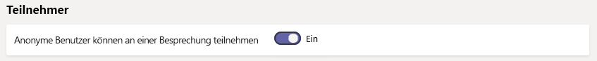
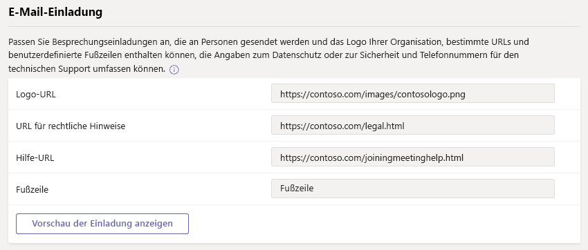
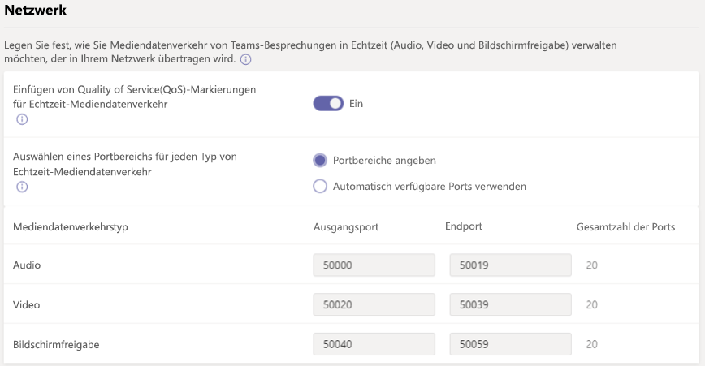

# Verwalten von Besprechungseinstellungen in Microsoft TeamsManage meeting settings in Microsoft Teams

Verwenden Sie als Administrator Teams Besprechungen Einstellungen Kontrolle, ob anonyme Benutzer teilnehmen an Besprechungen Teams, besprechungseinladungen anpassen, und wenn Sie Quality of Service (QoS) aktivieren möchten, legen Sie Portbereiche für den Datenverkehr in Echtzeit können.As an admin, you use Teams meetings settings to control whether anonymous users can join Teams meetings, customize meeting invitations, and if you want to enable Quality of Service (QoS), set port ranges for real-time traffic. Diese Einstellungen gelten für alle Besprechungen von Teams, Zeitplan für Benutzer in Ihrer Organisation.These settings apply to all Teams meetings that users schedule in your organization. Verwalten Sie diese Einstellungen von **Besprechungen** > **besprechungseinstellungen** in der Verwaltungskonsole von Microsoft-Teams.You manage these settings from **Meetings** > **Meeting settings** in the Microsoft Teams admin center.

## Zulassen, dass anonyme Benutzer an Besprechungen teilnehmenAllow anonymous users to join meetings

Mit anonyme Teilnahme kann jeder die Besprechung als anonymer Benutzer teilnehmen, indem Sie auf den Link in der Einladung.With anonymous join, anyone can join the meeting as an anonymous user by clicking the link in the meeting invitation.

 **mithilfe der Verwaltungskonsole von Microsoft-Teams** **Using the Microsoft Teams admin center**

1. Wechseln Sie im linken Navigationsbereich auf **Besprechungen** > **besprechungseinstellungen**.In the left navigation, go to **Meetings** > **Meeting settings**.
2. Aktivieren Sie unter **Teilnehmer** **anonyme Benutzer können an einer Besprechung teilnehmen**.Under **Participants**, turn on **Anonymous users can join a meeting**.

    ![Meeting-Einstellungen-participants.png] (media/meeting-settings-participants.png "Screenshot der Teilnehmer Einstellungen für Teams Besprechungen in der Verwaltungskonsole von Microsoft-Teams")

Wenn Sie nicht, dass anonyme Benutzern die Teilnahme von Benutzern in Ihrer Organisation geplant möchten, deaktivieren Sie diese Einstellung.If you don't want anonymous users to join meetings scheduled by users in your organization, turn off this setting.

## Anpassen von BesprechungseinladungenCustomize meeting invitations

Sie können Teams Besprechungsanfragen erfüllen der Anforderungen Ihrer Organisation anpassen.You can customize Teams meeting invitations to meet your organization's needs. Sie können Ihrer Organisation Logo und enthalten hilfreiche Informationen, wie Links zu Support-Website und Haftungsausschluss und eine nur-Text-Fußzeile.You can add your organization's logo and include helpful information, such as links to your support website and legal disclaimer, and a text-only footer.

### Tipps zum Erstellen eines Logos für BesprechungsanfragenTips for creating a logo for meeting invitations  

1. Erstellen Sie ein Bild, das nicht mehr als 188 Pixel breit und 30 Pixel hoch ist (es ist sehr klein).Create an image that's no more than 188 pixels wide by 30 pixels tall (it's quite small).
2. Speichern Sie das Bild wird im JPG-Format.Save the image in JPG format.
3. Speichern Sie das Bild in einen zentralen Speicherort, den alle Benutzer in Ihrer Organisation, wie etwa einer Netzwerkfreigabe zugreifen können.Store the image in a central location that everyone in your organization can access, such as a network share.

### Anpassen der besprechungseinladungenCustomize your meeting invitations

 **mithilfe der Verwaltungskonsole von Microsoft-Teams** **Using the Microsoft Teams admin center**

1. Wechseln Sie im linken Navigationsbereich auf **Besprechungen** > **besprechungseinstellungen**.In the left navigation, go to **Meetings** > **Meeting settings**.
2. Führen Sie unter **E-Mail-Einladung**folgende Schritte aus:Under **Email invitation**, do the following:

    ![Meeting-Einstellungen-invitation.png] (media/meeting-settings-invitation.png "Screenshot der Besprechung Einladung Einstellungen, die Sie für Teams Besprechungen anpassen können")

    - **Logo-URL** Geben Sie die URL ein, in dem Ihr Logo gespeichert ist.**Logo URL** Enter the URL where your logo is stored.
    - **Rechtliche URL** Wenn Ihre Organisation rechtliche-Website, die Benutzern verfügt So wechseln zur für alle Probleme werden sollen, geben Sie die URL hier.**Legal URL** If your organization has a legal website that you want people to go to for any legal concerns, enter the URL here.
    - **Hilfe-URL** Wenn Ihre Organisation eine Support-Website, die Benutzern verfügt zu wechseln, wenn sie Probleme ausgeführt werden soll, geben Sie die URL hier.**Help URL** If your organization has a support website that you want people to go to if they run into issues, enter the URL here.
    - **Fußzeile** Geben Sie Text ein, den Sie als Footer einschließen möchten.**Footer** Enter text that you want to include as a footer.
3. Warten Sie eine Stunde oder, damit die Änderungen weitergegeben.Wait an hour or so for the changes to propagate. Klicken Sie dann Planen einer Besprechung Teams finden in die Einladung zur Besprechung aussieht.Then schedule a Teams meeting to see what the meeting invitation looks like.  

## Legen Sie wie Real-Time Media-Datenverkehr für Teams Besprechungen behandelt werden sollenSet how you want to handle real-time media traffic for Teams meetings

Wenn Sie den Netzwerkverkehr zu priorisieren Quality of Service [(QoS)](qos-in-teams.md) verwenden, können Sie QoS-Markierung aktivieren, und Sie können Portbereiche für jede Art von Mediendatenverkehr festlegen.If you're using Quality of Service [(QoS)](qos-in-teams.md) to prioritize network traffic, you can enable QoS markers and you can set port ranges for each type of media traffic.

  **mithilfe der Verwaltungskonsole von Microsoft-Teams** **Using the Microsoft Teams admin center**

1. Wechseln Sie im linken Navigationsbereich auf **Besprechungen** > **besprechungseinstellungen**.In the left navigation, go to **Meetings** > **Meeting settings**.
2. Führen Sie unter **Netzwerk**folgende Schritte aus:Under **Network**, do the following:

    ![Meeting-Einstellungen-network.png] (media/meeting-settings-network.png "Screenshot der Netzwerkeinstellungen für Teams Besprechungen in der Verwaltungskonsole von Microsoft-Teams")

    - Damit DSCP Auswahlmöglichkeiten für QoS verwendet werden können, aktivieren Sie **Einfügen Quality of Service (QoS)-Marker für Mediendatenverkehr in Echtzeit**.To allow DSCP markings to be used for QoS, turn on **Insert Quality of Service (QoS) markers for real-time media traffic**. Sie müssen nur die Option Markierungen oder nicht verwenden; Benutzerdefinierte Markierungen kann nicht für jeden Datenverkehrstyp festgelegt werden.You only have the option of using markers or not; you can't set custom markers for each traffic type. Weitere auf DSCP-Marker finden Sie unter [Wählen Sie eine QoS-Implementierung-Methode](QoS-in-Teams.md#select-a-qos-implementation-method) .See [Select a QoS implementation method](QoS-in-Teams.md#select-a-qos-implementation-method) for more on DSCP markers.
    - Um anzugeben Portbereiche neben, **Wählen Sie einen Portbereich für jede Art von Mediendatenverkehr in Echtzeit**, wählen Sie **Portbereiche angeben**und geben Sie die Start- und Enddatum Ports für Audio, Video und Bildschirmfreigabe.To specify port ranges, next to **Select a port range for each type of real-time media traffic**, select  **Specify port ranges**, and then enter the starting and ending ports for audio, video, and screen sharing. Diese Option ist erforderlich, um QoS zu implementieren.Selecting this option is required to implement QoS.
    > [!IMPORTANT]
    > Wenn Sie wählen Sie **automatisch alle verfügbaren Ports verwenden**, verfügbaren Ports zwischen 1024 und 65535 verwendet werden.If you select **Automatically use any available ports**, available ports between 1024 and 65535 are used. Verwenden Sie diese Option nur, wenn keine QoS zu implementieren.Use this option only when not implementing QoS.
    >
    > Auswählen einer Portbereich an, der nicht breit genug ist, führt zu Verworfene Anrufe und schlechter Anrufqualität.Selecting a port range that is too narrow will lead to dropped calls and poor call quality. Die folgenden Empfehlungen sollte mindestens bare sein.The recommendations below should be a bare minimum.

 Wenn Sie nicht sicher sind, welche Port für die Verwendung in Ihrer Umgebung liegt, sind die folgenden Einstellungen einen guten Ausgangspunkt.If you are unsure what port ranges to use in your environment, the following settings are a good starting point. Lesen Sie weitere Informationen finden Sie [Implementieren Quality of Service (QoS) in Microsoft-Teams](QoS-in-Teams.md).To learn more, read [Implement Quality of Service (QoS) in Microsoft Teams](QoS-in-Teams.md). Dies sind die erforderlichen DSCP Auswahlmöglichkeiten und die vorgeschlagenen entsprechenden Medien port Bereiche von Teams und ExpressRoute verwendet werden.These are the required DSCP markings and the suggested corresponding media port ranges used by both Teams and ExpressRoute.

_Portbereiche und DSCP Kennzeichnungen__Port ranges and DSCP markings_

Media-DatenverkehrstypMedia traffic type| Client-Quellportbereich\*Client source port range \* |ProtokollProtocol|DSCP-WertDSCP value|DSCP-KlasseDSCP class|
|:---             |:---                         |:---    |:---      |:---      |
|AudioAudio            | 50.000 – 50,01950,000–50,019               |TCP/UDPTCP/UDP |4646        |Expedited Forwarding (EF)Expedited Forwarding (EF)|
|VideoVideo            | 50,020 – 50,03950,020–50,039               |TCP/UDPTCP/UDP |3434        |Assured Forwarding (AF41)Assured Forwarding (AF41)|
|Anwendung/BildschirmfreigabeApplication/Screen Sharing| 50,040 – 50,05950,040–50,059      |TCP/UDPTCP/UDP |1818        |Assured Forwarding (AF21)Assured Forwarding (AF21)|
| | | | |

\*Die Portbereiche, die Sie zuweisen können nicht überlappen und nebeneinander sein.\* The port ranges you assign cannot overlap and must be adjacent to each other.

Festlegen von Portbereichen für unterschiedliche Datenverkehrstypen ist nur ein Schritt bei der Behandlung von Real Time Media. Weitere Details finden Sie unter [Quality of Service (QoS) in Teams](qos-in-teams.md) .Setting port ranges for different traffic types is only one step in handling real time media; see [Quality of Service (QoS) in Teams](qos-in-teams.md) for much more detail. Wenn Sie aktivieren oder ändern, in der Verwaltungskonsole von Microsoft-Teams, müssen Sie die Änderungen an QoS vollständig in Teams implementieren zum [entsprechende Einstellungen für alle Benutzer Geräte anwenden](QoS-in-Teams-clients.md) und internen Netzwerkgeräte.If you enable or change settings in the Microsoft Teams admin center, you will need to [apply matching settings to all user devices](QoS-in-Teams-clients.md) and internal network devices to fully implement the changes to QoS in Teams.

Nachdem QoS verwendet wurde für eine Weile haben Sie Informationen zur Verwendung auf die Anforderung für jede der folgenden drei Arbeitslasten, und Sie können auswählen, welche Änderungen an Stellen auf Ihre Bedürfnisse Grundlage.After QoS has been in use for a while, you'll have usage information on the demand for each of these three workloads, and you can choose what changes to make based on your specific needs. [Rufen Sie Qualitätsdashboard](turning-on-and-using-call-quality-dashboard.md) wird mit dem hilfreich sein.[Call Quality Dashboard](turning-on-and-using-call-quality-dashboard.md) will be helpful with that.
