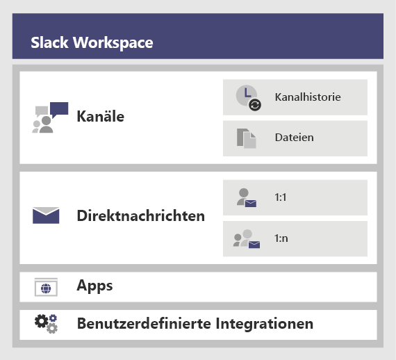
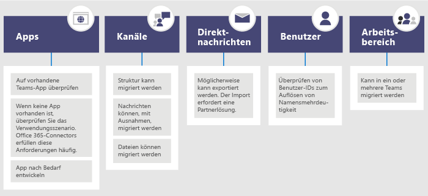

# <a name="migrate-from-slack-to-microsoft-teams"></a>Migrieren von Slack auf Microsoft Teams

Dieser Artikel führt Sie durch den Weg der Umstellung von Slack auf Microsoft Teams.

Bei der Planung der Umstellung Ihrer Organisation von Slack auf Teams ist es wichtig zu entscheiden, was Sie beibehalten möchten (sofern vorhanden). Wir beginnen mit einer Beschreibung, welche Arten von Daten migriert werden können, und führen Sie dann durch, wie Sie Ihre Bedürfnisse einschätzen, Ihre Umstellung planen und dann den Schritt machen können.

Das nachstehende Diagramm zeigt die Architektur von Slack auf hoher Ebene.



## <a name="plan-your-migration-from-slack"></a>Planen Sie Ihre Migration von Slack
### <a name="what-you-can-and-cant-migrate"></a>Was Sie migrieren können und was nicht
Ihr Slack-Serviceplan bestimmt, was Sie migrieren können und was nicht. Beispielsweise lassen einige Slack-Servicepläne nur das Exportieren von Verlauf und Dateien öffentlicher Kanäle zu, andere erfordern eine DocuSign-Anfrage, um private Kanäle und Direktnachrichten einzuschließen. 

Um den Servicegrad Ihres Slack-Arbeitsbereichs zu bestimmen, melden Sie sich bei Slack an und notieren Sie sich Ihren Plantyp auf der Seite **Über diesen Arbeitsbereich**.

Um mehr über die Exportmöglichkeiten von Slack zu erfahren, besuchen Sie die Slack-Website: https://get.slack.help/hc/articles/204897248-Guide-to-Slack-import-and-export-tools 

Das folgende Diagramm gibt Ihnen einen Überblick über die Slack-Migrationslandschaft, die wir in diesem Artikel behandeln werden. 



Folgende Begriffe sollten Sie nach Abschluss dieses Abschnitts kennen:
- Der Servicegrad Ihrer Slack-Arbeitsbereiche
- Was kann exportiert werden und was nicht
- Allgemeine Vorgehensweisen beim Exportieren

### <a name="assess-your-slack-workspaces"></a>Bewerten Sie Ihre Slack-Arbeitsbereiche
Bevor Sie den Migrationsplan Ihrer Organisation planen können, müssen Sie einige Informationen über Ihre Slack-Arbeitsbereiche zusammenstellen. Wenn Sie verstehen, wie Ihre Slack-Arbeitsbereiche genutzt werden, können Sie den Umfang Ihrer Migration bestimmen. Zum Beispiel, wie viele Arbeitsbereiche werden verschoben? Werden sie von einer bestimmten Abteilung, von vielen oder von einer ganzen Organisation verwendet?

Wenn Sie Mitglied der Slack-Arbeitsbereiche sind, die Sie migrieren möchten, können Sie die Nutzung selbst analysieren, indem Sie zu *\<your Slack workspace\>.slack.com/stats* gehen. Überprüfen Sie die Registerkarten „Kanäle“ und „Mitglieder“, um nach Nutzungsmustern zu suchen. Entscheiden Sie, welche Arbeitsbereiche Sie migrieren möchten (und welche Sie zurücklassen möchten). 

> [!NOTE]
> Wenn Sie keinen Zugriff auf die Seite „Statistiken“ haben, sind Sie kein Administrator oder Besitzer. 

### <a name="export-channels"></a>Exportieren von Kanälen

In Slack treten Benutzer einem Kanal bei, der Teil eines Slack-Arbeitsbereichs ist, während in Teams Benutzer einem Team beitreten, das eine Sammlung von Kanälen ist. Wir empfehlen, dass Sie die Slack-Analyse verwenden, um zu sehen, wie viel Aktivität in jedem Kanal stattfindet, damit Sie entscheiden können, welche Kanäle Sie verschieben möchten. Anhand der Ergebnisliste können Sie herausfinden, wie Sie Ihre Slack-Kanäle zu Teams in Teams gruppieren und wer Mitglied in jedem Team sein sollte.

Wenn Sie einen kostenpflichtigen Slack-Serviceplan haben (alles andere als kostenlos), können Sie die Analysefunktionen von Slack (\<your Slack workspace\>.slack.com/admin/stats#channels) verwenden, um zu sehen, wie aktiv ein Kanal ist, wann er zuletzt genutzt wurde und wie viele Personen Mitglieder sind. Dies kann Ihnen bei der Entscheidung helfen, ob Sie den Kanal migrieren möchten oder nicht. Standardmäßig können Inhalte öffentlicher Kanäle (Nachrichten und Dateien) exportiert werden. Abhängig von Ihrem Slack-Serviceplan und ob Sie private Kanäle und Direktnachrichten von Slack angefordert haben, können diese exportiert werden.

Um mehr über die Exportmöglichkeiten von Slack zu erfahren, besuchen Sie die Slack-Website: https://get.slack.help/hc/articles/204897248-Guide-to-Slack-import-and-export-tools 

> [!IMPORTANT]
> Überprüfen Sie die Datenschutz- und Complianceanforderungen Ihrer Organisation um Kanaldaten. Ihre Organisation hat möglicherweise Complianceanforderungen in Bezug auf die Handhabung, Speicherung und Verarbeitung dieser Daten sowie die Einhaltung des Lebenszyklus von Endbenutzer identifizierbaren Inhalten (EUII).

### <a name="export-direct-messages"></a>Exportieren von Direktnachrichten
Direktnachrichten sind die gleichen wie Chats in Teams, die Nicht-Kanalunterhaltungen sind, entweder 1:1 oder 1-zu-viele. Die Exportfähigkeit hängt von Ihrem Slack-Serviceplan ab und davon, ob Sie die Aufnahme von Direktnachrichten in Ihren Slack-Export angefordert haben. Teams unterstützt das Importieren von Direktnachrichten zurzeit nicht. Wenden Sie sich an einen Microsoft-Partner, um mehr über Lösungen von Drittanbietern zu erfahren, die Sie ausprobieren können, die Inhalte von Direktnachrichten in Teams integrieren.

Für das Exportieren von Direktnachrichten können Sie im Slack App Store Tools, wie z. B. Export, ausprobieren.

### <a name="apps-and-custom-integrations"></a>Apps und benutzerdefinierte Integrationen

Apps in Slack sind wie Apps in Teams. Sobald Sie eine Liste von Apps und deren Konfigurationen im Arbeitsbereich haben, können Sie im Team App Store nachsehen, ob sie für Teams* verfügbar sind. 

Besuchen Sie \<your Slack workspace\>.slack.com/apps/manage, um eine Liste der Apps und benutzerdefinierten Integrationen zu erhalten. Diese Seite zeigt Ihnen auch die Anzahl der Konfigurationen, in denen jede App verwendet wird. Benutzerdefinierte Integrationen unterscheiden sich in ihrer „Migrationsfähigkeit“. Wenn es sich um einen Webhook handelt, können Sie ihn normalerweise an einen Microsoft 365- oder Office 365-Connector senden, um den Workflow in Teams zu überführen. Bewerten Sie Bots und andere Apps von Fall zu Fall, um sie in Teams zu verschieben.

\* Wenn Ihr Administrator die Nutzung von Apps eingeschränkt hat, werden Sie möglicherweise nicht die vollständige Liste der verfügbaren Apps sehen.

### <a name="users"></a>Benutzer
Die Identitätsschemas, die Sie in Slack verwendet haben, werden möglicherweise nicht direkt zu Microsoft 365 oder Office 365 zugeordnet. So können beispielsweise die E-Mail-Adressen Ihrer Slack-Benutzer nicht zu den Geschäfts-, Schul oder Unikonten von Microsoft 365 oder Office 365 zugeordnet werden. Sie sollten eine Benutzer-ID-Zuordnung erstellen, bevor Sie mit der Planung des Rollouts Ihres Teams beginnen.

Wenn Sie einen kostenpflichtigen Slack-Serviceplan haben, besuchen Sie *\<your Slack workspace\>.slack.com/admin/stats#members*, um Mitgliederdaten wie E-Mail-Adresse und Kontotyp für jeden Benutzer (z. B. Einzel- oder Mehrkanalgast) zu erhalten.

Hier ist ein Skript, mit dem Sie E-Mail-Adressen aus einem Slack-Export mit Azure AD vergleichen können, um die Mehrdeutigkeit von Namen zu lösen. Es wird auch angezeigt, ob der Benutzer für Teams aktiviert ist. Wenn Sie Hilfe zu PowerShell benötigen, lesen Sie [Erste Schritte mit Azure PowerShell](/powershell/azure/get-started-azureps).

```azurepowershell
Connect-AzureAD
Function Get-TimeStamp {
    return "[{0:MM/dd/yy} {0:HH:mm:ss}]" -f (Get-Date)
}

class User {
    [ValidateNotNullOrEmpty()] $ID
    [ValidateNotNullOrEmpty()] $FullName
    [string] $Email
    [string] $UPN
    [ValidateNotNullOrEmpty()][bool] $ExistsAzureAD
    [ValidateNotNullOrEmpty()][bool] $TeamsEnabled
}

$output = New-Object -type System.Collections.ObjectModel.Collection["User"]

$users = Get-Content -Raw -Path .\slackHistory\users.json | ConvertFrom-Json

Write-Host -ForegroundColor Green "$(Get-Timestamp) User Count: " $users.Count

$i=1
Write-Host "$(Get-Timestamp) Attempting direct email match.. `n"
foreach ($slackUser in $users) {
    $user = New-Object User
    $user.id = $slackUser.id
    $user.FullName = $slackUser.name
    try {
        if ($null -ne $slackUser.profile.email) {
            $user.email = $slackUser.profile.email
            $emailSplit = $slackUser.profile.email.Split('@')
            $mailNickName = $emailSplit[0]
            $result = Get-AzureADUser -Filter "MailNickName eq '$($mailNickName)' or UserPrincipalName eq '$($slackUser.profile.email)' or proxyAddresses/any(c:c eq 'smtp:$($slackUser.profile.email)')"
            if ($null -ne $result) {
                $user.ExistsAzureAD = $true
                $user.UPN = $result.UserPrincipalName
                $assignedPlans = $result.assignedPlans
                foreach ($plan in $assignedPlans) {
                    if ($plan.ServicePlanId -eq "57ff2da0-773e-42df-b2af-ffb7a2317929") {
                        if ($plan.CapabilityStatus -eq "Enabled") {
                            $user.TeamsEnabled = $true
                        }
                        else {
                            $user.TeamsEnabled = $false
                        }
                    }
                }
                Write-Host -ForegroundColor Green "$(Get-Timestamp) Current User $($i) - AzureAD object found:" $result.MailNickName
                Write-Host -ForegroundColor Green "$(Get-Timestamp) Current User $($i) - Teams Enabled:" $user.TeamsEnabled
            }
            else {
                $user.ExistsAzureAD = $false
                Write-Host -ForegroundColor Yellow "$(Get-Timestamp) Current User $($i) - AzureAD object not found: " $slackUser.profile.email
            }
        }
        $i++
    }   
    catch
    {
        $user.ExistsAzureAD = $false
        Write-Host -ForegroundColor Yellow "$(Get-Timestamp) Current User $($i) - AzureAD object not found: $($i)" $user.profile.email
        $i++
    }
    $output.Add($user)
}

$output | Export-Csv -Path .\SlackToAzureADIdentityMapping.csv -NoTypeInformation
Write-Host "`n $(Get-Timestamp) Generated SlackToAzureADIdentityMapping.csv. Exiting..."
$output | Export-Csv -Path .\SlackToAzureADIdentityMapping.csv -NoTypeInformation
Write-Host "`n $(Get-Timestamp) Generated SlackToAzureADIdentityMapping.csv. Exiting..."
```

Folgendes sollten Sie nach Abschluss dieses Abschnitts haben:
- Eine Liste der Kanäle pro Arbeitsbereich mit Nutzungsstatistiken.
- Eine Liste der Slack-Apps mit Konfigurationen pro Kanal.
- Bestimmt, welche Art von Slack-Nachrichtenverlauf Sie exportieren möchten (sofern vorhanden).
- Eine Liste von Benutzern, deren Slack-Konten den Arbeits- oder Schulkonten von Microsoft zugeordnet sind und welche Teams-Lizenz sie haben.

## <a name="plan-your-teams-deployment"></a>Planen Ihrer Teams-Bereitstellung
Sie haben das, was Sie benötigen, aus Slack exportiert (und alles zurückgelassen, was Sie nicht benötigen). Jetzt ist es an der Zeit das Rollout von Teams zu planen und Ihre Slack-Daten zu importieren. Dies ist eine großartige Gelegenheit, um zu beurteilen, was für das Team auf der Grundlage der Nutzung gut funktioniert hat, und diese Elemente in Ihrer Teams-Bereitstellungsplanung aufzunehmen. Am Ende dieses Abschnitts finden Sie eine Blaupause für die Benutzer, Kanäle und Apps Ihres Teams. 

Das folgende Diagramm gibt Ihnen einen Überblick über die Elemente, die Sie in Ihrer Teams-Bereitstellung ansprechen werden.

:::image type="content" source="media/migrate-slack-to-teams-image3.png" alt-text="Allgemeine Übersicht über die Planung der Bereitstellung von Teams aus Slack.":::

### <a name="team-and-channel-structure"></a>Team- und Kanalstruktur

Ein Slack-Arbeitsbereich kann ein einzelnes Team, mehrere Teams oder eine ganze Organisation sein. Es ist wichtig, den Umfang der Arbeitsbereiche zu kennen, wenn Sie die Struktur bestimmen. Die engste Beziehung zu einem Teams-Team in Slack ist der Arbeitsbereich, der eine Sammlung von Kanälen enthält. Das folgende Diagramm zeigt 3 verschiedene Slack-to-Teams-Zuordnungen und eine Anleitung zur Auswahl der richtigen für jeden Arbeitsbereich.


|Slack-to-Teams-Zuordnung | Beschreibung |
|---------|---------|
|1 Slack-Arbeitsbereich: arrow_right: 1 Team   | Für kleinere Slack-Arbeitsbereiche, die weniger als 200 Kanäle benötigen<br>Binden Sie einen Puffer für Wachstum und private Kanalplanung ein  |
|1 Slack-Arbeitsbereich: arrow_right: mehrere Teams     | Verwenden Sie die Analysedaten Ihres Slack-Arbeitsbereichs, um logische Kanalgruppierungen zu erstellen, welche die Grundlage für Ihre Teams bilden.        |
|Mehr als 2 Slack-Arbeitsbereiche: arrow_right: mehrere Teams     | Verwenden Sie die Analysedaten Ihres Slack-Arbeitsbereichs, um logische Team- und Kanalgruppierungen zu erstellen, welche die Grundlage für Ihre Teams bilden.        |

Lösungen von Drittanbietern verfügen über Nutzungsstatistiken, die Ihnen helfen zu beurteilen, wie aktiv der Kanal ist und wie viele Beiträge es gibt. Typischerweise sind häufig genutzte Kanäle die geeigneten Kandidaten, um sie in Ihre Teamplanung einzubeziehen.

> [!TIP]
> Behalten Sie nur das, was in Ihrem Ansatz erforderlich ist, um zu bestimmen, welche Kanäle in Teams wiederhergestellt werden sollen. Weitere Informationen finden Sie unter [Übersicht über Teams und Kanäle](teams-channels-overview.md). 

#### <a name="team-planning"></a>Teamplanung
Verwenden Sie das Kanalinventar, das Sie im Abschnitt „Planung“ oben zusammengestellt haben, und arbeiten Sie mit Ihren Slack-Besitzern und Administratoren zusammen, um herauszufinden, welche Kanäle zu Teams werden sollen und welche zu Kanälen in einem Team werden sollen. Verwenden Sie entweder Excel oder Power BI, um diese Analyse zu unterstützen. Beide können zusätzliche Erkenntnisse liefern, um diese Diskussionen zu fördern, auf welchen Kanälen sie beibehalten werden sollen.

> [!TIP]
> Teams hat derzeit ein 200-Kanal-Limit pro Team. Wenn Ihre Liste der Kanäle sich diesem Limit nähert, sollten Sie einen Weg finden, sie in zwei getrennte Teams aufzuteilen.

### <a name="channel-history"></a>Kanalhistorie

Es gibt sowohl kostenlose Lösungen auf GitHub als auch kostenpflichtige Lösungen, die Sie verwenden können, je nach den Anforderungen Ihrer Organisation, um die Kanalhistorie der öffentlichen und privaten Kanäle zu erhalten. Außerdem könnte dies in Teams geskriptet werden.

Nachdem Sie Ihre neue Team- und Kanalstruktur in Teams eingerichtet haben, können Sie die exportierten Dateien in die entsprechenden Dokumentenbibliotheken in Ihren Teams-Kanälen kopieren.

Um das Importieren Ihrer Inhalte zu automatisieren, gibt es mehrere Ansätze, die Sie in Betracht ziehen können. Es gibt kostenlose Lösungen auf GitHub ([ChannelSurf](https://github.com/tamhinsf/ChannelSurf) oder [Slack Export Viewer](https://github.com/hfaran/slack-export-viewer)) und Partnerlösungen. Wählen Sie eine Lösung, die auf den Anforderungen Ihrer Organisation basiert. 

### <a name="channel-files"></a>Kanaldateien

Die meisten Lösungen exportieren Dateien. Sie werden jedoch in der Regel als Links in der Kanalhistorie bereitgestellt, die einen API-Schlüssel zum programmgesteuerten Abrufen erfordern.

Für Dateien, die in Slack gespeichert sind, können Sie, nachdem Sie Ihre Teams und Kanäle in Teams eingerichtet haben, diese programmgesteuert aus Slack in den Zielkanal von Teams kopieren.

Das folgende Skript ruft Dateien aus Slack ab. Es durchsucht den angegebenen Slack-Export auf Ihrem Computer, erstellt einen Ordner in jedem Zielkanal und lädt alle Dateien an diesen Ort herunter. Es gibt Lösungen von Drittanbietern, die Daten extrahieren können. Wenn Sie Hilfe zu PowerShell benötigen, lesen Sie [Erste Schritte mit Azure PowerShell](/powershell/azure/get-started-azureps).


```azurepowershell
$ExportPath = ".\slackHistory"
$ExportContents = Get-ChildItem -path $ExportPath -Recurse
Function Get-TimeStamp {
    return "[{0:MM/dd/yy} {0:HH:mm:ss}]" -f (Get-Date)
}

class File {
    [string] $Name
    [string] $Title
    [string] $Channel
    [string] $DownloadURL
    [string] $MimeType
    [double] $Size
    [string] $ParentPath
    [string] $Time
}

$channelList = Get-Content -Raw -Path .\slackHistory\channels.json | ConvertFrom-Json
$Files = New-Object -TypeName System.Collections.ObjectModel.Collection["File"]

Write-Host -ForegroundColor Green "$(Get-TimeStamp) Starting Step 1 (processing channel export for files) of 2. Total Channel Count: $($channelList.Count)"
#Iterate through each Channel listed in the Archive
foreach ($channel in $channelList) {
    #Iterate through Channel folders from the Export
    foreach ($folder in $ExportContents)
    {
        #If Channel Name matches..
        if ($channel.name -eq $folder){
            $channelJsons = Get-ChildItem -Path $folder.FullName -File
            Write-Host -ForegroundColor White "$(Get-TimeStamp) Info: Starting to process $($channelJsons.Count) days of content for #$($channel.name)."
            #Start processing the daily JSON for files
            foreach ($json in $channelJsons){
                $currentJson = Get-Content -Raw -Path $json.FullName | ConvertFrom-Json
                #Write-Host -ForegroundColor Yellow "$(Get-TimeStamp) Info: Processing $($json.Name) in #$($channel.name).."
                #Iterate through every action
                foreach ($entry in $currentJson){
                    #If the action contained file(s)..
                    if($null -ne $entry.files){
                        #Iterate through each file and add it to the List of Files to download
                        foreach ($item in $entry.Files) {
                        $file = New-Object -TypeName File
                            if ($null -ne $item.url_private_download){
                                $file.Name = $item.name
                                $file.Title = $item.Title
                                $file.Channel = $channel.name
                                $file.DownloadURL = $item.url_private_download
                                $file.MimeType = $item.mimetype
                                $file.Size = $item.size
                                $file.ParentPath = $folder.FullName
                                $file.Time = $item.created
                                $files.Add($file)
                            }
                        }
                    }
                }
            }
        }
    }
}
Write-Host -ForegroundColor Green "$(Get-TimeStamp) Step 1 of 2 complete. `n"

Write-Host -ForegroundColor Green "$(Get-TimeStamp) Starting step 2 (creating folders and downloading files) of 2."
#Determine which Files folders need to be created
$FoldersToMake = New-Object System.Collections.ObjectModel.Collection["string"]
foreach ($file in $files){
    if ($FoldersToMake -notcontains $file.Channel){
        $FoldersToMake.Add($file.Channel)
    }
}

#Create Folders
foreach ($folder in $FoldersToMake){
    #$fullFolderPath = $file.ParentPath + "\Files"
    $fullFolderPath = $ExportPath +"\$($folder)"
    $fullFilesPath = $ExportPath +"\$($folder)\Files"
    if (-not (Test-Path $fullFilesPath)){
        New-Item -Path $fullFolderPath  -Name "Files" -ItemType "directory"
    }
}

#Downloading Files
foreach ($file in $files)
{
    Write-Host -ForegroundColor Yellow "$(Get-TimeStamp) Downloading $($file.Name)."
    $fullFilePath = $file.ParentPath + "\Files\" + $file.Name
        if (-not (Test-Path $fullFilePath)){
            try{
                $request = (New-Object System.Net.WebClient).DownloadFile($file.DownloadURL, $fullFilePath)
            }
            catch [System.Net.WebException]{
                Write-Host -ForegroundColor Red "$(Get-TimeStamp) Error: Unable to download $($file.Name) to $($fullFilePath)"
            }   
        }
        else {
            try{
                $extensionPosition = $file.name.LastIndexOf('.')
                $splitFileName = $file.name.Substring(0,$extensionPosition)
                $splitFileExtention = $file.name.Substring($extensionPosition)
                $newFileName = $splitFileName + $file.Time + $splitFileExtention
                $fullFilePath = $file.ParentPath + "\Files\" + $newFileName
                $request = (New-Object System.Net.WebClient).DownloadFile($file.DownloadURL, $fullFilePath)
            }
            catch [System.Net.WebException]{
                Write-Host -ForegroundColor Red "$(Get-TimeStamp) Error: Unable to download $($file.Name) to $($fullFilePath)"
            }   
        }
}
Write-Host -ForegroundColor Green "$(Get-TimeStamp) Step 2 of 2 complete. `n"
Write-Host -ForegroundColor Green "$(Get-TimeStamp) Exiting.."
```


### <a name="apps-and-custom-integrations"></a>Apps und benutzerdefinierte Integrationen
Überprüfen Sie Ihre Liste der Slack-Apps und benutzerdefinierten Integrationen (mit Konfigurationen) und entscheiden Sie, welche Sie in Teams verschieben möchten. Schauen Sie auf den Teams Marketplace, um zu sehen, ob eine App verfügbar ist. Ist das nicht der Fall, gibt es wahrscheinlich Alternativen. 

Um herauszufinden, welche Apps zu Teams hinzugefügt werden sollen, ist es wichtig zu verstehen, wie die App verwendet wird. Wenn Sie die Frage stellen: „Welche Funktionalität bietet die App für diesen Kanal?“, erfahren Sie mehr über das Ergebnis, das die App liefert. 

In vielen Fällen empfangen Apps in erster Linie ereignisgesteuerte Daten von einem externen Dienst (z. B. Überwachungssystem) und schieben eine Nachricht in den Slack. Sie können das gleiche Ergebnis erzielen, indem Sie einen Microsoft 365-Connector verwenden, der Nachrichten basierend auf Ereignissen in Teams verschieben kann.

Nachfolgend finden Sie Beispiele für Slack-Lösungen, bei denen in Teams ein Microsoft 365-Connector zur Integration verwendet wurde.
- Ansible
  - Benachrichtigungen können über [Ansible-Webhook](https://docs.ansible.com/ansible-tower/latest/html/userguide/notifications.html#webhook) an Teams gesendet werden
- New Relic
  - Sehen Sie sich diese Benutzerlösung an, um [New Relic-Benachrichtigungen an Teams zu senden](https://discuss.newrelic.com/t/new-relic-alerts-not-working-with-microsoft-teams/48609/3)
- Nagios
  - Benachrichtigungen können heute über Connectors integriert werden. https://github.com/isaac-galvan/nagios-teams-notify
- ZenDesk
  - Die App ist im Teams Store vorhanden
- Jenkins
  - Benachrichtigungen können über [Office 365-Connector von Jenkins](https://plugins.jenkins.io/Office-365-Connector) an Teams gesendet werden


### <a name="user-readiness-and-adoption-plan"></a>Benutzerbereitschaft und Übernahmeplan
Der Grundstein für eine erfolgreiche Softwarebereitstellung hängt davon ab, wie gut die Benutzer auf den Wechsel vorbereitet sind. Benutzer in Ihrer Organisation, die Slack verwenden, werden die Konzepte des Teams leicht verstehen, aber es ist immer noch eine Schulung erforderlich, um ihnen einen reibungslosen Übergang zu ermöglichen. Um eine umfassende Auswahl an Ressourcen für die Teams-Übernahme zu erhalten, besuchen Sie bitte den [Teams-Übernahmehub](adopt-microsoft-teams-landing-page.md).

Beispielsweise verfügen beide Produkte über Kanäle, aber sie werden in jedem Produkt unterschiedlich verwendet. Beispielsweise wird oft ein Kanal in Slack wie ein Chat in Teams für kurzfristige, transaktionale Unterhaltungen verwendet. Weitere bemerkenswerte Unterschiede gibt es bei Thread-Unterhaltung und Nicht-Thread-Unterhaltung sowie bei der Einstellung von Benachrichtigungen.

Schauen Sie sich unsere umfangreiche Bibliothek von [Teams-Videoschulung für Endbenutzer](https://support.office.com/article/microsoft-teams-video-training-4f108e54-240b-4351-8084-b1089f0d21d7) an. 

## <a name="move-to-teams"></a>Umstieg auf Teams 
Nachdem Ihr Übergangsplan definiert ist, können Sie mit der Erstellung Ihrer Teams und Kanäle in Teams beginnen. 

Sobald Sie Ihre Teams und Kanäle erstellt haben, fangen Sie an, Dateien aus Slack-Kanälen in Teams zu kopieren und Ihre Apps zu konfigurieren. Wenn Sie eine Lösung zum Speichern der Historie verwenden, kann diese jetzt auch konfiguriert werden. Dann können Sie mit der Lizenzierung von Benutzern beginnen (wenn sie noch nicht lizenziert sind) und sie zu den entsprechenden Teams hinzufügen. Um den Bedarf an zusätzlichen Exporten und Dateikopien zu reduzieren, sollten Sie den Slack-Zugriff zu einem vereinbarten Datum entfernen, das mit dem Hinzufügen jedes Benutzers zum Team übereinstimmt. Dadurch entfällt das erneute Exportieren und Importieren von Deltaänderungen an Dateien und Historie.

Befolgen Sie die Schritte in der folgenden Abbildung, um Teams in Ihrer Organisation einzuführen. Weitere Informationen finden Sie unter [Rollout von Teams](./deploy-overview.md).


:::image type="content" source="media/migrate-slack-to-teams-image4.png" alt-text="Das Diagramm listet die Schritte des Wechsels von Slack zu Teams auf.":::