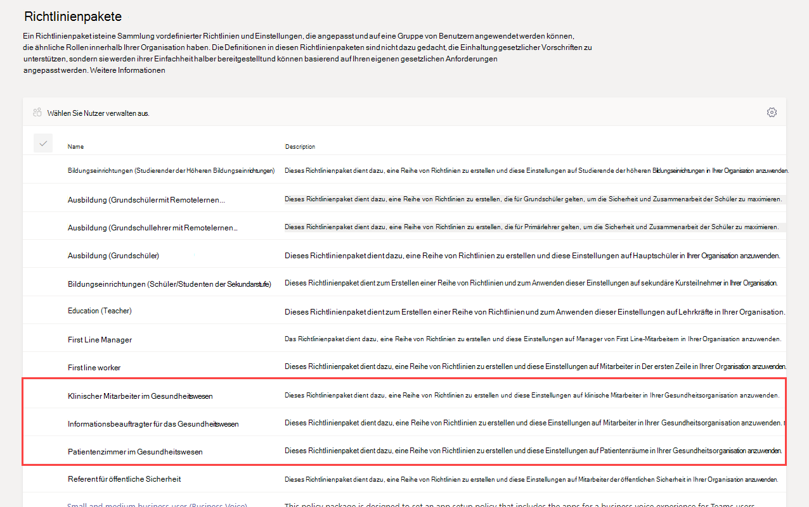
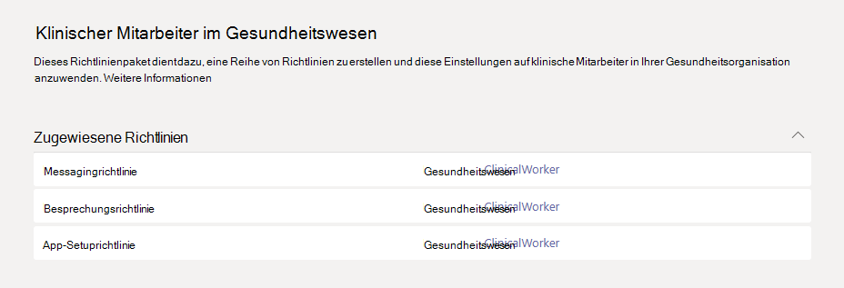
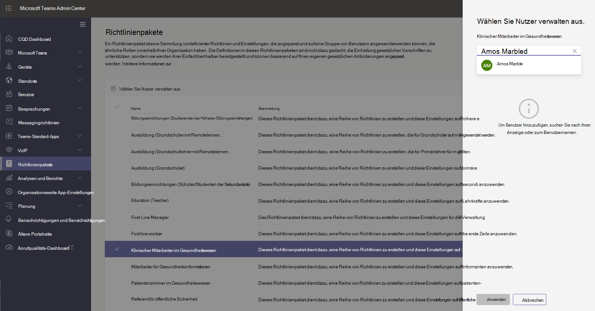

# Richtlinienpakete für Teams im Gesundheitswesen

## Übersicht

Ein [Richtlinienpaket](manage-policy-packages.md) in Microsoft Teams ist eine Sammlung vordefinierter Richtlinien und Richtlinieneinstellungen, die Sie Benutzern zuweisen können, die ähnliche Rollen in Ihrer Organisation haben. Richtlinienpakete vereinfachen und rationalisieren Richtlinien und lassen Sie diese konsistent verwalten. Sie können die Einstellungen der Richtlinien im Paket an die Anforderungen Ihrer Benutzer anpassen. Wenn Sie die Einstellungen von Richtlinien in einem Richtlinienpaket ändern, erhalten alle Benutzer, denen dieses Paket zugewiesen ist, die aktualisierten Einstellungen. Sie können Richtlinienpakete über das Microsoft Teams Admin Center oder PowerShell verwalten.

> [!VIDEO https://www.microsoft.com/videoplayer/embed/RE4Ht2o]

In Richtlinienpaketen werden je nach Paket Richtlinien für Folgendes vor definiert:

- Messaging
- Besprechungen
- Anrufe
- Einrichten von Apps
- Liveereignisse

Teams enthält derzeit die folgenden Richtlinienpakete für das Gesundheitswesen.

|Paketname im Microsoft Teams Admin Center|Am besten geeignet für|Beschreibung |
|---------|---------|---------|
|Klinischer Mitarbeiter im Gesundheitswesen  |Klinische Mitarbeiter in Ihrem Gesundheitswesen  |Erstellt eine Reihe von Richtlinien und Richtlinieneinstellungen, die klinischen Mitarbeitern, z. B. registrierten Krankenschwestern, Krankenschwestern, Ärzten und Sozialarbeitern, vollständigen Zugriff auf Chats, Anrufe, Schichtverwaltung und Besprechungen geben. |
|Information Worker im Gesundheitswesen  |Information Workers in Your Healthcare Organization |Erstellt eine Reihe von Richtlinien und Richtlinieneinstellungen, die Information Workers wie IT-Personal, Mitarbeiter, Mitarbeiter der Finanzabteilung und Compliance Officers, vollständigen Zugriff auf Chats, Anrufe und Besprechungen bieten.|
|Patientenzimmer im Gesundheitswesen  |Geräte des Patientenzimmers|Erstellt eine Reihe von Richtlinien und Richtlinieneinstellungen, die für Patientenräume in Ihrer Gesundheitsorganisation gelten.|

Jede einzelne Richtlinie wird mit dem Namen des Richtlinienpakets bezeichnet, sodass Sie die Mit einem Richtlinienpaket verknüpften Richtlinien leicht erkennen können. Wenn Sie beispielsweise das Richtlinienpaket für klinische Mitarbeiter im Gesundheitswesen an Klinikangestellte in Ihrer Organisation zuweisen, wird für jede Richtlinie im Paket eine Richtlinie mit dem Namen Healthcare_ClinicalWorker Richtlinie erstellt.

## Erste Schritte mit Richtlinienpaketen

Um Ihre ersten Schritte mit Richtlinienpaketen für das Gesundheitswesen zu unternehmen, wählen Sie im Microsoft Admin Center Onboarding Hub "Gesundheitswesen" und dann "Richtlinieneinstellungen nach **Rolle zuweisen" aus.** Wenn Sie bereit für die ersten Schritte sind, entscheiden Sie, welchen Richtlinienpaketen Sie Einzelpersonen in Ihrer Organisation zuweisen möchten.

Wählen **Sie "Richtliniendetails anzeigen"** aus, um weitere Informationen zu bestimmten Richtlinien in einem Paket und den entsprechenden Einstellungen zu erhalten. Diese [können nach einer Zuweisung](manage-policy-packages.md#customize-policies-in-a-policy-package) im Teams Admin Center angepasst werden.

Wählen Sie ein oder mehrere Zuzuordnende Pakete aus, und klicken Sie dann auf **"Weiter".** Sie können nach Personen suchen und sie dem Richtlinienpaket hinzufügen, die für ihre Rolle am besten geeignet sind. Einer Person kann nicht mehr als einem Richtlinienpaket gleichzeitig zugewiesen werden.

Nachdem Sie dem richtigen Richtlinienpaket Personen hinzugefügt haben, wird Ihre Auswahl mit **"Fertig** stellen" abgeschlossen. Sie können Richtlinienpakete weiterhin im Microsoft Teams Admin Center anpassen und verwalten.

## Verwalten von Richtlinienpaketen

### Anzeigen

Sehen Sie sich die Einstellungen der einzelnen Richtlinien in einem Richtlinienpaket an, bevor Sie ein Paket zuweisen. Wechseln Sie in der linken Navigationsleiste des Microsoft Teams Admin Centers zu "Richtlinienpakete", wählen Sie den Paketnamen und dann den Richtliniennamen aus.

Überprüfen Sie, ob die vordefinierten Werte für Ihre Organisation geeignet sind, oder ob Sie sie mehr oder weniger restriktiv einstellen müssen, damit sie den Anforderungen Ihrer Organisation entsprechen.

### Anpassung

Passen Sie die Einstellungen von Richtlinien im Richtlinienpaket ggf. an die Anforderungen Ihrer Organisation an. Alle Änderungen, die Sie an den Richtlinieneinstellungen vornehmen, werden automatisch auf Benutzer angewendet, denen das Paket zugewiesen wird. Um die Einstellungen einer Richtlinie in einem Richtlinienpaket zu bearbeiten, wechseln Sie in der linken Navigationsleiste des Microsoft Teams Admin Centers zu "Richtlinienpakete", wählen Sie das Richtlinienpaket aus, wählen Sie den Namen der Richtlinie aus, die Sie bearbeiten möchten, und wählen Sie dann "Bearbeiten" **aus.**

Sie können die Einstellungen für Richtlinien in einem Paket auch ändern, nachdem Sie das Richtlinienpaket zugewiesen haben. Weitere Informationen hierzu finden Sie unter [Anpassen von Richtlinien in einem Richtlinienpaket](manage-policy-packages.md#customize-policies-in-a-policy-package).

### Zuweisen

Weisen Sie das Richtlinienpaket Benutzern zu. Wenn einem Benutzer eine Richtlinie zugewiesen wurde und Sie ihm dann später eine andere Richtlinie zuweisen, hat die neuere Vorrang.

#### Ein Richtlinienpaket einem oder mehreren Benutzern zuweisen

Um einem oder mehreren Benutzern ein Richtlinienpaket zuzuweisen, wechseln Sie im linken Navigationsbereich des Microsoft Teams Admin Center zu **Richtlinienpakete**, und wählen Sie dann **Benutzer verwalten** aus.  

Weitere Informationen hierzu finden Sie unter [Zuweisen eines Richtlinienpakets](manage-policy-packages.md#assign-a-policy-package).

Wenn einem Benutzer eine Richtlinie zugewiesen wurde und Sie ihm dann später eine andere Richtlinie zuweisen, hat die neuere Vorrang.

#### Ein Richtlinienpaket einer Gruppe zuweisen

**Dieses Feature ist derzeit lediglich als private Vorschau verfügbar**

Die Gruppenzuweisung von Richtlinienpaketen ermöglicht es Ihnen, mehrere Richtlinien einer Gruppe von Benutzern wie z. B. einer Sicherheitsgruppe oder einer Verteilerliste zuzuweisen. Die Richtlinienzuweisung wird anhand von Prioritätsregeln an die Mitglieder der Gruppe weitergegeben. Wenn Mitglieder einer Gruppe hinzugefügt oder daraus entfernt werden, werden ihre geerbten Richtlinienzuweisungen entsprechend aktualisiert. Diese Methode wird für Gruppen mit bis zu 50.000 Benutzern empfohlen, sie eignet sich aber auch für größere Gruppen.

Weitere Informationen hierzu finden Sie unter [Ein Richtlinienpaket einer Gruppe zuweisen](assign-policies.md#assign-a-policy-package-to-a-group).

#### Ein Richtlinienpaket einer großen Anzahl von Benutzern (Batch) zuweisen

Wenn Sie ein Richtlinienpaket einer großen Anzahl von Benutzern gleichzeitig zuweisen möchten, verwenden Sie hierfür die Richtlinienpaket-Batch-Zuweisung. Verwenden Sie das Cmdlet [New-CsBatchPolicyPackageAssignmentOperation](https://docs.microsoft.com/powershell/module/teams/new-csbatchpolicypackageassignmentoperation), um einen Benutzer-Batch und das Richtlinienpaket zu senden, das Sie zuweisen möchten. Die Zuweisungen werden als Hintergrundvorgänge verarbeitet, und für jeden Batch wird eine Vorgangs-ID generiert.

Ein Batch kann bis zu 5.000 Benutzer umfassen. Sie können Benutzer durch Angabe ihrer Objekt-ID, des UPN, der SIP-Adresse oder der E-Mail-Adresse hinzufügen. Weitere Informationen hierzu finden Sie unter [Ein Richtlinienpaket einem Batch von Benutzern zuweisen](assign-policies.md#assign-a-policy-package-to-a-batch-of-users).

## Verwandte Themen

[Verwalten von Richtlinienpaketen in Teams](manage-policy-packages.md)

[Benutzern in Microsoft Teams Richtlinien zuweisen](assign-policies.md)
