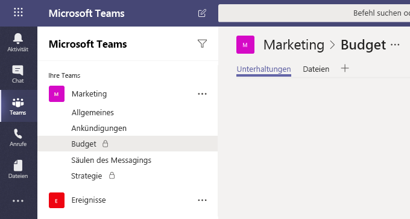
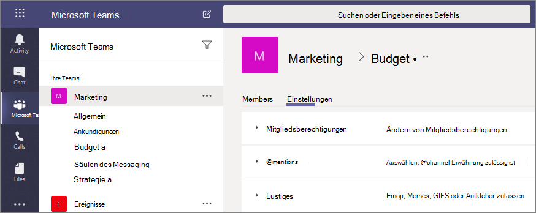

# Private Kanäle in Microsoft Teams

Private Kanäle in Microsoft Teams schaffen fokussierte Räume für die Zusammenarbeit innerhalb Ihrer Teams. Nur die Benutzer im Team, die Besitzer oder Mitglieder des privaten Kanals sind, können auf den Kanal zugreifen. Jede Person, auch Gäste, kann einem privaten Kanal als Mitglied hinzugefügt werden, solange sie bereits Mitglied des Teams ist.

Sie können einen privaten Kanal verwenden, wenn Sie die Zusammenarbeit auf diejenigen beschränken möchten, die das entsprechende Wissen benötigen, oder wenn Sie die Kommunikation zwischen einer Gruppe von Personen, die einem bestimmten Projekt zugeordnet sind, erleichtern möchten, ohne ein zusätzliches Team erstellen zu müssen, das verwaltet werden muss.

Ein privater Kanal ist zum Beispiel in diesen Szenarien nützlich:

- Eine Gruppe von Personen in einem Team möchte einen fokussierten Raum für die Zusammenarbeit nutzen, ohne ein separates Team erstellen zu müssen.
- Eine Untergruppe von Personen in einem Team möchte einen privaten Kanal nutzen, um vertrauliche Informationen, wie z. B. Budgets, Ressourcen, strategische Positionierung usw. zu besprechen.

Ein Schlüsselsymbol weist auf einen privaten Kanal hin. Nur Mitglieder privater Kanäle können die privaten Kanäle, zu denen sie hinzugefügt wurden, anzeigen und an ihnen teilnehmen.

Wenn ein privater Kanal erstellt wird, ist er mit dem übergeordneten Team verbunden und kann nicht in ein anderes Team verschoben werden. Außerdem können private Kanäle nicht in Standardkanäle umgewandelt werden und umgekehrt.

## Erstellung privater Kanäle

Standardmäßig kann jeder Teambesitzer oder jedes Teammitglied einen privaten Kanal erstellen. Gäste können keinen privaten Kanal erstellen. Die Möglichkeit zum Erstellen von privaten Kanälen kann auf Teamebene und auf Organisationsebene verwaltet werden. Verwenden Sie [Richtlinien](teams-policies.md), um zu steuern, welche Benutzer in Ihrer Organisation private Kanäle erstellen dürfen. Sobald Sie die Richtlinien festgelegt haben, können Teambesitzer die Möglichkeit für Mitglieder, private Kanäle zu erstellen, auf der Registerkarte **Einstellungen** für ein Team deaktivieren oder aktivieren.

Die Person, die einen privaten Kanal erstellt, ist der Besitzer des privaten Kanals, und nur der Besitzer des privaten Kanals kann Personen direkt zum Kanal hinzufügen oder daraus entfernen. Der Besitzer eines privaten Kanals kann ein beliebiges Teammitglied zu diesem privaten Kanal hinzufügen, einschließlich Gäste. Mitglieder eines privaten Kanals verfügen über einen sicheren Bereich für Unterhaltungen, und wenn neue Mitglieder hinzugefügt werden, können diese alle Unterhaltungen (auch alte Unterhaltungen) in diesem privaten Kanal sehen.

Teambesitzer können die Namen aller privaten Kanäle in ihrem Team sehen und jeden privaten Kanal im Team löschen. (Ein gelöschter privater Kanal kann innerhalb von 30 Tagen nach dem Löschen wiederhergestellt werden). Teambesitzer können die Dateien in einem privaten Kanal oder die Unterhaltungen und die Mitgliederliste eines privaten Kanals nicht sehen, sofern sie nicht Mitglieder dieses privaten Kanals sind.

Teammitglieder können nur private Kanäle sehen, denen sie hinzugefügt wurden.

## Hinzufügen und Entfernen von Besitzern und Mitgliedern

Der Besitzer eines privaten Kanals kann nicht über den Teams-Client entfernt werden, wenn er der letzte Besitzer eines oder mehrerer privater Kanäle ist.

Wenn ein Besitzer eines privaten Kanals Ihre Organisation verlässt oder aus der Microsoft 365-Gruppe entfernt wird, die dem Team zugeordnet ist, wird ein Mitglied des privaten Kanals automatisch zum Besitzer des privaten Kanals heraufgestuft.

Verlässt ein Teammitglied ein Team, oder wird es daraus entfernt, wird dieser Benutzer auch aus allen privaten Kanälen des Teams gelöscht. Wenn der Benutzer wieder zum Team hinzugefügt wird, muss er wieder zu den privaten Kanälen im Team hinzugefügt werden.

## Einstellungen des Kanalbesitzers

Jeder private Kanal verfügt über eigene Einstellungen, die der Kanalbesitzer verwalten kann, beispielsweise zum Hinzufügen und Entfernen von Mitgliedern, zum Hinzufügen von Registerkarten sowie für @Erwähnungen für den gesamten Kanal. Diese Einstellungen sind unabhängig von den Einstellungen des übergeordneten Teams. Wenn ein privater Kanal erstellt wird, erbt er zunächst die Einstellungen des übergeordneten Teams. Anschließend können die Einstellungen unabhängig von den Einstellungen des übergeordneten Teams geändert werden.

Der Besitzer des privaten Kanals kann auf **Kanal verwalten** klicken und dann die Registerkarten **Mitglieder** und **Einstellungen** verwenden, um Mitglieder hinzuzufügen oder zu entfernen und Einstellungen zu bearbeiten.

## Aktionen von Besitzern und Mitgliedern eines privaten Kanals

In der folgenden Tabelle wird beschrieben, welche Aktionen Besitzer, Mitglieder und Gäste in privaten Kanälen ausführen können.

|Aktion  |Teambesitzer|Teammitglied|Teamgast|Besitzer eines privaten Kanals|Mitglied eines privaten Kanals|Gast eines privaten Kanals|
|---------|---------|---------|---------|---------|---------|---------|
|Erstellen eines privaten Kanals|Vom Administrator gesteuert|Von Administrator und Teambesitzer gesteuert|Nein|Nicht zutreffend|Nicht zutreffend|Nicht zutreffend|
|Löschen eines privaten Kanals|Ja|Nein|Nein|Ja|Nein|Nein|
|Verlassen eines privaten Kanals|Nicht zutreffend|Nicht zutreffend|Nicht zutreffend|Ja, es sei denn, es handelt sich um die letzten Besitzer|Ja|Ja|
|Bearbeiten eines privaten Kanals|Nein|Nicht zutreffend|Nicht zutreffend|Ja|Nein|Nein|
|Gelöschte private Kanäle wiederherstellen|Ja|Nein|Nein|Ja|Nein|Nein|
|Mitglieder hinzufügen|Nein|Nicht zutreffend|Nicht zutreffend|Ja|Nein|Nein|
|Bearbeiten von Einstellungen|Nein|Nicht zutreffend|Nicht zutreffend|Ja|Nein|Nein|
|Verwalten von Registerkarten und Apps|Nein|Nicht zutreffend|Nicht zutreffend|Ja, Apps müssen für das Team installiert werden|Vom Kanalbesitzer gesteuert|Nein|

## Verwalten des Lebenszyklus von privaten Kanälen

Eine Anleitung zum Verwalten des Lebenszyklus von privaten Kanälen in Ihrer Organisation finden Sie unter [Verwalten des Lebenszyklus von privaten Kanälen](private-channels-life-cycle-management.md). Hier erfahren Sie, wie Sie steuern können, ob Benutzer in Ihrer Organisation private Kanäle erstellen können, wie ein privater Kanal im Auftrag eines Teambesitzers erstellt wird, wie Sie eine Liste aller Nachrichten im privaten Kanal zu Archivierungs- und Überwachungszwecken abrufen und wie Sie andere Verwaltungsaufgaben ausführen.  

## SharePoint-Websites im privaten Kanal

Jeder private Kanal hat seine eigene SharePoint-Website. Die separate Website soll sicherstellen, dass der Zugriff auf die Dateien des privaten Kanals nur für Mitglieder des privaten Kanals möglich ist. Diese Websites werden standardmäßig mit einer Dokumentbibliothek erstellt und können über die [Benutzeroberfläche für die Websiteverwaltung](https://support.office.com/article/A2F2A5C2-093D-4897-8B7F-37F86D83DF04) auf einfache Weise in eine Website mit vollem Funktionsumfang erweitert werden. Jede Website wird in derselben geografischen Region wie die Website für das übergeordnete Team erstellt. Diese Lightweight-Websites verfügen über eine benutzerdefinierte Vorlagen-ID, "TEAMCHANNEL # 0", um die Verwaltung über PowerShell und die Graph-API zu vereinfachen. 

>[!NOTE]
>Nur Benutzer mit Besitzer- oder Mitgliedsberechtigungen, die in Microsoft Teams gewährt wurden, haben Zugriff auf Inhalte auf der Privaten Kanalwebsite.
>SharePoint-Websites mit privaten Kanälen sind nicht auf der Seite „Aktive Websites“im neuen SharePoint Online Admin Center enthalten.
>SharePoint-Websites mit privaten Kanälen, die nach dem 28. Juni 2021 erstellt wurden, weisen die benutzerdefinierte Vorlagen-ID TEAMCHANNEL#1 auf.

Eine Website eines privaten Kanals synchronisiert die Datenklassifizierung und erbt Gastzugriffsberechtigungen von der Website des übergeordneten Teams. Die Mitgliedschaft bei den Gruppen "Besitzer" oder "Mitglied" der Website wird mit der Mitgliedschaft des privaten Kanals innerhalb von Teams synchronisiert. Alle Änderungen an der Mitgliedschaft in den Gruppen "Besitzer" oder "Mitglied" in SharePoint werden innerhalb von vier Stunden automatisch auf die Mitgliedschaft im privaten Kanal zurückgesetzt. 

Teams verwaltet den Lebenszyklus der Website des privaten Kanals. Wenn die Website außerhalb von Teams gelöscht wird, kann die Website in einem Hintergrundauftrag innerhalb von vier Stunden wiederhergestellt werden, sofern der private Kanal noch aktiv ist. Wenn die Website dauerhaft gelöscht wird, erfolgt die Bereitstellung einer neuen Website für den privaten Kanal.

Wird ein privater Kanal oder ein Team, das einen privaten Kanal enthält, wiederhergestellt, werden die Websites darin wiederhergestellt. Wenn eine Website eines privaten Kanals wiederhergestellt wird und das 30-Tage-Fenster für "vorläufiges Löschen" für den privaten Kanal überschritten ist, wird die Website als eigenständige Website ausgeführt.

> [!NOTE]
> Wenn Sie ein neues Team oder einen privaten Kanal in Microsoft Teams erstellen, wird automatisch eine Teamwebsite in SharePoint erstellt. Um die Websitebeschreibung oder -klassifizierung für diese Teamwebsite zu bearbeiten, wechseln Sie zu den [Einstellungen in Microsoft Teams](https://support.microsoft.com/office/change-a-team-s-data-security-classification-in-teams-bf39798f-90d2-44fb-a750-55fa05a56f1d).
>
> Weitere Informationen zum Verwalten von [mit Microsoft Teams verbundenen Teams-Websites](/SharePoint/teams-connected-sites).

## Complianceeinträge für Nachrichten in einem privaten Kanal

Einträge für Nachrichten, die in einem privaten Kanal gesendet werden, werden an das Postfach aller Mitglieder des privaten Kanals und nicht an ein Gruppenpostfach übermittelt. Die Titel der Einträge sind so formatiert, dass sie angeben, von welchem privaten Kanal sie gesendet wurden.

Weitere Informationen zum Durchführen einer eDiscovery-Suche nach Nachrichten eines privaten Kanals finden Sie unter [eDiscovery privater Kanäle](ediscovery-investigation.md#ediscovery-of-private-channels).

## Überlegungen zum Zugriff auf Dateien in privaten Kanälen

Wird ein neues OneNote-Notizbuch in einem privaten Kanal erstellt, können zusätzliche Benutzer trotzdem Zugriff auf das Notizbuch erhalten, denn das Verhalten ist dasselbe wie beim Teilen des Zugriffs auf ein beliebiges anderes Element in einer SharePoint-Website des privaten Kanals mit einem Benutzer.

Wird einem Benutzer über SharePoint der Zugriff auf ein Notizbuch in einem privaten Kanal gewährt und der Zugriff des Benutzer aus dem Team oder privaten Kanal entfernt, kann der Benutzer weiterhin auf das Notizbuch zugreifen.

Wird ein vorhandenes Notizbuch als Registerkarte zu einem privaten Kanal hinzugefügt, wird der Zugriff auf den privaten Kanal nicht geändert, und das Notizbuch behält die bestehenden Berechtigungen bei.

## Einschränkungen für private Kanäle

Derzeit unterstützen private Kanäle Connectors und Registerkarten (außer Stream, Planner und Forms). Wir arbeiten an der vollständigen Unterstützung von Apps für private Kanäle, einschließlich Messagingerweiterungen und Bots.

Jedes Team kann maximal 30 private Kanäle nutzen, und jeder private Kanal kann maximal 250 Mitglieder haben. Der Grenzwert der 30 private Kanälen gilt zusätzlich zu den 200 Standardkanälen pro Team. 

Wenn Sie ein Team aus einem bestehenden Team erstellen, werden private Kanäle des bestehenden Teams nicht übernommen.

Benachrichtigungen aus privaten Kanälen sind derzeit in E-Mails zu verpassten Aktivitäten nicht eingeschlossen.

## Verwandte Themen

[Übersicht über Teams und Kanäle in Teams](teams-channels-overview.md)

[Übersicht über PowerShell für Microsoft Teams](teams-powershell-overview.md)

[Verwenden der Microsoft Graph-API zum Arbeiten mit Teams](/graph/api/resources/teams-api-overview)
