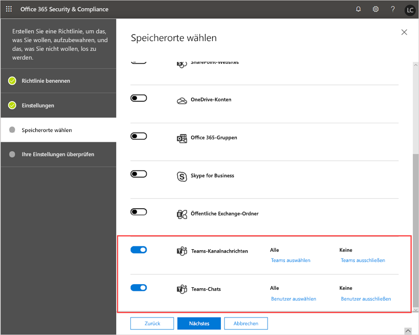
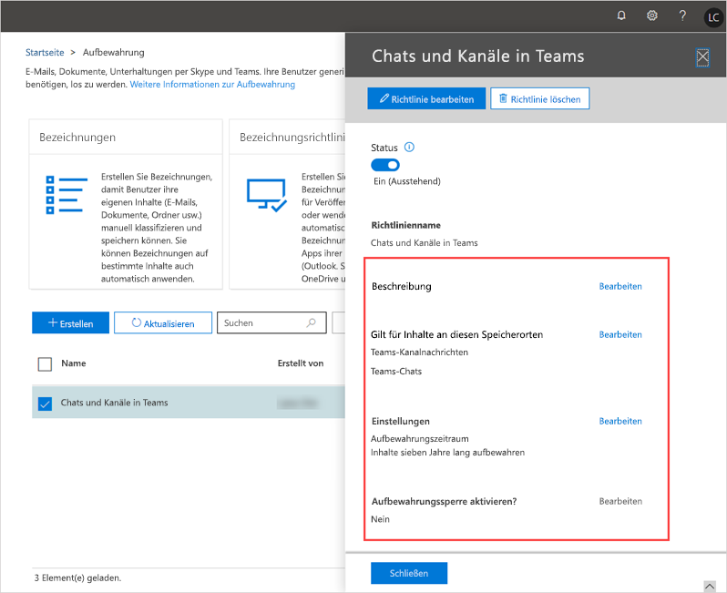

# Aufbewahrungsrichtlinien in Microsoft Teams

Die Aufbewahrungsrichtlinien helfen Ihnen, die Informationen in Ihrer Organisation effizienter zu verwalten. Verwenden Sie Aufbewahrungsrichtlinien, um die Daten zu speichern, die für die Einhaltung der internen Richtlinien Ihrer Organisation, der Branchenvorschriften oder der gesetzlichen Anforderungen erforderlich sind, und um die Daten zu löschen, die als eine Belastung eingestuft wurden, die Sie nicht mehr benötigen oder die keinen rechtlichen oder geschäftlichen Wert besitzen.

Standardmäßig werden die Daten für Teams-Chat,-Kanal und-Dateien auf unbestimmte Zeit aufbewahrt, es sei denn, es wird versucht, die Inhalte über Aufbewahrungsrichtlinien, Benutzer Löschungen, Administrator Löschungen usw. zu löschen. Als Administrator können Sie die Aufbewahrungsrichtlinien für Teams für Chats und Kanal Nachrichten einrichten und proaktiv entscheiden, ob Sie die Daten beibehalten, löschen oder für einen bestimmten Zeitraum beibehalten und dann löschen möchten.

Sie erstellen und verwalten Aufbewahrungsrichtlinien für Teams und andere Arbeitslasten im [Microsoft 365 Compliance Center](https://protection.office.com/) oder mithilfe der PowerShell-Cmdlets für Security & Compliance Center. Sie können eine Aufbewahrungsrichtlinie für Teams auf Ihre gesamte Organisation oder bestimmte Benutzer und Teams anwenden.

> [!NOTE]
> Wir unterstützen noch keine Konfiguration für die Aufbewahrung privater Kanal Nachrichten. Die Aufbewahrung von Dateien, die in privaten Kanälen freigegeben sind, wird unterstützt.

Weitere Informationen zu Aufbewahrungsrichtlinien für Microsoft 365 oder Office 365 finden Sie unter [Übersicht über Aufbewahrungsrichtlinien](https://support.office.com/article/overview-of-retention-policies-5e377752-700d-4870-9b6d-12bfc12d2423).

## Was sind Aufbewahrungsrichtlinien für Teams?

Wenn Sie eine Aufbewahrungsrichtlinie für Teams oder eine andere Arbeitsauslastung einrichten, können Sie diese für das Folgende einstellen:

- **Daten aufbewahren**: Verwenden Sie eine Aufbewahrungsrichtlinie, um sicherzustellen, dass Ihre Daten für einen bestimmten Zeitraum aufbewahrt werden, unabhängig davon, was in der Benutzer-App passiert. Daten werden aus Konformitätsgründen aufbewahrt und stehen bis zum Ablauf des Aufbewahrungszeitraums für eDiscovery zur Verfügung, danach gibt Ihre Richtlinie an, ob die Daten gelassen oder gelöscht werden sollen. Wenn Sie beispielsweise eine Aufbewahrungsrichtlinie für Teams zum Aufbewahren von Kanalnachrichten für 7 Jahre erstellen, werden die Nachrichten 7 Jahre lang für eDiscovery gespeichert, auch wenn die Benutzer ihre Nachrichten in Teams löschen.
- **Daten löschen**: Verwenden Sie eine Aufbewahrungsrichtlinie zum Löschen von Daten, um sicherzustellen, dass sie Ihre Organisation nicht belasten. Bei einer Aufbewahrungsrichtlinie für Teams werden beim Löschen von Daten alle Speicherorte im Teams-Dienst endgültig gelöscht.

Mit Aufbewahrungsrichtlinien für Teams können Sie:

- Teams Chats- und/oder Kanalnachrichten für eine bestimmte Dauer beibehalten und danach nichts tun.
- Teams Chats- und/oder Kanalnachrichten für eine bestimmte Dauer beibehalten und danach die Daten löschen.
- Teams Chats- und/oder Kanalnachrichten nach einer bestimmten Dauer löschen.

> [!NOTE]
> Denken Sie daran, dass in Teams Dateien, die Benutzer in privaten Chats freigeben, im OneDrive for Business-Konto des Benutzers gespeichert sind, der die Datei freigegeben hat. Und die Dateien, die Teammitglieder in einem Kanal freigeben, werden auf der SharePoint-Website des Teams gespeichert. Wenn Sie Dateien in Teams beibehalten oder löschen möchten, erstellen Sie Aufbewahrungsrichtlinien, die für OneDrive for Business und SharePoint Online gelten.

Wenn Daten einer Aufbewahrungsrichtlinie unterliegen, können Benutzer weiterhin damit arbeiten, weil die Daten an Ihrem ursprünglichen Speicherort aufbewahrt werden. Falls ein Benutzer Inhalte, die der Richtlinie unterliegen, bearbeitet oder löscht, wird eine Kopie an einem sicheren Standort gespeichert, an dem sie beibehalten wird, solange die Richtlinie gilt.

Die Mindestanforderungen für die Lizenzierung für Aufbewahrungsrichtlinien sind Office 365 E3. Weitere Informationen zur Lizenzierung finden Sie in der [Microsoft Teams-Dienstbeschreibung](https://docs.microsoft.com/office365/servicedescriptions/teams-service-description).

## Funktionsweise der Aufbewahrungsrichtlinien von Teams

Teams-Chats werden in einem versteckten Ordner (Teamschat) im Postfach jedes Benutzers im Chat gespeichert, und Teams-Kanal Nachrichten werden in einem ausgeblendeten Ordner (Teamschat) im Gruppenpostfach für ein Team gespeichert. Teams verwendet einen Azure-Chatdienst, der diese Daten ebenfalls speichert, und die Daten von diesem Dienst werden standardmäßig unbefristet gespeichert. Bei einer Aufbewahrungsrichtlinie für Teams werden die Daten beim Löschen von Daten dauerhaft aus den Exchange-Postfächern und dem zugrunde liegenden Chatdienst gelöscht.

Wenn Sie eine **Aufbewahrungs** Richtlinie auf Teams-Chats oder Kanal Nachrichten anwenden, gehen Sie folgendermaßen vor:

- Wenn eine Chat-oder Kanal Nachricht während des Aufbewahrungszeitraums von einem Benutzer bearbeitet oder gelöscht wird, wird die Nachricht (sofern Sie bearbeitet wurde) kopiert oder verschoben (falls Sie gelöscht wurde) in den SubstrateHolds-Ordner und dort gespeichert, bis der Aufbewahrungszeitraum abläuft. Wenn die Richtlinie für das Löschen von Daten nach Ablauf des Aufbewahrungszeitraums konfiguriert ist, werden die Nachrichten am Tag des Ablaufs des Aufbewahrungszeitraums dauerhaft gelöscht.
- Wenn eine Chat-oder Kanal Nachricht während des **Aufbewahrungs** Zeitraums nicht von einem Benutzer gelöscht wird, wird die Nachricht innerhalb eines Tages nach Ablauf des Aufbewahrungszeitraums in den SubstrateHolds-Ordner verschoben. Wenn die Richtlinie für das Löschen von Daten nach Ablauf des Aufbewahrungszeitraums konfiguriert ist, wird die Nachricht einen Tag nachdem Sie in den Ordner verschoben wurde dauerhaft gelöscht.

Wenn Sie eine **Aufbewahrungs Lösch** Richtlinie auf teamchats und Kanal Nachrichten anwenden, gehen Sie wie folgt vor:

- Wenn eine Chat-oder Kanal Nachricht abläuft, d. h., das Alter der Nachricht ist mehr als von der **Aufbewahrungs Lösch** Richtlinie zugelassen, gibt ein Back-End-Dienst abgelaufene Nachrichten an und beginnt, Sie im Back-End-Speicher (Benutzer-oder Gruppenpostfach) zu löschen.
- Nachdem eine Nachricht im Back-End-Speicher gelöscht wurde, wird ein Prozess ausgelöst, um dieselbe Nachricht im Azure-powered-Chatdienst und in der Team-App des Benutzers zu löschen. Damit die Nachrichten in der Teams-App gelöscht werden können, muss die APP mit dem Internet verbunden sein und sich im Leerlauf befinden (keine Benutzeraktivität), damit der Löschvorgang die Benutzeroberfläche nicht beeinträchtigt. Da ein Benutzer möglicherweise über mehrere Geräte verfügt, die sich möglicherweise in verschiedenen Zuständen befinden, werden Aufbewahrungs Löschungen nicht gleichzeitig mit diesen Geräten synchronisiert.
- Nachdem das Löschen von Nachrichten im Back-End-Speicher abgeschlossen ist, werden diese Nachrichten in Kompatibilitäts Suchberichten wie eDiscovery nicht mehr angezeigt.

> [!NOTE]
> Der gleiche Ablauf gilt für Interop-Chats zwischen Skype for Business Online und Teams. Wenn ein Skype for Business Online-Chat in Teams eintrifft, wird er in einem Chatthread von Teams zu einer Nachricht und wird in das entsprechende Postfach aufgenommen. Die Aufbewahrungsrichtlinien für Teams löschen diese Nachrichten aus dem Teams-Thread. Wenn aber der Unterhaltungsverlauf für Skype for Business Online und für die Skype for Business Online-Clientseite aktiviert ist, die in einem Postfach gespeichert sind, werden diese Chatdaten nicht von einer Aufbewahrungsrichtlinie für Teams verarbeitet.

> [!NOTE]
> Das Löschen von Nachrichten ist dauerhaft und unumkehrbar.

Aufbewahrungsrichtlinien in Teams basieren auf dem Datum, an dem die Chat- oder Kanalnachrichten erstellt wurden, und sie sind rückwirkend. Wenn Sie also eine Aufbewahrungsrichtlinie erstellen, um Daten zu löschen, die älter als 90 Tage sind, werden die Teams-Daten, die vor mehr als 90 Tagen erstellt wurden, gelöscht.

Es kann vorkommen, dass eine Aufbewahrungsrichtlinie, die auf SharePoint Online oder OneDrive for Business angewendet wird, eine Datei löscht, die in einer Teams Chat- oder Kanalnachricht erwähnt wird, bevor diese Nachrichten gelöscht werden. In diesem Szenario wird die Datei in der Teams-Nachricht weiterhin angezeigt, aber wenn Benutzer auf die Datei klicken, wird der Fehler "Datei nicht gefunden" angezeigt. Dies kann auch bei Abwesenheit einer Richtlinie geschehen, wenn jemand eine Datei aus SharePoint Online oder OneDrive for Business manuell löscht.

### Überlegungen und Einschränkungen

Hier einige Überlegungen und Einschränkungen, die beim Arbeiten mit den Aufbewahrungsrichtlinien für Teams beachtet werden sollten:

- Teams erfordert eine Aufbewahrungsrichtlinie, die von anderen Arbeitslasten getrennt ist. Das heißt, dass Sie bestimmte Aufbewahrungsrichtlinien für Teams-Chats und/oder Kanalnachrichten erstellen müssen. Aus diesem Grund können Sie Teams in organisationsweite Aufbewahrungsrichtlinien nicht einschließen.

- Private Kanalnachrichten sind nicht unterstützt. Zu diesem Zeitpunkt gelten Teams-Aufbewahrungsrichtlinien nur für standardmäßigen Kanalnachrichten.

- Teams unterstützt keine erweiterten Aufbewahrungseinstellungen, z. B. die Möglichkeit, eine Richtlinie auf Inhalte anzuwenden, die bestimmte Stichwörter oder vertrauliche Informationen enthalten. Aktuell gelten Aufbewahrungsrichtlinien in Teams für alle Inhalte in Chat- und/oder Kanalnachrichten.

- Eine Aufbewahrungsrichtlinie für Teams löst einen Prozess zum Löschen von Chat-und Kanal Nachrichten aus, wenn diese Nachrichten ablaufen (basierend auf dem Erstellungsdatum der Nachricht). Je nach Dienstauslastung kann es jedoch bis zu sieben Tage dauern, diese Nachrichten aus dem Back-End-Speicher und der Teams-App endgültig zu löschen. Darüber hinaus können diese Nachrichten mit Compliance-Tools (eDiscovery, Endbenutzersuche) durchsucht werden, bis Sie endgültig aus dem Back-End-Speicher gelöscht werden.

### Mehrere Aufbewahrungsrichtlinien und die Grundsätze der Aufbewahrung

Wenn Sie mehrere Aufbewahrungsrichtlinien für Teams mit unterschiedlichen Dauer einrichten, werden die [Grundsätze der Aufbewahrungsrichtlinien](https://docs.microsoft.com/microsoft-365/compliance/retention-policies#the-principles-of-retention-or-what-takes-precedence) angewendet. Hier ist ein Überblick über Vorränge:

- Bewahrung hat immer Vorrang vor Löschung
- Der längste Aufbewahrungszeitraum hat immer Vorrang
- Explizite Einbindung hat Vorrang vor impliziter Einbindung was Speicherorte angeht
- Der kürzeste Löschzeitraum hat Vorrang

## Wann sind die Aufbewahrungsrichtlinien für Teams zu verwenden

In vielen Fällen betrachten Organisationen private Chat-Daten als eine größere Belastung als Kanalnachrichten, bei denen es sich in der Regel eher um projektbezogene Gespräche handelt.

Sie können separate Aufbewahrungsrichtlinien für private Chats (1:1- oder 1:Viele-Chats) und Kanalnachrichten einrichten. Sie können auch eindeutige Richtlinien konfigurieren, die für bestimmte Benutzer oder Teams in Ihrer Organisation gelten. Bei Teams-Chats können Sie auswählen, für welche Benutzer die Richtlinie gilt. Bei Teams-Kanalnachrichten können Sie auswählen, für welche Teams die Richtlinie gilt.

So können Sie beispielsweise für Kanalnachrichten eine einjährige Löschrichtlinie auf bestimmte Teams in Ihrer Organisation und eine Löschrichtlinie von drei Jahren auf alle anderen Teams anwenden.

## Aufbewahrungsrichtlinien für Teams verwalten

### Das Security & Compliance Center verwenden

#### Erstellen einer Aufbewahrungsrichtlinie

Gehen Sie wie folgt vor, um eine Aufbewahrungsrichtlinie für Teams-Chats und -Kanalnachrichten zu erstellen:

1. Klicken Sie im Security & Compliance Center im linken Navigationsbereich auf **Informationsgovernance** > **Aufbewahrung**.
2. Wählen Sie **Erstellen** aus.
3. Geben Sie auf der Seite **Ihre Richtlinie benennen** einen Namen und eine Beschreibung für Ihre Richtlinie ein und klicken Sie dann auf **Weiter**.
4. Geben Sie auf der Seite **Einstellungen** an, ob Sie die Daten beibehalten, loschen oder beides möchten, geben Sie die Aufbewahrungsdauer ein und klicken Sie dann auf **Weiter**.
5. Führen Sie auf der Seite **Speicherorte wählen** Folgendes aus und klicken Sie dann auf **Weiter**:

    - Wenn Sie die Richtlinie auf Kanalnachrichten anwenden möchten, aktivieren Sie **Teams-Kanalnachrichten**.  Wenn Sie die Richtlinie auf bestimmte Teams in Ihrer Organisation anwenden möchten, wählen Sie **Teams auswählen** aus, und wählen Sie dann die gewünschten Teams aus.
    - Wenn Sie die Richtlinie auf Chats anwenden möchten, aktivieren Sie **Teams-Chats**. Wenn Sie die Richtlinie auf bestimmte Benutzer in Ihrer Organisation anwenden möchten, wählen Sie **Benutzer auswählen** aus, und wählen Sie dann die gewünschten Benutzer aus.
      > [!NOTE]
      > Wenn Sie **Teams-Kanalnachrichten** und/oder **Teams-Chats** aktivieren, werden alle anderen Speicherorte automatisch deaktiviert. Eine Aufbewahrungsrichtlinie für Teams kann nur Teams-Speicherorte umfassen.

        

      > [!IMPORTANT]
      > Teams-Chats und Kanal Nachrichten sind nicht von Aufbewahrungsrichtlinien betroffen, die auf Benutzer-oder Gruppen Postfächer in den **Exchange-e-Mail-** oder **Microsoft 365-Gruppen** Speicherorten angewendet werden. Auch wenn Microsoft Teams-Chats und -Kanalnachrichten in Exchange gespeichert werden, sind sie nur von Aufbewahrungsrichtlinien betroffen, die auf die Teams-Speicherorte angewendet werden.

6. Überprüfen Sie Ihre-Einstellungen und, wenn Sie bereit sind, wählen Sie **Diese Richtlinie erstellen** aus.

#### Bearbeiten einer Datenaufbewahrungsrichtlinie

Wenn Sie eine Aufbewahrungsrichtlinie für Teams bearbeiten möchten, gehen Sie folgendermaßen vor:

1. Klicken Sie im Security & Compliance Center im linken Navigationsbereich auf **Informationsgovernance** > **Aufbewahrung**.
2. Aktivieren Sie in der Liste der Aufbewahrungsrichtlinien das Kontrollkästchen neben der Aufbewahrungsrichtlinie, die Sie bearbeiten möchten.
3. Wählen Sie **Bearbeiten**neben dem Element aus, das Sie bearbeiten möchten, nehmen Sie Ihre Änderungen vor, klicken Sie auf **Speichern** und klicken Sie dann auf **Schließen**.

    

#### Löschen einer Aufbewahrungsrichtlinie

Wenn Sie eine Aufbewahrungsrichtlinie für Teams löschen möchten, gehen Sie folgendermaßen vor:

1. Klicken Sie im Security & Compliance Center im linken Navigationsbereich auf **Informationsgovernance** > **Aufbewahrung**.
2. Aktivieren Sie in der Liste der Aufbewahrungsrichtlinien das Kontrollkästchen neben der Aufbewahrungsrichtlinie, die Sie löschen möchten.
3. Wählen Sie **Richtlinie löschen** aus.

### Endbenutzererfahrung

Für private Chats (1:1-Chats) oder Gruppen-Chats wird den Endbenutzern angezeigt, dass Chats, die älter als die Aufbewahrungsrichtlinien Konfiguration sind, gelöscht werden, und eine Kontrollmeldung, die besagt, dass "wir ältere Nachrichten aufgrund der Aufbewahrungsrichtlinie Ihrer Organisation gelöscht haben", wird oben auf noch nicht gelöschten Nachrichten angezeigt.
:::image type="content" source="media/retention-policies-image1.png" alt-text="Screenshot der Chat-Aufbewahrung":::

:::image type="content" source="media/retention-policies-image2.png" alt-text="Screenshot der Beibehaltung des Gruppen-Chats":::

Bei Kanal Nachrichten sehen die Endbenutzer (Kanalmitglieder), dass gelöschte Nachrichten nach Ablauf der Nachrichten nicht mehr angezeigt werden. Wenn es sich bei der gelöschten Nachricht um eine übergeordnete Nachricht einer Thread Unterhaltung handelt, wird anstelle der übergeordneten Nachricht eine Meldung angezeigt, die besagt, dass diese Nachricht aufgrund einer Aufbewahrungsrichtlinie gelöscht wurde.

:::image type="content" source="media/retention-policies-image3.png" alt-text="Screenshot des Kanals vor der Aufbewahrung":::

:::image type="content" source="media/retention-policies-image4.png" alt-text="Screenshot des Kanals nach der Aufbewahrung":::

> [!NOTE]
> Endbenutzer-Messaging ist zurzeit nicht Benutzer oder Administrator änderbar.

### Verwendung von PowerShell

Verwenden Sie die folgenden Cmdlets, um die Aufbewahrungsrichtlinien für Teams mithilfe von [Security & Compliance Center PowerShell](https://docs.microsoft.com/powershell/exchange/office-365-scc/connect-to-scc-powershell/connect-to-scc-powershell)zu erstellen und zu verwalten:

|Richtlinie|Regel|
|---|---|
|[Neu – RetentionCompliancePolicy](https://docs.microsoft.com/powershell/module/exchange/policy-and-compliance-retention/new-retentioncompliancepolicy?view=exchange-ps)| [Neu – RetentionComplianceRule](https://docs.microsoft.com/powershell/module/exchange/policy-and-compliance-retention/new-retentioncompliancerule?view=exchange-ps)|
|[Get-RetentionCompliancePolicy](https://docs.microsoft.com/powershell/module/exchange/policy-and-compliance-retention/get-retentioncompliancepolicy?view=exchange-ps)| [Get-RetentionComplianceRule](https://docs.microsoft.com/powershell/module/exchange/policy-and-compliance-retention/get-retentioncompliancerule?view=exchange-ps)|
|[Satz-RetentionCompliancePolicy](https://docs.microsoft.com/powershell/module/exchange/policy-and-compliance-retention/set-retentioncompliancepolicy?view=exchange-ps)| [Satz-RetentionComplianceRule](https://docs.microsoft.com/powershell/module/exchange/policy-and-compliance-retention/set-retentioncompliancerule?view=exchange-ps)|
|[Remove-RetentionCompliancePolicy](https://docs.microsoft.com/powershell/module/exchange/policy-and-compliance-retention/remove-retentioncompliancepolicy?view=exchange-ps)| [Remove-RetentionComplianceRule](https://docs.microsoft.com/powershell/module/exchange/policy-and-compliance-retention/remove-retentioncompliancerule?view=exchange-ps)|

## Bekannte Probleme

Im Folgenden werden bekannte Probleme bei Aufbewahrungsrichtlinien in Teams dargestellt, die nachverfolgt und untersucht werden.

- Unter **"Teams auswählen"** in der Zeile " **Channel-Nachrichten für Teams** " werden möglicherweise Microsoft 365-Gruppen angezeigt, die nicht auch Teams sind. Dieses Problem wird in der Zukunft behoben.

- Unter **Benutzer**in der Speicherortzeile für **Teams-Chats** werden möglicherweise Gäste und Nicht-Postfachbenutzer angezeigt. Aufbewahrungsrichtlinien sollten nicht für Gäste eingerichtet werden, und wir arbeiten daran, diese aus der Liste zu entfernen.

- Exchange-Lebenszyklus-Assistent (ELC) wird täglich ausgeführt, die Wartezeit ist jedoch bekanntermaßen bis zu 7 Tage in einigen Fällen abgelaufen. Daher ist es möglich, dass, wenn Sie eine Richtlinie zur Aufbewahrung von Elementen, die älter als 60 Tage sind, haben, diese Elemente bis zu 67 Tage bestehen bleiben können. Dies ist keine neue Situation – sie folgt dem Exchange-Modell. Natürlich gibt es in den meisten Fällen keine Verzögerung.

## Verwandte Themen

- [Übersicht über Aufbewahrungsrichtlinien](https://support.office.com/article/overview-of-retention-policies-5e377752-700d-4870-9b6d-12bfc12d2423)
