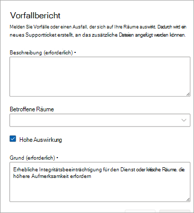

# Vom Kunden gemeldete Vorfalltickets

Für jede Art von Vorfall, den Microsoft nicht gekennzeichnet hat, oder für Fragen zu den Diensten/Features können Kunden oder Partner im Namen von Kunden das Feature "Vorfall melden" verwenden, um Microsoft zu benachrichtigen, um das Problem zu untersuchen oder die Frage zu beantworten.

Beschreiben Sie im Feld "Beschreibung" das Problem, bei dem Sie Hilfe von Microsoft benötigen, so gut wie möglich. Sie können einen oder mehrere Räume hinzufügen.

Überprüfen Sie  **hohe Auswirkungen** , wenn der Vorfall eine erhebliche Integritätsbeeinträchtigung für den Dienst oder für einen kritischen Raum verursacht. Um Microsoft bei der richtigen Priorisierung Ihrer Anforderung zu unterstützen, beschreiben Sie im Detail, warum dies eine hohe Auswirkung hat.

> [!NOTE]
> Verwenden Sie dieses Feld nicht für allgemeine Fragen, Räume und/oder Probleme, für die keine Entschärfung verfügbar ist.

Vom Kunden gemeldete Vorfälle (CRIs) gelten als kritische Tickets, was bedeutet, dass das Teams-Räume Service Operations Center diese Tickets zuerst selektieren kann. Die SLA zur Dienstbeschreibung für vom Kunden gemeldete Vorfälle finden Sie [hier](microsoft-teams-rooms-premium.md). Wenn ein Raum als Teil des CRI ausgewählt wird (oder Räume ausgewählt werden), wird jeder Raum als **fehlerhaft** gekennzeichnet, bis der CRI geschlossen wird.

## Schließen von Vom Kunden gemeldeten Vorfalltickets

Vom Kunden gemeldete Vorfälle können entweder vom Kunden, Partnern, die Räume im Auftrag von Kunden verwalten, oder von Microsoft Service Operations Center-Technikern geschlossen werden.

**So schließen Sie einen Vorfall**

1. Wählen Sie **"Ticket schließen" aus**.

   

1. Wählen Sie einen Grund für das Schließen aus, indem Sie eine Kategorie aus der Liste auswählen.

   Nachdem Sie den Grund für das Schließen bestätigt haben, wird das Ticket geschlossen und nach **Resolved** verschoben.

   

Im Abschnitt "Detailsübersicht" des Tickets wird angezeigt, dass das Ticket vom Dienst für verwaltete Räume (Microsoft) oder dem Namen des Kunden/Partners geschlossen wurde.  

 

## Häufig gestellte Fragen

**Kann jemand Tickets schließen?**

Nur vom Kunden gemeldete Vorfälle können durch einen Benutzer oder das Microsoft Managed Rooms Service Operations Center geschlossen werden. Kunden, die einem Partner zugewiesen haben, ihre Räume mit Ticketverwaltungsberechtigungen zu verwalten, haben die Möglichkeit, vom Kunden gemeldete Vorfälle zu schließen.

**Kann ich einschränken, wer Tickets schließen kann?**

Zurzeit nicht. Alle Benutzer, die über Ticketverwaltungsberechtigungen verfügen, können einen CRI schließen.

**Erhalte ich eine Benachrichtigung, wenn ein vom Kunden gemeldetes Vorfallticket geschlossen wird?**

Zurzeit nicht.