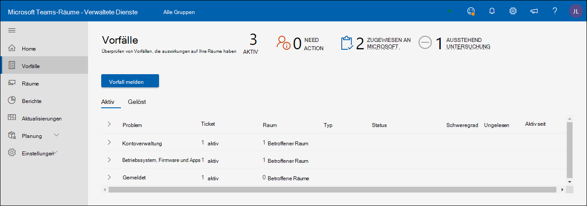
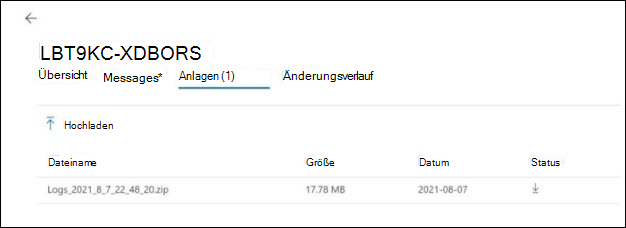

# Microsoft Managed Meeting Rooms Portal

## Übersicht

Das Portal für verwaltete Besprechungsräume ("Räumeportal") bietet eine Ansicht des Zustands Ihrer Besprechungsräume. Eine Kundenansicht dieses Portals ist für Ihre Sichtbarkeit und Ihr Feedback sowie zur Vereinfachung Ihrer vorhandenen Überwachungstools/-methoden da.

Der Umfang der Überwachung ist

- Anzeigen von Vorfällen
  - Die meisten Probleme mit Auswirkungen auf Ihre Räume
  - Aktionen, die erforderlich sind, um Räume als fehlerfreien Status wiederherzustellen
  - Probleme, die von Microsoft untersucht werden
- Ansicht der Microsoft Teams Raumgeräte
  - Momentaufnahme des Status auf Microsoft Teams-Räume (MTR)-Geräteebene
  - Grundlegender Verlauf und Details für jedes Gerät

**Ansicht der Microsoft Teams Raumgeräte**

- Momentaufnahme des Status auf Microsoft Teams-Räume (MTR)-Geräteebene
- Grundlegender Verlauf und Details für jedes Gerät

> [!Important]
> Lesen [**Sie Zuweisen von Benutzern zur Rolle "Administrator**](enrolling-mtrp-managed-service.md#assign-users-to-the-managed-service-administrator-role) für verwaltete Dienste", und stellen Sie sicher, dass der Zugriff auf das Portal basierend auf Ihren geschäftlichen Anforderungen eingeschränkt ist.

## Terminologie

Hier sind die am häufigsten verwendeten Begriffe im Portal.

|Begriff |Bedeutung |
| :- | :- |
|**Überwachungssoftware** |Überwachungs-Agent, der auf jedem der Raumgeräte Microsoft Teams wird. |
|**App** |Microsoft Teams Raumsystem-App (unabhängig davon, ob die App Skype for Business oder Microsoft Teams Als Zusammenarbeitsdienst verwendet wird. |
|**Raum/Gerät** |Das zertifizierte Microsoft Teams Raumsystemgerät. |
|**Unbeaufsichtigt** | Im Rahmen verwalteter Dienste bereitgestellte Microsoft-Überwachungssoftware kann keine Verbindung zu den Clouddiensten herstellen. Wir empfangen keine Telemetrie für das Gerät. |
|
**Fehlerfrei /** 

**Fehlerhaft** 
|Ungewöhnliche Voranormalitäten bei Geräten/Peripheriegeräten. |
|**Unterdrückt** |Wenn bekannt ist, dass ein Gerät in Wartung ist und seine Warnungen ignoriert werden sollten, kann das Gerät absichtlich unterdrückt werden. |
|**Onboarding** |Der Status eines Raumgeräts, während das Setup hinzugefügt wird, ist aber nicht als regelmäßig unterstützter Raum bereit. |
|**Vorfall** |Ein Problem, das auswirkungen auf die Besprechungserfahrungen von Endbenutzern hat, die Eine Aktion benötigen. |
|**Falsch konfiguriert** |Die erkannte Konfiguration ist nicht korrekt/wird häufig verwendet. |
|**Supportticket** |Interner Microsoft-Nachverfolgungsbezeichner, der alle Kommunikationen/Aktionen zu einem Vorfall nachverfolgung verfolgt. |

## Ansicht "Vorfälle"

Diese Ansicht ist eine Übersicht über die Registerkarte Vorfälle in Ihrem Portal für verwaltete Räume. Diese Seite ist die standardmäßige Startseite des Portals.

### Zusammenfassung der obersten Ebene 
Die Zusammenfassung der obersten Ebene zeigt auf einen Blick die Probleme, die auswirkungen auf Ihre Räume haben, was Sie tun müssen und was Microsoft damit macht:

|# |Erklärung |
| :- | :- |
|1 |Arten von Vorfällen, die Auswirkungen auf Ihre Räume haben |
|2 |**NEED ACTION**:Elemente, die von Ihrem Eingreifen gelöst werden müssen. |
|3 |**MICROSOFT ZUGEWIESEN:** Elemente, die derzeit von Microsoft-Mitarbeitern untersucht werden. |
|4 |**AUSSTEHENDE UNTERSUCHUNG:** Elemente in der Warteschlange, die von Microsoft-Mitarbeitern untersucht werden sollen. |

Vorfälle werden in einem von drei Zufallszuständen erwartet:

- **Aktionsbedarf:** Ihnen zur Aktion zugewiesen
- **Microsoft zugewiesen: Microsoft** für die nächste Aktion zugewiesen
- **Ausstehende Untersuchung:** Wird für die nächsten Schritte untersucht

### Überprüfen von Vorfällen

In der folgenden Abbildung sind alle Vorfälle aufgeführt, die derzeit in Ihren Räumen aktiv sind. Die Ihnen zugewiesenen befinden sich ganz *oben.* Dies sind die Informationen, die Sie sich für die nächsten Schritte durchschauen müssen. Darüber hinaus verfügen die Microsoft zugewiesenen oder ausstehenden Untersuchungen über Details, mit denen Sie eingreifen können.

Wenn Sie auf eines der Elemente mit dem Status " Aktion benötigt"**klicken,** werden weitere Details zu dem Vorfall angezeigt.

## Arten von Vorfällen

Vorfälle werden in zwei breite Schweregradtypen klassifiziert:

- **Wichtig:** Vorfälle, die wahrscheinlich Probleme in Besprechungen verursachen und priorisiert werden sollten.
- **Warnung** – Vorfälle, bei der es sich um Benachrichtigungen zum Planen von Wartungsaktionen handelt. Wenn diese nicht berücksichtigt werden, ist die Wahrscheinlichkeit, dass die Räume im Laufe der Zeit ein Problem haben, wahrscheinlicher. Warnungen sollen Ihnen Zeit zum Planen und Orchestrieren der Unterstützung geben.

Eine Warnung wird möglicherweise in **"Wichtig" um** übergangen, wenn eine Weile nicht besucht wird.

## Integritätsstatus von Geräten und Vorfällen

Vorfälle, die im Schweregrad **als "Wichtig"** klassifiziert wurden, wirken sich auf den Integritätsstatus eines Geräts aus. Wenn einem Gerät mindestens ein Vorfall mit Schweregrad **= "Wichtig"** zugeordnet ist, wird er als fehlerhaft **_klassifiziert._**

Vorfälle, die als **Schweregrad "Warnung"** klassifiziert wurden, wirken sich nicht auf den auf einem Gerät gemeldeten Integritätsstatus aus. Wenn einem Gerät jedoch Warnebenenvorfälle zugeordnet sind, würde es wie folgt mit dem Integritätsstatus des Geräts angezeigt.

Im Folgenden finden Sie einige Arten von Vorfällen, die möglicherweise zu sehen sind, sowie die Erläuterungen zu den einzelnen Typen. Je nach Problem ist die dem Vorfall zugeordnete Aktion für jeden Typ spezifischer.

**Tabelle 1: Vorfälle mit schwerem Schweregrad "Wichtig"**

|Typ |Erklärung |
| :- | :- |
|**Anzeige** |Die mit dem Gerät verbundene Anzeige scheint nicht fehlerfrei zu sein.|
|**Konferenzmikrofon, Konferenzreferent** |Die Audiogeräte (Mikrofon/Lautsprecher) scheinen falsch konfiguriert zu sein. |
|**Kamera** |Die an das Gerät angeschlossene Kamera scheint nicht fehlerfrei zu sein. |
|**HDMI-Aufnahme** |HDMI-Aufnahme ist nicht fehlerfrei. |
|**Anmeldung (Exchange)** |Microsoft Teams Raum-App auf Kalenderinformationen von Exchange und jedes Problem mit erfolgreichem Anmelden wird mit einem Anmeldevorfall gemeldet. |
|**Anmeldung (Teams)** |Microsoft Teams sich die Raum-App beim Gerät anmeldet, und fehler bei der Anmeldung werden bei diesem Vorfall gemeldet (wenn der Kunde Teams). |
|**Anmeldung (Skype for Business)** |Microsoft Teams sich die Raum-App beim Gerät anmeldet, werden bei diesem Vorfall Fehler gemeldet (wenn der Kunde Skype for Business) |
|**Näherungssensor** |Microsoft Teams Raum-App lädt Teilnehmer zur Teilnahme an einer Besprechung ein, wenn sie sich in der Nähe befinden. Fehler in diesem Feature werden unter diesem Vorfall gemeldet. |

**Tabelle 2: Vorfälle mit Schweregrad "Warnung"**

|Typ |Erklärung |
| :- | :- |
|**App-Version** |Die auf dem Gerät Microsoft Teams aktuelle Version der Raum-App ist nicht aktuell. Veraltete Versionen sind bekannte Ursachen für Probleme, die bei Benutzern auftreten. |
|**Betriebssystemversion** |Die im Windows ausgeführte Version des Betriebssystems wird nicht mehr empfohlen. |
|**Netzwerk** |Dies wird kurzfristig als Warnungstyp entfernt, da nach der Auswertung zusätzliche Arbeit erforderlich ist. |

## Reaktion auf Vorfälle

Vorfälle können in drei Kategorien unterteilt werden: "Handlungsbedarf", "Ausstehende Untersuchung" oder "Microsoft zugewiesen".

### Vorfälle mit "Bedarf"

Vorfälle, deren Status auf **"Bedarfsaktion"** festgelegt ist, werden Ihnen zugewiesen, um eine Behebungsmaßnahme zu ergreifen.

Jeder dieser Vorfälle enthält ein Aktionsfeld mit einer empfohlenen Aktion von Microsoft wie folgt:

- Wenn Sie die Aktion ergriffen haben, können Sie auf den Vorfall mit Ihren Notizen im Feld Antworten antworten antworten und vor dem Posten "Microsoft zuweisen" auswählen.
- Es ist auch möglich, dass die Benachrichtigung basierend auf Ihrer Rezension falsch ist. Geben Sie in diesem Fall bitte dieses Feedback ein, und weisen Sie es An Microsoft zurück.
- Und schließlich: Wenn Sie einen Kommentar hinzufügen möchten, um zusätzlichen Kontext für Ihr eigenes Team oder Microsoft-Team zu bieten, posten Sie die Nachricht, ohne "Microsoft zuweisen" zu aktivieren.

>[!NOTE]
>Ihre Behebungsmaßnahme kann das Problem beheben, und dass die Überwachung verwalteter Räume diesen Vorfall aus Ihrer Liste entfernt. In der vorstehenden Situation erhalten Sie möglicherweise keine Chance, das Problem zu beheben und Microsoft zuzuordnen. Dieses Problem wird in einer zukünftigen Version behoben.

### Vorfälle für "Ausstehende Untersuchungen"

Für die zu untersuchten Vorfälle enthält das Beschreibungsfeld Informationen zum Vorfall, typische Ursachen und Lösungen, die hilfreich sein können, um bestimmte Probleme zu beheben, sodass Sie ohne Verzögerung handeln können.

### Microsoft zugewiesene Vorfälle

Für die Microsoft zugewiesenen Vorfälle enthält das Feld "Aktion" kurze Details zu den Schritten zur Behebung, die entweder geplant oder in Bearbeitung sind. Für diese Schritte ist möglicherweise die Zusammenarbeit mit Ihrem Team erforderlich, und die erweiterte Zusammenarbeit erfolgt nach Bedarf per E-Mail/Anruf. Sobald diese Probleme behoben sind, werden sie nicht mehr im Portal angezeigt, und in Zukunft gibt es einen Verlauf, in dem solche Vorfälle und deren Lösung nachverfolgt werden können.

## Ansicht 'Räume'

Jedes Gerät ist ein Proxy für einen Raum und seine angeschlossenen Peripheriegeräte. Ein fehlerfreies Gerät steht für einen fehlerfreien Raum, und ein fehlerhaftes Gerät stellt einen Raum dar, der in Besprechungen wahrscheinlich Probleme verursacht. Zusätzlich zur Ansicht "Vorfälle" bietet das Portal für verwaltete Räume auch eine Übersicht über die Integrität von Räumen und hilft Ihnen bei der Problembehandlung bei Gerätedetails sowie beim Verständnis wiederholter Fehler mit dem Vorfallverlauf.

**Fehlerfrei, fehlerhaft, getrennt** Der obere Bereich in der Ansicht Räume bietet eine schnelle Momentaufnahme der Art und Weise, wie viele Ihrer Geräte sich in einem guten Zustand befinden("Fehlerfrei"), wie viele von Problemen betroffen sind ("fehlerhaft"), wie viele nicht Telemetrie bereitstellen ("Getrennt") und wie viele Geräte für Benachrichtigungen unterdrückt werden (als Außerkraftsetzung). Räume werden anhand sich entwickelnder Kriterien und Heuristiken auf den Gesundheitszustand überwacht. Das Ziel ist es, die Realität der Benutzeroberfläche im Raum so präzise wie möglich widerspiegeln und umsetzbar zu machen.

**Fehlerfreie/fehlerhafte Räume:**

Geräte/Peripheriegeräte, die keine Schweregrade "Wichtig" haben, erfüllen die aktuellen Integritätskriterien, die als fehlerfrei gekennzeichnet sind. Es impliziert jedoch nicht, dass für jedes fehlerhafte Gerät im Portal ein Platzausfall besteht. Die Beschreibung und der Aktionsteil des Vorfalls enthalten spezifischere Details zum Problem und potenzielle Auswirkungen auf die Benutzererfahrung.

**Gerät getrennt:**

Der im Rahmen des Pilotprojekts "Verwaltete Räume" bereitgestellte Microsoft-Überwachungs-Agent ist von den Clouddiensten für verwaltete Räume getrennt. Wir erhalten keine Telemetriedaten über den Raum und verfügen nicht über den neuesten Integritätsstatus. Dies kann an Netzwerkproblemen, Änderungen an der Firewallrichtlinie oder daran liegen, dass Änderungen am Geräteabbild vorgenommen wurden.

## Raumdetails: Status und Änderungen

**Raumdetails: Status** Auf der *Registerkarte Gerätestatus* wird eine konsolidierte Ansicht des Gerätestatus, aller für das Gerät aktiven Probleme, der zu deren Behebung erforderlichen oder laufenden Aktionen angezeigt. Die Registerkarte Status enthält außerdem eine Aufschlüsselung der verschiedenen Integritätskomponenten für das Gerät unter *der Registerkarte Vorfälle.* Wenn die Verbindung zu einem Gerät getrennt ist, sind keine Statusdetails verfügbar.

**Alle Signale anzeigen:** Um alle in einer Signalkategorie enthaltenen Signale zu sehen, aktivieren Sie die Umschaltfläche Alle Signale anzeigen. Neben den Kategorieüberschriften werden Erweiterungspfeile angezeigt, auf die geklickt werden kann, um die Ansicht für die Übereinstimmung zu erweitern.

**Suppress/Unsuppress Ticket** Wenn ein Raum registriert ist, geben Sie an, dass Sie Benachrichtigungen über Änderungen in der Raum telemetrie erhalten möchten. Es gibt Fälle, in denen sich ein bestimmtes Gerät oder Peripheriegerät in einem bekannten Zustand befindet, in dem Sie keine Tickets oder Benachrichtigungen erhalten möchten. Wenn Sie die Ticketfunktion "Unterdrücken" verwenden, werden alle Benachrichtigungen über dieses bestimmte Signal stumm benachrichtigungen. Wenn Sie bereit sind, den Dienst zu überwachen und Sie über dieses Signal zu benachrichtigen, dekomprimieren Sie einfach das einzelne Signal.

**Active Ticket Category Expansion** Unter jeder Ticketkategorie wird jedes aktive oder neueste aufgelöste Ticket zusammen mit dem Schweregrad und dem Tag der letzten Aktualisierung des Tickets angezeigt. Durch Klicken auf den Erweiterungspfeil werden alle Tickets mit einem aktiven Link zu den Ticketinformationen angezeigt.

Active Ticket-Kategorieerweiterung: Unter jeder Ticketkategorie wird jedes aktive oder neueste aufgelöste Ticket zusammen mit dem Schweregrad und dem Tag der letzten Aktualisierung des Tickets angezeigt. Durch Klicken auf den Erweiterungspfeil werden alle Tickets mit einem aktiven Link zu den Ticketinformationen angezeigt.

## Active Ticket: Übersicht

Jeder erstellte Vorfall identifiziert das erkannte Problem sowie die Behebungsmaßnahme, die ergriffen werden muss, um den Raum in einem fehlerfreien Zustand wiederherzustellen. Das generierte Ticket vermittelt eine Übersicht über den Vorfall mit allen Meldungen, die von der KI für verwaltete Dienste sowie vom Microsoft-Service Engineering-Team generiert werden, das das Problem untersucht. Alle Anlagen, die für die Problembehandlung von Vorfällen gesammelt wurden, werden aufgelistet. Die Registerkarte Verlauf enthält die Datumsangaben, zu der Probleme erkannt wurden.

Active Ticket: Nachrichten Die Nachrichtenbenutzeroberfläche ist das primäre Kommunikationstool für die Interaktion mit Microsoft-Servicetechnikern, die an der Behebung des erkannten Problems arbeiten. Es ist wichtig, Kommunikationen von Microsoft zu bestätigen, um sicherzustellen, dass wir Ihnen den bestmöglichen Dienst bereitstellen. Wenn Sie die empfohlenen Aktionen ergriffen haben, reagieren Sie auf diesen Vorfall mit Ihren Notizen im Feld Antworten, und weisen Sie Microsoft zurück, indem Sie vor dem Posten auf "Microsoft zuweisen" klicken.
Es ist auch möglich, dass die Benachrichtigung basierend auf Ihrer Rezension falsch ist. Geben Sie in diesem Fall bitte dieses Feedback ein, und weisen Sie es An Microsoft zurück.
Und schließlich: Wenn Sie einen Kommentar hinzufügen möchten, um zusätzlichen Kontext für Ihr eigenes Team oder Microsoft-Team zu bieten, posten Sie einfach die Nachricht, ohne "Microsoft zuweisen" zu aktivieren.

Aktives Ticket: Anlagen Es gibt Fälle, in denen Microsoft-Servicetechniker zusätzliche Informationen benötigen, um ihre Untersuchung des Problems zu erweitern. Die Registerkarte "Anlage" bietet Ihnen die Möglichkeit, angeforderte Bilder, Videos oder Protokolle hochzuladen.

Active Ticket: Verlauf Jedes Raumsignal verfügt nur über eine Ticketnummer, die ihm zwecks Aufgabe zugewiesen ist. Ein Raumgerät oder Peripheriegerät bleibt in einem Raum erhalten und kann im Laufe der Zeit Probleme haben. Indem diese Informationen unter einer bestimmten eindeutigen Ticket-ID verwaltet werden, werden alle historischen Informationen beibehalten und können auf Verhaltensmuster analysiert werden. Die Verlaufs-UI bietet eine Ansicht aller Tickets, die für dieses Signal erstellt und aufgelöst wurden.

Häufig gestellte Fragen Wie wirken sich dynamische Tickets auf mich und den Betrieb meiner Räume aus?  
Kunden sehen die Erstellung intelligenterer Tickets und Problembehebungen, die über ein binäres Signalticket hinaus gehen. So können beispielsweise bis zu drei Anzeigen in einem Bildschirm angezeigt Besprechungsraum (Anzeige 1, Anzeige 2 & MTR-Touchscreenanzeige). Es gibt jedoch nur ein (eins) Anzeigesignal, das entweder fehlerfrei oder fehlerhaft ist. Mit den neuen dynamischen Tickets können wir jetzt für jedes Anzeigesignal individuelle Tickets generieren.
