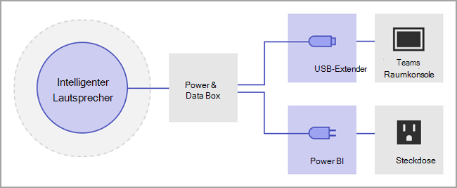
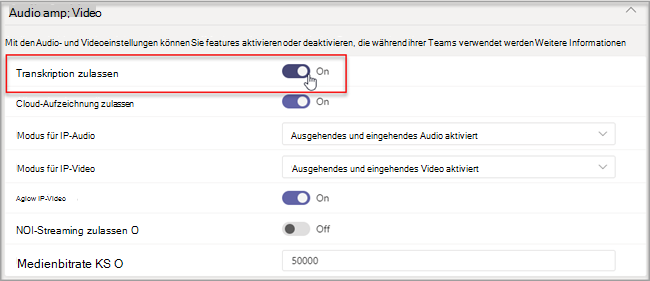

# Verwalten von Spracherkennungstechnologie-Steuerelementen für einen intelligenten Lautsprecher

Ein intelligenter Lautsprecher verwendet Sprachprofilinformationen, um zu erkennen, wer was in der Live-Transkription gesagt hat. Wenn ein Microsoft Teams-Räume für Windows mit einem intelligenten Lautsprecher ausgestattet ist, kann während der Besprechung live transkription verwendet werden. In diesem Artikel wird erläutert, wie Sie als Mandantenadministrator die Voice-Profilerstellung steuern, die für die Spracherkennung zum Generieren einer Live-Transkription verwendet wird. Sie können steuern, in welchem Umfang die Organisation die Spracherkennung verwendet, und die folgenden Features:

- Bearbeiten Sie den Namen des Sprechers in Aufzeichnungen.
- Ändern des Sprechers einer einzelnen Äußerung in der Aufzeichnung oder Ändern des Sprechers in allen Äußerungen in der Aufzeichnung (jedoch nicht in zukünftigen Aufzeichnungen).
- Ändern Sie die Sprecheridentifikation für die Personen, die in der Besprechung aufgeführt werden.
- Entfernen Sie bei jedem Transkript die Identifizierung einer oder mehrere Äußerungen, die als dieser Sprecher identifiziert wurden.

## Überprüfen der Anforderungen für intelligente Lautsprecher

Ein intelligenter Lautsprecher enthält ein spezielles Array mit sieben Mikrofonen. Das System verwendet Sprachprofilinformationen, um Stimmen von bis zu 10 Personen in Besprechungsräumen zu identifizieren.

Die folgenden Punkte sind Anforderungen an intelligente Lautsprecher:

- Der Kunden-Mandant muss sich in den USA (Nordamerika) befinden. 1
- Der Besprechungsraum sollte maximal 10 Personen persönlich anwesend sein.
- Der Besprechungsraum verfügt über einen Uploadlink von mindestens 7 MBit/s.

 1 Ein intelligenter Lautsprecher und ein zugehöriges Sprachprofil und die zugehörige Nutzung sind nur in EN-US-Sprachen und für Mandanten der US-Region (NA-US Region) verfügbar. Beide Bedingungen müssen erfüllt sein, damit ein Mandantenbenutzer einen intelligenten Lautsprecher für die attributierte Transkription registrieren und verwenden kann.

## Einrichten eines intelligenten Lautsprechers

Ein intelligenter Lautsprecher stellt eine direkte Verbindung über USB mit der Teams-Räume fest. Um optimale Ergebnisse zu erzielen, sollte ein intelligenter Lautsprecher der Marke Yealink mit einer Yealink-Markenkonsole verwendet werden.

> [!NOTE]
> Ein intelligenter Yealink-Lautsprecher **muss** mit einer Yealink-Konsole verwendet werden.

> [!NOTE]
> Wir unterstützen keinen intelligenten Lautsprecher, der mit Logitech Surface Pro Microsoft Teams-Räume. Es gibt ein bekanntes Problem, Teams-Räume den intelligenten Lautsprecher nicht über die Docking-Station erkennen kann.

Ein intelligenter Lautsprecher sollte mindestens 20 cm von Wänden und großen Objekten wie Laptops entfernt platziert werden. Wenn das USB-Kabel für intelligente Lautsprecher nicht lange genug für Ihr Setup ist, verwenden Sie Kabel-Extender.

1. Melden Sie sich bei der Konsole als Administrator an.
2. Legen Sie die Teams Ihres Geräts so fest, dass sie dem Mikrofon und Lautsprecher des intelligenten Lautsprechers entsprechen.
   Dies können Sie auch über das TAC-Portal statt über die Raumkonsole tun.

   Das Diagramm zeigt, wie der intelligente Lautsprecher an das Gerät angeschlossen wird, wenn das Gerät ein Datenfeld enthält.

   

   Das Diagramm zeigt, wie der intelligente Lautsprecher an das Gerät angeschlossen wird, wenn das Gerät kein Datenfeld enthält.

   

> [!Note]
> DIES- und Yealink-Geräte sollten das Präfix "WENNS" oder "Yealink" haben und im Lautsprechernamen "UAC2_RENDER" und im Mikrofonnamen "UAC2_TEAMS" enthalten. Wenn Sie diese Mikrofon- und Lautsprechernamen nicht im Dropdownmenü finden, starten Sie das Gerät mit dem intelligenten Lautsprecher neu.

## Aktivieren einer Intelligenten Lautsprecher-Benutzererkennung

Sprachprofildaten können in jeder Besprechung mit einem intelligenten Lautsprecher verwendet werden. Informationen [zu Teams Besprechungseinstellungen finden](../meeting-policies-in-teams.md#allow-transcription) Sie unter Verwalten von Besprechungsrichtlinien und den [PowerShell-Besprechungs-Cmdlets.](/powershell/module/skype/set-csteamsmeetingpolicy?view=skype-ps)

Die Sprachprofildaten des Benutzers werden erstellt, wenn die Richtlinie festgelegt ist, um zu unterscheiden, oder wenn eine Person, die keine Besprechung anberaumt, während der Besprechung eingiert. Die Sprachprofildaten werden am Ende der Besprechung verworfen.

Im Folgenden sind die erforderlichen Richtlinien zum Festlegen eines intelligenten Lautsprechers und einer Benutzererkennung erforderlich.

|Richtlinie|Beschreibung|Werte und Verhalten|
|-|-|-|
|enrollUserOverride|Verwenden Sie , um sprachprofilaufzeichnung oder -registrierung in den Teams für einen Mandanten fest. |**Deaktiviert** <ul><li> Benutzer, die sich noch nie registriert haben, können keine Informationen anzeigen, registrieren oder erneut registrieren.<li>Der Einstiegspunkt für den Registrierungsablauf wird ausgeblendet.<li>Wenn Benutzer einen Link zur Registrierungsseite auswählen, wird eine Meldung angezeigt, die besagt, dass dieses Feature für ihre Organisation nicht aktiviert ist.  <li>Benutzer, die sich registriert haben, können ihr Sprachprofil in den Einstellungen Teams entfernen. Nachdem sie ihr Sprachprofil entfernt haben, kann sie den Registrierungsablauf nicht mehr anzeigen, darauf zugreifen oder diesen abschließen.</li></ul> **Aktiviert** <ul><li> Benutzer können den Registrierungsablauf anzeigen, darauf zugreifen und diesen abschließen.<li>Der Einstiegspunkt wird auf der Teams auf der Registerkarte **Erkennung** angezeigt.</li></ul>|
|roomAttributeUserOverride|Steuern Sie die sprachbasierte Benutzeridentifikation in Besprechungsräumen. Diese Einstellung ist für Alle Teams-Räume erforderlich.| **Aus** <ul><li>Das Teams-Räume sendet keine Bandbreite zum Sparen von Audiodatenstromen aus dem Raum. <li>Besprechungsraumbenutzer werden nicht attributiert oder unterschieden, und ihre Sprachsignaturen werden nicht abgerufen oder verwendet.<li>Benutzer von Besprechungsraum sind unbekannt.</li></ul>  **Attribut** <ul><li>Die Benutzer von Räumen werden basierend auf ihrem Registrierungsstatus attributiert.<li>Registrierte Benutzer werden in der Transkription mit ihrem Namen angezeigt.  <li>Nicht registrierte Benutzer werden als Lautsprecher n angezeigt.<li>Das Teams-Räume sendet sieben Audiodatenströme aus dem Raum.</ul>  **Distinguish**  *Diese Einstellung wird zu einem späteren Zeitpunkt verfügbar sein.*|
|AllowTranscription|Erforderlich für Benutzer- Teams für Räume.|**Wahr** und **falsch**|
||||

Legen Sie Teams Admin Center die Richtlinie **Transkription** zulassen. Einstellungen standardmäßig **auf Aus** festgelegt.

## Häufig gestellte Fragen (FAQ)

**Wo werden die Sprachprofildaten gespeichert?**

Sprachprofildaten werden in Office 365 mit Benutzerinhalten gespeichert.

**Was ist die Aufbewahrungszeitachse und -richtlinie?**

Die allgemeine Aufbewahrungsrichtlinie ist in der Übersicht [Datenaufbewahrung angegeben.](/compliance/assurance/assurance-data-retention-deletion-and-destruction-overview) Darüber hinaus werden die Sprachprofildaten eines Benutzers nach 3 Jahren gelöscht, wenn der Benutzer innerhalb dieses Zeitraums von 3 Jahren nicht zu Besprechungen mit einem intelligenten Lautsprecher eingeladen wird. In Besprechungen für vorhandene Mitarbeiter werden keine Daten verwendet. Wenn ein Mitarbeiter das Unternehmen verlassen hat, werden Sprachprofildaten als Benutzerinhalte betrachtet und als solche behandelt, wie Office 365 in der Übersicht Datenaufbewahrung [beschrieben wird.](/compliance/assurance/assurance-data-retention-deletion-and-destruction-overview)

**Werden Sprachprofildaten übergreifend Microsoft-Dienste?**

Nein, Sprachprofildaten werden nur für den Zweck verwendet, zu dem der Benutzer seine Zustimmung gegeben hat. Microsoft verwendet die Sprachprofildaten nur innerhalb Teams Spracherkennungsszenarien.

Microsoft verwendet die Daten beispielsweise nicht in den folgenden Situationen:

**Werden meine Sprachprofildaten verwendet, wenn ich an einer Besprechung in einer anderen Organisation teiln kann?**

Nicht nur in Besprechungen, die von einem Benutzer in Ihrer Organisation organisiert werden.

**Wie kann ich mein Sprachprofil exportieren?**

Ihr IT-Administrator kann Ihre Audiodaten jederzeit exportieren.

## Verwandte Themen

[Supportartikel: Verwenden von intelligenten Lautsprechern zum Identifizieren von Teilnehmern im Raum ](https://support.microsoft.com/office/use-teams-intelligent-speakers-to-identify-in-room-participants-in-meeting-transcription-a075d6c0-30b3-44b9-b218-556a87fadc00)
