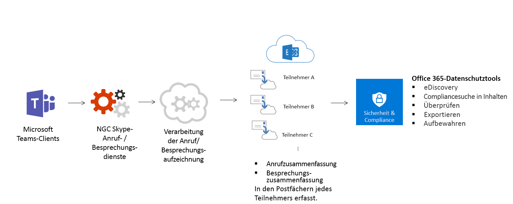

Übersicht über Sicherheit und Compliance in Microsoft TeamsOverview of security and compliance in Microsoft Teams
======================================================

Microsoft Teams basiert auf der Office 365-Cloud auf Unternehmensniveau mit Hyperskalierung und bietet die erweiterten Sicherheits- und Compliance-Funktionen, die unsere Kunden erwarten.Microsoft Teams is built on the Office 365 hyper-scale, enterprise-grade cloud, delivering the advanced security and compliance capabilities our customers expect.

Teams ist Stufe D-kompatibel.Teams is Tier D-compliant. Dies umfasst die folgenden Standards: ISO 27001, ISO 27018, SSAE16 SOC 1-und SOC 2-, HIPAA-und EU-Modellklauseln (EUMC).This includes the following standards: ISO 27001, ISO 27018, SSAE16 SOC 1 and SOC 2, HIPAA, and EU Model Clauses (EUMC). Innerhalb des Microsoft Compliance-Rahmens stuft Microsoft Office 365-Anwendungen und-Dienste in vier Kategorien um.Within the Microsoft compliance framework, Microsoft classifies Office 365 applications and services into four categories. Jede Kategorie wird durch spezifische Compliance-Zusagen definiert, die bei einem Office 365-Dienst oder einem zugehörigen Microsoft-Dienst erfüllt sein müssen, um in dieser Kategorie aufgeführt zu werden.Each category is defined by specific compliance commitments that must be met for an Office 365 service, or a related Microsoft service, to be listed in that category.

Dienste in den Compliance-Kategorien C und D, für die branchenführende Compliance-Verpflichtungen gelten, sind standardmäßig aktiviert. Dienste der Kategorien A und B verfügen über Steuermöglichkeiten, mit denen diese Dienste organisationsweit aktiviert oder deaktiviert werden können. Details hierzu finden Sie im Dokument zum [Compliance-Framework für Branchenstandards und -bestimmungen](https://go.microsoft.com/fwlink/?linkid=855777). Microsoft Teams unterstützt außerdem Cloud Security Alliance-Compliance.Services in compliance categories C and D that have industry-leading compliance commitments are enabled by default. Services in categories A and B come with controls to turn on or turn off these services for an entire organization. Details can be found in the [Compliance Framework for Industry Standards and Regulations](https://go.microsoft.com/fwlink/?linkid=855777). Teams also supports Cloud Security Alliance compliance.

Teams erzwingt auch teamübergreifende und organisationsweite zweistufige Authentifizierung, einmaliges Anmelden über Active Directory und Verschlüsselung von Daten in der Übertragung und im Ruhezustand.Teams also enforces team-wide and organization-wide two-factor authentication, single sign-on through Active Directory, and encryption of data in transit and at rest. Dateien werden in SharePoint gespeichert und durch die SharePoint-Verschlüsselung gesichert.Files are stored in SharePoint and are backed by SharePoint encryption. Notizen werden in OneNote gespeichert und durch die OneNote-Verschlüsselung gesichert.Notes are stored in OneNote and are backed by OneNote encryption. Die OneNote-Daten werden auf der SharePoint-Teamwebsite gespeichert.The OneNote data is stored in the team SharePoint site. Die Registerkarte "wiki" kann auch zum Aufzeichnen von Notizen verwendet werden, und der Inhalt wird auch auf der SharePoint-Teamwebsite gespeichert.The Wiki tab can also be used for note taking and it's content is also stored within the team SharePoint site.

Außerdem haben wir Unterstützung für Überwachungsprotokollsuche, eDiscovery und gesetzliche Aufbewahrungspflicht für Kanäle, Chats und Dateien sowie mobile Anwendungsverwaltung mit Microsoft Intune hinzugefügt.We also added support for audit log search, eDiscovery and legal hold for channels, chats and files as well as mobile application management with Microsoft Intune. Wechseln Sie zum Office 365 Security #a0 Compliance Center, um diese Einstellungen zu verwalten.Go to the Office 365 Security & Compliance Center to manage these settings. 

Weitere Informationen zu Office 365 Security #a0 Compliance finden Sie unter [Konfigurieren Ihres Office 365-Mandanten für erhöhte Sicherheit](https://docs.microsoft.com/office365/securitycompliance/tenant-wide-setup-for-increased-security)To learn more about Office 365 security & compliance, read [Configure your Office 365 tenant for increased security](https://docs.microsoft.com/office365/securitycompliance/tenant-wide-setup-for-increased-security)

## Überwachung und BerichterstellungAuditing and Reporting

Die Überwachungsprotokoll Suche wird direkt in das Office 365 Security #a0 Compliance Center übermittelt und macht Fähigkeiten zum Festlegen von Benachrichtigungen und/oder Berichte zu Überwachungsereignissen verfügbar, indem Sie für die Verwendung und Untersuchung von Arbeitslasten spezifische oder generische Ereignis Sätze für die Verwendung durch Administratoren bereitstellen und über eine unbegrenzte Überwachungs Zeitachse.Audit log search plugs right into the Office 365 Security & Compliance Center and exposes abilities to set alerts and/or report on Audit event by making available, export of workload specific or generic event sets for admin use and investigation, across an unlimited auditing timeline. Alle Überwachungsprotokolldaten stehen zum Einrichten von Benachrichtigungen im Office 365 Security #a0 Compliance Center sowie zum Filtern und exportieren zur weiteren Analyse zur Verfügung.All Audit Log data is available for setting up of alerts within the Office 365 Security & Compliance Center, as well as for filtering and export for further analysis. Weitere Informationen zum durch  führen einer Überwachungsprotokoll Suche nach Microsoft Teams-Ereignissen finden Sie im Office 365 Security #a0 Compliance Center.Please refer to this [link](https://support.office.com/article/Search-the-audit-log-in-the-Office-365-Security-Compliance-Center-0d4d0f35-390b-4518-800e-0c7ec95e946c) to learn more about how to conduct an Audit log search for Microsoft Teams events in the Office 365 Security & Compliance Center. 

## Compliancesuche in InhaltenCompliance Content Search

Mit der Inhaltssuche können Sie über Rich-Filterfunktionen nach allen Teams-Daten suchen und in einen bestimmten Container exportieren, um Compliance-und Litigation-Unterstützung zu erhalten.Content Search can be used to search for all Teams data through rich filtering capabilities and exported to a specific container for compliance and litigation support. Dies kann mit oder ohne eDiscovery-Fall erfolgen.This can be done with or without an eDiscovery case. Dies ermöglicht es Compliance-Administratoren, Team Daten für alle Benutzer zu sammeln, zu überprüfen und zur weiteren Verarbeitung zu exportieren.This enables compliance admins to gather Teams data across all users, review and export it for further processing. Weitere Informationen zum durch  führen einer Compliance-Inhaltssuche nach Microsoft Teams-Inhalten finden Sie im Office 365 Security #a0 Compliance Center.Please refer to this [link](https://support.office.com/article/content-search-in-office-365-53390468-eec6-45cb-b6cd-7511f9c909e4) to learn more about how to conduct a compliance content search for Microsoft Teams content in the Office 365 Security & Compliance Center. 

Tipp: die Art Microsoft Teams kann verwendet werden, um nach Microsoft Teams nur Inhalte zu filtern, also Chats und Kanal Nachrichten, Besprechungen und Anrufe.Tip: The kind Microsoft Teams can be used to filter through to Microsoft Teams only content i.e. Chat and Channel Messages, Meetings and Calls. 

## eDiscoveryeDiscovery

Bei eDiscovery handelt es sich um den elektronischen Aspekt beim Identifizieren, Sammeln und Erzeugen von elektronisch gespeicherten Informationen (ESI) als Reaktion auf die Aufforderung zur Vorlage dieser Informationen in einem Rechtsstreit oder einer Untersuchung.Electronic discovery is the electronic aspect of identifying, collecting and producing electronically stored information (ESI) in response to a request for production in a law suit or investigation. Zu den Funktionen gehören Fallverwaltung, Aufbewahrung, Suche, Analyse und Export von Teams-Daten.Capabilities include case management, preservation, search, analysis, and export of Teams data. Dazu gehören Chats, Nachrichten und Dateien, Besprechungen und Anruf Zusammenfassungen.This includes chat, messaging and files, meeting and call summaries. Für Teams-Besprechungen und-Anrufe werden eine Zusammenfassung der Ereignisse erstellt, die in der Besprechung und dem Anruf durchgeführt wurden und in eDiscovery zur Verfügung gestellt werden.For Teams meetings and Calls, a summary of the events that happened in the meeting and call are created and made available in eDiscovery. 

Weitere Informationen dazu, wie Sie eDiscovery im Security #a0 Compliance Center durchführen und Compliance-Inhaltssuche nach Teams-Inhalten ausführen, finden Sie unter den folgenden Links:For more details about how to do eDiscovery in Security & Compliance Center and run compliance content search for Teams content, please go to the links below: 

[eDiscoveryeDiscovery](https://support.office.com/article/manage-legal-investigations-in-office-365-2e5fbe9f-ee4d-4178-8ff8-4356bc1b168e) 

[InhaltssucheContent Search](https://support.office.com/article/search-for-content-in-office-365-df2d1e0f-b476-42c9-aade-4a260b24f193)

Kunden können in-Place-eDiscovery oder [Advanced eDiscovery] je nach Ihren Anforderungenhttps://support.office.com/article/Office-365-Advanced-eDiscovery-fd53438a-a760-45f6-9df4-861b50161ae4)nutzen (.Customers can leverage in-place eDiscovery or [Advanced eDiscovery] per their requirements(https://support.office.com/article/Office-365-Advanced-eDiscovery-fd53438a-a760-45f6-9df4-861b50161ae4). In der folgenden Tabelle sind die Unterschiede zwischen den beiden Funktionen aufgeführt:The following table outlines the differences between the two:

| |In-Situ-eDiscoveryIn-place eDiscovery  |Advanced eDiscoveryAdvanced eDiscovery  |
|---------|---------|---------|
|FallmanagementCase Management     |XX        |XX         |
|ZugriffssteuerungAccess Control  |XX         |XX         |
|Suche in InhaltenContent Searches     |XX         | XX        |
|SpeicherHold(s)   |XX         | XX        |
|ExportExport     |XX         |XX         |
|Erkennung von DuplikatenDuplication Detection     |-         |XX         |
|Relevanzsuche mit maschinellem LernenRelevance Searches with Machine Learning    |-         |XX         |
|Analyse unstrukturierter DatenUnstructured Data Analysis      |-         |XX         |

## Gesetzliche AufbewahrungspflichtLegal Hold

Während eines Rechtsstreits ist es häufig erforderlich, dass alle Daten, die einem Benutzer (Depotbank) oder einem Team zugeordnet sind, unveränderlich bleiben, damit er als Beweis für den Fall verwendet werden kann.During a litigation, it is often required that all data associated with a user (custodian) or a Team is preserved immutably so it can be used as evidence for the case. Dies wird erreicht, indem entweder ein Benutzer (Benutzerpostfach) oder ein Team in rechtlicher Wartestellung platziert wird.This is achieved by placing either a user (user mailbox) or a Team on legal hold. Wenn ein Team innerhalb von Teams in-situ-Speicher (Teilmenge des Postfachs oder der Websitesammlung durch gezielte Abfragen oder gefilterte Inhalte) oder in einem Rechtsstreit (gesamtes Postfach oder Websitesammlung) platziert wird, wird der Haltebereich auf das Postfach "Gruppen" gesetzt.When any team within Teams is put on In-Place Hold (subset of the mailbox or site collection thru targeted queries or filtered content) or Litigation Hold (entire mailbox or site collection), the hold is placed on the groups mailbox. Dadurch wird sichergestellt, dass selbst dann, wenn Endbenutzer Kanal Nachrichten löschen oder bearbeiten, die in das Gruppenpostfach aufgenommen werden, unveränderliche Kopien dieser Inhalte verwaltet werden und in der eDiscovery-Suche verfügbar sind.This ensures that even if end users delete or edit channel messages that are ingested into the group mailbox, immutable copies of that content are maintained and available in eDiscovery search. Gesetzliche Aufbewahrungspflicht wird im Allgemeinen im Kontext eines eDiscovery-Falls angewendet.Legal Holds are generally applied within the context of an eDiscovery case. In [diesem](https://support.office.com/article/overview-of-preservation-policies-9c3b1d52-40ce-4ba3-a520-9ae0be15538a) Hilfeartikel finden Sie weitere Informationen zum Thema Konservierung und Aufbewahrung im Office 365 Security #a0 Compliance Center.Please see [this](https://support.office.com/article/overview-of-preservation-policies-9c3b1d52-40ce-4ba3-a520-9ae0be15538a) help article to understand more about preservation and holds in the Office 365 Security & Compliance Center. 

## Informationsschutz Architektur für Microsoft Teams.Information Protection Architecture for Microsoft Teams. 

Die folgende Abbildung zeigt den Einnahme Fluss von Teams-Daten sowohl in Exchange als auch in SharePoint für Teams-Dateien und-Nachrichten.The following figure indicates the ingestion flow of Teams data to both Exchange and SharePoint for Teams Files and Messages. 

Die folgende Abbildung zeigt den Einnahme Fluss von Teams-Besprechungen und das Aufrufen von Daten an Exchange.The following figure indicates the ingestion flow of Teams Meetings and calling data to Exchange.

> [!IMPORTANT]
> Es kann bis zu 24 Stunden dauern, bis Sie die Inhalte von Teams entdecken können.There can be up to a 24-hour delay to discover Teams content.

LizenzierungLicensing
---------------

Die Funktionen für den Schutz von Informationen hängen von den Office 365-Abonnements und den zugehörigen eigenständigen Lizenzen ab.When it comes to the information protection capabilities, Office 365 subscriptions and the associated standalone licenses will determine the available feature set.

| Funktion für den Schutz von InformationenInformation Protection Capability | Office 365 Business EssentialsOffice 365 Business Essentials | Office 365 Business PremiumOffice 365 Business Premium | Office 365 Enterprise E1Office 365 Enterprise E1 | Office 365 Enterprise E3/E4Office 365 Enterprise E3/E4 | Office 365 Enterprise E5Office 365 Enterprise E5 |
|-----------------------------------|--------------------------------|-----------------------------|--------------------------|-----------------------------|--------------------------|
|              ArchivArchive              |               -                |              -              |            -             |             JaYes             |           JaYes            |
|        In-Situ-eDiscoveryIn-Place eDiscovery        |               -                |              -              |            -             |             JaYes             |           JaYes            |
|        Advanced eDiscoveryAdvanced eDiscovery        |               -                |              -              |            -             |              -              |           JaYes            |
|            Gesetzliche AufbewahrungspflichtLegal Hold             |               -                |              -              |            -             |             JaYes             |           JaYes            |
|     Compliancesuche in InhaltenCompliance Content Search     |               -                |             JaYes             |           JaYes            |             JaYes             |           JaYes            |
|      Überwachung und BerichterstellungAuditing and Reporting       |              JaYes               |             JaYes             |           JaYes            |             JaYes             |           JaYes            |
|       Bedingter Zugriff\*Conditional Access\*        |              JaYes               |             JaYes             |           JaYes            |             JaYes             |           JaYes            |

> [!NOTE]
> \*Für bedingten Zugriff sind zusätzliche Lizenzen erforderlich.\*Conditional Access requires additional licenses

| |  |  |
|---------|---------|---------|
|     |EntscheidungspunktDecision point         |Verfügt Ihre Organisation über die erforderlichen Lizenzen, um die geschäftlichen Compliance- und Sicherheitsanforderungen zu erfüllen?Does your organization have the required licenses to meet Compliance and Security business requirements?         |
|    |Nächste SchritteNext steps         |Überprüfen Sie die aktuelle Lizenzierung Ihrer Organisation, und bestätigen Sie, dass Sie alle geschäftlichen Anforderungen hinsichtlich Compliance und Sicherheit erfüllt.Review your organization's current licensing and confirm it meets all business requirements for compliance and security.         |

Bevor Sie diese Features aktivieren, stellen Sie sicher, dass Sie im Microsoft 365 Admin Center auf das Security #a0 Compliance Center zugreifen können.Before enabling any of these features, ensure you have access to the Security & Compliance Center in the Microsoft 365 admin center. Mandantenadministratoren verfügen standardmäßig über Zugriff.By default, tenant admins have access.

Die Inhaltssuche und eDiscovery erfordern keine Aktivierung im Security #a0 Compliance Center.Content Search and eDiscovery do not require enablement in the Security & Compliance Center.

Speicherort von Daten in Microsoft TeamsLocation of data in Teams
-------------------------

Die Microsoft Teams-Daten befinden sich in der geografischen Region, die Ihrem Office 365-Mandanten zugeordnet ist.Data in Teams resides in the geographic region associated with your Office 365 tenant. Derzeit unterstützt Microsoft Teams die Regionen Australien, Kanada, Frankreich, Indien, Japan, Großbritannien, Nordamerika, APAC und EMEA.Currently, Teams supports the Australia, Canada, France, India, Japan, UK, Americas, APAC, and EMEA regions. 

> [!IMPORTANT]
> Teams bietet derzeit Daten in Australien, Kanada, Frankreich, Indien, Japan und Großbritannien für neue Mandanten an.Teams currently offers data residency in Australia, Canada, France, India, Japan, and the UK for new tenants only. Ein neuer Mandant wird definiert als ein Mandant, über den sich noch kein einziger Benutzer bei Microsoft Teams angemeldet hat.A new tenant is defined as any tenant that hasn’t had a single user from the tenant sign in to Teams. Bestehende Mandanten aus Australien, Indien und Japan werden Ihre Teams-Daten weiterhin in der Region APAC speichern.Existing tenants from Australia, India, and Japan will continue to have their Teams data stored in the APAC region. Bestehende Mandanten in Kanada werden Ihre Daten weiterhin in Amerika speichern.Existing tenants in Canada will continue to have their data stored in the Americas. Bestehende Mandanten in Frankreich und Großbritannien werden Ihre Daten weiterhin in der EMEA-Region speichern.Existing tenants in France and the United Kingdom will continue to have their data stored in the EMEA region.

Weitere Informationen zur Einführung der Datenspeicherung für Microsoft Teams in Indien und im Vereinigten Königreich finden Sie in Ansuman Acharyas Blogbeitrag zur [Einführung der Datenspeicherung für Microsoft Teams in Indien und zu geplanten weiteren geografischen Regionen](https://techcommunity.microsoft.com/t5/Microsoft-Teams-Blog/Microsoft-Teams-Launches-Australia-and-Japan-Data-Residency/ba-p/237827).To learn more about the launch of India and UK data residency for Teams, read Ansuman Acharya's blog post, [Microsoft Teams launches India Data Residency, other geos coming soon](https://techcommunity.microsoft.com/t5/Microsoft-Teams-Blog/Microsoft-Teams-Launches-Australia-and-Japan-Data-Residency/ba-p/237827). 

Weitere Informationen zu Kanada Data Residency für Teams finden Sie im Blogbeitrag von Varun Sagar, [Microsoft Teams startet Kanada Data Residency, Australien und Japan in Kürze](https://techcommunity.microsoft.com/t5/Microsoft-Teams-Blog/Microsoft-Teams-Launches-Canada-Data-Residency-Australia-and/ba-p/227178).For more information on Canada data residency for Teams, read Varun Sagar's blog post, [Microsoft Teams Launches Canada Data Residency, Australia and Japan coming soon](https://techcommunity.microsoft.com/t5/Microsoft-Teams-Blog/Microsoft-Teams-Launches-Canada-Data-Residency-Australia-and/ba-p/227178). 

Wenn Sie mehr über die Einführung von Australien und Japan Data Residency für Teams erfahren möchten, lesen Sie den Blogbeitrag von Varun Sagar, [Microsoft Teams startet den Daten Wohnsitz in Australien und Japan ](https://go.microsoft.com/fwlink/?linkid=867773).To learn more about the launch of Australia and Japan data residency for Teams, read Varun Sagar's blog post, [Microsoft Teams Launches Australia and Japan Data Residency ](https://go.microsoft.com/fwlink/?linkid=867773). 

Wenn Sie mehr über die Einführung von France Data Residency für Teams erfahren möchten, lesen Sie den Blogbeitrag von Varun Sagar, [Microsoft Teams startet France Data Residency](https://techcommunity.microsoft.com/t5/Microsoft-Teams-Blog/Microsoft-Teams-launches-France-Data-Residency/ba-p/364466).To learn more about the launch of France data residency for Teams, read Varun Sagar's blog post, [Microsoft Teams Launches France Data Residency](https://techcommunity.microsoft.com/t5/Microsoft-Teams-Blog/Microsoft-Teams-launches-France-Data-Residency/ba-p/364466).

Wenn Sie sehen möchten, in welcher Region Daten für Ihren Mandanten angezeigt werden, wechseln Sie zum [Microsoft 365 Admin Center](https://portal.office.com/adminportal/home) > **Settings** > **Organization Profile**.To see which region houses data for your tenant, go to the [Microsoft 365 admin center](https://portal.office.com/adminportal/home) > **Settings** > **Organization profile**. Scrollen Sie nach unten zu **Data location** (Datenspeicherort).Scroll down to **Data location**. 

Wie funktionieren bedingte Zugriffsrichtlinien für Teams?How do Conditional Access policies work for Teams?
-------------------------

Microsoft Teams ist in hohem Maße auf Exchange Online, SharePoint Online und Skype for Business Online für Kern Produktivitätsszenarien wie Besprechungen, Kalender, Interop-Chats und Dateifreigabe angewiesen.Microsoft Teams relies heavily on Exchange Online, SharePoint Online, and Skype for Business Online for core productivity scenarios, like meetings, calendars, interop chats, and file sharing. Für diese Cloud-apps festgelegte Richtlinien für den bedingten Zugriff gelten für Microsoft Teams, wenn sich ein Benutzer direkt bei Microsoft Teams anmeldet – auf einem beliebigen Client.Conditional access policies that are set for these cloud apps apply to Microsoft Teams when a user directly signs in to Microsoft Teams - on any client. 

Microsoft Teams wird in Azure Active Directory-Richtlinien für den bedingten Zugriff separat als Cloud-App unterstützt.Microsoft Teams is supported separately as a cloud app in Azure Active Directory conditional access policies. Für die Microsoft Teams Cloud-App festgelegte Richtlinien für den Zugriffs Zugriff gelten für Microsoft Teams, wenn sich ein Benutzer anmeldet.Conditional access policies that are set for the Microsoft Teams cloud app apply to Microsoft Teams when a user signs in. Ohne die richtigen Richtlinien für andere apps wie Exchange Online und SharePoint Online können Benutzer jedoch weiterhin direkt auf diese Ressourcen zugreifen.However, without the correct policies on other apps like Exchange Online and SharePoint Online, users may still be able to access those resources directly. Weitere Informationen zum Einrichten einer Richtlinie für den bedingten Zugriff im Azure-Portal finden Sie unter: (https://docs.microsoft.com/azure/active-directory/active-directory-conditional-access-azure-portal-get-started)For more information about setting up a conditional access policy in the azure portal, go to: (https://docs.microsoft.com/azure/active-directory/active-directory-conditional-access-azure-portal-get-started) 

Microsoft Teams-Desktop Clients für Windows und Mac unterstützen die moderne Authentifizierung.Microsoft Teams desktop clients for Windows and Mac support modern authentication. Bei der modernen Authentifizierung wird die Anmeldung basierend auf der Azure Active Directory Authentication Library (Adal) für Microsoft Office-Clientanwendungen plattformübergreifend durchführt.Modern authentication brings sign-in based on the Azure Active Directory Authentication Library (ADAL) to Microsoft Office client applications across platforms.

Die Microsoft Teams-Desktopanwendung unterstützt AppLocker.Microsoft Teams desktop application supports AppLocker.  Weitere Informationen zu AppLocker-Voraussetzungen finden Sie unter: Voraussetzungen für die Verwendung von AppLocker (https://docs.microsoft.com/windows/security/threat-protection/windows-defender-application-control/applocker/requirements-to-use-applocker).For more information about AppLocker prerequisites, please see: Requirements to use AppLocker (https://docs.microsoft.com/windows/security/threat-protection/windows-defender-application-control/applocker/requirements-to-use-applocker).

Datenschutz in Microsoft TeamsPrivacy in Teams
--------------------------

Als Kunde von Office 365 sind Sie der Besitzer der Daten und verfügen auch über die vollständige Kontrolle. Microsoft verwendet Ihre Daten ausschließlich für die Bereitstellung des Diensts, den Sie abonniert haben. Als Dienstanbieter scannen wir nicht Ihre E-Mails, Dokumente oder Teams zu Werbezwecken oder nicht dienstbezogenen Zwecken. Microsoft hat keinen Zugriff auf hochgeladene Inhalte. Genau wie bei OneDrive for Business und SharePoint Online bleiben die Kundendaten im Mandanten.As a customer of Office 365, you own and control your data. Microsoft does not use your data for anything other than providing you with the service that you have subscribed to. As a service provider, we do not scan your email, documents, or teams for advertising or for purposes that are not service-related. Microsoft doesn’t have access to uploaded content. Like OneDrive for Business and SharePoint Online, customer data stays within the tenant.

Weitere Informationen zu unseren Vertrauens-und sicherheitsrelevanten Informationen finden Sie im [Microsoft Trust Center](https://microsoft.com/trustcenter).Check out more about our trust and security related information at the [Microsoft Trust Center](https://microsoft.com/trustcenter). Teams befolgt die gleichen Richtlinien und Grundsätze wie das Microsoft Trust Center.Teams follows the same guidance and principles as the Microsoft Trust Center.

Verwandte ThemenRelated topics
----------------------
[Sichere Office 365 ATP-LinksOffice 365 ATP Safe Links](https://docs.microsoft.com/office365/securitycompliance/atp-safe-links#how-to-get-atp-safe-links-protection)
