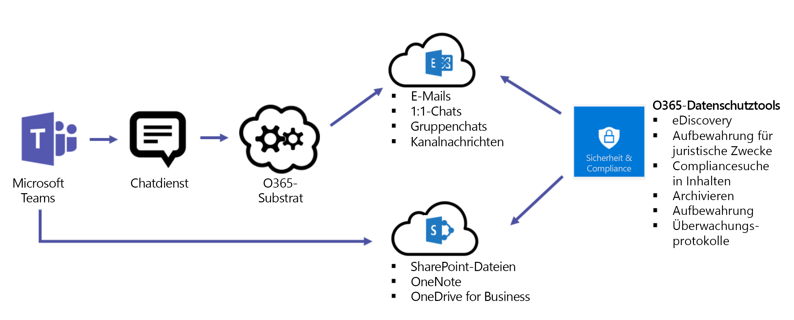
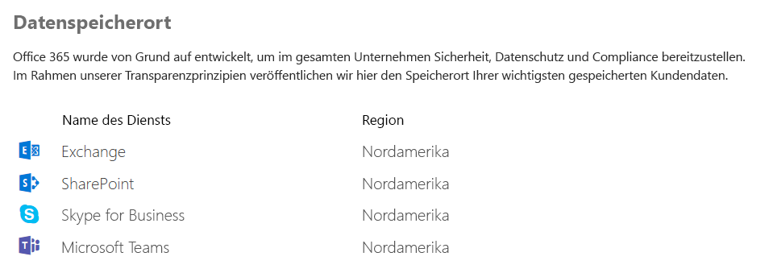

Übersicht über Sicherheit und Compliance in Microsoft Teams
======================================================

Microsoft Teams basiert auf der Office 365-Cloud auf Unternehmensniveau mit Hyperskalierung und bietet die erweiterten Sicherheits- und Compliance-Funktionen, die unsere Kunden erwarten.

Teams ist von der Einführung an mit Stufe C konform. Dazu gehören die folgenden Standards: ISO 27001, ISO 27018, SSAE16 SOC 1 und SOC 2, HIPAA und EU-Standardvertragsklauseln (EU Model Clauses, EUMC). Microsoft klassifiziert innerhalb des Microsoft-Compliance-Frameworks Office 365-Anwendungen und -Dienste in vier Kategorien. Jede Kategorie wird durch bestimmte Compliance-Verpflichtungen definiert, die ein Office 365-Dienst oder ein zugehöriger Microsoft-Dienst erfüllen muss, um in dieser Kategorie geführt zu werden.

Dienste in den Compliance-Kategorien C und D, für die branchenführende Compliance-Verpflichtungen gelten, sind standardmäßig aktiviert. Dienste der Kategorien A und B verfügen über Steuermöglichkeiten, mit denen diese Dienste organisationsweit aktiviert oder deaktiviert werden können. Details hierzu finden Sie im Dokument zum [Compliance-Framework für Branchenstandards und -bestimmungen](https://go.microsoft.com/fwlink/?linkid=855777). Microsoft Teams unterstützt außerdem Cloud Security Alliance-Compliance.

Teams erzwingt außerdem teamweite und organisationsweite zweistufige Authentifizierung, einmaliges Anmelden über Active Directory und Verschlüsselung der übertragenen Daten sowie der ruhenden Daten. Dateien werden in SharePoint gespeichert und mit dem entsprechenden SharePoint-Mechanismus verschlüsselt. Notizen werden in OneNote gespeichert und mit dem entsprechenden OneNote-Mechanismus verschlüsselt.

Außerdem haben wir Unterstützung für Überwachungsprotokollsuche, eDiscovery und gesetzliche Aufbewahrungspflicht für Kanäle, Chats und Dateien sowie mobile Anwendungsverwaltung mit Microsoft Intune hinzugefügt.

Diese Tools befinden sich im Office 365 Security & Compliance-Portal und bieten die folgenden Funktionen:

-   Überwachung und Berichterstellung

    -   Die Überwachungsprotokollsuche ist direkt in das Office 365 Security & Compliance Center integriert und macht Funktionen verfügbar, mit denen Sie Warnungen festlegen und/oder Berichte zu Überwachungsereignissen erstellen können, indem Sie Exporte von arbeitsauslastungsspezifischen oder generischen Ereignissätzen für unbegrenzte Überwachungszeiträume zur Verwendung durch Administratoren und zu Untersuchungszwecken verfügbar machen. Alle Überwachungsprotokolldaten stehen zum Einrichten von Warnungen sowie zum Filtern und Exportieren zur weiteren Analyse im Office 365 Security & Compliance Center zur Verfügung.

-   Compliancesuche in Inhalten

    -   Die Inhaltssuche kann verwendet werden, um Microsoft Teams mit umfangreichen Filterfunktionen zu durchsuchen. Die Inhalte können zur Unterstützung von Compliance und Rechtsstreitigkeiten in einen speziellen Container exportiert werden. Dies kann mit oder ohne eDiscovery-Fall geschehen.

-   eDiscovery

    -   Bei eDiscovery handelt es sich um den elektronischen Aspekt beim Identifizieren, Sammeln und Erzeugen von elektronisch gespeicherten Informationen (ESI) als Reaktion auf die Aufforderung zur Vorlage dieser Informationen in einem Rechtsstreit oder einer Untersuchung.

    -   Zu den Funktionen gehören Fallmanagement, Aufbewahrung, Analyse und Export von Teams-Daten. Dies schließt Chat-, Messaging- und Dateidaten ein.

    -   Kunden können In-Situ-eDiscovery oder [Advanced eDiscovery](https://support.office.com/article/Office-365-Advanced-eDiscovery-fd53438a-a760-45f6-9df4-861b50161ae4) nutzen.

    -   In der folgenden Tabelle sind die Unterschiede zwischen den beiden Funktionen aufgeführt:

| |In-Situ-eDiscovery  |Advanced eDiscovery  |
|---------|---------|---------|
|Fallmanagement     |X        |X         |
|Zugriffssteuerung  |X         |X         |
|Suche in Inhalten     |X         | X        |
|Speicher   |X         | X        |
|Export     |X         |X         |
|Erkennung von Duplikaten     |-         |X         |
|Relevanzsuche mit maschinellem Lernen    |-         |X         |
|Analyse unstrukturierter Daten      |-         |X         |

-   Gesetzliche Aufbewahrungspflicht

    -   Wenn für ein Team in Microsoft Teams ein In-Situ-Speicher oder Beweissicherungsverfahren aktiviert wird, gilt dies für das Gruppenpostfach.

    -   Gesetzliche Aufbewahrungspflicht wird im Allgemeinen im Kontext eines eDiscovery-Falls angewendet.

Die folgende Abbildung zeigt den Workflow von Teams-Daten zu Exchange und SharePoint.

> [!IMPORTANT]
> Beim Ermitteln von Microsoft Teams-Inhalten ist eine Verzögerung von bis zu 24 Stunden möglich.

Außerdem zieht Microsoft die Bereitstellung der folgenden Sicherheitsfunktionen für Teams in Betracht. Wenn die Funktionen verfügbar sind, werden Leitfäden dazu bereitgestellt, wie Kunden die Funktionen nutzen können.

-   Mandantenspezifische Aufbewahrungsrichtlinie

-   Verhinderung von Datenverlust (Data Loss Prevention, DLP)

-   Kunden-Lockbox

-   Rechteverwaltung

| | | |
|---------|---------|---------|
|     |Entscheidungspunkt         |Welche Sicherheits- und Compliance-Funktionen benötigt Ihre Organisation? Verfügt Ihre Organisation über die erforderlichen Lizenzen, um die geschäftlichen Sicherheits- und Compliance-Anforderungen zu erfüllen?         |
|     |Nächste Schritte         |Dokumentieren Sie die erforderlichen Sicherheits- und Compliance-Funktionen in der folgenden Tabelle.         |

Lizenzierung
---------------

Die Funktionen für den Schutz von Informationen hängen von den Office 365-Abonnements und den zugehörigen eigenständigen Lizenzen ab.

|Funktion für den Schutz von Informationen   |Office 365 Business Essentials   |Office 365 Business Premium   |Office 365 Enterprise E1   |Office 365 Enterprise E3/E4   |Office 365 Enterprise E5   |
|---|---|---|---|---|---|
|Archiv|-  |-   |-   |Ja   |Ja   |
|In-Situ-eDiscovery|-   |-   |-   |Ja   |Ja   |
|Advanced eDiscovery|-   |-   |-   |-   |Ja   |
|Gesetzliche Aufbewahrungspflicht|-   |-   |-   |Ja   |Ja   |
|Compliancesuche in Inhalten|- |- |- |Ja |Ja |
|Überwachung und Berichterstellung|Ja |Ja |Ja |Ja |Ja |
|Bedingter Zugriff* |Ja |Ja |Ja |Ja |Ja |
\*Für bedingten Zugriff sind zusätzliche Lizenzen erforderlich.

| |  |  |
|---------|---------|---------|
|     |Entscheidungspunkt         |Verfügt Ihre Organisation über die erforderlichen Lizenzen, um die geschäftlichen Compliance- und Sicherheitsanforderungen zu erfüllen?         |
|    |Nächste Schritte         |Überprüfen Sie die aktuellen Lizenzen Ihrer Organisation, und vergewissern Sie sich, dass diese alle geschäftlichen Anforderungen in Bezug auf Compliance und Sicherheit erfüllen.         |

Bevor Sie diese Funktionen aktivieren, müssen Sie sicherstellen, dass Sie auf das Security & Compliance Center im Office 365 Admin Center zugreifen können. Mandantenadministratoren verfügen standardmäßig über Zugriff.

Die Suche in Inhalten und eDiscovery müssen nicht im Security & Compliance Center aktiviert werden.

Speicherort von Daten in Microsoft Teams
-------------------------

Die Microsoft Teams-Daten befinden sich in der geografischen Region, die Ihrem Office 365-Mandanten zugeordnet ist. Zurzeit unterstützt Teams die Regionen Amerika, EMEA und APAC. 

> [!IMPORTANT]
> Microsoft Teams bietet zurzeit nur für neue Mandanten die Datenspeicherung im Vereinigten Königreich und in Indien an. Ein neuer Mandant wird definiert als ein Mandant, über den sich noch kein einziger Benutzer bei Microsoft Teams angemeldet hat. Vorhandene Mandanten aus dem Vereinigten Königreich und aus Indien bleiben bis zur Ankündigung eines Migrationsplans (voraussichtlich im Jahr 2018) in der Region EMEA bzw. APAC.

Weitere Informationen zur Einführung der Datenspeicherung für Microsoft Teams in Indien und im Vereinigten Königreich finden Sie in Ansuman Acharyas Blogbeitrag zur [Einführung der Datenspeicherung für Microsoft Teams in Indien und zu geplanten weiteren geografischen Regionen](https://go.microsoft.com/fwlink/?linkid=867773).

Wenn Sie wissen möchten, in welcher Region sich die Daten für Ihren Mandanten befinden, wechseln Sie zu [Office 365 Admin Center](https://portal.office.com/adminportal/home) > **Einstellungen** > **Organisationsprofil**. Scrollen Sie nach unten zu **Data location** (Datenspeicherort). 

Datenschutz in Microsoft Teams
--------------------------

Als Kunde von Office 365 sind Sie der Besitzer der Daten und verfügen auch über die vollständige Kontrolle. Microsoft verwendet Ihre Daten ausschließlich für die Bereitstellung des Diensts, den Sie abonniert haben. Als Dienstanbieter scannen wir nicht Ihre E-Mails, Dokumente oder Teams zu Werbezwecken oder nicht dienstbezogenen Zwecken. Microsoft hat keinen Zugriff auf hochgeladene Inhalte. Genau wie bei OneDrive for Business und SharePoint Online bleiben die Kundendaten im Mandanten.

Weitere Informationen zu den Themen „Vertrauensstellung“ und „Sicherheit“ finden Sie im [*Office 365 Trust Center*](https://go.microsoft.com/fwlink/?linkid=855779). Teams folgt den gleichen Leitlinien und Prinzipien wie das Office 365 Trust Center.
