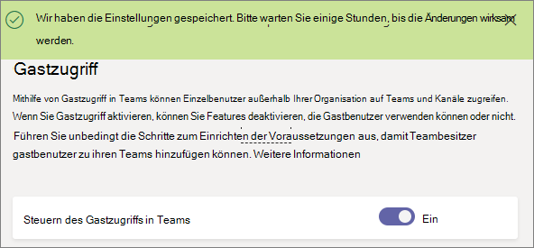

<a name="turn-on-or-off-guest-access-to-microsoft-teams"></a>Aktivieren oder deaktivieren des Gastzugriffs auf Microsoft Teams
======================================

Als Office 365-Administrator müssen Sie die Gastfunktion aktivieren, bevor Sie oder die Benutzer Ihrer Organisation (vor allem Teambesitzer) Gäste hinzufügen können. 

Die Gasteinstellungen werden in Azure Active Directory festgelegt. Es dauert ca. 2 bis 24 Stunden, bis die Änderungen in der gesamten Office 365-Organisation wirksam werden. Wenn ein Benutzer die Meldung erhält "Wenden Sie sich an Ihren Administrator", wenn sie versuchen, ihr Team Gastsystem hinzuzufügen, ist es wahrscheinlich, dass das Feature Gast noch nicht aktiviert wurde, oder die Einstellungen für eine effektive sind noch nicht.

> [!IMPORTANT]
> Um die Nutzung der Gastzugriffsfunktion in vollem Umfang zu ermöglichen, müssen Sie die gegenseitige Abhängigkeit bezüglich der Kernautorisierung von Microsoft Teams, Azure Active Directory und Office 365 verstehen. Weitere Informationen finden Sie unter [Autorisieren des Gastzugriffs in Microsoft Teams](Teams-dependencies.md).

## <a name="guest-access-vs-external-access-federation"></a>Gastzugriff im Vergleich zum externen Zugriff (Verbund)

[!INCLUDE [guest-vs-external-access](includes/guest-vs-external-access.md)]

## <a name="configure-guest-access-in-the-microsoft-teams-admin-center"></a>Konfigurieren des Zugriffs von Gast in der Verwaltungskonsole von Microsoft-Teams

1.  Melden Sie sich bei der Microsoft-Teams-Verwaltungskonsole.

2.  Wählen Sie **gesamte Org Einstellungen** > **Gastzugriff**.

3. Legen Sie die Umschaltfläche **Gast Zugriffsberechtigung in Microsoft-Teams** auf **aktiviert**.

    

4.  Legen Sie die schaltet unter **aufrufen**, **Besprechung**und **Messaging** auf **ein-** oder **Ausschalten**, je nach den Möglichkeiten, den, die Sie für Gastbenutzer zulassen möchten.

    - **Private tätigen** – aktivieren Sie diese Einstellung **auf** um Gäste Peer-zu-Peer-Anrufe tätigen zu ermöglichen.
    - **Zulassen von IP-video** - aktivieren diese Einstellung **auf** Gäste Video in ihre Anrufe und Besprechungen verwenden sollen.
    - **Bildschirmfreigabe Modus** – diese Einstellung steuert die Verfügbarkeit der Bildschirmfreigabe für Gastbenutzer. 
       - Aktivieren Sie diese Einstellung, um **deaktiviert** die Möglichkeit für ihre Bildschirme in Teams freigeben Gäste entfernen. 
       - Aktivieren Sie diese Einstellung, um **einzelne Anwendung** um Freigabe von einzelnen Anwendungen zu ermöglichen. 
       - Aktivieren Sie diese Einstellung, um den **gesamten Bildschirm** aus, um die vollständige Bildschirmfreigabe zulassen.
    - **Zulassen "Jetzt besprechen"** – aktivieren Sie diese Einstellung **auf** um Gäste mit der Funktion "Jetzt besprechen" in Microsoft-Teams zu ermöglichen.
    - **Bearbeiten gesendete Nachrichten** - aktivieren diese Einstellung **auf** Gäste bearbeiten zu Nachrichten sie zuvor gesendet.
    - **Gäste können gesendete Nachrichten löschen** – aktivieren Sie diese Einstellung **auf** Gäste löschen zu Nachrichten sie zuvor gesendet.
    - **Gruppenchat** – aktivieren Sie diese Einstellung **auf** so übergeben Sie die Gäste der Möglichkeit, Chat in Teams verwenden.
    - **Verwenden Sie Giphys Unterhaltungen** – aktivieren diese Einstellung **auf** um Gäste mit Giphys in Unterhaltungen zu ermöglichen. Giphy ist ein online-Datenbank und die Suchmaschine, mit dem Benutzer suchen und Freigeben von animierte GIF-Dateien. Jede Giphy wird eine Content Bewertung zugewiesen.
    - **Giphy zum Bewerten** – wählen Sie eine Bewertung aus der Dropdown-Liste aus:
       - **Alle Inhalte zulassen** - Gäste können sehen, fügen alle Giphys in Chats, unabhängig von der zum bewerten.
       - **Moderater** - Gäste können Giphys in Chats einfügen, aber einigermaßen aus Versender nicht jugendfreier Inhalte eingeschränkt werden.
       - **Strict** – Gäste können Giphys in Chats einfügen, aber unbedingt Versender nicht jugendfreier Inhalte einfügen eingeschränkt werden.
    - **Verwenden Sie Memes Unterhaltungen** - aktivieren diese Einstellung **auf** um Gäste mit Memes in Unterhaltungen zu ermöglichen.
    - **Verwenden Sie Aufkleber Unterhaltungen** – aktivieren diese Einstellung **auf** um Gäste mit Aufkleber in Unterhaltungen zu ermöglichen. 


5.  Klicken Sie auf **Speichern**.

## <a name="use-powershell-to-turn-guest-access-on-or-off"></a>Verwenden von PowerShell, aktivieren oder deaktivieren Sie Gastzugriff

1.  Laden Sie die Skype für Business Online-PowerShell-Modul aushttps://www.microsoft.com/en-us/download/details.aspx?id=39366
 
2.  Verbinden Sie eine PowerShell-Sitzung mit der Skype für Business Online Endpunkt.

    ```
    Import-Module SkypeOnlineConnector
    $Cred = Get-Credential
    $CSSession = New-CsOnlineSession -Credential $Cred
    Import-PSSession -Session $CSSession
    ```
3.  Überprüfen Sie die Konfiguration und wenn `AllowGuestUser` ist `$False`, verwenden Sie das Cmdlet " [Set-CsTeamsClientConfiguration](https://docs.microsoft.com/powershell/module/skype/set-csteamsclientconfiguration?view=skype-ps) ", um diese Liste festgelegt, `$True`.

    ```
    Get-CsTeamsClientConfiguration

    Identity                         : Global
    AllowEmailIntoChannel            : True
    RestrictedSenderList             :
    AllowDropBox                     : True
    AllowBox                         : True
    AllowGoogleDrive                 : True
    AllowShareFile                   : True
    AllowOrganizationTab             : True
    AllowSkypeBusinessInterop        : True
    ContentPin                       : RequiredOutsideScheduleMeeting
    AllowResourceAccountSendMessage  : True
    ResourceAccountContentAccess     : NoAccess
    AllowGuestUser                   : True
    AllowScopedPeopleSearchandAccess : False
    
    Set-CsTeamsClientConfiguration -AllowGuestUser $True -Identity Global
    ```
Sie können jetzt Gastbenutzer in Teams für Ihre Organisation verwenden.

## <a name="more-information"></a>Weitere Informationen

Das folgende Video ausführliche Informationen zum Gastzugriff.

|  |  |
|---------|---------|
| Hinzufügen von Gästen in Microsoft Teams   | <iframe width="350" height="200" src="https://www.youtube.com/embed/1daMBDyBLZc" frameborder="0" allowfullscreen></iframe>   | 
