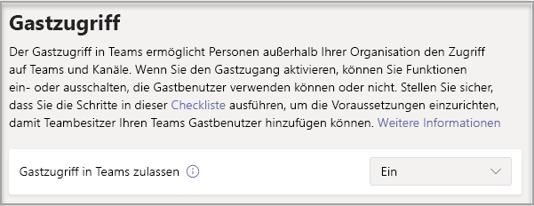

# Aktivieren oder Deaktivieren des Gastzugriffs auf Microsoft Teams

> [!Note]
>
> Bis **Februar 2021** ist der Gastzugriff ist standardmäßig deaktiviert. Sie müssen den Gastzugriff für Teams aktivieren, bevor Administratoren oder Teambesitzer Gäste hinzufügen können. Nach dem Aktivieren des Gastzugriffs dauert es möglicherweise ein paar Stunden, bis die Änderungen wirksam werden. Wenn Benutzer versuchen, einen Gast zu ihrem Team hinzuzufügen, und dabei die Meldung **Wenden Sie sich an Ihren Administrator** sehen, ist wahrscheinlich der Gastzugriff nicht aktiviert, oder die Einstellungen sind noch nicht wirksam.
>
> Ab **Februar 2021** wird der Gastzugriff in Microsoft Teams für Neukunden & Bestandskunden, die diese Einstellung nicht konfiguriert haben, standardmäßig aktiviert. Wenn diese Änderung implementiert ist, wird die Gastzugriffsfunktion auf Ihrem Mandanten aktiviert, sofern Sie diese nicht bereits in Microsoft Teams konfiguriert haben. Wenn Sie möchten, dass der Gastzugriff für Ihre Organisation deaktiviert bleibt, müssen Sie sich vergewissern, dass die Einstellung für den Gastzugriff auf **Aus** und nicht auf **Dienststandard** festgelegt ist.

> [!IMPORTANT]
> Das Aktivieren des Gastzugriffs hängt von den Einstellungen in Azure Active Directory, Microsoft 365, SharePoint und Teams ab. Weitere Informationen finden Sie unter [Zusammenarbeit mit Gästen in einem Team](/microsoft-365/solutions/collaborate-as-team).

## Konfigurieren des Gastzugriffs im Admin Center für Teams

1. Melden Sie sich beim [Admin Center für Microsoft Teams](https://admin.teams.microsoft.com/) an.

2. Wählen Sie **Benutzer**  >  **Gastzugriff aus.**

3. Legen **Sie Gastzugriff zulassen in Teams** auf **Ein.**

    

4. Wählen **Sie** **unter** Anrufe,  Besprechung  und **Nachrichten** je nachdem, was Sie Gästen erlauben möchten, für jede Funktion Ein oder Aus aus.

      - **Private Anrufe führen**: **Aktivieren** Sie diese Einstellung, um Gästen Peer-to-Peer-Anrufe zu ermöglichen.
      - **IP-Video–** Aktivieren Sie diese **Einstellung,** damit Gäste Video in Ihren Anrufen und Besprechungen verwenden können.
      - **Bildschirmfreigabemodus** – Diese Einstellung steuert die Verfügbarkeit der Bildschirmfreigabe für Gäste.
          - Legen Sie diese Einstellung auf **Deaktiviert** fest, wenn Sie möchten, dass Gäste ihren Bildschirm in Teams nicht übertragen können.
          - Legen Sie diese Einstellung auf **Einzelne Anwendung** fest, um die Übertragung einzelner Anwendungen zu gestatten.
          - Legen Sie diese Einstellung auf **Vollbild** fest, um die vollständige Bildschirmübertragung zuzulassen.
      - **Jetzt treffen** – Aktivieren Sie diese **Einstellung,** um Gästen die Verwendung der Funktion "Jetzt treffen" in ihrer Microsoft Teams.
      - **Gesendete Nachrichten bearbeiten**: **Aktivieren** Sie diese Einstellung, um Gästen die Bearbeitung von zuvor gesendeten Nachrichten zu ermöglichen.
      - **Gesendete Nachrichten löschen** – Aktivieren Sie diese **Einstellung,** damit Gäste zuvor gesendete Nachrichten löschen können.
      - **Chat**: **Aktivieren** Sie diese Einstellung, um Gästen den Zugriff auf den Chat in Teams zu ermöglichen.
      - **Giphy in Unterhaltungen** – Aktivieren Sie diese **Einstellung,** um Gästen die Verwendung von Giphys in Unterhaltungen zu ermöglichen. Giphy ist eine Onlinedatenbank und Suchmaschine, die es Benutzern ermöglicht, nach animierten GIF-Dateien zu suchen und diese zu teilen. Jedem Giphy wird eine Inhaltsbewertung zugewiesen.
      - **Giphy-Inhaltsbewertung**: Wählen Sie eine Bewertung aus der Dropdown-Liste aus:
          - **Alle Inhalte zulassen**: Gäste können alle Giphys in Chats einfügen, unabhängig von der Inhaltsbewertung.
          - **Moderat**: Gäste können Giphys in Chats einfügen, der Zugriff auf nicht jugendfreie Inhalte wird aber moderat eingeschränkt.
          - **Streng**: Gäste können Giphys in Chats einfügen, der Zugriff auf nicht jugendfreie Inhalte wird aber eingeschränkt.
      - **Memes in Unterhaltungen** – Aktivieren Sie diese **Einstellung,** damit Gäste Memes in Unterhaltungen verwenden können.
      - **Aufkleber in Unterhaltungen** – Aktivieren Sie diese **Einstellung,** um Gästen die Verwendung von Aufklebern in Unterhaltungen zu ermöglichen.
      - **Immersiver Reader für Nachrichten** – Aktivieren Sie diese **Einstellung,** um Gästen die Verwendung des immersiven Readers [in Teams.](https://support.microsoft.com/topic/a700c0d0-bc53-4696-a94d-4fbc86ac7a9a)

    

5. Klicken Sie auf **Speichern**.

## Externer Zugriff (Partnerverbund) und Gastzugriff im Vergleich

[!INCLUDE [guest-vs-external-access](includes/guest-vs-external-access.md)]

## Siehe auch

[Sichere Zusammenarbeit mit Microsoft 365 einrichten](/microsoft-365/solutions/setup-secure-collaboration-with-teams)

[Blockieren von Gästen eines bestimmten Teams](/microsoft-365/solutions/per-group-guest-access)

[Set-CsTeamsClientConfiguration](/powershell/module/skype/set-csteamsclientconfiguration)
