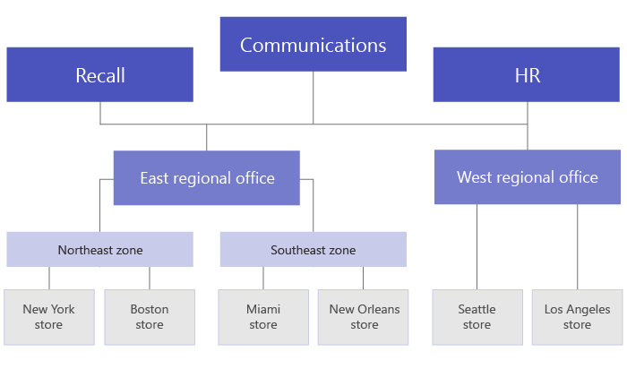

# <a name="set-up-your-team-targeting-hierarchy"></a>Einrichten Ihrer Team-Adressierungshierarchie

Durch das Einrichten einer Teamzielhierarchie kann Ihre Organisation Inhalte in einer großen Gruppe von Teams veröffentlichen. Die Teamzielhierarchie definiert, wie alle Teams in Ihrer Hierarchie miteinander verknüpft sind, welche Benutzer Aufgaben veröffentlichen können und für welche Teams Benutzer über Die Berechtigung zum Veröffentlichen verfügen. Veröffentlichungsfeatures sind für alle Benutzer deaktiviert, es sei denn, eine Teamzielhierarchie ist für Ihre Organisation eingerichtet. Zum Einrichten einer Teamzielhierarchie müssen Sie eine Datei erstellen, die die Hierarchie definiert, und sie dann in Teams hochladen, um sie auf Ihre Organisation anzuwenden. Nachdem das Schema hochgeladen wurde, können Apps in Teams es verwenden.

> [!IMPORTANT]
> Für die erste Version unterstützt nur die Aufgaben-App hierarchische Teams.  Wenn Sie eine Teamzielhierarchie auf Ihre Organisation anwenden, wird die [Aufgabenveröffentlichung](https://support.microsoft.com/office/publish-task-lists-to-create-and-track-work-in-your-organization-095409b3-f5af-40aa-9f9e-339b54e705df) in der Aufgaben-App aktiviert. In anderen Bereichen von Microsoft Teams wird keine Hierarchie von Teams angezeigt.

Hier sehen Sie ein Beispiel dafür, wie die Hierarchie in der Aufgaben-App in Teams dargestellt wird. Nachdem eine Aufgabenliste erstellt wurde, können Mitglieder des Veröffentlichungsteams dann die Empfängerteams auswählen, an die die Aufgabenliste gesendet (veröffentlicht) werden soll. Beim Auswählen von Teams kann das Veröffentlichungsteam nach Hierarchie, Attributen oder einer Kombination aus beiden filtern.<br>


## <a name="terminology"></a>Terminologie

Die folgenden Begriffe sind wichtig, wenn Sie in Hierarchien navigieren. Teams wird als Knoten **bezeichnet.**

* **Stammknoten** sind die obersten Knoten in der Hierarchie. Im Beispiel ist Retail Communications ein Stammknoten.
* **Übergeordnete Knoten** und **untergeordnete Knoten** sind Begriffe, die eine Beziehung zwischen zwei verbundenen Knoten darstellen. Im Beispiel ist Bezirk 01 ein untergeordneter Knoten von Bereich 1.
* Mehrere Ebenen von untergeordneten Elemente werden als Nachfolger **bezeichnet.** District 01, Store 01, Store 03, Store 07, District 02 und District 03 sind alle Nachfahren von Bereich 1.
* Ein Knoten ohne kinder wird als **Blattknoten bezeichnet.** Sie befinden sich am Unteren Rand einer Hierarchie.
* **Empfängerteams** sind Teams, die ausgewählt wurden, um eine bestimmte Gruppe von Inhalten zu erhalten, die veröffentlicht werden sollen. Sie müssen Blattknoten sein.

## <a name="plan-your-hierarchy"></a>Planen der Hierarchie

Bevor Sie das Schema erstellen, das Ihre Hierarchie definiert, müssen Sie planen und entscheiden, wie Sie Ihre Organisation gestalten möchten.  Eine der ersten Prioritäten ist die Entscheidung, welche Organisationsgruppen Aufgaben in anderen Gruppen veröffentlichen müssen. Jeder Knoten in der Hierarchie stellt eine Arbeitsgruppe oder Gruppe von Gruppen dar.

### <a name="permissions-to-publish"></a>Berechtigungen zum Veröffentlichen

Die Berechtigung zum Veröffentlichen hängt davon ab, ob ein Benutzer Mitglied eines beliebigen Teams in der Hierarchie sowie die Beziehung dieses Teams oder einer Gruppe von Teams zu anderen Teams in der Hierarchie ist.

> [!NOTE]
> Dem Besitzer eines Teams werden auch Veröffentlichungsberechtigungen erteilt.

* Wenn ein Benutzer Mitglied von mindestens einem Team ist, das Nachfolger in der Hierarchie hat, kann dieser Benutzer in diesen Nachfolgern veröffentlichen, ohne Mitglied aller Teams zu sein, in denen er veröffentlichen möchte.
* Wenn ein Benutzer Mitglied eines mindestens ein Teams in der Hierarchie ist, aber kein Mitglied eines Teams mit Nachfolgern in der Hierarchie ist, kann dieser Benutzer veröffentlichte Inhalte aus seiner Organisation anzeigen und empfangen.
* Wenn ein Benutzer kein Mitglied eines Teams in der Hierarchie ist, werden dem Benutzer keine Veröffentlichungsfunktionen angezeigt.

### <a name="guidelines"></a>Richtlinien

* Es kann nur eine Hierarchiedatei pro Organisation angewendet werden. Sie können jedoch verschiedene Teile Ihrer Organisation als unterschiedliche Hierarchien von Knoten in einer CSV-Datei zusammenbringen. Contoso Pharmaceuticals verfügt beispielsweise über einen Stammknoten "Pharmacy" und einen Stammknoten "Einzelhandel". Beide Stammknoten verfügen über mehrere Zeilen von nachfolgern, und es gibt keine Überlappung zwischen ihnen.
* Nur Blattknoten können Empfänger einer Publikation sein. Andere Knoten in der Hierarchie sind hilfreich beim Auswählen von Empfängern einer Publikation.
* Ein Team kann nur einmal in einer Hierarchie dargestellt werden.
* Eine Hierarchie kann bis zu 15.000 Knoten enthalten. Wir planen, mit Kunden zusammen zu arbeiten, um dieses Limit für größere Organisationen anhebe.

### <a name="example-hierarchy"></a>Beispielhierarchie

In der folgenden Hierarchie können Rückruf, Kommunikation und Personalwesen z. B. Aufgaben auf jedem unteren Knoten (Team) in der Hierarchie veröffentlichen, aber "Northeast Zone" kann Aufgaben nur im New York Store und im Boston Store veröffentlichen. Die Beispielhierarchie ermöglicht es den Gruppen Rückruf, Kommunikation und Personalwesen, Aufgaben zu veröffentlichen, die für das gesamte Unternehmen gelten, z. B. Leistungsinformationen oder Nachrichten des CEO. Die Nordostzone kann Aufgaben wie Personalplanung, Wetterinformationen und so weiter nur für die Teams des New York Store und des Boston Store veröffentlichen.



## <a name="create-your-hierarchy"></a>Erstellen Ihrer Hierarchie

> [!NOTE]
> Im restlichen Artikel wird das Einrichten einer Teamhierarchie im Kontext der Veröffentlichung von Aufgaben für Empfängerteams erläutert. Eine [Übersicht über die Aufgaben-App, in](https://docs.microsoft.com/MicrosoftTeams/manage-tasks-app) der die Aufgabenveröffentlichung angezeigt wird, wenn aktiviert wird, finden Sie unter Verwalten der Aufgaben-App für Ihre Organisation in Teams.

Das Schema, das Ihre Hierarchie definiert, basiert auf einer CSV-Datei (Durch Kommas getrennte Werte). Jede Zeile in der CSV-Datei entspricht einem Knoten innerhalb der Hierarchie von Teams. Jede Zeile enthält Informationen, die den Knoten innerhalb der Hierarchie nennen, ihn optional mit einem Team verknüpft und Attribute enthält, mit deren Hilfe Teams in Apps gefiltert werden können, die sie unterstützen.

Sie können auch Buckets definieren, bei denen es sich um Kategorien handelt, die das **Veröffentlichungsteam** verwenden kann, um an Empfängerteams gesendete Inhalte zu organisieren, um ihnen das Anzeigen, Sortieren und Konzentrieren auf relevante Inhalte zu erleichtern.

### <a name="add-required-columns"></a>Hinzufügen erforderlicher Spalten

Die CSV-Datei muss die folgenden drei Spalten in der folgenden Reihenfolge enthalten, beginnend mit der ersten Spalte. Ein Knoten muss mit einem Team verknüpft sein, damit er Aufgaben empfangen kann.

| Spaltenname   | Erforderlich | Beschreibung   |
----------------|----------|---------------|
| DisplayName    | Ja      | Dieses Feld ist der Name des Knotens. Der Name kann bis zu 100 Zeichen lang sein und nur die Zeichen A-Z, a-z und 0-9 enthalten. Knotennamen müssen eindeutig sein. |
| ParentName    | Ja       | Dies ist der Name des übergeordneten Knotens. Der hier festgelegte Wert muss dem Wert im Feld **Anzeigename** des übergeordneten Knotens exakt entsprechen. Wenn Sie mehr als einen übergeordneten Knoten hinzufügen möchten, trennen Sie jeden übergeordneten Knotennamen durch ein Semikolon (;). Sie können bis zu 25 übergeordnete Knoten hinzufügen, und jeder name des übergeordneten Knotens kann bis zu 2500 Zeichen lang sein. Ein Knoten kann nur dann mehrere übergeordnete Knoten haben, wenn es sich bei den übergeordneten Knoten um Stammknoten handelt.   <br><br>**WICHTIG** Achten Sie darauf, keine Schleife zu erstellen, in der ein übergeordnetes Element oben in der Hierarchie auf einen untergeordneten Knoten in der Hierarchie verweist. Dies wird nicht unterstützt. |
| TeamId        | Ja, wenn das Team Aufgaben veröffentlicht oder Aufgaben von einem übergeordneten Knoten empfängt       | Dies enthält die ID des Teams, mit dem Sie einen Knoten verknüpfen möchten. Jeder Knoten muss auf ein eindeutiges Team verweisen, sodass jeder TeamId-Wert nur einmal in der Hierarchiedatei angezeigt werden kann. Führen Sie den folgenden PowerShell-Befehl aus, um die ID eines Teams zu erhalten, mit dem Sie einen Knoten verknüpfen möchten: `Get-Team | Export-Csv TeamList.csv` . Dieser Befehl listet die Teams in Ihrer Organisation auf und enthält den Namen und die ID für jedes Team. Suchen Sie den Namen des Teams, zu dem Sie eine Verknüpfung erstellen möchten, und kopieren Sie dann die ID in dieses Feld.|

> [!NOTE]
> Wenn ein Knoten kein Stammknoten oder Blattknoten ist und Sie die Teammitgliedschaft nicht benötigen, um die entsprechenden Berechtigungen für die Veröffentlichung und Berichterstellung zu erteilen, können Sie die TeamId leer lassen. Diese Methode kann verwendet werden, um beim Auswählen von Empfängerteams oder zum Anzeigen von Abschlussberichten ohne ein entsprechendes Team mehr Granularität hinzuzufügen.

### <a name="add-attribute-columns"></a>Hinzufügen von Attributspalten

Nachdem Sie die drei erforderlichen Spalten hinzugefügt haben, können Sie optionale Attributspalten hinzufügen. Diese Attribute können verwendet werden, um Knoten zu filtern, damit Sie einfacher diejenigen auswählen können, auf denen Sie Aufgaben veröffentlichen möchten. Es gibt zwei Möglichkeiten zum Definieren Ihrer Attribute, je nachdem, ob sich Die Werte für dieses Attribut gegenseitig ausschließen.

|Möglichkeiten zum Hinzufügen von Attributen|Beschreibung |Beispiel  |
|---|---------|---------|
|Wenn sich die Werte für ein Attribut gegenseitig ausschließen, wird der von Ihnen festgelegte Spaltenname zum Namen des -Attributs.|Jede Zeile kann einen Wert für dieses Attribut enthalten, und jede Attributspalte kann bis zu 50 eindeutige Werte enthalten. Jeder Wert kann bis zu 100 Zeichen lang sein. Der Satz von Attributwerten, die Sie in der Attributspalte angeben, wird als Filterwerte für dieses Attribut angezeigt, wenn Empfängerteams mit der Teamzielhierarchie ausgewählt werden.|Sie möchten, dass Benutzer Stores nach Layout filtern können. Die Werte für dieses Attribut schließen sich gegenseitig aus, da ein Store nur über ein Layout verfügen kann. <br><br>Wenn Sie ein Attribut zum Filtern von Stores nach Layout hinzufügen möchten, fügen Sie eine Spalte mit dem Namen Store-Layout hinzu. In diesem Beispiel sind Die Werte für das Store-Layoutattribut "Compact", "Standard" und "Large".
|Wenn Sie mehrere Werte für ein Attribut angeben müssen und sich die Werte nicht gegenseitig ausschließen, verwenden Sie das **AttributName:UniqueValue-Format** für die Spaltennamen. <br><br>**WICHTIG** Stellen Sie sicher, dass Sie den Doppelpunkt (englisch) verwenden (:) als Unicode wird nicht als Attributspaltentrennzeichen unterstützt. |Die Textzeichenfolge vor dem Doppelpunkt (:) wird der Name des -Attributs. Alle Spalten, die dieselbe Textzeichenfolge vor den Doppelpunktzeilen enthalten (:) werden in einem Abschnitt im Filtermenü gruppieren. Jede zeichenfolge nach dem Doppelpunkt werden zu den Werten für diesen Abschnitt.<br><br>Jede Zeile kann den Wert 0 (Null) oder 1 für dieses Attribut haben. Ein Wert von 0 bedeutet, dass das -Attribut nicht auf den Knoten angewendet wird, und der Wert 1 bedeutet, dass das -Attribut auf diesen Knoten angewendet wird.|Sie möchten, dass Benutzer Stores nach Abteilung filtern können. Ein Store kann mehrere Abteilungen haben, daher schließen sich die Werte für dieses Attribut nicht gegenseitig aus.<br><br>In diesem Beispiel fügen wir "Departments:Clothing", "Departments:Electronics", "Departments:Foods", "Departments:Home and Garden", "Departments:Sports goods" als Attributspalten hinzu. Abteilungen werden zum Attributnamen, und Benutzer können nach den Abteilungen "Kleidung", "Elektronik", "Lebensmittel", "Haus und Garten" und "Sportartikel" filtern.|

Beachten Sie beim Hinzufügen einer Attributspalte Folgendes:

* Der spaltenname, den Sie angeben, oder der Spaltenname, den Sie vor dem Doppelpunkt angeben (:) wird der Name des -Attributs. Dieser Wert wird in den Teams-Apps angezeigt, die die Hierarchie verwenden.
* Sie können bis zu 50 Attributspalten in ihrer Hierarchie haben.
* Der Spaltenname kann bis zu 100 Zeichen lang sein und nur die Zeichen A-Z, a-z und 0-9 sowie Leerzeichen enthalten. Spaltennamen müssen eindeutig sein.

### <a name="add-bucket-columns"></a>Hinzufügen von Bucketspalten

Sie können Bucketspalten hinzufügen, um Buckets zu erstellen, bei denen es sich um Gruppierungen handelt, in die Aufgaben organisiert werden können. Jeder Bucket erhält eine eigene Spalte in der CSV-Datei. Die von Ihnen erstellten Buckets werden dem Veröffentlichungsteam zur Verfügung stehen. Das Veröffentlichungsteam kann diese Buckets dann verwenden, um Aufgaben für die Empfängerteams zu kategorisieren. Wenn in einem Team noch kein Bucket vorhanden ist, werden Buckets bei Bedarf erstellt, wenn Aufgaben veröffentlicht werden.

Indem die Arbeitselemente einmal zentral kategorisiert werden, kann das Veröffentlichungsteam die Aufgabenliste für alle Zehner-, Hunderte- oder Tausende von Empfängerteams, die die Aufgabenliste erhalten, vorab organisieren. Die Empfängerteams können ihre Aufgaben dann nach Bucket sortieren und filtern, um sich auf den bereich zu konzentrieren, der für ihre Arbeit am relevantesten ist.

Beachten Sie beim Hinzufügen einer Bucketspalte Folgendes:

* Der Spaltenname wird zum Namen des Buckets. Jeder von Ihnen festgelegte Bucket wird in den Teams-Apps, die die Hierarchie verwenden, in der Liste Buckets angezeigt.
* Es wird empfohlen, keine vertraulichen Informationen in Bucketnamen zu verwenden. Derzeit können Veröffentlichungsteams einen Bucket nach der Veröffentlichung nicht mehr entfernen.
* Dem Spaltennamen muss ein Hashtag (#) vorangehen. Er kann bis zu 100 Zeichen lang sein und nur die Zeichen A-Z, a-z und 0-9 enthalten. Beispiel: #Operations und #Frozen Waren.
* Eine Hierarchie kann bis zu 25 Bucketspalten enthalten. Wir planen, mit Kunden zusammen zu arbeiten, um dieses Limit für größere Organisationen zu erhöhen.

### <a name="example"></a>Beispiel

Hier sehen Sie ein Beispiel für eine SCHEMA-CSV-Datei, die erstellt würde, um die in der vorherigen Abbildung gezeigte Hierarchie zu unterstützen. Dieses Schema enthält Folgendes:

* Drei erforderliche Spalten mit `TargetName` dem Namen `ParentName` , und `TeamId`
* Drei Attributspalten `Store layout` mit dem Namen , `Departments:Clothing` und `Departments:Foods`
* Drei Bucketspalten `Fresh Foods` mit dem Namen , `Frozen Foods` und `Women's Wear`

Das `Store layout` -Attribut enthält Werte, die `Compact` , und `Standard` `Large` enthalten. Die `Departments` Attributspalten können auf den Wert `0` (Null) oder festgelegt `1` werden. Das Layout und die Attribute werden in `Store` der abbildung oben nicht `Departments` angezeigt. Sie werden hier hinzugefügt, um zu zeigen, wie Attribute zu Knoteneinträgen hinzugefügt werden können. Dasselbe gilt für die drei Bucketspalten.

```CSV
TargetName,ParentName,TeamId,Store layout,Departments:Clothing,Departments:Foods,#Fresh Foods,#Frozen Foods,#Women's Wear
Recall,,db23e6ba-04a6-412a-95e8-49e5b01943ba,,,,,,
Communications,,145399ce-a761-4843-a110-3077249037fc,,,,,,
HR,,,,,,,,
East Regional Office,,,,,,,,
West Regional Office,,,,,,,,
Northeast Zone,East Regional Office,,,,,,,
Southeast Zone,East Regional Office,,,,,,,
New York Store,Northeast Zone,e2ba65f6-25e7-488b-b8f0-b8562d5de60a,Large,1,1,,,
Boston Store,Northeast Zone,0454f08a-0507-437c-969a-682eb2fae7fc,Standard,1,1,,,
Miami Store,Southeast Zone,619d6e4e-5f68-4b36-8e1f-16c98d7396c1,Compact,0,1,,,
New Orleans Store,Southeast Zone,6be960b8-72af-4561-a343-9ac4711874eb,Compact,0,1,,,
Seattle Store,West Regional Zone,487c0d20-4e55-4dc2-8187-a24c826e0fee,Standard,1,1,,,
Los Angeles Store,West Regional Zone,204a1287-2efb-4a8a-88e0-56fbaf5a2389,Large,1,1,,,
```

## <a name="apply-your-hierarchy"></a>Anwenden der Hierarchie

Nachdem Sie Ihre Hierarchie in der SCHEMA-CSV-Datei definiert haben, können Sie sie in Teams hochladen. Führen Sie dazu den folgenden Befehl aus. Sie müssen ein globaler Administrator oder Teams-Dienstadministrator sein, um diesen Schritt zu tun.

```powershell
Set-TeamTargetingHierarchy -FilePath "C:\ContosoTeamSchema.csv"
```

### <a name="update-your-hierarchy"></a>Aktualisieren der Hierarchie

Sie können eine neue Hierarchie hochladen, um die alte Hierarchie mit demselben PowerShell-Befehl wie oben zu ersetzen. Jedes Mal, wenn Sie eine neue Hierarchie hochladen, ersetzt sie die vorherige Hierarchie.

### <a name="check-the-status-of-your-hierarchy"></a>Überprüfen des Status Ihrer Hierarchie

Sie können den folgenden Befehl ausführen, um den Status des Hierarchieuploads zu überprüfen.

```powershell
Get-TeamTargetingHierarchyStatus
```

Der Befehl gibt die folgenden Felder zurück:

Feld|Beschreibung
-----|------------
ID | Die eindeutige ID für den Upload.
Status | Uploadstatus. Zu den Werten **gehören Start**, **Überprüfen**, **Erfolgreich** und **Fehlgeschlagen**
ErrorDetails | Details, wenn ein Uploadfehler vor auftritt. Weitere Informationen zu den Fehlerdetails finden Sie im Abschnitt Problembehandlung. Wenn kein Fehler auftritt, ist dieses Feld leer.
LastUpdatedAt | Zeitstempel und Datum der letzten Aktualisierung der Datei.
LastModifiedBy | Die ID des letzten Benutzers, der die Datei geändert hat.
FileName | Der Dateiname der CSV.

## <a name="remove-your-hierarchy"></a>Entfernen der Hierarchie

Wenn Sie die Registerkarte  Veröffentlichte Listen für alle Benutzer in Ihrer Organisation sofort deaktivieren möchten, können Sie die Hierarchie entfernen. Benutzer haben keinen Zugriff  auf die Registerkarte Veröffentlichte Listen oder eine der Funktionen auf der Registerkarte.  Dies umfasst die Möglichkeit, neue Aufgabenlisten zum Veröffentlichen, Zugreifen auf Entwurfslisten, Veröffentlichen, Aufheben der Veröffentlichung und Zum Duplizieren von Listen zu erstellen und Berichte anzeigen zu können. Durch das Entfernen der Hierarchie werden aufgaben, die zuvor veröffentlicht wurden, nicht wieder veröffentlicht. Diese Aufgaben bleiben für Empfängerteams verfügbar.

Führen Sie zum Entfernen der Hierarchie den folgenden Befehl aus. Sie müssen ein Administrator sein, um diesen Schritt ausführen zu können.

```powershell
Remove-TeamTargetingHierarchy
```

Beim Bestätigen des Löschvorgangs wird in der Statusmeldung weiterhin das vorherige Schema angezeigt, obwohl beim Erneuten Löschen ein Fehler zurückgegeben wird, dass das Objekt null ist.

## <a name="create-a-sample-hierarchy"></a>Erstellen einer Beispielhierarchie

### <a name="install-the-teams-powershell-module"></a>Installieren des Teams PowerShell-Moduls

> [!IMPORTANT]
> Um diesen Schritt ausführen zu können, müssen Sie das öffentliche PowerShell-Vorschaumodul von Teams PowerShell aus dem [PowerShell-Katalog installieren und verwenden.](https://www.powershellgallery.com/packages/MicrosoftTeams/) Schritte zum Installieren des Moduls finden Sie unter [Installieren von Teams PowerShell](teams-powershell-install.md).

### <a name="sample-script"></a>Beispielskript

Das folgende Skript kann verwendet werden, um die Teams zu erstellen und eine CSV-Datei in Ihren Microsoft Teams-Mandanten hochzuladen. Wenn Sie über eine vorhandene Hierarchie verfügen, wird sie durch dieses Skript ersetzt.

#### <a name="create-teams-for-a-simple-hierarchy"></a>Erstellen von Teams für eine einfache Hierarchie

```powershell
$tm1 = New-Team -DisplayName "HQ"
$tm2 = New-Team -DisplayName "North"
$tm3 = New-Team -DisplayName "Store 1"
$tm4 = New-Team -DisplayName "Store 2"
$tm5 = New-Team -DisplayName "South"
$tm6 = New-Team -DisplayName "Store 3"
$tm7 = New-Team -DisplayName "Store 4"
```

#### <a name="use-team-data-to-create-comma-separated-output-displayname-parentname-teamid"></a>Verwenden von Teamdaten zum Erstellen einer durch Kommas getrennten Ausgabe (DisplayName, ParentName, TeamId)

```powershell
$csvOutput = "DisplayName" + "," + "ParentName" + "," + "TeamId" + "`n"
$csvOutput = $csvOutput + $tm1.DisplayName + "," + "," + $tm1.GroupID + "`n"
$csvOutput = $csvOutput + $tm2.DisplayName + "," + $tm1.DisplayName + "," + $tm2.GroupID + "`n"
$csvOutput = $csvOutput + $tm3.DisplayName + "," + $tm2.DisplayName + "," + $tm3.GroupID + "`n"
$csvOutput = $csvOutput + $tm4.DisplayName + "," + $tm2.DisplayName + "," + $tm4.GroupID + "`n"
$csvOutput = $csvOutput + $tm5.DisplayName + "," + $tm1.DisplayName + "," + $tm5.GroupID + "`n"
$csvOutput = $csvOutput + $tm6.DisplayName + "," + $tm5.DisplayName + "," + $tm6.GroupID + "`n"
$csvOutput = $csvOutput + $tm7.DisplayName + "," + $tm5.DisplayName + "," + $tm7.GroupID 
```

#### <a name="save-output-to-a-csv-file-in-the-downloads-folder"></a>Speichern der Ausgabe in einer CSV-Datei im **Ordner "Downloads"**

```powershell
$csvOutputPath = $env:USERPROFILE + "\downloads\testhierarchy-" + (Get-Date -Format "yyyy-MM-dd-hhmmss") + ".csv" 
$csvOutput | Out-File $csvOutputPath
```

#### <a name="upload-the-hierarchy"></a>Hochladen der Hierarchie

```powershell
Set-TeamTargetingHierarchy -FilePath $csvOutputPath
Get-TeamTargetingHierarchyStatus
```

## <a name="troubleshooting"></a>Problembehandlung

### <a name="how-to-view-error-details"></a>Anzeigen von Fehlerdetails

Sie können den folgenden Befehl ausführen, um zu verstehen, was einen Fehler verursacht, und die Fehlerdetails zurückgeben.

```powershell
(Get-TeamTargetingHierarchyStatus).ErrorDetails.ErrorMessage
```

### <a name="you-receive-an-error-message-when-you-upload-your-schema-csv-file"></a>Beim Hochladen der SCHEMA-CSV-Datei wird eine Fehlermeldung angezeigt.

Notieren Sie sich die Fehlermeldung, da sie Informationen zur Problembehandlung enthalten sollte, um anzugeben, warum das Schema nicht hochgeladen werden konnte. Überprüfen und bearbeiten Sie Ihre Schema-CSV-Datei basierend auf den Informationen in der Fehlermeldung, und versuchen Sie es dann erneut.

### <a name="you-receive-an-error-invalidteamid-error-message-when-you-upload-your-schema-csv-file"></a>Beim Hochladen der Schema-CSV-Datei wird die Fehlermeldung "Fehler: InvalidTeamId" angezeigt.

Wenn Sie versuchen, Ihre Schema-CSV-Datei hochzuladen, wird die folgende Fehlermeldung angezeigt:

```console
Error: InvalidTeamId
Description: TeamID in row # doesn't match a valid Group ID. Please view our documentation to learn how to get the proper GroupID for each team.
```

Vergewissern Sie sich, dass Sie die richtige TeamId für das Team in Ihrer Schema-CSV-Datei verwenden. Die TeamId sollte mit der Gruppen-ID der Microsoft 365-Gruppe identisch sein, die das Team unterstützt. Sie können die Gruppen-ID des Teams im Microsoft Teams Admin Center nachschauen.

1. Wechseln Sie im linken Navigationsbereich des [Microsoft Teams Admin Centers](https://admin.teams.microsoft.com/)zu **Teams** Verwalten  >  **von Teams.**
2. Wenn die **Spalte Gruppen-ID** in der Tabelle nicht angezeigt wird, wählen Sie **Spalten** bearbeiten in der oberen rechten Ecke der Tabelle aus, und aktivieren Sie dann **Gruppen-ID.**
3. Suchen Sie das Team in der Liste, und suchen Sie dann die Gruppen-ID.

Stellen Sie sicher, dass die TeamId in Ihrer Schema-CSV-Datei der Gruppen-ID entspricht, die im Microsoft Teams Admin Center angezeigt wird.

## <a name="related-topics"></a>Verwandte Themen

* [Verwalten der Aufgaben-App für Ihre Organisation in Teams](manage-tasks-app.md)
* [Übersicht über PowerShell für Microsoft Teams](teams-powershell-overview.md)
