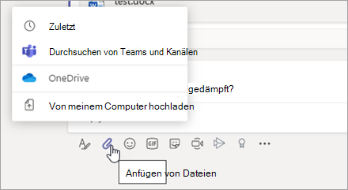
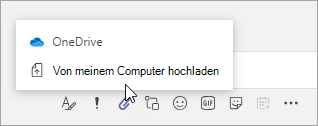

# Freigeben von Dateien in Microsoft Teams

In Microsoft Teams können Benutzer Inhalte für andere Teams-Benutzer innerhalb und außerhalb ihrer Organisation freigeben. Das Freigeben von Dateien und Ordnern in Teams basiert auf den in SharePoint und OneDrive konfigurierten Einstellungen, sodass sich alles, was Sie für SharePoint und OneDrive eingerichtet haben, auch auf die Freigabe in Teams auswirken wird.

## Übersicht

Benutzer können Dateien von OneDrive, von Teams und Websites, auf die sie Zugriff haben, und von ihrem Computer aus freigeben. Um eine Datei freizugeben, können Benutzer die folgenden Schritte ausführen:

- Klicken Sie in einem Kanal auf **Anfügen** (das Büroklammer-Symbol), wählen Sie **Zuletzt verwendet**, **Teams und Kanäle durchsuchen**, **OneDrive** oder **Von meinem Computer hochladen** und dann die Datei aus, die sie freigeben möchten.  
    
- Klicken Sie in einem Chat auf **Anfügen** (das Büroklammer-Symbol), wählen Sie **OneDrive** oder **Von meinem Computer hochladen** und dann die Datei aus, die sie freigeben möchten. 
    
- Kopieren Sie den Freigabelink, und fügen Sie ihn in das Feld „Verfassen“ ein. 
    

### Berechtigungen für freigegebene Dateien und Freigabelinks

Wenn Benutzer eine Datei aus Teams heraus freigeben, können sie genau wie in Microsoft 365 festlegen, wer auf die Datei zugreifen darf. Sie können jedem, Personen in Ihrer Organisation, Personen mit bestehendem Zugriff oder bestimmten Personen (zu denen auch die Personen in einem 1:1-Chat, Gruppenchat oder Kanal gehören können) Zugriff gewähren.  Wenn eine Datei freigegeben wird, ist die Dateivorschau in der Nachricht verfügbar, zusammen mit allen Dateiaktionen wie **Online öffnen**, **Herunterladen** und **Link kopieren**. Standardmäßig wird die Datei in Teams geöffnet.

Wenn Benutzer eine Datei in einem Chat oder Kanal freigeben, werden sie benachrichtigt, wenn einzelne oder alle Empfänger keine Berechtigung zum Anzeigen der Datei haben. Sie können die Berechtigungen für die Datei vor der Freigabe ändern, indem sie auf den Pfeil neben der Dateivorschau klicken, der nun in der Nachricht angezeigt wird.

## Verwandte Themen

[Interaktion von SharePoint Online und OneDrive for Business mit Microsoft Teams](sharepoint-onedrive-interact.md)

[Ändern des Standardlinktyps für eine Website](https://docs.microsoft.com/sharepoint/change-default-sharing-link)

[Zusammenarbeiten mit Gästen in einem Team](https://docs.microsoft.com/microsoft-365/solutions/collaborate-as-team)