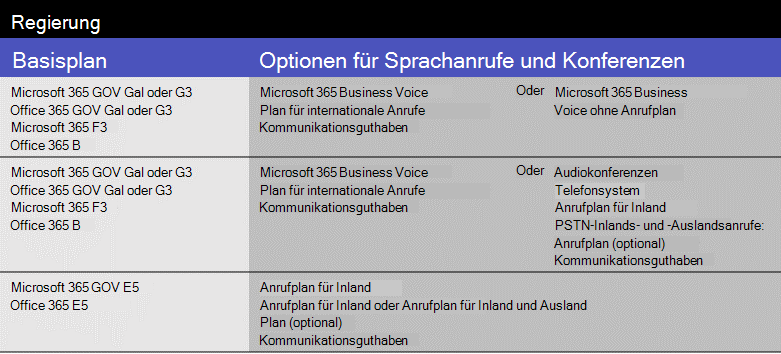
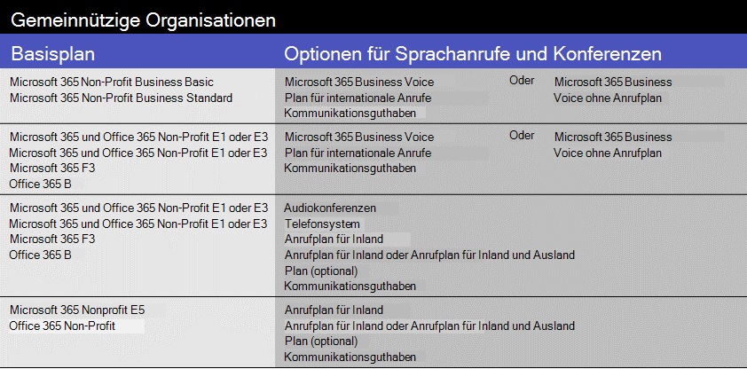

# Microsoft Teams-Add-on-Lizenzen

## Was sind Add-On-Lizenzen?

Add-On-Lizenzen sind Lizenzen für bestimmte Funktionen von Microsoft Teams. Sie geben Ihnen die Flexibilität, Features nur für Benutzer in Ihrer Organisation hinzuzufügen, die Sie benötigen. Um eine Funktion hinzuzufügen, kaufen Sie eine Add-On-Lizenz für jeden Benutzer, der diese Funktion verwenden wird.

## Welche Features kann ich in Form von Add-On-Lizenzen erhalten?

Im folgenden finden Sie eine Liste der Features, die Sie mit den Add-on-Lizenzen für Teams hinzufügen können. Die für Sie verfügbaren Optionen für die Add-on-Lizenzierung hängen vom jeweiligen Microsoft 365-oder Office 365-Plan ab.

|||||
|:-----|:-----|:-----|:-----|
|**Feature**   |**Beschreibung**   |**Kleine Unternehmen (<300-Benutzer)**|**Großunternehmen (>300-Benutzer)**|
**Microsoft 365 Business Voice**   | [Business Voice](../business-voice/whats-business-voice.md) ist eine Telefonie-Lösung für kleine und mittelständische Unternehmen mit bis zu 300-Benutzern, die Telefonsysteme, audiokonferenzs, einen Plan für Inlandsanrufe und vieles mehr bündelt. Zu den Telefon System Funktionen, die Sie erhalten, gehören Voicemail, Rufnummernanzeige, Parken von anrufen, Anrufweiterleitung, automatische Telefonzentralen und Anrufwarteschlangen.   Informationen dazu, ob Business Voice in Ihrem Land oder Ihrer Region zur Verfügung steht, finden Sie unter [Verfügbarkeit von Ländern und Regionen für Business Voice](../business-voice/country-region-availability.md). Informationen zu Preisinformationen finden Sie unter [Preise für Business-VoIP](https://go.microsoft.com/fwlink/?linkid=2127221).   |&#x2713;||
|**Audiokonferenz**   |Manchmal müssen Personen in Ihrer Organisation ein Telefon verwenden, um sich stattdessen in eine Teams-Besprechung einzuwählen. Einrichten von [Audiokonferenzen](../audio-conferencing-in-office-365.md) für Benutzer, die Besprechungen planen oder führen.   Informationen darüber, ob Audiokonferenzen in Ihrem Land oder in Ihrer Region verfügbar sind, finden Sie unter [Verfügbarkeit von Ländern und Regionen für Audiokonferenzen und Anrufpläne](../country-and-region-availability-for-audio-conferencing-and-calling-plans/country-and-region-availability-for-audio-conferencing-and-calling-plans.md) . Informationen zu den Preisen finden Sie unter [Preise für Audiokonferenzen](https://go.microsoft.com/fwlink/?linkid=799762).    |&#x2713;1|&#x2713;|
|**Gebührenfreie Nummern** |Wenn Sie gebührenfreie Nummern für Audiokonferenzen, automatische Telefonzentralen oder Anrufwarteschlangen benötigen, müssen Sie [Kommunikationsguthaben einrichten](../set-up-communications-credits-for-your-organization.md).   |&#x2713;|&#x2713;|
|**Telefonsystem**   |Das [Telefon System](../what-is-phone-system-in-office-365.md) ist ein gehosteter Telefondienst, der Ihnen Anrufsteuerung und Funktionen für die Private Branch Exchange (PBX) bietet, mit Optionen für den Anschluss an das öffentlich geschaltete Telefonnetz (PSTN). Zu den Telefon System Funktionen gehören Cloud-Voicemail, Rufnummernanzeige, Anruf parken, Anrufweiterleitung, automatische Telefonzentralen, Anrufwarteschlangen, Anrufweiterleitung, Rufnummernanzeige und vieles mehr.  Weitere Informationen finden [Sie hier: was Sie über das Telefon System erhalten](../here-s-what-you-get-with-phone-system.md). Informationen zur Preisgestaltung finden Sie unter [Preise für Telefonsysteme](https://go.microsoft.com/fwlink/?linkid=799763).    |&#x2713;1|&#x2713;|
|**Anrufpläne**   |Wenn Sie möchten, dass Benutzer Telefonnummern außerhalb Ihrer Organisation anrufen können, besorgen Sie [sich einen](../calling-plans-for-office-365.md)Anrufplan. Es gibt Tarife für Inlandsanrufe sowie Pläne für Inlands-und Auslandsgespräche. Informationen zu Preisinformationen finden Sie unter [Preise für Anrufpläne](https://go.microsoft.com/fwlink/?linkid=799761 ).    |&#x2713;1|&#x2713;|
|**Microsoft Teams-Räume**   |[Microsoft Teams rooms](../rooms/index.md) ist kein Add-on, sondern ein Feature, das Video-, Audio-und Inhalts Freigaben für Konferenzräume bietet. Weitere Informationen finden Sie unter [Lizenzierung von Teams-Besprechungsräumen](../rooms/rooms-licensing.md).    |&#x2713;|&#x2713;|

1 Wenn Sie ein kleines oder mittelständisches Unternehmen sind, das über einen Microsoft 365 Enterprise-Plan verfügt, können Sie dennoch Add-on-Lizenzen für diese Sprachfeatures erwerben, doch empfehlen wir, einen [Microsoft 365 Business](https://www.microsoft.com/microsoft-365/compare-all-microsoft-365-products?&activetab=tab:primaryr2) -Plan und eine [Business-VoIP](https://www.microsoft.com/microsoft-365/business/business-voice)zu verwenden.

## Welche Sprachfeatures stehen in meinem Plan zur Verfügung?

Informieren Sie sich je nach Plan, welche Add-on-Lizenzen Sie benötigen, um Sprachfeatures in Teams zu erhalten.

Je nach den gewünschten Sprachfeatures empfehlen wir, zu vergleichen, ob es günstiger ist, zu einem Plan zu wechseln, in dem diese Features enthalten sind. Bei den meisten großen Organisationen führt der Kauf eines Softwarepakets in einem Microsoft 365 Enterprise-Plan zu niedrigeren Gesamtkosten. Wenn Sie mehrere Add-on-Lizenzen einzeln und nicht als Teil eines Plans kaufen, können Sie in der Regel höhere kombinierte Kosten verursachen.

#### [**Kleine Unternehmen**](#tab/small-business/)

Wenn Sie ein kleines oder mittelständisches Unternehmen (weniger als 300 Benutzer) sind, haben Sie vier Möglichkeiten, Sprachfeatures zu erhalten:

- Kaufen Sie einen Microsoft 365 Business-Plan und Microsoft 365 Business Voice.
- Kaufen Sie einen Enterprise E1-oder E3-Plan und Microsoft 365 Business Voice.
- Kaufen Sie einen Enterprise E1-oder E3-Plan, und fügen Sie Sprachfeatures einzeln hinzu.
- Kaufen Sie einen Enterprise E5-Plan, der Sprachfeatures umfasst.

Für Microsoft 365 Business Voice stehen Ihnen zwei Optionen zur Auswahl:

- **Microsoft 365 Business Voice mit einem Anrufplan**: besorgen Sie sich dies, wenn Sie möchten, dass alle Telefonnummern Verwaltung und Abrechnung von Microsoft gehandhabt werden.
- **Microsoft 365 Business Voice ohne Anrufplan (Direktes Routing)**: besorgen Sie sich dies, wenn Sie möchten, dass alle Telefonnummern Verwaltung und Abrechnung von Ihrem externen Telefonanbieter gehandhabt werden. Sie müssen das [direkte Routing](../direct-routing-landing-page.md) einrichten und bereitstellen, um Ihre lokalen Sitzungs Grenz Controller (SBCS) mit Microsoft 365 oder Office 365 zu verbinden.

Weitere Informationen finden Sie unter [Was muss ich kaufen, um Microsoft 365 Business Voice verwenden zu können?](../business-voice/what-to-buy.md).

Nachfolgend finden Sie eine Zusammenfassung, die auf dem Lizenzierungs Plan basiert.

  

Wenn Audiokonferenzen in Ihrem Land oder Ihrer Region nicht unterstützt werden, haben Sie die Möglichkeit, einen Microsoft 365 Enterprise E5 ohne audiokonferenzplan oder ein Office 365 Enterprise E5 ohne audiokonferenzplan zu erhalten.

Wenn Sie bereits über einen Microsoft 365 Enterprise-oder Office 365 Enterprise-Plan verfügen, können Sie weiterhin Add-on-Lizenzen für einzelne Sprachfeatures erwerben. Sie haben jedoch die Möglichkeit, zu einem [Microsoft 365 Business](https://www.microsoft.com/microsoft-365/compare-all-microsoft-365-products?&activetab=tab:primaryr2) -Plan und zu [Microsoft 365 Business Voice](https://www.microsoft.com/microsoft-365/business/business-voice)zu wechseln. In einigen Fällen kann es je nach den gewünschten Features günstiger sein, einen Microsoft 365 Business-Plan mit Microsoft 365 Business Voice zu erhalten.

> [!NOTE]
> Wenn Sie einen Telefondienst eines Drittanbieters verwenden müssen, die [direkte Weiterleitung](../direct-routing-landing-page.md) in Ihrer Organisation bereitgestellt wird oder wenn Anrufpläne in Ihrem Land oder Ihrer Region nicht verfügbar sind, müssen Sie die direkte Weiterleitung für Sprachfeatures verwenden.

#### [**Enterprise**](#tab/enterprise/)

Wenn Sie eine große Unternehmens-oder Unternehmensorganisation (mehr als 300 Benutzer) sind, haben Sie zwei Möglichkeiten, Sprachfeatures zu erhalten:

- Kaufen Sie einen Enterprise E1-oder E3-Plan, und fügen Sie Sprachfeatures einzeln hinzu.
- Kaufen Sie einen Enterprise E5-Plan, der Sprachfeatures umfasst.

Nachfolgend finden Sie eine Zusammenfassung, die auf dem Lizenzierungs Plan basiert.

  

Wenn Audiokonferenzen in Ihrem Land oder Ihrer Region nicht unterstützt werden, haben Sie die Möglichkeit, einen Microsoft 365 Enterprise E5 ohne audiokonferenzplan oder ein Office 365 Enterprise E5 ohne audiokonferenzplan zu erhalten.

Weitere Informationen finden Sie unter [Microsoft 365 Enterprise-Pläne](https://www.microsoft.com/microsoft-365/compare-microsoft-365-enterprise-plans) und [Office 365 Enterprise-Pläne](https://www.microsoft.com/microsoft-365/business/compare-more-office-365-for-business-plans).

> [!NOTE]
> Wenn Sie einen Telefondienst eines Drittanbieters verwenden müssen, die [direkte Weiterleitung](../direct-routing-landing-page.md) in Ihrer Organisation bereitgestellt wird oder wenn Anrufpläne in Ihrem Land oder Ihrer Region nicht verfügbar sind, müssen Sie die direkte Weiterleitung für Sprachfeatures verwenden.

#### [**Bildung**](#tab/education/)

Für Schulen und andere akademische Organisationen haben Sie drei Möglichkeiten, Sprachfeatures zu erhalten.

- Kaufen Sie einen edu a1-oder a3-Plan und Microsoft 365 Business Voice.
- Kaufen Sie einen edu a1-oder a3-Plan, und fügen Sie Sprachfeatures einzeln hinzu.
- Kaufen Sie einen edu A5-Plan, in dem Sprachfeatures enthalten sind.

Nachfolgend finden Sie eine Zusammenfassung, die auf dem Lizenzierungs Plan basiert.

  

  1 nur für Organisationen mit weniger als 300 Benutzern verfügbar.

Weitere Informationen finden Sie unter [Microsoft 365 Education](https://www.microsoft.com/education/buy-license/microsoft365) -und [Office 365 Education-Pläne](https://www.microsoft.com/microsoft-365/academic/compare-office-365-education-plan).

> [!NOTE]
> Wenn Sie einen Telefondienst eines Drittanbieters verwenden müssen, die [direkte Weiterleitung](../direct-routing-landing-page.md) in Ihrer Organisation bereitgestellt wird oder wenn Anrufpläne in Ihrem Land oder Ihrer Region nicht verfügbar sind, müssen Sie die direkte Weiterleitung für Sprachfeatures verwenden.

#### [**Government**](#tab/government/)

Für US-Regierungsorganisationen (nur gcc) gibt es drei Möglichkeiten, Sprachfeatures zu erhalten.

- Kaufen Sie einen gov G1-oder G3-Plan und Microsoft 365 Business Voice.
- Kaufen Sie einen gov G1-oder G3-Plan, und fügen Sie Cloud-Sprachfeatures einzeln hinzu.
- Kaufen Sie einen gov G5-Plan, in dem Sprachfeatures enthalten sind.

Nachfolgend finden Sie eine Zusammenfassung, die auf dem Lizenzierungs Plan basiert.

  

  1 nur für Organisationen mit weniger als 300 Benutzern verfügbar.

Weitere Informationen finden Sie unter [Microsoft 365 Government](https://www.microsoft.com/microsoft-365/government/) -und [Office 365 Government-Pläne](https://www.microsoft.com/microsoft-365/government/compare-office-365-government-plans).

> [!NOTE]
> Wenn Sie einen Telefondienst eines Drittanbieters verwenden müssen, die [direkte Weiterleitung](../direct-routing-landing-page.md) in Ihrer Organisation bereitgestellt wird oder wenn Anrufpläne in Ihrem Land oder Ihrer Region nicht verfügbar sind, müssen Sie die direkte Weiterleitung für Sprachfeatures verwenden.

#### [**Non**](#tab/nonprofit/)

Wenn Sie eine gemeinnützige Organisation sind, haben Sie vier Möglichkeiten, Sprachfeatures zu erhalten.

- Kaufen Sie einen Microsoft 365 Non-Profit Business Basic-oder Microsoft 365 Non-Profit Business Standard Plan und Microsoft 365 Business Voice.
- Kaufen Sie einen gemeinnützigen E1-oder E3-Plan und Microsoft 365 Business Voice.
- Kaufen Sie einen gemeinnützigen E1-oder E3-Plan, und fügen Sie Sprachfeatures einzeln hinzu.
- Kaufen Sie eine gemeinnützige E5, die Sprachfeatures umfasst.

Nachfolgend finden Sie eine Zusammenfassung, die auf dem Lizenzierungs Plan basiert.

  

  1 nur für Organisationen mit weniger als 300 Benutzern verfügbar.

Weitere Informationen finden Sie unter [gemeinnützige Angebote für Microsoft 365 und Office 365](https://www.microsoft.com/microsoft-365/nonprofit/office-365-nonprofit-plans-and-pricing).

> [!NOTE]
> Wenn Sie einen Telefondienst eines Drittanbieters verwenden müssen, die [direkte Weiterleitung](../direct-routing-landing-page.md) in Ihrer Organisation bereitgestellt wird oder wenn Anrufpläne in Ihrem Land oder Ihrer Region nicht verfügbar sind, müssen Sie die direkte Weiterleitung für Sprachfeatures verwenden.

#### [**Testangebote**](#tab/trial/)

### Testangebote für Lizenzierungs Pläne

Als Antwort auf einen erhöhten Bedarf an Personen, die Remote arbeiten (oder von zu Hause aus arbeiten), hat Microsoft mehrere kostenlose Testversionen von Teams für Behörden, Bildungseinrichtungen und gemeinnützige Organisationen. Für diese Pläne stehen Testversionen zur Verfügung:

- Office 365 Enterprise [E1-Testversion](../e1-trial-license.md) (eingestellt ab Juli 1, 2020), E3-Testversion und E5-Testversion
- Office 365 Education [a1-Testversion](../teams-edu-licensing.md)
- Office 365 Government [G1 Trial](../g1-trial-license.md) (eingestellt ab Juli 1, 2020)

Wenn Sie sich für ein Testangebot registrieren möchten, lesen Sie [registrieren für ein Testangebot](https://transform.microsoft.com/customer-trials?tab=requestnewtrial).

### Testangebote für Sprachfeatures

Hier finden Sie eine Zusammenfassung der Testangebote für Sprachfeatures.

  

 Ihr Basisplan muss kein Testangebot sein, um diese Testversionen für Sprachfeatures verwenden zu können. Sie können einen Microsoft 365 Business-Plan oder einen Enterprise-, Government-, Education-oder Non-Profit-Plan mit einem der Testangebote für Sprachfunktionen verwenden. Wenn Sie die verfügbaren Testangebote und Add-ons anzeigen möchten, wechseln Sie im Microsoft 365 Admin Center zu **Abrechnungs**  >  **Kauf Dienste**, wählen Sie **Andere Kategorien aus, die Sie interessieren könnten**, und wählen Sie dann **Add-ons**aus.

  Für jede dieser sprach-und Konferenzoptionen sind [Kommunikationsguthaben](../set-up-communications-credits-for-your-organization.md) erforderlich, wenn Sie über gebührenfreie Nummern verfügen oder wenn Sie zusätzliche Minuten für Benutzer hinzufügen müssen, um aus Besprechungen zu wählen oder um in-und ausländische Festnetz-Anrufe zu tätigen.

 Schauen Sie sich auch Folgendes an:

- [Kostenlose Version von Teams](../manage-freemium.md)
- [Teams-Sondierungs Erfahrung](../teams-exploratory.md) – derzeit gibt es keine Testangebote für Sprachfeatures zur Verwendung mit der explorativen Teams-Erfahrung.
- [Microsoft Phone System – Lizenz für virtuelle Benutzer](virtual-user.md)

* * *

## Benötigen Sie Hilfe?

Sie müssen sich mit jemandem über die Add-on-Optionen unterhalten? [Kontakt mit dem Support für Geschäftsprodukte aufnehmen – Administratorhilfe](https://support.office.com/article/32a17ca7-6fa0-4870-8a8d-e25ba4ccfd4b).

## Verwandte Themen

- [Zuweisen von Add-on-Lizenzen für Teams](assign-teams-add-on-licenses.md)
- [Verwalten des Benutzerzugriffs auf Teams](../user-access.md)
- [Beschreibung des Teams-Diensts](https://docs.microsoft.com/office365/servicedescriptions/teams-service-description)
