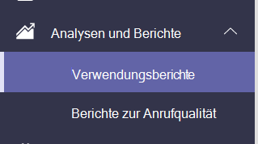
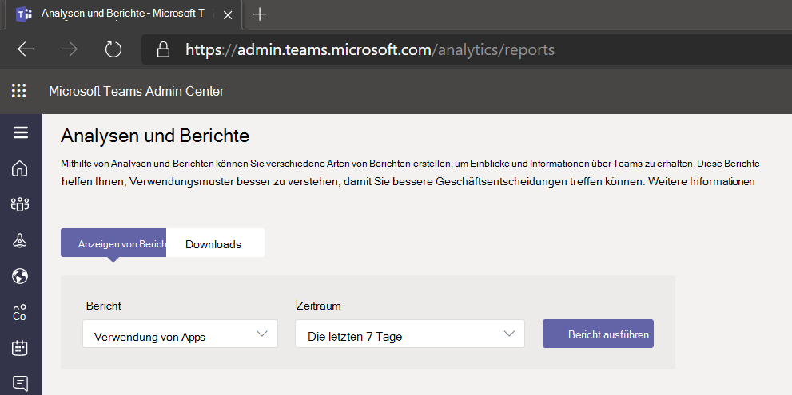

# Microsoft Teams der App-Verwendung

Der Teams Bericht zur App-Verwendung im Microsoft Teams Admin Center enthält Informationen darüber, welche Apps Benutzer in einem Teams.  

## Anzeigen des Berichts "App-Verwendung"

1. Klicken Sie im linken Navigationsbereich des Admin Centers unter <https://admin.teams.microsoft.com> auf **Analyseberichte &**  >  **Verwendungsberichte**.  
2. Wählen Sie **auf der Registerkarte** Berichte anzeigen unter **Bericht** die Option **Apps-Verwendung aus.**

3. Wähl Sie unter **Datumsbereich** einen Bereich aus, und klicken Sie dann auf **Bericht ausführen**. Im bericht Teams Apps-Nutzung werden die Trends über die letzten 7, 30 oder 90 Tage angezeigt.  

## Interpretieren des Berichts

:::image type="content" alt-text="Screenshot des Berichts Teams App-Nutzung im Teams Admin Center mit Callouts." source="media/app-usage-report5.png" lightbox="media/app-usage-report5.png":::

1. Jeder Bericht weist oben links ein Datum auf, das anschaut, wann der Bericht erstellt wurde. Berichte geben in der Regel eine Latenz von 24 Stunden ab dem Zeitpunkt des Öffnens einer App an.

2. Die Y-Achse im Diagramm gibt die Anzahl der Benutzer an, die für das Datum, das Sie durch Zeigen auf das Diagramm ausgewählt haben, als aktive Benutzer betrachtet werden, da die eine App mindestens einmal geöffnet haben.

3. Die X-Achse im Diagramm ist der Datumsbereich, den Sie für den Bericht ausgewählt haben.

4. Zeigen Sie an einem beliebigen Datum auf den Punkt, der die Nutzung einer App darstellt, um die Gesamtanzahl der aktiven Benutzer der App an diesem Datum zu sehen.

5. Um andere Apps auszuwählen, klicken Sie oben rechts auf das **Filtersymbol,** wählen Sie neue Kriterien aus, oder geben Sie sie ein, und klicken Sie dann auf **Übernehmen**.

6. In der Tabelle unten im Bericht werden aktive Benutzer und Teams nach App-Name angezeigt.

   - **App-Name** ist der Anzeigename der App, die in der App Teams.
   - **Aktive Benutzer** ist die Anzahl der Benutzer, die die App im angegebenen Zeitraum mindestens einmal geöffnet haben.
   - **Der App-Typ** ist ein statischer Wert von "Microsoft" oder "Drittanbieter".
   - **Aktive Teams** ist die Anzahl der Teams, die die App von mindestens einem Mitglied des Teams und während der angegebenen Zeiträume geöffnet haben.
   - **Publisher** ist der Softwareherausgeber der App.
   - **Version** ist die Softwareversion der App vom App-Herausgeber.

   > [!NOTE]
   > **Aktive Benutzer** und **aktive Teams werden** nur für Apps berechnet, die in Kanälen verwendet werden.

7. Zum Hinzufügen oder Entfernen von Spalten in der  Tabelle klicken Sie  oben rechts auf das Symbol Spalten bearbeiten, wählen Sie auf der Registerkarte Spalten bearbeiten neue Kriterien aus, und klicken Sie dann auf **Übernehmen**.

8. Um den Bericht für die Offlineanalyse in eine CSV-Datei zu exportieren, wählen Sie oben rechts das Symbol In **Excel** exportieren aus, und klicken Sie dann auf der Registerkarte **Downloads** unter **Status** auf **Herunterladen.**

   :::image type="content" alt-text="Screenshot des Downloads-Bereichs." source="media/app-usage-report7.png" lightbox="media/app-usage-report7.png":::

9. Wenn Sie den Bericht in Excel anzeigen, wird auch eine **ID-Spalte** angezeigt, die die App-ID darstellt, in der Regel eine alphanumerische Zeichenfolge. Wenn die **ID** auf **\n** ist, bedeutet dies, dass ein Benutzer um das Löschen seiner Informationen gebeten hat.

   

## Verwandte Themen

- [Teams – Analyse und Berichterstellung](teams-reporting-reference.md)
