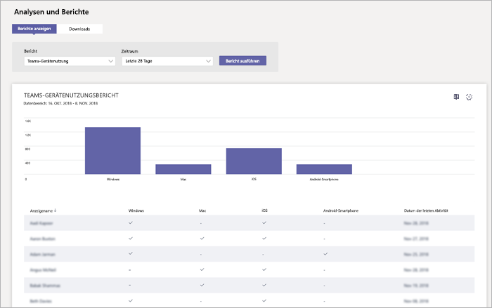

# Bericht zur Verwendung der Microsoft-Teams GerätMicrosoft Teams device usage report

Der Teams Gerät Verwendungsbericht in der Microsoft-Teams & Skype für Business Admin Center enthält Informationen zur Verbindung von Benutzern, Teams.The Teams device usage report in the Microsoft Teams & Skype for Business Admin Center provides you with information about how users connect to Teams. Sie können den Bericht verwenden, sehen Sie die Geräte, die verwendet werden, in Ihrer Organisation, einschließlich wie viele Teams von ihren mobilen Geräten, die beim Klicken auf Go verwenden.You can use the report to see the devices that are used across your organization, including how many use Teams from their mobile devices when on-the-go.  

![Screenshot des Nutzungsberichts Teams Gerät in der Microsoft-Teams & Skype für Business Admin Center] (../media/teams-reports-device-usage.png "Screenshot des Nutzungsberichts Teams Gerät in der Microsoft-Teams & Skype für Business Admin Center")

## Anzeigen des BerichtsView the report

1. Wechseln Sie zur Microsoft-Teams & Skype für Business-Verwaltungskonsole im linken Navigationsbereich, klicken Sie auf **Berichte und Analysen**, und wählen Sie dann unter **Bericht** **Teams Gerät Usage**.Go to the Microsoft Teams & Skype for Business Admin Center, in the left navigation, click **Analytics & reports**, and then under **Report**, select **Teams device usage**. 
2. Geben Sie unter **Datumsbereich**wählen Sie einen Bereich aus, und klicken Sie dann auf **Bericht ausführen**.Under **Date range**, select a range, and then click **Run report**. 

## Auswertung des BerichtsInterpret the report

![Screenshot des Nutzungsberichts Teams Gerät in der Microsoft-Teams & Skype für Business Admin Center] (../media/teams-reports-device-usage-with-callouts.png "Screenshot des Nutzungsberichts Teams Gerät in der Microsoft-Teams & Skype für Business Admin Center mit nummerierten Beschriftungen")

|BeschriftungCallout |BeschreibungDescription  |
|--------|-------------|
|**1****1**   |Der Teams Gerät Verwendungsbericht kann für Trends über die letzten 7 Tage oder 28 Tage angezeigt werden.The Teams device usage report can be viewed for trends over the last 7 days or 28 days.  |
|**2****2**   |Jeder Bericht besitzt Datum Wenn der Bericht generiert wurde.Each report has a date for when the report was generated. Die Berichte weisen in der Regel eine Latenz von 24 bis 48 Stunden ab dem Zeitpunkt der Aktivität auf.The reports usually reflect a 24 to 48 hour latency from time of activity. |
|**3****3**   |<ul><li>Die x-Achse des Diagramms stellt verschiedene Geräte (**Windows**, **Mac**, **iOS**, **Android-Telefon**) zum Verbinden mit Teams.The X axis on the chart represents the different devices (**Windows**, **Mac**, **iOS**, **Android Phone**) used to connect to Teams. </li><li>Die y-Achse ist die Anzahl der Benutzer des Geräts über den ausgewählten Zeitraum an.The Y axis is the number of users using the device over the selected time period.</li> </ul>Bewegen Sie den Mauszeiger über der Leiste, die ein Gerät, um die Anzahl der Benutzer mit dem Gerät herstellen Teams finden Sie unter darstellt.Hover over the bar representing a device to see the number of users using the device to connect to Teams.|
|**4****4**   |Die Tabelle enthält eine Aufschlüsselung der Gerät Auslastung durch Benutzer.The table gives you a breakdown of device usage by user. <ul><li>**Anzeigename** ist der Anzeigename des Benutzers.**Display name** is the display name of the user. Sie können den Anzeigenamen So wechseln zur Seite des Benutzers in der Microsoft-Teams & Skype für Business Admin Center klicken.You can click the display name to go to the user's setting page in the Microsoft Teams & Skype for Business Admin Center. </li><li>**Windows** ist aktiviert, wenn der Benutzer im Desktopclient Teams auf einem Windows-basierten Computer aktiv war.**Windows** is selected if the user was active in the Teams desktop client on a Windows-based computer.</li><li>**Mac** ist aktiviert, wenn der Benutzer im Desktopclient Teams auf einem Mac OS Computer aktiv war.**Mac** is selected if the user was active in the Teams desktop client on a macOS computer. </li> <li>**iOS** ist aktiviert, wenn der Benutzer auf dem Teams mobilen Client für iOS aktiv war.**iOS** is selected if the user was active on the Teams mobile client for iOS.</li><li>**Android-Telefon** wird ausgewählt, wenn der Benutzer auf dem Teams mobilen Client für Android aktiv war.**Android phone** is selected if the user was active on the Teams mobile client for Android. <li>**Letzte Aktivität** ist das Datum der letzten (UTC), das der Benutzer in einer Aktivität Teams verwendet wurde.**Last activity** is the last date (UTC) that the user participated in a Teams activity.</li> </ul> Um die Informationen anzeigen, die Sie in der Tabelle möchten, stellen Sie sicher, dass Sie die Spalten der Tabelle hinzufügen.To see the information that you want in the table, make sure to add the columns to the table. |
|**5****5**   |Wählen Sie zum Hinzufügen oder Entfernen von Spalten in der Tabelle **Spalten bearbeiten** .Select **Edit columns** to add or remove columns in the table. |
|**6****6**   |Wählen Sie **˙˙˙**, und **druckt Diagramm** , das Diagramm gedruckt.Select **˙˙˙**, and then **Print chart** to print the chart. |

## Verwandte ThemenRelated topics
- [Teams Analysen und BerichteTeams analytics and reporting](teams-reporting-reference.md)
- [Bericht zur Verwendung der TeamsTeams usage report](teams-usage-report.md)
- [Bericht über Benutzeraktivität TeamsTeams user activity report](user-activity-report.md)