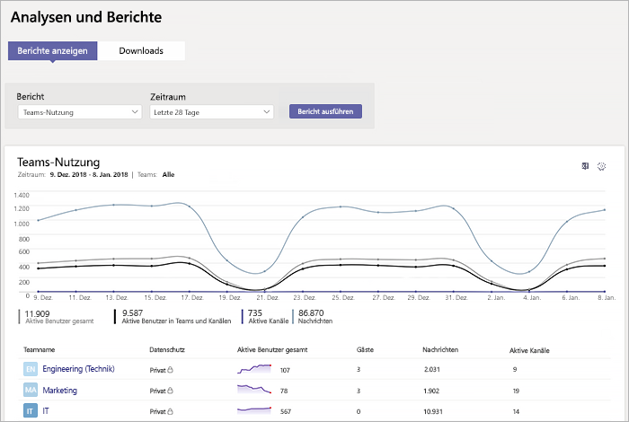

# Microsoft Teams – NutzungsberichtMicrosoft Teams usage report

Der Microsoft Teams-Nutzungsbericht im Microsoft Teams Admin Center gibt Ihnen einen Überblick über die Nutzungsaktivität in Microsoft Teams, einschließlich der Anzahl der aktiven Benutzer und Kanäle, sodass Sie schnell sehen können, wie viele Benutzer in Ihrer Organisation Microsoft Teams zur Kommunikation und Zusammenarbeit verwenden.The Teams usage report in the Microsoft Teams admin center gives you an overview of the usage activity in Teams, including the number of active users and channels, so you can quickly see how many users across your organization are using Teams to communicate and collaborate. Sie können Nutzungsinformationen für Microsoft Teams anzeigen, einschließlich der Anzahl der aktiven Benutzer und Kanäle, Gäste und Nachrichten in jedem Team.You can view usage information for  teams, including the number of active users and channels, guests, and messages in each team.

Screenshot ![des Teams-Nutzungsberichts im Admin Center] Screenshot (../media/teams-reports-teams-usage.png "des Teams-Nutzungsberichts im Microsoft Teams Admin Center")

## Anzeigen des BerichtsView the report

Klicken Sie im Microsoft Teams Admin Center im linken Navigationsbereich auf **Analyse #a0 Berichte**, und wählen Sie dann unter **Bericht**die \*\*\*\* Option 1.in aus.1.In the Microsoft Teams admin center, in the left navigation, click **Analytics & reports**, and then under **Report**, select **Teams usage**.
2. Wähl Sie unter **Datumsbereich** einen Bereich aus, und klicken Sie dann auf **Bericht ausführen**.Under **Date range**, select a range, and then click **Run report**.

## Interpretieren des BerichtsInterpret the report

Screenshot ![des Teams-Nutzungsberichts im Admin Center] (../media/teams-reports-teams-usage-with-callouts.png "Screenshot des Teams-Nutzungsberichts im Microsoft Teams Admin Center mit nummerierten Beschriftungen")

|BeschriftungCallout |BeschreibungDescription  |
|--------|-------------|
|**1****1**   |Im Teams-Nutzungsaktivitätsbericht werden die Trends der letzten 7 ober 28 Tage angezeigt.The Teams usage activity report can be viewed for trends over the last 7 days or 28 days. |
|**2****2**   |Jeder Bericht weist das Datum auf, an dem er generiert wurde. Die Berichte weisen in der Regel eine Latenz von 24 bis 48 Stunden ab dem Zeitpunkt der Aktivität auf.Each report has a date for when this report was generated. The reports usually reflect a 24 to 48 hour latency from time of activity. |
|**3****3**   |<ul><li>Die X-Achse im Diagramm stellt den ausgewählten Datumsbereich für den Bericht dar.The X axis on the chart is the selected date range for the report.</li> <li> Die Y-Achse gibt die Anzahl der aktiven Elemente oder Aktivitäten an.The Y axis is the count of active items or activity.</li> </ul>Bewegen Sie den Mauszeiger über den Punkt, der ein Element oder eine Aktivität an einem bestimmten Datum darstellt, um die Anzahl der Instanzen dieses Elements bzw. dieser Aktivität an dem bestimmten Datum anzuzeigen.Hover over the dot representing an item or activity on a given date to see the number of instances of that item or activity on that given date.|
|**4****4**   |Sie können filtern, was im Diagramm angezeigt wird, indem Sie in der Legende auf ein Element klicken.You can filter what you see on the chart by clicking an item in the legend. Klicken Sie beispielsweise auf **Gesamtzahl aktiver Benutzer**, **Teams #a0 aktiven Benutzern**, **aktiven Kanälen**oder **Nachrichten** , um nur die Informationen anzuzeigen, die sich auf die einzelnen Personen beziehen.For example, click  **Total active users**, **Teams & Channels active users**,  **Active channels**, or **Messages** to see only the info related to each one. Durch das Ändern dieser Auswahl werden die Informationen in der Tabelle nicht geändert.Changing this selection doesn’t change the information in the table. |
|**5****5**   |Die Tabelle enthält eine Aufschlüsselung der Nutzung nach Team.The table gives you a breakdown of usage by team. <ul><li>**Teamname** ist der Anzeigename des Teams.**Team name** is the display name of the team. Sie können auf den Teamnamen klicken, um zur Seite Einstellungen des Teams im Microsoft Teams Admin Center zu wechseln.You can click the team name to go to the team's settings page in the Microsoft Teams admin center. </li> <li>**Datenschutz** gibt an, ob es sich um ein privates oder öffentliches Team handelt.**Privacy** refers to whether the team is a private team or public team.</li> <li>**Aktive Benutzer** entspricht der Anzahl der aktiven Benutzer im Team im angegebenen Zeitraum.**Active users** is the number of active users in the team in the specified time period.</li><li>**Gäste** entspricht der Anzahl der Gäste im Team im angegebenen Zeitraum.**Guests** is the number of guests in the team in the specified time period.</li> </li> </ul>Beachten Sie, dass der Benutzername in der Tabelle als "--" angezeigt wird, wenn ein Benutzerkonto in Azure AD nicht mehr vorhanden ist.Note that if a user account no longer exists in Azure AD, the user name is displayed as "--" in the table.   Um in der Tabelle die gewünschten Informationen anzuzeigen, stellen Sie sicher, dass Sie der Tabelle die entsprechenden Spalten hinzufügen.To see the information that you want in the table, make sure to add the columns to the table. |
|**6****6**   |Wählen Sie **Spalten bearbeiten** aus, um Spalten zur Tabelle hinzuzufügen oder daraus zu entfernen.Select **Edit columns** to add or remove columns in the table.|
|**7****7**   |Sie können den Bericht zur Offlineanalyse in eine CSV-Datei exportieren.You can export the report to a CSV file for offline analysis. Klicken Sie auf **nach Excel exportieren**, und klicken Sie dann auf der Registerkarte **Downloads** auf **herunterladen** , um den Bericht herunterzuladen, wenn er fertig ist.Click **Export to Excel**, and then on the **Downloads** tab, click **Download** to download the report when it's ready. |

## Verwandte ThemenRelated topics
- [Teams – Analyse und BerichterstellungTeams analytics and reporting](teams-reporting-reference.md)
