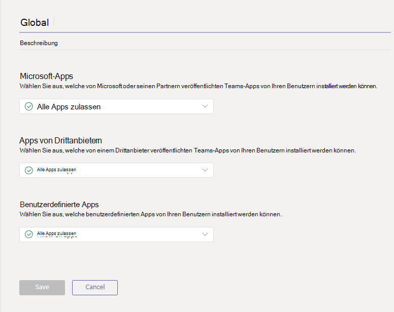
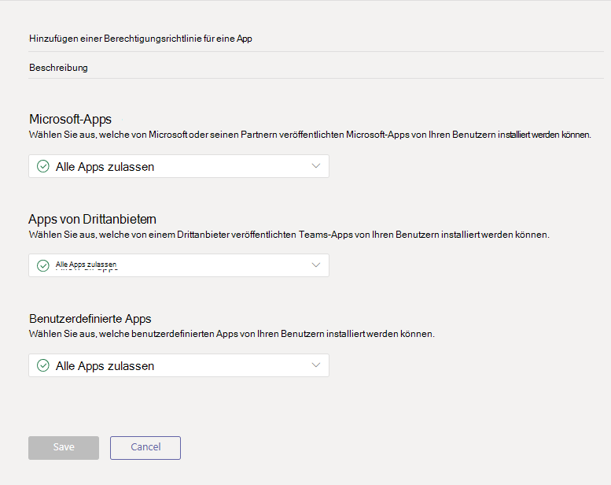

# <a name="manage-app-permission-policies-in-microsoft-teams"></a>Verwalten von Richtlinien für App-Berechtigungen in Microsoft Teams

Als Administrator können Sie App-Berechtigungsrichtlinien verwenden, um zu steuern, welche apps Microsoft Teams-Benutzern in Ihrer Organisation zur Verfügung stehen. Sie können alle apps oder bestimmte apps, die von Microsoft, Drittanbietern und Ihrer Organisation veröffentlicht wurden, zulassen oder blockieren. Wenn Sie eine APP blockieren, können Benutzer Sie nicht aus dem App Store von Teams installieren.

Sie verwalten App-Berechtigungsrichtlinien im Microsoft Teams Admin Center. Sie können die Einstellungen organisationsweit anwenden, die globale (org-Wide Standard)-Richtlinie verwenden sowie benutzerdefinierte Richtlinien für einzelne Benutzer oder Benutzer in einer Gruppe erstellen und zuweisen.  



> [!NOTE]
> Benutzer in Ihrer Organisation erhalten automatisch die globale Richtlinie, wenn Sie keine benutzerdefinierte Richtlinie erstellen und zuweisen. Organisationsweite App-Einstellungen überschreiben die globale Richtlinie und alle benutzerdefinierten Richtlinien, die Sie erstellen und Benutzern zuweisen.

Wenn sich Ihre Organisation bereits in Teams befindet, werden die App-Einstellungen, die Sie in **Mandanten weiten Einstellungen** im Microsoft 365 Admin Center konfiguriert haben, in den organisationsweiten App-Einstellungen widergespiegelt. Wenn Sie noch nicht bei Microsoft Teams sind und gerade erst anfangen, sind alle apps standardmäßig in der globalen Richtlinie zulässig. Dazu gehören apps, die von Microsoft, Drittanbietern und Ihrer Organisation veröffentlicht werden.

Angenommen, Sie möchten alle Drittanbieter-apps blockieren und bestimmte apps von Microsoft für das HR-Team in Ihrer Organisation zulassen. Sie würden eine benutzerdefinierte Richtlinie mit dem Namen HR-App-Berechtigungsrichtlinie erstellen, Sie so festlegen, dass Sie die gewünschten apps blockiert und zulässt, und Sie dann den Benutzern im HR-Team zuweisen.

## <a name="manage-org-wide-app-settings"></a>Verwalten von organisationsweiten App-Einstellungen

Verwenden Sie organisationsweite App-Einstellungen, um zu steuern, welche apps in Ihrer Organisation zur Verfügung stehen. Organisationsweite App-Einstellungen Regeln das Verhalten für alle Benutzer und überschreiben alle anderen APP-Berechtigungsrichtlinien, die Benutzern zugewiesen sind. Sie können Sie verwenden, um schädliche oder problematische apps zu steuern.

1. Wechseln Sie in der linken Navigationsleiste des Microsoft Teams Admin Center zu **Teams-apps** > -**Berechtigungsrichtlinien**.
2. Wählen Sie **organisationsweite Einstellungen**aus. Anschließend können Sie die gewünschten Einstellungen im Panel konfigurieren. 

3. Deaktivieren oder aktivieren Sie unter **apps von Drittanbietern**diese Einstellungen, um den Zugriff auf Drittanbieter-apps zu steuern:

    - **Zulassen von Drittanbieter-oder benutzerdefinierten apps in Teams**: Dadurch wird gesteuert, ob Benutzer Drittanbieter-oder benutzerdefinierte Apps verwenden können.
    - **Alle neuen Drittanbieter-apps zulassen, die standardmäßig im Store veröffentlicht**werden: Hiermit wird gesteuert, ob neue Drittanbieter-apps, die im App Store für Teams veröffentlicht werden, automatisch in Teams verfügbar sind. Diese Option kann nur festgesetzt werden, wenn Sie Drittanbieter-apps zulassen.

4. Deaktivieren oder aktivieren Sie unter **benutzerdefinierte apps**die Option **Interaktion mit benutzerdefinierten apps zulassen**. Diese Einstellung steuert, ob Benutzer mit benutzerdefinierten (quer geladene)-apps interagieren können. Beachten Sie, dass dies anders ist, als Benutzern das *hochladen* benutzerdefinierter apps zu ermöglichen.
5. Suchen Sie unter **Blockierte apps**nach den apps, die Sie in Ihrer Organisation blockieren möchten, und fügen Sie Sie hinzu. Sie können apps im Mandanten-App-Katalog oder im Teams-App-Store auswählen.
6. Klicken Sie auf **Speichern** , damit die App-Einstellungen für die gesamte Organisation wirksam werden.

## <a name="create-a-custom-app-permission-policy"></a>Erstellen einer benutzerdefinierten App-Berechtigungsrichtlinie

Wenn Sie die apps steuern möchten, die für unterschiedliche Benutzergruppen in Ihrer Organisation verfügbar sind, erstellen Sie eine oder mehrere benutzerdefinierte App-Berechtigungsrichtlinien, und weisen Sie diese zu. Sie können separate benutzerdefinierte Richtlinien erstellen und zuweisen, je nachdem, ob apps von Microsoft, Drittanbietern oder Ihrer Organisation veröffentlicht werden. Es ist wichtig zu wissen, dass Sie, nachdem Sie eine benutzerdefinierte Richtlinie erstellt haben, Sie nicht ändern können, wenn apps von Drittanbietern in organisationsweiten Einstellungen deaktiviert sind. 

1. Wechseln Sie in der linken Navigationsleiste des Microsoft Teams Admin Center zu **Teams-apps** > -**Berechtigungsrichtlinien**.
2. Klicken Sie auf **Hinzufügen**.
    
3. Geben Sie einen Namen und eine Beschreibung für die Richtlinie ein.
4. Wählen Sie unter **Microsoft-apps**, **Drittanbieter-apps**und Mandanten- **apps**eine der folgenden Optionen aus:

    - **Alle apps zulassen**
    - **Zulassen bestimmter apps und Blockieren aller anderen Personen**
    - **Blockieren bestimmter apps und zulassen aller anderen Personen**
    - **Blockieren aller apps**

5. Wenn Sie **bestimmte apps zulassen und andere blockieren**ausgewählt haben, fügen Sie die apps hinzu, die Sie zulassen möchten:

    1. Wählen Sie **apps zulassen**aus.
    1. Suchen Sie nach den apps, die Sie zulassen möchten, und klicken Sie dann auf **Hinzufügen**. Die Suchergebnisse werden nach dem App-Publisher (**Microsoft-apps**, **Drittanbieter-apps**oder **Mandanten-apps**) gefiltert.
    1. Wenn Sie die Liste der apps ausgewählt haben, klicken Sie auf **zulassen**.

6. Wenn Sie **bestimmte apps blockieren und alle anderen Personen zulassen**ausgewählt haben, suchen Sie nach den apps, die Sie blockieren möchten, und fügen Sie Sie hinzu.
7. Klicken Sie auf **Speichern**.

## <a name="edit-an-app-permission-policy"></a>Bearbeiten einer APP-Berechtigungsrichtlinie

Sie können das Microsoft Teams Admin Center verwenden, um eine Richtlinie zu bearbeiten, einschließlich der globalen Richtlinie und der von Ihnen erstellten benutzerdefinierten Richtlinien.

1. Wechseln Sie in der linken Navigationsleiste des Microsoft Teams Admin Center zu **Teams-apps** > -**Berechtigungsrichtlinien**.
2. Wählen Sie die Richtlinie aus, indem Sie links neben dem Richtliniennamen klicken und dann auf **Bearbeiten**klicken.
3. Nehmen Sie hier die gewünschten Änderungen vor. Sie können Einstellungen basierend auf dem App Publisher verwalten und apps basierend auf der Einstellung Zulassen/Blockieren hinzufügen und entfernen.
4. Klicken Sie auf **Speichern**.

## <a name="assign-a-custom-app-permission-policy-to-users"></a>Zuweisen einer benutzerdefinierten App-Berechtigungsrichtlinie für Benutzer

Mit dem Microsoft Teams Admin Center können Sie einem oder mehreren Benutzern oder dem Skype for Business PowerShell-Modul eine benutzerdefinierte Richtlinie zuweisen, um Gruppen von Benutzern eine benutzerdefinierte Richtlinie zuzuweisen, beispielsweise alle Benutzer in einer Sicherheitsgruppe oder Verteilergruppe.

### <a name="assign-a-custom-app-permission-policy-to-a-user"></a>Zuweisen einer benutzerdefinierten App-Berechtigungsrichtlinie zu einem Benutzer

1. Wechseln Sie in der linken Navigationsleiste des Microsoft Teams Admin Center zu **Benutzer**.
2. Wählen Sie den Benutzer aus, indem Sie links neben dem Benutzernamen klicken, und klicken Sie dann auf **Einstellungen bearbeiten**.
3. Wählen Sie unter **App-Berechtigungsrichtlinie**die APP-Berechtigungsrichtlinie aus, die Sie zuweisen möchten, und klicken Sie dann auf über **nehmen**.

Informationen zum Zuweisen einer Richtlinie zu mehreren Benutzern gleichzeitig finden Sie unter [Bearbeiten von Benutzereinstellungen für Teams in Massen](edit-user-settings-in-bulk.md).

Oder Sie können auch die folgenden Aktionen ausführen:

1. Wechseln Sie in der linken Navigationsleiste des Microsoft Teams Admin Center zu **Teams-apps** > -**Berechtigungsrichtlinien**.
2. Wählen Sie die Richtlinie aus, indem Sie links neben dem Richtliniennamen klicken.
3. Wählen Sie **Benutzer verwalten**aus.
4. Suchen Sie im Bereich **Benutzer verwalten** nach dem Benutzer mit Anzeigename oder nach Benutzername, wählen Sie den Namen aus, und klicken Sie dann auf **Hinzufügen**. Wiederholen Sie diesen Schritt für jeden Benutzer, den Sie hinzufügen möchten.
5. Wenn Sie mit dem Hinzufügen von Benutzern fertig sind, klicken Sie auf **Speichern**.

### <a name="assign-a-custom-app-permission-policy-to-users-in-a-group"></a>Zuweisen einer benutzerdefinierten App-Berechtigungsrichtlinie zu Benutzern in einer Gruppe

Möglicherweise möchten Sie mehreren Benutzern, die Sie bereits identifiziert haben, eine benutzerdefinierte App-Berechtigungsrichtlinie zuweisen. So können Sie beispielsweise allen Benutzern in einer Sicherheitsgruppe eine Richtlinie zuweisen. Sie können dies tun, indem Sie eine Verbindung mit dem Azure Active Directory PowerShell für Graph-Modul und dem Skype for Business PowerShell-Modul herstellen. Weitere Informationen zum Verwenden von PowerShell zum Verwalten von Teams finden Sie unter [Übersicht über Teams PowerShell](teams-powershell-overview.md).

In diesem Beispiel weisen wir allen Benutzern in der Projektgruppe "Contoso Pharmaceuticals HR" eine benutzerdefinierte App-Berechtigungsrichtlinie mit dem Namen "HR-App-Berechtigungsrichtlinie" zu.  

> [!NOTE]
> Stellen Sie sicher, dass Sie zunächst eine Verbindung mit dem Azure Active Directory PowerShell für Graph-Modul und dem Skype for Business PowerShell-Modul herstellen, indem Sie die Schritte unter [Herstellen einer Verbindung mit allen Office 365-Diensten in einem einzigen Windows PowerShell-Fenster](https://docs.microsoft.com/office365/enterprise/powershell/connect-to-all-office-365-services-in-a-single-windows-powershell-window)ausführen.

Rufen Sie die GroupObjectId der jeweiligen Gruppe ab.
```
$group = Get-AzureADGroup -SearchString "Contoso Pharmaceuticals HR Project"
```
Rufen Sie die Mitglieder der angegebenen Gruppe ab.
```
$members = Get-AzureADGroupMember -ObjectId $group.ObjectId -All $true | Where-Object {$_.ObjectType -eq "User"}
```
Weisen Sie allen Benutzern in der Gruppe eine bestimmte App-Berechtigungsrichtlinie zu. In diesem Beispiel handelt es sich um die Berechtigungsrichtlinie für HR-app.
```
$members | ForEach-Object { Grant-CsTeamsAppPermissionPolicy -PolicyName "HR App Permission Policy" -Identity $_.EmailAddress}
``` 
Je nach Anzahl der Mitglieder in der Gruppe kann dieser Befehl mehrere Minuten dauern.

## <a name="faq"></a>Häufig gestellte Fragen

### <a name="working-with-app-permission-policies"></a>Arbeiten mit App-Berechtigungsrichtlinien

#### <a name="can-i-control-line-of-business-lob-apps"></a>Kann ich Branchen-Apps (Business) steuern?
Ja, Sie können APP-Berechtigungsrichtlinien zum Steuern des Rollouts und der Verteilung von benutzerdefinierten (LOB-) Apps verwenden. Sie können eine benutzerdefinierte Richtlinie erstellen oder die globale Richtlinie bearbeiten, um benutzerdefinierte apps basierend auf den Anforderungen Ihrer Organisation zuzulassen oder zu blockieren.

#### <a name="how-do-app-permission-policies-relate-to-pinned-apps-and-app-setup-policies"></a>Wie beziehen sich app-Berechtigungsrichtlinien auf angeheftete apps und App-Setup Richtlinien?

Sie können APP-Setup Richtlinien zusammen mit App-Berechtigungsrichtlinien verwenden. Vor angeheftete apps werden aus der Gruppe aktivierter Apps für einen Benutzer ausgewählt. Darüber hinaus wird die app in Teams nicht angezeigt, wenn ein Benutzer über eine APP-Berechtigungsrichtlinie verfügt, die eine app in Ihrer APP-Setup Richtlinie blockiert.

#### <a name="can-i-use-app-permission-policies-to-restrict-uploading-custom-apps-also-known-as-sideloading"></a>Kann ich App-Berechtigungsrichtlinien verwenden, um das Hochladen benutzerdefinierter Apps (auch bekannt als Sideloading) zu beschränken?

Verwenden Sie organisationsweite Einstellungen in App-Berechtigungsrichtlinien, um das Hochladen benutzerdefinierter Apps für Ihre Organisation zu beschränken.  

Wenn Sie bestimmte Benutzer vom Hochladen benutzerdefinierter apps einschränken möchten, verwenden Sie benutzerdefinierte App-Richtlinien (in Kürze verfügbar). Weitere Informationen finden Sie unter [Verwalten von benutzerdefinierten App-Richtlinien und-Einstellungen in Teams](teams-custom-app-policies-and-settings.md).

#### <a name="does-blocking-an-app-apply-to-teams-mobile-clients"></a>Gilt das Blockieren einer APP für Mobile Microsoft Teams?

Ja, wenn Sie eine APP blockieren, wird diese APP für alle Teams-Clients blockiert.  

### <a name="user-experience"></a>Benutzererfahrung

#### <a name="what-does-a-user-experience-when-an-app-is-blocked"></a>Was kann ein Benutzer erleben, wenn eine APP blockiert wird?

Benutzer können nicht mit einer blockierten APP oder deren Funktionen, wie Bots, Tabstopps und Messaging Erweiterungen interagieren. In einem freigegebenen Kontext wie einem Team-oder Gruppen-Chat können Bots weiterhin Nachrichten an alle Teilnehmer dieses Kontexts senden. Teams zeigt dem Benutzer an, wenn eine APP blockiert ist.

Wenn beispielsweise eine APP blockiert ist, können die Benutzer keine der folgenden Aktionen ausführen:

- Hinzufügen der app persönlich oder eines Chats oder Teams
- Senden von Nachrichten an den App-bot
- Durchführen von Schaltflächenaktionen, die Informationen zurück an die APP senden, wie etwa umsetzbare Nachrichten  
- Anzeigen der Registerkarte der APP
- Einrichten von Connectors zum Empfangen von Benachrichtigungen
- Verwenden der Messaging-Erweiterung der APP

Das Legacy Portal hat das Steuern von apps auf Organisationsebene ermöglicht, was bedeutet, dass eine APP blockiert wird, wenn Sie für alle Benutzer in der Organisation blockiert ist. Die organisationsweite app-Einstellung in App-Berechtigungsrichtlinien funktioniert genauso.

Für App-Berechtigungsrichtlinien, die bestimmten Benutzern zugewiesen wurden, wenn eine APP mit bot-oder connectorfunktion zugelassen und dann blockiert wurde und die APP dann nur für einige Benutzer in einem freigegebenen Kontext zulässig ist, Mitglieder eines Gruppen-Chats oder Kanals, die nicht über die Berechtigung für diese APP verfügen  kann das Nachrichtenprotokoll und die Nachrichten sehen, die vom bot oder Connector gepostet wurden, aber nicht mit ihm interagieren können.

 ## <a name="related-topics"></a>Verwandte Themen
- [Administratoreinstellungen für Apps in Microsoft Teams](admin-settings.md)
