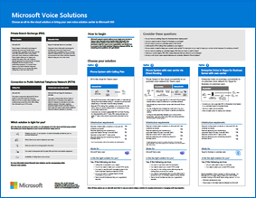

# Poster zu IT-Architektur und Sprachlösungen von Microsoft Teams

## Teams als Teil von Microsoft 365

Teams sind von zentraler Bedeutung für die logische Architektur von Produktivitätsdiensten in Microsoft 365 – einschließlich Datenkontrolle, Sicherheits- und Compliancefunktionen. 

Diese Illustrationen geben einen Einblick in die logische Architektur der Produktivitätsdienste für Enterprise-Architekten, beginnend mit Microsoft Teams.

   [PDF](https://github.com/MicrosoftDocs/OfficeDocs-Enterprise/raw/live/Enterprise/downloads/msft-m365-teams-logical-architecture.pdf) | [Visio](https://github.com/MicrosoftDocs/OfficeDocs-Enterprise/raw/live/Enterprise/downloads/msft-m365-teams-logical-architecture.vsdx)

## Gruppen in Microsoft 365

Was IT-Architekten über Gruppen in Microsoft 365 wissen müssen. Diese Illustrationen erläutern die unterschiedlichen Arten von Gruppen, erklären, wie diese erstellt und verwaltet werden, und bieten einige Vorschläge für Governance.

    [PDF](https://github.com/MicrosoftDocs/OfficeDocs-Enterprise/raw/live/Enterprise/downloads/msft-m365-groups.pdf) | [Visio](https://github.com/MicrosoftDocs/OfficeDocs-Enterprise/raw/live/Enterprise/downloads/msft-m365-groups.vsdx)

## Microsoft-Sprachlösungen

Microsoft unterstützt mehrere Optionen, wenn Sie mit der Einführung von Teams in der Microsoft-Cloud beginnen. Dieses Poster hilft Ihnen zu entscheiden, welche Microsoft-Sprachlösung (Telefonsystem in der Cloud oder Enterprise-VoIP, lokal) für die Benutzer in Ihrer Organisation geeignet ist und wie Ihre Organisation die Telefonfestnetzanbindung (Public Switched Telephone Network, PSTN) herstellen kann.

  
[PDF](https://download.microsoft.com/download/4/3/5/435cd4e9-ca56-4fd1-acb6-d1fda7952320/microsoft-voice-solutions.pdf) | [Visio](https://download.microsoft.com/download/7/5/c/75c13012-e20c-48bd-a6dd-ea49d1a3420d/microsoft-voice-solutions.vsdx)

Weitere Informationen finden Sie im Artikel zu diesem Poster: [Microsoft-Sprachlösungen](cloud-voice-landing-page.md)
  
## Siehe auch

[Ressourcen zur Cloud-IT-Architektur von Microsoft](/office365/enterprise/microsoft-cloud-it-architecture-resources)

[Herunterladen von Microsoft Teams](https://www.microsoft.com/microsoft-365/microsoft-teams/download-app#desktopAppDownloadregion)
