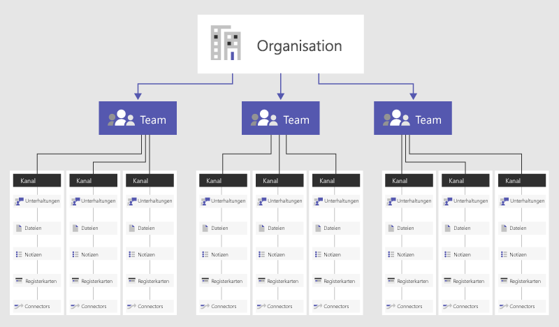

# Übersicht über Teams und Kanäle in Microsoft TeamsOverview of teams and channels in Microsoft Teams

> [!NOTE]
> Lesen Sie die folgenden Informationen, um einen besseren Überblick über Chat, Teams, Kanäle und Apps in Teams zu erlangen.Review the following information to understand chat, teams, channels, & apps in Teams. Wechseln Sie dann zu [Chat, Teams, Kanäle, #a0-apps in Teams](deploy-chat-teams-channels-microsoft-teams-landing-page.md) , um eine Liste der Entscheidungen zu durchlaufen, die für das Rollout Ihres Teams wichtig sind.Then, go to [Chat, teams, channels, & apps in Teams](deploy-chat-teams-channels-microsoft-teams-landing-page.md) to walk through a list of decisions important to your Teams rollout.

Betrachten wir zunächst, wie sich einzelne Teams mit Microsoft Teams selbst organisieren und in verschiedenen Geschäftsszenarien zusammenarbeiten können:Let’s get started by thinking about how Microsoft Teams allows individual teams to self-organize and collaborate across business scenarios:

- **Teams** sind Sammlungen von Personen, Inhalten und Tools für unterschiedliche Projekte und Ergebnisse innerhalb einer Organisation.**Teams** are a collection of people, content, and tools surrounding different projects and outcomes within an organization.

    - Teams können so aufgesetzt werden, dass nur eingeladene Benutzer Zugriff erhalten.Teams can be created to be private to only invited users.
    - Teams können auch als öffentliche und offene Teams erstellt werden, an denen alle in der Organisation teilnehmen können (maximal 5000 Mitglieder).Teams can also be created to be public and open and anyone within the organization can join (up to 5000 members).
    
    Teams sollen Gruppen von Personen zusammenbringen, die eng zusammenarbeiten, um ihre Produktivität zu verbessern.A team is designed to bring together a group of people who work closely to get things done. Möglich sind dynamische Teams für projektbasierte Aufgaben (zum Beispiel Einführung eines Produkts oder Einrichtung eines gemeinsamen digitalen Arbeitsraums). Eine weitere Möglichkeit sind ständige Teams, die die interne Struktur Ihrer Organisation widerspiegeln (z. B. Abteilungen und Bürostandorte).Teams can be dynamic for project-based work (for example, launching a product, creating a digital war room), as well as ongoing, to reflect the internal structure of your organization (for example, departments and office locations). Unterhaltungen, Dateien und Notizen in Teamkanälen sind nur für Mitglieder des Teams sichtbar.Conversations, files and notes across team channels are only visible to members of the team.

- **Kanäle** sind spezielle Abschnitte innerhalb eines Teams, mit denen Unterhaltungen nach bestimmten Themen, Projekten, Fachrichtungen oder anderen für Ihr Team wichtigen Aspekten organisiert werden.**Channels** are dedicated sections within a team to keep conversations organized by specific topics, projects, disciplines—-whatever works for your team! Dateien, die Sie in einem Kanal freigeben (auf der Registerkarte "Dateien"), werden in SharePoint gespeichert.Files that you share in a channel (on the Files tab) are stored in SharePoint. Weitere Informationen finden Sie unter [Interaktion zwischen SharePoint Online und OneDrive for Business mit Teams](SharePoint-OneDrive-interact.md).To learn more, read [How SharePoint Online and OneDrive for Business  interact with Teams](SharePoint-OneDrive-interact.md).

    - Kanäle sind Orte, an denen Unterhaltungen stattfinden und wo die Arbeit tatsächlich durchgeführt wird.Channels are places where conversations happen and where the work actually gets done. Kanäle können für alle Teammitglieder geöffnet sein, oder wenn Sie eine größere Auswahl an Zielgruppen benötigen, können Sie privat sein.Channels can be open to all team members or, if you need a more select audience, they can be private. Standard Kanäle sind für Konversationen, an denen sich jeder in einem Team beteiligen kann, und [private Kanäle](private-channels.md) beschränken die Kommunikation auf eine Teilmenge von Personen in einem Team.Standard channels are for conversations that everyone in a team can participate in and [private channels](private-channels.md) limit communication to a subset of people in a team.
    - Die Vorteile von Kanälen werden am deutlichsten, wenn Sie sie mit Apps erweitern, die Registerkarten, Connectors und Bots enthalten und damit den Nutzen für die Teammitglieder steigern.Channels are most valuable when extended with apps that include tabs, connectors, and bots that increase their value to the members of the team. Weitere Informationen finden Sie unter [apps, Bots, #a0-Connectors in Teams](deploy-apps-microsoft-teams-landing-page.md).To learn more, see [Apps, bots, & connectors in Teams](deploy-apps-microsoft-teams-landing-page.md).
    
Informationen zur Verwendung von Teams und Kanälen finden Sie unter [Teams und Kanäle](https://support.office.com/article/teams-and-channels-df38ae23-8f85-46d3-b071-cb11b9de5499).For help using teams and channels, check out [Teams and channels](https://support.office.com/article/teams-and-channels-df38ae23-8f85-46d3-b071-cb11b9de5499).

Sehen Sie sich dieses kurze Video an und erfahren Sie mehr über bewährte Methoden zum Erstellen von Teams und Kanälen.View this short video to learn more about best practices for creating teams and channels.

   > [!VIDEO https://www.youtube.com/embed/WkAVgNKn0hs]

Mitgliedschaft, Rollen und EinstellungenMembership, roles, and settings
------------------------------

**Team Mitgliedschaft****Team membership**

Wenn Microsoft Teams für Ihre gesamte Organisation aktiviert ist, können designierte Teambesitzer alle Mitarbeiter einladen, mit denen Sie zusammenarbeiten, um an Ihrem Team teilzunehmen.When Microsoft Teams is activated for your entire organization, designated team owners can invite any employee they work with to join their team. Teambesitzer können in Microsoft Teams ganz leicht Personen aus der Organisation anhand ihres Namens hinzufügen.Microsoft Teams makes it easy for team owners to add people in the organization based on their name. Je nach den Einstellungen Ihrer Organisation können auch Gäste, die zwar Teammitglieder sind, aber nicht der Organisation angehören, zu Ihren Teams hinzugefügt werden.Depending on your organization's settings guests who are team members but outside of your organization can also be added to your teams. Weitere Informationen finden Sie unter [Gastzugriff in Microsoft Teams](guest-access.md).See [Guest Access in Microsoft Teams](guest-access.md) for more information. 

Darüber hinaus können Teambesitzer ein Team auf der Grundlage einer vorhandenen Office 365-Gruppe erstellen.Team owners can also create a team based on an existing Office 365 Group. Alle an der Gruppe vorgenommenen Änderungen werden automatisch mit Microsoft Teams synchronisiert.Any changes made to the group will be synced with Microsoft Teams automatically. Durch die Erstellung eines Teams auf der Grundlage einer vorhandenen Office 365-Gruppe wird nicht nur das Einladen und Verwalten von Mitgliedern vereinfacht, sondern die Gruppendateien in Microsoft Teams werden ebenfalls synchronisiert.Creating a team based on an existing Office 365 Group not only simplifies the process of inviting and managing members, but also syncs group files inside of Microsoft Teams.

**Team Rollen****Team roles**

Es gibt zwei Hauptrollen in Microsoft Teams:There are two main roles in Microsoft Teams: 

- **Teambesitzer** – die Person, die das Team erstellt.**Team owner** - The person who creates the team. Teambesitzer können jedes Mitglied ihres Teams zum Mitbesitzer ernennen – entweder dann, wenn sie das Mitglied in das Team einladen, oder auch jederzeit später, nachdem die Person dem Team beigetreten ist.Team owners can make any member of their team a co-owner when they invite them to the team or at any point after they’ve joined the team. Wenn Sie über mehrere Teambesitzer verfügen, können Sie die Verantwortung für die Verwaltung von Einstellungen und Mitgliedschaften, einschließlich Einladungen, teilen.Having multiple team owners lets you share the responsibilities of managing settings and membership, including invitations.
- **Teammitglieder** – die Personen, die die Besitzer einladen, Ihrem Team beizutreten.**Team members** - The people who the owners invite to join their team.

Wenn die Moderation eingerichtet ist, können Teambesitzer und Mitglieder auch Moderatorfunktionen für einen Kanal besitzen.In addition, if moderation is set up, team owners and members can have moderator capabilities for a channel. Moderatoren können neue Beiträge im Kanal starten und Steuern, ob die Teammitglieder auf vorhandene Kanal Nachrichten antworten können.Moderators can start new posts in the channel and control whether team members can reply to existing channel messages. Team Besitzer können Moderatoren in einem Kanal zuweisen.Team owners can assign moderators within a channel. (Die Team Besitzer verfügen standardmäßig über Moderatorfunktionen.) Moderatoren in einem Kanal können andere Moderatoren in diesem Kanal hinzufügen oder entfernen.(Team owners have moderator capabilities by default.) Moderators within a channel can add or remove other moderators within that channel. Weitere Informationen finden Sie unter [Einrichten und Verwalten der Kanal Moderation in Microsoft Teams](manage-channel-moderation-in-teams.md).For more information, see [Set up and manage channel moderation in Microsoft Teams](manage-channel-moderation-in-teams.md).

**Team Einstellungen****Team settings** 

Teambesitzer können teamübergreifende Einstellungen direkt in Microsoft Teams verwalten.Team owners can manage team-wide settings directly in Microsoft Teams. Zu den Einstellungen gehören die Möglichkeit zum Hinzufügen eines teambilds, das Festlegen von Berechtigungen für Teammitglieder für die Erstellung von standardmäßigen und [privaten Kanälen](private-channels.md), das Hinzufügen von Registerkarten und Konnektoren, das @mentioning des gesamten Teams oder Kanals sowie die Verwendung von GIFs, Aufklebern und Memen.Settings include the ability to add a team picture, set permissions across team members for creating standard and [private channels](private-channels.md), adding tabs and connectors, @mentioning the entire team or channel, and the usage of GIFs, stickers, and memes.

Nehmen Sie sich drei Minuten Zeit, um sich dieses Handbuch für Teambesitzer anzusehen:Take three minutes to check out this go-to-guide video for team owners:

   > [!VIDEO https://www.youtube.com/embed/7XcDSuw6NR4]

Wenn Sie in Office 365 als Administrator für Microsoft Teams festgelegt sind, haben Sie im Microsoft Teams Admin Center Zugriff auf systemweite Einstellungen.If you are a Microsoft Teams administrator in Office 365, you have access to system-wide settings in the Microsoft Teams admin center. Diese Einstellungen können sich auf die Optionen und Standardeinstellungen auswirken, die Teambesitzer unter „Teameinstellungen“ sehen.These settings can impact the options and defaults team owners see under team settings. So können Sie beispielsweise einen Standardkanal, "Allgemein", für Team weite Ankündigungen, Diskussionen und Ressourcen aktivieren, die in allen Teams angezeigt werden.For example, you can enable a default channel, “General”, for team-wide announcements, discussions, and resources, which will appear across all teams.

Standardmäßig verfügen alle Benutzer über die Berechtigung, ein Team in Microsoft Teams zu erstellen (wie Sie dies ändern, erfahren Sie unter [Zuweisen von Rollen und Berechtigungen in Microsoft Teams](assign-roles-permissions.md)).By default, all users have permissions to create a team within Microsoft Teams (to modify this, see [Assign roles and permissions in Teams](assign-roles-permissions.md). Benutzer einer vorhandenen Office 365-Gruppe können Ihre Berechtigungen auch mit den Funktionen von Teams erweitern.Users of an existing Office 365 Group can also enhance their permissions with Teams functionality.

Eine wichtige frühzeitige Planungsaktivität, mit der Benutzer mit Microsoft Teams in Kontakt treten können, besteht darin, Personen zu helfen, zu denken und zu verstehen, wie Teams die Zusammenarbeit in Ihrem Alltag verbessern können.One key early planning activity to engage users with Microsoft Teams is to help people think and understand how Teams can enhance collaboration in their day to day lives. Sprechen Sie mit den Benutzern, und helfen Sie ihnen, Geschäftsszenarien auszuwählen, in denen sie zurzeit bruchstückweise zusammenarbeiten.Talk with people and help them select business scenarios where they are currently collaborating in fragmented ways. Bringen Sie Sie in einem Kanal zusammen mit den entsprechenden Registerkarten, die Ihnen helfen, ihre Arbeit zu erledigen.Bring them together in a channel with the relevant tabs that will help them get their work done. Die überzeugendsten Anwendungsfälle für Microsoft Teams sind alle organisationsübergreifenden Prozesse.One of the most powerful use cases of Teams is any cross-organizational process. 

Beispiele für TeamsExample Teams
--------------

Nachfolgend finden Sie einige praktische Beispiele dafür, wie unterschiedliche Benutzertypen ihre Teams, Kanäle und apps einrichten können (Registerkarten/Connectors/Bots).Below are a few functional examples of how different types of users may approach setting up their teams, channels, and apps (tabs/connectors/bots). Dies kann hilfreich sein, um eine Unterhaltung zu Microsoft Teams mit Ihrer Benutzercommunity zu starten.This may be useful to help kick off a conversation about Microsoft Teams with your user community. Wenn Sie sich überlegen, wie Sie Microsoft Teams in Ihrer Organisation implementieren können, denken Sie daran, dass Sie Anleitungen zum Strukturieren Ihrer Teams bereitstellen können. Benutzer haben jedoch die Kontrolle darüber, wie Sie sich selbst organisieren können.As you think about how to implement Microsoft Teams in your organization, remember that you can provide guidance on how to structure their teams; however, users have control of how they can self-organize. Dies sind nur Beispiele, die dazu beitragen, dass Teams sich über die Möglichkeiten Gedanken machen.These are just examples to help get teams to start thinking through the possibilities.

Microsoft Teams eignet sich hervorragend für den Abbau von organisatorischen Silos und die Förderung funktionsübergreifender Teams, daher sollten Sie Ihre Benutzer dazu ermutigen, über funktionelle Teams und nicht über organisatorische Grenzen nachzudenken.Microsoft Teams is great for breaking down organizational silos and promoting cross-functional teams, so encourage your users to think about functional teams rather than organizational boundaries.

|TeamtypenTypes of Teams  |Mögliche KanälePotential Channels  |Apps (RegisterkartenApps (Tabs /Connectors/Connectors /Bots/Bots ))  |
|---------|---------|---------|
|VertriebSales     |Jährliche VertriebsbesprechungAnnual Sales Meeting   Vierteljährlicher GeschäftsberichtQuarterly Business Review   Monatlicher VertriebspipelineberichtMonthly Sales Pipeline Review   VertriebsleitfadenSales Playbook |Power BIPower BI  TrelloTrello  CRMCRM  ZusammenfassungsbotSummarize Bot         |
|ÖffentlichkeitsarbeitPublic Relations     |PressemitteilungenPress Releases  Neuigkeiten und UpdatesNews and Updates  Überprüfung der FaktenFact Checking         |RSS-FeedRSS Feed  TwitterTwitter         |
|Event Planning (Veranstaltungsplanung)Event Planning     |MarketingMarketing  Logistik und PlanungLogistics and Scheduling  VeranstaltungsortVenue  BudgetBudget         |TwitterTwitter  FacebookFacebook  PlannerPlanner  PDFPDF         |
|Marketing/MarkteinführungMarketing/Go to Market   |MarktforschungMarket Research  Säulen des MessagingMessaging Pillars  KommunikationsplanCommunications Plan  MarketingstücklisteMarketing Bill of Materials        |YouTubeYouTube  Microsoft StreamMicrosoft Stream  TwitterTwitter  MailChimpMailChimp         |
|Technischer BetriebTechnical Operations    |Incident ManagementIncident Management  SprintplanungSprint Planning  ArbeitselementeWork Items  Infrastruktur und BetriebInfrastructure and Operations         |Team ServicesTeam Services  JiraJira  AzureBotAzureBot         |
|ProduktteamProduct Team      |StrategieStrategy  MarketingMarketing  VertriebSales  VorgängeOperations  InsightsInsights  Dienste und SupportServices & Support         |Power BIPower BI  Team ServicesTeam Services         |
|FinanzenFinance    |Aktuelles GeschäftsjahrCurrent Fiscal  GeschäftsjahresplanungFY Planning  PrognoseForecasting  ForderungenAccounts Receivable  VerbindlichkeitenAccounts Payable         |Power BIPower BI  Google AnalyticsGoogle Analytics         |
|LogistikLogistics     |LagerbetriebWarehouse Operations  FahrzeugwartungVehicle Maintenance  FahrerdienstpläneDriver Rosters         |WetterdienstWeather Service  VerkehrsstörungenTravel / Road Disruptions  PlannerPlanner  TubotTubot  UPS-BotUPS Bot         |
|HRHR     |TalentmanagementTalent Management  PersonalsucheRecruiting  LeistungsbewertungsplanungPerformance Review Planning  ArbeitsmoralMorale         |Tools für das PersonalwesenHR Tools  Externe Websites für StellenausschreibungenExternal Job Posting Sites  GrowbotGrowbot         |
|OrganisationsübergreifendesCross-organizational   virtuelles TeamVirtual Team |StrategieStrategy  MitarbeiterentwicklungWorkforce Development  Wettbewerb und ForschungCompete & Research         |Power BIPower BI  Microsoft StreamMicrosoft Stream         |

Es ist möglich, Teams zu erstellen, die an der Organisationsstruktur ausgerichtet sind.It's possible to create Teams that align with the organizational structure. Diese Vorgehensweise eignet sich am besten für Führungspersönlichkeiten, die ihre Moral vorantreiben, Team spezifische Überprüfungen durchführen, Mitarbeiter an Bord verdeutlichen, Arbeitspläne diskutieren und die Sichtbarkeit für unterschiedliche Arbeitskräfte verbessern möchten.This is best used for leaders who want to drive morale, have team-specific reviews, clarify employee onboarding processes, discuss workforce plans, and increase visibility across a diverse workforce.  

## Organisationsweite TeamsOrg-wide teams

Wenn Ihre Organisation aus nicht mehr als 5 000 Benutzer besteht, können Sie ein organisationsweites Team erstellen.If your organization has no more than 5,000 users, you can create an org-wide team. Organisationsweite Teams bieten eine automatische Möglichkeit für alle Personen in einer Organisation, Teil eines einzelnen Teams für die Zusammenarbeit zu sein.Org-wide teams provide an automatic way for everyone in an organization to be a part of a single team for collaboration. Weitere Informationen, einschließlich bewährter Methoden zum Erstellen und Verwalten eines organisationsweiten Teams, finden Sie unter [Erstellen eines organisationsweiten Teams in Microsoft Teams](create-an-org-wide-team.md).For more information, including best practices for creating and managing an org-wide team, see [Create an org-wide team in Microsoft Teams](create-an-org-wide-team.md).
