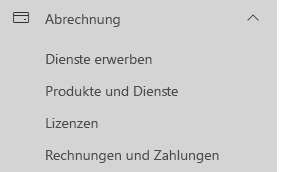
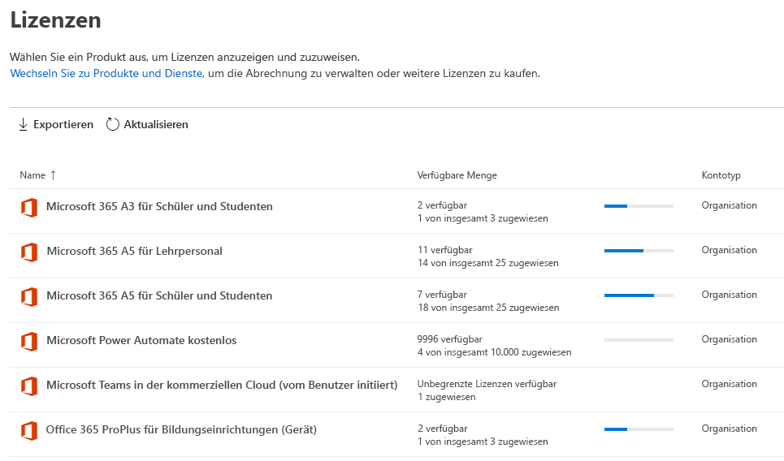
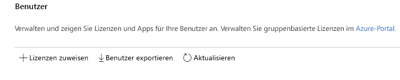
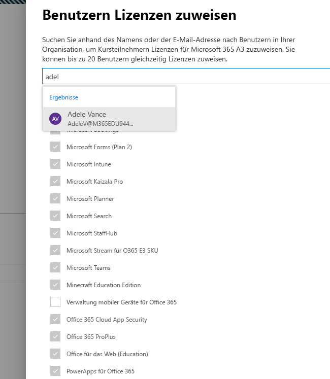
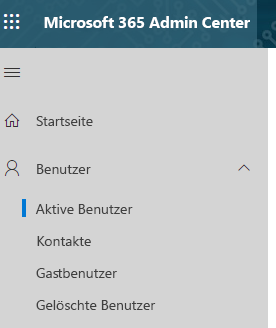
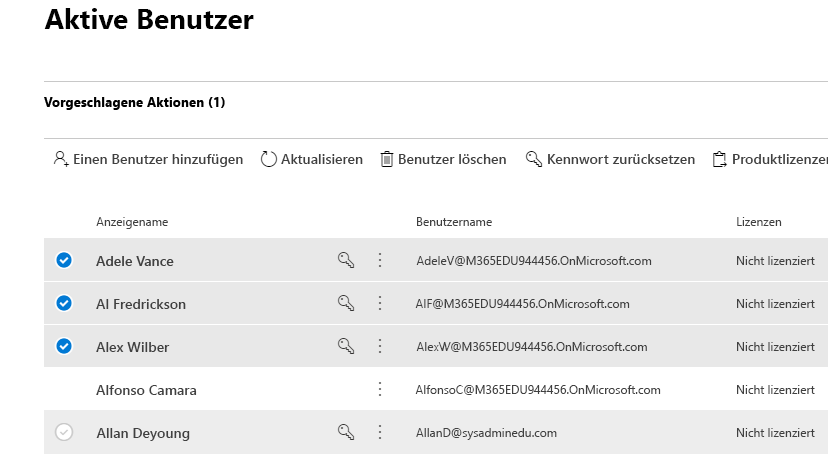
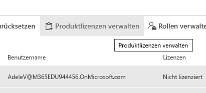
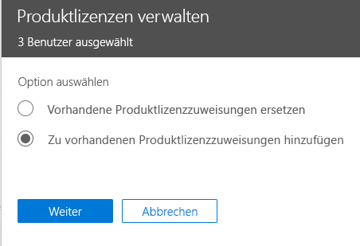

# Zuweisen von Microsoft Teams-Lizenzen für BildungseinrichtungenAssign Microsoft Teams licenses for EDU

Microsoft Teams ist ein digitaler Hub, der Unterhaltungen, Inhalte und Apps an einem zentralen Ort zusammenbringt.Microsoft Teams is a digital hub that brings conversations, content, and apps together in one place. Da es auf Office 365 basiert, profitieren Bildungseinrichtungen von der Integration in die vertrauten Office-Apps und -Dienste.Because it's built on Office 365, schools benefit from integration with their familiar Office apps and services. Mit Microsoft Teams kann Ihre Institution gemeinsame Kursräume erstellen, sich in professionellen Lerngemeinschaften (Professional Learning Communities, PLCs) verbinden und mit den Mitarbeitern ihrer Bildungseinrichtung kommunizieren – alles das über eine einzige Benutzeroberfläche in Office 365 Education.Your institution can use Microsoft Teams to create collaborative classrooms, connect in professional learning communities, and communicate with school staff all from a single experience in Office 365 for Education.

Zum Einstieg müssen IT-Administratoren das Microsoft 365 Admin Center verwenden, um [Microsoft Teams für ihre Bildungseinrichtung zu aktivieren](https://docs.microsoft.com/microsoft-365/education/intune-edu-trial/enable-microsoft-teams).To get started, IT administrators need to use the Microsoft 365 Admin Center to [enable Microsoft Teams for your school](https://docs.microsoft.com/microsoft-365/education/intune-edu-trial/enable-microsoft-teams).
Anschließend müssen Sie den Benutzerkonten Lizenzen zuweisen, damit ihre Lehrkräfte, Mitarbeiter und Schüler/Studenten auf Office 365-Dienste wie Microsoft Teams zugreifen können.Once complete, you must assign licenses to user accounts so your faculty, staff, and students can access Office 365 services, such as Microsoft Teams.

Sie können Benutzerkonten Lizenzen entweder einzeln oder automatisch über eine Gruppenmitgliedschaft zuweisen.You can assign licenses to user accounts either individually or automatically through group membership. In diesem Artikel erfahren Sie, wie Sie einem einzelnen Benutzer oder einer kleinen Gruppe von Benutzerkonten über das Microsoft 365 Admin Center Office 365-Lizenzen zuweisen.This article will walk you through how to assign Office 365 licenses to an individual or a small set of user accounts via the Microsoft 365 admin center. Informationen zum automatischen Zuweisen von Lizenzen über eine Gruppenmitgliedschaft finden Sie in den folgenden Artikeln:To assign licenses automatically through group membership, see one of our supporting articles:

- [Office 365 PowerShellOffice 365 Powershell](https://docs.microsoft.com/office365/enterprise/powershell/assign-licenses-to-user-accounts-with-office-365-powershell)
- [Gruppenbasierte Lizenzierung in Active DirectoryGroup-based Licensing in Active Directory](https://docs.microsoft.com/azure/active-directory/users-groups-roles/licensing-groups-assign)

Sie können Benutzern entweder auf der Seite **Lizenzen** oder auf der Seite **Aktive Benutzer** Lizenzen zuweisen.You can assign licenses to users on either the **Licenses** page, or on the **Active Users** page. Welche Methode Sie verwenden, hängt davon ab, ob Sie bestimmten Benutzern Produktlizenzen zuweisen oder Benutzern Lizenzen für bestimmte Produkte zuweisen möchten.Which method you use depends on whether you want to assign product licenses to specific users, or assign users licenses to specific products.

> [!NOTE]
> Wenn Sie das neue Microsoft 365 Admin Center nicht verwenden, können Sie es aktivieren, indem Sie den Umschalter **Das neue Admin Center** am oberen Rand der Startseite auswählen.If you're not using the new Microsoft 365 admin center, you can turn it on by selecting the **Try the new admin center** toggle located at the top of the Home page.

## Benutzern auf der Seite "Lizenzen" Lizenzen zuweisenAssign licenses to users on the Licenses page

> [!NOTE]
> Sie müssen globaler Administrator, Abrechnungsadministrator, Lizenzadministrator oder Benutzerverwaltungsadministrator sein. Weitere Informationen finden Sie unter [Informationen zu Administratorrollen von Office 365](https://docs.microsoft.com/microsoft-365/admin/add-users/about-admin-roles).You must be a Global admin, Billing admin, License admin, or User management admin. For more information, see [About Office 365 admin roles](https://docs.microsoft.com/microsoft-365/admin/add-users/about-admin-roles).

Wenn Sie zum Zuweisen von Lizenzen die Seite **Lizenzen** verwenden, können Sie bis zu 20 Benutzern Lizenzen für ein bestimmtes Produkt zuweisen.When you use the **Licenses** page to assign licenses, you assign licenses for a specific product for up to 20 users. Auf der Seite **Lizenzen** wird eine Liste aller Produkte angezeigt, für die Sie über Abonnements verfügen. Außerdem sehen Sie hier die Gesamtzahl der Lizenzen für jedes Produkt und erfahren, wie viele Lizenzen zugewiesen und wie viele verfügbar sind.On the **Licenses** page, you see a list of all the products you have subscriptions for, together with the total number of licenses for each product, how many licenses are assigned, and how many are available.

1. Navigieren Sie im Admin Center zur Seite **Abrechnung** > [Lizenzen](https://go.microsoft.com/fwlink/p/?linkid=842264).In the admin center, go to the **Billing** > [Licenses](https://go.microsoft.com/fwlink/p/?linkid=842264) page.

   
2. Wählen Sie ein Produkt aus, für das Sie Lizenzen zuweisen möchten.Select a product for which you want to assign licenses. Microsoft Teams ist ein Bestandteil der kostenlosen Office 365 A1 für Schüler und Studenten-SKU.Microsoft Teams is part of the free Office 365 A1 for Students SKU.

   
3. Wählen Sie **Lizenzen zuweisen** aus.Select **Assign licenses**.

   
4. Beginnen Sie im Bereich **Benutzern Lizenzen zuweisen** mit der Eingabe eines Namens, um eine Liste von Namen anzuzeigen.In the **Assign licenses to users** pane, begin typing a name, which should generate a list of names. Wählen Sie den gewünschten Namen aus den Ergebnissen aus, um ihn der Liste hinzuzufügen.Choose the name you're looking for from the results to add it to the list. Sie können bis zu 20 Benutzer gleichzeitig hinzufügen.You can add up to 20 users at a time.

   
5. Wählen Sie **Apps und Dienste aktivieren oder deaktivieren** aus, um den Zugriff auf bestimmte Elemente, z. B. Microsoft Teams, zuzuweisen oder zu entfernen.Select **Turn apps and services on or off** to assign or remove access to specific items, such as Microsoft Teams. Stellen Sie sicher, dass **Microsoft Teams** und **Office für das Web (Education)** ausgewählt sind.Ensure **Microsoft Teams** and **Office for the web (Education)** are selected.
6. Wählen Sie abschließend **Zuweisen** und dann **Schließen** aus.When you're finished, select **Assign**, then select **Close**.

So ändern Sie die Apps und Dienste, auf die ein Benutzer zugreifen kannTo change the apps and services a user has access to:

1. Wählen Sie die Zeile aus, die den Benutzer enthält.Select the row that contains the user.
1. Aktivieren bzw. deaktivieren Sie im rechten Bereich die Apps und Dienste, für die Sie Zugriff gewähren oder entfernen möchten.In the right pane, select or deselect the apps and services that you want to give access to, or remove access from.
1. Wählen Sie abschließend **Speichern** und dann **Schließen** aus.When you're finished, select **Save**, then select **Close**.

## Zuweisen von Lizenzen zu einem oder mehreren Benutzern auf der Seite "Aktive Benutzer"Assign licenses to an individual or multiple users on the Active users page

1. Wechseln Sie im Admin Center zu der Seite **Benutzer** > [Aktive Benutzer](https://go.microsoft.com/fwlink/p/?linkid=834822).In the admin center, go to the **Users** > [Active users](https://go.microsoft.com/fwlink/p/?linkid=834822) page.

   
2. Aktivieren Sie die Kreise neben den Namen der Benutzer, denen Sie Lizenzen zuweisen möchten.Select the circles next to the name(s) of the user(s) you want to assign license(s) to.

   
3. Wählen Sie am oberen Rand **Produktlizenzen verwalten** aus.At the top select **Manage product licenses**.

   
4. Wählen Sie im Bereich **Produktlizenzen verwalten** die Optionen **Zu vorhandenen Produktlizenzzuweisungen hinzufügen** > **Weiter** aus.In the **Manage product licenses** pane, select **Add to existing product license assignments** > **Next**.

   
5. Setzen Sie im Bereich **Zu vorhandenen Produktlizenzzuweisungen hinzufügen** die Umschaltfläche für die Lizenz, die der ausgewählten Benutzer erhalten soll, auf die Stellung **Ein**.In the **Add to existing products** pane, switch the toggle to the **On** position for the license that you want the selected users to have. Stellen Sie sicher, dass **Microsoft Teams** und **Office für das Web (Education)** ausgewählt sind.Ensure **Microsoft Teams** and **Office for the web (Education)** are selected.

   

   Standardmäßig werden alle diesen Lizenzen zugeordneten Dienste dem Benutzer automatisch zugewiesen.By default, all services associated with those license(s) are automatically assigned to the user(s). Sie können die für die Benutzer verfügbaren Dienste einschränken.You can limit which services are available to the users. Setzen Sie die Umschaltfläche für die Dienste, die die Benutzer nicht erhalten sollen, auf die Stellung **Aus**.Switch the toggles to the **Off** position for the services that you don't want the users to have.
6. Wählen Sie am unteren Rand des Bereichs "Hinzufügen" > "Schließen" aus.At the bottom of the pane, select Add > Close.
