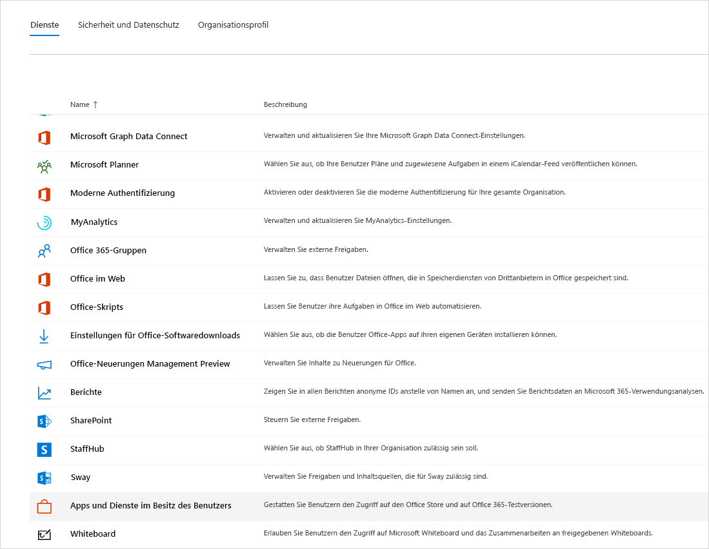

Verwalten der explorativen Lizenz von Microsoft Teams
=======================================================

Die explorative Microsoft Teams-Umgebung ermöglicht Benutzern in Ihrer Organisation, die über Azure Active Directory (AAD) verfügen und nicht für Teams lizenziert sind, eine explorative Umgebung von Microsoft Teams zu starten. Administratoren können dieses Feature für Benutzer in ihrer Organisation aktivieren oder deaktivieren. Die frühere [Microsoft Commercial Cloud-Testversion](iw-trial-teams.md) wurde durch die explorative Microsoft Teams-Umgebung ersetzt.

## Was ist in der explorativen Microsoft Teams-Umgebung enthalten?

Folgende Dienstpläne werden einem Administrator als Teil der Microsoft Teams Exploratory-Umgebung angezeigt:
 - Exchange Online (Plan 1)
 - Microsoft Flow für Office 365
 - MyAnalytics Insights
 - Microsoft Forms (Plan E1)
 - Microsoft Planner
 - Microsoft Search
 - Microsoft StaffHub
 - Microsoft Stream für Office 365 E1 SKU
 - Microsoft Teams
 - Verwaltung mobiler Geräte für Office 365
 - Office Mobile-Apps für Office 365 
 - Office Online
 - PowerApps für Office 365
 - SharePoint Online (Plan 1)
 - Sway
 - To-Do (Plan 1)
 - Whiteboard (Plan 1)
 - Yammer Enterprise

## Wer ist berechtigt?

Solange ein Benutzer über eine verwaltete AAD-Domänen-E-Mail-Adresse verfügt und ihm aktuell keine Teams-Lizenz zugewiesen wurde, ist er zur Nutzung dieser Umgebung berechtigt. Wenn ein Benutzer beispielsweise Office 365 Business verwendet (das Microsoft Teams nicht beinhaltet), ist er berechtigt, die explorative Microsoft Teams-Umgebung in Anspruch zu nehmen.

Benutzern muss (im Microsoft 365 Admin Center) die Möglichkeit bereitgestellt werden, sich für Apps und Testversionen zu registrieren. Weitere Informationen finden Sie weiter unten in diesem Artikel unter [Verwalten der explorativen Microsoft Teams-Umgebung](#manage-the-teams-exploratory-experience). 

## Wer ist nicht berechtigt?

Ihre Organisation ist nicht für dieses Angebot berechtigt, wenn Sie ein Syndication-Partnerkunde oder ein GCC-, GCC High-, DoD- oder EDU-Kunde sind.

## So können Benutzer sich für die explorative Microsoft Teams-Umgebung registrieren

Berechtigte Benutzer können sich für die explorative Microsoft Teams-Umgebung registrieren, indem sie sich bei Microsoft Teams ([teams.microsoft.com](https://teams.microsoft.com)) anmelden. Daraufhin wird ihnen automatisch diese Lizenz zugewiesen. Der Mandantenadministrator erhält eine E-Mail-Benachrichtigung, wenn eine Person in seiner Organisation die explorative Microsoft Teams-Umgebung zum ersten Mal startet.

## Verwalten der explorativen Microsoft Teams-Umgebung

Die explorative Microsoft Teams-Umgebung ist für die Initialisierung durch einzelne Endbenutzer bestimmt, und Sie sind nicht berechtigt, dieses Angebot im Namen von Endbenutzern oder Angestellten zu initiieren.

Die explorative Microsoft Teams-Umgebung wird mit einer Exchange Online-Lizenz geliefert, die dem Benutzer jedoch erst vom Administrator zugewiesen werden muss. Verfügt der Benutzer noch über keine Exchange-Lizenz, kann er keine Besprechungen in Teams planen und andere Teams-Funktionen möglicherweise nicht verwenden, solange der Administrator die Exchange Online-Lizenz noch nicht zugewiesen hat.

Administratoren können die Option zur Ausführung der explorativen Microsoft Teams-Umgebung für Benutzer in ihrer Organisation über den Switch **Test-Apps und -Dienste** deaktivieren.

### Verhindern, dass Benutzer Test-Apps und -dienste installieren

Sie können die Möglichkeit des Benutzers deaktivieren, Test-Apps und -Dienste zu installieren, wodurch Sie Benutzer daran hindern, die explorative Microsoft Teams-Umgebung auszuführen.

1. Navigieren Sie im [Microsoft 365 Admin Center](https://portal.office.com/adminportal/home) zu **Einstellungen** > **Einstellungen**, wählen Sie **Dienste** und dann **Apps und Dienste im Besitz des Benutzers** aus.

    

2. Deaktivieren Sie das Kontrollkästchen **Benutzer Test-Apps und -dienste installieren lassen**.

    

    > [!NOTE]
    > Wenn Ihre Organisation nicht berechtigt ist, die explorative Microsoft Teams-Umgebung in Anspruch zu nehmen, wird die Option **Benutzer Test-Apps und -dienste installieren lassen** nicht angezeigt.

### Verwalten der Verfügbarkeit für einen Benutzer mit einer Lizenz, die Microsoft Teams umfasst

Ein Benutzer, dem eine Lizenz zugewiesen wurde, die Microsoft Teams bereits umfasst, ist nicht berechtigt, die explorative Microsoft Teams-Umgebung in Anspruch zu nehmen. Wenn der Microsoft Teams-Serviceplan aktiviert ist, kann sich der Benutzer anmelden und Microsoft Teams verwenden. Wenn der Dienstplan deaktiviert ist, kann sich der Benutzer nicht anmelden, und die explorative Microsoft Teams-Umgebung ist nicht verfügbar.

So deaktivieren Sie den Zugriff auf Teams:

1. Wählen Sie im Microsoft 365 Admin Center, **Benutzer** > **Aktive Benutzer** aus.

2. Aktivieren Sie das Kontrollkästchen neben dem Namen des Benutzers.

3. Wählen Sie rechts in der Zeile **Produktlizenzen** die Option **Bearbeiten** aus.

4. Wechseln Sie im Bereich **Produktlizenzen** die Umschaltfläche auf **Aus**.

    

### Verwalten der Verfügbarkeit von Microsoft Teams für Benutzer, die bereits die explorative Microsoft Teams-Umgebung verwenden

Wenn ein Benutzer die explorative Microsoft Teams-Umgebung ausführt, können Sie diese deaktivieren, indem Sie die Lizenz oder den Dienstplan entfernen.

So deaktivieren Sie die Lizenz für die explorative Microsoft Teams-Umgebung:

1. Wählen Sie im Microsoft 365 Admin Center, **Benutzer** > **Aktive Benutzer** aus.

2. Aktivieren Sie das Kontrollkästchen neben dem Namen des Benutzers.

3. Wählen Sie rechts in der Zeile **Produktlizenzen** die Option **Bearbeiten** aus.

4. Wechseln Sie im Bereich **Produktlizenzen** die Umschaltfläche für die explorative Lizenz auf **Aus**.
   
    >[!Note]
    >Die Umschaltfläche für die explorative Microsoft Teams-Umgebung wird angezeigt, sobald der erste Benutzer in der Organisation die explorative Microsoft Teams-Umgebung startet.

### Verwalten von Microsoft Teams für Benutzer, die über die explorative Microsoft Teams-Lizenz verfügen

Sie können Benutzer mit einer explorativen Microsoft Teams-Lizenz genauso verwalten wie Benutzer mit einer regulären kostenpflichtigen Lizenz. Weitere Informationen finden Sie unter [Verwalten von Microsoft Teams-Einstellungen in Ihrer Organisation](enable-features-office-365.md).

### Upgraden von Benutzern mit der explorativen Microsoft Teams-Lizenz

Um Benutzer mit der explorative Microsoft Teams-Lizenz zu upgraden, gehen Sie wie folgt vor:

1. Kaufen Sie ein Abonnement, das Microsoft Teams enthält.

2. Entfernen Sie das Abonnement der explorativen Microsoft Teams-Umgebung des Benutzers.

3. Weisen Sie die neu erworbene Lizenz zu.

Weitere Informationen finden Sie unter [Office 365-Lizenzen für Microsoft Teams](Office-365-licensing.md).

> [!NOTE]
> Wenn die Microsoft Teams Exploratory-Lizenz abläuft und kein unmittelbares Upgrade auf ein Abonnement, das Microsoft Teams umfasst, für einen Benutzer erfolgt, werden die Benutzerdaten nicht entfernt. Der Benutzer bleibt weiterhin in Azure Active Directory und alle Daten innerhalb von Teams werden beibehalten. Sobald dem Benutzer eine neue Lizenz zugewiesen ist, die Teams-Funktionen aktiviert, sind die Inhalte weiterhin vorhanden. 

## Was geschieht mit den Legacylizenzen für den Test der kommerziellen Cloud von Microsoft Teams?

Ab Februar 2020 können berechtigte Benutzer mit der Nutzung der neuesten Microsoft Teams Exploratory-Umgebung beginnen. Alle Legacylizenzen für den Test der kommerziellen Cloud von Microsoft Teams werden automatisch in das neue Angebot konvertiert, bevor die Testversion abläuft.

### Entfernen einer explorativen Microsoft Teams-Lizenz

- Wenn Sie diese Lizenz über PowerShell entfernen möchten, ziehen Sie [Entfernen von Lizenzen von Benutzerkonten mit Office 365 PowerShell](https://docs.microsoft.com/office365/enterprise/powershell/remove-licenses-from-user-accounts-with-office-365-powershell) zurate.

- Wenn Sie diese Lizenz über das Verwaltungsportal entfernen möchten, lesen Sie [Entfernen von Lizenzen von Benutzern in Office 365 Business](https://docs.microsoft.com/office365/admin/subscriptions-and-billing/remove-licenses-from-users?view=o365-worldwide).

## Wie lange wird die Teams Exploratory-Umgebung verfügbar sein?

Die Microsoft Teams Exploratory-Umgebung wird ohne zusätzliche Kosten bis zum nächsten Fälligkeitstag Ihres Enterprise-Vertrags oder nach Verlängerung am oder ab Januar 2021 verfügbar sein. Zu diesem Zeitpunkt müssen Endbenutzer mit einer Microsoft Exploratory-Lizenz zu einer kostenpflichtigen Lizenz wechseln, die Microsoft Teams umfasst. Alle Microsoft Exploratory-Lizenzen, die danach begonnen wurden, werden bis zu Ihrem nächsten Fälligkeitstag oder der nächsten Verlängerung ohne zusätzliche Kosten verfügbar sein. 

### Was geschieht, wenn ein Endbenutzer kurz vor dem Fälligkeits- oder Verlängerungsdatum mit der Nutzung der Microsoft Teams Exploratory-Umgebung beginnt?

Microsoft Teams Exploratory-Lizenzen, die innerhalb von 90 Tagen nach dem Fälligkeitstag oder der Verlängerung des Enterprise-Vertrags begonnen wurden, sind bis zum anschließenden Fälligkeitstag oder Verlängerungszyklus nicht verpflichtet, zu einer kostenpflichtigen Lizenz zu wechseln. 
