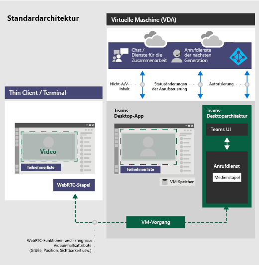

# <a name="teams-for-virtualized-desktop-infrastructure"></a>Microsoft Teams für Virtualized Desktop Infrastructure

In diesem Artikel werden die Anforderungen und Einschränkungen für die Verwendung von Microsoft Teams in einer virtualisierten Umgebung beschrieben.

## <a name="what-is-vdi"></a>Was ist VDI?

Virtual Desktop Infrastructure (VDI) ist eine Virtualisierungstechnologie, die ein Desktopbetriebssystem und Anwendungen auf einem zentralen Server in einem Rechenzentrum hostet. Dies ermöglicht eine vollständig personalisierte Desktopanwendung für Benutzer mit einer vollständig sicheren und kompatiblen zentralen Quelle.

Microsoft Teams in einer virtualisierten Umgebung unterstützt Chats und die Zusammenarbeit. Darüber hinaus werden bei Windows Virtual Desktop, Citrix und VMware-Plattformen auch Anruf- und Besprechungsfunktionen unterstützt.

Teams in einer virtualisierten Umgebung unterstützt mehrere Konfigurationen. Dazu gehören VDI-, dedizierte, freigegebene, beständige und nicht beständige Modi. Die Features befinden sich in einer kontinuierlichen Entwicklung und werden in regelmäßigen Abständen hinzugefügt, und die Funktionalität wird in den kommenden Monaten und Jahren erweitert.

Die Verwendung von Teams in einer virtualisierten Umgebung kann etwas anders als die Verwendung von Teams in einer nicht virtualisierten Umgebung sein. So stehen beispielsweise einige erweiterte Features in einer virtualisierten Umgebung möglicherweise nicht zur Verfügung, und die Videoauflösung kann anders sein.

Um eine optimale Benutzererfahrung sicherzustellen, folgen Sie den Anweisungen in diesem Artikel.

> [!Note]
> Mehr zu Teams-VDI auf verschiedenen Plattformen erfahren Sie unter [Teams-Funktionen nach Plattform](https://support.microsoft.com/office/teams-features-by-platform-debe7ff4-7db4-4138-b7d0-fcc276f392d3).

## <a name="teams-on-vdi-components"></a>Teams mit VDI-Komponenten

Zur Nutzung von Teams in einer virtualisierten Umgebung sind die folgenden Komponenten erforderlich.

- **Virtualisierungsbroker**: Der Ressourcen- und Verbindungs-Manager des Virtualisierungsanbieters, z. B. Azure
- **Virtueller Desktop**: Der Stapel des Virtuellen Computers (VM), mit dem Microsoft Teams ausgeführt wird
- **Thin Client**: Der Endpunkt, mit dem der Benutzer physisch eine Schnittstelle hat
- **Teams Desktop-App**: Die Teams-Desktopclient-App

## <a name="teams-on-vdi-requirements"></a>Teams auf VDI-Anforderungen

### <a name="virtualization-provider-requirements"></a>Anforderungen des Virtualisierungsanbieters

Die Teams-Desktop-App wurde bei führenden Virtualisierungslösungsanbietern überprüft. Bei mehreren Marktanbietern empfehlen wir, dass Sie Sich an Ihren Virtualisierungslösungsanbieter wenden, um sicherzustellen, dass Sie die Mindestanforderungen erfüllen.
  
Derzeit ist Teams mit VDI mit Audio/Video-(AV-)Optimierung mit Windows Virtual Desktop, Citrix und VMware zertifiziert. Überprüfen Sie die Informationen in diesem Abschnitt, um sicherzustellen, dass Sie alle Anforderungen an die ordnungsgemäße Funktionalität erfüllen.

### <a name="platforms-certified-for-teams"></a>Für Teams zertifizierte Plattformen

Die folgenden Plattformen verfügen über Lösungen für die virtuelle Desktopinfrastruktur für Teams.

|Plattform|Lösung|
|----|---|
|| <a href="/azure/virtual-desktop/teams-on-wvd" target="_blank">Windows Virtual Desktop</a> |
|| <a href="https://www.citrix.com/products/citrix-virtual-apps-and-desktops/" target="_blank">Virtuelle Citrix-Apps und -Desktops</a> |
|| <a href="https://www.vmware.com/products/horizon.html" target="_blank">VMware Horizon</a> |

### <a name="windows-virtual-desktop"></a>Windows Virtual Desktop

Windows Virtual Desktop bietet AV-Optimierungen für Teams auf VDI. Weitere Informationen zu den Anforderungen und zur Installation finden Sie unter [Verwenden von Teams auf Windows Virtual Desktop](/azure/virtual-desktop/teams-on-wvd).

### <a name="citrix-virtual-apps-and-desktops-requirements"></a>Anforderungen für Citrix Virtual Apps und Desktops

Citrix Virtual Apps und Desktops (vormals als XenApp und XenDesktop bezeichnet) bieten AV-Optimierungen für Teams auf VDI. Mit Citrix Virtual Apps und Desktops unterstützt Teams auf VDI neben Chat und Zusammenarbeit auch Anruf- und Besprechungsfunktionen.

Sie können die neueste Version von Citrix Virtual Apps und Desktops von der [Downloadwebsite für Citrix](https://www.citrix.com/downloads/citrix-virtual-apps-and-desktops/) herunterladen. (Sie müssen sich zuerst anmelden.) Die erforderlichen Komponenten sind standardmäßig in der [Citrix Workspace-App (CWA)](https://www.citrix.com/downloads/workspace-app/) und dem Virtual Delivery Agent (VDA) gebündelt. Dafür müssen Sie keine zusätzlichen Komponenten oder Plug-Ins auf CWA oder dem VDA installieren.

Die neuesten Server- und Clientanforderungen finden Sie auf [dieser Citrix-Website](https://docs.citrix.com/en-us/citrix-virtual-apps-desktops/multimedia/opt-ms-teams.html).

### <a name="vmware-horizon-workspace-and-desktop-requirements"></a>Anforderungen für VMware Horizon Workspace und Desktop

VMware Horizon ist eine moderne Plattform für die sichere Bereitstellung virtueller Desktops und Apps in der Hybrid-Cloud. Um eine hervorragende Endbenutzererfahrung zu bieten, bietet VMware für Teams eine Medienoptimierung. Diese Optimierung verbessert die Produktivität auf virtuellen Desktops und in virtuellen Apps insgesamt und verbessert die Benutzerfreundlichkeit bei Anrufen und Besprechungen in Teams.

Sie können die aktuelle Version von VMware Horizon über die Seite [VMware-Downloads](https://my.vmware.com/web/vmware/downloads/#all_products) herunterladen. Die erforderlichen Medienoptimierungskomponenten sind standardmäßig Bestandteil des Horizon-Agents und des Horizon-Clients, und es ist nicht erforderlich, ein zusätzliches Plug-In zu installieren, um das Optimierungsfeature für Teams zu verwenden.

Die neuesten Anforderungen und Anweisungen zum Konfigurieren der Medienoptimierung für Teams finden Sie auf [dieser VMware-Website](https://docs.vmware.com/en/VMware-Horizon/2006/horizon-remote-desktop-features/GUID-F68FA7BB-B08F-4EFF-9BB1-1F9FC71F8214.html).

## <a name="install-or-update-the-teams-desktop-app-on-vdi"></a>Installieren oder Aktualisieren der Teams-Desktop-App unter VDI

Sie können die Teams-Desktop-App für VDI mithilfe einer Installation auf Computerbasis oder einer Benutzerinstallation mithilfe des MSI-Pakets bereitstellen. Die Entscheidung darüber, welcher Ansatz verwendet werden soll, hängt davon ab, ob Sie ein beständiges oder nicht beständiges Setup und die zugehörigen Funktionalitätsanforderungen Ihrer Organisation verwenden.

Für ein dediziertes beständiges Setup würde jeder Ansatz funktionieren. Für ein nicht beständiges Setup benötigt Teams jedoch eine Installation auf Computerbasis, um effizient zu funktionieren. Weitere Informationen finden Sie im Abschnitt [Nicht beständiges Setup](#non-persistent-setup).

Bei einer Installation auf Computerbasis sind automatische Updates deaktiviert. Dies bedeutet, dass Sie zum Aktualisieren der Teams-App die aktuelle Version deinstallieren müssen, um auf eine neuere Version aktualisieren zu können. Bei einer Installation auf Benutzerbasis sind automatische Updates aktiviert. Bei den meisten VDI-Bereitstellungen empfehlen wir, Teams mithilfe einer Installation auf Computerbasis bereitzustellen.

Um auf die neueste Version von Teams zu aktualisieren, beginnen Sie mit dem Deinstallationsverfahren, gefolgt von der neuesten Bereitstellung der Teams-Version.

Damit die Teams AV-Optimierung in VDI-Umgebungen ordnungsgemäß funktioniert, muss der Thin Client-Endpunkt Zugriff auf das Internet haben. Wenn am Thin Client-Endpunkt kein Internetzugang verfügbar ist, wird der Start der Optimierung nicht erfolgreich sein. Dies bedeutet, dass sich der Benutzer in einem nicht optimierten Medienstatus befindet.

#### <a name="dedicated-persistent-setup"></a>Dediziertes beständiges Setup

Bei einem dedizierten beständigen Setup werden die Änderungen des lokalen Betriebssystems der Benutzer beibehalten, nachdem sich die Benutzer abgemeldet haben. Für ein beständiges Setup unterstützt Teams die Installation auf Benutzer- und Computerbasis.

Im Folgenden finden Sie die empfohlene Mindestkonfiguration für VM.

|Parameter  |Betriebssystem der Arbeitsstation  |Serverbetriebssystem  |
|---------|---------|---------|
|vCPU   |    2 Kerne     |  4, 6 oder 8<br>Es ist wichtig, die zugrunde liegende Konfiguration mit nicht einheitlichem Arbeitsspeicherzugriff (NUMA) zu verstehen und die VMs entsprechend zu konfigurieren.     |
|RAM     |   4 GB      | 512 GB bis 1024 MB pro Benutzer        |
|Speicher    | 8 GB        | 40 bis 60 GB        |

#### <a name="non-persistent-setup"></a>Nicht beständiges Setup

Bei einem nicht-beständigen Setup werden die Änderungen des lokalen Betriebssystems der Benutzer nicht beibehalten, nachdem sich die Benutzer abgemeldet haben. Bei solchen Setups handelt es sich in der Regel um gemeinsam genutzte Mehrbenutzersitzungen. Die VM-Konfiguration ist je nach Anzahl der Benutzer und verfügbaren physischen Box-Ressourcen unterschiedlich.

Für ein nicht beständiges Setup muss die Teams-Desktop-App auf Computerbasis auf dem Golden Image installiert sein. (Weitere Informationen finden Sie im Abschnitt [Installieren oder Aktualisieren der Teams-Desktop-App auf VDI](#install-or-update-the-teams-desktop-app-on-vdi)) Dadurch wird eine effiziente Einführung der Teams-App während einer Benutzersitzung sichergestellt.

Die Verwendung von Teams in einem nicht beständigen Setup setzt auch einen Manager für das Zwischenspeichern von Profilen voraus, um effiziente Teams-Laufzeitdatensynchronisierung zu unterstützen. Effiziente Datensynchronisierung stellt sicher, dass die entsprechenden benutzerspezifischen Informationen (z. B. die Daten, das Profil oder die Einstellungen eines Benutzers) während der Sitzung des Benutzers zwischengespeichert werden. Stellen Sie sicher, dass die Daten in diesen beiden Ordnern synchronisiert werden:<br>
- C:\Users\username\AppData\Local\Microsoft\IdentityCache (%localAppdata%\Microsoft\IdentityCache)
- C:\Users\username\AppData\Roaming\Microsoft\Teams (%appdata%\Microsoft\Teams)

> [!NOTE]
> Es ist ein Roamingordner (oder, wenn Sie die Ordnerumleitung verwenden, ein Zwischenspeicherungs-Manager) erforderlich, um sicherzustellen, dass die Teams-App über die Laufzeitdaten und Dateien verfügt, die zum Ausführen der Anwendung erforderlich sind. Dies ist erforderlich, um Probleme mit der Netzwerklatenz oder Netzwerkverbindung zu vermeiden, die andernfalls zu Anwendungsfehlern und einer langsamen Erfahrung aufgrund nicht verfügbarer Daten und Dateien führen würden.

Es stehen eine Vielzahl von Lösungen für Caching-Manager zur Verfügung. Zum Beispiel [FSLogix](/fslogix/overview). Spezifische Konfigurationsanweisungen finden Sie bei Ihrem Anbieter für Zwischenspeicherung.

##### <a name="teams-cached-content-exclusion-list-for-non-persistent-setup"></a>Ausschlussliste für zwischengespeicherte Inhalte von Teams für nicht beständiges Setup

Schließen Sie Folgendes aus dem Zwischenspeicherungsordner "Teams", "%appdata%/Microsoft/Teams", aus. Mit dem Ausschließen dieser Elemente kann die Größe des Zwischenspeicherns von Benutzer verringert werden, um das nicht beständige Setup weiter zu optimieren.

- TXT-Dateien
- Ordner "Medienstapel"
- meeting-addin\Cache (%appdata%\Microsoft\Teams\meeting-addin\Cache)

### <a name="microsoft-365-apps-for-enterprise-considerations"></a>Überlegungen zu Microsoft 365 Apps for Enterprise

Berücksichtigen Sie Folgendes, wenn Sie Teams mit Microsoft 365 Apps for Enterprise auf VDI bereitstellen.

#### <a name="new-deployments-of-teams-through-microsoft-365-apps-for-enterprise"></a>Neue Bereitstellungen von Teams über Microsoft 365 Apps for Enterprise

Bevor Sie Teams über Microsoft 365 Apps for Enterprise bereitstellen, müssen Sie zuerst alle bereits vorhandenen Teams-Apps deinstallieren, sofern sie mit einer Computerinstallation bereitgestellt wurden.

Teams über Microsoft 365 Apps for Enterprise wird auf Benutzerbasis installiert. Weitere Informationen finden Sie im Abschnitt [Installieren oder Aktualisieren der Teams-Desktop-App auf VDI](#install-or-update-the-teams-desktop-app-on-vdi).

#### <a name="teams-deployments-through-microsoft-365-apps-for-enterprise-updates"></a>Bereitstellungen von Teams über Microsoft 365 Apps for Enterprise-Updates

Außerdem wird Microsoft Teams zu vorhandenen Installationen von Microsoft 365-Apps for Enterprise. Da Microsoft 365 Apps for Enterprise Teams nur auf Benutzerbasis installiert, lesen Sie den Abschnitt [Installieren oder Aktualisieren der Teams-Desktop-App auf VDI](#install-or-update-the-teams-desktop-app-on-vdi).

#### <a name="using-teams-with-per-machine-installation-and-microsoft-365-apps-for-enterprise"></a>Verwenden von Teams mit einer Installation auf Computerbasis und Microsoft 365 Apps for Enterprise

Microsoft 365 Apps for Enterprise unterstützen keine computerbasierten Installationen von Teams. Wenn Sie eine Installation auf Computerbasis verwenden möchten, müssen Sie Teams aus Microsoft 365 Apps for Enterprise ausschließen. Lesen Sie die Abschnitte [Bereitstellen der Teams-Desktop-App auf den VM](#deploy-the-teams-desktop-app-to-the-vm) und [Ausschließen der Teams-Bereitstellung über Microsoft 365 Apps for Enterprise](#how-to-exclude-teams-deployment-through-microsoft-365-apps-for-enterprise) Abschnitten.

#### <a name="how-to-exclude-teams-deployment-through-microsoft-365-apps-for-enterprise"></a>So schließen Sie die Bereitstellungen von Teams über Microsoft 365 Apps for Enterprise aus

Weitere Informationen zu Teams und Microsoft 365 Apps for Enterprise finden Sie unter [Ausschließen von Teams von neuen Installationen von Microsoft 365 Apps for Enterprise](/DeployOffice/teams-install#how-to-exclude-microsoft-teams-from-new-installations-of-office-365-proplus) und [Verwenden von Gruppenrichtlinien zum Steuern der Installation von Teams](/DeployOffice/teams-install#use-group-policy-to-control-the-installation-of-microsoft-teams).

### <a name="deploy-the-teams-desktop-app-to-the-vm"></a>Bereitstellen der Teams-Desktop-App im VM

1. Laden Sie über einen der folgenden Links das Teams MSI-Paket herunter, das Ihrem VDI VM-Betriebssystem entspricht:

    - [32-Bit-Version](https://teams.microsoft.com/downloads/desktopurl?env=production&plat=windows&managedInstaller=true&download=true)
    - [64-Bit-Version](https://teams.microsoft.com/downloads/desktopurl?env=production&plat=windows&arch=x64&managedInstaller=true&download=true)

    > [!NOTE]
    > Für Clouds in Behörden finden Sie Links zum Herunterladen der MSI-Dateien unter [Installieren von Microsoft Teams mithilfe von Microsoft Endpoint Configuration Manager](msi-deployment.md).

    Die Mindestversion der Teams-Desktop-App, die erforderlich ist, ist Version 1.3.00.4461. (Der PSTN-Speicher wird in früheren Versionen nicht unterstützt.)

2. Installieren Sie die MSI auf dem VDI VM, indem Sie einen der folgenden Befehle ausführen:

    - Installation auf Benutzerbasis (Standard)
  
        ```console
        msiexec /i <path_to_msi> /l*v <install_logfile_name> ALLUSERS=1
        ```

        Dieses Verfahren ist die Standardinstallation, bei der Teams im Benutzerordner "%AppData%" installiert wird. An diesem Punkt ist die Einrichtung des „Golden Image“ abgeschlossen. Teams arbeiten bei einem nicht beständigen Setup nicht ordnungsgemäß mit einer Installation auf Benutzerbasis.

    - Installation auf Computerbasis

        ```console
        msiexec /i <path_to_msi> /l*v <install_logfile_name> ALLUSER=1 ALLUSERS=1
        ```

        Bei diesem Vorgang wird Teams im Ordner "Programmdateien (x86)" unter einem 64-Bit-Betriebssystem und im Ordner "Programmdateien" unter einem 32-Bit-Betriebssystem installiert. An diesem Punkt ist die Einrichtung des „Golden Image“ abgeschlossen. Für nicht beständige Setups ist eine Installation von Teams auf Computerbasis erforderlich.

        Bei der nächsten interaktiven Anmeldesitzung startet Teams und fordert Anmeldeinformationen an.

        > [!NOTE]
        > Diese Beispiele verwenden auch den Parameter **ALLUSERS=1**. Wenn Sie diesen Parameter festlegen, wird das Installationsprogramm für die computerweite Installation von Teams unter "Programme und Features" in der Systemsteuerung sowie unter "Apps und Features" in den Windows-Einstellungen für alle Benutzer des Computers angezeigt. Alle Benutzer können Teams dann deinstallieren, wenn Sie über Administratorrechte auf dem Computer verfügen.
        Es ist wichtig, den Unterschied zwischen **ALLUSERS=1** und **ALLUSER=1** zu verstehen. Der Parameter **ALLUSERS=1** kann in Nicht-VDI- und VDI-Umgebungen verwendet werden, während der Parameter **ALLUSER=1** nur in VDI-Umgebungen verwendet wird, um eine Installation auf Computerbasis anzugeben.

3. Deinstallieren Sie die MSI aus dem VDI VM. Es gibt zwei Möglichkeiten zum Deinstallieren von Teams.

    - PowerShell-Skript: Sie können [dieses PowerShell-Skript](scripts/powershell-script-deployment-cleanup.md) verwenden, um Teams zu deinstallieren und den Ordner "Teams" für einen Benutzer zu entfernen. Führen Sie das Skript für jedes Benutzerprofil aus, in dem Teams auf dem Computer installiert wurde.
    - Befehlszeile: Führen Sie den folgenden Befehl aus.
  
      ```console
      msiexec /passive /x <path_to_msi> /l*v <uninstall_logfile_name>
      ```

      Bei diesem Vorgang wird Teams je nach Betriebssystemumgebung aus dem Ordner "Programmdateien (x86)" oder "Programmdateien" deinstalliert.

## <a name="teams-on-vdi-performance-considerations"></a>Überlegungen zur Leistung von Teams auf VDI

Es gibt eine Vielzahl von virtualisierten Setupkonfigurationen, bei deren Optimierung jeweils ein anderer Fokus liegt. Eine Konfiguration kann sich z. B. auf die Benutzerdichte konzentrieren. Berücksichtigen Sie bei der Planung die folgenden Punkte, um Ihr Setup basierend auf den Workloadanforderungen Ihrer Organisation zu optimieren.

- Mindestanforderung: Für einige Workloads ist möglicherweise ein Setup mit Ressourcen erforderlich, die den Mindestanforderungen entsprechen. Beispielsweise Workloads für Entwickler, die Anwendungen verwenden, die mehr Computerressourcen erfordern.
- Abhängigkeiten: Dazu gehören Abhängigkeiten von Infrastruktur, Workload und anderen Umgebungsaspekten außerhalb der Teams-Desktop-App.
- Deaktivierte Features für VDI: Teams deaktiviert GPU-intensive Funktionen für VDI, was zur Verbesserung der vorübergehenden CPU-Auslastung beitragen kann. Die folgenden Funktionen sind deaktiviert:
    - CSS-Animation für Teams
    - Giphy-Autostart

## <a name="teams-on-vdi-with-calling-and-meetings"></a>Teams auf VDI mit Anrufen und Besprechungen

Zusätzlich zu Chat und Zusammenarbeit ist Teams auf VDI mit Anrufen und Besprechungen mit unterstützten Virtualisierungsanbieter-Plattformen verfügbar. Unterstützte Features basieren auf dem WebRTC-Medienstapel und der Implementierung eines Virtualisierungsanbieters. Das folgende Diagramm bietet einen Überblick über die Architektur.



> [!IMPORTANT]
> Wenn Sie derzeit Teams ohne AV-Optimierung in VDI ausführen und Features verwenden, die noch nicht für die Optimierung unterstützt sind (z. B. das Geben und Übernehmen von Kontrolle beim Freigeben von Apps), müssen Sie Richtlinien für Virtualisierungsanbieter festlegen, um die Teams-Umleitung zu deaktivieren. Dies bedeutet, dass Teams-Mediensitzungen nicht optimiert werden. Schritte zum Festlegen von Richtlinien zum Deaktivieren der Teams-Umleitung erhalten Sie von Ihrem Virtualisierungsanbieter.

### <a name="network-requirements"></a>Netzwerkanforderungen

Es wird empfohlen, Ihre Umgebung zu bewerten, um alle Risiken und Anforderungen zu erkennen, die Ihre Bereitstellung von VoIP und Video in der Cloud insgesamt beeinflussen können. Verwenden Sie das [Skype for Business-Netzwerkbewertungstool](https://www.microsoft.com/download/details.aspx?id=53885), um zu testen, ob Ihr Netzwerk für Microsoft Teams bereit ist.

Weitere Informationen zum Vorbereiten Ihres Netzwerks für Teams finden Sie unter [Vorbereiten des Netzwerks Ihrer Organisation für Teams](prepare-network.md).

### <a name="migrate-from-skype-for-business-on-vdi-to-teams-on-vdi"></a>Migrieren von Skype for Business auf VDI zu Teams auf VDI

Wenn Sie von Skype for Business auf VDI zu Teams auf VDI migrieren, gibt es neben den Unterschieden zwischen den beiden Anwendungen einige Unterschiede, wenn VDI auch implementiert wird. Die folgenden Funktionen werden von Teams VDI derzeit nicht unterstützt, die von Skype for Business VDI unterstützt werden:

- Plattformbasierte Richtlinie zum Deaktivieren einiger AV-Features in VDI
- Geben und Übernehmen der Kontrolle über die App-Freigabe
- Bildschirmfreigabe aus Chat ohne Audio
- Gleichzeitiges Senden und Empfangen von Videos und Bildschirmfreigaben

### <a name="teams-on-chrome-browser-versus-teams-desktop-app-for-vdi"></a>Teams mit Chrome-Browser und Teams-Desktop-App für VDI

Teams im Chrome-Browser stellt keinen Ersatz für die Teams-Desktop-App für VDI mit AV-Optimierung dar. Die Chat- und Zusammenarbeitsfunktion funktioniert wie erwartet. Wenn Medien benötigt werden, gibt es einige Erfahrungen, die im Chrome-Browser möglicherweise die Benutzeranforderungen nicht erfüllen:

- Möglicherweise ist das Audio- und Videostreaming nicht optimal. Bei den Benutzern können Verzögerungen oder verringerte Qualität zu sehen sein.
- Geräteeinstellungen sind in den Browsereinstellungen nicht verfügbar.
- Die Geräteverwaltung erfolgt über den Browser und erfordert mehrere Einstellungen in den Einstellungen der Browserwebsite.
- Geräteeinstellungen müssen möglicherweise auch in der Windows-Geräteverwaltung festgelegt werden.

## <a name="teams-on-vdi-with-chat-and-collaboration"></a>VDI-Teams mit Chat und Zusammenarbeit

Wenn Ihre Organisation nur die Chat- und Zusammenarbeitsfeatures in Teams verwenden möchte, können Sie Richtlinien auf Benutzerebene festlegen, um Anruf- und Besprechungsfunktionen in Teams zu deaktivieren. 

### <a name="set-policies-to-turn-off-calling-and-meeting-functionality"></a>Festlegen von Richtlinien zum Deaktivieren von Anruf- und Besprechungsfunktionen

Sie können Richtlinien mithilfe des Microsoft Teams Admin Centers oder mit PowerShell einrichten. Es kann einige Zeit (ein paar Stunden) dauern, bis die Richtlinienänderungen aktualisiert wurden. Wenn Sie Änderungen für ein bestimmtes Konto nicht sofort sehen, versuchen Sie es nach ein paar Stunden erneut.

[**Anrufrichtlinien**](teams-calling-policy.md): Teams enthält die integrierte Anrufrichtlinie DisallowCalling, in der alle Anruffeatures deaktiviert sind. Weisen Sie die DisallowCalling-Richtlinie allen Benutzern in Ihrer Organisation zu, die Teams in einer virtualisierten Umgebung verwenden.

[**Besprechungsrichtlinien**](meeting-policies-in-teams.md): Teams enthält die integrierte Besprechungsrichtlinie AllOff, in der alle Anruffeatures deaktiviert sind. Weisen Sie die AllOff-Richtlinie allen Benutzern in Ihrer Organisation zu, die Teams in einer virtualisierten Umgebung verwenden.

#### <a name="assign-policies-using-the-microsoft-teams-admin-center"></a>Zuweisen von Richtlinien mithilfe des Microsoft Teams Admin Centers

So weisen Sie einem Benutzer die DisallowCalling-Anrufrichtlinie und die AllOff-Besprechungsrichtlinie zu:

1. Wechseln Sie in der linken Navigation des Microsoft Teams Admin Centers zu **Nutzer**.
2. Wählen Sie den Nutzer aus, indem Sie links neben den Nutzernamen klicken, und klicken Sie dann auf **Einstellungen bearbeiten**.
3. Gehen Sie folgendermaßen vor:
    1.  Klicken Sie unter **Anrufrichtlinie** auf **DisallowCalling**.
    2.  Klicken Sie unter **Besprechungsrichtlinie** auf **AllOff**.
4. Klicken Sie auf **Anwenden**.

So weisen Sie mehreren Benutzern gleichzeitig eine Richtlinie zu

1. Wechseln Sie in der linken Navigation des Microsoft Teams Admin Center zu **Benutzer**, und suchen Sie dann nach den gewünschten Benutzern, oder filtern Sie die Ansicht, um die gewünschten Benutzer anzuzeigen.
2. Wählen Sie in der Spalte **&#x2713;** (Häkchen) die Benutzer aus. Um alle Benutzer auszuwählen, klicken Sie am oberen Rand der Tabelle auf &#x2713; (Häkchen).
3. Klicken Sie auf **Einstellungen bearbeiten**, nehmen Sie die gewünschten Änderungen vor, und klicken Sie dann auf **Übernehmen**.

Sie können auch die folgenden Schritte ausführen:

1. Wechseln Sie in der linken Navigationsleiste des Microsoft Teams Admin Centers zu der Richtlinie, die Sie zuweisen möchten. Beispiel:
    - Gehen Sie zu **Sprache** > **Anrufrichtlinien**, und klicken Sie dann auf **DisallowCalling**.
    - Gehen Sie zu **Besprechungen** > **Besprechungsrichtlinien**, und klicken Sie dann auf **AllOff**.
2. Wählen Sie **Nutzer verwalten** aus.
3. Suchen Sie im Bereich **Nutzer verwalten** anhand des Anzeigenamens oder des Nutzernamens nach dem Nutzer, wählen Sie den Namen und dann **Hinzufügen** aus. Wiederholen Sie diesen Schritt für jeden Nutzer, den Sie hinzufügen möchten.
4. Wenn Sie alle gewünschten Benutzer hinzugefügt haben, klicken Sie auf **Speichern**.

#### <a name="assign-policies-using-powershell"></a>Zuweisen von Richtlinien mit PowerShell

Im folgenden Beispiel wird gezeigt, wie Sie die [Grant-CsTeamsCallingPolicy](/powershell/module/skype/grant-csteamscallingpolicy) verwenden, um einem Benutzer die Anrufrichtlinie DisallowCalling zuzuweisen.

```PowerShell
Grant-CsTeamsCallingPolicy -PolicyName DisallowCalling -Identity "user email id"
```

Weitere Informationen zum Verwenden von PowerShell zum Verwalten von Anrufrichtlinien finden Sie unter [Set-CsTeamsCallingPolicy](/powershell/module/skype/set-csteamscallingpolicy).

Im folgenden Beispiel wird gezeigt, wie Sie die [Grant-CsTeamsMeetingPolicy](/powershell/module/skype/grant-csteamsmeetingpolicy) verwenden, um einem Benutzer die Besprechungsrichtlinie AllOff zuzuweisen.

```PowerShell
Grant-CsTeamsMeetingPolicy -PolicyName AllOff -Identity "user email id"
```

Weitere Informationen zum Verwenden von PowerShell zum Verwalten von Besprechungsrichtlinien finden Sie unter [Set-CsTeamsMeetingPolicy](/powershell/module/skype/set-csteamsmeetingpolicy).

## <a name="migrate-teams-on-vdi-with-chat-and-collaboration-to-optimize-teams-with-calling-and-meetings"></a>Migrieren Sie Teams auf VDI mit Chat und Zusammenarbeit, um Teams mit Anrufen und Besprechungen zu optimieren.

Wenn Sie über eine Implementierung von Teams auf VDI mit Chat und Zusammenarbeit verfügen, in der Sie Richtlinien auf Benutzerebene zum Deaktivieren von Anruf- und Besprechungsfunktionen festgelegt haben, und Sie mit der AV-Optimierung zu Teams migrieren, müssen Sie Richtlinien festlegen, um Anruf- und Besprechungsfunktionen für diese Benutzer für Teams auf VDI zu aktivieren.

### <a name="set-policies-to-turn-on-calling-and-meeting-functionality"></a>Festlegen von Richtlinien zum Aktivieren von Anruf- und Besprechungsfunktionen

Sie können das Microsoft Teams Admin Center oder PowerShell verwenden, um Anruf- und Besprechungsrichtlinien für Ihre Benutzer festzulegen und zuzuweisen. Es kann einige Zeit (ein paar Stunden) dauern, bis Richtlinienänderungen verteilt werden. Wenn Sie Änderungen für ein bestimmtes Konto nicht sofort sehen, versuchen Sie es nach ein paar Stunden erneut.

[**Anrufrichtlinien**](teams-calling-policy.md): Anrufrichtlinien in Teams steuern, welche Anruffunktionen den Benutzern zur Verfügung stehen. Teams enthält die integrierte Anrufrichtlinie AllowCalling, in der alle Anruffeatures aktiviert sind. Um alle Anruffeatures zu aktivieren, weisen Sie die AllowCalling-Richtlinie zu. Oder erstellen Sie eine benutzerdefinierte Anrufrichtlinie, um die von Ihnen gewünschen Anruffeatures zu aktivieren und sie Benutzern zuzuweisen. 

[**Besprechungsrichtlinien**](meeting-policies-in-teams.md): Besprechungsrichtlinien in Teams steuern die Arten von Besprechungen, die Benutzer erstellen können, und die Funktionen, die für Besprechungsteilnehmer verfügbar sind, die von Benutzern in Ihrer Organisation geplant werden. Teams enthält die integrierte Besprechungsrichtlinie AllOn, in der alle Anruffeatures aktiviert sind. Um alle Besprechungsfeatures zu aktivieren, weisen Sie die AllOn-Richtlinie zu. Oder erstellen Sie eine benutzerdefinierte Besprechungsrichtlinie, um die von Ihnen gewünschen Besprechungsfeatures zu aktivieren, die Sie Benutzern zuweisen möchten.

#### <a name="assign-policies-using-the-microsoft-teams-admin-center"></a>Zuweisen von Richtlinien mithilfe des Microsoft Teams Admin Centers

So weisen Sie einem Benutzer die AllowCalling-Anrufrichtlinie und die AllOn-Besprechungsrichtlinie zu:

1. Wechseln Sie in der linken Navigation des Microsoft Teams Admin Centers zu **Nutzer**.
2. Wählen Sie den Nutzer aus, indem Sie links neben den Nutzernamen klicken, und klicken Sie dann auf **Einstellungen bearbeiten**.
3. Gehen Sie folgendermaßen vor:
    1.  Klicken Sie unter **Anrufrichtlinie** auf **AllowCalling**.
    2.  Klicken Sie unter **Besprechungsrichtlinie** auf **AllOn**.
4. Klicken Sie auf **Anwenden**.

So weisen Sie mehreren Benutzern gleichzeitig eine Richtlinie zu

1. Wechseln Sie in der linken Navigation des Microsoft Teams Admin Center zu **Benutzer**, und suchen Sie dann nach den gewünschten Benutzern, oder filtern Sie die Ansicht, um die gewünschten Benutzer anzuzeigen.
2. Wählen Sie in der Spalte **&#x2713;** (Häkchen) die Benutzer aus. Um alle Benutzer auszuwählen, klicken Sie am oberen Rand der Tabelle auf **&#x2713;** (Häkchen).
3. Klicken Sie auf **Einstellungen bearbeiten**, nehmen Sie die gewünschten Änderungen vor, und klicken Sie dann auf **Übernehmen**.

Sie können auch die folgenden Schritte ausführen:

1. Wechseln Sie in der linken Navigationsleiste des Microsoft Teams Admin Centers zu der Richtlinie, die Sie zuweisen möchten. Beispiel:
    - Gehen Sie zu **Sprache** > **Anrufrichtlinien**, und klicken Sie dann auf **AllowCalling**.
    - Gehen Sie zu **Besprechungen** > **Besprechungsrichtlinien**, und klicken Sie dann auf **AllOn**.
2. Wählen Sie **Nutzer verwalten** aus.
3. Suchen Sie im Bereich **Nutzer verwalten** anhand des Anzeigenamens oder des Nutzernamens nach dem Nutzer, wählen Sie den Namen und dann **Hinzufügen** aus. Wiederholen Sie diesen Schritt für jeden Nutzer, den Sie hinzufügen möchten.
4. Wenn Sie alle gewünschten Benutzer hinzugefügt haben, klicken Sie auf **Speichern**.

#### <a name="assign-policies-using-powershell"></a>Zuweisen von Richtlinien mit PowerShell

Im folgenden Beispiel wird gezeigt, wie Sie die [Grant-CsTeamsCallingPolicy](/powershell/module/skype/grant-csteamscallingpolicy) verwenden, um einem Benutzer die Anrufrichtlinie AllowCalling zuzuweisen.

```PowerShell
Grant-CsTeamsCallingPolicy -PolicyName AllowCalling -Identity "user email id"
```

Weitere Informationen zum Verwenden von PowerShell zum Verwalten von Anrufrichtlinien finden Sie unter [Set-CsTeamsCallingPolicy](/powershell/module/skype/set-csteamscallingpolicy).

Im folgenden Beispiel wird gezeigt, wie Sie die [Grant-CsTeamsMeetingPolicy](/powershell/module/skype/grant-csteamsmeetingpolicy) verwenden, um einem Benutzer die Besprechungsrichtlinie AllOn zuzuweisen.

```PowerShell
Grant-CsTeamsMeetingPolicy -PolicyName AllOn -Identity "user email id"
```

Weitere Informationen zum Verwenden von PowerShell zum Verwalten von Besprechungsrichtlinien finden Sie unter [Set-CsTeamsMeetingPolicy](/powershell/module/skype/set-csteamsmeetingpolicy).

## <a name="control-fallback-mode-in-teams"></a>Steuern des Fallbackmodus in Teams

Wenn Benutzer eine Verbindung von einem nicht unterstützten Endpunkt herstellen, befinden sich die Benutzer im Fallbackmodus, in dem AV nicht optimiert ist. Sie können den Fallbackmodus deaktivieren oder aktivieren, indem Sie einen der folgenden DWORD-Registrierungswerte festlegen:

- HKEY_LOCAL_MACHINE\SOFTWARE\Microsoft\Teams\DisableFallback
- HKEY_CURRENT_USER\SOFTWARE\Microsoft\Office\Teams\DisableFallback

Um den Fallbackmodus zu deaktivieren, setzen Sie den Wert auf **1**. Um nur Audio zu aktivieren, setzen Sie den Wert auf **2**. Wenn der Wert nicht vorhanden oder auf **0** (null) festgelegt ist, ist der Fallbackmodus aktiviert.

Dieses Feature ist in der Teams-Version 1.3.00.13565 und neueren Versionen verfügbar.

## <a name="known-issues-and-limitations"></a>Bekannte Probleme und Einschränkungen

### <a name="client-deployment-installation-and-setup"></a>Clientbereitstellung, -installation und -setup

- Bei einer computerbasierten Installation wird Teams auf VDI nicht automatisch aktualisiert, wie es bei Nicht-VDI-Teams-Clients der Fall ist. Sie müssen das VM-Image aktualisieren, indem Sie eine neue MSI installieren, wie im Abschnitt [Installieren oder Aktualisieren der Teams-Desktop-App auf VDI](#install-or-update-the-teams-desktop-app-on-vdi) beschrieben. Sie müssen zum Aktualisieren der Teams-App die aktuelle Version deinstallieren, um auf eine neuere Version aktualisieren zu können.
- Teams sollten entweder auf Benutzer- oder Computerbasis bereitgestellt werden. Die Bereitstellung von Teams für parallele Bereitstellung auf Benutzer- und Computerbasis wird nicht unterstützt. Um entweder von der Computerbasis oder Benutzerbasis auf einen dieser Modi zu migrieren, führen Sie das Deinstallationsverfahren aus, und stellen Sie einen der beiden Modi erneut bereit.
- Windows Virtual Desktop und VMware unterstützen derzeit keine MacOS- und Linux-basierten Clients.
- Citrix unterstützt derzeit keine MacOs-Clients.
- Citrix unterstützt nicht die Verwendung expliziter HTTP-Proxys, die auf einem Endpunkt definiert sind.

### <a name="calling-and-meetings"></a>Anrufe und Besprechungen

Die folgenden Anruf- und Besprechungsfeatures werden nicht unterstützt:

- Alle Funktionen in mehreren Fenstern, wie die neuen Besprechungsfunktionen oder alle Funktionen im Zusammenhang mit der neuen Besprechungserfahrung
- Erweiterte Notfalldienste
- HID-Schaltflächen und LED-Steuerelemente zwischen der Teams-App und den Geräten
- Verschwimmen des Hintergrunds und Hintergrundeffekte
- Übertragungs- und Liveveranstaltungs-Produzent- und Referentenrollen
- Standortbasiertes Routing (LBR)
- Anruf parken
- Anrufwarteschleife
- Audio-/Computersound des freigegebenen Systems
- Medienumgehung für direkte Weiterleitung

> [!NOTE]
> Wir arbeiten an der Erweiterung von Anruf- und Besprechungsfeatures, die derzeit nur in Nicht-VDI-Umgebungen zur Verfügung stehen. Dazu gehören möglicherweise mehr Administratorkontrolle über die Qualität, zusätzliche Bildschirmfreigabeszenarien und erweiterte Features, die Teams kürzlich hinzugefügt wurden. Wenden Sie sich an Ihren Teams-Verantwortlichen, um mehr über anstehende Funktionen zu erfahren.

Im Folgenden werden bekannte Probleme und Einschränkungen bei Anrufen und Besprechungen aufgezeigt:

- Die Kompatibilität mit Skype for Business ist auf Audioanrufe beschränkt; es gibt keine Videomodenalität.
- In Besprechungen oder Gruppenanrufen wird nur ein einzelner eingehender Videostream unterstützt. Wenn mehrere Personen Video senden, wird nur jeweils das Video des Sprechers angezeigt.
- Die Auflösung für eingehende und ausgehende Videos ist auf eine Auflösung von 720p beschränkt. Dies ist eine WebRTC-Einschränkung.
- Es wird nur ein Videostream von einer eingehenden Kamera oder einem Bildschirmfreigabestream unterstützt. Wenn es eine Bildschirmfreigabe für eingehende Nachrichten gibt, wird diese Bildschirmfreigabe anstelle des Videos des Sprechers angezeigt.
- Teams wechselt nicht zur Verwendung des letzten Audiogeräts, das ein Benutzer ausgewählt hat, wenn die Verbindung des Geräts getrennt ist und dann erneut verbunden ist.
- Ausgehende Bildschirmfreigabe:
    - Die Anwendungsfreigabe wird nicht unterstützt.
- Kontrolle geben und übernehmen:
    - Während einer Bildschirmfreigabe oder Anwendungsfreigabesitzung nicht unterstützt.
    - Während einer PowerPoint-Freigabesitzung unterstützt.
- Einschränkungen nur für Citrix
    - Bei der Bildschirmfreigabe bei einem Setup mit mehreren Monitoren wird nur der Hauptmonitor freigegeben.
    - Die Skalierung mit hohen DPI-Kosten für CWA wird nicht unterstützt.

Bekannte Probleme, die nicht mit VDI in Zusammenhang stehen, finden Sie unter [Supportteams in Ihrer Organisation](/MicrosoftTeams/troubleshoot/teams-welcome).

## <a name="troubleshooting"></a>Problembehandlung

### <a name="troubleshoot-citrix-components"></a>Problembehandlung bei Citrix-Komponenten

#### <a name="teams-crashes-or-the-teams-sign-in-screen-is-blank"></a>Teams stürzt ab oder der Anmeldebildschirm von Teams ist leer

Dies ist ein bekanntes Problem mit Citrix VDA, Versionen 1906 und 1909. Um dieses Problem zu beheben, fügen Sie den folgenden DWORD-Wert der Registrierung hinzu, und legen Sie ihn auf 204 (hexadezimal) fest.

HKEY_LOCAL_MACHINE\SOFTWARE\Citrix\CtxHook\AppInit_Dlls\SfrHook\Teams.exe

Starten Sie dann VDA neu. Weitere Informationen finden Sie im Citrix-Supportartikel [Problembehandlung bei der HDX-Optimierung für Teams](https://support.citrix.com/article/CTX253754).

## <a name="related-topics"></a>Verwandte Themen

- [Installieren von Microsoft Teams mithilfe eines MSI-Pakets](msi-deployment.md)
- [Übersicht über PowerShell für Microsoft Teams](teams-powershell-overview.md)
- [Verwenden von Microsoft Teams auf Windows Virtual Desktop](/azure/virtual-desktop/teams-on-wvd)