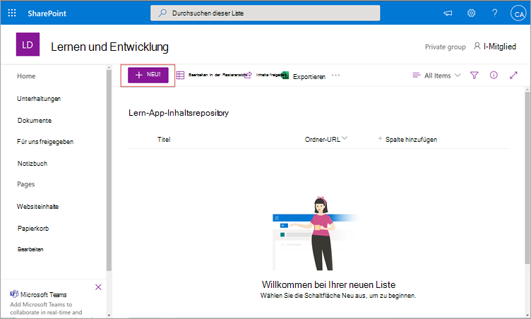
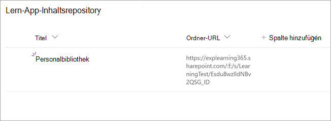
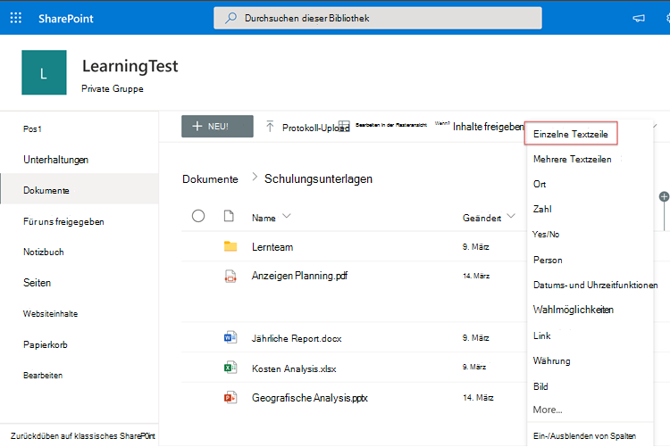

# Installieren, Verwalten und Zuweisen von Berechtigungen für Microsoft Viva Learning (private Vorschau)

*Dieser Artikel enthält vorläufige Inhalte für Microsoft Viva Learning, das sich in der privaten Vorschau befindet.*

Microsoft Viva Learning (private Vorschau) ermöglicht Es Teams und Einzelpersonen in Ihrer Organisation, das Lernen zu einem natürlichen Bestandteil ihres Tages zu machen. Die App erstellt einen zentralen Hub in Teams, in dem Mitarbeiter Inhaltsbibliotheken in Ihrer Organisation freigeben, zuweisen und lernen können.

Administratoren legen Berechtigungen und Lerninhaltsquellen für Viva Learning (private Vorschau) zu. Lerninhalte können LinkedIn Learning, Microsoft Learn, Microsoft 365-Schulungen, in SharePoint online gespeicherte eigene Inhalte Ihrer Organisation und Drittanbieter umfassen, die von Viva Learning unterstützt werden (private Vorschau).

## Administratorrollen

Zum Einrichten von Viva Learning (private Vorschau) benötigen Sie Berechtigungen wie folgt:

- Microsoft Teams-Administrator
- Globaler Microsoft 365-Administrator oder SharePoint-Administrator
- Knowledge Admin – Dies ist eine neue Rolle im Microsoft 365 Admin Center, die jedem Benutzer in der Organisation zugewiesen werden kann. Diese Rolle verwaltet die Lerninhaltsquellen der Organisation über das Microsoft 365 Admin Center. 

> [!TIP]
> Der Wissensadministrator sollte moderat technisch sein und über vorhandene SharePoint-Administratoranmeldeinformationen verfügen, vorzugsweise eine Person, die sich mit dem Bildungs-, Lern-, Schulungs- oder Mitarbeitererfahrungsteil der Organisation auskennt.
 
## Verwalten von Viva Learning (private Vorschau) im Teams Admin Center

Der Teams-Administrator installiert Viva Learning (private Vorschau) aus dem App Store und wendet dann Setup-, Verwaltungs- und Berechtigungsrichtlinien über das Teams Admin Center an.

### Verwalten von Einstellungen für Viva Learning (private Vorschau)

Sie müssen ein Administrator im Teams Admin Center sein, um diese Aufgaben ausführen zu können.

Führen Sie die folgenden Schritte aus, um Einstellungen für Viva Learning zu verwalten:

1. Wechseln Sie in der linken Navigationsleiste des Teams Admin Centers zu **Teams-Apps**  >  **Apps verwalten.**

   

2. Geben Sie **auf der** Seite Apps  verwalten im Suchfeld Die Suche nach der Teams Learning-App (private Vorschau) ein.

   

3. Auf der **Seite Lernen:**
   1. Wählen **Sie unter Status** die Option **Zum** Aktivieren der App zulässig aus.
   2. Wechseln Sie **auf der** Registerkarte Einstellungen im Abschnitt **App-Einstellungen** zum Microsoft 365 Admin Center, um Lerninhaltsquellen zu konfigurieren.

   

4. Wechseln **Sie nach** Verwalten von **App-Einstellungen** zu Berechtigungen und Einrichtungsrichtlinien, um Mitarbeitern, die im Rahmen der Teilnahme Ihrer Organisation an der privaten Vorschau Zugriff auf die App haben sollen, die Berechtigung zu erteilen.

> [!NOTE]
>  Wenn Sich Ihre Organisation im Rahmen des Teams TAP100-Programms in Ring 4.0 befindet, müssen Sie möglicherweise die folgenden Schritte unternehmen, um genehmigten Benutzern in Ring 3.0 den Zugriff auf Viva Learning (private Vorschau) zu ermöglichen.

Im Rahmen der privaten Vorschau wird Viva Learning (private Vorschau) in Ring 3.0 veröffentlicht. Wenn Sich Ihre Organisation in Ring 4.0 befindet, wird die App im App Store nicht angezeigt. Zum Testen der App müssen Sie eine Berechtigungsrichtlinie für benutzerdefinierte Apps erstellen, sie auf Alle Apps zulassen festlegen und sie genehmigten Benutzern von Ring 3.0 zuweisen.

   

## Konfigurieren von Lerninhaltsquellen im Microsoft 365 Admin Center

Die Administratoren für das Microsoft 365 Admin Center können Einstellungen im Zusammenhang mit Viva Learning verwalten (private Vorschau) und die Lerninhaltsquellen konfigurieren.

Der Administrator wählt aus, welche zusätzlichen Lerninhaltsquellen (z. B. SharePoint oder unterstützte Inhaltsanbieterquellen von Drittanbietern) benutzern von Viva Learning zur Verfügung stehen (private Vorschau). Der Administrator konfiguriert dann diese Quellen, um sicherzustellen, dass der Inhalt für die Suche und Ermittlung verfügbar ist und von den Mitarbeitern durchsucht werden kann, die Viva Learning verwenden (private Vorschau).

> [!NOTE]
>  Benutzer melden sich bei Nicht-Microsoft- und LinkedIn Learning Pro-Lernergebnissen in einem Browser oder eingebettetem Viewer an. Dieses konfigurierte Lernen unterliegt den separaten Lizenz-, Datenschutz- und Dienstbedingungen zwischen Ihrer Organisation und dem Drittanbieter und nicht den Bedingungen für Viva Learning (private Vorschau). Bevor Sie diese Art von Lernen auswählen, vergewissern Sie sich, dass eine Vereinbarung für Ihre Organisation und Ihre Benutzer vor ort ist.

### Zuweisen der Rolle des Wissensadministrators [Optional]

Sie müssen ein globaler Microsoft 365-Administrator sein, um diese Aufgaben ausführen zu können.

Führen Sie die folgenden Schritte aus, um einen Wissensadministrator für Viva Learning zuzuordnen:

1.  Wechseln Sie in der linken Navigationsleiste des Microsoft 365 Admin Centers zu **Rollen.**

2.  Wählen Sie **auf der** Seite Rollen auf der Registerkarte **Azure AD** die Option Knowledge **Admin aus.**
 
3.  Wählen Sie **auf der** Seite Knowledge Admin im Abschnitt **Zugewiesene Administratoren** die Option **Hinzufügen** aus, und fügen Sie dann die Person hinzu, die Sie für die Rolle auswählen.

### Konfigurieren von Einstellungen für die Lerninhaltsquellen für Viva Learning (private Vorschau)

Sie müssen ein globaler Microsoft 365-Administrator oder Wissensadministrator sein, um diese Aufgaben ausführen zu können.

Führen Sie die folgenden Schritte aus, um Einstellungen für Lerninhaltsquellen in Viva Learning zu konfigurieren:

1.  Wechseln Sie im linken Navigationsbereich des Microsoft 365 Admin Centers zu **Einstellungen**  >  **für Organisationseinstellungen.**

2.  Wählen Sie auf der Seite **Organisationseinstellungen** auf der Registerkarte **Dienste** die Option **Lern-App (Vorschau) aus.**

     

3.  Wählen Sie **im Bereich Lern-App (Vorschau)** die Lerninhaltsquellen aus, die Sie für die Organisation konfigurieren möchten, und wählen Sie dann **Speichern aus.**

     

Unter allen vorhandenen Lernquellen sind einige standardmäßig aktiviert. Hierzu zählen folgende Punkte:

- LinkedIn Learning (kostenloser Inhalt)
- Microsoft Learn
- Microsoft 365-Schulung

> [!NOTE]
> Wenn Ihre Organisation über ein LinkedIn Learning Standard- oder Pro-Abonnement verfügt, wird das Inhaltsrepository für die Mitarbeiter in Ihrer Organisation entsperrt. Nur die Mitarbeiter, die über die Berechtigung verfügen, können das gesamte Inhaltsrepository verwenden.  Andere Quellen müssen möglicherweise manuell aktiviert oder konfiguriert werden. Lernquellen, die nicht von Microsoft stammen, werden zwischen Ihrer Organisation und dem Drittanbieter separat lizenziert. Sie müssen überprüfen, ob Sie sich für ihr Lernen für Sie und Ihre Benutzer angemeldet haben.

Um eine Lerninhaltsquelle zu aktivieren oder zu deaktivieren, aktivieren Sie das Kontrollkästchen neben der Quelle. Wenn eine Quelle aktiviert ist, wird ein Häkchen angezeigt.

## Konfigurieren von SharePoint als Lerninhaltsquelle

Sie können SharePoint als Lerninhaltsquelle konfigurieren, um die eigenen Inhalte Ihrer Organisation in Viva Learning (private Vorschau) verfügbar zu machen.

### Übersicht

Der Wissensadministrator (oder globaler Administrator) stellt eine Website-URL zur Verfügung, zu der der Lerndienst einen leeren zentralen Speicherort – das Inhaltsrepository für Lern-Apps – in Form einer strukturierten SharePoint-Liste erstellen kann. Diese Liste kann von Ihrer Organisation verwendet werden, um Links zu unternehmensübergreifenden SharePoint-Ordnern mit Lerninhalten zu erstellen. Administratoren sind für das Sammeln und Kurieren einer Liste von URLs für Ordner verantwortlich. Diese Ordner sollten nur Inhalte enthalten, die in Viva Learning (private Vorschau) verfügbar gemacht werden können.

Viva Learning (private Vorschau) unterstützt die folgenden Dokumenttypen:

- Word, PowerPoint, Excel, PDF
- Audio (M4A)
- Video (MOV, MP4, AVI)

Weitere Informationen finden Sie in der [SharePoint Online-Dokumentation.](https://docs.microsoft.com/sharepoint/introductionlink) 

### Berechtigungen

UrLs für Dokumentbibliotheksordner können von jeder beliebigen SharePoint-Website in der Organisation gesammelt werden. Viva Learning (private Vorschau) folgt allen vorhandenen Inhaltsberechtigungen. Daher sind nur Inhalte, für die ein Benutzer über die Berechtigung zum Zugriff verfügt, in Viva Learning (private Vorschau) durchsuchbar und sichtbar. Alle Inhalte in diesen Ordnern sind durchsuchbar, aber nur Inhalte, für die der einzelne Mitarbeiter Berechtigungen besitzt, können verwendet werden.

Das Löschen von Inhalten aus dem Repository Ihrer Organisation wird derzeit nicht unterstützt.

Führen Sie die folgenden Schritte aus, um unbeabsichtigt angezeigte Inhalte zu entfernen:

1.  Um den Zugriff auf die Dokumentbibliothek einzuschränken, wählen Sie **die** Option Aktionen anzeigen und dann Zugriff **verwalten aus.**
     
     

2.  Löschen Sie das ursprüngliche Dokument in der Dokumentbibliothek.

Weitere Informationen finden Sie unter [Freigeben und Berechtigungen in der modernen SharePoint-Benutzererfahrung.](https://docs.microsoft.com/sharepoint/modern-experience-sharing-permissions) 

### Lerndienst

Der Lerndienst verwendet die bereitgestellten Ordner-URLs, um Metadaten aus allen Inhalten zu erhalten, die in diesen Ordnern gespeichert sind. Innerhalb von 24 Stunden nach der Bereitstellung der Ordner-URL im zentralen Repository können Mitarbeiter innerhalb von Viva Learning (private Vorschau) nach den Inhalten Ihrer Organisation suchen und diese verwenden. Alle Änderungen an Inhalten, einschließlich aktualisierter Metadaten und Berechtigungen, werden auch innerhalb von 24 Stunden im Lerndienst angewendet.

### Konfigurieren von SharePoint als Quelle

Sie müssen globaler Microsoft 365-Administrator, SharePoint-Administrator oder Wissensadministrator sein, um diese Aufgaben ausführen zu können.

Führen Sie die folgenden Schritte aus, um SharePoint als Lerninhaltsquellen in für Viva Learning (private Vorschau) zu konfigurieren:

1.  Wechseln Sie im linken Navigationsbereich des Microsoft 365 Admin Centers zu **Einstellungen**  >  **für Organisationseinstellungen.**
 
2.  Wählen Sie auf der Seite **Organisationseinstellungen** auf der Registerkarte **Dienste** die Option **Lern-App (Vorschau) aus.**

     

3.  Geben Sie im Bereich Lern-App **(Vorschau)** unter **SharePoint** die Website-URL der SharePoint-Website an, auf der Sie ein zentrales Repository von Viva Learning erstellen möchten.

     

4.  Eine SharePoint-Liste wird automatisch auf der bereitgestellten SharePoint-Website erstellt.

     

     Wählen Sie in der linken Navigationsleiste der SharePoint-Website die Option **Websiteinhalte**  >  **Lern-App-Inhaltsrepository aus.** 

      

5. Füllen Sie **auf der Seite Lern-App-Inhaltsrepository** die SharePoint-Liste mit URLs in die Lerninhaltsordner auf.

   1. Wählen **Sie Neu aus,** um den **Bereich Neues Element zu** sehen. 

       
 
   2. Fügen Sie **im Bereich** Neues Element im Feld **Titel** einen Verzeichnisnamen Ihrer Wahl hinzu. Fügen Sie **im Feld Ordner-URL** die URL zum Lerninhaltsordner hinzu. Klicken Sie auf **Speichern**.

       

   3. Die **Seite Lern-App-Inhaltsrepository** wird mit den neuen Lerninhalten aktualisiert.

       

> [!NOTE]
> Um einen breiteren Zugriff auf das Inhaltsrepository der Lern-App zu ermöglichen, wird in Kürze ein Link zur Liste in der Benutzeroberfläche von Viva Learning (private Vorschau) verfügbar sein, in der Benutzer Zugriff anfordern und letztendlich beim Auffüllen der Liste helfen können. Websitebesitzer und globale Administratoren müssen zugriff auf die Liste gewähren. Access ist nur für die Liste spezifisch und gilt nicht für die Website, auf der die Liste gespeichert ist.

### Dokumentbibliothekskurierung der Ordner-URL

Standardmetadaten (z. B. geändertes Datum, erstellt von, Dokumentname, Inhaltstyp und Organisationsname) werden automatisch von der Microsoft Graph-API in Viva Learning (private Vorschau) gezogen.
 
Um die Allgemeine Ermittlung und Suchrelevanz des Inhalts zu verbessern, empfehlen wir das Hinzufügen einer **Spalte Beschreibung.**

Führen Sie die folgenden **Schritte** aus, um der Dokumentbibliotheksseite eine Spalte Beschreibung hinzuzufügen:

1.  Wählen Sie **auf der** Seite Dokumente die Option Spalte **hinzufügen aus.**

2. Wählen Sie **die Option Aktionen** anzeigen und dann Einzelne **Textzeile aus.**

     

3. Fügen Sie **im Bereich** Spalte erstellen im Feld **Name** einen beschreibenden Namen für die Spalte hinzu. Klicken Sie auf **Speichern**.

     
 
4. Fügen Sie **auf der** Seite Dokumente in der Spalte **Beschreibung** benutzerdefinierte Beschreibungen für jedes Element hinzu. Wenn keine Beschreibung angegeben wird, stellt Viva Learning (private Vorschau) eine Standardmeldung zur Hervorhebung des Inhalts aus Ihrer eigenen SharePoint-Bibliothek zur Verfügung. 

     
 
