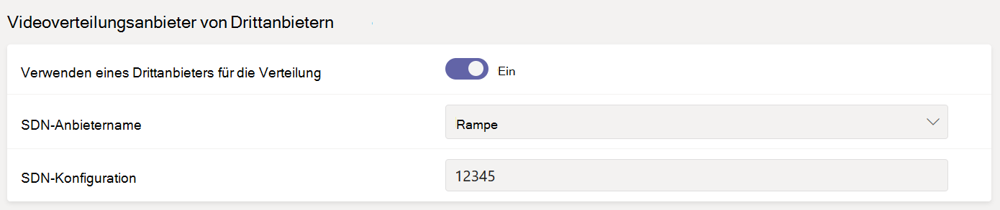

# <a name="configure-live-event-settings-in-microsoft-teams"></a>Konfigurieren von Einstellungen für Live-Ereignisse in Microsoft Teams

Verwenden Teams Einstellungen für Liveereignisse, um Einstellungen für Liveereignisse zu konfigurieren, die in Ihrer Organisation abgehalten werden. Sie können eine Support-URL einrichten und einen Drittanbieter für die Videoverteilung konfigurieren. Diese Einstellungen gelten für alle Liveereignisse, die in Ihrer Organisation erstellt werden.

Sie können diese Einstellungen ganz einfach im Microsoft Teams Admin Center verwalten. Wechseln Sie im linken Navigationsbereich **zu** Einstellungen  >  **für Liveereignisse in Besprechungen.**


## <a name="set-up-event-support-url"></a>Einrichten der URL für die Ereignisunterstützung

Diese URL wird Teilnehmern des Live-Ereignisses angezeigt. Fügen Sie die Support-URL für Ihre Organisation hinzu, damit die Teilnehmer während eines Live-Ereignisses den Support kontaktieren können.

### <a name="using-the-microsoft-teams-admin-center"></a>Verwenden des Microsoft Teams Admin Centers

1. Navigieren Sie im linken Navigationsbereich zu Einstellungen für  >  **Liveereignis für Besprechungen.**
2. Geben **Sie unter Support-URL** die Support-URL Ihrer Organisation ein.

    

### <a name="using-windows-powershell"></a>Verwenden von Windows PowerShell

Führen Sie Folgendes aus:

```PowerShell
Set-CsTeamsMeetingBroadcastConfiguration -SupportURL “{your URL}”
```
Weitere Informationen finden Sie unter [Set-CsTeamsMeetingBroadcastConfiguration.](/powershell/module/skype/set-csteamsmeetingbroadcastconfiguration?view=skype-ps&preserve-view=true)
## <a name="configure-a-third-party-video-distribution-provider"></a>Konfigurieren eines Drittanbieters für die Videoverteilung 

Wenn Sie eine Software defined Network (SDN)-Lösung oder eCDN-Lösung (Enterprise Content Delivery Network) über einen Microsoft-Partner für die Videobereitstellung erworben und eingerichtet haben, konfigurieren Sie den Anbieter für Liveereignisse in Teams. 

### <a name="using-the-microsoft-teams-admin-center"></a>Verwenden des Microsoft Teams Admin Centers

1. Navigieren Sie im linken Navigationsbereich zu Einstellungen für  >  **Liveereignis für Besprechungen.**
2. Führen **Sie unter Videoverteilungsanbieter von Drittanbietern** die folgenden Schritte aus: 

    

    - **Drittanbieter-Distributionsanbieter** Aktivieren Sie diese Option, um den Drittanbieter für die Videoverteilung zu aktivieren.
    - **SDN-Anbietername** Wählen Sie den von Ihnen verwendeten Anbieter aus.
    - **SDN-Konfiguration** Geben Sie Details zur SDN-Konfiguration ein.
        
### <a name="using-windows-powershell"></a>Verwenden von Windows PowerShell
Holen Sie sich die Lizenz-ID oder das API-Token und die API-Vorlage von Ihrem Anbieterkontakt, und führen Sie dann je nach verwendeten Anbieter eine der folgenden Optionen aus:

**Hive** 
```PowerShell
Set-CsTeamsMeetingBroadcastConfiguration -AllowSdnProviderForBroadcastMeeting $True -SdnProviderName hive -SdnLicenseId {license ID GUID provided by Hive} -SdnApiTemplateUrl “{API template URL provided by Hive}”
```
**Kollective** 
```PowerShell
Set-CsTeamsMeetingBroadcastConfiguration -AllowSdnProviderForBroadcastMeeting $True -SdnProviderName kollective -SdnApiTemplateUrl "{API template URL provided by Kollective}" -SdnApiToken {API token GUID provided by Kollective}
```
**Riverbed** 
```PowerShell
Set-CsTeamsMeetingBroadcastConfiguration -AllowSdnProviderForBroadcastMeeting $True -SdnProviderName riverbed -SdnApiTemplateUrl "{API template URL provided by Riverbed}" -SdnApiToken {API token GUID provided by Riverbed}
```
**Ramp** 
```PowerShell
Set-CsTeamsMeetingBroadcastConfiguration -AllowSdnProviderForBroadcastMeeting $True -SdnProviderName ramp -SdnRuntimeConfiguration "{Configuration provided by RAMP}"
```
**Peer5**
```PowerShell
Set-CsTeamsMeetingBroadcastConfiguration -AllowSdnProviderForBroadcastMeeting $True -SdnProviderName peer5 -SdnLicenseId {peer5CustomerId}
```

Weitere Informationen finden Sie unter [Set-CsTeamsMeetingBroadcastConfiguration.](/powershell/module/skype/set-csteamsmeetingbroadcastconfiguration?view=skype-ps&preserve-view=true)

> [!NOTE]
> Wenn Sie planen, Liveereignisse mithilfe einer externen App oder eines externen Geräts zu erstellen, müssen Sie auch Ihren [eCDN-Anbieter](/stream/network-caching)mit Microsoft Stream konfigurieren. 

>[!Note]
> Der Wechsel von Microsoft Stream zu [OneDrive for Business und SharePoint für Besprechungsaufzeichnungen](../tmr-meeting-recording-change.md) erfolgt schrittweise. Beim Start können Sie sich für diese Umgebung entscheiden. Sie müssen sich im November abmelden, wenn Sie Stream weiterhin verwenden möchten. Anfang 2021 müssen alle Kunden OneDrive for Business und SharePoint für neue Besprechungsaufzeichungen verwenden.

>[!Note]
> Die von Ihnen ausgewählte eCDN-Lösung unterliegt den Nutzungsbedingungen und Datenschutzrichtlinien des ausgewählten Drittanbieters, die ihre Verwendung der Lösung des eCDN-Anbieters regeln. Ihre Verwendung der Lösung des eCDN-Anbieters unterliegt nicht den Microsoft-Volumenlizenzbedingungen oder den Bedingungen für Onlinedienste. Wenn Sie den Bedingungen des Drittanbieters nicht zustimmen, aktivieren Sie die eCDN-Lösung in Microsoft Teams.

### <a name="related-topics"></a>Verwandte Themen
- [Was sind Teams-Liveereignisse?](what-are-teams-live-events.md)
- [Planen von Teams-Liveereignissen](plan-for-teams-live-events.md)
- [Einrichten von Teams-Liveereignissen](set-up-for-teams-live-events.md)
