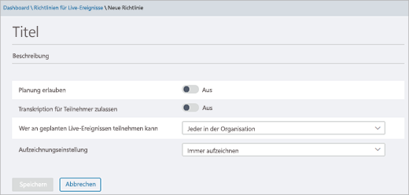

# Einrichtung für Liveereignisse in Microsoft TeamsSet up for live events in Microsoft Teams

Wenn Sie Liveereignisse einrichten, müssen Sie mehrere Schritte ausführen.When you're setting up for live events, there are several steps that you must take.

## Schritt 1: Einrichten Ihres Netzwerk für Liveereignisse in TeamsStep 1: Set up your network for live events in Teams

Für Liveereignisse, die in Teams produziert werden, müssen Sie [das Netzwerk Ihrer Organisation für Teams](https://docs.microsoft.com/microsoftteams/prepare-network) vorbereiten.Live events produced in Teams require you to [prepare your organization's network for Teams](https://docs.microsoft.com/microsoftteams/prepare-network).  

## Schritt 2: Abrufen und Zuweisen von LizenzenStep 2: Get and assign licenses

Stellen Sie sicher, dass Sie die korrekten Lizenzzuweisungen für [ haben, die Liveereignisse](plan-for-teams-live-events.md#who-can-attend-create-and-schedule-live-events) erstellen und planen können, und für [, die Liveereignisse](plan-for-teams-live-events.md#who-can-watch-live-events) verfolgen können.Ensure you have correct license assignments for [who can create and schedule live events](plan-for-teams-live-events.md#who-can-attend-create-and-schedule-live-events) and [who can watch live events](plan-for-teams-live-events.md#who-can-watch-live-events).

## Schritt 3: Einrichten von Richtlinien für LiveereignisseStep 3: Set up live events policies

Richtlinien für Liveereignisse werden verwendet, um zu steuern, wer in Ihrer Organisation Liveereignisse abhalten kann und welche Funktionen in den von ihnen erstellten Ereignissen verfügbar sind.Live events policies are used to control who in your organization can hold live events and the features that are available in the events they create. Sie können die Standardrichtlinie verwenden oder eine oder mehrere benutzerdefinierte Richtlinien für Liveereignisse erstellen.You can use the default policy or create one or more custom live events policies. Nachdem Sie eine benutzerdefinierte Richtlinie erstellt haben, weisen Sie sie einem Benutzer oder Benutzergruppen in Ihrer Organisation zu.After you create a custom policy, assign it to a user or groups of users in your organization.

> [!NOTE]
> Benutzer in Ihrer Organisation erhalten die globale (org-Wide Standard)-Richtlinie, sofern Sie keine benutzerdefinierte Richtlinie erstellen und zuweisen.Users in your organization will get the global (Org-wide default) policy unless you create and assign a custom policy. Standardmäßig ist in der globalen Richtlinie die Planung von Liveereignissen für Teams-Benutzer aktiviert, Live-Untertitel und Untertitel (Transkription) sind deaktiviert, jeder in der Organisation kann an Liveereignissen teilnehmen, und die Aufzeichnungseinstellung ist so eingestellt, dass immer aufgezeichnet wird.By default in the global policy, live event scheduling is enabled for Teams users, live captions and subtitles (transcription) is turned off, everyone in the organization can join live events, and the recording setting is set to always record.

### Erstellen oder Bearbeiten einer Richtlinie für LiveereignisseCreate or edit a live events policy

1. Navigieren Sie in der linken Navigationsleiste des Microsoft Teams Admin Center zu den Richtlinien für **Besprechungen** mit  >  **Live Ereignissen**.In the left navigation of the Microsoft Teams admin center, go to **Meetings** > **Live events policies**.
2. Führen Sie eine der folgenden Optionen aus:Do one of the following options:

    - Wenn Sie die vorhandene Standardrichtlinie bearbeiten möchten, wählen Sie **Global (organisationsweiter Standard)** aus.If you want to edit the existing default policy, choose **Global (Org-wide default)**.
    - Wenn Sie eine neue benutzerdefinierte Richtlinie erstellen möchten, wählen Sie **Hinzufügen** aus.If you want to create a new custom policy, choose **Add**.
    - Wenn Sie eine benutzerdefinierte Richtlinie bearbeiten möchten, markieren Sie die Richtlinie, und wählen Sie dann **Bearbeiten** aus.If you want to edit a custom policy, select the policy, and then choose **Edit**.

    Hier sind die Einstellungen, die Sie ändern können, um sie an die Bedürfnisse Ihrer Organisation anzupassen.Here are the settings you can change to fit the needs of your organization.

    

|EinstellungSetting  |BeschreibungDescription  |
|---------|---------|
|**Titel****Title**     |Dies ist der Titel der Richtlinie, die auf der Seite „Liveereignisrichtlinien“ angezeigt wird.This is the title of the policy that appears on the live events policies page. Sie darf nicht länger als 64 Zeichen sein und keine Sonderzeichen enthalten.It can't be longer than 64 characters or have any special characters.          |
|**Beschreibung****Description**    |Verwenden Sie dies, um eine freundliche Beschreibung der Richtlinie hinzuzufügen.Use this to add a friendly description for the policy.         |
|**Planung erlauben****Allow scheduling**     |Wenn Sie diese Option aktivieren, können Benutzer in Ihrer Organisation Liveereignisse in Teams erstellen und planen.Turning this on lets users in your organization create and schedule live events in Teams. Es ist wichtig zu wissen, dass Sie zusätzliche Schritte ausführen müssen, wenn Sie möchten, dass Benutzer ein Liveereignis planen, das mit einer externen Anwendung oder einem externen Gerät produziert wird.It's important to know that if you want users to schedule a live event produced with an external app or device, there are additional steps you must do. Weitere Informationen finden Sie unter [Benutzern ermöglichen, Ereignisse zu planen, die mit einer externen Anwendung oder einem externen Gerät erstellt werden](#enable-users-to-schedule-events-that-were-produced-with-an-external-app-or-device).To learn more, see  [Enable users to schedule events that were produced with an external app or device](#enable-users-to-schedule-events-that-were-produced-with-an-external-app-or-device).     |
|**Transkription für Teilnehmer zulassen****Allow transcription for attendees** |Diese Einstellung kann nur auf Ereignisse angewendet werden, die in Teams produziert werden.This setting can only be applied to events produced in Teams. Wenn Sie diese Option aktivieren, können die Teilnehmer des Liveereignisses während des Ereignisses Liveuntertitel und Untertitel sehen.Turning this on enables live event attendees to see live captions and subtitles during the event.         |
|**Wer an geplanten Liveereignissen teilnehmen kann****Who can join scheduled live events**    |Wählen Sie eine der folgenden Aktionen aus:Choose one of the following.  **Jeder** Benutzer können Liveereignisse erstellen, an denen alle, auch Personen außerhalb Ihrer Organisation, teilnehmen können.**Everyone** Users can create live events that everyone, including people outside your organization, can attend. Diese Einstellung aktiviert in Teams den Berechtigungstyp **Öffentlich**, wenn ein Benutzer ein Liveereignis plant.This setting enables the **Public** permission type in Teams when a user schedules a live event.  **Jeder in der Organisation** Benutzer können Liveereignisse erstellen, an denen Personen in Ihrer Organisation, einschließlich [Gastbenutzer](../add-guests.md), die Ihrer Organisation hinzugefügt wurden, teilnehmen können.**Everyone in the organization** Users can create live events that people in your organization, including [guest users](../add-guests.md) added to your organization, can attend. Benutzer können keine Liveereignisse erstellen, an denen anonyme Benutzer teilnehmen.Users can't create live events that are attended by anonymous users. Diese Einstellung aktiviert in Teams den Berechtigungstyp **Organisationsweit**, wenn ein Benutzer ein Liveereignis plant.This setting enables the **Org-wide** permission type in Teams when a user schedules a live event.  **Bestimmte Benutzer oder Gruppen** Benutzer können Liveereignisse erstellen, an denen nur bestimmte Benutzer oder Gruppen in Ihrer Organisation teilnehmen können.**Specific users or groups** Users can create live events that only specific users or groups in your organization can attend. Benutzer können keine Liveereignisse erstellen, an denen jeder in Ihrer Organisation oder anonyme Benutzer teilnehmen können.Users can't create live events that are attended by everyone in your organization or by anonymous users. Diese Einstellung aktiviert den Berechtigungstyp **Personen und Gruppen** in Teams, wenn ein Benutzer ein Liveereignis plant.This setting enables the **People and groups** permission type in Teams when a user schedules a live event.       |
|**Aufzeichnungseinstellung****Recording setting**        | Diese Einstellung kann nur auf Ereignisse angewendet werden, die in Teams produziert werden.This setting can only be applied to events produced in Teams. Wählen Sie eine der folgenden Aktionen aus:Choose one of the following.    **Immer aufzeichnen** Von Benutzern erstellte Liveereignisse werden immer aufgezeichnet.**Always record** Live events created by users are always recorded. Nach Ende des Ereignisses können die Teammitglieder die Aufzeichnung herunterladen, und die Teilnehmer können sich das Ereignis ansehen.After the event is over, event team members can download the recording and attendees can watch the event.   **Nie aufzeichnen** Von Benutzern erstellte Liveereignisse werden nie aufgezeichnet.**Never record** Live events created by users are never recorded.  **Organisator kann aufzeichnen oder nicht** Benutzer können entscheiden, ob das Liveereignis aufgezeichnet werden soll.**Organizer can record or not** Users can decide whether to record the live event. Falls das Ereignis aufgezeichnet wird, können die Teammitglieder nach dessen Ende die Aufzeichnung herunterladen, und die Teilnehmer können sich das Ereignis ansehen.If it's recorded, after the event is over, event team members can download the recording and attendees can watch the event.

Sie können dies auch mithilfe von Windows PowerShell tun.You can also do this by using Windows PowerShell. Weitere Informationen erhalten Sie unter [Verwenden von PowerShell zum Festlegen von Richtlinien für Liveereignisse in Microsoft Teams](set-teams-live-events-policies-using-powershell.md).For more information, see [Use PowerShell to set live events policies in Teams](set-teams-live-events-policies-using-powershell.md).

### Zuweisen einer Richtlinie für Liveereignisse zu BenutzernAssign a live events policy to users

Wenn Sie eine benutzerdefinierte Richtlinie für Livereignisse erstellt haben, weisen Sie sie Benutzern zu, damit die Richtlinie aktiv wird.If you created a custom live events policy, assign it to users for the policy to be active.   [!INCLUDE [assign-policy](../includes/assign-policy.md)]

### Benutzern die Planung von Ereignissen ermöglichen, die mit einer externen App oder einem externen Gerät erstellt werdenEnable users to schedule events that were produced with an external app or device

Damit Benutzerereignisse planen können, die mit einer externen APP oder einem Gerät erstellt wurden, müssen Sie auch die folgenden Schritte ausführen:For users to schedule events produced with an external app or device, you must also do the following steps:

1. Microsoft Stream für Benutzer in Ihrer Organisation aktivieren.Enable Microsoft Stream for users in your organization. Stream ist als Teil der berechtigten Microsoft 365-oder Office 365-Abonnements oder als eigenständiger Dienst verfügbar.Stream is available as part of eligible Microsoft 365 or Office 365 subscriptions or as a standalone service. Stream ist nicht in Business Essentials- oder Business Premium-Plänen enthalten.Stream isn't included in Business Essentials or Business Premium plans. Weitere Details finden Sie unter [Übersicht über die Stream-Lizenzierung](https://docs.microsoft.com/stream/license-overview).See [Stream licensing overview](https://docs.microsoft.com/stream/license-overview) for more details.

   >[!Note]
   > Der Wechsel von Microsoft Stream zu [OneDrive for Business und SharePoint für Besprechungsaufzeichnungen](../tmr-meeting-recording-change.md) erfolgt schrittweise.The change from using Microsoft Stream to [OneDrive for Business and SharePoint for meeting recordings](../tmr-meeting-recording-change.md) will be a phased approach. Bei der Markteinführung können Sie sich optional für diese Erfahrung anmelden. Im November müssen Sie sich abmelden, wenn Sie Stream weiterhin nutzen möchten. Ab Anfang 2021 werden wir von allen Kunden die Verwendung von OneDrive for Business und Microsoft Office SharePoint Online für neue Besprechungsaufzeichnungen verlangen.At launch you'll be able to opt-in to this experience, in November you'll have to opt-out if you want to continue using Stream, and some time in early 2021 we'll require all customers to use OneDrive for Business and SharePoint for new meeting recordings. Erfahren Sie mehr darüber, wie Sie [**Benutzern Lizenzen zuweisen**](https://support.office.com/article/Assign-licenses-to-users-in-Office-365-for-business-997596B5-4173-4627-B915-36ABAC6786DC) können, damit Benutzer auf Datenstrom zugreifen können.Learn more about how you can [**assign licenses to users**](https://support.office.com/article/Assign-licenses-to-users-in-Office-365-for-business-997596B5-4173-4627-B915-36ABAC6786DC) so that users can access Stream. Stellen Sie sicher, dass Datenstrom nicht für die Benutzer blockiert ist, wie in [**diesem Artikel**](https://docs.microsoft.com/stream/disable-user-organization)definiert.Ensure Stream isn't blocked for the users as defined in [**this article**](https://docs.microsoft.com/stream/disable-user-organization).

2. Vergewissern Sie sich, dass die Benutzer über die Berechtigung zum Erstellen eines Liveereignisses in Stream verfügen.Ensure users have live event creation permission in Stream. Administratoren können standardmäßig mit einer externen App oder einem externen Gerät Ereignisse erstellen.By default, administrators can create events with an external app or device. Ein Stream-Administrator kann in Stream [zusätzliche Benutzer für die Erstellung von Liveereignissen](https://docs.microsoft.com/stream/live-event-administration#enabling-and-restricting-users-to-creating) aktivieren.Stream administrator can [enable additional users for live event creation](https://docs.microsoft.com/stream/live-event-administration#enabling-and-restricting-users-to-creating) in Stream.

3. Vergewissern Sie sich, dass Organisatoren von Liveereignissen der Unternehmensrichtlinie, die vom Stream-Administrator festgelegt wurde, zugestimmt haben. Wenn ein Stream-Administrator [eine Richtlinie für Unternehmensrichtlinien eingerichtet hat](https://docs.microsoft.com/stream/company-policy-and-consent) und die Mitarbeiter diese Richtlinie vor dem Speichern von Inhalten akzeptieren müssen, müssen Benutzer dies tun, bevor Sie in Teams ein Liveereignis (mit einer externen App oder einem externen Gerät) erstellen.Ensure live event organizers have consented to the company policy set by Stream admin. If a Stream administrator has [set up a company guidelines policy](https://docs.microsoft.com/stream/company-policy-and-consent) and requires employees to accept this policy before saving content, then users must do so before creating a live event (with an external app or device) in Teams. Bevor Sie das Liveereignisfeature in der Organisation bereitstellen, stellen Sie sicher, dass Benutzer, die diese Liveereignisse erstellen, der Richtlinie zugestimmt haben.Before you roll out the live events feature in the organization, make sure users who will be creating these live events have consented to the policy.

## Schritt 4: Einrichten einer Videoverteilungslösung für Liveereignisse in TeamsStep 4: Set up a video distribution solution for live events in Teams

Bei der Wiedergabe von Liveereignisvideos wird Adaptive Bitrate Streaming (ABR) verwendet, aber es ist ein Unicast-Stream, was bedeutet, dass jeder Zuschauer einen eigenen Videostream aus dem Internet erhält.Playback of live event videos uses adaptive bitrate streaming (ABR) but it's a unicast stream, meaning every viewer is getting their own video stream from the internet. Bei Liveereignissen oder Videos, die an große Teile Ihrer Organisation gesendet werden, kann von den Zuschauern ein beträchtlicher Anteil der Internetbandbreite verbraucht werden.For live events or videos sent out to large portions of your organization, there could be a significant amount of internet bandwidth consumed by viewers. Bei Organisationen, die diesen Internetdatenverkehr für Liveereignisse reduzieren möchten, werden Lösungen für Liveereignisse mit den vertrauenswürdigen Videobereitstellungspartnern von Microsoft integriert, die softwaredefinierte Netzwerke (SDNs) oder Enterprise Content Delivery Networks (eCDNs) anbieten.For organizations that want to reduce this internet traffic for live events, live events solutions are integrated with Microsoft's trusted video delivery partners offering software defined networks (SDNs) or enterprise content delivery networks (eCDNs). Diese SDN-/eCDN-Plattformen ermöglichen Organisationen, die Netzwerkbandbreite zu optimieren, ohne das Videoerlebnis der Endbenutzer zu schmälern.These SDN/eCDN platforms enable organizations to optimize network bandwidth without sacrificing end user viewing experiences. Unsere Partner ermöglichen eine skalierbarere und effizientere Videoverteilung in Ihrem Unternehmensnetzwerk.Our partners can help enable a more scalable and efficient video distribution across your enterprise network.

**Erwerben und Einrichten Ihrer Lösung außerhalb von Teams** Lassen Sie sich beim Skalieren von Videobereitstellungen durch die vertrauenswürdigen Videobereitstellungspartner von Microsoft helfen.**Purchase and set up your solution outside of Teams** Get expert help with scaling video delivery by leveraging Microsoft's trusted video delivery partners. Bevor Sie die Verwendung eines Video Zustellungs Anbieters für Teams aktivieren können, müssen Sie die Sdn/ECDN-Lösung außerhalb von Teams kaufen und separat einrichten.Before you can enable a video delivery provider to be used with Teams, you must purchase and set up the SDN/eCDN solution outside and separate from Teams.

Die folgenden SDN-/eCDN-Lösungen sind vorintegriert und können für die Verwendung mit Stream eingerichtet werden.The following SDN/eCDN solutions are pre-integrated and can be set up to be used with Stream.

- **Hive-Streaming** bietet eine einfache und leistungsstarke Lösung für die Live- und On-Demand-Videoverteilung in Unternehmen.**Hive Streaming** provides a simple and powerful solution for live and on-demand enterprise video distribution. Bei Hive handelt es sich um eine softwarebasierte Lösung, die keine zusätzliche Hardware oder Bandbreite erfordert und eine sichere Möglichkeit bietet, ein Video ohne Auswirkungen auf Ihr Netzwerk zu Tausenden gleichzeitig abzurufen.Hive is a software-based solution that requires no additional hardware or bandwidth and provides a secure way to enable thousands of simultaneous video viewers without impact to your network. Wenn Sie wissen möchten, welche Auswirkungen Video auf Ihr Netzwerk hat, bevor Sie eine SDN-/eCDN-Lösung erwerben, bietet Hive-Streaming auch eine browserbasierte Analyselösung für Microsoft-Kunden.For customers looking to understand the impact video is having on their network prior to purchasing an SDN/eCDN solution, Hive Streaming also provides a browser-based analytics solution for Microsoft customers. [Weitere Informationen](https://www.hivestreaming.com/partners/integration-partners/microsoft/).[Learn more](https://www.hivestreaming.com/partners/integration-partners/microsoft/).

- **Kollective** ist eine cloudbasierte, intelligente Plattform für Peeringverteilung, die Ihre vorhandene Netzwerkinfrastruktur nutzt, um Inhalte in vielen Formen (Livestreaming-Video, On-Demand-Video, Softwareupdates, Sicherheitspatches usw.) schneller, zuverlässiger und mit weniger Bandbreite bereitzustellen.**Kollective** is a cloud-based, smart peering distribution platform that leverages your existing network infrastructure to deliver content, in many forms, (live streaming video, on-demand video, software updates, security patches, etc.) faster, more reliably and with less bandwidth. Unsere sichere Plattform wird von den weltweit größten Finanzinstituten als vertrauenswürdig eingestuft, und da keine zusätzliche Hardware nötig ist, sind das Setup und die Wartung einfach.Our secure platform is trusted by the world's largest financial institutions and with no additional hardware, setup and maintenance are easy. [Weitere Informationen](https://kollective.com/microsoft-pilot/).[Learn more](https://kollective.com/microsoft-pilot/).

- **Ramp OmniCache** bietet Netzwerkverteilung der nächsten Generation und sorgt für eine reibungslose Bereitstellung von Videoinhalten über globale WANs hinweg. Dies hilft Produzenten von Ereignissen bei der Optimierung der Netzwerkbandbreite und Unterstützung von erfolgreichen Liveereignis-Übertragungen und On-Demand-Streaming.**Ramp OmniCache** provides next-generation network distribution and ensures seamless delivery of video content across global WANs, helping event producers optimize network bandwidth and support successful live event broadcasts and on-demand streaming. Die Unterstützung für Ramp OmniCache für in Teams produzierte Liveereignisse ist in Kürze verfügbar.The support for Ramp OmniCache for live events produced in Teams is coming soon. [Weitere Informationen](https://rampecdn.com).[Learn more](https://rampecdn.com).

- **Riverbed**, der Branchenstandard bei der Netzwerkoptimierung, erweitert seine Acceleration-Lösungen auf Microsoft Teams und Stream.**Riverbed**, the industry standard in network optimization, is extending its acceleration solutions to Microsoft Teams and Stream.  Microsoft 365-Kunden können nun 365-Datenverkehr, einschließlich Teams und Streams, mit einer Vielzahl anderer führender Unternehmens-SaaS-Services beschleunigen, um die Produktivität von überall aus zu steigern.Now Microsoft 365 customers can confidently accelerate 365 traffic including Teams and Stream along with a wealth of other leading enterprise SaaS services to increase workforce productivity from anywhere. Teams und Stream-Beschleunigungen können durch eine mühelose Einrichtung ermöglicht werden, die von der Weltklasse-Unterstützung von Riverbed und der laufenden Investition sichergestellt wird.Teams and Stream acceleration can be enabled through an effortless setup that comes with all the assurance of Riverbed’s world-class support and ongoing investment.

> [!NOTE]
> Die von Ihnen ausgewählte SDN- oder eCDN-Lösung unterliegt den **Vertragsbedingungen und Datenschutzrichtlinien des gewählten Drittanbieters**, die die Nutzung der Lösung des Anbieters regeln.Your chosen SDN or eCDN solution is subject to the selected **3rd party provider's terms of service and privacy policy**, which will govern your use of the provider's solution. Ihre Nutzung der Anbieterlösung unterliegt nicht den Microsoft-Volumenlizenzierungsbedingungen oder den Nutzungsbedingungen für Online Services.Your use of the provider's solution will not be subject to the Microsoft volume licensing terms or Online Services Terms. Wenn Sie den **Vertragsbedingungen des Drittanbieters** nicht zustimmen, aktivieren Sie die Lösung nicht in Teams.If you do not agree to the **3rd party provider's terms**, then don't enable the solution in Teams.

Nachdem Sie die SDN- oder eCDN-Lösung eingerichtet haben, können Sie den Anbieter für Liveereignisse in Teams konfigurieren.After you set up the SDN or eCDN solution, you're ready to configure the provider for live events in Teams.

## Nächste SchritteNext steps

Gehen Sie zu [Konfigurieren der Einstellungen für Liveereignisse in Teams](configure-teams-live-events.md).Go to [Configure live events settings in Teams](configure-teams-live-events.md).

### Verwandte ThemenRelated topics

- [Was sind Live-Events in Teams?What is Teams live events?](what-are-teams-live-events.md)
- [Planen von Teams-LiveereignissenPlan for Teams live events](plan-for-teams-live-events.md)
- [Konfigurieren der Einstellungen für Liveereignisse in TeamsConfigure live events settings in Teams](configure-teams-live-events.md)
