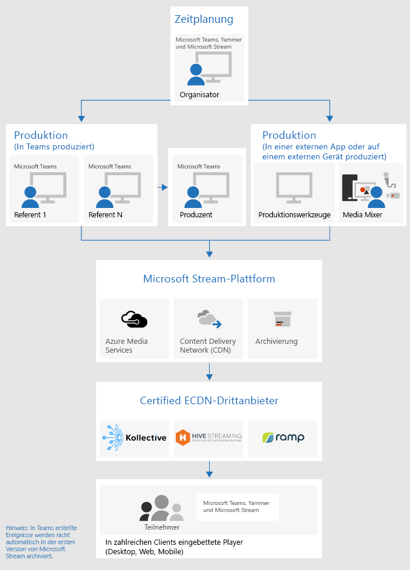
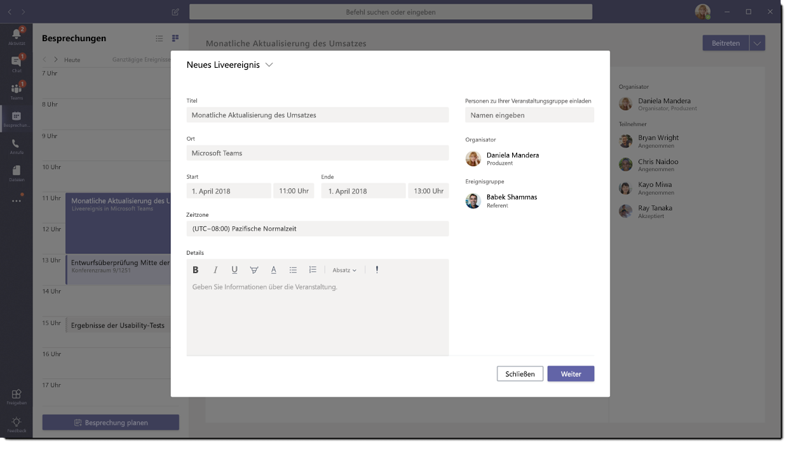
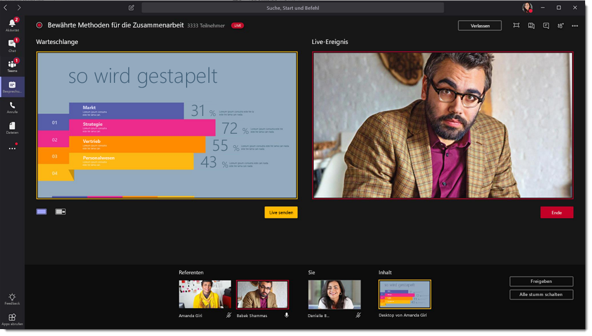
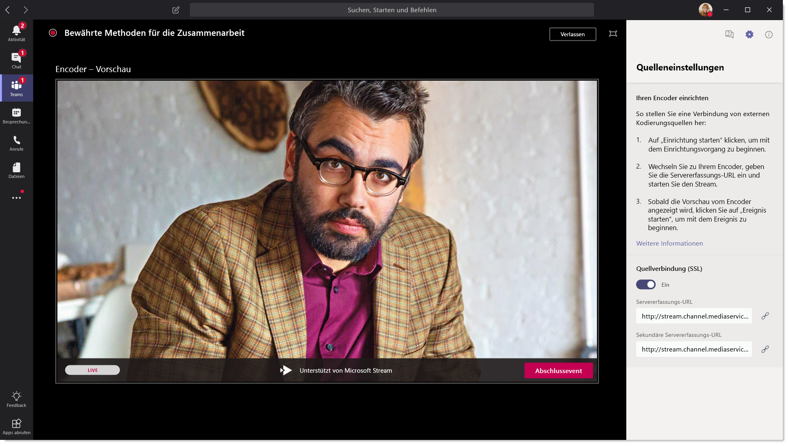
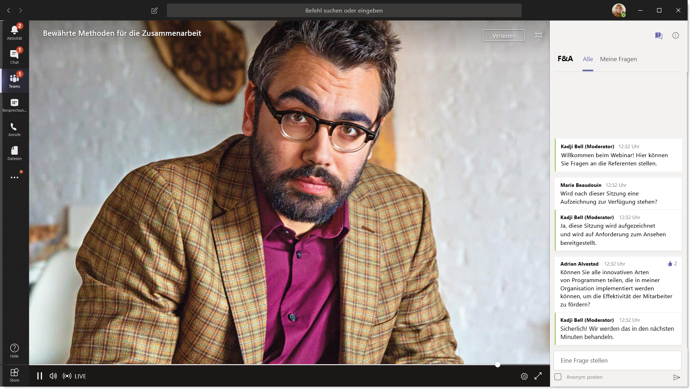

# Was sind Live-Ereignisse in Microsoft Teams?What are Microsoft Teams live events?

## ÜbersichtOverview

Mit Live-Ereignissen von Teams können Benutzer in Ihrer Organisation Video-und Besprechungsinhalte an große Online-Zielgruppen übertragen.With Teams live events, users in your organization can broadcast video and meeting content to large online audiences. 

Mit den Live-Ereignissen von Microsoft 365 können Live-Videoübertragungen auf eine neue Ebene durchführen, was die Verbindung über den gesamten Lebenszyklus des Engagements mit Teilnehmern vor, während und nach Live-Events anregt.Microsoft 365 live events bring live video streaming to a new level, encouraging connection throughout the entire engagement lifecycle with attendees before, during, and after live events. Sie können ein Live-Ereignis erstellen, unabhängig davon, wo sich Ihre Zielgruppe, Ihr Team oder Ihre Community befindet, indem Sie Microsoft Stream, Teams oder jammern verwenden.You can create a live event wherever your audience, team, or community resides, using Microsoft Stream, Teams, or Yammer.  

Teams bietet Chat basierte Zusammenarbeit, Anrufe, Besprechungen und Live Ereignisse, sodass Sie das Publikum ihrer Besprechungen erweitern können.Teams delivers chat-based collaboration, calling, meetings, and live events, so you can expand the audience of your meetings. Live-Events von Teams ist eine Erweiterung von Teams-Besprechungen, die es Benutzern ermöglichen, Video-und Besprechungsinhalte an eine große Online-Zielgruppe zu übertragen.Teams live events is an extension of Teams meetings, enabling users to broadcast video and meeting content to a large online audience. Diese sind für eine 1: n-Kommunikation vorgesehen, in der der Gastgeber des Ereignisses die Interaktionen führt und die Teilnahme am Publikum in erster Linie dazu dient, die vom Host freigegebenen Inhalte anzuzeigen.These are meant for one-to-many communications where the host of the event is leading the interactions and audience participation is primarily to view the content shared by host. Die Teilnehmer können das Live-oder aufgezeichnete Ereignis in "jammern", "Teams" und/oder "Stream" verfolgen und mit moderierten Q-#a0 einer Unterhaltung oder einer jammern-Konversation mit den Referenten interagieren.The attendees can watch the live or recorded event in Yammer, Teams, and/or Stream, and can interact with the presenters using moderated Q & A or a Yammer conversation.

Live-Events von Teams gelten als die nächste Version der Skype-Live Konferenz und ersetzen schließlich die Funktionen, die in der Skype-Live Konferenz zur Verfügung gestellt werden.Teams live events are considered the next version of Skype Meeting Broadcast and will eventually replace the capabilities provided in Skype Meeting Broadcast. An diesem Punkt wird Microsoft weiterhin Skype-Live Konferenz für Benutzer unterstützen, die Skype for Business in ihren Organisationen verwenden, ohne Unterbrechungen beim Service für neue oder zukünftige Ereignisse.At this point, Microsoft will continue to support Skype Meeting Broadcast for users who are using Skype for Business in their organizations, with no disruption in service for new or future events. Wir empfehlen Ihnen jedoch, Teams Live-Events zu testen, um alle neuen und spannenden Funktionen wie Bildschirmübertragung und Unterstützung externer Hardware/Software-Encoder zu nutzen.However, we encourage you to try out Teams live events to leverage all the new and exciting features including screen sharing and support for external hardware/software encoders.

Also lasst uns loslegen.So, let's get started. Sehen Sie sich zunächst das folgende Diagramm an, in dem die Komponenten auf hoher Ebene, die an Microsoft 365-Live Ereignissen beteiligt sind und wie diese verbunden sind, angezeigt werden.First, take a look at the following diagram that shows high level components involved in Microsoft 365 live events and how they are connected. 

### Ereignisgruppen RollenEvent group roles
Mit Live Ereignissen in Teams können mehrere Rollen (Organisator, Produzent, Referent und Teilnehmer) erfolgreich übertragen und an einem Ereignis teilnehmen.Live events in Teams empowers multiple roles (organizer, producer, presenter, and attendee) to successfully broadcast and participate in an event. Weitere Informationen finden Sie unter [Rollen der Ereignisgruppe](https://support.office.com/article/get-started-with-microsoft-teams-live-events-d077fec2-a058-483e-9ab5-1494afda578a?ui=en-US&rs=en-US&ad=US#bkmk_roles).To learn more, see [Event group roles](https://support.office.com/article/get-started-with-microsoft-teams-live-events-d077fec2-a058-483e-9ab5-1494afda578a?ui=en-US&rs=en-US&ad=US#bkmk_roles).

## SchlüsselkomponentenKey components
Sie können aus dem Bild oben sehen, dass es vier wichtige Komponenten gibt, die in Teams für Live-Ereignisse verwendet werden.You can see from the picture above that there are four key components that are used with live events in Teams.

> [!NOTE]
> Eine Übersicht darüber, wie Sie Live-Events und die Teilnehmer-Erfahrung einrichten, finden Sie in diesen kurzen [Videos](https://support.office.com/en-us/article/video-plan-and-schedule-a-live-event-f92363a0-6d98-46d2-bdd9-f2248075e502).For an overview of how to set up live events and the attendee experience, check out these short [videos](https://support.office.com/en-us/article/video-plan-and-schedule-a-live-event-f92363a0-6d98-46d2-bdd9-f2248075e502).

### PlanungScheduling
Teams bietet den Organisatoren die Möglichkeit, ein Ereignis mit den entsprechenden Berechtigungen für Teilnehmer zu erstellen, Ereignis Teammitglieder festzulegen, eine Produktionsmethode auszuwählen und Teilnehmer einzuladen.Teams provides the ability for the organizers to create an event with the appropriate attendee permissions, designate event team members, select a production method, and invite attendees. Wenn das Live-Ereignis in einer Gruppe von "jammern" erstellt wurde, können die Teilnehmer des Live-Ereignisses für die Interaktion mit Personen in dem Ereignis eine Jammer Unterhaltung verwenden.If the live event was created from within a Yammer group, the live event attendees will be able to use Yammer conversation for interacting with people in the event. 

### ProduktionsProduction
Der Videoeingang ist das Fundament des Live-Events und kann von einer einzelnen Webcam bis hin zu einer professionellen Videoproduktion mit mehreren Kameras variieren.The video input is the foundation of the live event and it can vary from a single webcam to a multi-camera professional video production. Die Live Ereignisse in Microsoft 365 unterstützen ein Spektrum von Produktionsszenarien, einschließlich eines Ereignisses, das in Teams mit einer Webcam oder einem Ereignis in einer externen APP oder einem Gerät erstellt wurde.The live events in Microsoft 365 support a spectrum of production scenarios, include an event produced in Teams using a webcam or an event produced in an external app or device. Sie können diese Optionen je nach Projektanforderungen und Budget auswählen.You can choose these options depending on their project requirements and budget. Es gibt zwei Möglichkeiten zum Erstellen von Ereignissen:There are two ways to produce events:

- **Teams**: mit dieser Produktionsmethode können Benutzer ihre Live-Events in Teams mit Ihrer Webcam oder mit einer/V-Eingabe von Teams Room Systems erstellen.**Teams**: This production method allows users to produce their live events in Teams using their webcam or using A/V input from Teams room systems. Diese Option ist die beste und schnellste Option, wenn Sie die Audio-und Videogeräte, die mit dem PC verbunden sind, verwenden möchten, oder wenn Sie Remote Referenten einladen, an der Veranstaltung teilzunehmen.This option is the best and quickest option if you want to use the audio and video devices connected to the PC or are inviting remote presenters to participate in the event. Diese Option ermöglicht es Benutzern, Ihre Webcams einfach zu nutzen und Ihren Bildschirm als Eingabe für die Veranstaltung freizugeben.This option allows users to easily use their webcams and share their screen as input in the event. 

    

- **Externe APP oder Gerät**: externe Encoder ermöglichen Benutzern, Ihre Live Ereignisse direkt von einem externen Hardware-oder softwarebasierten Encoder mit [Stream](https://stream.microsoft.com)zu produzieren.**External app or device**: External encoders allow users to produce their live events directly from an external hardware or software-based encoder with [Stream](https://stream.microsoft.com). Diese Option ist am besten geeignet, wenn Sie bereits über Studio-qualitätsgeräte (beispielsweise Medien Mischer) verfügen, die das Streaming zu einem RTMP-Dienst (Real-Time Messaging Protocol) unterstützen.This option is best if you already have studio quality equipment (for example, media mixers) which support streaming to a Real-time Messaging Protocol (RTMP) service. Diese Art der Produktion wird in der Regel in großflächigen Ereignissen wie exekutiven Stadthallen verwendet, in denen ein einzelner Datenstrom von einem Medien Mixer an das Publikum übertragen wird.This type of production is typically used in large scale events such as executive town halls – where a single stream from a media mixer is broadcasted to the audience. 

    

### Streaming-PlattformStreaming platform
Die Live-Event-Streaming-Plattform besteht aus den folgenden Teilen:The live event streaming platform is made up of the following pieces:

- **Azure Media Services**: [Azure Media Services](https://docs.microsoft.com/azure/media-services/previous/) bietet Ihnen Broadcast-Quality-Video Streaming-Dienste, um größere Zielgruppen auf den heute beliebtesten mobilen Geräten zu erreichen.**Azure Media Services**:  [Azure Media Services](https://docs.microsoft.com/azure/media-services/previous/) gives you broadcast-quality video streaming services to reach larger audiences on today’s most popular mobile devices. Media Services verbessert die Barrierefreiheit, Verteilung und Skalierbarkeit und macht es einfach und kostengünstig, Inhalte an Ihre lokalen oder weltweiten Zielgruppen zu streamen, während Sie Ihre Inhalte schützen.Media Services enhances accessibility, distribution, and scalability, and makes it easy and cost-effective to stream content to your local or worldwide audiences — all while protecting your content.
- **Azure Content Delivery Network (CDN)**: Sobald der Datenstrom in Echtzeit übertragen wird, wird er über das [Azure Content Delivery Network (CDN)](https://docs.microsoft.com/azure/cdn/)bereitgestellt.**Azure Content Delivery Network (CDN)**:  Once your stream goes live, it's delivered through the [Azure Content Delivery Network (CDN)](https://docs.microsoft.com/azure/cdn/). Azure Media Services bietet integriertes CDN für Streaming-Endpunkte.Azure Media Services provides integrated CDN for streaming endpoints. Auf diese Weise können die Streams weltweit ohne Pufferung angezeigt werden.This allows the streams to be viewed worldwide with no buffering.

### Enterprise Content Delivery Network (ECDN)Enterprise Content Delivery Network (eCDN)
Das Ziel von ECDN besteht darin, die Videoinhalte aus dem Internet zu übernehmen und die Inhalte im gesamten Unternehmen zu verteilen, ohne die Netzwerkleistung zu beeinträchtigen.The goal of eCDN is to take the video content from the internet and distribute the content throughout your enterprise without impacting network performance. Sie können einen der folgenden Certified ECDN-Partner verwenden, um Ihr Netzwerk für Live-Events in Ihrer Organisation zu optimieren:You can use one of the following certified eCDN partners to optimize your network for live events held within your organization:
- [StrukturHive](https://www.hivestreaming.com/partners/integration-partners/microsoft/)
- [KollectiveKollective](https://kollective.com/microsoft-pilot/)
- [TyphierarchieRamp](http://www.ramp.com)

### Teilnehmer-ErfahrungAttendee experience 
Die Teilnehmer-Erfahrung ist der wichtigste Aspekt von Live Ereignissen, und es ist wichtig, dass die Teilnehmer am Live-Ereignis teilnehmen können, ohne dass Probleme auftreten.The attendee experience is the most important aspect of live events and it's critical that the attendees can participate in the live event without having any issues. Die Teilnehmer-Oberfläche verwendet Azure Media Player (für Ereignisse, die in Teams erstellt wurden) und Stream Player (für Ereignisse, die in einer externen APP oder einem Gerät erstellt wurden) und funktioniert auf Desktop-, Browser-und Mobilgeräten (Ios, Android).The attendee experience uses Azure Media Player (for events produced in Teams) and Stream Player (for events produced in an external app or device) and works across desktop, browser, and mobile (iOS, Android). Office 365 bietet jammern und Teams zwei Zusammenarbeit-Hubs, und die Live-Teilnehmer-Erfahrung ist in diese Tools für die Zusammenarbeit integriert.Office 365 provides Yammer and Teams as two collaboration hubs, and the live attendee experience is integrated into these collaboration tools. 

### Bericht zur Live-Ereignis NutzungLive event usage report 
Mandantenadministratoren können Echtzeit-Nutzungsanalysen für Live-Ereignisse im Microsoft Teams Admin Center anzeigen.Tenant admins can view real time usage analytics for live events in Microsoft Teams admin center.  Der [Bericht zur Live-Ereignis Verwendung](../teams-analytics-and-reports/teams-live-event-usage-report.md) zeigt die Aktivitätsübersicht der in der Organisation gespeicherten Live Ereignisse an.The [live event usage report](../teams-analytics-and-reports/teams-live-event-usage-report.md) shows the activity overview of the live events held in the organization.  Administratoren können Informationen zur Ereignis Nutzung anzeigen, einschließlich Ereignisstatus, Startzeit, Ansichten und Produktionstyp.Admins can view event usage information, including event status, start time, views and production type.  

## Nächste SchritteNext steps
Wechseln Sie zu [Plan für Teams-Live Ereignisse](plan-for-teams-live-events.md).Go to [Plan for Teams live events](plan-for-teams-live-events.md).

### Verwandte ThemenRelated topics
- [Live Ereignisse in Microsoft 365 in jammern, Microsoft Teams und Microsoft StreamLive events across Microsoft 365 in Yammer, Microsoft Teams, and Microsoft Stream](https://docs.microsoft.com/stream/live-event-m365)
- [Erste Schritte mit Microsoft Teams Live-EventsGet started with Microsoft Teams live events](https://support.office.com/article/d077fec2-a058-483e-9ab5-1494afda578a)
- [Live Ereignisse in "jammern"Live events in Yammer](https://support.office.com/article/live-events-in-yammer-4ece0ee2-c268-4636-bf2a-16e454befe57)
- [Live Ereignisse in Microsoft StreamLive events in Microsoft Stream](https://docs.microsoft.com/stream/live-event-overview)

 
