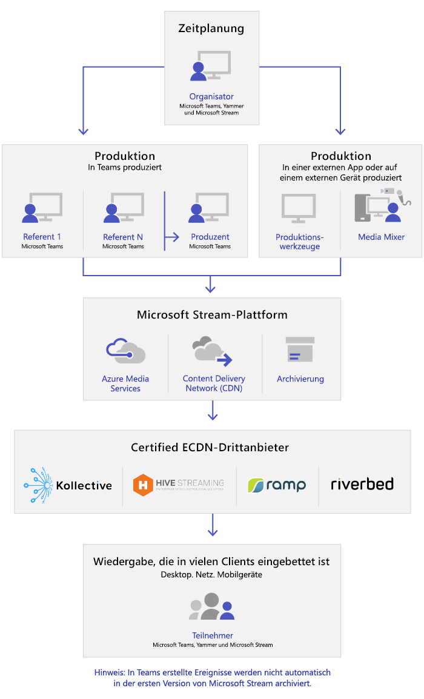

# Was sind Live-Events in Microsoft Teams?

## Übersicht

In Teams, die Ereignisse Leben, können Benutzer in Ihrer Organisation Video-und Besprechungsinhalte an große Online-Zielgruppen übertragen.

Mit Microsoft 365-Live Ereignissen können Sie Live-Videoübertragungen auf eine neue Ebene führen. Live-Events fördern die Verbindung über den gesamten Lebenszyklus des Engagements mit Teilnehmern vor, während und nach Live-Ereignissen. Mit Microsoft Stream, Teams oder Yammer können Sie ein Liveereignis erstellen, wo auch immer Ihr Publikum, Ihr Team oder Ihre Gemeinschaft ansässig ist.  

Teams bietet Chat-basierte Zusammenarbeit, Anrufe, Besprechungen und Liveereignisse, sodass Sie das Publikum Ihrer Besprechungen vergrößern können. Teams-Liveereignisse sind eine Erweiterung von Teams-Besprechungen und ermöglichen den Benutzern, Video- und Besprechungsinhalte für ein großes Onlinepublikum zu übertragen. Live-Ereignisse sind für eine 1: n-Kommunikation vorgesehen, bei der der Gastgeber des Ereignisses die Interaktionen führt und die Teilnahme am Publikum in erster Linie dazu dient, die vom Host freigegebenen Inhalte anzuzeigen. Die Teilnehmer können das Live-oder aufgezeichnete Ereignis in "jammern", "Teams" und/oder "Stream" verfolgen und mit moderierten Q-& einer Unterhaltung oder einer jammern-Konversation mit den Referenten interagieren.

Liveereignisse in Teams gelten als die nächste Version von Skype Meeting Broadcast und werden letzten Endes die darin bereitgestellten Funktionen ersetzen. Aktuell wird Microsoft weiterhin Skype Meeting Broadcast für Benutzer unterstützen, die Skype for Business in ihren Organisationen nutzen, ohne Unterbrechung des Dienstes für neue oder zukünftige Ereignisse. Wir empfehlen Ihnen jedoch, die Teams-Liveereignisse auszuprobieren, um all die neuen und aufregenden Funktionen zu nutzen, darunter die Bildschirmübertragung und Unterstützung für externe Hardware-/Software-Encoder.

Fangen wir also an. Sehen Sie sich zunächst das folgende Diagramm an, in dem die Komponenten auf hoher Ebene, die an Microsoft 365-Live Ereignissen beteiligt sind und wie diese verbunden sind, angezeigt werden.

### Rollen der Ereignisgruppe

Liveereignisse in Teams ermöglichen mehreren Rollen (Organisator, Produzent, Referent und Teilnehmer), ein Ereignis erfolgreich zu übertragen und daran teilzunehmen. Weitere Informationen hierzu finden Sie unter [Rollen der Ereignisgruppe](https://support.office.com/article/get-started-with-microsoft-teams-live-events-d077fec2-a058-483e-9ab5-1494afda578a?ui=en-US&rs=en-US&ad=US#bkmk_roles).

## Schlüsselkomponenten

Auf dem obigen Bild können Sie erkennen, dass es vier Schlüsselkomponenten gibt, die bei Liveereignissen in Teams verwendet werden.

> [!NOTE]
> Eine Übersicht darüber, wie Sie Liveereignisse und die Teilnehmerumgebung einrichten, erhalten Sie in diesen kurzen [Videos](https://support.office.com/article/video-plan-and-schedule-a-live-event-f92363a0-6d98-46d2-bdd9-f2248075e502).

### Zeitplanung

Teams bietet Organisatoren die Möglichkeit, ein Ereignis mit den entsprechenden Teilnehmerrechten zu erstellen, Teammitglieder für das Ereignis zu bestimmen, eine Produktionsmethode auszuwählen und Teilnehmer einzuladen. Wenn das Liveereignis aus einer Yammer-Gruppe heraus erstellt wurde, können die Teilnehmer des Liveereignisses das Yammer-Gespräch für die Interaktion mit Personen des Ereignisses nutzen.

### Produktion

Die Videoeingabe ist die Grundlage des Liveereignisses und kann von einer einzelnen Webcam bis zu einer professionellen Videoproduktion mit mehreren Kameras variieren. Die Liveereignisse in Microsoft 365 unterstützen ein Spektrum von Produktionsszenarien, einschließlich einer Veranstaltung, die in Teams mit einer Webcam produziert wird, oder einer Veranstaltung, die in einer externen Anwendung oder einem externen Gerät produziert wird. Sie können diese Optionen abhängig von den Projektanforderungen und dem Budget auswählen. Es gibt zwei Möglichkeiten zum Produzieren von Ereignissen:

- **Teams** : Diese Produktionsmethode ermöglicht Benutzern, ihre Liveereignisse in Teams mit ihrer Webcam oder einem Audio-Video-Eingang von Teams-Raumsysteme zu produzieren. Diese Option ist die beste und schnellste Option, wenn Sie die an den PC angeschlossenen Audio- und Videogeräte verwenden möchten oder wenn Sie Remotereferenten zur Teilnahme am Ereignis einladen. Diese Option ermöglicht den Benutzern, ihre Webcam einfach zu benutzen und ihren Bildschirm als Eingabe beim Ereignis freizugeben.

    

- **Externe Apps oder Geräte** : Externe Encoder ermöglichen Benutzern, ihre Liveereignisse direkt von einem externen hardware- oder softwarebasierten Encoder aus mit [Stream](https://stream.microsoft.com) zu produzieren. Diese Option ist am besten, wenn Sie bereits über Geräte mit Studioqualität verfügen (z. B. Medien-Mixer), die das Streaming an einen RTMP-Dienst (Real-time Messaging Protocol) unterstützen. Diese Art der Produktion wird in der Regel in großflächigen Ereignissen wie exekutiven Stadthallen verwendet, in denen ein einzelner Datenstrom von einem Medien Mixer an das Publikum übertragen wird.

    

>[!Note]
> Der Wechsel von Microsoft Stream zu [OneDrive for Business und SharePoint für Besprechungsaufzeichnungen](../tmr-meeting-recording-change.md) erfolgt schrittweise. Bei der Markteinführung können Sie sich optional für diese Erfahrung anmelden. Im November müssen Sie sich abmelden, wenn Sie Stream weiterhin nutzen möchten. Ab Anfang 2021 werden wir von allen Kunden die Verwendung von OneDrive for Business und Microsoft Office SharePoint Online für neue Besprechungsaufzeichnungen verlangen.

### Streaming-Plattform

Die Liveereignis-Streamingplattform besteht aus den folgenden Bestandteilen:

- **Azure Media Services** : [Azure Media Services](https://docs.microsoft.com/azure/media-services/previous/) bietet Videostreamingdienste mit Sendequalität, um auf den beliebtesten Mobilgeräten von heute ein größeres Publikum zu erreichen. Mediendienste verbessern die Zugänglichkeit, Verbreitung und Skalierbarkeit und machen das Streamen von Inhalten für Ihr lokales oder weltweites Publikum einfach und kostengünstig – und das alles bei gleichzeitigem Schutz Ihrer Inhalte.
- **Azure Content Delivery Network (CDN)** : Sobald der Stream angeschaltet wird, wird er über das [Azure Content Delivery Network (CDN)](https://docs.microsoft.com/azure/cdn/) bereitgestellt. Azure Media Services bietet ein integriertes CDN für Streaming-Endpunkte. Dadurch können die Streams weltweit ohne Pufferung angezeigt werden.

### Enterprise Content Delivery Network (eCDN)

Das Ziel des eCDN ist, die Videoinhalte aus dem Internet zu übernehmen und sie in Ihrem gesamten Unternehmen zu verteilen, ohne die Netzwerkleistung zu beeinträchtigen. Sie können einen der folgenden zertifizierten eCDN-Partner verwenden, um Ihr Netzwerk für Liveereignisse in Ihrer Organisation zu optimieren:

- [Hive](https://www.hivestreaming.com/partners/integration-partners/microsoft/)
- [Kollective](https://kollective.com/ecdn-solutions/microsoft-live-events/)
- [Ramp](https://rampecdn.com)
- [Riverbed](https://www.riverbed.com/solutions/office-365.html)

### Teilnehmerumgebung

Die Erfahrung der Teilnehmer ist der wichtigste Aspekt von Liveereignissen, und es ist entscheidend, dass die Teilnehmer ohne Probleme daran teilnehmen können. Die Teilnehmerumgebung nutzt den Stream Player (für Ereignisse, die in Teams produziert werden) und den Azure Media Player (für Ereignisse, die in einer externen Anwendung oder einem externen Gerät produziert werden) und funktioniert auf dem Desktop, im Browser und auf mobilen Geräten (iOS, Android). Microsoft 365 und Office 365 bieten jammern und Teams zwei Zusammenarbeit-Hubs, und die Live-Teilnehmer-Erfahrung ist in diese Tools für die Zusammenarbeit integriert.

### Liveereignis-Nutzungsbericht

Mandantenadministratoren können Echtzeit-Nutzungsanalysen für Live-Ereignisse im Microsoft Teams Admin Center anzeigen.  Der Bericht [Liveereignis-Nutzungsbericht](../teams-analytics-and-reports/teams-live-event-usage-report.md) zeigt die Aktivitätsübersicht der in der Organisation abgehaltenen Liveereignisse an.  Administratoren können Informationen zur Ereignis Nutzung anzeigen, einschließlich Ereignisstatus, Startzeit, Ansichten und Produktionstyp.  

## Nächste Schritte

Wechseln Sie zum [Plan für Teams-Liveereignisse](plan-for-teams-live-events.md).

### Verwandte Themen

- [Liveereignisse in Microsoft 365 in Yammer, Microsoft Teams und Microsoft Stream](https://docs.microsoft.com/stream/live-event-m365)
- [Erste Schritte mit Microsoft Teams-Liveereignissen](https://support.office.com/article/d077fec2-a058-483e-9ab5-1494afda578a)
- [Liveereignisse in Yammer](https://support.office.com/article/live-events-in-yammer-4ece0ee2-c268-4636-bf2a-16e454befe57)
- [Liveereignisse in Microsoft Stream](https://docs.microsoft.com/stream/live-event-overview)
