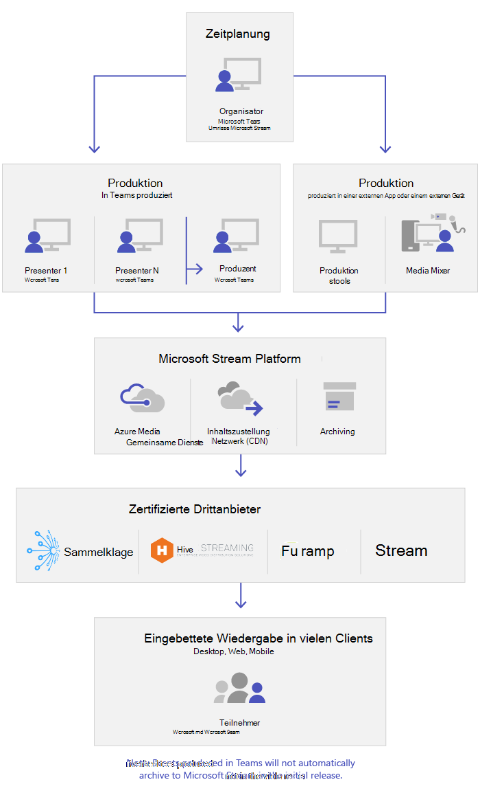

# Was sind Live-Events in Microsoft Teams?What are Microsoft Teams live events

## ÜbersichtOverview

Mit Teams-Liveereignissen können Benutzer in Ihrer Organisation Video- und Besprechungsinhalte für ein großes Onlinepublikum übertragen.With Teams live events, users in your organization can broadcast video and meeting content to large online audiences.

Mit Microsoft 365-Live Ereignissen können Sie Live-Videoübertragungen auf eine neue Ebene führen.Microsoft 365 live events bring live video streaming to a new level. Live-Events fördern die Verbindung über den gesamten Lebenszyklus des Engagements mit Teilnehmern vor, während und nach Live-Ereignissen.Live events encourage connection throughout the entire engagement lifecycle with attendees before, during, and after live events. Mit Microsoft Stream, Teams oder Yammer können Sie ein Liveereignis erstellen, wo auch immer Ihr Publikum, Ihr Team oder Ihre Gemeinschaft ansässig ist.You can create a live event wherever your audience, team, or community resides, using Microsoft Stream, Teams, or Yammer.  

Teams bietet Chat-basierte Zusammenarbeit, Anrufe, Besprechungen und Liveereignisse, sodass Sie das Publikum Ihrer Besprechungen vergrößern können.Teams delivers chat-based collaboration, calling, meetings, and live events, so you can expand the audience of your meetings. Teams-Liveereignisse sind eine Erweiterung von Teams-Besprechungen und ermöglichen den Benutzern, Video- und Besprechungsinhalte für ein großes Onlinepublikum zu übertragen.Teams live events is an extension of Teams meetings, enabling users to broadcast video and meeting content to a large online audience. Live-Ereignisse sind für eine 1: n-Kommunikation vorgesehen, bei der der Gastgeber des Ereignisses die Interaktionen führt und die Teilnahme am Publikum in erster Linie dazu dient, die vom Host freigegebenen Inhalte anzuzeigen.Live events are meant for one-to-many communications where the host of the event is leading the interactions and audience participation is primarily to view the content shared by host. Die Teilnehmer können das Live-oder aufgezeichnete Ereignis in "jammern", "Teams" und/oder "Stream" verfolgen und mit moderierten Q-& einer Unterhaltung oder einer jammern-Konversation mit den Referenten interagieren.The attendees can watch the live or recorded event in Yammer, Teams, and/or Stream and can interact with the presenters using moderated Q & A or a Yammer conversation.

Liveereignisse in Teams gelten als die nächste Version von Skype Meeting Broadcast und werden letzten Endes die darin bereitgestellten Funktionen ersetzen.Teams live events are considered the next version of Skype Meeting Broadcast and will eventually replace the capabilities provided in Skype Meeting Broadcast. Aktuell wird Microsoft weiterhin Skype Meeting Broadcast für Benutzer unterstützen, die Skype for Business in ihren Organisationen nutzen, ohne Unterbrechung des Dienstes für neue oder zukünftige Ereignisse.At this point, Microsoft will continue to support Skype Meeting Broadcast for users who are using Skype for Business in their organizations, with no disruption in service for new or future events. Wir empfehlen Ihnen jedoch, die Teams-Liveereignisse auszuprobieren, um all die neuen und aufregenden Funktionen zu nutzen, darunter die Bildschirmübertragung und Unterstützung für externe Hardware-/Software-Encoder.However, we encourage you to try out Teams live events to leverage all the new and exciting features including screen sharing and support for external hardware/software encoders.

Fangen wir also an.So, let's get started. Sehen Sie sich zunächst das folgende Diagramm an, in dem die Komponenten auf hoher Ebene, die an Microsoft 365-Live Ereignissen beteiligt sind und wie diese verbunden sind, angezeigt werden.First, take a look at the following diagram that shows high level components involved in Microsoft 365 live events and how they're connected.

### Rollen der EreignisgruppeEvent group roles

Liveereignisse in Teams ermöglichen mehreren Rollen (Organisator, Produzent, Referent und Teilnehmer), ein Ereignis erfolgreich zu übertragen und daran teilzunehmen.Live events in Teams empowers multiple roles (organizer, producer, presenter, and attendee) to successfully broadcast and participate in an event. Weitere Informationen hierzu finden Sie unter [Rollen der Ereignisgruppe](https://support.office.com/article/get-started-with-microsoft-teams-live-events-d077fec2-a058-483e-9ab5-1494afda578a?ui=en-US&rs=en-US&ad=US#bkmk_roles).To learn more, see [Event group roles](https://support.office.com/article/get-started-with-microsoft-teams-live-events-d077fec2-a058-483e-9ab5-1494afda578a?ui=en-US&rs=en-US&ad=US#bkmk_roles).

## SchlüsselkomponentenKey components

Sie können aus dem Bild oben sehen, dass es fünf wichtige Komponenten gibt, die in Teams für Live-Ereignisse verwendet werden.You can see from the picture above that there are five key components that are used with live events in Teams.

> [!NOTE]
> Eine Übersicht darüber, wie Sie Liveereignisse und die Teilnehmerumgebung einrichten, erhalten Sie in diesen kurzen [Videos](https://support.office.com/article/video-plan-and-schedule-a-live-event-f92363a0-6d98-46d2-bdd9-f2248075e502).For an overview of how to set up live events and the attendee experience, check out these short [videos](https://support.office.com/article/video-plan-and-schedule-a-live-event-f92363a0-6d98-46d2-bdd9-f2248075e502).

### ZeitplanungScheduling

Teams bietet Organisatoren die Möglichkeit, ein Ereignis mit den entsprechenden Teilnehmerrechten zu erstellen, Teammitglieder für das Ereignis zu bestimmen, eine Produktionsmethode auszuwählen und Teilnehmer einzuladen.Teams provides the ability for the organizers to create an event with the appropriate attendee permissions, designate event team members, select a production method, and invite attendees. Wenn das Liveereignis aus einer Yammer-Gruppe heraus erstellt wurde, können die Teilnehmer des Liveereignisses das Yammer-Gespräch für die Interaktion mit Personen des Ereignisses nutzen.If the live event was created from within a Yammer group, the live event attendees will be able to use Yammer conversation for interacting with people in the event.

### ProduktionProduction

Die Videoeingabe ist die Grundlage des Liveereignisses und kann von einer einzelnen Webcam bis zu einer professionellen Videoproduktion mit mehreren Kameras variieren.The video input is the foundation of the live event and it can vary from a single webcam to a multi-camera professional video production. Die Liveereignisse in Microsoft 365 unterstützen ein Spektrum von Produktionsszenarien, einschließlich einer Veranstaltung, die in Teams mit einer Webcam produziert wird, oder einer Veranstaltung, die in einer externen Anwendung oder einem externen Gerät produziert wird.The live events in Microsoft 365 support a spectrum of production scenarios, include an event produced in Teams using a webcam or an event produced in an external app or device. Sie können diese Optionen abhängig von den Projektanforderungen und dem Budget auswählen.You can choose these options depending on their project requirements and budget. Es gibt zwei Möglichkeiten zum Produzieren von Ereignissen:There are two ways to produce events:

- **Teams**: Diese Produktionsmethode ermöglicht Benutzern, ihre Liveereignisse in Teams mit ihrer Webcam oder einem Audio-Video-Eingang von Teams-Raumsysteme zu produzieren.**Teams**: This production method allows users to produce their live events in Teams using their webcam or using A/V input from Teams room systems. Diese Option ist die beste und schnellste Option, wenn Sie die an den PC angeschlossenen Audio- und Videogeräte verwenden möchten oder wenn Sie Remotereferenten zur Teilnahme am Ereignis einladen.This option is the best and quickest option if you want to use the audio and video devices connected to the PC or are inviting remote presenters to participate in the event. Diese Option ermöglicht den Benutzern, ihre Webcam einfach zu benutzen und ihren Bildschirm als Eingabe beim Ereignis freizugeben.This option allows users to easily use their webcams and share their screen as input in the event.

    

- **Externe Apps oder Geräte**: Externe Encoder ermöglichen Benutzern, ihre Liveereignisse direkt von einem externen hardware- oder softwarebasierten Encoder aus mit [Stream](https://stream.microsoft.com) zu produzieren.**External app or device**: External encoders allow users to produce their live events directly from an external hardware or software-based encoder with [Stream](https://stream.microsoft.com). Diese Option ist am besten, wenn Sie bereits über Geräte mit Studioqualität verfügen (z. B. Medien-Mixer), die das Streaming an einen RTMP-Dienst (Real-time Messaging Protocol) unterstützen.This option is best if you already have studio quality equipment (for example, media mixers) which support streaming to a Real-time Messaging Protocol (RTMP) service. Diese Art der Produktion wird in der Regel in großflächigen Ereignissen wie exekutiven Stadthallen verwendet, in denen ein einzelner Datenstrom von einem Medien Mixer an das Publikum übertragen wird.This type of production is typically used in large-scale events such as executive town halls – where a single stream from a media mixer is broadcasted to the audience.

    

>[!Note]
> Der Wechsel von Microsoft Stream zu [OneDrive for Business und SharePoint für Besprechungsaufzeichnungen](../tmr-meeting-recording-change.md) erfolgt schrittweise.The change from using Microsoft Stream to [OneDrive for Business and SharePoint for meeting recordings](../tmr-meeting-recording-change.md) will be a phased approach. Bei der Markteinführung können Sie sich optional für diese Erfahrung anmelden. Im November müssen Sie sich abmelden, wenn Sie Stream weiterhin nutzen möchten. Ab Anfang 2021 werden wir von allen Kunden die Verwendung von OneDrive for Business und Microsoft Office SharePoint Online für neue Besprechungsaufzeichnungen verlangen.At launch you'll be able to opt-in to this experience, in November you'll have to opt-out if you want to continue using Stream, and some time in early 2021 we'll require all customers to use OneDrive for Business and SharePoint for new meeting recordings.

### Streaming-PlattformStreaming platform

Die Liveereignis-Streamingplattform besteht aus den folgenden Bestandteilen:The live event streaming platform is made up of the following pieces:

- **Azure Media Services**: [Azure Media Services](https://docs.microsoft.com/azure/media-services/previous/) bietet Videostreamingdienste mit Sendequalität, um auf den beliebtesten Mobilgeräten von heute ein größeres Publikum zu erreichen.**Azure Media Services**:  [Azure Media Services](https://docs.microsoft.com/azure/media-services/previous/) gives you broadcast-quality video streaming services to reach larger audiences on today’s most popular mobile devices. Mediendienste verbessern die Zugänglichkeit, Verbreitung und Skalierbarkeit und machen das Streamen von Inhalten für Ihr lokales oder weltweites Publikum einfach und kostengünstig – und das alles bei gleichzeitigem Schutz Ihrer Inhalte.Media Services enhances accessibility, distribution, and scalability, and makes it easy and cost-effective to stream content to your local or worldwide audiences — all while protecting your content.
- **Azure Content Delivery Network (CDN)**: Sobald der Stream angeschaltet wird, wird er über das [Azure Content Delivery Network (CDN)](https://docs.microsoft.com/azure/cdn/) bereitgestellt.**Azure Content Delivery Network (CDN)**:  Once your stream goes live, it's delivered through the [Azure Content Delivery Network (CDN)](https://docs.microsoft.com/azure/cdn/). Azure Media Services bietet ein integriertes CDN für Streaming-Endpunkte.Azure Media Services provides integrated CDN for streaming endpoints. Dadurch können die Streams weltweit ohne Pufferung angezeigt werden.This allows the streams to be viewed worldwide with no buffering.

### Enterprise Content Delivery Network (eCDN)Enterprise Content Delivery Network (eCDN)

Das Ziel des eCDN ist, die Videoinhalte aus dem Internet zu übernehmen und sie in Ihrem gesamten Unternehmen zu verteilen, ohne die Netzwerkleistung zu beeinträchtigen.The goal of eCDN is to take the video content from the internet and distribute the content throughout your enterprise without impacting network performance. Sie können einen der folgenden zertifizierten eCDN-Partner verwenden, um Ihr Netzwerk für Liveereignisse in Ihrer Organisation zu optimieren:You can use one of the following certified eCDN partners to optimize your network for live events held within your organization:

- [HiveHive](https://www.hivestreaming.com/partners/integration-partners/microsoft/)
- [KollectiveKollective](https://kollective.com/ecdn-solutions/microsoft-live-events/)
- [RampRamp](https://rampecdn.com)
- [RiverbedRiverbed](https://www.riverbed.com/solutions/office-365.html)

### TeilnehmerumgebungAttendee experience

Die Erfahrung der Teilnehmer ist der wichtigste Aspekt von Liveereignissen, und es ist entscheidend, dass die Teilnehmer ohne Probleme daran teilnehmen können.The attendee experience is the most important aspect of live events and it's critical that the attendees can participate in the live event without having any issues. Die Teilnehmerumgebung nutzt den Stream Player (für Ereignisse, die in Teams produziert werden) und den Azure Media Player (für Ereignisse, die in einer externen Anwendung oder einem externen Gerät produziert werden) und funktioniert auf dem Desktop, im Browser und auf mobilen Geräten (iOS, Android).The attendee experience uses Stream Player (for events produced in Teams) and Azure Media Player (for events produced in an external app or device) and works across desktop, browser, and mobile (iOS, Android). Microsoft 365 und Office 365 bieten jammern und Teams zwei Zusammenarbeit-Hubs, und die Live-Teilnehmer-Erfahrung ist in diese Tools für die Zusammenarbeit integriert.Microsoft 365 and Office 365 provide Yammer and Teams as two collaboration hubs, and the live attendee experience is integrated into these collaboration tools.

### Liveereignis-NutzungsberichtLive event usage report

Mandantenadministratoren können Echtzeit-Nutzungsanalysen für Live-Ereignisse im Microsoft Teams Admin Center anzeigen.Tenant admins can view real-time usage analytics for live events in Microsoft Teams admin center.  Der Bericht [Liveereignis-Nutzungsbericht](../teams-analytics-and-reports/teams-live-event-usage-report.md) zeigt die Aktivitätsübersicht der in der Organisation abgehaltenen Liveereignisse an.The [live event usage report](../teams-analytics-and-reports/teams-live-event-usage-report.md) shows the activity overview of the live events held in the organization.  Administratoren können Informationen zur Ereignis Nutzung anzeigen, einschließlich Ereignisstatus, Startzeit, Ansichten und Produktionstyp.Admins can view event usage information, including event status, start time, views, and production type.  

## Nächste SchritteNext steps

Wechseln Sie zum [Plan für Teams-Liveereignisse](plan-for-teams-live-events.md).Go to [Plan for Teams live events](plan-for-teams-live-events.md).

### Verwandte ThemenRelated topics

- [Liveereignisse in Microsoft 365 in Yammer, Microsoft Teams und Microsoft StreamLive events across Microsoft 365 in Yammer, Microsoft Teams, and Microsoft Stream](https://docs.microsoft.com/stream/live-event-m365)
- [Erste Schritte mit Microsoft Teams-LiveereignissenGet started with Microsoft Teams live events](https://support.office.com/article/d077fec2-a058-483e-9ab5-1494afda578a)
- [Liveereignisse in YammerLive events in Yammer](https://support.office.com/article/live-events-in-yammer-4ece0ee2-c268-4636-bf2a-16e454befe57)
- [Liveereignisse in Microsoft StreamLive events in Microsoft Stream](https://docs.microsoft.com/stream/live-event-overview)
