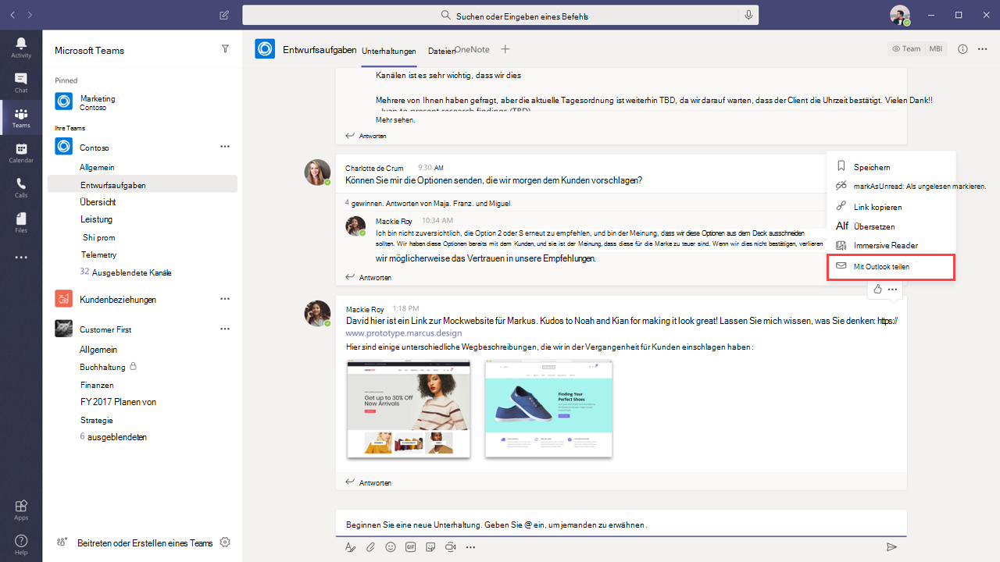

# Teams- und Outlook-E-Mail-Integration

Microsoft Teams umfasst Features, die Benutzern in Ihrer Organisation das Teilen von Informationen zwischen E-Mail in Outlook und Chats oder Kanalunterhaltungen in Teams erleichtern, um so über verpasste Unterhaltungen auf dem Laufenden zu bleiben. Dieser Artikel bietet Ihnen eine Übersicht dieser Features und der zugehörigen Administratorsteuerelemente.

## Mit Outlook teilen

Mithilfe von **Mit Outlook teilen** können Benutzer eine Kopie einer Teams-Unterhaltung mit einer E-Mail in Outlook teilen, ohne dafür Teams verlassen zu müssen. Dieses Feature ist praktisch, wenn Benutzer Unterhaltungen oder Statusaktualisierungen mit Benutzern außerhalb ihres unmittelbaren Teams oder sogar außerhalb Ihrer Organisation teilen müssen. Wechseln Sie in Teams zum Anfang der Unterhaltung, wählen Sie **˙˙˙Weitere Optionen** aus, und wählen Sie dann **Mit Outlook teilen** aus.  Weitere Informationen finden Sie unter [Aus Teams mit Outlook teilen](https://support.office.com/article/share-to-outlook-from-teams-f9dabbe9-9e9b-4e35-99dd-2eeeb67c4f6d).

Um dieses Feature zu verwenden, muss für den Benutzer Outlook im Web aktiviert sein. Wenn Outlook im Web deaktiviert ist, wird dem Benutzer die Option **Mit Outlook teilen** in Teams nicht angezeigt. Schritte zum Aktivieren und Deaktivieren von Outlook im Web finden Sie unter [Aktivieren oder Deaktivieren von Outlook im Web für ein Postfach](/exchange/recipients-in-exchange-online/manage-user-mailboxes/enable-or-disable-outlook-web-app).

## E-Mails mit Aktionen erfordernden Aktivitäten

Benutzer erhalten automatisch E-Mails über verpasste, Aktionen erfordernde Aktivitäten, die ihnen helfen, sich über verpasste Unterhaltungen in Teams zu informieren. In den E-Mails über verpasste Aktivitäten werden die neuesten Antworten aus einer Unterhaltung angezeigt, einschließlich der Nachrichten, die nach der verpassten Nachricht gesendet wurden, und Benutzer können auf **Antworten** klicken, um direkt aus Outlook heraus zu antworten. Weitere Informationen finden Sie unter [Antworten auf E-Mails über verpasste Aktivitäten aus Outlook](https://support.office.com/article/reply-to-missed-activity-emails-from-outlook-bc0cf587-db26-4946-aac7-8eebd84f1381). 

> [!NOTE]
> Dieses Feature wird in Outlook für Mac oder einigen älteren Versionen von Outlook für Windows nicht unterstützt. Weitere Informationen finden Sie unter [Aktionen erfordernde Nachrichten in Outlook und Office 365-Gruppen](/outlook/actionable-messages/).

Sie können das Cmdlet [Set-OrganizationConfig](/powershell/module/exchange/organization/set-organizationconfig) zusammen mit dem Parameter **SmtpActionableMessagesEnabled** verwenden, um Aktionen erfordernde E-Mails zu deaktivieren. Standardmäßig ist der Parameter **SmtpActionableMessagesEnabled** auf **true** festgelegt. Wenn Sie den Parameter auf **false** festlegen, werden Aktionen erfordernde E-Mail-Nachrichten in ganz Office 365 deaktiviert. Für Teams-Benutzer bedeutet dies, dass die Option **Antworten**, um direkt in Outlook zu antworten, in E-Mails über verpasste Aktivitäten nicht verfügbar ist. Stattdessen enthalten die E-Mails über verpasste Aktivitäten eine Option **In Teams antworten**, über die Benutzer in Teams antworten können.

Weitere Informationen finden Sie unter [Aktionen erfordernde Nachrichten in Outlook und Office 365-Gruppen](https://docs.microsoft.com/outlook/actionable-messages/).
