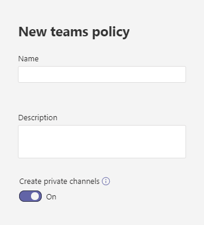

# Verwalten von Kanalrichtlinien in Microsoft Teams

Als Administrator können Sie mithilfe von Teamrichtlinien in Microsoft Teams steuern, wozu Benutzer in Ihrer Organisation in Teams und Kanälen berechtigt sind. So können Sie beispielsweise festlegen, ob Benutzer private Kanäle erstellen dürfen.

Zum Verwalten von Teamrichtlinien wechseln Sie im Microsoft Teams Admin Center zu **Teams** > **Teamrichtlinien**. Sie können die globale (organisationsweite Standard-) Richtlinie verwenden oder benutzerdefinierte Richtlinien erstellen und zuweisen. Sofern Sie keine benutzerdefinierte Richtlinie erstellen und zuweisen, wird Benutzern in Ihrer Organisation automatisch die globale Standardrichtlinie zugewiesen.

Sie können die globale Standardrichtlinie bearbeiten oder eine benutzerdefinierte Richtlinie erstellen und zuweisen. Nachdem Sie die globale Richtlinie bearbeitet oder eine Richtlinie zugewiesen haben, kann es einige Stunden dauern, bis die Änderungen wirksam werden.

## Erstellen einer benutzerdefinierten Teamrichtlinie.

1. Wechseln Sie in der linken Navigationsleiste des Microsoft Teams Admin Centers zu **Teams** > **Teamrichtlinien**.
2. Klicken Sie auf **Hinzufügen**.
3. Geben Sie eine Bezeichnung und eine Beschreibung für die Richtlinie ein.

    
4. Aktivieren oder deaktivieren Sie private  Kanäle **erstellen**, je nachdem, ob Sie Benutzern das Erstellen privater Kanäle gestatten möchten.

5. Klicken Sie auf **Speichern**.

## Bearbeiten einer Teamrichtlinie

Sie können die globale Standardrichtlinie bearbeiten oder eine von Ihnen erstellte, benutzerdefinierte Richtlinie zuweisen.

1. Wechseln Sie in der linken Navigationsleiste des Microsoft Teams Admin Centers zu **Teams** > **Teamrichtlinien**.
2. Wählen Sie die Richtlinie aus, indem Sie zunächst links neben die Richtlinienbezeichnung und dann auf **Bearbeiten** klicken.
3. Aktivieren oder deaktivieren Sie die gewünschten Einstellungen, und klicken Sie dann auf **Speichern**.

## Zuweisen einer benutzerdefinierten Teamrichtlinie an Benutzer

[!INCLUDE [assign-policy](includes/assign-policy.md)]

## Verwandte Themen

[Verwalten Teams verbundener Websites und Kanalwebsites](/SharePoint/teams-connected-sites)

[Private Kanäle in Teams](private-channels.md)

[Benutzern in Microsoft Teams Richtlinien zuweisen](assign-policies.md)

[New-CsTeamsChannelsPolicy](/powershell/module/skype/new-csteamschannelspolicy?view=skype-ps)
