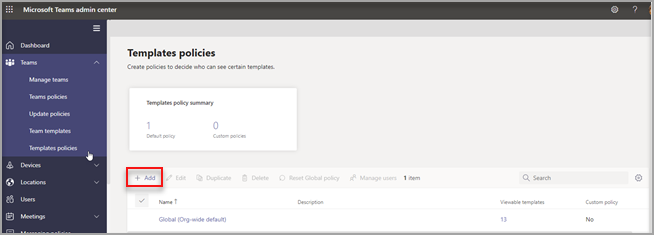

# Verwalten von Teams-Vorlagen im Admin Center

Verwalten Sie die Teams-Vorlagen, die Ihren Endbenutzern angezeigt werden, indem Sie Vorlagenrichtlinien im Admin Center erstellen. Innerhalb jeder Vorlagenrichtlinie können Sie festlegen, welche Vorlagen angezeigt oder ausgeblendet werden.
Weisen Sie verschiedenen Vorlagenrichtlinien unterschiedliche Benutzer zu, damit ihre Benutzer nur die teilmenge der angegebenen Teams-Vorlagen anzeigen.

In diesem kurzen Video erfahren Sie, wie Vorlagenrichtlinien verwaltet werden.

> [!VIDEO https://www.microsoft.com/videoplayer/embed/RWyXL9]

## Erstellen von Vorlagenrichtlinien und Zuweisen verfügbarer Vorlagen

1. Melden Sie sich beim Microsoft Teams Admin Center an.

2. Erweitern **Sie Richtlinien für**  >  **Teams-Vorlagen.**

3. Klicken Sie auf **Hinzufügen**.

    

1. Füllen Sie **im Abschnitt Vorlagenrichtlinieneinstellungen** die folgenden Felder aus:

    - Vorlagenrichtlinienname

    - Kurzbeschreibung "Vorlagenrichtlinie"

2. Wählen Sie **in der Tabelle** Ansichtsvorlagen die Vorlagen aus, die Sie ausblenden möchten, und wählen Sie Ausblenden **aus.**

    

    Sie können die Vorlagen sehen, die Sie ausgewählt haben, um sie in der Tabelle **Ausgeblendete Vorlagen** auszublenden.

1. Wenn Sie bestimmte Vorlagen ein-/ausdingen, scrollen Sie zur **Tabelle Ausgeblendete** Vorlagen.

2. Wählen Sie die Vorlagen aus, die ein-/aus- und dann **Anzeigen aus.**

   

   Die ausgewählten Vorlagen werden in der Tabelle **"Anzeigebare Vorlagen"** angezeigt.
3. Klicken Sie auf **Speichern**.

   Ihre neue Vorlagenrichtlinie wird in der Liste **Vorlagenrichtlinien** angezeigt.

## Zuweisen von Benutzern zu den Vorlagenrichtlinien

Benutzer, die einer Richtlinie zugewiesen sind, können nur die angezeigten Vorlagen innerhalb dieser Richtlinie anzeigen.

1. Wählen **Sie unter Vorlagenrichtlinien** eine Richtlinie und dann **Benutzer verwalten aus.**

2. Geben Sie die Benutzer ein, die dieser Richtlinie zugewiesen werden.

   

3. Wählen Sie **Übernehmen aus.**

> [!Note]
> Es kann bis zu 24 Stunden dauern, bis ihre neue Richtlinie für Endbenutzer wirksam wird.

## Größenbeschränkungen für Vorlagenrichtlinien

Sie können maximal 100 Vorlagen pro Richtlinie ausblenden. Die **Schaltfläche** Ausblenden ist deaktiviert, wenn die angegebene Richtlinie bereits 100 Vorlagen ausgeblendet hat.

## Häufig gestellte Fragen

**F: Kann ich Teamvorlagenrichtlinien Benutzer batchweise zuweisen?**
  
A: Ja, wir unterstützen die Batchzuordnung für die Vorlagenrichtlinie in PowerShell. Der Richtlinientyp für diese Aktion ist TeamsTemplatePermissionPolicy. [Weitere Informationen](/powershell/module/teams/new-csbatchpolicyassignmentoperation)

**F: Können Gruppen Teamvorlagenrichtlinien zugewiesen werden?**

A: Derzeit nein. Diese Funktionalität wird in Zukunft verfügbar sein.

**F: Wenn eine neue Vorlage erstellt wird, wird die Vorlage in meine Richtlinien einbezogen?**

A: Alle neuen Vorlagen sind standardmäßig sichtbar. Sie können die Vorlage im Admin Center im Abschnitt Vorlagenrichtlinien ausblenden.

**F: Was geschieht, wenn eine Vorlage gelöscht wird?**

A: Alle gelöschten Vorlagen sind in den Vorlagenrichtlinien nicht mehr vorhanden.

**F: Kann ich einer Vorlagenrichtlinie im Teams Admin Center mehrere Benutzer zuweisen?**

A: Ja.

1. Wechseln Sie im Admin Center zu **Benutzer**.
1. Wählen Sie in der Listentabelle Benutzer die Benutzer aus, die Sie einer bestimmten Vorlagenrichtlinie zuweisen möchten.
1. Wählen Sie Einstellungen bearbeiten aus, und ändern Sie das Feld Vorlagenrichtlinien.
1. Wählen Sie Übernehmen aus.
   Weitere [Informationen: Zuweisen von Richtlinien zu Ihren Benutzern in Microsoft Teams – Microsoft Teams \| Microsoft Docs](./assign-policies.md#assign-a-policy-to-a-batch-of-users).

**F: Wie kann ich alle Benutzer anzeigen, die einer bestimmten Richtlinie zugewiesen sind?**

A: Im Admin Center:

1. Wechseln Sie zum **Abschnitt Benutzer.**
2. Wählen Sie den Filter in der Listentabelle Benutzer aus, und filtern Sie nach der Vorlagenrichtlinie für Teams.
3. Wählen Sie **Übernehmen aus.**

**F: Kann ich Vorlagenrichtlinien über PowerShell verwalten?**

A: Nein, das Verwalten von Vorlagen in PowerShell wird nicht unterstützt.

**F: Gelten Vorlagenrichtlinien für EDU?**

A: Nein, Vorlagenrichtlinien für EDU werden nicht unterstützt.

## Verwandte Themen

- [Erste Schritte mit Teamvorlagen im Admin Center](./get-started-with-teams-templates-in-the-admin-console.md)

- [Erstellen einer benutzerdefinierten Teamvorlage](./create-a-team-template.md)

- [Erstellen einer Vorlage aus einem vorhandenen Team](./create-template-from-existing-team.md)

- [Erstellen einer Teamvorlage aus einer vorhandenen Teamvorlage](./create-template-from-existing-template.md)

- [Zuweisen von Richtlinien zu Ihren Benutzern in Microsoft Teams – Microsoft Teams \| Microsoft Docs](./assign-policies.md)

- [Batch zuweisen von Benutzern zu einer Richtlinie](/powershell/module/teams/new-csbatchpolicyassignmentoperation)